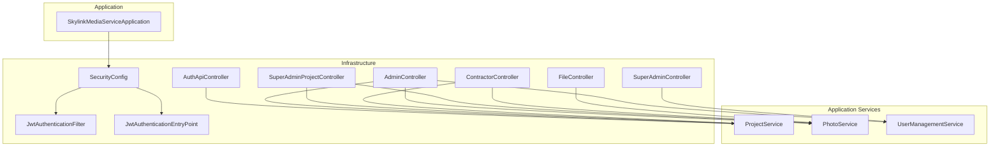
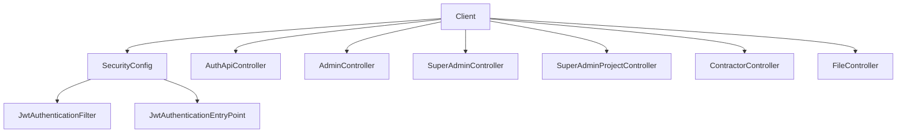
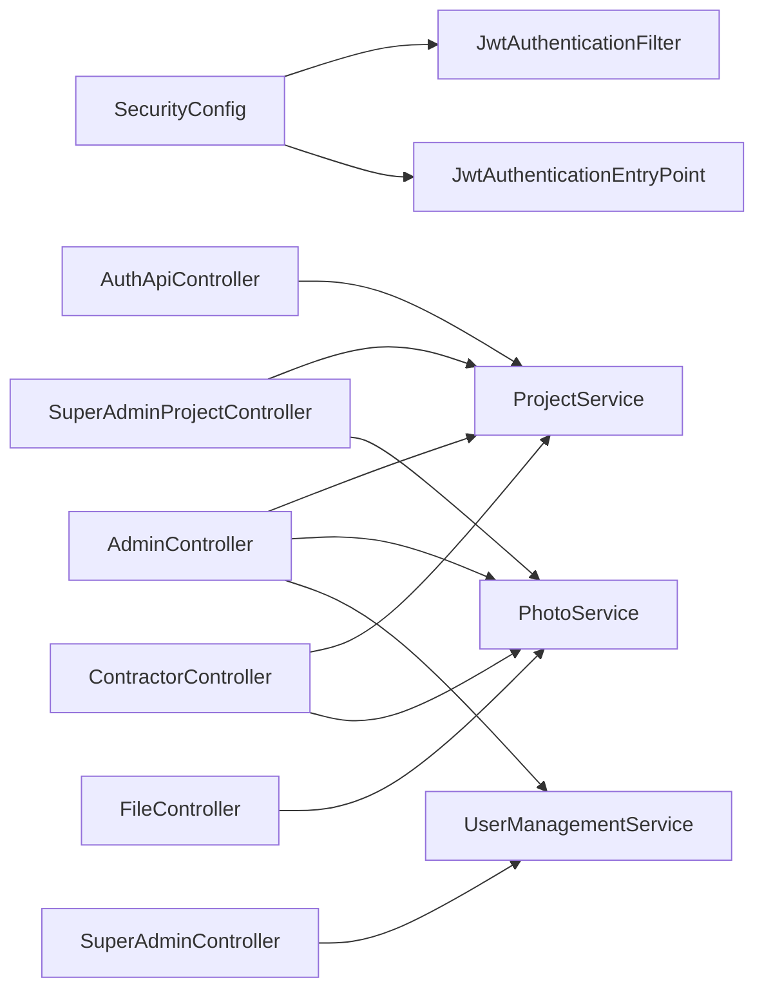

# API Reference

<cite>
**Referenced Files in This Document**
- [SkylinkMediaServiceApplication.java](file://src/main/java/root/cyb/mh/skylink_media_service/SkylinkMediaServiceApplication.java)
- [AuthApiController.java](file://src/main/java/root/cyb/mh/skylink_media_service/infrastructure/web/api/AuthApiController.java)
- [AuthController.java](file://src/main/java/root/cyb/mh/skylink_media_service/infrastructure/web/AuthController.java)
- [ContractorController.java](file://src/main/java/root/cyb/mh/skylink_media_service/infrastructure/web/ContractorController.java)
- [AdminController.java](file://src/main/java/root/cyb/mh/skylink_media_service/infrastructure/web/AdminController.java)
- [SuperAdminController.java](file://src/main/java/root/cyb/mh/skylink_media_service/infrastructure/web/SuperAdminController.java)
- [SuperAdminProjectController.java](file://src/main/java/root/cyb/mh/skylink_media_service/infrastructure/web/SuperAdminProjectController.java)
- [FileController.java](file://src/main/java/root/cyb/mh/skylink_media_service/infrastructure/web/FileController.java)
- [LoginRequest.java](file://src/main/java/root/cyb/mh/skylink_media_service/application/dto/api/LoginRequest.java)
- [LoginResponse.java](file://src/main/java/root/cyb/mh/skylink_media_service/application/dto/api/LoginResponse.java)
- [ErrorResponse.java](file://src/main/java/root/cyb/mh/skylink_media_service/application/dto/api/ErrorResponse.java)
- [SecurityConfig.java](file://src/main/java/root/cyb/mh/skylink_media_service/infrastructure/security/SecurityConfig.java)
- [JwtAuthenticationEntryPoint.java](file://src/main/java/root/cyb/mh/skylink_media_service/infrastructure/security/jwt/JwtAuthenticationEntryPoint.java)
- [JwtAuthenticationFilter.java](file://src/main/java/root/cyb/mh/skylink_media_service/infrastructure/security/jwt/JwtAuthenticationFilter.java)
- [ProjectDTO.java](file://src/main/java/root/cyb/mh/skylink_media_service/application/dto/ProjectDTO.java)
- [ProjectSearchCriteria.java](file://src/main/java/root/cyb/mh/skylink_media_service/application/dto/ProjectSearchCriteria.java)
- [ProjectService.java](file://src/main/java/root/cyb/mh/skylink_media_service/application/services/ProjectService.java)
- [PhotoService.java](file://src/main/java/root/cyb/mh/skylink_media_service/application/services/PhotoService.java)
- [UserManagementService.java](file://src/main/java/root/cyb/mh/skylink_media_service/application/services/UserManagementService.java)
</cite>

## Table of Contents
1. [Introduction](#introduction)
2. [Project Structure](#project-structure)
3. [Core Components](#core-components)
4. [Architecture Overview](#architecture-overview)
5. [Detailed Component Analysis](#detailed-component-analysis)
6. [Dependency Analysis](#dependency-analysis)
7. [Performance Considerations](#performance-considerations)
8. [Troubleshooting Guide](#troubleshooting-guide)
9. [Conclusion](#conclusion)

## Introduction
This document provides comprehensive API documentation for the Skylink Media Service backend. It covers authentication endpoints, contractor-specific dashboards and interactions, admin and super admin administrative capabilities, and photo management endpoints. For each endpoint, we specify HTTP methods, URL patterns, request/response schemas, authentication requirements, and typical error responses. Practical examples and parameter descriptions are included to aid integration.

## Project Structure
The backend is a Spring Boot application with layered architecture:
- Application bootstrap and scheduling enablement
- Infrastructure layer with web controllers, security, persistence, and storage
- Application layer with services and use cases
- Domain layer with entities and value objects
- Resources for templates and configuration

**Diagram sources**
- [SkylinkMediaServiceApplication.java:1-18](file://src/main/java/root/cyb/mh/skylink_media_service/SkylinkMediaServiceApplication.java#L1-L18)
- [SecurityConfig.java:1-104](file://src/main/java/root/cyb/mh/skylink_media_service/infrastructure/security/SecurityConfig.java#L1-L104)
- [JwtAuthenticationFilter.java:1-70](file://src/main/java/root/cyb/mh/skylink_media_service/infrastructure/security/jwt/JwtAuthenticationFilter.java#L1-L70)
- [JwtAuthenticationEntryPoint.java:1-36](file://src/main/java/root/cyb/mh/skylink_media_service/infrastructure/security/jwt/JwtAuthenticationEntryPoint.java#L1-L36)
- [AuthApiController.java:1-34](file://src/main/java/root/cyb/mh/skylink_media_service/infrastructure/web/api/AuthApiController.java#L1-L34)
- [AdminController.java:1-775](file://src/main/java/root/cyb/mh/skylink_media_service/infrastructure/web/AdminController.java#L1-L775)
- [SuperAdminController.java:1-483](file://src/main/java/root/cyb/mh/skylink_media_service/infrastructure/web/SuperAdminController.java#L1-L483)
- [SuperAdminProjectController.java:1-307](file://src/main/java/root/cyb/mh/skylink_media_service/infrastructure/web/SuperAdminProjectController.java#L1-L307)
- [ContractorController.java:1-258](file://src/main/java/root/cyb/mh/skylink_media_service/infrastructure/web/ContractorController.java#L1-L258)
- [FileController.java:1-84](file://src/main/java/root/cyb/mh/skylink_media_service/infrastructure/web/FileController.java#L1-L84)
- [ProjectService.java:1-419](file://src/main/java/root/cyb/mh/skylink_media_service/application/services/ProjectService.java#L1-L419)
- [PhotoService.java:1-116](file://src/main/java/root/cyb/mh/skylink_media_service/application/services/PhotoService.java#L1-L116)
- [UserManagementService.java:1-351](file://src/main/java/root/cyb/mh/skylink_media_service/application/services/UserManagementService.java#L1-L351)

**Section sources**
- [SkylinkMediaServiceApplication.java:1-18](file://src/main/java/root/cyb/mh/skylink_media_service/SkylinkMediaServiceApplication.java#L1-L18)
- [SecurityConfig.java:1-104](file://src/main/java/root/cyb/mh/skylink_media_service/infrastructure/security/SecurityConfig.java#L1-L104)

## Core Components
- Authentication subsystem: JWT-based authentication for contractor login; Spring Security filter chain and entry point for unauthorized requests.
- Controllers:
  - AuthApiController: contractor login endpoint
  - AdminController: admin dashboards, project management, contractor management, chat, exports
  - SuperAdminController: super admin user management, audit logs, live monitor, profile management
  - SuperAdminProjectController: super admin project listing, detail, chat, photos, creation
  - ContractorController: contractor dashboard, project actions, photo upload and viewing, chat
  - FileController: static file serving for uploads and thumbnails
- Services:
  - ProjectService: CRUD, search, contractor assignment/unassignment, status updates
  - PhotoService: upload, retrieval, batch selection
  - UserManagementService: user listing, blocking/unblocking/deletion, profile updates, password resets

**Section sources**
- [AuthApiController.java:1-34](file://src/main/java/root/cyb/mh/skylink_media_service/infrastructure/web/api/AuthApiController.java#L1-L34)
- [SecurityConfig.java:1-104](file://src/main/java/root/cyb/mh/skylink_media_service/infrastructure/security/SecurityConfig.java#L1-L104)
- [JwtAuthenticationFilter.java:1-70](file://src/main/java/root/cyb/mh/skylink_media_service/infrastructure/security/jwt/JwtAuthenticationFilter.java#L1-L70)
- [JwtAuthenticationEntryPoint.java:1-36](file://src/main/java/root/cyb/mh/skylink_media_service/infrastructure/security/jwt/JwtAuthenticationEntryPoint.java#L1-L36)
- [ProjectService.java:1-419](file://src/main/java/root/cyb/mh/skylink_media_service/application/services/ProjectService.java#L1-L419)
- [PhotoService.java:1-116](file://src/main/java/root/cyb/mh/skylink_media_service/application/services/PhotoService.java#L1-L116)
- [UserManagementService.java:1-351](file://src/main/java/root/cyb/mh/skylink_media_service/application/services/UserManagementService.java#L1-L351)

## Architecture Overview
The system enforces role-based access control:
- Public endpoints: authentication and Swagger UI
- Contractor-only endpoints: contractor-specific dashboards and interactions
- Admin-only endpoints: admin dashboards and project management
- Super Admin-only endpoints: user management and system administration
- Static file serving for images and thumbnails

**Diagram sources**
- [SecurityConfig.java:43-87](file://src/main/java/root/cyb/mh/skylink_media_service/infrastructure/security/SecurityConfig.java#L43-L87)
- [JwtAuthenticationFilter.java:32-54](file://src/main/java/root/cyb/mh/skylink_media_service/infrastructure/security/jwt/JwtAuthenticationFilter.java#L32-L54)
- [JwtAuthenticationEntryPoint.java:21-34](file://src/main/java/root/cyb/mh/skylink_media_service/infrastructure/security/jwt/JwtAuthenticationEntryPoint.java#L21-L34)
- [AuthApiController.java:23-32](file://src/main/java/root/cyb/mh/skylink_media_service/infrastructure/web/api/AuthApiController.java#L23-L32)
- [AdminController.java:106-203](file://src/main/java/root/cyb/mh/skylink_media_service/infrastructure/web/AdminController.java#L106-L203)
- [SuperAdminController.java:64-106](file://src/main/java/root/cyb/mh/skylink_media_service/infrastructure/web/SuperAdminController.java#L64-L106)
- [SuperAdminProjectController.java:75-161](file://src/main/java/root/cyb/mh/skylink_media_service/infrastructure/web/SuperAdminProjectController.java#L75-L161)
- [ContractorController.java:71-107](file://src/main/java/root/cyb/mh/skylink_media_service/infrastructure/web/ContractorController.java#L71-L107)
- [FileController.java:21-82](file://src/main/java/root/cyb/mh/skylink_media_service/infrastructure/web/FileController.java#L21-L82)

## Detailed Component Analysis

### Authentication Endpoints
- Base path: /api/v1/auth
- Role: PUBLIC (no JWT required)
- Notes: Supports CORS origins configured via property; Swagger UI endpoints are also public.

Endpoints
- POST /api/v1/auth/login
  - Description: Authenticate contractor with username and password to receive JWT token.
  - Authentication: None
  - Request body: LoginRequest
    - Fields:
      - username: string, required, min length 3, max 50
      - password: string, required, min length 8, max 100
  - Response: LoginResponse
    - Fields:
      - token: string
      - tokenType: string (fixed "Bearer")
      - contractorId: integer
      - fullName: string
      - expiresAt: datetime
      - expiresIn: integer
  - Success: 200 OK
  - Errors: 401 Unauthorized (invalid credentials), 400 Bad Request (validation errors), 500 Internal Server Error (unexpected)
  - Example request:
    - POST /api/v1/auth/login
    - Headers: Content-Type: application/json
    - Body: {"username":"john_doe","password":"securePass123"}
  - Example response:
    - 200 OK
    - Body: {"token":"<JWT>","tokenType":"Bearer","contractorId":123,"fullName":"John Doe","expiresAt":"2025-06-15T10:00:00","expiresIn":3600}

- GET /login (form login)
  - Description: Renders login page for browser-based form authentication.
  - Authentication: None
  - Response: HTML login page

- GET /dashboard (role-aware redirect)
  - Description: Redirects to appropriate dashboard based on user roles.
  - Authentication: Form-based or JWT (depending on request)
  - Roles: SUPER_ADMIN, ADMIN, CONTRACTOR

- POST /logout (form logout)
  - Description: Logs out current user and clears session.
  - Authentication: Form-based
  - Response: Redirect to /login?logout

Security and Authorization
- API endpoints under /api/v1/** require a valid Bearer token.
- Unauthorized API requests return JSON error response with 401.
- CORS allows specific origins and methods for frontend integration.

**Section sources**
- [AuthApiController.java:14-34](file://src/main/java/root/cyb/mh/skylink_media_service/infrastructure/web/api/AuthApiController.java#L14-L34)
- [LoginRequest.java:1-29](file://src/main/java/root/cyb/mh/skylink_media_service/application/dto/api/LoginRequest.java#L1-L29)
- [LoginResponse.java:1-42](file://src/main/java/root/cyb/mh/skylink_media_service/application/dto/api/LoginResponse.java#L1-L42)
- [SecurityConfig.java:49-87](file://src/main/java/root/cyb/mh/skylink_media_service/infrastructure/security/SecurityConfig.java#L49-L87)
- [JwtAuthenticationEntryPoint.java:20-34](file://src/main/java/root/cyb/mh/skylink_media_service/infrastructure/security/jwt/JwtAuthenticationEntryPoint.java#L20-L34)
- [AuthController.java:11-26](file://src/main/java/root/cyb/mh/skylink_media_service/infrastructure/web/AuthController.java#L11-L26)

### Contractor-Specific Endpoints
- Base path: /contractor
- Role: CONTRACTOR

Endpoints
- GET /contractor/dashboard
  - Description: Contractor dashboard with project assignments, photo counts, unread message counts, and available actions.
  - Authentication: JWT (ROLE_CONTRACTOR)
  - Query parameters:
    - projectSearch: optional string
  - Response: HTML dashboard view

- GET /contractor/project/{projectId}/photos
  - Description: View photos for a project the contractor is assigned to.
  - Authentication: JWT (ROLE_CONTRACTOR)
  - Path parameters:
    - projectId: integer, required
  - Response: HTML photos view

- GET /contractor/upload-photo/{projectId}
  - Description: Upload photo form.
  - Authentication: JWT (ROLE_CONTRACTOR)
  - Path parameters:
    - projectId: integer, required
  - Response: HTML upload form

- POST /contractor/upload-photo/{projectId}
  - Description: Upload one or more photos to a project.
  - Authentication: JWT (ROLE_CONTRACTOR)
  - Path parameters:
    - projectId: integer, required
  - Form parameters:
    - files: multipart file array, required
    - category: enum (optional), default "UNCATEGORIZED"
  - Response: Redirect to dashboard with flash attributes

- POST /contractor/project/{projectId}/open
  - Description: Mark a project as opened by the contractor.
  - Authentication: JWT (ROLE_CONTRACTOR)
  - Path parameters:
    - projectId: integer, required
  - Response: Redirect to dashboard with flash attributes

- POST /contractor/project/{projectId}/complete
  - Description: Mark a project as complete by the contractor.
  - Authentication: JWT (ROLE_CONTRACTOR)
  - Path parameters:
    - projectId: integer, required
  - Response: Redirect to dashboard with flash attributes

- GET /contractor/project/{projectId}/chat
  - Description: View chat messages for a project and mark as read.
  - Authentication: JWT (ROLE_CONTRACTOR)
  - Path parameters:
    - projectId: integer, required
  - Response: HTML chat view

- POST /contractor/project/{projectId}/chat/send
  - Description: Send a chat message to admins assigned to the project.
  - Authentication: JWT (ROLE_CONTRACTOR)
  - Path parameters:
    - projectId: integer, required
  - Form parameters:
    - content: string, required
  - Response: Redirect to chat page with flash attributes

Notes
- Access is validated against contractor-project assignment.
- Email notifications are sent to assigned WO Admins upon contractor chat messages.

**Section sources**
- [ContractorController.java:71-256](file://src/main/java/root/cyb/mh/skylink_media_service/infrastructure/web/ContractorController.java#L71-L256)
- [ProjectService.java:109-196](file://src/main/java/root/cyb/mh/skylink_media_service/application/services/ProjectService.java#L109-L196)
- [PhotoService.java:46-98](file://src/main/java/root/cyb/mh/skylink_media_service/application/services/PhotoService.java#L46-L98)

### Admin Endpoints
- Base path: /admin
- Role: ADMIN or SUPER_ADMIN

Endpoints
- GET /admin/dashboard
  - Description: Advanced project dashboard with filters, contractor availability, and unread message counts.
  - Authentication: JWT (ADMIN or SUPER_ADMIN)
  - Query parameters:
    - projectSearch: optional string
    - status: optional enum
    - paymentStatus: optional enum
    - dueDateFrom: optional date
    - dueDateTo: optional date
    - priceFrom: optional decimal
    - priceTo: optional decimal
    - contractorId: optional integer
    - contractorSearch: optional string
  - Response: HTML dashboard view

- GET /admin/projects/export
  - Description: Export projects matching filters to CSV.
  - Authentication: JWT (ADMIN or SUPER_ADMIN)
  - Query parameters: same as dashboard filters
  - Response: CSV file attachment

- POST /admin/register-admin
  - Description: Register a new admin user.
  - Authentication: JWT (ADMIN or SUPER_ADMIN)
  - Form parameters:
    - username: string, required
    - password: string, required
    - email: optional string
  - Response: Redirect to registration page with flash attributes

- POST /admin/update-email
  - Description: Update admin notification email.
  - Authentication: JWT (ADMIN or SUPER_ADMIN)
  - Form parameters:
    - email: string, required
  - Response: Redirect to registration page with flash attributes

- GET /admin/create-project
  - Description: Create project form.
  - Authentication: JWT (ADMIN or SUPER_ADMIN)
  - Response: HTML form

- POST /admin/create-project
  - Description: Create a new project with detailed fields.
  - Authentication: JWT (ADMIN or SUPER_ADMIN)
  - Form parameters:
    - workOrderNumber: string, required
    - location: string, required
    - clientCode: string, required
    - description: string, required
    - ppwNumber, workType, workDetails, clientCompany, customer, loanNumber, loanType, address, receivedDate, dueDate, assignedTo, woAdmin, invoicePrice: optional
  - Response: Redirect to dashboard with flash attributes

- GET /admin/create-contractor
  - Description: Create contractor form.
  - Authentication: JWT (ADMIN or SUPER_ADMIN)
  - Response: HTML form

- POST /admin/create-contractor
  - Description: Create a new contractor.
  - Authentication: JWT (ADMIN or SUPER_ADMIN)
  - Form parameters:
    - username: string, required
    - password: string, required
    - fullName: string, required
    - email: optional string
  - Response: Redirect to dashboard with flash attributes

- POST /admin/assign-contractor
  - Description: Assign a contractor to a project.
  - Authentication: JWT (ADMIN or SUPER_ADMIN)
  - Form parameters:
    - projectId: integer, required
    - contractorId: integer, required
  - Response: Redirect to dashboard with flash attributes

- POST /admin/unassign-contractor
  - Description: Unassign a contractor from a project.
  - Authentication: JWT (ADMIN or SUPER_ADMIN)
  - Form parameters:
    - projectId: integer, required
    - contractorId: integer, required
  - Response: Redirect to dashboard with flash attributes

- POST /admin/delete-project/{id}
  - Description: Delete a project (development mode only).
  - Authentication: JWT (ADMIN or SUPER_ADMIN)
  - Path parameters:
    - id: integer, required
  - Response: Redirect to dashboard with flash attributes

- GET /admin/project/{id}/history
  - Description: View audit history for a project (modal content).
  - Authentication: JWT (ADMIN or SUPER_ADMIN)
  - Path parameters:
    - id: integer, required
  - Response: HTML modal partial

- GET /admin/project/{id}/photos
  - Description: View photos for a project with audit logging.
  - Authentication: JWT (ADMIN or SUPER_ADMIN)
  - Path parameters:
    - id: integer, required
  - Response: HTML photos view

- GET /admin/edit-project/{id}
  - Description: Edit project form.
  - Authentication: JWT (ADMIN or SUPER_ADMIN)
  - Path parameters:
    - id: integer, required
  - Response: HTML form

- POST /admin/edit-project/{id}
  - Description: Update project details.
  - Authentication: JWT (ADMIN or SUPER_ADMIN)
  - Path parameters:
    - id: integer, required
  - Form parameters: same as create-project
  - Response: Redirect to dashboard with flash attributes

- POST /admin/change-status/{projectId}
  - Description: Change project status.
  - Authentication: JWT (ADMIN or SUPER_ADMIN)
  - Path parameters:
    - projectId: integer, required
  - Form parameters:
    - status: enum, required
  - Response: Redirect to dashboard with flash attributes

- POST /admin/change-payment-status/{projectId}
  - Description: Change payment status.
  - Authentication: JWT (ADMIN or SUPER_ADMIN)
  - Path parameters:
    - projectId: integer, required
  - Form parameters:
    - paymentStatus: enum, required
  - Response: Redirect to dashboard with flash attributes

- POST /admin/project/{id}/photos/download
  - Description: Download selected photos as a ZIP.
  - Authentication: JWT (ADMIN or SUPER_ADMIN)
  - Path parameters:
    - id: integer, required
  - Form parameters:
    - photoIds: array of integers (optional)
  - Response: ZIP file attachment

- GET /admin/project/{projectId}/chat
  - Description: View chat messages and mark as read.
  - Authentication: JWT (ADMIN or SUPER_ADMIN)
  - Path parameters:
    - projectId: integer, required
  - Response: HTML chat view

- POST /admin/project/{projectId}/chat/send
  - Description: Send a chat message to assigned contractors.
  - Authentication: JWT (ADMIN or SUPER_ADMIN)
  - Path parameters:
    - projectId: integer, required
  - Form parameters:
    - content: string, required
  - Response: Redirect to chat page with flash attributes

- GET /admin/contractors/{contractorId}/edit
  - Description: Edit contractor profile form.
  - Authentication: JWT (ADMIN or SUPER_ADMIN)
  - Path parameters:
    - contractorId: integer, required
  - Response: HTML form

- POST /admin/contractors/{contractorId}/update
  - Description: Update contractor profile and avatar.
  - Authentication: JWT (ADMIN or SUPER_ADMIN)
  - Path parameters:
    - contractorId: integer, required
  - Form parameters:
    - fullName: optional string
    - email: optional string
    - avatar: optional multipart file
  - Response: Redirect to dashboard with flash attributes

- POST /admin/contractors/{contractorId}/change-password
  - Description: Change contractor password.
  - Authentication: JWT (ADMIN or SUPER_ADMIN)
  - Path parameters:
    - contractorId: integer, required
  - Form parameters:
    - newPassword: string, required
    - confirmPassword: string, required
  - Response: Redirect to contractor edit page with flash attributes

Notes
- Business rules enforced:
  - Contractor can be assigned to at most 4 active projects.
  - Projects can only have one active contractor assignment (except CLOSED projects).
- Audit logging is performed for sensitive actions.

**Section sources**
- [AdminController.java:106-775](file://src/main/java/root/cyb/mh/skylink_media_service/infrastructure/web/AdminController.java#L106-L775)
- [ProjectService.java:109-196](file://src/main/java/root/cyb/mh/skylink_media_service/application/services/ProjectService.java#L109-L196)
- [PhotoService.java:100-114](file://src/main/java/root/cyb/mh/skylink_media_service/application/services/PhotoService.java#L100-L114)
- [UserManagementService.java:147-214](file://src/main/java/root/cyb/mh/skylink_media_service/application/services/UserManagementService.java#L147-L214)

### Super Admin Endpoints
- Base path: /super-admin
- Role: SUPER_ADMIN

Endpoints
- GET /super-admin/dashboard
  - Description: System overview with statistics, recent activities, and user presence.
  - Authentication: JWT (SUPER_ADMIN)
  - Response: HTML dashboard view

- GET /super-admin/users
  - Description: Paginated user listing with filtering by user type.
  - Authentication: JWT (SUPER_ADMIN)
  - Query parameters:
    - userType: optional enum (ADMIN, CONTRACTOR, SUPER_ADMIN)
    - search: optional string
    - page: integer, default 0
    - size: integer, default 20
  - Response: HTML users list

- POST /super-admin/users/{id}/block
  - Description: Block a user.
  - Authentication: JWT (SUPER_ADMIN)
  - Path parameters:
    - id: integer, required
  - Form parameters:
    - reason: optional string
  - Response: Redirect to users list with flash attributes

- POST /super-admin/users/{id}/unblock
  - Description: Unblock a user.
  - Authentication: JWT (SUPER_ADMIN)
  - Path parameters:
    - id: integer, required
  - Response: Redirect to users list with flash attributes

- POST /super-admin/users/{id}/delete
  - Description: Delete a user.
  - Authentication: JWT (SUPER_ADMIN)
  - Path parameters:
    - id: integer, required
  - Response: Redirect to users list with flash attributes

- GET /super-admin/create-admin
  - Description: Create admin form.
  - Authentication: JWT (SUPER_ADMIN)
  - Response: HTML form

- POST /super-admin/create-admin
  - Description: Create admin or super admin.
  - Authentication: JWT (SUPER_ADMIN)
  - Form parameters:
    - username: string, required
    - password: string, required
    - email: optional string
    - isSuperAdmin: boolean, default false
  - Response: Redirect to users list with flash attributes

- GET /super-admin/create-contractor
  - Description: Create contractor form.
  - Authentication: JWT (SUPER_ADMIN)
  - Response: HTML form

- POST /super-admin/create-contractor
  - Description: Create contractor.
  - Authentication: JWT (SUPER_ADMIN)
  - Form parameters:
    - username: string, required
    - password: string, required
    - fullName: string, required
    - email: optional string
  - Response: Redirect to users list with flash attributes

- GET /super-admin/audit-logs
  - Description: Paginated audit logs with filtering.
  - Authentication: JWT (SUPER_ADMIN)
  - Query parameters:
    - actionType: optional enum
    - targetType: optional string
    - page: integer, default 0
    - size: integer, default 50
  - Response: HTML audit logs view

- GET /super-admin/login-history
  - Description: Paginated login history with filtering.
  - Authentication: JWT (SUPER_ADMIN)
  - Query parameters:
    - userType: optional enum
    - successful: optional boolean
    - userId: optional integer
    - page: integer, default 0
    - size: integer, default 50
  - Response: HTML login history view

- GET /super-admin/live-monitor
  - Description: Live user presence monitoring.
  - Authentication: JWT (SUPER_ADMIN)
  - Response: HTML live monitor view

- GET /super-admin/profile
  - Description: Super admin profile view.
  - Authentication: JWT (SUPER_ADMIN)
  - Response: HTML profile view

- POST /super-admin/profile/update
  - Description: Update profile email and avatar.
  - Authentication: JWT (SUPER_ADMIN)
  - Form parameters:
    - email: optional string
    - avatar: optional multipart file
  - Response: Redirect to profile with flash attributes

- POST /super-admin/profile/change-password
  - Description: Change own password.
  - Authentication: JWT (SUPER_ADMIN)
  - Form parameters:
    - currentPassword: string, required
    - newPassword: string, required
    - confirmPassword: string, required
  - Response: Redirect to profile with flash attributes

- GET /super-admin/users/{id}/edit
  - Description: Edit user profile form (with restrictions for other super admins).
  - Authentication: JWT (SUPER_ADMIN)
  - Path parameters:
    - id: integer, required
  - Response: HTML edit form

- POST /super-admin/admins/{id}/update
  - Description: Update admin profile and avatar.
  - Authentication: JWT (SUPER_ADMIN)
  - Path parameters:
    - id: integer, required
  - Form parameters:
    - email: optional string
    - avatar: optional multipart file
  - Response: Redirect to users list with flash attributes

- POST /super-admin/contractors/{id}/update
  - Description: Update contractor profile and avatar.
  - Authentication: JWT (SUPER_ADMIN)
  - Path parameters:
    - id: integer, required
  - Form parameters:
    - fullName: optional string
    - email: optional string
    - avatar: optional multipart file
  - Response: Redirect to users list with flash attributes

- POST /super-admin/users/{id}/reset-password
  - Description: Reset user password.
  - Authentication: JWT (SUPER_ADMIN)
  - Path parameters:
    - id: integer, required
  - Form parameters:
    - newPassword: string, required
    - confirmPassword: string, required
  - Response: Redirect to users list with flash attributes

Notes
- Restrictions:
  - Cannot edit another Super Admin’s profile except self.
  - Cannot block or delete Super Admins.
  - Password reset requires minimum length and confirmation.

**Section sources**
- [SuperAdminController.java:64-483](file://src/main/java/root/cyb/mh/skylink_media_service/infrastructure/web/SuperAdminController.java#L64-L483)
- [UserManagementService.java:64-143](file://src/main/java/root/cyb/mh/skylink_media_service/application/services/UserManagementService.java#L64-L143)

### Super Admin Project Endpoints
- Base path: /super-admin (scoped under super admin)
- Role: SUPER_ADMIN

Endpoints
- GET /super-admin/projects
  - Description: Paginated project listing with advanced filters and availability indicators.
  - Authentication: JWT (SUPER_ADMIN)
  - Query parameters:
    - projectSearch: optional string
    - status: optional enum
    - paymentStatus: optional enum
    - dueDateFrom: optional date
    - dueDateTo: optional date
    - priceFrom: optional decimal
    - priceTo: optional decimal
    - contractorId: optional integer
    - page: integer, default 0
    - size: integer, default 20
  - Response: HTML projects list

- GET /super-admin/projects/{id}
  - Description: Project detail with audit logs.
  - Authentication: JWT (SUPER_ADMIN)
  - Path parameters:
    - id: integer, required
  - Response: HTML project detail

- GET /super-admin/projects/{projectId}/chat
  - Description: Project chat view and mark as read.
  - Authentication: JWT (SUPER_ADMIN)
  - Path parameters:
    - projectId: integer, required
  - Response: HTML chat view

- GET /super-admin/projects/{projectId}/photos
  - Description: Project photos with audit logging.
  - Authentication: JWT (SUPER_ADMIN)
  - Path parameters:
    - projectId: integer, required
  - Response: HTML photos view

- GET /super-admin/projects/{projectId}/history
  - Description: Project audit history.
  - Authentication: JWT (SUPER_ADMIN)
  - Path parameters:
    - projectId: integer, required
  - Response: HTML history view

- GET /super-admin/create-project
  - Description: Create project form.
  - Authentication: JWT (SUPER_ADMIN)
  - Response: HTML form

- POST /super-admin/create-project
  - Description: Create a new project with detailed fields.
  - Authentication: JWT (SUPER_ADMIN)
  - Form parameters:
    - workOrderNumber: string, required
    - location: string, required
    - clientCode: string, required
    - description: string, required
    - ppwNumber, workType, workDetails, clientCompany, customer, loanNumber, loanType, address, receivedDate, dueDate, assignedTo, woAdmin, invoicePrice: optional
  - Response: Redirect to projects list with flash attributes

Notes
- Audit logging is performed for views and actions.

**Section sources**
- [SuperAdminProjectController.java:75-307](file://src/main/java/root/cyb/mh/skylink_media_service/infrastructure/web/SuperAdminProjectController.java#L75-L307)
- [ProjectService.java:328-335](file://src/main/java/root/cyb/mh/skylink_media_service/application/services/ProjectService.java#L328-L335)
- [PhotoService.java:100-114](file://src/main/java/root/cyb/mh/skylink_media_service/application/services/PhotoService.java#L100-L114)

### Photo Management Endpoints
- Base path: /uploads, /uploads/avatars, /thumbnails
- Role: PUBLIC (static file serving)

Endpoints
- GET /uploads/{filename}
  - Description: Serve uploaded images with proper content-type and cache headers.
  - Response: Binary image stream or 404

- GET /uploads/avatars/{filename}
  - Description: Serve contractor/admin avatars.
  - Response: Binary image stream or 404

- GET /thumbnails/{filename}
  - Description: Serve thumbnail images.
  - Response: Binary WEBP stream or 404

Notes
- File serving supports JPEG/PNG/GIF and WEBP thumbnails.
- Cache-control headers prevent caching for security-sensitive assets.

**Section sources**
- [FileController.java:21-82](file://src/main/java/root/cyb/mh/skylink_media_service/infrastructure/web/FileController.java#L21-L82)

### Project Management Endpoints (via Admin and Super Admin)
- Base path: /admin and /super-admin
- Role: ADMIN or SUPER_ADMIN

Endpoints
- GET /admin/dashboard and /super-admin/projects
  - Description: Dashboards with advanced search and filters.
  - Query parameters:
    - projectSearch, status, paymentStatus, dueDateFrom, dueDateTo, priceFrom, priceTo, contractorId
    - page, size
  - Response: HTML views with paginated results

- POST /admin/change-status/{projectId} and /super-admin/projects/{projectId}/status
  - Description: Change project status.
  - Form parameters:
    - status: enum, required
  - Response: Redirect with flash attributes

- POST /admin/change-payment-status/{projectId} and /super-admin/projects/{projectId}/payment-status
  - Description: Change payment status.
  - Form parameters:
    - paymentStatus: enum, required
  - Response: Redirect with flash attributes

- POST /admin/assign-contractor and /super-admin/projects/{projectId}/assign
  - Description: Assign contractor to project.
  - Form parameters:
    - projectId: integer, required
    - contractorId: integer, required
  - Response: Redirect with flash attributes

- POST /admin/unassign-contractor and /super-admin/projects/{projectId}/unassign
  - Description: Unassign contractor from project.
  - Form parameters:
    - projectId: integer, required
    - contractorId: integer, required
  - Response: Redirect with flash attributes

- GET /admin/project/{id}/photos and /super-admin/projects/{projectId}/photos
  - Description: View project photos with audit logging.
  - Response: HTML photos view

- POST /admin/project/{id}/photos/download
  - Description: Download selected photos as ZIP.
  - Form parameters:
    - photoIds: array of integers (optional)
  - Response: ZIP file attachment

Notes
- Business rules enforced:
  - Contractor capacity limit (4 active projects).
  - Single active contractor per project (except CLOSED).
- Audit logging for sensitive actions.

**Section sources**
- [AdminController.java:520-625](file://src/main/java/root/cyb/mh/skylink_media_service/infrastructure/web/AdminController.java#L520-L625)
- [SuperAdminProjectController.java:165-241](file://src/main/java/root/cyb/mh/skylink_media_service/infrastructure/web/SuperAdminProjectController.java#L165-L241)
- [ProjectService.java:109-196](file://src/main/java/root/cyb/mh/skylink_media_service/application/services/ProjectService.java#L109-L196)

## Dependency Analysis
Key dependencies and relationships:
- SecurityConfig defines role-based authorization and CORS policy.
- JwtAuthenticationFilter extracts and validates tokens for /api/v1/**.
- AuthApiController depends on ContractorLoginUseCase to produce LoginResponse.
- Controllers depend on services for business logic and persistence.
- PhotoService integrates with FileStorageService for storage and metadata extraction.

**Diagram sources**
- [SecurityConfig.java:43-87](file://src/main/java/root/cyb/mh/skylink_media_service/infrastructure/security/SecurityConfig.java#L43-L87)
- [JwtAuthenticationFilter.java:32-54](file://src/main/java/root/cyb/mh/skylink_media_service/infrastructure/security/jwt/JwtAuthenticationFilter.java#L32-L54)
- [AuthApiController.java:20-31](file://src/main/java/root/cyb/mh/skylink_media_service/infrastructure/web/api/AuthApiController.java#L20-L31)
- [ProjectService.java:36-58](file://src/main/java/root/cyb/mh/skylink_media_service/application/services/ProjectService.java#L36-L58)
- [PhotoService.java:34-44](file://src/main/java/root/cyb/mh/skylink_media_service/application/services/PhotoService.java#L34-L44)
- [UserManagementService.java:22-38](file://src/main/java/root/cyb/mh/skylink_media_service/application/services/UserManagementService.java#L22-L38)
- [AdminController.java:61-104](file://src/main/java/root/cyb/mh/skylink_media_service/infrastructure/web/AdminController.java#L61-L104)
- [SuperAdminController.java:32-57](file://src/main/java/root/cyb/mh/skylink_media_service/infrastructure/web/SuperAdminController.java#L32-L57)
- [SuperAdminProjectController.java:43-71](file://src/main/java/root/cyb/mh/skylink_media_service/infrastructure/web/SuperAdminProjectController.java#L43-L71)
- [ContractorController.java:38-70](file://src/main/java/root/cyb/mh/skylink_media_service/infrastructure/web/ContractorController.java#L38-L70)
- [FileController.java:18-19](file://src/main/java/root/cyb/mh/skylink_media_service/infrastructure/web/FileController.java#L18-L19)

**Section sources**
- [SecurityConfig.java:43-87](file://src/main/java/root/cyb/mh/skylink_media_service/infrastructure/security/SecurityConfig.java#L43-L87)
- [JwtAuthenticationFilter.java:32-54](file://src/main/java/root/cyb/mh/skylink_media_service/infrastructure/security/jwt/JwtAuthenticationFilter.java#L32-L54)
- [AuthApiController.java:20-31](file://src/main/java/root/cyb/mh/skylink_media_service/infrastructure/web/api/AuthApiController.java#L20-L31)
- [ProjectService.java:36-58](file://src/main/java/root/cyb/mh/skylink_media_service/application/services/ProjectService.java#L36-L58)
- [PhotoService.java:34-44](file://src/main/java/root/cyb/mh/skylink_media_service/application/services/PhotoService.java#L34-L44)
- [UserManagementService.java:22-38](file://src/main/java/root/cyb/mh/skylink_media_service/application/services/UserManagementService.java#L22-L38)
- [AdminController.java:61-104](file://src/main/java/root/cyb/mh/skylink_media_service/infrastructure/web/AdminController.java#L61-L104)
- [SuperAdminController.java:32-57](file://src/main/java/root/cyb/mh/skylink_media_service/infrastructure/web/SuperAdminController.java#L32-L57)
- [SuperAdminProjectController.java:43-71](file://src/main/java/root/cyb/mh/skylink_media_service/infrastructure/web/SuperAdminProjectController.java#L43-L71)
- [ContractorController.java:38-70](file://src/main/java/root/cyb/mh/skylink_media_service/infrastructure/web/ContractorController.java#L38-L70)
- [FileController.java:18-19](file://src/main/java/root/cyb/mh/skylink_media_service/infrastructure/web/FileController.java#L18-L19)

## Performance Considerations
- Token validation occurs per request for /api/v1/** endpoints; ensure efficient token provider implementation.
- Bulk operations (e.g., ZIP downloads) stream file content to reduce memory overhead.
- Pagination is used for user and project listings to limit payload sizes.
- Thumbnails are served separately to optimize bandwidth for image galleries.

[No sources needed since this section provides general guidance]

## Troubleshooting Guide
Common issues and resolutions:
- 401 Unauthorized on API calls:
  - Cause: Missing or invalid Bearer token.
  - Resolution: Obtain a token via /api/v1/auth/login and include Authorization: Bearer <token>.
- 403 Forbidden:
  - Cause: Insufficient role for endpoint.
  - Resolution: Ensure user has required role (CONTRACTOR, ADMIN, SUPER_ADMIN).
- Validation errors:
  - Cause: Missing or invalid fields in request bodies.
  - Resolution: Review LoginRequest and form field constraints.
- Business rule violations:
  - Examples: Contractor already assigned to 4 active projects, project already assigned to another contractor.
  - Resolution: Complete or unassign projects before new assignments.

**Section sources**
- [JwtAuthenticationEntryPoint.java:20-34](file://src/main/java/root/cyb/mh/skylink_media_service/infrastructure/security/jwt/JwtAuthenticationEntryPoint.java#L20-L34)
- [ProjectService.java:122-144](file://src/main/java/root/cyb/mh/skylink_media_service/application/services/ProjectService.java#L122-L144)

## Conclusion
This API reference documents the Skylink Media Service REST endpoints, authentication, contractor interactions, admin and super admin capabilities, and photo management. Use the provided schemas, authentication requirements, and examples to integrate clients effectively. For role-specific access, ensure proper JWT issuance and enforcement as outlined above.