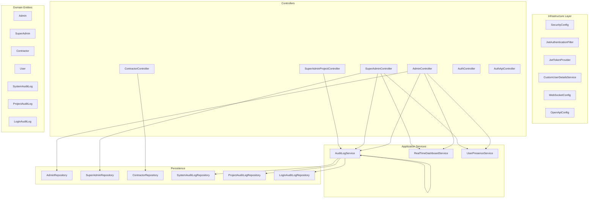
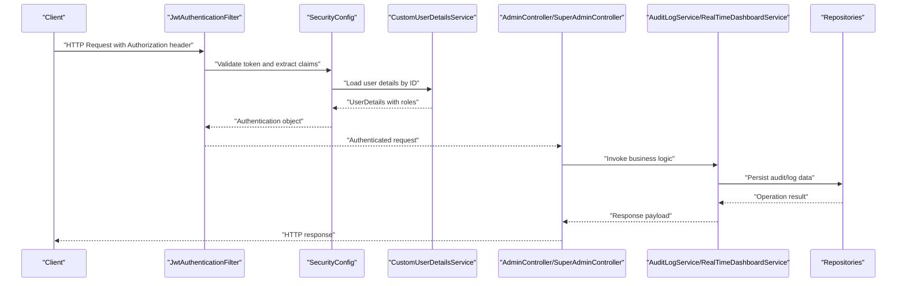
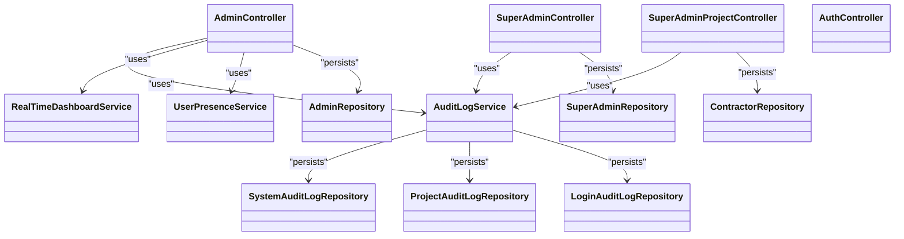

# Admin & Super Admin APIs

<cite>
**Referenced Files in This Document**
- [SkylinkMediaServiceApplication.java](file://src/main/java/root/cyb/mh/skylink_media_service/SkylinkMediaServiceApplication.java)
- [SecurityConfig.java](file://src/main/java/root/cyb/mh/skylink_media_service/infrastructure/security/SecurityConfig.java)
- [JwtAuthenticationFilter.java](file://src/main/java/root/cyb/mh/skylink_media_service/infrastructure/security/jwt/JwtAuthenticationFilter.java)
- [JwtTokenProvider.java](file://src/main/java/root/cyb/mh/skylink_media_service/infrastructure/security/jwt/JwtTokenProvider.java)
- [CustomUserDetailsService.java](file://src/main/java/root/cyb/mh/skylink_media_service/infrastructure/security/CustomUserDetailsService.java)
- [AdminController.java](file://src/main/java/root/cyb/mh/skylink_media_service/infrastructure/web/AdminController.java)
- [SuperAdminController.java](file://src/main/java/root/cyb/mh/skylink_media_service/infrastructure/web/SuperAdminController.java)
- [SuperAdminProjectController.java](file://src/main/java/root/cyb/mh/skylink_media_service/infrastructure/web/SuperAdminProjectController.java)
- [ContractorController.java](file://src/main/java/root/cyb/mh/skylink_media_service/infrastructure/web/ContractorController.java)
- [AuthController.java](file://src/main/java/root/cyb/mh/skylink_media_service/infrastructure/web/AuthController.java)
- [AuthApiController.java](file://src/main/java/root/cyb/mh/skylink_media_service/infrastructure/web/api/AuthApiController.java)
- [Admin.java](file://src/main/java/root/cyb/mh/skylink_media_service/domain/entities/Admin.java)
- [SuperAdmin.java](file://src/main/java/root/cyb/mh/skylink_media_service/domain/entities/SuperAdmin.java)
- [Contractor.java](file://src/main/java/root/cyb/mh/skylink_media_service/domain/entities/Contractor.java)
- [User.java](file://src/main/java/root/cyb/mh/skylink_media_service/domain/entities/User.java)
- [SystemAuditLog.java](file://src/main/java/root/cyb/mh/skylink_media_service/domain/entities/SystemAuditLog.java)
- [ProjectAuditLog.java](file://src/main/java/root/cyb/mh/skylink_media_service/domain/entities/ProjectAuditLog.java)
- [LoginAuditLog.java](file://src/main/java/root/cyb/mh/skylink_media_service/domain/entities/LoginAuditLog.java)
- [AuditLogService.java](file://src/main/java/root/cyb/mh/skylink_media_service/application/services/AuditLogService.java)
- [RealTimeDashboardService.java](file://src/main/java/root/cyb/mh/skylink_media_service/application/services/RealTimeDashboardService.java)
- [UserPresenceService.java](file://src/main/java/root/cyb/mh/skylink_media_service/application/services/UserPresenceService.java)
- [AdminRepository.java](file://src/main/java/root/cyb/mh/skylink_media_service/infrastructure/persistence/AdminRepository.java)
- [SuperAdminRepository.java](file://src/main/java/root/cyb/mh/skylink_media_service/infrastructure/persistence/SuperAdminRepository.java)
- [ContractorRepository.java](file://src/main/java/root/cyb/mh/skylink_media_service/infrastructure/persistence/ContractorRepository.java)
- [SystemAuditLogRepository.java](file://src/main/java/root/cyb/mh/skylink_media_service/infrastructure/persistence/SystemAuditLogRepository.java)
- [ProjectAuditLogRepository.java](file://src/main/java/root/cyb/mh/skylink_media_service/infrastructure/persistence/ProjectAuditLogRepository.java)
- [LoginAuditLogRepository.java](file://src/main/java/root/cyb/mh/skylink_media_service/infrastructure/persistence/LoginAuditLogRepository.java)
- [WebSocketConfig.java](file://src/main/java/root/cyb/mh/skylink_media_service/infrastructure/config/WebSocketConfig.java)
- [OpenApiConfig.java](file://src/main/java/root/cyb/mh/skylink_media_service/infrastructure/config/OpenApiConfig.java)
- [application.properties](file://src/main/resources/application.properties)
- [README_API.md](file://README_API.md)
- [API_QUICK_REFERENCE.md](file://API_QUICK_REFERENCE.md)
</cite>

## Table of Contents
1. [Introduction](#introduction)
2. [Project Structure](#project-structure)
3. [Core Components](#core-components)
4. [Architecture Overview](#architecture-overview)
5. [Detailed Component Analysis](#detailed-component-analysis)
6. [Dependency Analysis](#dependency-analysis)
7. [Performance Considerations](#performance-considerations)
8. [Troubleshooting Guide](#troubleshooting-guide)
9. [Conclusion](#conclusion)
10. [Appendices](#appendices)

## Introduction
This document provides comprehensive API documentation for administrative endpoints within the Skylink Media Service backend. It covers:
- Admin dashboard APIs and contractor management endpoints
- Super admin user management including admin creation, editing, and deletion
- System audit logging and report generation APIs
- System configuration endpoints and monitoring dashboards
- User presence tracking and real-time monitoring endpoints

Each endpoint specifies role-based access requirements, administrative privileges, and security considerations. Practical administrative workflows and system management operations are included to guide effective usage.

## Project Structure
The backend follows a layered architecture with clear separation between infrastructure, application services, domain entities, and persistence layers. Controllers expose REST endpoints grouped by roles:
- AdminController: Admin-specific operations and dashboards
- SuperAdminController: Super admin user management and system administration
- SuperAdminProjectController: Project oversight and reporting
- ContractorController: Contractor-related endpoints
- AuthController and AuthApiController: Authentication flows

**Diagram sources**
- [SecurityConfig.java](file://src/main/java/root/cyb/mh/skylink_media_service/infrastructure/security/SecurityConfig.java)
- [JwtAuthenticationFilter.java](file://src/main/java/root/cyb/mh/skylink_media_service/infrastructure/security/jwt/JwtAuthenticationFilter.java)
- [JwtTokenProvider.java](file://src/main/java/root/cyb/mh/skylink_media_service/infrastructure/security/jwt/JwtTokenProvider.java)
- [CustomUserDetailsService.java](file://src/main/java/root/cyb/mh/skylink_media_service/infrastructure/security/CustomUserDetailsService.java)
- [AdminController.java](file://src/main/java/root/cyb/mh/skylink_media_service/infrastructure/web/AdminController.java)
- [SuperAdminController.java](file://src/main/java/root/cyb/mh/skylink_media_service/infrastructure/web/SuperAdminController.java)
- [SuperAdminProjectController.java](file://src/main/java/root/cyb/mh/skylink_media_service/infrastructure/web/SuperAdminProjectController.java)
- [ContractorController.java](file://src/main/java/root/cyb/mh/skylink_media_service/infrastructure/web/ContractorController.java)
- [AuthController.java](file://src/main/java/root/cyb/mh/skylink_media_service/infrastructure/web/AuthController.java)
- [AuthApiController.java](file://src/main/java/root/cyb/mh/skylink_media_service/infrastructure/web/api/AuthApiController.java)
- [AuditLogService.java](file://src/main/java/root/cyb/mh/skylink_media_service/application/services/AuditLogService.java)
- [RealTimeDashboardService.java](file://src/main/java/root/cyb/mh/skylink_media_service/application/services/RealTimeDashboardService.java)
- [UserPresenceService.java](file://src/main/java/root/cyb/mh/skylink_media_service/application/services/UserPresenceService.java)
- [AdminRepository.java](file://src/main/java/root/cyb/mh/skylink_media_service/infrastructure/persistence/AdminRepository.java)
- [SuperAdminRepository.java](file://src/main/java/root/cyb/mh/skylink_media_service/infrastructure/persistence/SuperAdminRepository.java)
- [ContractorRepository.java](file://src/main/java/root/cyb/mh/skylink_media_service/infrastructure/persistence/ContractorRepository.java)
- [SystemAuditLogRepository.java](file://src/main/java/root/cyb/mh/skylink_media_service/infrastructure/persistence/SystemAuditLogRepository.java)
- [ProjectAuditLogRepository.java](file://src/main/java/root/cyb/mh/skylink_media_service/infrastructure/persistence/ProjectAuditLogRepository.java)
- [LoginAuditLogRepository.java](file://src/main/java/root/cyb/mh/skylink_media_service/infrastructure/persistence/LoginAuditLogRepository.java)

**Section sources**
- [SkylinkMediaServiceApplication.java](file://src/main/java/root/cyb/mh/skylink_media_service/SkylinkMediaServiceApplication.java)
- [SecurityConfig.java](file://src/main/java/root/cyb/mh/skylink_media_service/infrastructure/security/SecurityConfig.java)
- [AdminController.java](file://src/main/java/root/cyb/mh/skylink_media_service/infrastructure/web/AdminController.java)
- [SuperAdminController.java](file://src/main/java/root/cyb/mh/skylink_media_service/infrastructure/web/SuperAdminController.java)
- [SuperAdminProjectController.java](file://src/main/java/root/cyb/mh/skylink_media_service/infrastructure/web/SuperAdminProjectController.java)
- [ContractorController.java](file://src/main/java/root/cyb/mh/skylink_media_service/infrastructure/web/ContractorController.java)
- [AuthController.java](file://src/main/java/root/cyb/mh/skylink_media_service/infrastructure/web/AuthController.java)
- [AuthApiController.java](file://src/main/java/root/cyb/mh/skylink_media_service/infrastructure/web/api/AuthApiController.java)

## Core Components
- Role-based access control is enforced via JWT-based authentication and Spring Security configuration.
- Admin and Super Admin controllers expose endpoints for dashboards, contractor management, user management, audit logs, and monitoring.
- Application services handle audit logging, real-time dashboards, and user presence tracking.
- Persistence repositories manage entity storage for admins, super admins, contractors, and audit log entries.

Key capabilities:
- Admin dashboard: contractor overview, project insights, and operational metrics
- Super admin user management: create, update, delete admins and manage system-wide settings
- Audit logging: system-wide and project-specific logs with export/reporting support
- Monitoring: real-time dashboards and user presence tracking
- Authentication: secure login/logout flows with JWT tokens

**Section sources**
- [SecurityConfig.java](file://src/main/java/root/cyb/mh/skylink_media_service/infrastructure/security/SecurityConfig.java)
- [JwtAuthenticationFilter.java](file://src/main/java/root/cyb/mh/skylink_media_service/infrastructure/security/jwt/JwtAuthenticationFilter.java)
- [JwtTokenProvider.java](file://src/main/java/root/cyb/mh/skylink_media_service/infrastructure/security/jwt/JwtTokenProvider.java)
- [CustomUserDetailsService.java](file://src/main/java/root/cyb/mh/skylink_media_service/infrastructure/security/CustomUserDetailsService.java)
- [AdminController.java](file://src/main/java/root/cyb/mh/skylink_media_service/infrastructure/web/AdminController.java)
- [SuperAdminController.java](file://src/main/java/root/cyb/mh/skylink_media_service/infrastructure/web/SuperAdminController.java)
- [SuperAdminProjectController.java](file://src/main/java/root/cyb/mh/skylink_media_service/infrastructure/web/SuperAdminProjectController.java)
- [AuditLogService.java](file://src/main/java/root/cyb/mh/skylink_media_service/application/services/AuditLogService.java)
- [RealTimeDashboardService.java](file://src/main/java/root/cyb/mh/skylink_media_service/application/services/RealTimeDashboardService.java)
- [UserPresenceService.java](file://src/main/java/root/cyb/mh/skylink_media_service/application/services/UserPresenceService.java)

## Architecture Overview
The system enforces role-based access control using JWT tokens. Requests pass through a filter chain that validates tokens and loads user authorities. Controllers delegate to application services for business logic, which persist audit data and coordinate real-time monitoring.

**Diagram sources**
- [JwtAuthenticationFilter.java](file://src/main/java/root/cyb/mh/skylink_media_service/infrastructure/security/jwt/JwtAuthenticationFilter.java)
- [SecurityConfig.java](file://src/main/java/root/cyb/mh/skylink_media_service/infrastructure/security/SecurityConfig.java)
- [CustomUserDetailsService.java](file://src/main/java/root/cyb/mh/skylink_media_service/infrastructure/security/CustomUserDetailsService.java)
- [AdminController.java](file://src/main/java/root/cyb/mh/skylink_media_service/infrastructure/web/AdminController.java)
- [SuperAdminController.java](file://src/main/java/root/cyb/mh/skylink_media_service/infrastructure/web/SuperAdminController.java)
- [AuditLogService.java](file://src/main/java/root/cyb/mh/skylink_media_service/application/services/AuditLogService.java)
- [RealTimeDashboardService.java](file://src/main/java/root/cyb/mh/skylink_media_service/application/services/RealTimeDashboardService.java)

## Detailed Component Analysis

### Admin Dashboard APIs
Endpoints for admin dashboards and contractor management:
- GET /admin/dashboard: Retrieve dashboard metrics and summaries
- GET /admin/contractors: List contractors with filters and pagination
- GET /admin/contractors/{id}: Fetch contractor details
- PUT /admin/contractors/{id}: Update contractor information
- DELETE /admin/contractors/{id}: Remove contractor account
- GET /admin/projects/{projectId}/dashboard: Project-specific dashboard data
- GET /admin/reports/audit: Export system audit logs
- GET /admin/reports/project/{projectId}: Export project-specific audit logs

Access requirements:
- Role: Admin
- Authentication: JWT bearer token
- Authorization: Admin role required

Security considerations:
- Token validation and role verification occur in the filter chain
- Endpoints return minimal data suitable for dashboards
- Audit logs capture sensitive actions for compliance

Practical workflow:
- Admin logs in via authentication endpoints
- Retrieves contractor list and updates contractor details as needed
- Generates audit reports for compliance reviews

**Section sources**
- [AdminController.java](file://src/main/java/root/cyb/mh/skylink_media_service/infrastructure/web/AdminController.java)
- [Admin.java](file://src/main/java/root/cyb/mh/skylink_media_service/domain/entities/Admin.java)
- [Contractor.java](file://src/main/java/root/cyb/mh/skylink_media_service/domain/entities/Contractor.java)
- [AuditLogService.java](file://src/main/java/root/cyb/mh/skylink_media_service/application/services/AuditLogService.java)

### Super Admin User Management
Endpoints for managing admins and system-wide operations:
- POST /super-admin/admins: Create a new admin
- PUT /super-admin/admins/{id}: Update admin details
- DELETE /super-admin/admins/{id}: Deactivate or remove admin
- GET /super-admin/admins: List all admins with filters
- GET /super-admin/admins/{id}: Retrieve admin profile
- POST /super-admin/config: Update system configuration
- GET /super-admin/config: Retrieve current configuration
- GET /super-admin/system-health: Monitor system health metrics

Access requirements:
- Role: Super Admin
- Authentication: JWT bearer token
- Authorization: Super Admin role required

Security considerations:
- Admin lifecycle operations are logged comprehensively
- Configuration changes are audited and timestamped
- Health checks expose system status without leaking secrets

Practical workflow:
- Super admin creates new admin accounts with appropriate permissions
- Updates system configuration during maintenance windows
- Monitors system health and responds to alerts

**Section sources**
- [SuperAdminController.java](file://src/main/java/root/cyb/mh/skylink_media_service/infrastructure/web/SuperAdminController.java)
- [SuperAdmin.java](file://src/main/java/root/cyb/mh/skylink_media_service/domain/entities/SuperAdmin.java)
- [Admin.java](file://src/main/java/root/cyb/mh/skylink_media_service/domain/entities/Admin.java)
- [AuditLogService.java](file://src/main/java/root/cyb/mh/skylink_media_service/application/services/AuditLogService.java)

### System Audit Logging and Report Generation
Endpoints for audit logging and report generation:
- GET /super-admin/audit/logs: Paginated system audit logs
- GET /super-admin/audit/logs/{id}: Retrieve specific system audit log
- GET /super-admin/audit/logs/export: Export system audit logs
- GET /super-admin/audit/projects/{projectId}/logs: Project-specific audit logs
- GET /super-admin/audit/projects/{projectId}/logs/export: Export project audit logs
- GET /super-admin/audit/login-history: Login history for users
- GET /super-admin/audit/login-history/export: Export login history

Access requirements:
- Role: Super Admin
- Authentication: JWT bearer token
- Authorization: Super Admin role required

Security considerations:
- Logs include timestamps, user IDs, actions, and IP addresses
- Export endpoints support CSV/PDF formats for compliance
- Access to logs is restricted to prevent tampering

Practical workflow:
- Super admin generates audit reports for regulatory compliance
- Investigates suspicious login activity using login history
- Exports project-specific logs for project managers

**Section sources**
- [SuperAdminProjectController.java](file://src/main/java/root/cyb/mh/skylink_media_service/infrastructure/web/SuperAdminProjectController.java)
- [AuditLogService.java](file://src/main/java/root/cyb/mh/skylink_media_service/application/services/AuditLogService.java)
- [SystemAuditLog.java](file://src/main/java/root/cyb/mh/skylink_media_service/domain/entities/SystemAuditLog.java)
- [ProjectAuditLog.java](file://src/main/java/root/cyb/mh/skylink_media_service/domain/entities/ProjectAuditLog.java)
- [LoginAuditLog.java](file://src/main/java/root/cyb/mh/skylink_media_service/domain/entities/LoginAuditLog.java)

### System Configuration Endpoints and Monitoring Dashboards
Endpoints for configuration and monitoring:
- POST /super-admin/config: Set configuration values
- PATCH /super-admin/config: Partially update configuration
- GET /super-admin/config: Retrieve configuration
- GET /super-admin/monitoring/dashboards: Retrieve monitoring dashboard data
- GET /super-admin/monitoring/users/active: Active user presence metrics
- GET /super-admin/monitoring/system/metrics: System resource metrics

Access requirements:
- Role: Super Admin
- Authentication: JWT bearer token
- Authorization: Super Admin role required

Security considerations:
- Configuration endpoints validate input types and values
- Monitoring endpoints aggregate data without exposing internal details
- Real-time metrics are cached for performance

Practical workflow:
- Super admin adjusts system thresholds and timeouts
- Monitors active user presence during peak hours
- Reviews system metrics to identify bottlenecks

**Section sources**
- [SuperAdminController.java](file://src/main/java/root/cyb/mh/skylink_media_service/infrastructure/web/SuperAdminController.java)
- [RealTimeDashboardService.java](file://src/main/java/root/cyb/mh/skylink_media_service/application/services/RealTimeDashboardService.java)
- [UserPresenceService.java](file://src/main/java/root/cyb/mh/skylink_media_service/application/services/UserPresenceService.java)

### User Presence Tracking and Real-Time Monitoring
Endpoints for presence tracking and real-time monitoring:
- GET /admin/monitoring/users/active: Active contractor presence
- GET /admin/monitoring/projects/activity: Recent project activities
- GET /admin/monitoring/system/alerts: Current system alerts
- WS /ws/realtime: WebSocket endpoint for live updates

Access requirements:
- Role: Admin
- Authentication: JWT bearer token
- Authorization: Admin role required

Security considerations:
- WebSocket endpoint requires authenticated session
- Presence data excludes personally identifiable information
- Alerts are filtered by user permissions

Practical workflow:
- Admin monitors contractor availability and project progress
- Receives real-time notifications via WebSocket for urgent updates
- Reviews recent activities to track operational efficiency

**Section sources**
- [AdminController.java](file://src/main/java/root/cyb/mh/skylink_media_service/infrastructure/web/AdminController.java)
- [UserPresenceService.java](file://src/main/java/root/cyb/mh/skylink_media_service/application/services/UserPresenceService.java)
- [WebSocketConfig.java](file://src/main/java/root/cyb/mh/skylink_media_service/infrastructure/config/WebSocketConfig.java)

### Authentication Endpoints
Endpoints for login and logout:
- POST /auth/login: Authenticate user and issue JWT
- POST /auth/logout: Invalidate session and revoke token
- POST /auth/refresh: Refresh expired JWT token

Access requirements:
- No role required for login
- Authentication: JWT bearer token for protected endpoints

Security considerations:
- Passwords are hashed using secure algorithms
- Tokens include expiration and issuer claims
- Logout invalidates tokens at the application level

Practical workflow:
- Users authenticate via login endpoint
- System issues JWT with appropriate roles
- Clients refresh tokens before expiration

**Section sources**
- [AuthController.java](file://src/main/java/root/cyb/mh/skylink_media_service/infrastructure/web/AuthController.java)
- [AuthApiController.java](file://src/main/java/root/cyb/mh/skylink_media_service/infrastructure/web/api/AuthApiController.java)
- [JwtTokenProvider.java](file://src/main/java/root/cyb/mh/skylink_media_service/infrastructure/security/jwt/JwtTokenProvider.java)

## Dependency Analysis
The controllers depend on application services for business logic and repositories for persistence. Security components enforce authentication and authorization policies.

**Diagram sources**
- [AdminController.java](file://src/main/java/root/cyb/mh/skylink_media_service/infrastructure/web/AdminController.java)
- [SuperAdminController.java](file://src/main/java/root/cyb/mh/skylink_media_service/infrastructure/web/SuperAdminController.java)
- [SuperAdminProjectController.java](file://src/main/java/root/cyb/mh/skylink_media_service/infrastructure/web/SuperAdminProjectController.java)
- [AuthController.java](file://src/main/java/root/cyb/mh/skylink_media_service/infrastructure/web/AuthController.java)
- [AuditLogService.java](file://src/main/java/root/cyb/mh/skylink_media_service/application/services/AuditLogService.java)
- [RealTimeDashboardService.java](file://src/main/java/root/cyb/mh/skylink_media_service/application/services/RealTimeDashboardService.java)
- [UserPresenceService.java](file://src/main/java/root/cyb/mh/skylink_media_service/application/services/UserPresenceService.java)
- [AdminRepository.java](file://src/main/java/root/cyb/mh/skylink_media_service/infrastructure/persistence/AdminRepository.java)
- [SuperAdminRepository.java](file://src/main/java/root/cyb/mh/skylink_media_service/infrastructure/persistence/SuperAdminRepository.java)
- [ContractorRepository.java](file://src/main/java/root/cyb/mh/skylink_media_service/infrastructure/persistence/ContractorRepository.java)
- [SystemAuditLogRepository.java](file://src/main/java/root/cyb/mh/skylink_media_service/infrastructure/persistence/SystemAuditLogRepository.java)
- [ProjectAuditLogRepository.java](file://src/main/java/root/cyb/mh/skylink_media_service/infrastructure/persistence/ProjectAuditLogRepository.java)
- [LoginAuditLogRepository.java](file://src/main/java/root/cyb/mh/skylink_media_service/infrastructure/persistence/LoginAuditLogRepository.java)

**Section sources**
- [AdminController.java](file://src/main/java/root/cyb/mh/skylink_media_service/infrastructure/web/AdminController.java)
- [SuperAdminController.java](file://src/main/java/root/cyb/mh/skylink_media_service/infrastructure/web/SuperAdminController.java)
- [SuperAdminProjectController.java](file://src/main/java/root/cyb/mh/skylink_media_service/infrastructure/web/SuperAdminProjectController.java)
- [AuditLogService.java](file://src/main/java/root/cyb/mh/skylink_media_service/application/services/AuditLogService.java)

## Performance Considerations
- Use pagination and filtering for audit log exports to avoid large payloads
- Cache frequently accessed dashboard metrics to reduce database load
- Implement efficient indexing on audit log tables for fast queries
- Limit WebSocket connections per user to prevent resource exhaustion
- Use asynchronous processing for report generation to keep API responsive

## Troubleshooting Guide
Common issues and resolutions:
- Authentication failures: Verify JWT token validity and issuer claims
- Authorization errors: Confirm user roles and permissions
- Audit log discrepancies: Check repository writes and export filters
- Real-time monitoring delays: Validate WebSocket connectivity and server capacity
- Configuration changes not applied: Ensure proper validation and restart procedures

**Section sources**
- [JwtAuthenticationFilter.java](file://src/main/java/root/cyb/mh/skylink_media_service/infrastructure/security/jwt/JwtAuthenticationFilter.java)
- [SecurityConfig.java](file://src/main/java/root/cyb/mh/skylink_media_service/infrastructure/security/SecurityConfig.java)
- [AuditLogService.java](file://src/main/java/root/cyb/mh/skylink_media_service/application/services/AuditLogService.java)
- [UserPresenceService.java](file://src/main/java/root/cyb/mh/skylink_media_service/application/services/UserPresenceService.java)

## Conclusion
The Skylink Media Service backend provides robust administrative and super admin APIs with strong security controls and comprehensive audit logging. Administrators can efficiently manage contractors, monitor system health, and generate compliance reports. Super admins retain full control over user management and system configuration while maintaining strict access controls and audit trails.

## Appendices
- API quick reference and implementation details are available in the project documentation files.

**Section sources**
- [README_API.md](file://README_API.md)
- [API_QUICK_REFERENCE.md](file://API_QUICK_REFERENCE.md)
- [application.properties](file://src/main/resources/application.properties)
- [OpenApiConfig.java](file://src/main/java/root/cyb/mh/skylink_media_service/infrastructure/config/OpenApiConfig.java)