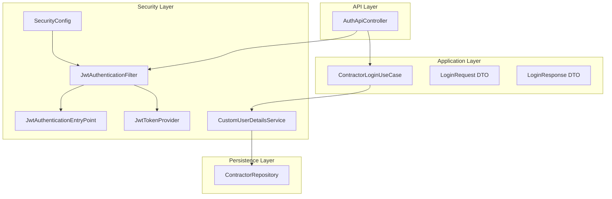
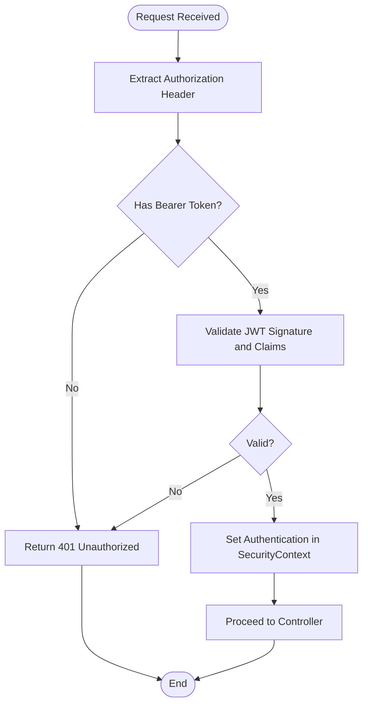
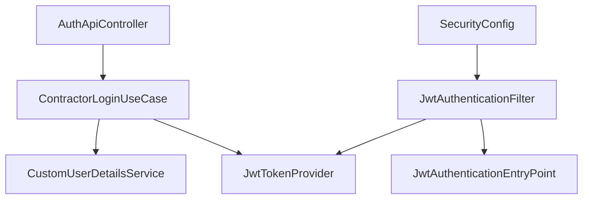

# Authentication Endpoints

<cite>
**Referenced Files in This Document**
- [LoginRequest.java](file://src/main/java/root/cyb/mh/skylink_media_service/application/dto/api/LoginRequest.java)
- [LoginResponse.java](file://src/main/java/root/cyb/mh/skylink_media_service/application/dto/api/LoginResponse.java)
- [ContractorLoginUseCase.java](file://src/main/java/root/cyb/mh/skylink_media_service/application/usecases/ContractorLoginUseCase.java)
- [AuthApiController.java](file://src/main/java/root/cyb/mh/skylink_media_service/infrastructure/web/api/AuthApiController.java)
- [SecurityConfig.java](file://src/main/java/root/cyb/mh/skylink_media_service/infrastructure/security/SecurityConfig.java)
- [JwtTokenProvider.java](file://src/main/java/root/cyb/mh/skylink_media_service/infrastructure/security/jwt/JwtTokenProvider.java)
- [JwtAuthenticationEntryPoint.java](file://src/main/java/root/cyb/mh/skylink_media_service/infrastructure/security/jwt/JwtAuthenticationEntryPoint.java)
- [JwtAuthenticationFilter.java](file://src/main/java/root/cyb/mh/skylink_media_service/infrastructure/security/jwt/JwtAuthenticationFilter.java)
- [CustomUserDetailsService.java](file://src/main/java/root/cyb/mh/skylink_media_service/infrastructure/security/CustomUserDetailsService.java)
- [application.properties](file://src/main/resources/application.properties)
- [GlobalApiExceptionHandler.java](file://src/main/java/root/cyb/mh/skylink_media_service/infrastructure/web/api/exception/GlobalApiExceptionHandler.java)
- [ErrorResponse.java](file://src/main/java/root/cyb/mh/skylink_media_service/application/dto/api/ErrorResponse.java)
</cite>

## Table of Contents
1. [Introduction](#introduction)
2. [Project Structure](#project-structure)
3. [Core Components](#core-components)
4. [Architecture Overview](#architecture-overview)
5. [Detailed Component Analysis](#detailed-component-analysis)
6. [Dependency Analysis](#dependency-analysis)
7. [Performance Considerations](#performance-considerations)
8. [Troubleshooting Guide](#troubleshooting-guide)
9. [Conclusion](#conclusion)

## Introduction
This document provides comprehensive API documentation for the authentication endpoints, focusing on the contractor login process. It covers request/response schemas, JWT token generation, authorization requirements, authentication flow, token validation, security considerations, CORS configuration, and client-side implementation guidelines. The goal is to enable frontend developers and integrators to securely authenticate contractors and make authorized requests to protected endpoints.

## Project Structure
The authentication subsystem is organized around a dedicated controller, use case, DTOs, and Spring Security configuration with JWT support. The key files involved in authentication are:

- API Controller: handles HTTP endpoints for authentication
- Use Case: encapsulates the business logic for contractor login
- DTOs: define request and response schemas
- Security Configuration: manages CORS, CSRF, HTTP security headers, and filter chain
- JWT Provider: generates and validates JWT tokens
- Security Filters: enforce authentication and handle unauthorized access
- Exception Handler: standardizes error responses



**Diagram sources**
- [AuthApiController.java:1-200](file://src/main/java/root/cyb/mh/skylink_media_service/infrastructure/web/api/AuthApiController.java#L1-L200)
- [ContractorLoginUseCase.java:1-200](file://src/main/java/root/cyb/mh/skylink_media_service/application/usecases/ContractorLoginUseCase.java#L1-L200)
- [LoginRequest.java:1-100](file://src/main/java/root/cyb/mh/skylink_media_service/application/dto/api/LoginRequest.java#L1-L100)
- [LoginResponse.java:1-100](file://src/main/java/root/cyb/mh/skylink_media_service/application/dto/api/LoginResponse.java#L1-L100)
- [SecurityConfig.java:1-200](file://src/main/java/root/cyb/mh/skylink_media_service/infrastructure/security/SecurityConfig.java#L1-L200)
- [JwtAuthenticationFilter.java:1-200](file://src/main/java/root/cyb/mh/skylink_media_service/infrastructure/security/jwt/JwtAuthenticationFilter.java#L1-L200)
- [JwtAuthenticationEntryPoint.java:1-100](file://src/main/java/root/cyb/mh/skylink_media_service/infrastructure/security/jwt/JwtAuthenticationEntryPoint.java#L1-L100)
- [JwtTokenProvider.java:1-200](file://src/main/java/root/cyb/mh/skylink_media_service/infrastructure/security/jwt/JwtTokenProvider.java#L1-L200)
- [CustomUserDetailsService.java:1-200](file://src/main/java/root/cyb/mh/skylink_media_service/infrastructure/security/CustomUserDetailsService.java#L1-L200)

**Section sources**
- [AuthApiController.java:1-200](file://src/main/java/root/cyb/mh/skylink_media_service/infrastructure/web/api/AuthApiController.java#L1-L200)
- [SecurityConfig.java:1-200](file://src/main/java/root/cyb/mh/skylink_media_service/infrastructure/security/SecurityConfig.java#L1-L200)

## Core Components
This section documents the primary authentication components and their roles.

- AuthApiController: Exposes the contractor login endpoint and delegates to the use case. It also integrates with the JWT filter chain for request processing.
- ContractorLoginUseCase: Implements the contractor login business logic, including credential validation, user lookup, and token issuance.
- LoginRequest DTO: Defines the structure for contractor login requests.
- LoginResponse DTO: Defines the structure for contractor login responses, including the issued JWT token.
- SecurityConfig: Configures CORS, CSRF, HTTP security headers, and the filter chain for JWT authentication.
- JwtTokenProvider: Generates and validates JWT tokens, managing claims and expiration.
- JwtAuthenticationFilter: Extracts JWT from Authorization headers and authenticates the request.
- JwtAuthenticationEntryPoint: Handles unauthorized access attempts.
- CustomUserDetailsService: Loads contractor details for authentication.
- GlobalApiExceptionHandler: Standardizes error responses across the API.

**Section sources**
- [AuthApiController.java:1-200](file://src/main/java/root/cyb/mh/skylink_media_service/infrastructure/web/api/AuthApiController.java#L1-L200)
- [ContractorLoginUseCase.java:1-200](file://src/main/java/root/cyb/mh/skylink_media_service/application/usecases/ContractorLoginUseCase.java#L1-L200)
- [LoginRequest.java:1-100](file://src/main/java/root/cyb/mh/skylink_media_service/application/dto/api/LoginRequest.java#L1-L100)
- [LoginResponse.java:1-100](file://src/main/java/root/cyb/mh/skylink_media_service/application/dto/api/LoginResponse.java#L1-L100)
- [SecurityConfig.java:1-200](file://src/main/java/root/cyb/mh/skylink_media_service/infrastructure/security/SecurityConfig.java#L1-L200)
- [JwtTokenProvider.java:1-200](file://src/main/java/root/cyb/mh/skylink_media_service/infrastructure/security/jwt/JwtTokenProvider.java#L1-L200)
- [JwtAuthenticationFilter.java:1-200](file://src/main/java/root/cyb/mh/skylink_media_service/infrastructure/security/jwt/JwtAuthenticationFilter.java#L1-L200)
- [JwtAuthenticationEntryPoint.java:1-100](file://src/main/java/root/cyb/mh/skylink_media_service/infrastructure/security/jwt/JwtAuthenticationEntryPoint.java#L1-L100)
- [CustomUserDetailsService.java:1-200](file://src/main/java/root/cyb/mh/skylink_media_service/infrastructure/security/CustomUserDetailsService.java#L1-L200)
- [GlobalApiExceptionHandler.java:1-200](file://src/main/java/root/cyb/mh/skylink_media_service/infrastructure/web/api/exception/GlobalApiExceptionHandler.java#L1-L200)
- [ErrorResponse.java:1-100](file://src/main/java/root/cyb/mh/skylink_media_service/application/dto/api/ErrorResponse.java#L1-L100)

## Architecture Overview
The authentication flow follows a layered architecture with clear separation of concerns:

- API Layer: Receives HTTP requests and delegates to use cases.
- Application Layer: Encapsulates business logic for contractor login.
- Security Layer: Enforces authentication via JWT filters and handles unauthorized access.
- Persistence Layer: Retrieves contractor details for authentication.

```mermaid
sequenceDiagram
participant Client as "Client"
participant API as "AuthApiController"
participant UseCase as "ContractorLoginUseCase"
participant Details as "CustomUserDetailsService"
participant Repo as "ContractorRepository"
participant Token as "JwtTokenProvider"
participant Filter as "JwtAuthenticationFilter"
Client->>API : POST /api/auth/login (LoginRequest)
API->>UseCase : authenticate(loginRequest)
UseCase->>Details : loadUserByUsername(username)
Details->>Repo : findByUsername(username)
Repo-->>Details : Contractor
Details-->>UseCase : UserDetails
UseCase->>Token : generateToken(userDetails)
Token-->>UseCase : JWT String
UseCase-->>API : LoginResponse (JWT)
API-->>Client : 200 OK (LoginResponse)
Note over Client,Filter : Subsequent requests include Authorization : Bearer JWT
Client->>Filter : Request with Authorization header
Filter->>Token : validateToken(jwt)
Token-->>Filter : Valid claims
Filter-->>Client : Authorized access to protected endpoints
```

**Diagram sources**
- [AuthApiController.java:1-200](file://src/main/java/root/cyb/mh/skylink_media_service/infrastructure/web/api/AuthApiController.java#L1-L200)
- [ContractorLoginUseCase.java:1-200](file://src/main/java/root/cyb/mh/skylink_media_service/application/usecases/ContractorLoginUseCase.java#L1-L200)
- [CustomUserDetailsService.java:1-200](file://src/main/java/root/cyb/mh/skylink_media_service/infrastructure/security/CustomUserDetailsService.java#L1-L200)
- [JwtTokenProvider.java:1-200](file://src/main/java/root/cyb/mh/skylink_media_service/infrastructure/security/jwt/JwtTokenProvider.java#L1-L200)
- [JwtAuthenticationFilter.java:1-200](file://src/main/java/root/cyb/mh/skylink_media_service/infrastructure/security/jwt/JwtAuthenticationFilter.java#L1-L200)

## Detailed Component Analysis

### Endpoint Definition: Contractor Login
- Method: POST
- Path: /api/auth/login
- Consumes: application/json
- Produces: application/json
- Description: Authenticates a contractor using username and password, returning a JWT for subsequent authenticated requests.

Authorization Requirements:
- No prior authentication required to call this endpoint.
- Successful login grants a JWT suitable for Authorization: Bearer usage on protected endpoints.

Request Schema (LoginRequest):
- Fields:
  - username: string, required
  - password: string, required
- Validation:
  - Non-empty username and password are required.

Response Schema (LoginResponse):
- Fields:
  - token: string, JWT token
  - tokenType: string, fixed value "Bearer"
- Notes:
  - The token is signed and includes necessary claims for authentication.

Example Request:
- POST /api/auth/login
- Headers: Content-Type: application/json
- Body: {"username":"contractor_user","password":"secure_password"}

Successful Response:
- Status: 200 OK
- Body: {"token":"<JWT_STRING>","tokenType":"Bearer"}

Error Scenarios:
- 400 Bad Request: Invalid request payload or missing fields.
- 401 Unauthorized: Invalid credentials or unauthenticated access.
- 500 Internal Server Error: Unexpected server errors during authentication.

**Section sources**
- [AuthApiController.java:1-200](file://src/main/java/root/cyb/mh/skylink_media_service/infrastructure/web/api/AuthApiController.java#L1-L200)
- [LoginRequest.java:1-100](file://src/main/java/root/cyb/mh/skylink_media_service/application/dto/api/LoginRequest.java#L1-L100)
- [LoginResponse.java:1-100](file://src/main/java/root/cyb/mh/skylink_media_service/application/dto/api/LoginResponse.java#L1-L100)
- [GlobalApiExceptionHandler.java:1-200](file://src/main/java/root/cyb/mh/skylink_media_service/infrastructure/web/api/exception/GlobalApiExceptionHandler.java#L1-L200)
- [ErrorResponse.java:1-100](file://src/main/java/root/cyb/mh/skylink_media_service/application/dto/api/ErrorResponse.java#L1-L100)

### JWT Token Generation and Validation
JWT Provider Responsibilities:
- Generate tokens with appropriate claims and expiration.
- Validate tokens extracted from Authorization headers.
- Manage token refresh and expiration policies.

Token Usage:
- Clients include Authorization: Bearer <JWT> in headers for protected endpoints.
- The filter chain extracts and validates the token before invoking controllers.

Validation Flow:
- Extract token from Authorization header.
- Validate signature and expiration.
- Establish SecurityContext with authenticated principal.



**Diagram sources**
- [JwtAuthenticationFilter.java:1-200](file://src/main/java/root/cyb/mh/skylink_media_service/infrastructure/security/jwt/JwtAuthenticationFilter.java#L1-L200)
- [JwtTokenProvider.java:1-200](file://src/main/java/root/cyb/mh/skylink_media_service/infrastructure/security/jwt/JwtTokenProvider.java#L1-L200)
- [JwtAuthenticationEntryPoint.java:1-100](file://src/main/java/root/cyb/mh/skylink_media_service/infrastructure/security/jwt/JwtAuthenticationEntryPoint.java#L1-L100)

**Section sources**
- [JwtTokenProvider.java:1-200](file://src/main/java/root/cyb/mh/skylink_media_service/infrastructure/security/jwt/JwtTokenProvider.java#L1-L200)
- [JwtAuthenticationFilter.java:1-200](file://src/main/java/root/cyb/mh/skylink_media_service/infrastructure/security/jwt/JwtAuthenticationFilter.java#L1-L200)
- [JwtAuthenticationEntryPoint.java:1-100](file://src/main/java/root/cyb/mh/skylink_media_service/infrastructure/security/jwt/JwtAuthenticationEntryPoint.java#L1-L100)

### Security Configuration and CORS
SecurityConfig Highlights:
- CORS: Allows configured origins, methods, and headers; permits credentials.
- CSRF: Disabled for stateless APIs.
- HTTP Security Headers: Strict Transport Security, X-Content-Type-Options, X-Frame-Options, X-XSS-Protection, Referrer-Policy.
- Filter Chain: Adds JwtAuthenticationFilter before UsernamePasswordAuthenticationFilter.
- Exception Handling: Uses JwtAuthenticationEntryPoint for unauthorized access.

CORS Behavior:
- Origins: Configured via application properties.
- Methods: GET, POST, PUT, DELETE, OPTIONS.
- Headers: Authorization, Content-Type, X-Requested-With, Accept, Origin.
- Credentials: Allowed if origin is trusted.

Cross-Origin Restrictions:
- Only pre-registered origins can access the API.
- Credentials require explicit origin allowance.

**Section sources**
- [SecurityConfig.java:1-200](file://src/main/java/root/cyb/mh/skylink_media_service/infrastructure/security/SecurityConfig.java#L1-L200)
- [application.properties:1-200](file://src/main/resources/application.properties#L1-L200)

### Client-Side Implementation Guidelines
Recommended Practices:
- Store the JWT securely (HttpOnly cookies or secure storage mechanisms).
- Attach Authorization: Bearer <JWT> to all protected endpoint requests.
- Refresh strategy: Implement silent token refresh before expiration.
- Error handling: Detect 401 responses and trigger re-authentication flow.
- CORS compliance: Ensure requests originate from allowed domains.

Practical Examples:
- Login request: POST /api/auth/login with JSON body containing username and password.
- Successful response: 200 OK with token and tokenType.
- Protected request: Include Authorization header with the returned JWT.

**Section sources**
- [AuthApiController.java:1-200](file://src/main/java/root/cyb/mh/skylink_media_service/infrastructure/web/api/AuthApiController.java#L1-L200)
- [LoginResponse.java:1-100](file://src/main/java/root/cyb/mh/skylink_media_service/application/dto/api/LoginResponse.java#L1-L100)

## Dependency Analysis
The authentication subsystem exhibits strong cohesion within its layers and clear dependency directions:

- AuthApiController depends on ContractorLoginUseCase.
- ContractorLoginUseCase depends on CustomUserDetailsService and JwtTokenProvider.
- JwtAuthenticationFilter depends on JwtTokenProvider and JwtAuthenticationEntryPoint.
- SecurityConfig orchestrates filters and CORS configuration.



**Diagram sources**
- [AuthApiController.java:1-200](file://src/main/java/root/cyb/mh/skylink_media_service/infrastructure/web/api/AuthApiController.java#L1-L200)
- [ContractorLoginUseCase.java:1-200](file://src/main/java/root/cyb/mh/skylink_media_service/application/usecases/ContractorLoginUseCase.java#L1-L200)
- [CustomUserDetailsService.java:1-200](file://src/main/java/root/cyb/mh/skylink_media_service/infrastructure/security/CustomUserDetailsService.java#L1-L200)
- [JwtTokenProvider.java:1-200](file://src/main/java/root/cyb/mh/skylink_media_service/infrastructure/security/jwt/JwtTokenProvider.java#L1-L200)
- [JwtAuthenticationFilter.java:1-200](file://src/main/java/root/cyb/mh/skylink_media_service/infrastructure/security/jwt/JwtAuthenticationFilter.java#L1-L200)
- [JwtAuthenticationEntryPoint.java:1-100](file://src/main/java/root/cyb/mh/skylink_media_service/infrastructure/security/jwt/JwtAuthenticationEntryPoint.java#L1-L100)
- [SecurityConfig.java:1-200](file://src/main/java/root/cyb/mh/skylink_media_service/infrastructure/security/SecurityConfig.java#L1-L200)

**Section sources**
- [AuthApiController.java:1-200](file://src/main/java/root/cyb/mh/skylink_media_service/infrastructure/web/api/AuthApiController.java#L1-L200)
- [ContractorLoginUseCase.java:1-200](file://src/main/java/root/cyb/mh/skylink_media_service/application/usecases/ContractorLoginUseCase.java#L1-L200)
- [SecurityConfig.java:1-200](file://src/main/java/root/cyb/mh/skylink_media_service/infrastructure/security/SecurityConfig.java#L1-L200)

## Performance Considerations
- Token validation overhead: Keep token size minimal; avoid excessive claims.
- Filter chain efficiency: Place JwtAuthenticationFilter early to fail fast on invalid tokens.
- Caching: Consider caching validated tokens for short-lived sessions if needed.
- Network latency: Minimize round trips by batching authenticated requests.

## Troubleshooting Guide
Common Issues and Resolutions:
- 400 Bad Request:
  - Cause: Missing or malformed fields in LoginRequest.
  - Resolution: Ensure username and password are present and correctly formatted.
- 401 Unauthorized:
  - Cause: Invalid credentials or expired/invalid JWT.
  - Resolution: Trigger re-login flow; verify token validity and expiration.
- 403 Forbidden:
  - Cause: Insufficient permissions for requested resource.
  - Resolution: Verify contractor role and access rights.
- CORS Errors:
  - Cause: Requests from disallowed origins or missing credentials.
  - Resolution: Configure allowed origins and ensure credentials are enabled for trusted origins.
- 500 Internal Server Error:
  - Cause: Unexpected server-side failures.
  - Resolution: Check server logs and exception handler for details.

**Section sources**
- [GlobalApiExceptionHandler.java:1-200](file://src/main/java/root/cyb/mh/skylink_media_service/infrastructure/web/api/exception/GlobalApiExceptionHandler.java#L1-L200)
- [ErrorResponse.java:1-100](file://src/main/java/root/cyb/mh/skylink_media_service/application/dto/api/ErrorResponse.java#L1-L100)
- [JwtAuthenticationEntryPoint.java:1-100](file://src/main/java/root/cyb/mh/skylink_media_service/infrastructure/security/jwt/JwtAuthenticationEntryPoint.java#L1-L100)

## Conclusion
The authentication subsystem provides a robust, standards-compliant contractor login endpoint secured by JWT. The documented schemas, flows, and configurations enable secure client integration with proper CORS handling and error management. Following the client-side guidelines ensures reliable authentication and protected access to backend resources.