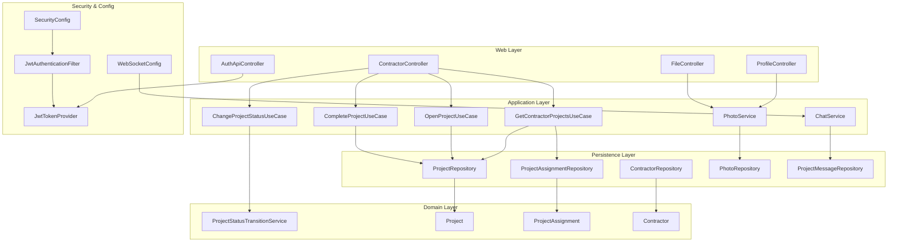
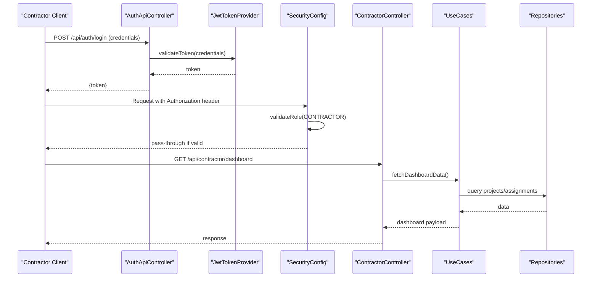
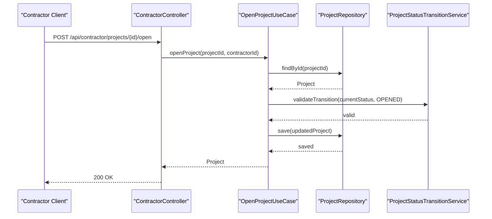
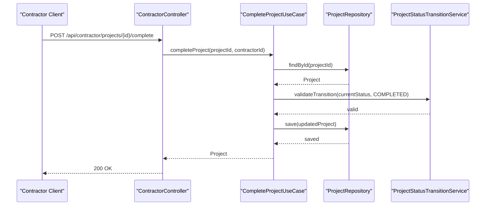
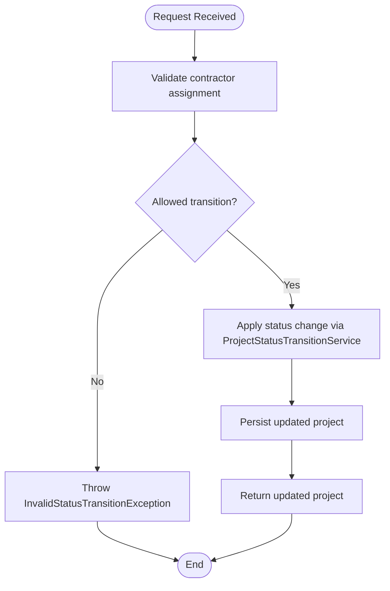
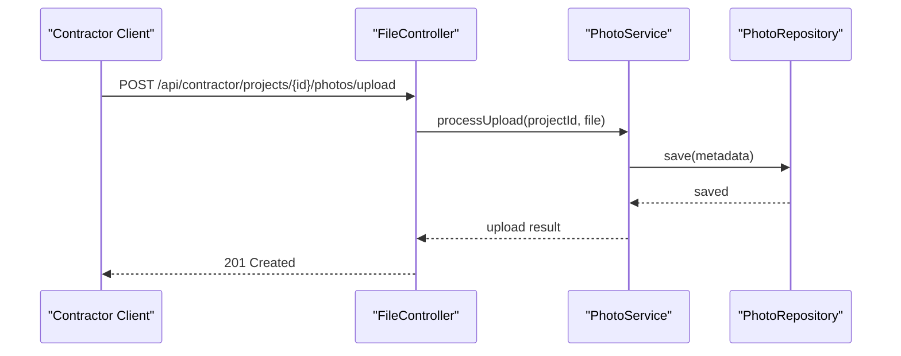
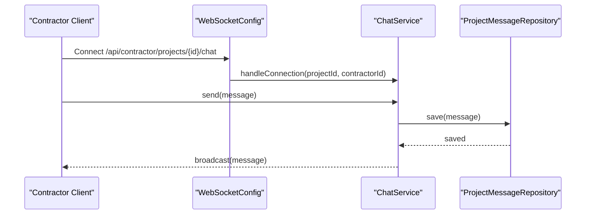
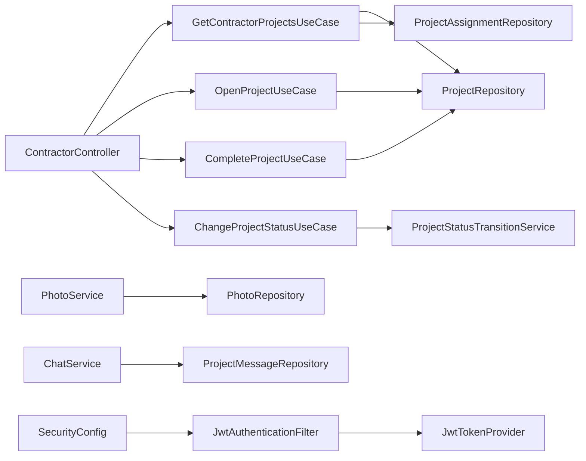

# Contractor APIs

<cite>
**Referenced Files in This Document**
- [SkylinkMediaServiceApplication.java](file://src/main/java/root/cyb/mh/skylink_media_service/SkylinkMediaServiceApplication.java)
- [ContractorController.java](file://src/main/java/root/cyb/mh/skylink_media_service/infrastructure/web/ContractorController.java)
- [Contractor.java](file://src/main/java/root/cyb/mh/skylink_media_service/domain/entities/Contractor.java)
- [GetContractorProjectsUseCase.java](file://src/main/java/root/cyb/mh/skylink_media_service/application/usecases/GetContractorProjectsUseCase.java)
- [OpenProjectUseCase.java](file://src/main/java/root/cyb/mh/skylink_media_service/application/usecases/OpenProjectUseCase.java)
- [CompleteProjectUseCase.java](file://src/main/java/root/cyb/mh/skylink_media_service/application/usecases/CompleteProjectUseCase.java)
- [ChangeProjectStatusUseCase.java](file://src/main/java/root/cyb/mh/skylink_media_service/application/usecases/ChangeProjectStatusUseCase.java)
- [ProjectStatusTransitionService.java](file://src/main/java/root/cyb/mh/skylink_media_service/domain/services/ProjectStatusTransitionService.java)
- [InvalidStatusTransitionException.java](file://src/main/java/root/cyb/mh/skylink_media_service/domain/exceptions/InvalidStatusTransitionException.java)
- [ProjectStatus.java](file://src/main/java/root/cyb/mh/skylink_media_service/domain/valueobjects/ProjectStatus.java)
- [Project.java](file://src/main/java/root/cyb/mh/skylink_media_service/domain/entities/Project.java)
- [ProjectAssignment.java](file://src/main/java/root/cyb/mh/skylink_media_service/domain/entities/ProjectAssignment.java)
- [ProjectAssignmentRepository.java](file://src/main/java/root/cyb/mh/skylink_media_service/infrastructure/persistence/ProjectAssignmentRepository.java)
- [ProjectRepository.java](file://src/main/java/root/cyb/mh/skylink_media_service/infrastructure/persistence/ProjectRepository.java)
- [PhotoService.java](file://src/main/java/root/cyb/mh/skylink_media_service/application/services/PhotoService.java)
- [FileController.java](file://src/main/java/root/cyb/mh/skylink_media_service/infrastructure/web/FileController.java)
- [PhotoRepository.java](file://src/main/java/root/cyb/mh/skylink_media_service/infrastructure/persistence/PhotoRepository.java)
- [ImageCategory.java](file://src/main/java/root/cyb/mh/skylink_media_service/domain/valueobjects/ImageCategory.java)
- [Photo.java](file://src/main/java/root/cyb/mh/skylink_media_service/domain/entities/Photo.java)
- [ChatService.java](file://src/main/java/root/cyb/mh/skylink_media_service/application/services/ChatService.java)
- [ProjectMessage.java](file://src/main/java/root/cyb/mh/skylink_media_service/domain/entities/ProjectMessage.java)
- [ProjectMessageRepository.java](file://src/main/java/root/cyb/mh/skylink_media_service/infrastructure/persistence/ProjectMessageRepository.java)
- [WebSocketConfig.java](file://src/main/java/root/cyb/mh/skylink_media_service/infrastructure/config/WebSocketConfig.java)
- [SecurityConfig.java](file://src/main/java/root/cyb/mh/skylink_media_service/infrastructure/security/SecurityConfig.java)
- [CustomUserDetailsService.java](file://src/main/java/root/cyb/mh/skylink_media_service/infrastructure/security/CustomUserDetailsService.java)
- [JwtAuthenticationFilter.java](file://src/main/java/root/cyb/mh/skylink_media_service/infrastructure/security/jwt/JwtAuthenticationFilter.java)
- [JwtTokenProvider.java](file://src/main/java/root/cyb/mh/skylink_media_service/infrastructure/security/jwt/JwtTokenProvider.java)
- [AuthApiController.java](file://src/main/java/root/cyb/mh/skylink_media_service/infrastructure/web/AuthApiController.java)
- [ContractorLoginUseCase.java](file://src/main/java/root/cyb/mh/skylink_media_service/application/usecases/ContractorLoginUseCase.java)
- [ProfileController.java](file://src/main/java/root/cyb/mh/skylink_media_service/infrastructure/web/ProfileController.java)
- [ContractorRepository.java](file://src/main/java/root/cyb/mh/skylink_media_service/infrastructure/persistence/ContractorRepository.java)
- [RealTimeDashboardService.java](file://src/main/java/root/cyb/mh/skylink_media_service/application/services/RealTimeDashboardService.java)
- [GlobalApiExceptionHandler.java](file://src/main/java/root/cyb/mh/skylink_media_service/infrastructure/web/api/exception/GlobalApiExceptionHandler.java)
</cite>

## Table of Contents
1. [Introduction](#introduction)
2. [Project Structure](#project-structure)
3. [Core Components](#core-components)
4. [Architecture Overview](#architecture-overview)
5. [Detailed Component Analysis](#detailed-component-analysis)
6. [Dependency Analysis](#dependency-analysis)
7. [Performance Considerations](#performance-considerations)
8. [Troubleshooting Guide](#troubleshooting-guide)
9. [Conclusion](#conclusion)
10. [Appendices](#appendices)

## Introduction
This document provides comprehensive API documentation for contractor-specific endpoints within the Skylink Media Service backend. It covers contractor dashboard access, project listing, project opening and completion with status transitions, contractor profile management, project photo uploads, and project chat capabilities. For each endpoint, we specify contractor role requirements, permission validation, and business rule enforcement. Practical contractor workflows and common operations are included to guide implementation and usage.

## Project Structure
The contractor-focused APIs are implemented under the web layer controller package and orchestrated by use cases in the application layer. Persistence repositories handle data access, while domain services enforce business rules such as status transitions. Security is enforced via JWT filters and role-based access control configured in the security layer.

**Diagram sources**
- [ContractorController.java](file://src/main/java/root/cyb/mh/skylink_media_service/infrastructure/web/ContractorController.java)
- [ProfileController.java](file://src/main/java/root/cyb/mh/skylink_media_service/infrastructure/web/ProfileController.java)
- [FileController.java](file://src/main/java/root/cyb/mh/skylink_media_service/infrastructure/web/FileController.java)
- [AuthApiController.java](file://src/main/java/root/cyb/mh/skylink_media_service/infrastructure/web/AuthApiController.java)
- [GetContractorProjectsUseCase.java](file://src/main/java/root/cyb/mh/skylink_media_service/application/usecases/GetContractorProjectsUseCase.java)
- [OpenProjectUseCase.java](file://src/main/java/root/cyb/mh/skylink_media_service/application/usecases/OpenProjectUseCase.java)
- [CompleteProjectUseCase.java](file://src/main/java/root/cyb/mh/skylink_media_service/application/usecases/CompleteProjectUseCase.java)
- [ChangeProjectStatusUseCase.java](file://src/main/java/root/cyb/mh/skylink_media_service/application/usecases/ChangeProjectStatusUseCase.java)
- [ProjectStatusTransitionService.java](file://src/main/java/root/cyb/mh/skylink_media_service/domain/services/ProjectStatusTransitionService.java)
- [ProjectRepository.java](file://src/main/java/root/cyb/mh/skylink_media_service/infrastructure/persistence/ProjectRepository.java)
- [ProjectAssignmentRepository.java](file://src/main/java/root/cyb/mh/skylink_media_service/infrastructure/persistence/ProjectAssignmentRepository.java)
- [ContractorRepository.java](file://src/main/java/root/cyb/mh/skylink_media_service/infrastructure/persistence/ContractorRepository.java)
- [PhotoRepository.java](file://src/main/java/root/cyb/mh/skylink_media_service/infrastructure/persistence/PhotoRepository.java)
- [ProjectMessageRepository.java](file://src/main/java/root/cyb/mh/skylink_media_service/infrastructure/persistence/ProjectMessageRepository.java)
- [SecurityConfig.java](file://src/main/java/root/cyb/mh/skylink_media_service/infrastructure/security/SecurityConfig.java)
- [JwtAuthenticationFilter.java](file://src/main/java/root/cyb/mh/skylink_media_service/infrastructure/security/jwt/JwtAuthenticationFilter.java)
- [JwtTokenProvider.java](file://src/main/java/root/cyb/mh/skylink_media_service/infrastructure/security/jwt/JwtTokenProvider.java)
- [WebSocketConfig.java](file://src/main/java/root/cyb/mh/skylink_media_service/infrastructure/config/WebSocketConfig.java)

**Section sources**
- [SkylinkMediaServiceApplication.java](file://src/main/java/root/cyb/mh/skylink_media_service/SkylinkMediaServiceApplication.java)
- [SecurityConfig.java](file://src/main/java/root/cyb/mh/skylink_media_service/infrastructure/security/SecurityConfig.java)

## Core Components
- ContractorController: Exposes contractor-specific endpoints for dashboard access, project listing, project opening/completion, and project photo upload initiation.
- ProfileController: Handles contractor profile management and updates.
- FileController: Provides file upload endpoints used by contractors for project photos.
- Application Use Cases: Encapsulate business logic for contractor project retrieval, project opening, project completion, and status change requests.
- Domain Services: Enforce status transition rules and validate business constraints.
- Persistence Repositories: Access contractor, project, assignment, photo, and message data.
- Security Filters and Providers: Validate contractor identity and roles using JWT tokens.
- WebSocketConfig: Enables real-time chat for projects.

**Section sources**
- [ContractorController.java](file://src/main/java/root/cyb/mh/skylink_media_service/infrastructure/web/ContractorController.java)
- [ProfileController.java](file://src/main/java/root/cyb/mh/skylink_media_service/infrastructure/web/ProfileController.java)
- [FileController.java](file://src/main/java/root/cyb/mh/skylink_media_service/infrastructure/web/FileController.java)
- [GetContractorProjectsUseCase.java](file://src/main/java/root/cyb/mh/skylink_media_service/application/usecases/GetContractorProjectsUseCase.java)
- [OpenProjectUseCase.java](file://src/main/java/root/cyb/mh/skylink_media_service/application/usecases/OpenProjectUseCase.java)
- [CompleteProjectUseCase.java](file://src/main/java/root/cyb/mh/skylink_media_service/application/usecases/CompleteProjectUseCase.java)
- [ChangeProjectStatusUseCase.java](file://src/main/java/root/cyb/mh/skylink_media_service/application/usecases/ChangeProjectStatusUseCase.java)
- [ProjectStatusTransitionService.java](file://src/main/java/root/cyb/mh/skylink_media_service/domain/services/ProjectStatusTransitionService.java)
- [ProjectRepository.java](file://src/main/java/root/cyb/mh/skylink_media_service/infrastructure/persistence/ProjectRepository.java)
- [ProjectAssignmentRepository.java](file://src/main/java/root/cyb/mh/skylink_media_service/infrastructure/persistence/ProjectAssignmentRepository.java)
- [ContractorRepository.java](file://src/main/java/root/cyb/mh/skylink_media_service/infrastructure/persistence/ContractorRepository.java)
- [PhotoRepository.java](file://src/main/java/root/cyb/mh/skylink_media_service/infrastructure/persistence/PhotoRepository.java)
- [ProjectMessageRepository.java](file://src/main/java/root/cyb/mh/skylink_media_service/infrastructure/persistence/ProjectMessageRepository.java)
- [SecurityConfig.java](file://src/main/java/root/cyb/mh/skylink_media_service/infrastructure/security/SecurityConfig.java)
- [JwtAuthenticationFilter.java](file://src/main/java/root/cyb/mh/skylink_media_service/infrastructure/security/jwt/JwtAuthenticationFilter.java)
- [JwtTokenProvider.java](file://src/main/java/root/cyb/mh/skylink_media_service/infrastructure/security/jwt/JwtTokenProvider.java)
- [WebSocketConfig.java](file://src/main/java/root/cyb/mh/skylink_media_service/infrastructure/config/WebSocketConfig.java)

## Architecture Overview
Contractor APIs follow a layered architecture:
- Web Layer: Controllers expose REST endpoints and delegate to use cases.
- Application Layer: Use cases orchestrate domain services and repositories.
- Domain Layer: Entities and services encapsulate business rules (e.g., status transitions).
- Infrastructure/Persistence: Repositories and services manage data and external integrations.
- Security: JWT filter validates contractor identity and enforces role-based access.
- Real-time: WebSocket configuration enables project chat messaging.

**Diagram sources**
- [AuthApiController.java](file://src/main/java/root/cyb/mh/skylink_media_service/infrastructure/web/AuthApiController.java)
- [JwtTokenProvider.java](file://src/main/java/root/cyb/mh/skylink_media_service/infrastructure/security/jwt/JwtTokenProvider.java)
- [SecurityConfig.java](file://src/main/java/root/cyb/mh/skylink_media_service/infrastructure/security/SecurityConfig.java)
- [ContractorController.java](file://src/main/java/root/cyb/mh/skylink_media_service/infrastructure/web/ContractorController.java)
- [GetContractorProjectsUseCase.java](file://src/main/java/root/cyb/mh/skylink_media_service/application/usecases/GetContractorProjectsUseCase.java)
- [ProjectRepository.java](file://src/main/java/root/cyb/mh/skylink_media_service/infrastructure/persistence/ProjectRepository.java)
- [ProjectAssignmentRepository.java](file://src/main/java/root/cyb/mh/skylink_media_service/infrastructure/persistence/ProjectAssignmentRepository.java)

## Detailed Component Analysis

### Contractor Dashboard Access
- Endpoint: GET /api/contractor/dashboard
- Role requirement: CONTRACTOR
- Permission validation: JWT filter verifies contractor role and token validity.
- Business rule enforcement: Dashboard data includes assigned projects and availability indicators derived from assignments and project statuses.
- Typical response: Dashboard summary metrics and assigned project list.
- Workflow example:
  - Contractor logs in via authentication endpoint.
  - Uses the contractor dashboard endpoint to retrieve assigned projects and availability status.
  - Reviews project details and proceeds to open or complete projects as permitted by status rules.

**Section sources**
- [ContractorController.java](file://src/main/java/root/cyb/mh/skylink_media_service/infrastructure/web/ContractorController.java)
- [RealTimeDashboardService.java](file://src/main/java/root/cyb/mh/skylink_media_service/application/services/RealTimeDashboardService.java)
- [SecurityConfig.java](file://src/main/java/root/cyb/mh/skylink_media_service/infrastructure/security/SecurityConfig.java)
- [JwtAuthenticationFilter.java](file://src/main/java/root/cyb/mh/skylink_media_service/infrastructure/security/jwt/JwtAuthenticationFilter.java)

### Project Listing for Contractors
- Endpoint: GET /api/contractor/projects
- Role requirement: CONTRACTOR
- Permission validation: JWT filter ensures contractor identity.
- Business rule enforcement: Returns only projects assigned to the contractor via ProjectAssignment records; filters by current status rules.
- Response: List of projects with metadata relevant to contractor access.
- Workflow example:
  - Contractor navigates to project listing page.
  - Filters projects by status or due date.
  - Selects a project to open or complete based on current status.

**Section sources**
- [ContractorController.java](file://src/main/java/root/cyb/mh/skylink_media_service/infrastructure/web/ContractorController.java)
- [GetContractorProjectsUseCase.java](file://src/main/java/root/cyb/mh/skylink_media_service/application/usecases/GetContractorProjectsUseCase.java)
- [ProjectAssignmentRepository.java](file://src/main/java/root/cyb/mh/skylink_media_service/infrastructure/persistence/ProjectAssignmentRepository.java)
- [ProjectRepository.java](file://src/main/java/root/cyb/mh/skylink_media_service/infrastructure/persistence/ProjectRepository.java)

### Project Opening Endpoint
- Endpoint: POST /api/contractor/projects/{projectId}/open
- Role requirement: CONTRACTOR
- Permission validation: JWT filter validates contractor role and token.
- Business rule enforcement:
  - Validates that the project exists and is assigned to the contractor.
  - Ensures status transition from a permissible initial state to OPENED using ProjectStatusTransitionService.
  - Throws InvalidStatusTransitionException if transition is invalid.
- Response: Updated project details after successful opening.
- Workflow example:
  - Contractor selects a project from the listing.
  - Initiates project opening; system validates eligibility and transitions status.
  - On success, contractor proceeds to work on the project.

**Diagram sources**
- [ContractorController.java](file://src/main/java/root/cyb/mh/skylink_media_service/infrastructure/web/ContractorController.java)
- [OpenProjectUseCase.java](file://src/main/java/root/cyb/mh/skylink_media_service/application/usecases/OpenProjectUseCase.java)
- [ProjectRepository.java](file://src/main/java/root/cyb/mh/skylink_media_service/infrastructure/persistence/ProjectRepository.java)
- [ProjectStatusTransitionService.java](file://src/main/java/root/cyb/mh/skylink_media_service/domain/services/ProjectStatusTransitionService.java)
- [InvalidStatusTransitionException.java](file://src/main/java/root/cyb/mh/skylink_media_service/domain/exceptions/InvalidStatusTransitionException.java)

**Section sources**
- [OpenProjectUseCase.java](file://src/main/java/root/cyb/mh/skylink_media_service/application/usecases/OpenProjectUseCase.java)
- [ProjectStatusTransitionService.java](file://src/main/java/root/cyb/mh/skylink_media_service/domain/services/ProjectStatusTransitionService.java)
- [InvalidStatusTransitionException.java](file://src/main/java/root/cyb/mh/skylink_media_service/domain/exceptions/InvalidStatusTransitionException.java)

### Project Completion Endpoint
- Endpoint: POST /api/contractor/projects/{projectId}/complete
- Role requirement: CONTRACTOR
- Permission validation: JWT filter validates contractor role and token.
- Business rule enforcement:
  - Validates project assignment to the contractor.
  - Ensures status transition from OPENED to COMPLETED using ProjectStatusTransitionService.
  - Throws InvalidStatusTransitionException if transition is invalid.
- Response: Updated project details after completion.
- Workflow example:
  - Contractor completes work on a project.
  - Initiates completion; system validates eligibility and transitions status.
  - On success, project moves to completed state.

**Diagram sources**
- [ContractorController.java](file://src/main/java/root/cyb/mh/skylink_media_service/infrastructure/web/ContractorController.java)
- [CompleteProjectUseCase.java](file://src/main/java/root/cyb/mh/skylink_media_service/application/usecases/CompleteProjectUseCase.java)
- [ProjectRepository.java](file://src/main/java/root/cyb/mh/skylink_media_service/infrastructure/persistence/ProjectRepository.java)
- [ProjectStatusTransitionService.java](file://src/main/java/root/cyb/mh/skylink_media_service/domain/services/ProjectStatusTransitionService.java)
- [InvalidStatusTransitionException.java](file://src/main/java/root/cyb/mh/skylink_media_service/domain/exceptions/InvalidStatusTransitionException.java)

**Section sources**
- [CompleteProjectUseCase.java](file://src/main/java/root/cyb/mh/skylink_media_service/application/usecases/CompleteProjectUseCase.java)
- [ProjectStatusTransitionService.java](file://src/main/java/root/cyb/mh/skylink_media_service/domain/services/ProjectStatusTransitionService.java)
- [InvalidStatusTransitionException.java](file://src/main/java/root/cyb/mh/skylink_media_service/domain/exceptions/InvalidStatusTransitionException.java)

### Status Transition Logic
- Endpoint: POST /api/contractor/projects/{projectId}/status
- Role requirement: CONTRACTOR
- Permission validation: JWT filter validates contractor role and token.
- Business rule enforcement:
  - Uses ChangeProjectStatusUseCase to validate and apply status changes.
  - Delegates to ProjectStatusTransitionService to ensure valid transitions per ProjectStatus enumeration.
  - Throws InvalidStatusTransitionException for invalid transitions.
- Response: Updated project with new status.
- Workflow example:
  - Contractor initiates a status change request.
  - System validates the transition against allowed state changes.
  - On success, persists the new status and notifies relevant parties.

**Diagram sources**
- [ChangeProjectStatusUseCase.java](file://src/main/java/root/cyb/mh/skylink_media_service/application/usecases/ChangeProjectStatusUseCase.java)
- [ProjectStatusTransitionService.java](file://src/main/java/root/cyb/mh/skylink_media_service/domain/services/ProjectStatusTransitionService.java)
- [ProjectStatus.java](file://src/main/java/root/cyb/mh/skylink_media_service/domain/valueobjects/ProjectStatus.java)
- [InvalidStatusTransitionException.java](file://src/main/java/root/cyb/mh/skylink_media_service/domain/exceptions/InvalidStatusTransitionException.java)

**Section sources**
- [ChangeProjectStatusUseCase.java](file://src/main/java/root/cyb/mh/skylink_media_service/application/usecases/ChangeProjectStatusUseCase.java)
- [ProjectStatusTransitionService.java](file://src/main/java/root/cyb/mh/skylink_media_service/domain/services/ProjectStatusTransitionService.java)
- [ProjectStatus.java](file://src/main/java/root/cyb/mh/skylink_media_service/domain/valueobjects/ProjectStatus.java)
- [InvalidStatusTransitionException.java](file://src/main/java/root/cyb/mh/skylink_media_service/domain/exceptions/InvalidStatusTransitionException.java)

### Contractor Profile Management and Update
- Endpoint: PUT /api/contractor/profile
- Role requirement: CONTRACTOR
- Permission validation: JWT filter validates contractor role and token.
- Business rule enforcement:
  - Updates contractor profile fields via ProfileController.
  - Persists changes using ContractorRepository.
  - Maintains data integrity and validation rules.
- Response: Updated contractor profile.
- Workflow example:
  - Contractor accesses profile page.
  - Edits personal details and saves changes.
  - System validates and persists updates.

**Section sources**
- [ProfileController.java](file://src/main/java/root/cyb/mh/skylink_media_service/infrastructure/web/ProfileController.java)
- [ContractorRepository.java](file://src/main/java/root/cyb/mh/skylink_media_service/infrastructure/persistence/ContractorRepository.java)
- [Contractor.java](file://src/main/java/root/cyb/mh/skylink_media_service/domain/entities/Contractor.java)

### Project Photo Upload APIs (Contractor)
- Endpoints:
  - POST /api/contractor/projects/{projectId}/photos/upload
  - GET /api/contractor/projects/{projectId}/photos
- Role requirement: CONTRACTOR
- Permission validation: JWT filter validates contractor role and token.
- Business rule enforcement:
  - Validates contractor assignment to the project.
  - Uses PhotoService to process uploads and categorize images.
  - Stores metadata via PhotoRepository with ImageCategory constraints.
- Response: Upload confirmation and photo metadata.
- Workflow example:
  - Contractor navigates to project photos page.
  - Uploads images; system stores metadata and generates thumbnails.
  - Retrieves uploaded photos for project review.

**Diagram sources**
- [FileController.java](file://src/main/java/root/cyb/mh/skylink_media_service/infrastructure/web/FileController.java)
- [PhotoService.java](file://src/main/java/root/cyb/mh/skylink_media_service/application/services/PhotoService.java)
- [PhotoRepository.java](file://src/main/java/root/cyb/mh/skylink_media_service/infrastructure/persistence/PhotoRepository.java)
- [ImageCategory.java](file://src/main/java/root/cyb/mh/skylink_media_service/domain/valueobjects/ImageCategory.java)
- [Photo.java](file://src/main/java/root/cyb/mh/skylink_media_service/domain/entities/Photo.java)

**Section sources**
- [FileController.java](file://src/main/java/root/cyb/mh/skylink_media_service/infrastructure/web/FileController.java)
- [PhotoService.java](file://src/main/java/root/cyb/mh/skylink_media_service/application/services/PhotoService.java)
- [PhotoRepository.java](file://src/main/java/root/cyb/mh/skylink_media_service/infrastructure/persistence/PhotoRepository.java)
- [ImageCategory.java](file://src/main/java/root/cyb/mh/skylink_media_service/domain/valueobjects/ImageCategory.java)
- [Photo.java](file://src/main/java/root/cyb/mh/skylink_media_service/domain/entities/Photo.java)

### Project Chat Endpoints (Contractor)
- Endpoints:
  - GET /api/contractor/projects/{projectId}/chat/messages
  - WebSocket: /api/contractor/projects/{projectId}/chat
- Role requirement: CONTRACTOR
- Permission validation: JWT filter validates contractor role and token.
- Business rule enforcement:
  - Retrieves messages via ProjectMessageRepository.
  - Real-time chat enabled via WebSocket configuration.
- Response: Message history and real-time message delivery.
- Workflow example:
  - Contractor opens project chat.
  - Subscribes to WebSocket channel for real-time updates.
  - Sends and receives messages within the project context.

**Diagram sources**
- [WebSocketConfig.java](file://src/main/java/root/cyb/mh/skylink_media_service/infrastructure/config/WebSocketConfig.java)
- [ChatService.java](file://src/main/java/root/cyb/mh/skylink_media_service/application/services/ChatService.java)
- [ProjectMessageRepository.java](file://src/main/java/root/cyb/mh/skylink_media_service/infrastructure/persistence/ProjectMessageRepository.java)
- [ProjectMessage.java](file://src/main/java/root/cyb/mh/skylink_media_service/domain/entities/ProjectMessage.java)

**Section sources**
- [WebSocketConfig.java](file://src/main/java/root/cyb/mh/skylink_media_service/infrastructure/config/WebSocketConfig.java)
- [ChatService.java](file://src/main/java/root/cyb/mh/skylink_media_service/application/services/ChatService.java)
- [ProjectMessageRepository.java](file://src/main/java/root/cyb/mh/skylink_media_service/infrastructure/persistence/ProjectMessageRepository.java)
- [ProjectMessage.java](file://src/main/java/root/cyb/mh/skylink_media_service/domain/entities/ProjectMessage.java)

### Contractor Project Assignment and Availability Management
- Assignment:
  - Contractors are linked to projects via ProjectAssignment entities.
  - ProjectAssignmentRepository manages assignment records.
- Availability:
  - Dashboard and listing endpoints reflect contractor availability based on assignments and project statuses.
- Workflow example:
  - System assigns a project to a contractor.
  - Contractor views availability and assigned projects.
  - Availability updates as project statuses change.

**Section sources**
- [ProjectAssignment.java](file://src/main/java/root/cyb/mh/skylink_media_service/domain/entities/ProjectAssignment.java)
- [ProjectAssignmentRepository.java](file://src/main/java/root/cyb/mh/skylink_media_service/infrastructure/persistence/ProjectAssignmentRepository.java)
- [Project.java](file://src/main/java/root/cyb/mh/skylink_media_service/domain/entities/Project.java)

## Dependency Analysis
The contractor APIs depend on:
- Security layer for role validation and JWT token handling.
- Application use cases for orchestrating business logic.
- Domain services for enforcing status transition rules.
- Persistence repositories for data access.
- Real-time services for chat functionality.

**Diagram sources**
- [ContractorController.java](file://src/main/java/root/cyb/mh/skylink_media_service/infrastructure/web/ContractorController.java)
- [GetContractorProjectsUseCase.java](file://src/main/java/root/cyb/mh/skylink_media_service/application/usecases/GetContractorProjectsUseCase.java)
- [OpenProjectUseCase.java](file://src/main/java/root/cyb/mh/skylink_media_service/application/usecases/OpenProjectUseCase.java)
- [CompleteProjectUseCase.java](file://src/main/java/root/cyb/mh/skylink_media_service/application/usecases/CompleteProjectUseCase.java)
- [ChangeProjectStatusUseCase.java](file://src/main/java/root/cyb/mh/skylink_media_service/application/usecases/ChangeProjectStatusUseCase.java)
- [ProjectRepository.java](file://src/main/java/root/cyb/mh/skylink_media_service/infrastructure/persistence/ProjectRepository.java)
- [ProjectAssignmentRepository.java](file://src/main/java/root/cyb/mh/skylink_media_service/infrastructure/persistence/ProjectAssignmentRepository.java)
- [ProjectStatusTransitionService.java](file://src/main/java/root/cyb/mh/skylink_media_service/domain/services/ProjectStatusTransitionService.java)
- [PhotoService.java](file://src/main/java/root/cyb/mh/skylink_media_service/application/services/PhotoService.java)
- [PhotoRepository.java](file://src/main/java/root/cyb/mh/skylink_media_service/infrastructure/persistence/PhotoRepository.java)
- [ChatService.java](file://src/main/java/root/cyb/mh/skylink_media_service/application/services/ChatService.java)
- [ProjectMessageRepository.java](file://src/main/java/root/cyb/mh/skylink_media_service/infrastructure/persistence/ProjectMessageRepository.java)
- [SecurityConfig.java](file://src/main/java/root/cyb/mh/skylink_media_service/infrastructure/security/SecurityConfig.java)
- [JwtAuthenticationFilter.java](file://src/main/java/root/cyb/mh/skylink_media_service/infrastructure/security/jwt/JwtAuthenticationFilter.java)
- [JwtTokenProvider.java](file://src/main/java/root/cyb/mh/skylink_media_service/infrastructure/security/jwt/JwtTokenProvider.java)

**Section sources**
- [ContractorController.java](file://src/main/java/root/cyb/mh/skylink_media_service/infrastructure/web/ContractorController.java)
- [SecurityConfig.java](file://src/main/java/root/cyb/mh/skylink_media_service/infrastructure/security/SecurityConfig.java)
- [JwtAuthenticationFilter.java](file://src/main/java/root/cyb/mh/skylink_media_service/infrastructure/security/jwt/JwtAuthenticationFilter.java)
- [JwtTokenProvider.java](file://src/main/java/root/cyb/mh/skylink_media_service/infrastructure/security/jwt/JwtTokenProvider.java)

## Performance Considerations
- Token validation overhead: Ensure JWT filter is efficient and caches validated tokens where appropriate.
- Repository queries: Use pagination and filtering for project listings to avoid large result sets.
- Real-time chat: Optimize WebSocket message broadcasting and limit message history retention.
- Photo uploads: Implement asynchronous processing and thumbnail generation to minimize latency.

## Troubleshooting Guide
Common issues and resolutions:
- Unauthorized access: Verify contractor role and valid JWT token in Authorization header.
- Invalid status transition: Review ProjectStatusTransitionService rules and ensure the project is assigned to the contractor.
- Photo upload failures: Confirm contractor assignment and image category constraints.
- Chat connectivity: Ensure WebSocket configuration is active and client reconnects on disconnect.

**Section sources**
- [GlobalApiExceptionHandler.java](file://src/main/java/root/cyb/mh/skylink_media_service/infrastructure/web/api/exception/GlobalApiExceptionHandler.java)
- [InvalidStatusTransitionException.java](file://src/main/java/root/cyb/mh/skylink_media_service/domain/exceptions/InvalidStatusTransitionException.java)

## Conclusion
The contractor APIs provide a secure, role-based interface for contractors to access dashboards, manage projects, update profiles, upload photos, and participate in project chats. Business rules are enforced through dedicated use cases and domain services, ensuring compliance with status transitions and assignment constraints. Proper JWT-based authentication and authorization guarantee that only authorized contractors can perform sensitive operations.

## Appendices
- Authentication flow: Contractors authenticate via the authentication endpoint and receive a JWT token used for subsequent requests.
- Contractor login use case: Validates credentials and returns a token for contractor sessions.

**Section sources**
- [AuthApiController.java](file://src/main/java/root/cyb/mh/skylink_media_service/infrastructure/web/AuthApiController.java)
- [ContractorLoginUseCase.java](file://src/main/java/root/cyb/mh/skylink_media_service/application/usecases/ContractorLoginUseCase.java)