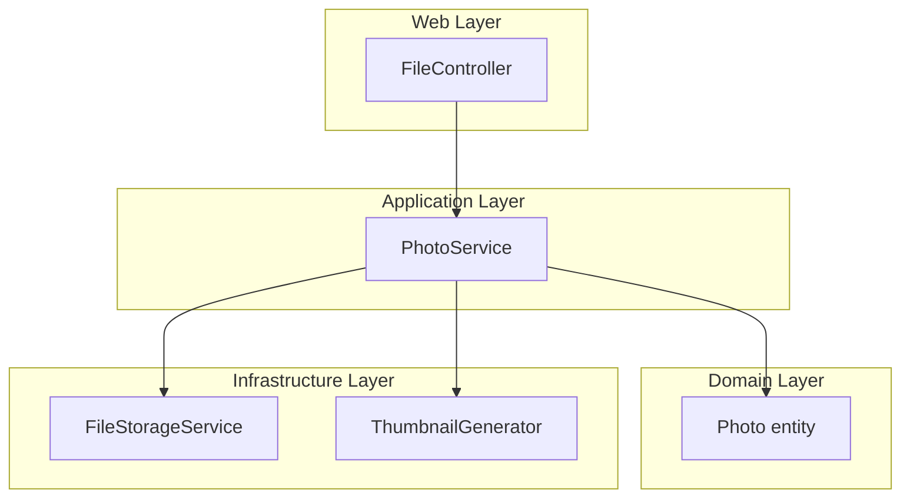
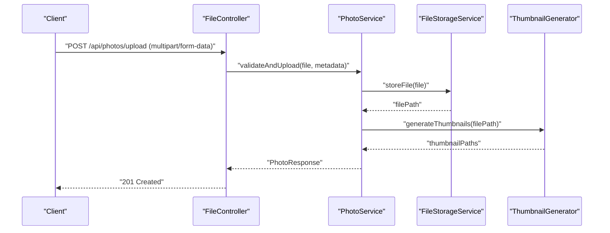
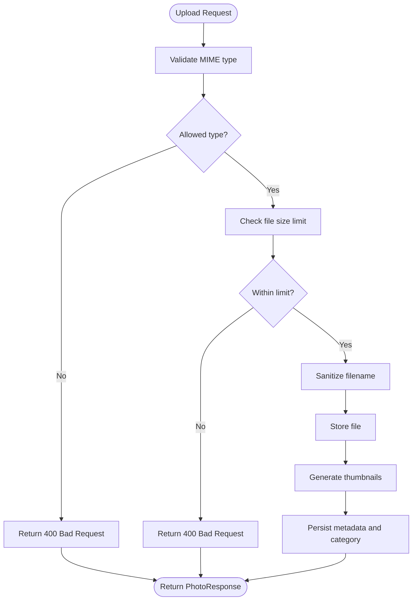
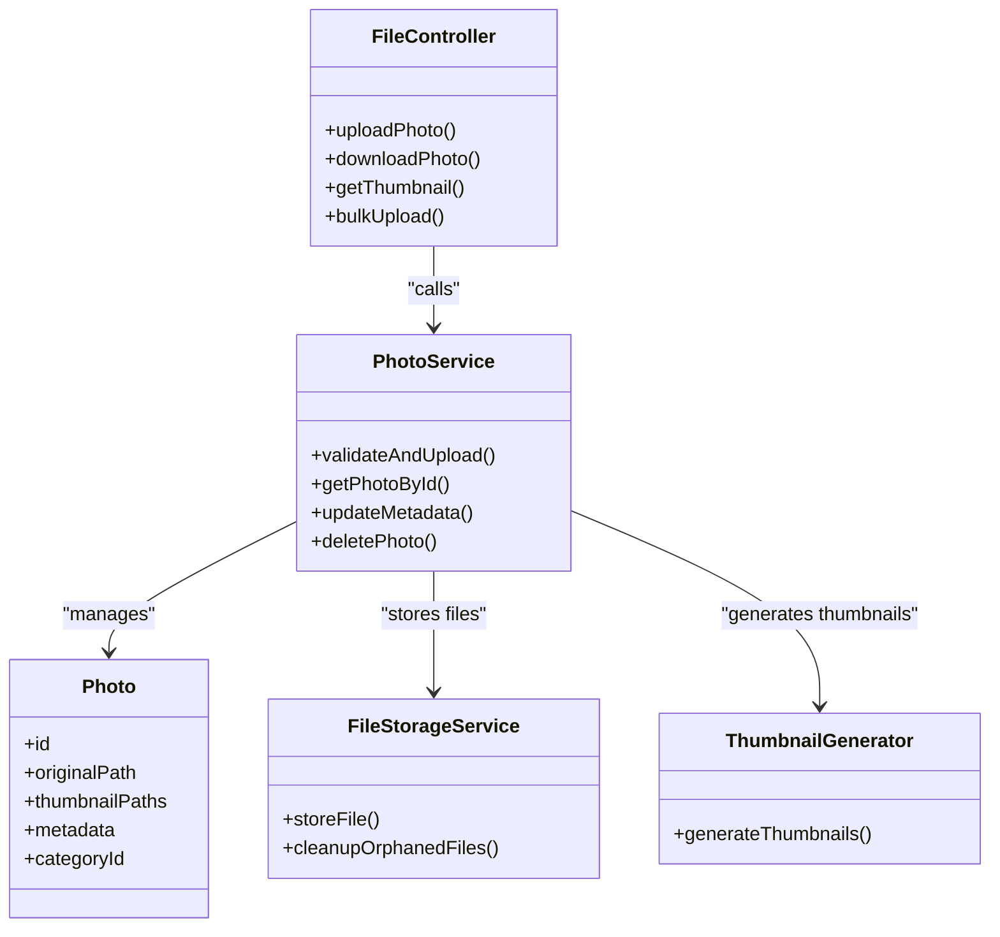

# Photo Management APIs

<cite>
**Referenced Files in This Document**
- [README_API.md](file://README_API.md)
- [REST_API_IMPLEMENTATION.md](file://REST_API_IMPLEMENTATION.md)
- [FileController.java](file://src/main/java/root/cyb/mh/skylink_media_service/infrastructure/web/FileController.java)
- [PhotoService.java](file://src/main/java/root/cyb/mh/skylink_media_service/application/services/PhotoService.java)
- [Photo.java](file://src/main/java/root/cyb/mh/skylink_media_service/domain/entities/Photo.java)
- [FileStorageService.java](file://src/main/java/root/cyb/mh/skylink_media_service/infrastructure/storage/FileStorageService.java)
- [ThumbnailGenerator.java](file://src/main/java/root/cyb/mh/skylink_media_service/infrastructure/storage/ThumbnailGenerator.java)
- [application.properties](file://src/main/resources/application.properties)
- [photo-category-migration.sql](file://photo-category-migration.sql)
- [photo-metadata-migration.sql](file://photo-metadata-migration.sql)
- [photo-optimization-migration.sql](file://photo-optimization-migration.sql)
- [install-webp.sh](file://install-webp.sh)
</cite>

## Table of Contents
1. [Introduction](#introduction)
2. [Project Structure](#project-structure)
3. [Core Components](#core-components)
4. [Architecture Overview](#architecture-overview)
5. [Detailed Component Analysis](#detailed-component-analysis)
6. [Dependency Analysis](#dependency-analysis)
7. [Performance Considerations](#performance-considerations)
8. [Troubleshooting Guide](#troubleshooting-guide)
9. [Conclusion](#conclusion)
10. [Appendices](#appendices)

## Introduction
This document provides comprehensive API documentation for photo management endpoints. It covers image upload via multipart form data, file validation, retrieval of original images and thumbnails, batch operations and bulk uploads, image optimization and WebP conversion, metadata management, and category assignment. For each endpoint, we specify upload limits, supported formats, size restrictions, and processing options. Practical examples of upload requests, response schemas, and error handling scenarios are included to guide developers integrating with the backend.

## Project Structure
The photo management functionality spans several layers:
- Controllers expose REST endpoints for file operations
- Services orchestrate business logic for photos
- Domain entities represent persisted photo records
- Infrastructure handles storage, thumbnail generation, and system commands
- Configuration defines file upload limits and supported formats

**Diagram sources**
- [FileController.java](file://src/main/java/root/cyb/mh/skylink_media_service/infrastructure/web/FileController.java)
- [PhotoService.java](file://src/main/java/root/cyb/mh/skylink_media_service/application/services/PhotoService.java)
- [Photo.java](file://src/main/java/root/cyb/mh/skylink_media_service/domain/entities/Photo.java)
- [FileStorageService.java](file://src/main/java/root/cyb/mh/skylink_media_service/infrastructure/storage/FileStorageService.java)
- [ThumbnailGenerator.java](file://src/main/java/root/cyb/mh/skylink_media_service/infrastructure/storage/ThumbnailGenerator.java)

**Section sources**
- [README_API.md](file://README_API.md)
- [REST_API_IMPLEMENTATION.md](file://REST_API_IMPLEMENTATION.md)

## Core Components
- FileController: Exposes endpoints for uploading, retrieving, and managing photos
- PhotoService: Implements business logic for photo operations, validation, and persistence
- Photo entity: Represents persisted photo metadata and attributes
- FileStorageService: Handles file system storage and cleanup
- ThumbnailGenerator: Generates thumbnails for uploaded images
- Configuration: Defines upload limits and supported formats

Key responsibilities:
- Upload validation: file type, size, and naming checks
- Persistence: storing photo metadata and file paths
- Retrieval: serving original images and thumbnails
- Batch operations: bulk upload and batch updates
- Optimization: resizing, compression, and WebP conversion
- Metadata and categories: managing tags and categorization

**Section sources**
- [FileController.java](file://src/main/java/root/cyb/mh/skylink_media_service/infrastructure/web/FileController.java)
- [PhotoService.java](file://src/main/java/root/cyb/mh/skylink_media_service/application/services/PhotoService.java)
- [Photo.java](file://src/main/java/root/cyb/mh/skylink_media_service/domain/entities/Photo.java)
- [FileStorageService.java](file://src/main/java/root/cyb/mh/skylink_media_service/infrastructure/storage/FileStorageService.java)
- [ThumbnailGenerator.java](file://src/main/java/root/cyb/mh/skylink_media_service/infrastructure/storage/ThumbnailGenerator.java)
- [application.properties](file://src/main/resources/application.properties)

## Architecture Overview
The photo management API follows a layered architecture:
- Web layer: FileController exposes HTTP endpoints
- Application layer: PhotoService coordinates validation, persistence, and processing
- Domain layer: Photo entity encapsulates photo data
- Infrastructure layer: FileStorageService manages storage, ThumbnailGenerator creates thumbnails, and system commands handle optimization

**Diagram sources**
- [FileController.java](file://src/main/java/root/cyb/mh/skylink_media_service/infrastructure/web/FileController.java)
- [PhotoService.java](file://src/main/java/root/cyb/mh/skylink_media_service/application/services/PhotoService.java)
- [FileStorageService.java](file://src/main/java/root/cyb/mh/skylink_media_service/infrastructure/storage/FileStorageService.java)
- [ThumbnailGenerator.java](file://src/main/java/root/cyb/mh/skylink_media_service/infrastructure/storage/ThumbnailGenerator.java)

## Detailed Component Analysis

### Upload Endpoints
Purpose: Accept image uploads via multipart form data with validation and processing.

Supported media types:
- JPEG, PNG, GIF, BMP for standard images
- WebP for optimized delivery (conversion handled during processing)

Upload limits and restrictions:
- Maximum file size configured in application properties
- Allowed MIME types enforced during validation
- Filename sanitization and uniqueness ensured

Processing options:
- Thumbnail generation (multiple sizes)
- Metadata extraction and persistence
- Category assignment
- Optional WebP conversion for delivery optimization

Example request:
- Endpoint: POST /api/photos/upload
- Headers: Content-Type: multipart/form-data
- Fields:
  - file: binary image file
  - metadata: JSON object containing optional fields (title, description, tags)
  - categoryId: integer identifier for category assignment
- Response: PhotoResponse with identifiers, URLs, and processing status

Validation flow:

**Diagram sources**
- [FileController.java](file://src/main/java/root/cyb/mh/skylink_media_service/infrastructure/web/FileController.java)
- [PhotoService.java](file://src/main/java/root/cyb/mh/skylink_media_service/application/services/PhotoService.java)
- [application.properties](file://src/main/resources/application.properties)

**Section sources**
- [FileController.java](file://src/main/java/root/cyb/mh/skylink_media_service/infrastructure/web/FileController.java)
- [PhotoService.java](file://src/main/java/root/cyb/mh/skylink_media_service/application/services/PhotoService.java)
- [application.properties](file://src/main/resources/application.properties)

### Photo Retrieval APIs
Purpose: Download original images and access thumbnails.

Endpoints:
- GET /api/photos/{id}/download: Stream original image
- GET /api/photos/{id}/thumbnail/{size}: Serve thumbnail by size variant
- GET /api/photos/{id}/webp: Serve WebP-optimized variant if available

Access control:
- Requires appropriate authentication/authorization depending on resource visibility
- Public vs private photo visibility governed by metadata flags

Response behavior:
- Original download returns raw image bytes
- Thumbnails return pre-generated variants
- WebP endpoint serves converted format when available

Example request:
- GET /api/photos/123/download
- Response: 200 OK with Content-Disposition attachment and image stream

**Section sources**
- [FileController.java](file://src/main/java/root/cyb/mh/skylink_media_service/infrastructure/web/FileController.java)
- [FileStorageService.java](file://src/main/java/root/cyb/mh/skylink_media_service/infrastructure/storage/FileStorageService.java)
- [ThumbnailGenerator.java](file://src/main/java/root/cyb/mh/skylink_media_service/infrastructure/storage/ThumbnailGenerator.java)

### Batch Operations and Bulk Upload
Purpose: Support uploading multiple photos in a single request and performing bulk actions.

Capabilities:
- Multipart form with multiple file parts
- Batch metadata assignment per photo
- Atomic operation semantics with partial failure reporting

Endpoint:
- POST /api/photos/bulk-upload
- Body: multipart/form-data with multiple files and optional batch metadata array

Processing:
- Validates each file individually
- Applies category and metadata to each photo
- Returns summary with successes and failures

Example request:
- Fields:
  - files: array of image files
  - batchMetadata: array of JSON objects with per-file metadata
- Response: BulkUploadResponse with counts and error lists

**Section sources**
- [FileController.java](file://src/main/java/root/cyb/mh/skylink_media_service/infrastructure/web/FileController.java)
- [PhotoService.java](file://src/main/java/root/cyb/mh/skylink_media_service/application/services/PhotoService.java)

### Image Optimization and WebP Conversion
Purpose: Optimize images for performance and modern delivery formats.

Supported formats:
- Original formats: JPEG, PNG, GIF, BMP
- Optimized delivery: WebP (when conversion enabled)

Conversion process:
- On successful upload, optional WebP generation
- Thumbnail generation with optimized quality
- Compression settings configurable via system properties

Prerequisites:
- WebP tooling installed on the server (installation script provided)

Example request:
- POST /api/photos/upload with optimize=true
- Response includes original and WebP URLs when available

**Section sources**
- [ThumbnailGenerator.java](file://src/main/java/root/cyb/mh/skylink_media_service/infrastructure/storage/ThumbnailGenerator.java)
- [install-webp.sh](file://install-webp.sh)
- [photo-optimization-migration.sql](file://photo-optimization-migration.sql)

### Photo Metadata Management and Category Assignment
Purpose: Manage metadata and assign categories to photos.

Metadata fields:
- Title, description, tags, creation date, uploader, visibility flag
- Optional EXIF-derived metadata extraction

Categories:
- Predefined categories mapped by ID
- Category assignment during upload or update

Persistence:
- Stored in Photo entity with foreign keys to category and user
- Migration scripts define schema and constraints

Example request:
- PUT /api/photos/{id} with JSON body containing metadata and categoryId
- Response: Updated Photo entity with new metadata and category

**Section sources**
- [Photo.java](file://src/main/java/root/cyb/mh/skylink_media_service/domain/entities/Photo.java)
- [photo-metadata-migration.sql](file://photo-metadata-migration.sql)
- [photo-category-migration.sql](file://photo-category-migration.sql)

## Dependency Analysis
The photo management module exhibits clear separation of concerns:
- Controllers depend on services for business logic
- Services depend on domain entities and infrastructure components
- Infrastructure components are cohesive around storage and processing

**Diagram sources**
- [FileController.java](file://src/main/java/root/cyb/mh/skylink_media_service/infrastructure/web/FileController.java)
- [PhotoService.java](file://src/main/java/root/cyb/mh/skylink_media_service/application/services/PhotoService.java)
- [Photo.java](file://src/main/java/root/cyb/mh/skylink_media_service/domain/entities/Photo.java)
- [FileStorageService.java](file://src/main/java/root/cyb/mh/skylink_media_service/infrastructure/storage/FileStorageService.java)
- [ThumbnailGenerator.java](file://src/main/java/root/cyb/mh/skylink_media_service/infrastructure/storage/ThumbnailGenerator.java)

**Section sources**
- [FileController.java](file://src/main/java/root/cyb/mh/skylink_media_service/infrastructure/web/FileController.java)
- [PhotoService.java](file://src/main/java/root/cyb/mh/skylink_media_service/application/services/PhotoService.java)

## Performance Considerations
- Concurrency: Limit concurrent uploads per user to prevent resource exhaustion
- Memory: Stream uploads to avoid loading entire files into memory
- Storage: Use efficient filesystem layout and consider CDN for thumbnails
- Thumbnails: Pre-generate common sizes to reduce on-demand computation
- WebP: Enable conversion only when client supports WebP to avoid unnecessary work
- Validation: Fail fast on invalid types/sizes to minimize wasted processing

## Troubleshooting Guide
Common errors and resolutions:
- 400 Bad Request: Invalid file type or exceeding size limits
  - Verify supported formats and file size thresholds
- 404 Not Found: Photo ID does not exist
  - Confirm photo exists and is accessible to the requester
- 500 Internal Server Error: Storage or thumbnail generation failure
  - Check disk space and permissions; review logs for stack traces
- 413 Payload Too Large: Request exceeds configured limits
  - Adjust application properties for max file size
- WebP conversion errors: Missing WebP tooling
  - Install WebP utilities using provided script

**Section sources**
- [FileController.java](file://src/main/java/root/cyb/mh/skylink_media_service/infrastructure/web/FileController.java)
- [PhotoService.java](file://src/main/java/root/cyb/mh/skylink_media_service/application/services/PhotoService.java)
- [application.properties](file://src/main/resources/application.properties)
- [install-webp.sh](file://install-webp.sh)

## Conclusion
The photo management APIs provide a robust foundation for uploading, organizing, optimizing, and delivering images. By leveraging multipart form data, strict validation, and efficient storage and thumbnail generation, the system supports scalable media workflows. The documented endpoints, constraints, and examples enable developers to integrate seamlessly while maintaining performance and reliability.

## Appendices

### Endpoint Reference Summary
- POST /api/photos/upload: Upload a single image with metadata and category
- POST /api/photos/bulk-upload: Upload multiple images in one request
- GET /api/photos/{id}/download: Download original image
- GET /api/photos/{id}/thumbnail/{size}: Retrieve thumbnail variant
- GET /api/photos/{id}/webp: Retrieve WebP variant if available
- PUT /api/photos/{id}: Update metadata and category

### Configuration Options
- Maximum upload size: configured in application properties
- Supported formats: JPEG, PNG, GIF, BMP, with optional WebP delivery
- Thumbnail sizes: predefined variants managed by thumbnail generator
- Optimization: WebP conversion toggle and compression settings

**Section sources**
- [application.properties](file://src/main/resources/application.properties)
- [REST_API_IMPLEMENTATION.md](file://REST_API_IMPLEMENTATION.md)
- [README_API.md](file://README_API.md)