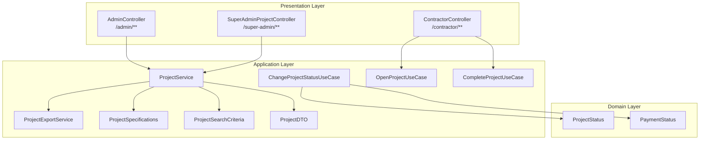
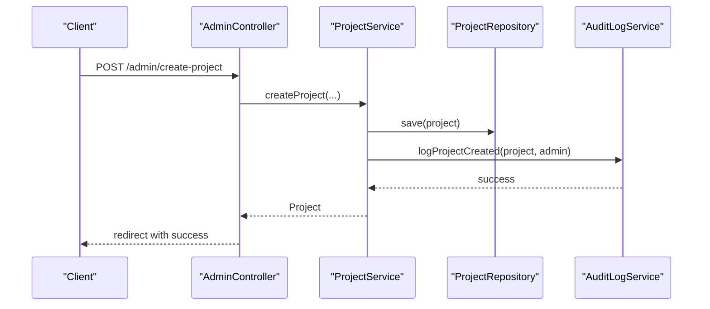
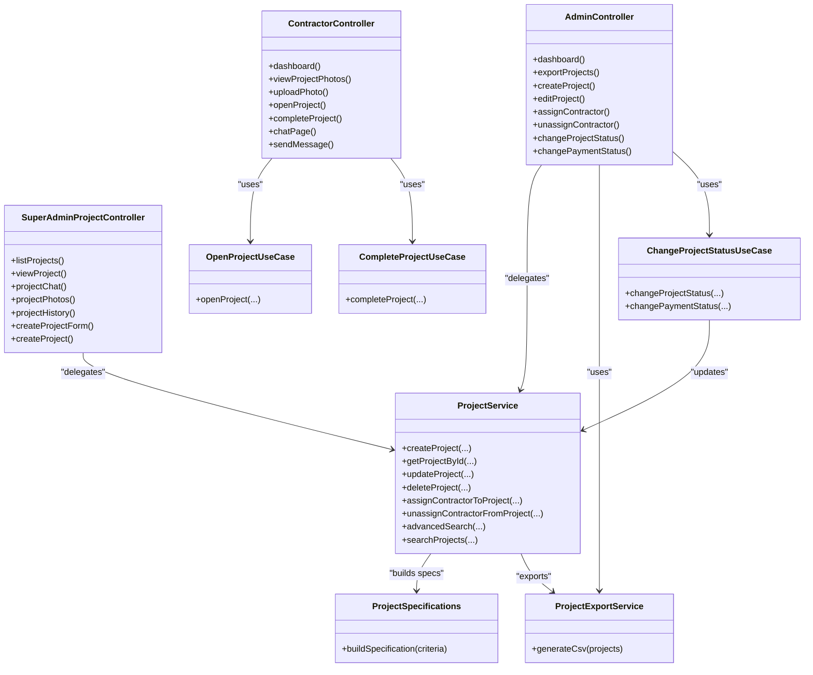

# Project Management APIs

<cite>
**Referenced Files in This Document**
- [SkylinkMediaServiceApplication.java](file://src/main/java/root/cyb/mh/skylink_media_service/SkylinkMediaServiceApplication.java)
- [AdminController.java](file://src/main/java/root/cyb/mh/skylink_media_service/infrastructure/web/AdminController.java)
- [SuperAdminProjectController.java](file://src/main/java/root/cyb/mh/skylink_media_service/infrastructure/web/SuperAdminProjectController.java)
- [ContractorController.java](file://src/main/java/root/cyb/mh/skylink_media_service/infrastructure/web/ContractorController.java)
- [ProjectService.java](file://src/main/java/root/cyb/mh/skylink_media_service/application/services/ProjectService.java)
- [ProjectExportService.java](file://src/main/java/root/cyb/mh/skylink_media_service/application/services/ProjectExportService.java)
- [ProjectSpecifications.java](file://src/main/java/root/cyb/mh/skylink_media_service/application/services/ProjectSpecifications.java)
- [ProjectSearchCriteria.java](file://src/main/java/root/cyb/mh/skylink_media_service/application/dto/ProjectSearchCriteria.java)
- [ProjectDTO.java](file://src/main/java/root/cyb/mh/skylink_media_service/application/dto/ProjectDTO.java)
- [ChangeProjectStatusUseCase.java](file://src/main/java/root/cyb/mh/skylink_media_service/application/usecases/ChangeProjectStatusUseCase.java)
- [CompleteProjectUseCase.java](file://src/main/java/root/cyb/mh/skylink_media_service/application/usecases/CompleteProjectUseCase.java)
- [OpenProjectUseCase.java](file://src/main/java/root/cyb/mh/skylink_media_service/application/usecases/OpenProjectUseCase.java)
- [ProjectStatus.java](file://src/main/java/root/cyb/mh/skylink_media_service/domain/valueobjects/ProjectStatus.java)
- [PaymentStatus.java](file://src/main/java/root/cyb/mh/skylink_media_service/domain/valueobjects/PaymentStatus.java)
- [README_API.md](file://README_API.md)
</cite>

## Table of Contents
1. [Introduction](#introduction)
2. [Project Structure](#project-structure)
3. [Core Components](#core-components)
4. [Architecture Overview](#architecture-overview)
5. [Detailed Component Analysis](#detailed-component-analysis)
6. [Dependency Analysis](#dependency-analysis)
7. [Performance Considerations](#performance-considerations)
8. [Troubleshooting Guide](#troubleshooting-guide)
9. [Conclusion](#conclusion)
10. [Appendices](#appendices)

## Introduction
This document provides comprehensive API documentation for project management endpoints. It covers:
- CRUD operations for projects (creation, reading, updating, deletion)
- Status management endpoints for changing project states and triggering status transitions
- Contractor assignment APIs and project search/filter functionality
- Advanced search endpoints with query parameters and filtering options
- Export functionality for retrieving project data

Each endpoint specifies HTTP methods, URL patterns, request/response schemas, authentication requirements, and role-based access permissions. Practical examples and common use cases are included to help developers integrate the APIs effectively.

## Project Structure
The backend follows a layered architecture with presentation, application, domain, and infrastructure layers. Controllers expose endpoints under web and API namespaces, while services encapsulate business logic and repositories manage persistence.

**Diagram sources**
- [AdminController.java:52-775](file://src/main/java/root/cyb/mh/skylink_media_service/infrastructure/web/AdminController.java#L52-L775)
- [SuperAdminProjectController.java:39-307](file://src/main/java/root/cyb/mh/skylink_media_service/infrastructure/web/SuperAdminProjectController.java#L39-L307)
- [ContractorController.java:34-258](file://src/main/java/root/cyb/mh/skylink_media_service/infrastructure/web/ContractorController.java#L34-L258)
- [ProjectService.java:31-428](file://src/main/java/root/cyb/mh/skylink_media_service/application/services/ProjectService.java#L31-L428)
- [ProjectExportService.java:11-89](file://src/main/java/root/cyb/mh/skylink_media_service/application/services/ProjectExportService.java#L11-L89)
- [ProjectSpecifications.java:13-63](file://src/main/java/root/cyb/mh/skylink_media_service/application/services/ProjectSpecifications.java#L13-L63)
- [ProjectSearchCriteria.java:8-50](file://src/main/java/root/cyb/mh/skylink_media_service/application/dto/ProjectSearchCriteria.java#L8-L50)
- [ProjectDTO.java:6-60](file://src/main/java/root/cyb/mh/skylink_media_service/application/dto/ProjectDTO.java#L6-L60)
- [ChangeProjectStatusUseCase.java:14-97](file://src/main/java/root/cyb/mh/skylink_media_service/application/usecases/ChangeProjectStatusUseCase.java#L14-L97)
- [OpenProjectUseCase.java:13-52](file://src/main/java/root/cyb/mh/skylink_media_service/application/usecases/OpenProjectUseCase.java#L13-L52)
- [CompleteProjectUseCase.java:11-33](file://src/main/java/root/cyb/mh/skylink_media_service/application/usecases/CompleteProjectUseCase.java#L11-L33)
- [ProjectStatus.java:3-54](file://src/main/java/root/cyb/mh/skylink_media_service/domain/valueobjects/ProjectStatus.java#L3-L54)
- [PaymentStatus.java:3-45](file://src/main/java/root/cyb/mh/skylink_media_service/domain/valueobjects/PaymentStatus.java#L3-L45)

**Section sources**
- [SkylinkMediaServiceApplication.java:1-18](file://src/main/java/root/cyb/mh/skylink_media_service/SkylinkMediaServiceApplication.java#L1-L18)
- [AdminController.java:52-775](file://src/main/java/root/cyb/mh/skylink_media_service/infrastructure/web/AdminController.java#L52-L775)
- [SuperAdminProjectController.java:39-307](file://src/main/java/root/cyb/mh/skylink_media_service/infrastructure/web/SuperAdminProjectController.java#L39-L307)
- [ContractorController.java:34-258](file://src/main/java/root/cyb/mh/skylink_media_service/infrastructure/web/ContractorController.java#L34-L258)

## Core Components
- ProjectService: Implements CRUD operations, contractor assignment, advanced search, and project deletion.
- ProjectExportService: Generates CSV exports for projects.
- ProjectSpecifications: Builds JPA Specifications for advanced filtering.
- ProjectSearchCriteria: Encapsulates filter parameters for advanced search.
- ProjectStatus and PaymentStatus: Define allowed state transitions and validation rules.
- Use cases: ChangeProjectStatusUseCase, OpenProjectUseCase, CompleteProjectUseCase.

Key responsibilities:
- Validate inputs and enforce business rules (e.g., contractor assignment limits, status transitions).
- Provide paginated and filtered lists for admin dashboards and super admin views.
- Support export of project data for reporting.

**Section sources**
- [ProjectService.java:31-428](file://src/main/java/root/cyb/mh/skylink_media_service/application/services/ProjectService.java#L31-L428)
- [ProjectExportService.java:11-89](file://src/main/java/root/cyb/mh/skylink_media_service/application/services/ProjectExportService.java#L11-L89)
- [ProjectSpecifications.java:13-63](file://src/main/java/root/cyb/mh/skylink_media_service/application/services/ProjectSpecifications.java#L13-L63)
- [ProjectSearchCriteria.java:8-50](file://src/main/java/root/cyb/mh/skylink_media_service/application/dto/ProjectSearchCriteria.java#L8-L50)
- [ProjectStatus.java:3-54](file://src/main/java/root/cyb/mh/skylink_media_service/domain/valueobjects/ProjectStatus.java#L3-L54)
- [PaymentStatus.java:3-45](file://src/main/java/root/cyb/mh/skylink_media_service/domain/valueobjects/PaymentStatus.java#L3-L45)

## Architecture Overview
The system exposes both web UI routes and REST endpoints. Controllers orchestrate requests, delegate to services, and handle responses. Use cases encapsulate domain-specific workflows for status transitions and contractor actions.

**Diagram sources**
- [AdminController.java:308-359](file://src/main/java/root/cyb/mh/skylink_media_service/infrastructure/web/AdminController.java#L308-L359)
- [ProjectService.java:60-98](file://src/main/java/root/cyb/mh/skylink_media_service/application/services/ProjectService.java#L60-L98)

**Section sources**
- [AdminController.java:52-775](file://src/main/java/root/cyb/mh/skylink_media_service/infrastructure/web/AdminController.java#L52-L775)
- [ProjectService.java:31-428](file://src/main/java/root/cyb/mh/skylink_media_service/application/services/ProjectService.java#L31-L428)

## Detailed Component Analysis

### Project CRUD Endpoints
These endpoints are exposed via web controllers for administrative workflows. They accept form-encoded parameters and return redirects with flash attributes.

- Create Project
  - Method: POST
  - URL: /admin/create-project
  - Auth: Admin session required
  - Permissions: Admin
  - Request parameters:
    - workOrderNumber, location, clientCode, description
    - Optional: ppwNumber, workType, workDetails, clientCompany, customer, loanNumber, loanType, address, receivedDate (yyyy-MM-dd), dueDate (yyyy-MM-dd), assignedTo, woAdmin, invoicePrice (numeric)
  - Response: Redirect to dashboard with success/error flash attribute
  - Notes: Validates uniqueness of work order number and non-negative invoice price.

- Get Project by ID
  - Method: GET
  - URL: /admin/projects/{id} (admin dashboard) or /super-admin/projects/{id} (super admin detail)
  - Auth: Admin/Contractor session required
  - Permissions: Admin, Super Admin, Contractor (if assigned)
  - Response: HTML view with project details and audit logs

- Update Project
  - Method: POST
  - URL: /admin/edit-project/{id}
  - Auth: Admin session required
  - Permissions: Admin
  - Request parameters: Same as create with optional updates
  - Response: Redirect to dashboard with success/error flash attribute
  - Notes: Tracks field-level changes and logs updates.

- Delete Project
  - Method: POST
  - URL: /admin/delete-project/{id}
  - Auth: Admin session required
  - Permissions: Admin (development mode only)
  - Response: Redirect to dashboard with success/error flash attribute
  - Notes: Deletes project and associated data (photos, logs, messages). Disabled in production.

Practical example:
- Create a project with a work order number, location, client code, and description. On success, the UI displays a success message and refreshes the dashboard.

Common use cases:
- Bulk creation via scripts using the same parameter set.
- Editing project details when contractor availability changes.
- Cleanup in development environments only.

**Section sources**
- [AdminController.java:302-518](file://src/main/java/root/cyb/mh/skylink_media_service/infrastructure/web/AdminController.java#L302-L518)
- [SuperAdminProjectController.java:165-305](file://src/main/java/root/cyb/mh/skylink_media_service/infrastructure/web/SuperAdminProjectController.java#L165-L305)
- [ProjectService.java:100-107](file://src/main/java/root/cyb/mh/skylink_media_service/application/services/ProjectService.java#L100-L107)
- [ProjectService.java:226-328](file://src/main/java/root/cyb/mh/skylink_media_service/application/services/ProjectService.java#L226-L328)
- [ProjectService.java:377-411](file://src/main/java/root/cyb/mh/skylink_media_service/application/services/ProjectService.java#L377-L411)

### Status Management Endpoints
Administrators can change project status and payment status. These endpoints enforce strict transition rules.

- Change Project Status
  - Method: POST
  - URL: /admin/change-status/{projectId}
  - Auth: Admin session required
  - Permissions: Admin
  - Request parameters: status (enum)
  - Allowed transitions: Admins can set INFIELD or CLOSED only from READY_TO_OFFICE; other transitions are automatic.
  - Response: Redirect to dashboard with success/error flash attribute

- Change Payment Status
  - Method: POST
  - URL: /admin/change-payment-status/{projectId}
  - Auth: Admin session required
  - Permissions: Admin
  - Request parameters: paymentStatus (enum)
  - Allowed transitions: UNPAID → PARTIAL → PAID (forward-only)
  - Response: Redirect to dashboard with success/error flash attribute

- Assign Contractor and Update Status (Admin-initiated)
  - Method: POST
  - URL: /admin/assign-contractor
  - Auth: Admin session required
  - Permissions: Admin
  - Request parameters: projectId, contractorId
  - Behavior: If project is UNASSIGNED, sets status to ASSIGNED and logs the change.
  - Response: Redirect to dashboard with success/error flash attribute

Practical example:
- Move a project from READY_TO_OFFICE to CLOSED after final inspection.

Common use cases:
- Rework projects by moving back to INFIELD.
- Finalizing completed work by setting CLOSED.
- Updating payment tracking as invoices are issued and settled.

**Section sources**
- [AdminController.java:520-552](file://src/main/java/root/cyb/mh/skylink_media_service/infrastructure/web/AdminController.java#L520-L552)
- [ChangeProjectStatusUseCase.java:29-78](file://src/main/java/root/cyb/mh/skylink_media_service/application/usecases/ChangeProjectStatusUseCase.java#L29-L78)
- [ProjectStatus.java:25-52](file://src/main/java/root/cyb/mh/skylink_media_service/domain/valueobjects/ProjectStatus.java#L25-L52)
- [PaymentStatus.java:22-43](file://src/main/java/root/cyb/mh/skylink_media_service/domain/valueobjects/PaymentStatus.java#L22-L43)

### Contractor Assignment APIs
Contractors can be assigned or unassigned to projects by administrators. Business rules limit assignments to prevent overloading.

- Assign Contractor
  - Method: POST
  - URL: /admin/assign-contractor
  - Auth: Admin session required
  - Permissions: Admin
  - Request parameters: projectId, contractorId
  - Rules:
    - One contractor can handle up to 4 active projects.
    - One project can only have one active contractor (except CLOSED projects).
  - Response: Redirect to dashboard with success/error flash attribute

- Unassign Contractor
  - Method: POST
  - URL: /admin/unassign-contractor
  - Auth: Admin session required
  - Permissions: Admin
  - Request parameters: projectId, contractorId
  - Rules:
    - Cannot unassign from CLOSED projects.
    - If no active assignments remain, project status resets to UNASSIGNED.
  - Response: Redirect to dashboard with success/error flash attribute

Practical example:
- Assign a qualified contractor to an UNASSIGNED project; if successful, the project moves to ASSIGNED.

Common use cases:
- Balancing contractor workload (enforcing the 4-project cap).
- Reassigning projects when priorities change.

**Section sources**
- [AdminController.java:380-406](file://src/main/java/root/cyb/mh/skylink_media_service/infrastructure/web/AdminController.java#L380-L406)
- [ProjectService.java:118-205](file://src/main/java/root/cyb/mh/skylink_media_service/application/services/ProjectService.java#L118-L205)

### Project Search and Filter Endpoints
Advanced search supports multiple filter criteria and pagination for admin dashboards and super admin views.

- Admin Dashboard Search
  - Method: GET
  - URL: /admin/dashboard
  - Auth: Admin session required
  - Permissions: Admin
  - Query parameters:
    - projectSearch (text), status (enum), paymentStatus (enum), dueDateFrom (ISO date), dueDateTo (ISO date), priceFrom (numeric), priceTo (numeric), contractorId (long), contractorSearch (text)
  - Behavior: Builds ProjectSearchCriteria and applies advancedSearch if criteria are present; otherwise returns all projects.
  - Response: HTML dashboard with filtered projects and contractor availability indicators

- Super Admin Projects List
  - Method: GET
  - URL: /super-admin/projects
  - Auth: Super Admin session required
  - Permissions: Super Admin
  - Query parameters: Same as admin dashboard plus pagination (page, size)
  - Response: HTML list with pagination and unread message counts

- Advanced Search Logic
  - Text search matches workOrderNumber, location, clientCode, description (case-insensitive).
  - Filters by status, paymentStatus, dueDate range, price range, and assigned contractor.
  - Uses JPA Specifications to compose dynamic queries.

Practical example:
- Filter projects due within a date range and with a specific payment status.

Common use cases:
- Monitoring overdue projects.
- Generating reports by contractor or status.

**Section sources**
- [AdminController.java:106-203](file://src/main/java/root/cyb/mh/skylink_media_service/infrastructure/web/AdminController.java#L106-L203)
- [SuperAdminProjectController.java:75-161](file://src/main/java/root/cyb/mh/skylink_media_service/infrastructure/web/SuperAdminProjectController.java#L75-L161)
- [ProjectSpecifications.java:15-61](file://src/main/java/root/cyb/mh/skylink_media_service/application/services/ProjectSpecifications.java#L15-L61)
- [ProjectSearchCriteria.java:8-50](file://src/main/java/root/cyb/mh/skylink_media_service/application/dto/ProjectSearchCriteria.java#L8-L50)

### Export Functionality
Administrators can export filtered project lists to CSV for external analysis.

- Export Projects
  - Method: GET
  - URL: /admin/projects/export
  - Auth: Admin session required
  - Permissions: Admin
  - Query parameters: Same as dashboard search
  - Response: CSV file attachment with UTF-8 BOM and headers including work order, client code, location, status, payment status, description, PPW number, work type, client company, customer, loan number, received date, due date, assigned to, WO admin, invoice price, assigned contractors, photo count, created at
  - Notes: Escapes special characters and prevents CSV injection by prefixing formula-like values with a single quote.

Practical example:
- Export all CLOSED projects with due dates in Q1 2026 for financial reconciliation.

Common use cases:
- Reporting to stakeholders.
- Importing into external systems.

**Section sources**
- [AdminController.java:205-266](file://src/main/java/root/cyb/mh/skylink_media_service/infrastructure/web/AdminController.java#L205-L266)
- [ProjectExportService.java:17-87](file://src/main/java/root/cyb/mh/skylink_media_service/application/services/ProjectExportService.java#L17-L87)

### Contractor Actions
Contractors interact with projects through dedicated endpoints for opening, completing, viewing photos, and chatting.

- Open Project
  - Method: POST
  - URL: /contractor/project/{projectId}/open
  - Auth: Contractor session required
  - Permissions: Contractor assigned to project
  - Behavior: Logs first-time view and subsequent views; triggers status transitions via OpenProjectUseCase.
  - Response: Redirect to dashboard with success/error flash attribute

- Complete Project
  - Method: POST
  - URL: /contractor/project/{projectId}/complete
  - Auth: Contractor session required
  - Permissions: Contractor assigned to project
  - Behavior: Marks project as complete via CompleteProjectUseCase.
  - Response: Redirect to dashboard with success/error flash attribute

- View Project Photos
  - Method: GET
  - URL: /contractor/project/{projectId}/photos
  - Auth: Contractor session required
  - Permissions: Contractor assigned to project
  - Response: HTML gallery with project photos

- Upload Photos
  - Method: POST
  - URL: /contractor/upload-photo/{projectId}
  - Auth: Contractor session required
  - Permissions: Contractor assigned to project
  - Request parameters: files (multipart), category (enum, default UNCATEGORIZED)
  - Response: Redirect to dashboard with success/error flash attribute

- Chat with Admin
  - Method: GET/POST
  - URL: /contractor/project/{projectId}/chat
  - Auth: Contractor session required
  - Permissions: Contractor assigned to project
  - Behavior: Sends messages and notifies WO Admin via email.

Practical example:
- A contractor opens a project for the first time; the system records the event and advances the project status appropriately.

Common use cases:
- Tracking field activities and handovers.
- Sharing progress via photos and chat.

**Section sources**
- [ContractorController.java:156-256](file://src/main/java/root/cyb/mh/skylink_media_service/infrastructure/web/ContractorController.java#L156-L256)
- [OpenProjectUseCase.java:26-50](file://src/main/java/root/cyb/mh/skylink_media_service/application/usecases/OpenProjectUseCase.java#L26-L50)
- [CompleteProjectUseCase.java:21-31](file://src/main/java/root/cyb/mh/skylink_media_service/application/usecases/CompleteProjectUseCase.java#L21-L31)

## Dependency Analysis
The following diagram highlights key dependencies among components involved in project management.

**Diagram sources**
- [AdminController.java:52-775](file://src/main/java/root/cyb/mh/skylink_media_service/infrastructure/web/AdminController.java#L52-L775)
- [SuperAdminProjectController.java:39-307](file://src/main/java/root/cyb/mh/skylink_media_service/infrastructure/web/SuperAdminProjectController.java#L39-L307)
- [ContractorController.java:34-258](file://src/main/java/root/cyb/mh/skylink_media_service/infrastructure/web/ContractorController.java#L34-L258)
- [ProjectService.java:31-428](file://src/main/java/root/cyb/mh/skylink_media_service/application/services/ProjectService.java#L31-L428)
- [ProjectExportService.java:11-89](file://src/main/java/root/cyb/mh/skylink_media_service/application/services/ProjectExportService.java#L11-L89)
- [ProjectSpecifications.java:13-63](file://src/main/java/root/cyb/mh/skylink_media_service/application/services/ProjectSpecifications.java#L13-L63)
- [ChangeProjectStatusUseCase.java:14-97](file://src/main/java/root/cyb/mh/skylink_media_service/application/usecases/ChangeProjectStatusUseCase.java#L14-L97)
- [OpenProjectUseCase.java:13-52](file://src/main/java/root/cyb/mh/skylink_media_service/application/usecases/OpenProjectUseCase.java#L13-L52)
- [CompleteProjectUseCase.java:11-33](file://src/main/java/root/cyb/mh/skylink_media_service/application/usecases/CompleteProjectUseCase.java#L11-L33)

**Section sources**
- [ProjectService.java:31-428](file://src/main/java/root/cyb/mh/skylink_media_service/application/services/ProjectService.java#L31-L428)
- [ProjectExportService.java:11-89](file://src/main/java/root/cyb/mh/skylink_media_service/application/services/ProjectExportService.java#L11-L89)
- [ProjectSpecifications.java:13-63](file://src/main/java/root/cyb/mh/skylink_media_service/application/services/ProjectSpecifications.java#L13-L63)
- [ChangeProjectStatusUseCase.java:14-97](file://src/main/java/root/cyb/mh/skylink_media_service/application/usecases/ChangeProjectStatusUseCase.java#L14-L97)
- [OpenProjectUseCase.java:13-52](file://src/main/java/root/cyb/mh/skylink_media_service/application/usecases/OpenProjectUseCase.java#L13-L52)
- [CompleteProjectUseCase.java:11-33](file://src/main/java/root/cyb/mh/skylink_media_service/application/usecases/CompleteProjectUseCase.java#L11-L33)

## Performance Considerations
- Use pagination (page, size) for large datasets in list endpoints to avoid heavy payloads.
- Apply filters early to reduce result sets before rendering views.
- Leverage JPA Specifications to compose efficient queries dynamically.
- Avoid exporting large datasets frequently; cache or pre-generate reports when possible.
- Monitor contractor assignment counts to prevent bottlenecks.

[No sources needed since this section provides general guidance]

## Troubleshooting Guide
Common issues and resolutions:
- 401 Unauthorized: Ensure proper authentication (session or JWT) and valid credentials.
- 403 Forbidden: Verify user roles (Admin, Super Admin, Contractor) and permissions for the requested endpoint.
- Validation errors: Check request parameters for correct types (dates, numeric values) and required fields.
- Business rule violations:
  - Contractor already assigned to project: Unassign first or choose another project.
  - Overloaded contractor: Wait until active projects drop below 4.
  - Cannot unassign from CLOSED projects: Reopen project or adjust status accordingly.
  - Invalid status transitions: Follow allowed sequences defined by ProjectStatus and PaymentStatus.
- Export failures: Confirm filters are valid and CSV generation completes without exceptions.

**Section sources**
- [ProjectService.java:118-205](file://src/main/java/root/cyb/mh/skylink_media_service/application/services/ProjectService.java#L118-L205)
- [ProjectStatus.java:25-52](file://src/main/java/root/cyb/mh/skylink_media_service/domain/valueobjects/ProjectStatus.java#L25-L52)
- [PaymentStatus.java:22-43](file://src/main/java/root/cyb/mh/skylink_media_service/domain/valueobjects/PaymentStatus.java#L22-L43)

## Conclusion
The project management APIs provide robust CRUD, status management, contractor assignment, advanced search, and export capabilities. Administrators and contractors can efficiently manage projects with enforced business rules and clear status transitions. For future enhancements, consider adding REST endpoints for contractor project listings and photo uploads, along with rate limiting and admin API endpoints.

[No sources needed since this section summarizes without analyzing specific files]

## Appendices

### Authentication and Authorization
- Admin session endpoints: /admin/**
- Super Admin session endpoints: /super-admin/**
- Contractor session endpoints: /contractor/**
- JWT endpoints: Refer to the authentication API documentation for login and token usage.

**Section sources**
- [README_API.md:95-117](file://README_API.md#L95-L117)

### Request/Response Schemas
- Project creation/update parameters:
  - Required: workOrderNumber, location, clientCode, description
  - Optional: ppwNumber, workType, workDetails, clientCompany, customer, loanNumber, loanType, address, receivedDate (yyyy-MM-dd), dueDate (yyyy-MM-dd), assignedTo, woAdmin, invoicePrice (numeric)
- Status change parameters:
  - status: enum (UNASSIGNED, ASSIGNED, UNREAD, INFIELD, READY_TO_OFFICE, CLOSED)
  - paymentStatus: enum (UNPAID, PARTIAL, PAID)
- Export response:
  - Content-Type: text/csv; charset=UTF-8
  - Content-Disposition: attachment; filename="projects_export_YYYY-MM-dd_HH-mm-ss.csv"

**Section sources**
- [ProjectDTO.java:6-60](file://src/main/java/root/cyb/mh/skylink_media_service/application/dto/ProjectDTO.java#L6-L60)
- [ProjectStatus.java:3-54](file://src/main/java/root/cyb/mh/skylink_media_service/domain/valueobjects/ProjectStatus.java#L3-L54)
- [PaymentStatus.java:3-45](file://src/main/java/root/cyb/mh/skylink_media_service/domain/valueobjects/PaymentStatus.java#L3-L45)
- [AdminController.java:205-266](file://src/main/java/root/cyb/mh/skylink_media_service/infrastructure/web/AdminController.java#L205-L266)