# Administration Features

<cite>
**Referenced Files in This Document**
- [AdminController.java](file://src/main/java/root/cyb/mh/skylink_media_service/infrastructure/web/AdminController.java)
- [SuperAdminController.java](file://src/main/java/root/cyb/mh/skylink_media_service/infrastructure/web/SuperAdminController.java)
- [UserManagementService.java](file://src/main/java/root/cyb/mh/skylink_media_service/application/services/UserManagementService.java)
- [AuditLogService.java](file://src/main/java/root/cyb/mh/skylink_media_service/application/services/AuditLogService.java)
- [Admin.java](file://src/main/java/root/cyb/mh/skylink_media_service/domain/entities/Admin.java)
- [SuperAdmin.java](file://src/main/java/root/cyb/mh/skylink_media_service/domain/entities/SuperAdmin.java)
- [User.java](file://src/main/java/root/cyb/mh/skylink_media_service/domain/entities/User.java)
- [AdminRepository.java](file://src/main/java/root/cyb/mh/skylink_media_service/infrastructure/persistence/AdminRepository.java)
- [SuperAdminRepository.java](file://src/main/java/root/cyb/mh/skylink_media_service/infrastructure/persistence/SuperAdminRepository.java)
- [UserRepository.java](file://src/main/java/root/cyb/mh/skylink_media_service/infrastructure/persistence/UserRepository.java)
- [SystemAuditLogRepository.java](file://src/main/java/root/cyb/mh/skylink_media_service/infrastructure/persistence/SystemAuditLogRepository.java)
- [LoginAuditLogRepository.java](file://src/main/java/root/cyb/mh/skylink_media_service/infrastructure/persistence/LoginAuditLogRepository.java)
- [ProjectAuditLogRepository.java](file://src/main/java/root/cyb/mh/skylink_media_service/infrastructure/persistence/ProjectAuditLogRepository.java)
- [RealTimeDashboardService.java](file://src/main/java/root/cyb/mh/skylink_media_service/application/services/RealTimeDashboardService.java)
- [dashboard.html](file://src/main/resources/templates/admin/dashboard.html)
- [audit-logs.html](file://src/main/resources/templates/super-admin/audit-logs.html)
- [live-monitor.html](file://src/main/resources/templates/super-admin/live-monitor.html)
- [users.html](file://src/main/resources/templates/super-admin/users.html)
- [login.html](file://src/main/resources/templates/login.html)
- [SecurityConfig.java](file://src/main/java/root/cyb/mh/skylink_media_service/infrastructure/security/SecurityConfig.java)
- [CustomUserDetailsService.java](file://src/main/java/root/cyb/mh/skylink_media_service/infrastructure/security/CustomUserDetailsService.java)
- [JwtAuthenticationFilter.java](file://src/main/java/root/cyb/mh/skylink_media_service/infrastructure/security/jwt/JwtAuthenticationFilter.java)
- [JwtTokenProvider.java](file://src/main/java/root/cyb/mh/skylink_media_service/infrastructure/security/jwt/JwtTokenProvider.java)
- [WebSocketConfig.java](file://src/main/java/root/cyb/mh/skylink_media_service/infrastructure/config/WebSocketConfig.java)
- [SystemAuditLog.java](file://src/main/java/root/cyb/mh/skylink_media_service/domain/entities/SystemAuditLog.java)
- [LoginAuditLog.java](file://src/main/java/root/cyb/mh/skylink_media_service/domain/entities/LoginAuditLog.java)
- [ProjectAuditLog.java](file://src/main/java/root/cyb/mh/skylink_media_service/domain/entities/ProjectAuditLog.java)
</cite>

## Table of Contents
1. [Introduction](#introduction)
2. [Project Structure](#project-structure)
3. [Core Components](#core-components)
4. [Architecture Overview](#architecture-overview)
5. [Detailed Component Analysis](#detailed-component-analysis)
6. [Dependency Analysis](#dependency-analysis)
7. [Performance Considerations](#performance-considerations)
8. [Troubleshooting Guide](#troubleshooting-guide)
9. [Conclusion](#conclusion)
10. [Appendices](#appendices)

## Introduction
This document describes the administration system features of the media service backend, focusing on administrative controllers, user management, auditing, dashboards, and monitoring. It covers the AdminController and SuperAdminController implementations, the UserManagementService for user lifecycle operations, the AuditLogService for activity tracking, and the dashboard interfaces for ADMIN and SUPER_ADMIN roles. It also outlines user registration workflows, role assignment, permissions, monitoring, reporting, and maintenance procedures.

## Project Structure
The administration-related code is organized into:
- Controllers: AdminController and SuperAdminController under infrastructure/web
- Services: UserManagementService, AuditLogService, RealTimeDashboardService under application/services
- Domain Entities: Admin, SuperAdmin, User, and audit log entities under domain/entities
- Persistence: Repositories for Admin, SuperAdmin, User, and audit logs under infrastructure/persistence
- Security: SecurityConfig, CustomUserDetailsService, JWT filter and provider under infrastructure/security
- Templates: Thymeleaf HTML pages for admin and super-admin dashboards under resources/templates

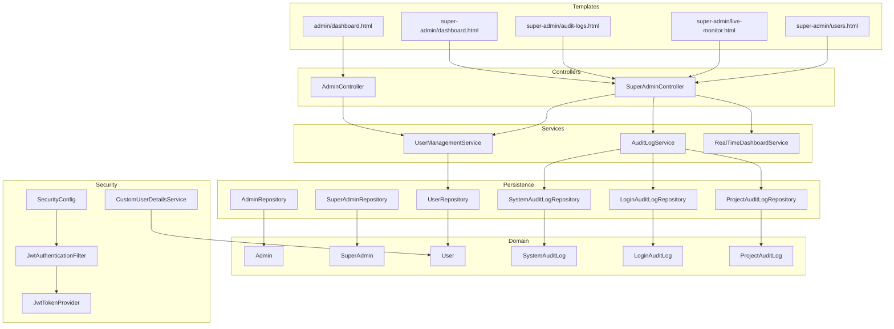

**Diagram sources**
- [AdminController.java](file://src/main/java/root/cyb/mh/skylink_media_service/infrastructure/web/AdminController.java)
- [SuperAdminController.java](file://src/main/java/root/cyb/mh/skylink_media_service/infrastructure/web/SuperAdminController.java)
- [UserManagementService.java](file://src/main/java/root/cyb/mh/skylink_media_service/application/services/UserManagementService.java)
- [AuditLogService.java](file://src/main/java/root/cyb/mh/skylink_media_service/application/services/AuditLogService.java)
- [RealTimeDashboardService.java](file://src/main/java/root/cyb/mh/skylink_media_service/application/services/RealTimeDashboardService.java)
- [Admin.java](file://src/main/java/root/cyb/mh/skylink_media_service/domain/entities/Admin.java)
- [SuperAdmin.java](file://src/main/java/root/cyb/mh/skylink_media_service/domain/entities/SuperAdmin.java)
- [User.java](file://src/main/java/root/cyb/mh/skylink_media_service/domain/entities/User.java)
- [SystemAuditLog.java](file://src/main/java/root/cyb/mh/skylink_media_service/domain/entities/SystemAuditLog.java)
- [LoginAuditLog.java](file://src/main/java/root/cyb/mh/skylink_media_service/domain/entities/LoginAuditLog.java)
- [ProjectAuditLog.java](file://src/main/java/root/cyb/mh/skylink_media_service/domain/entities/ProjectAuditLog.java)
- [AdminRepository.java](file://src/main/java/root/cyb/mh/skylink_media_service/infrastructure/persistence/AdminRepository.java)
- [SuperAdminRepository.java](file://src/main/java/root/cyb/mh/skylink_media_service/infrastructure/persistence/SuperAdminRepository.java)
- [UserRepository.java](file://src/main/java/root/cyb/mh/skylink_media_service/infrastructure/persistence/UserRepository.java)
- [SystemAuditLogRepository.java](file://src/main/java/root/cyb/mh/skylink_media_service/infrastructure/persistence/SystemAuditLogRepository.java)
- [LoginAuditLogRepository.java](file://src/main/java/root/cyb/mh/skylink_media_service/infrastructure/persistence/LoginAuditLogRepository.java)
- [ProjectAuditLogRepository.java](file://src/main/java/root/cyb/mh/skylink_media_service/infrastructure/persistence/ProjectAuditLogRepository.java)
- [SecurityConfig.java](file://src/main/java/root/cyb/mh/skylink_media_service/infrastructure/security/SecurityConfig.java)
- [CustomUserDetailsService.java](file://src/main/java/root/cyb/mh/skylink_media_service/infrastructure/security/CustomUserDetailsService.java)
- [JwtAuthenticationFilter.java](file://src/main/java/root/cyb/mh/skylink_media_service/infrastructure/security/jwt/JwtAuthenticationFilter.java)
- [JwtTokenProvider.java](file://src/main/java/root/cyb/mh/skylink_media_service/infrastructure/security/jwt/JwtTokenProvider.java)
- [dashboard.html](file://src/main/resources/templates/admin/dashboard.html)
- [audit-logs.html](file://src/main/resources/templates/super-admin/audit-logs.html)
- [live-monitor.html](file://src/main/resources/templates/super-admin/live-monitor.html)
- [users.html](file://src/main/resources/templates/super-admin/users.html)

**Section sources**
- [AdminController.java](file://src/main/java/root/cyb/mh/skylink_media_service/infrastructure/web/AdminController.java)
- [SuperAdminController.java](file://src/main/java/root/cyb/mh/skylink_media_service/infrastructure/web/SuperAdminController.java)
- [UserManagementService.java](file://src/main/java/root/cyb/mh/skylink_media_service/application/services/UserManagementService.java)
- [AuditLogService.java](file://src/main/java/root/cyb/mh/skylink_media_service/application/services/AuditLogService.java)
- [RealTimeDashboardService.java](file://src/main/java/root/cyb/mh/skylink_media_service/application/services/RealTimeDashboardService.java)
- [Admin.java](file://src/main/java/root/cyb/mh/skylink_media_service/domain/entities/Admin.java)
- [SuperAdmin.java](file://src/main/java/root/cyb/mh/skylink_media_service/domain/entities/SuperAdmin.java)
- [User.java](file://src/main/java/root/cyb/mh/skylink_media_service/domain/entities/User.java)
- [AdminRepository.java](file://src/main/java/root/cyb/mh/skylink_media_service/infrastructure/persistence/AdminRepository.java)
- [SuperAdminRepository.java](file://src/main/java/root/cyb/mh/skylink_media_service/infrastructure/persistence/SuperAdminRepository.java)
- [UserRepository.java](file://src/main/java/root/cyb/mh/skylink_media_service/infrastructure/persistence/UserRepository.java)
- [SystemAuditLogRepository.java](file://src/main/java/root/cyb/mh/skylink_media_service/infrastructure/persistence/SystemAuditLogRepository.java)
- [LoginAuditLogRepository.java](file://src/main/java/root/cyb/mh/skylink_media_service/infrastructure/persistence/LoginAuditLogRepository.java)
- [ProjectAuditLogRepository.java](file://src/main/java/root/cyb/mh/skylink_media_service/infrastructure/persistence/ProjectAuditLogRepository.java)
- [SecurityConfig.java](file://src/main/java/root/cyb/mh/skylink_media_service/infrastructure/security/SecurityConfig.java)
- [CustomUserDetailsService.java](file://src/main/java/root/cyb/mh/skylink_media_service/infrastructure/security/CustomUserDetailsService.java)
- [JwtAuthenticationFilter.java](file://src/main/java/root/cyb/mh/skylink_media_service/infrastructure/security/jwt/JwtAuthenticationFilter.java)
- [JwtTokenProvider.java](file://src/main/java/root/cyb/mh/skylink_media_service/infrastructure/security/jwt/JwtTokenProvider.java)
- [dashboard.html](file://src/main/resources/templates/admin/dashboard.html)
- [audit-logs.html](file://src/main/resources/templates/super-admin/audit-logs.html)
- [live-monitor.html](file://src/main/resources/templates/super-admin/live-monitor.html)
- [users.html](file://src/main/resources/templates/super-admin/users.html)

## Core Components
- AdminController: Exposes administrative endpoints for admins to manage users and projects.
- SuperAdminController: Provides elevated administrative capabilities for super admins, including audit viewing and system monitoring.
- UserManagementService: Orchestrates user creation, updates, role assignments, and lifecycle operations.
- AuditLogService: Aggregates and persists system, login, and project audit logs for compliance and monitoring.
- RealTimeDashboardService: Powers real-time metrics and monitoring dashboards.
- Domain Entities: Admin, SuperAdmin, User, and audit log entities define the data model.
- Repositories: Persist Admin, SuperAdmin, User, and audit log entities.
- Security Layer: JWT-based authentication and authorization for admin roles.

**Section sources**
- [AdminController.java](file://src/main/java/root/cyb/mh/skylink_media_service/infrastructure/web/AdminController.java)
- [SuperAdminController.java](file://src/main/java/root/cyb/mh/skylink_media_service/infrastructure/web/SuperAdminController.java)
- [UserManagementService.java](file://src/main/java/root/cyb/mh/skylink_media_service/application/services/UserManagementService.java)
- [AuditLogService.java](file://src/main/java/root/cyb/mh/skylink_media_service/application/services/AuditLogService.java)
- [RealTimeDashboardService.java](file://src/main/java/root/cyb/mh/skylink_media_service/application/services/RealTimeDashboardService.java)
- [Admin.java](file://src/main/java/root/cyb/mh/skylink_media_service/domain/entities/Admin.java)
- [SuperAdmin.java](file://src/main/java/root/cyb/mh/skylink_media_service/domain/entities/SuperAdmin.java)
- [User.java](file://src/main/java/root/cyb/mh/skylink_media_service/domain/entities/User.java)
- [SystemAuditLog.java](file://src/main/java/root/cyb/mh/skylink_media_service/domain/entities/SystemAuditLog.java)
- [LoginAuditLog.java](file://src/main/java/root/cyb/mh/skylink_media_service/domain/entities/LoginAuditLog.java)
- [ProjectAuditLog.java](file://src/main/java/root/cyb/mh/skylink_media_service/domain/entities/ProjectAuditLog.java)

## Architecture Overview
The administration subsystem follows a layered architecture:
- Presentation: Controllers expose REST endpoints and render Thymeleaf templates for dashboards.
- Application: Services encapsulate business logic for user management and auditing.
- Domain: Entities represent administrative roles and audit records.
- Persistence: Repositories abstract data access.
- Security: JWT filter validates tokens; CustomUserDetailsService loads user authorities; SecurityConfig enforces role-based access.

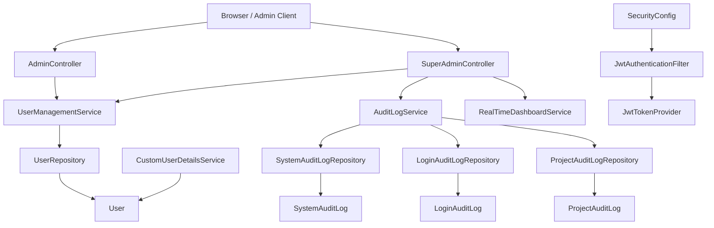

**Diagram sources**
- [AdminController.java](file://src/main/java/root/cyb/mh/skylink_media_service/infrastructure/web/AdminController.java)
- [SuperAdminController.java](file://src/main/java/root/cyb/mh/skylink_media_service/infrastructure/web/SuperAdminController.java)
- [UserManagementService.java](file://src/main/java/root/cyb/mh/skylink_media_service/application/services/UserManagementService.java)
- [AuditLogService.java](file://src/main/java/root/cyb/mh/skylink_media_service/application/services/AuditLogService.java)
- [RealTimeDashboardService.java](file://src/main/java/root/cyb/mh/skylink_media_service/application/services/RealTimeDashboardService.java)
- [UserRepository.java](file://src/main/java/root/cyb/mh/skylink_media_service/infrastructure/persistence/UserRepository.java)
- [SystemAuditLogRepository.java](file://src/main/java/root/cyb/mh/skylink_media_service/infrastructure/persistence/SystemAuditLogRepository.java)
- [LoginAuditLogRepository.java](file://src/main/java/root/cyb/mh/skylink_media_service/infrastructure/persistence/LoginAuditLogRepository.java)
- [ProjectAuditLogRepository.java](file://src/main/java/root/cyb/mh/skylink_media_service/infrastructure/persistence/ProjectAuditLogRepository.java)
- [User.java](file://src/main/java/root/cyb/mh/skylink_media_service/domain/entities/User.java)
- [SystemAuditLog.java](file://src/main/java/root/cyb/mh/skylink_media_service/domain/entities/SystemAuditLog.java)
- [LoginAuditLog.java](file://src/main/java/root/cyb/mh/skylink_media_service/domain/entities/LoginAuditLog.java)
- [ProjectAuditLog.java](file://src/main/java/root/cyb/mh/skylink_media_service/domain/entities/ProjectAuditLog.java)
- [SecurityConfig.java](file://src/main/java/root/cyb/mh/skylink_media_service/infrastructure/security/SecurityConfig.java)
- [JwtAuthenticationFilter.java](file://src/main/java/root/cyb/mh/skylink_media_service/infrastructure/security/jwt/JwtAuthenticationFilter.java)
- [JwtTokenProvider.java](file://src/main/java/root/cyb/mh/skylink_media_service/infrastructure/security/jwt/JwtTokenProvider.java)
- [CustomUserDetailsService.java](file://src/main/java/root/cyb/mh/skylink_media_service/infrastructure/security/CustomUserDetailsService.java)

## Detailed Component Analysis

### AdminController
Responsibilities:
- Manages administrative operations for ADMIN users.
- Delegates user management tasks to UserManagementService.
- Renders admin dashboard and related pages via Thymeleaf.

Key interactions:
- Uses UserManagementService for user CRUD and role updates.
- Integrates with repositories for persistence.
- Protected by role-based security enforced in SecurityConfig.

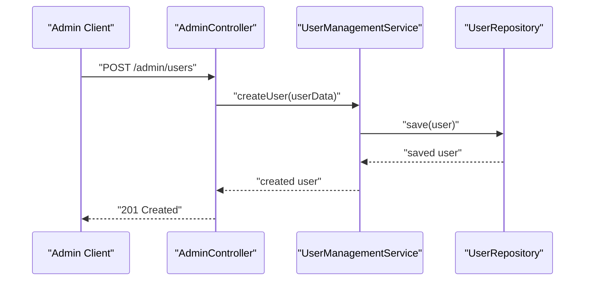

**Diagram sources**
- [AdminController.java](file://src/main/java/root/cyb/mh/skylink_media_service/infrastructure/web/AdminController.java)
- [UserManagementService.java](file://src/main/java/root/cyb/mh/skylink_media_service/application/services/UserManagementService.java)
- [UserRepository.java](file://src/main/java/root/cyb/mh/skylink_media_service/infrastructure/persistence/UserRepository.java)

**Section sources**
- [AdminController.java](file://src/main/java/root/cyb/mh/skylink_media_service/infrastructure/web/AdminController.java)
- [UserManagementService.java](file://src/main/java/root/cyb/mh/skylink_media_service/application/services/UserManagementService.java)
- [UserRepository.java](file://src/main/java/root/cyb/mh/skylink_media_service/infrastructure/persistence/UserRepository.java)

### SuperAdminController
Responsibilities:
- Manages SUPER_ADMIN operations including audit log review, user listing, and live monitoring.
- Delegates to AuditLogService for retrieving audit data.
- Delegates to RealTimeDashboardService for live metrics.

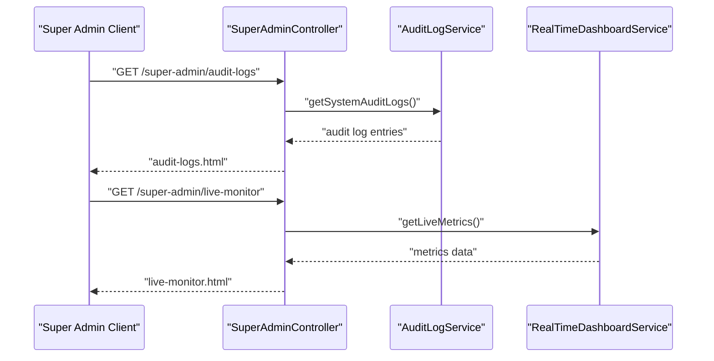

**Diagram sources**
- [SuperAdminController.java](file://src/main/java/root/cyb/mh/skylink_media_service/infrastructure/web/SuperAdminController.java)
- [AuditLogService.java](file://src/main/java/root/cyb/mh/skylink_media_service/application/services/AuditLogService.java)
- [RealTimeDashboardService.java](file://src/main/java/root/cyb/mh/skylink_media_service/application/services/RealTimeDashboardService.java)

**Section sources**
- [SuperAdminController.java](file://src/main/java/root/cyb/mh/skylink_media_service/infrastructure/web/SuperAdminController.java)
- [AuditLogService.java](file://src/main/java/root/cyb/mh/skylink_media_service/application/services/AuditLogService.java)
- [RealTimeDashboardService.java](file://src/main/java/root/cyb/mh/skylink_media_service/application/services/RealTimeDashboardService.java)

### UserManagementService
Responsibilities:
- Creates new users with appropriate roles.
- Updates user profiles and role assignments.
- Manages contractor and admin registrations.
- Coordinates with repositories for persistence.

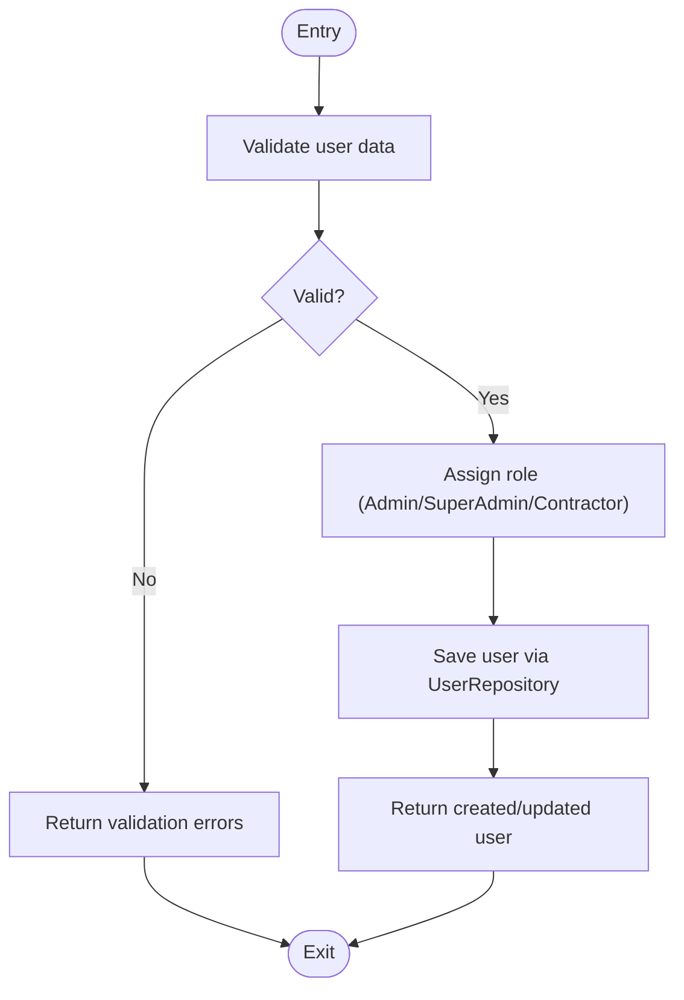

**Diagram sources**
- [UserManagementService.java](file://src/main/java/root/cyb/mh/skylink_media_service/application/services/UserManagementService.java)
- [UserRepository.java](file://src/main/java/root/cyb/mh/skylink_media_service/infrastructure/persistence/UserRepository.java)

**Section sources**
- [UserManagementService.java](file://src/main/java/root/cyb/mh/skylink_media_service/application/services/UserManagementService.java)
- [UserRepository.java](file://src/main/java/root/cyb/mh/skylink_media_service/infrastructure/persistence/UserRepository.java)

### AuditLogService
Responsibilities:
- Aggregates system-wide audit logs, login history, and project-specific audit trails.
- Persists audit records to dedicated repositories.
- Supports filtering and pagination for audit views.

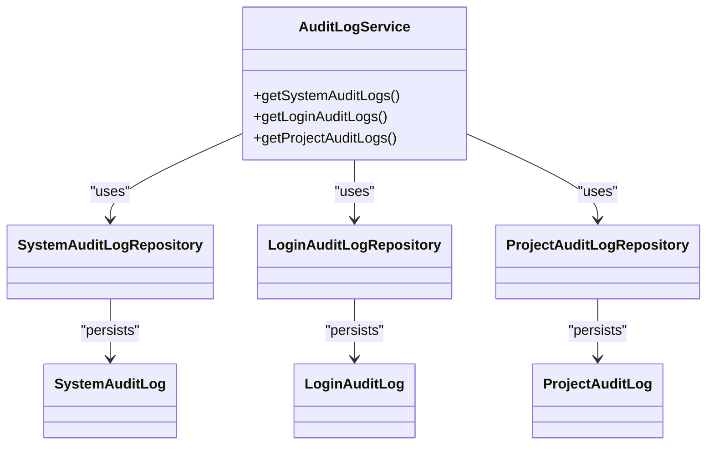

**Diagram sources**
- [AuditLogService.java](file://src/main/java/root/cyb/mh/skylink_media_service/application/services/AuditLogService.java)
- [SystemAuditLogRepository.java](file://src/main/java/root/cyb/mh/skylink_media_service/infrastructure/persistence/SystemAuditLogRepository.java)
- [LoginAuditLogRepository.java](file://src/main/java/root/cyb/mh/skylink_media_service/infrastructure/persistence/LoginAuditLogRepository.java)
- [ProjectAuditLogRepository.java](file://src/main/java/root/cyb/mh/skylink_media_service/infrastructure/persistence/ProjectAuditLogRepository.java)
- [SystemAuditLog.java](file://src/main/java/root/cyb/mh/skylink_media_service/domain/entities/SystemAuditLog.java)
- [LoginAuditLog.java](file://src/main/java/root/cyb/mh/skylink_media_service/domain/entities/LoginAuditLog.java)
- [ProjectAuditLog.java](file://src/main/java/root/cyb/mh/skylink_media_service/domain/entities/ProjectAuditLog.java)

**Section sources**
- [AuditLogService.java](file://src/main/java/root/cyb/mh/skylink_media_service/application/services/AuditLogService.java)
- [SystemAuditLogRepository.java](file://src/main/java/root/cyb/mh/skylink_media_service/infrastructure/persistence/SystemAuditLogRepository.java)
- [LoginAuditLogRepository.java](file://src/main/java/root/cyb/mh/skylink_media_service/infrastructure/persistence/LoginAuditLogRepository.java)
- [ProjectAuditLogRepository.java](file://src/main/java/root/cyb/mh/skylink_media_service/infrastructure/persistence/ProjectAuditLogRepository.java)
- [SystemAuditLog.java](file://src/main/java/root/cyb/mh/skylink_media_service/domain/entities/SystemAuditLog.java)
- [LoginAuditLog.java](file://src/main/java/root/cyb/mh/skylink_media_service/domain/entities/LoginAuditLog.java)
- [ProjectAuditLog.java](file://src/main/java/root/cyb/mh/skylink_media_service/domain/entities/ProjectAuditLog.java)

### Dashboard Interfaces
- Admin Dashboard: Provides admin-specific controls and views rendered via Thymeleaf.
- Super Admin Dashboard: Offers comprehensive monitoring, audit reviews, and user management views.
- Live Monitoring: Real-time metrics and alerts for system health.
- Users Management: Lists and manages users with role assignments.

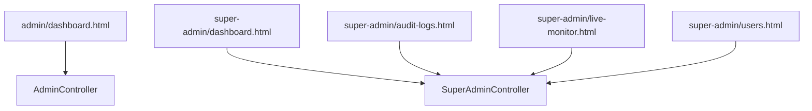

**Diagram sources**
- [dashboard.html](file://src/main/resources/templates/admin/dashboard.html)
- [audit-logs.html](file://src/main/resources/templates/super-admin/audit-logs.html)
- [live-monitor.html](file://src/main/resources/templates/super-admin/live-monitor.html)
- [users.html](file://src/main/resources/templates/super-admin/users.html)
- [AdminController.java](file://src/main/java/root/cyb/mh/skylink_media_service/infrastructure/web/AdminController.java)
- [SuperAdminController.java](file://src/main/java/root/cyb/mh/skylink_media_service/infrastructure/web/SuperAdminController.java)

**Section sources**
- [dashboard.html](file://src/main/resources/templates/admin/dashboard.html)
- [audit-logs.html](file://src/main/resources/templates/super-admin/audit-logs.html)
- [live-monitor.html](file://src/main/resources/templates/super-admin/live-monitor.html)
- [users.html](file://src/main/resources/templates/super-admin/users.html)
- [AdminController.java](file://src/main/java/root/cyb/mh/skylink_media_service/infrastructure/web/AdminController.java)
- [SuperAdminController.java](file://src/main/java/root/cyb/mh/skylink_media_service/infrastructure/web/SuperAdminController.java)

### User Registration Workflows and Role Assignment
- Registration initiation: Access login page and navigate to registration forms.
- Role selection: Based on registration form, assign role (Admin, SuperAdmin, Contractor).
- Validation: Validate input data and credentials.
- Persistence: Save user entity via UserRepository.
- Audit: Record registration event in audit logs.

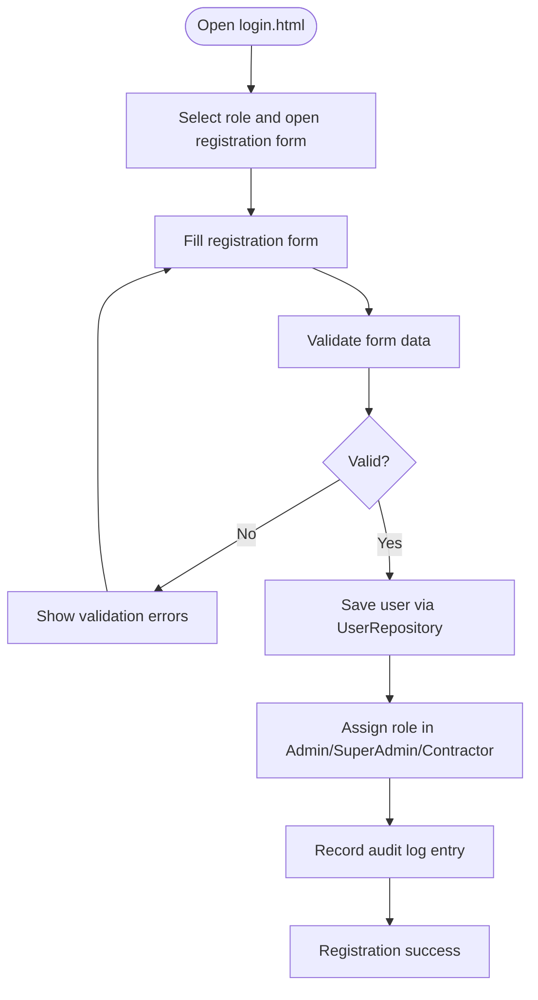

**Diagram sources**
- [login.html](file://src/main/resources/templates/login.html)
- [UserRepository.java](file://src/main/java/root/cyb/mh/skylink_media_service/infrastructure/persistence/UserRepository.java)
- [SystemAuditLogRepository.java](file://src/main/java/root/cyb/mh/skylink_media_service/infrastructure/persistence/SystemAuditLogRepository.java)

**Section sources**
- [login.html](file://src/main/resources/templates/login.html)
- [UserRepository.java](file://src/main/java/root/cyb/mh/skylink_media_service/infrastructure/persistence/UserRepository.java)
- [SystemAuditLogRepository.java](file://src/main/java/root/cyb/mh/skylink_media_service/infrastructure/persistence/SystemAuditLogRepository.java)

### Permission Management
- Role-based access control: SecurityConfig enforces ADMIN vs SUPER_ADMIN privileges.
- JWT-based authentication: JwtAuthenticationFilter validates tokens; JwtTokenProvider generates/verifies tokens.
- User details loading: CustomUserDetailsService loads user authorities for authorization.

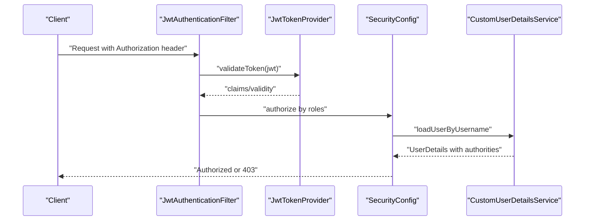

**Diagram sources**
- [JwtAuthenticationFilter.java](file://src/main/java/root/cyb/mh/skylink_media_service/infrastructure/security/jwt/JwtAuthenticationFilter.java)
- [JwtTokenProvider.java](file://src/main/java/root/cyb/mh/skylink_media_service/infrastructure/security/jwt/JwtTokenProvider.java)
- [SecurityConfig.java](file://src/main/java/root/cyb/mh/skylink_media_service/infrastructure/security/SecurityConfig.java)
- [CustomUserDetailsService.java](file://src/main/java/root/cyb/mh/skylink_media_service/infrastructure/security/CustomUserDetailsService.java)

**Section sources**
- [SecurityConfig.java](file://src/main/java/root/cyb/mh/skylink_media_service/infrastructure/security/SecurityConfig.java)
- [JwtAuthenticationFilter.java](file://src/main/java/root/cyb/mh/skylink_media_service/infrastructure/security/jwt/JwtAuthenticationFilter.java)
- [JwtTokenProvider.java](file://src/main/java/root/cyb/mh/skylink_media_service/infrastructure/security/jwt/JwtTokenProvider.java)
- [CustomUserDetailsService.java](file://src/main/java/root/cyb/mh/skylink_media_service/infrastructure/security/CustomUserDetailsService.java)

### System Monitoring and Reporting
- Real-time metrics: RealTimeDashboardService provides live monitoring data.
- Audit reporting: SuperAdminController exposes audit log views for system and login history.
- WebSocket support: WebSocketConfig enables real-time updates for dashboards.

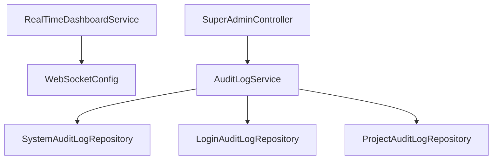

**Diagram sources**
- [RealTimeDashboardService.java](file://src/main/java/root/cyb/mh/skylink_media_service/application/services/RealTimeDashboardService.java)
- [WebSocketConfig.java](file://src/main/java/root/cyb/mh/skylink_media_service/infrastructure/config/WebSocketConfig.java)
- [SuperAdminController.java](file://src/main/java/root/cyb/mh/skylink_media_service/infrastructure/web/SuperAdminController.java)
- [AuditLogService.java](file://src/main/java/root/cyb/mh/skylink_media_service/application/services/AuditLogService.java)
- [SystemAuditLogRepository.java](file://src/main/java/root/cyb/mh/skylink_media_service/infrastructure/persistence/SystemAuditLogRepository.java)
- [LoginAuditLogRepository.java](file://src/main/java/root/cyb/mh/skylink_media_service/infrastructure/persistence/LoginAuditLogRepository.java)
- [ProjectAuditLogRepository.java](file://src/main/java/root/cyb/mh/skylink_media_service/infrastructure/persistence/ProjectAuditLogRepository.java)

**Section sources**
- [RealTimeDashboardService.java](file://src/main/java/root/cyb/mh/skylink_media_service/application/services/RealTimeDashboardService.java)
- [WebSocketConfig.java](file://src/main/java/root/cyb/mh/skylink_media_service/infrastructure/config/WebSocketConfig.java)
- [SuperAdminController.java](file://src/main/java/root/cyb/mh/skylink_media_service/infrastructure/web/SuperAdminController.java)
- [AuditLogService.java](file://src/main/java/root/cyb/mh/skylink_media_service/application/services/AuditLogService.java)
- [SystemAuditLogRepository.java](file://src/main/java/root/cyb/mh/skylink_media_service/infrastructure/persistence/SystemAuditLogRepository.java)
- [LoginAuditLogRepository.java](file://src/main/java/root/cyb/mh/skylink_media_service/infrastructure/persistence/LoginAuditLogRepository.java)
- [ProjectAuditLogRepository.java](file://src/main/java/root/cyb/mh/skylink_media_service/infrastructure/persistence/ProjectAuditLogRepository.java)

### Administrative Tasks and Maintenance Procedures
- User lifecycle management: Create, update, deactivate users; assign/remove roles.
- Audit review: Browse system and login audit logs; export or filter entries.
- Monitoring: View live metrics; receive alerts via WebSocket-enabled dashboards.
- Maintenance: Clean up orphaned data, rotate audit logs, and monitor system health.

[No sources needed since this section provides general guidance]

## Dependency Analysis
Administrative components depend on:
- Controllers depend on Services for business logic.
- Services depend on Repositories for persistence.
- Security components enforce role-based access and JWT validation.
- Templates depend on controllers for rendering data.

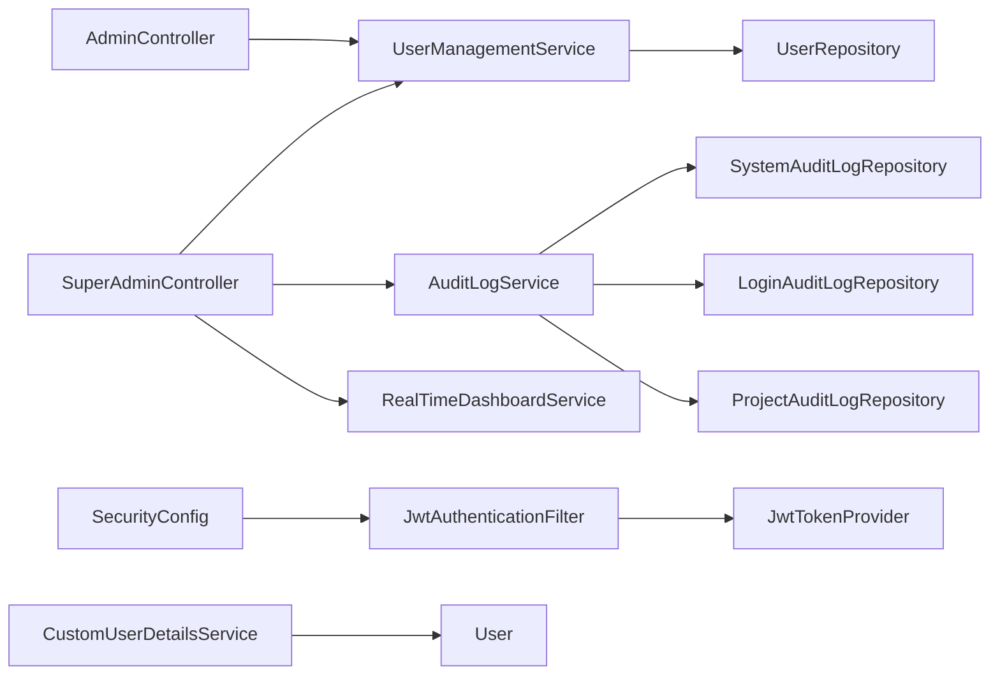

**Diagram sources**
- [AdminController.java](file://src/main/java/root/cyb/mh/skylink_media_service/infrastructure/web/AdminController.java)
- [SuperAdminController.java](file://src/main/java/root/cyb/mh/skylink_media_service/infrastructure/web/SuperAdminController.java)
- [UserManagementService.java](file://src/main/java/root/cyb/mh/skylink_media_service/application/services/UserManagementService.java)
- [AuditLogService.java](file://src/main/java/root/cyb/mh/skylink_media_service/application/services/AuditLogService.java)
- [RealTimeDashboardService.java](file://src/main/java/root/cyb/mh/skylink_media_service/application/services/RealTimeDashboardService.java)
- [UserRepository.java](file://src/main/java/root/cyb/mh/skylink_media_service/infrastructure/persistence/UserRepository.java)
- [SystemAuditLogRepository.java](file://src/main/java/root/cyb/mh/skylink_media_service/infrastructure/persistence/SystemAuditLogRepository.java)
- [LoginAuditLogRepository.java](file://src/main/java/root/cyb/mh/skylink_media_service/infrastructure/persistence/LoginAuditLogRepository.java)
- [ProjectAuditLogRepository.java](file://src/main/java/root/cyb/mh/skylink_media_service/infrastructure/persistence/ProjectAuditLogRepository.java)
- [SecurityConfig.java](file://src/main/java/root/cyb/mh/skylink_media_service/infrastructure/security/SecurityConfig.java)
- [JwtAuthenticationFilter.java](file://src/main/java/root/cyb/mh/skylink_media_service/infrastructure/security/jwt/JwtAuthenticationFilter.java)
- [JwtTokenProvider.java](file://src/main/java/root/cyb/mh/skylink_media_service/infrastructure/security/jwt/JwtTokenProvider.java)
- [CustomUserDetailsService.java](file://src/main/java/root/cyb/mh/skylink_media_service/infrastructure/security/CustomUserDetailsService.java)
- [User.java](file://src/main/java/root/cyb/mh/skylink_media_service/domain/entities/User.java)

**Section sources**
- [AdminController.java](file://src/main/java/root/cyb/mh/skylink_media_service/infrastructure/web/AdminController.java)
- [SuperAdminController.java](file://src/main/java/root/cyb/mh/skylink_media_service/infrastructure/web/SuperAdminController.java)
- [UserManagementService.java](file://src/main/java/root/cyb/mh/skylink_media_service/application/services/UserManagementService.java)
- [AuditLogService.java](file://src/main/java/root/cyb/mh/skylink_media_service/application/services/AuditLogService.java)
- [RealTimeDashboardService.java](file://src/main/java/root/cyb/mh/skylink_media_service/application/services/RealTimeDashboardService.java)
- [UserRepository.java](file://src/main/java/root/cyb/mh/skylink_media_service/infrastructure/persistence/UserRepository.java)
- [SystemAuditLogRepository.java](file://src/main/java/root/cyb/mh/skylink_media_service/infrastructure/persistence/SystemAuditLogRepository.java)
- [LoginAuditLogRepository.java](file://src/main/java/root/cyb/mh/skylink_media_service/infrastructure/persistence/LoginAuditLogRepository.java)
- [ProjectAuditLogRepository.java](file://src/main/java/root/cyb/mh/skylink_media_service/infrastructure/persistence/ProjectAuditLogRepository.java)
- [SecurityConfig.java](file://src/main/java/root/cyb/mh/skylink_media_service/infrastructure/security/SecurityConfig.java)
- [JwtAuthenticationFilter.java](file://src/main/java/root/cyb/mh/skylink_media_service/infrastructure/security/jwt/JwtAuthenticationFilter.java)
- [JwtTokenProvider.java](file://src/main/java/root/cyb/mh/skylink_media_service/infrastructure/security/jwt/JwtTokenProvider.java)
- [CustomUserDetailsService.java](file://src/main/java/root/cyb/mh/skylink_media_service/infrastructure/security/CustomUserDetailsService.java)
- [User.java](file://src/main/java/root/cyb/mh/skylink_media_service/domain/entities/User.java)

## Performance Considerations
- Use paginated queries for audit log retrieval to avoid large result sets.
- Index audit log tables on timestamps and user identifiers for efficient filtering.
- Cache frequently accessed dashboard metrics to reduce database load.
- Apply rate limiting on administrative endpoints to prevent abuse.

[No sources needed since this section provides general guidance]

## Troubleshooting Guide
Common issues and resolutions:
- Authentication failures: Verify JWT token validity and expiration via JwtTokenProvider; check SecurityConfig filters.
- Authorization errors: Confirm user roles and authorities loaded by CustomUserDetailsService.
- Audit log gaps: Review AuditLogService aggregation and repository writes; ensure proper transaction boundaries.
- Dashboard latency: Investigate RealTimeDashboardService metrics and WebSocketConfig for real-time updates.

**Section sources**
- [JwtTokenProvider.java](file://src/main/java/root/cyb/mh/skylink_media_service/infrastructure/security/jwt/JwtTokenProvider.java)
- [SecurityConfig.java](file://src/main/java/root/cyb/mh/skylink_media_service/infrastructure/security/SecurityConfig.java)
- [CustomUserDetailsService.java](file://src/main/java/root/cyb/mh/skylink_media_service/infrastructure/security/CustomUserDetailsService.java)
- [AuditLogService.java](file://src/main/java/root/cyb/mh/skylink_media_service/application/services/AuditLogService.java)
- [RealTimeDashboardService.java](file://src/main/java/root/cyb/mh/skylink_media_service/application/services/RealTimeDashboardService.java)

## Conclusion
The administration system integrates role-based controllers, robust user management, comprehensive auditing, and real-time monitoring. AdminController and SuperAdminController provide targeted administrative capabilities, while UserManagementService and AuditLogService ensure secure and traceable operations. Dashboards deliver actionable insights, and the security layer enforces strict access control.

[No sources needed since this section summarizes without analyzing specific files]

## Appendices
- Administrative endpoints and templates are located under infrastructure/web and resources/templates respectively.
- Ensure repositories are properly indexed and transactions are configured for audit log writes.

[No sources needed since this section provides general guidance]