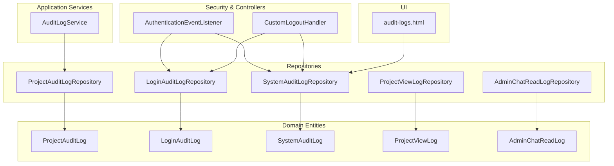
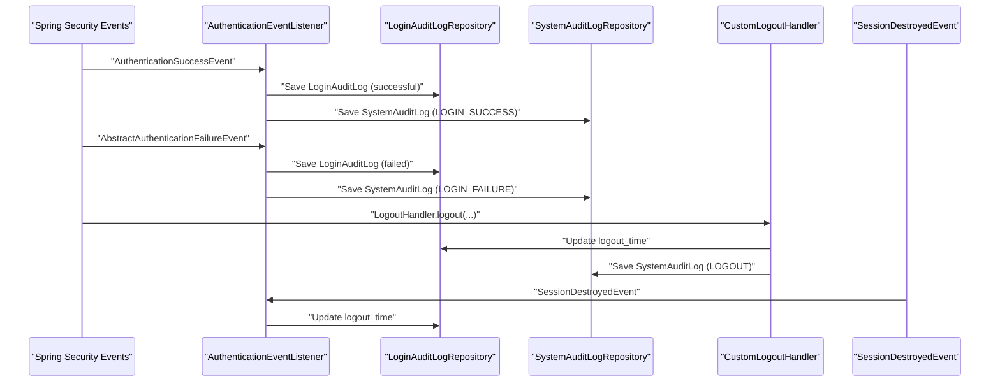
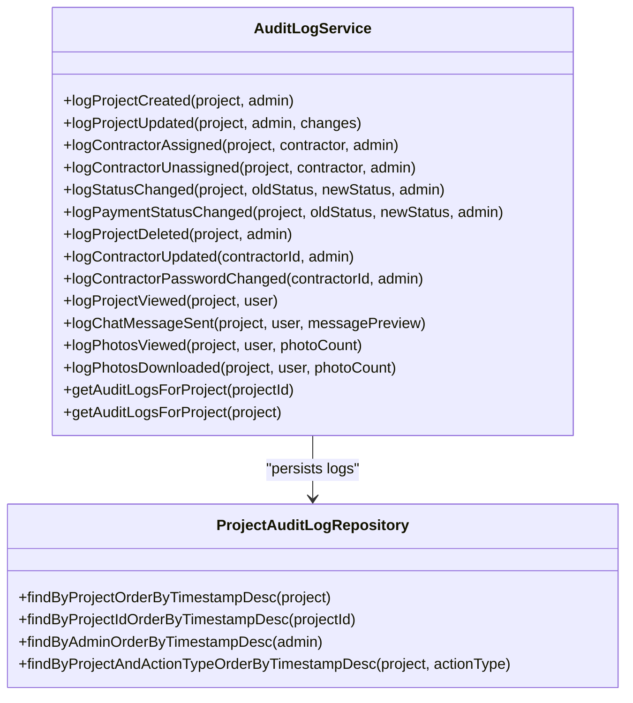
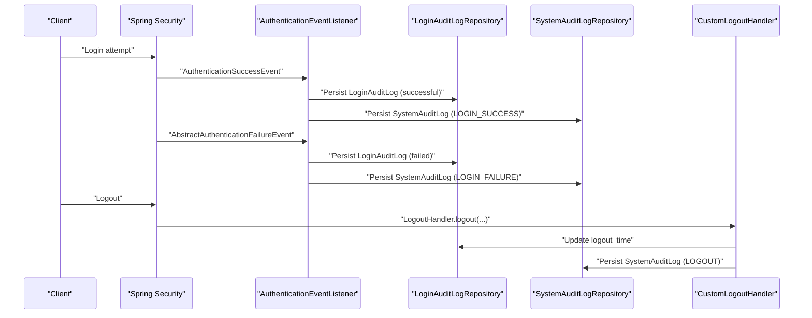
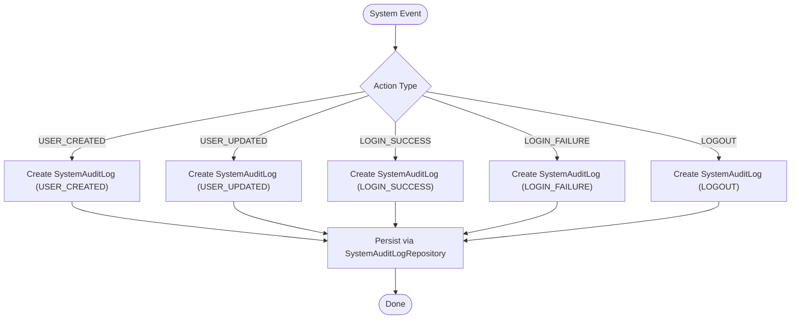
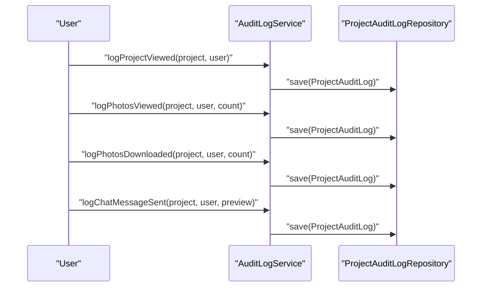
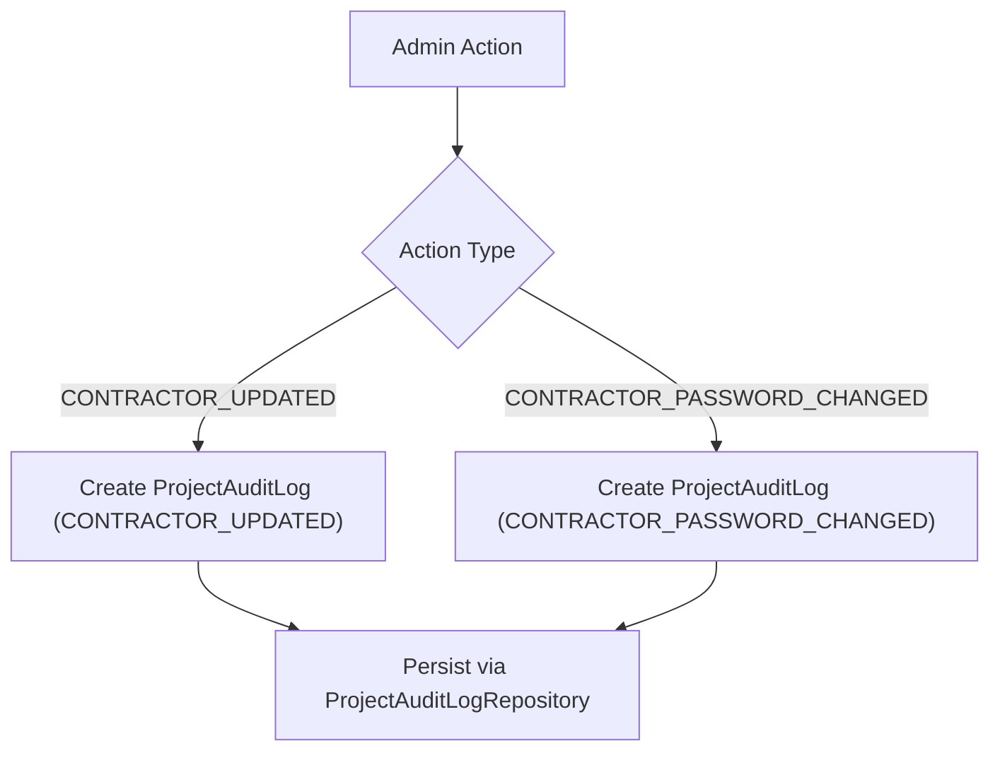
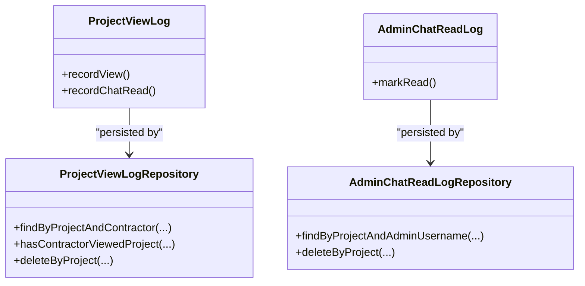
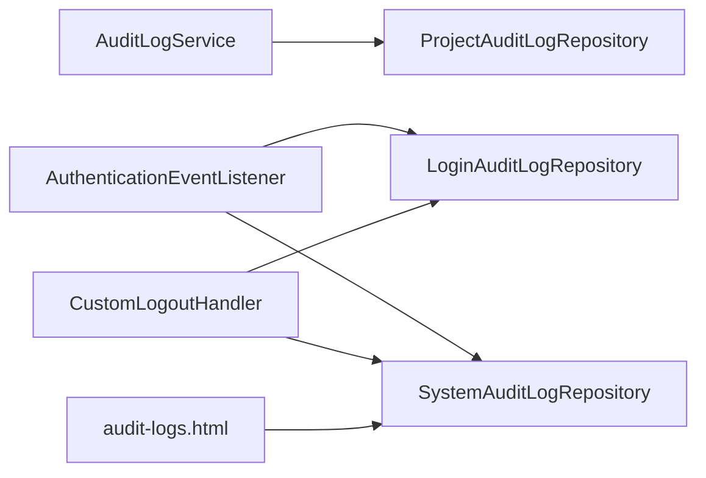

# Audit Logging System

<cite>
**Referenced Files in This Document**
- [AuditLogService.java](file://src/main/java/root/cyb/mh/skylink_media_service/application/services/AuditLogService.java)
- [ProjectAuditLog.java](file://src/main/java/root/cyb/mh/skylink_media_service/domain/entities/ProjectAuditLog.java)
- [LoginAuditLog.java](file://src/main/java/root/cyb/mh/skylink_media_service/domain/entities/LoginAuditLog.java)
- [SystemAuditLog.java](file://src/main/java/root/cyb/mh/skylink_media_service/domain/entities/SystemAuditLog.java)
- [ProjectViewLog.java](file://src/main/java/root/cyb/mh/skylink_media_service/domain/entities/ProjectViewLog.java)
- [AdminChatReadLog.java](file://src/main/java/root/cyb/mh/skylink_media_service/domain/entities/AdminChatReadLog.java)
- [ProjectAuditLogRepository.java](file://src/main/java/root/cyb/mh/skylink_media_service/infrastructure/persistence/ProjectAuditLogRepository.java)
- [LoginAuditLogRepository.java](file://src/main/java/root/cyb/mh/skylink_media_service/infrastructure/persistence/LoginAuditLogRepository.java)
- [SystemAuditLogRepository.java](file://src/main/java/root/cyb/mh/skylink_media_service/infrastructure/persistence/SystemAuditLogRepository.java)
- [ProjectViewLogRepository.java](file://src/main/java/root/cyb/mh/skylink_media_service/infrastructure/persistence/ProjectViewLogRepository.java)
- [AdminChatReadLogRepository.java](file://src/main/java/root/cyb/mh/skylink_media_service/infrastructure/persistence/AdminChatReadLogRepository.java)
- [AuthenticationEventListener.java](file://src/main/java/root/cyb/mh/skylink_media_service/infrastructure/security/AuthenticationEventListener.java)
- [CustomLogoutHandler.java](file://src/main/java/root/cyb/mh/skylink_media_service/infrastructure/security/CustomLogoutHandler.java)
- [audit-logs.html](file://src/main/resources/templates/super-admin/audit-logs.html)
</cite>

## Table of Contents
1. [Introduction](#introduction)
2. [Project Structure](#project-structure)
3. [Core Components](#core-components)
4. [Architecture Overview](#architecture-overview)
5. [Detailed Component Analysis](#detailed-component-analysis)
6. [Dependency Analysis](#dependency-analysis)
7. [Performance Considerations](#performance-considerations)
8. [Troubleshooting Guide](#troubleshooting-guide)
9. [Conclusion](#conclusion)
10. [Appendices](#appendices)

## Introduction
This document describes the audit logging system that tracks system activities and user actions across the application. It covers the centralized audit logging service, the data models for audit records, repositories for storage and retrieval, and the integration points for login, system, project, contractor, chat, and photo-viewing/download events. It also outlines query patterns, reporting capabilities, retention considerations, and security measures to maintain audit integrity.

## Project Structure
The audit logging system spans three layers:
- Domain entities define audit record schemas and enumerations.
- Infrastructure repositories provide typed queries and paginated retrieval.
- Application services orchestrate logging for business events.
- Security components capture authentication and session lifecycle events.
- UI templates present audit logs for super-admin review.

**Diagram sources**
- [AuditLogService.java:1-317](file://src/main/java/root/cyb/mh/skylink_media_service/application/services/AuditLogService.java#L1-L317)
- [ProjectAuditLog.java:1-102](file://src/main/java/root/cyb/mh/skylink_media_service/domain/entities/ProjectAuditLog.java#L1-L102)
- [LoginAuditLog.java:1-78](file://src/main/java/root/cyb/mh/skylink_media_service/domain/entities/LoginAuditLog.java#L1-L78)
- [SystemAuditLog.java:1-94](file://src/main/java/root/cyb/mh/skylink_media_service/domain/entities/SystemAuditLog.java#L1-L94)
- [ProjectViewLog.java:1-62](file://src/main/java/root/cyb/mh/skylink_media_service/domain/entities/ProjectViewLog.java#L1-L62)
- [AdminChatReadLog.java:1-42](file://src/main/java/root/cyb/mh/skylink_media_service/domain/entities/AdminChatReadLog.java#L1-L42)
- [ProjectAuditLogRepository.java:1-34](file://src/main/java/root/cyb/mh/skylink_media_service/infrastructure/persistence/ProjectAuditLogRepository.java#L1-L34)
- [LoginAuditLogRepository.java:1-53](file://src/main/java/root/cyb/mh/skylink_media_service/infrastructure/persistence/LoginAuditLogRepository.java#L1-L53)
- [SystemAuditLogRepository.java:1-42](file://src/main/java/root/cyb/mh/skylink_media_service/infrastructure/persistence/SystemAuditLogRepository.java#L1-L42)
- [ProjectViewLogRepository.java:1-23](file://src/main/java/root/cyb/mh/skylink_media_service/infrastructure/persistence/ProjectViewLogRepository.java#L1-L23)
- [AdminChatReadLogRepository.java:1-17](file://src/main/java/root/cyb/mh/skylink_media_service/infrastructure/persistence/AdminChatReadLogRepository.java#L1-L17)
- [AuthenticationEventListener.java:1-202](file://src/main/java/root/cyb/mh/skylink_media_service/infrastructure/security/AuthenticationEventListener.java#L1-L202)
- [CustomLogoutHandler.java:1-117](file://src/main/java/root/cyb/mh/skylink_media_service/infrastructure/security/CustomLogoutHandler.java#L1-L117)
- [audit-logs.html:1-87](file://src/main/resources/templates/super-admin/audit-logs.html#L1-L87)

**Section sources**
- [AuditLogService.java:1-317](file://src/main/java/root/cyb/mh/skylink_media_service/application/services/AuditLogService.java#L1-L317)
- [ProjectAuditLogRepository.java:1-34](file://src/main/java/root/cyb/mh/skylink_media_service/infrastructure/persistence/ProjectAuditLogRepository.java#L1-L34)
- [LoginAuditLogRepository.java:1-53](file://src/main/java/root/cyb/mh/skylink_media_service/infrastructure/persistence/LoginAuditLogRepository.java#L1-L53)
- [SystemAuditLogRepository.java:1-42](file://src/main/java/root/cyb/mh/skylink_media_service/infrastructure/persistence/SystemAuditLogRepository.java#L1-L42)
- [ProjectViewLogRepository.java:1-23](file://src/main/java/root/cyb/mh/skylink_media_service/infrastructure/persistence/ProjectViewLogRepository.java#L1-L23)
- [AdminChatReadLogRepository.java:1-17](file://src/main/java/root/cyb/mh/skylink_media_service/infrastructure/persistence/AdminChatReadLogRepository.java#L1-L17)
- [AuthenticationEventListener.java:1-202](file://src/main/java/root/cyb/mh/skylink_media_service/infrastructure/security/AuthenticationEventListener.java#L1-L202)
- [CustomLogoutHandler.java:1-117](file://src/main/java/root/cyb/mh/skylink_media_service/infrastructure/security/CustomLogoutHandler.java#L1-L117)
- [audit-logs.html:1-87](file://src/main/resources/templates/super-admin/audit-logs.html#L1-L87)

## Core Components
- AuditLogService: Centralized service for project lifecycle and user activity logging. It persists structured audit entries with action type, timestamps, actor identity, and optional details.
- Domain entities:
  - ProjectAuditLog: Tracks project-related actions (creation, updates, status changes, contractor assignments, views, downloads, chat messages).
  - LoginAuditLog: Captures login/logout attempts with IP, user agent, session ID, and failure reasons.
  - SystemAuditLog: Records system-wide administrative actions and login/logout events.
  - ProjectViewLog: Tracks contractor project views and chat read timestamps.
  - AdminChatReadLog: Tracks admin chat read markers per project.
- Repositories: Provide typed queries, pagination, filtering, and aggregation for audit data retrieval.

Key responsibilities:
- Project lifecycle auditing via AuditLogService methods.
- Login/logout auditing via AuthenticationEventListener and CustomLogoutHandler.
- System-wide audit trail via SystemAuditLogRepository.
- Project view and chat read tracking via dedicated entities and repositories.

**Section sources**
- [AuditLogService.java:19-317](file://src/main/java/root/cyb/mh/skylink_media_service/application/services/AuditLogService.java#L19-L317)
- [ProjectAuditLog.java:6-102](file://src/main/java/root/cyb/mh/skylink_media_service/domain/entities/ProjectAuditLog.java#L6-L102)
- [LoginAuditLog.java:6-78](file://src/main/java/root/cyb/mh/skylink_media_service/domain/entities/LoginAuditLog.java#L6-L78)
- [SystemAuditLog.java:6-94](file://src/main/java/root/cyb/mh/skylink_media_service/domain/entities/SystemAuditLog.java#L6-L94)
- [ProjectViewLog.java:6-62](file://src/main/java/root/cyb/mh/skylink_media_service/domain/entities/ProjectViewLog.java#L6-L62)
- [AdminChatReadLog.java:6-42](file://src/main/java/root/cyb/mh/skylink_media_service/domain/entities/AdminChatReadLog.java#L6-L42)

## Architecture Overview
The audit logging architecture integrates application services, domain entities, repositories, and security listeners to capture and persist audit events.

**Diagram sources**
- [AuthenticationEventListener.java:42-167](file://src/main/java/root/cyb/mh/skylink_media_service/infrastructure/security/AuthenticationEventListener.java#L42-L167)
- [CustomLogoutHandler.java:41-87](file://src/main/java/root/cyb/mh/skylink_media_service/infrastructure/security/CustomLogoutHandler.java#L41-L87)
- [LoginAuditLogRepository.java:15-53](file://src/main/java/root/cyb/mh/skylink_media_service/infrastructure/persistence/LoginAuditLogRepository.java#L15-L53)
- [SystemAuditLogRepository.java:14-42](file://src/main/java/root/cyb/mh/skylink_media_service/infrastructure/persistence/SystemAuditLogRepository.java#L14-L42)

## Detailed Component Analysis

### AuditLogService Implementation
AuditLogService centralizes logging for project lifecycle and user activity. It constructs ProjectAuditLog entries with appropriate action types, actors, and details, then delegates persistence to ProjectAuditLogRepository. It also exposes retrieval methods for project-specific audit logs.

**Diagram sources**
- [AuditLogService.java:22-317](file://src/main/java/root/cyb/mh/skylink_media_service/application/services/AuditLogService.java#L22-L317)
- [ProjectAuditLogRepository.java:12-33](file://src/main/java/root/cyb/mh/skylink_media_service/infrastructure/persistence/ProjectAuditLogRepository.java#L12-L33)

**Section sources**
- [AuditLogService.java:32-317](file://src/main/java/root/cyb/mh/skylink_media_service/application/services/AuditLogService.java#L32-L317)
- [ProjectAuditLogRepository.java:14-33](file://src/main/java/root/cyb/mh/skylink_media_service/infrastructure/persistence/ProjectAuditLogRepository.java#L14-L33)

### Login Audit Logging
LoginAuditLog captures successful and failed login attempts, including IP address, user agent, session ID, and failure reasons. AuthenticationEventListener creates and persists these records upon authentication events. CustomLogoutHandler updates the corresponding login record with logout time and persists a system audit log for logout.

**Diagram sources**
- [AuthenticationEventListener.java:42-120](file://src/main/java/root/cyb/mh/skylink_media_service/infrastructure/security/AuthenticationEventListener.java#L42-L120)
- [CustomLogoutHandler.java:41-87](file://src/main/java/root/cyb/mh/skylink_media_service/infrastructure/security/CustomLogoutHandler.java#L41-L87)
- [LoginAuditLogRepository.java:15-53](file://src/main/java/root/cyb/mh/skylink_media_service/infrastructure/persistence/LoginAuditLogRepository.java#L15-L53)
- [SystemAuditLogRepository.java:14-42](file://src/main/java/root/cyb/mh/skylink_media_service/infrastructure/persistence/SystemAuditLogRepository.java#L14-L42)

**Section sources**
- [LoginAuditLog.java:6-78](file://src/main/java/root/cyb/mh/skylink_media_service/domain/entities/LoginAuditLog.java#L6-L78)
- [LoginAuditLogRepository.java:15-53](file://src/main/java/root/cyb/mh/skylink_media_service/infrastructure/persistence/LoginAuditLogRepository.java#L15-L53)
- [AuthenticationEventListener.java:42-167](file://src/main/java/root/cyb/mh/skylink_media_service/infrastructure/security/AuthenticationEventListener.java#L42-L167)
- [CustomLogoutHandler.java:41-87](file://src/main/java/root/cyb/mh/skylink_media_service/infrastructure/security/CustomLogoutHandler.java#L41-L87)

### System Audit Trail
SystemAuditLog tracks administrative and system-level actions, including user and admin lifecycle events, login/logout, and configuration changes. Retrieval supports filtering by action type, target type/id, and timestamp ranges.

**Diagram sources**
- [SystemAuditLog.java:14-37](file://src/main/java/root/cyb/mh/skylink_media_service/domain/entities/SystemAuditLog.java#L14-L37)
- [SystemAuditLogRepository.java:14-42](file://src/main/java/root/cyb/mh/skylink_media_service/infrastructure/persistence/SystemAuditLogRepository.java#L14-L42)

**Section sources**
- [SystemAuditLog.java:6-94](file://src/main/java/root/cyb/mh/skylink_media_service/domain/entities/SystemAuditLog.java#L6-L94)
- [SystemAuditLogRepository.java:14-42](file://src/main/java/root/cyb/mh/skylink_media_service/infrastructure/persistence/SystemAuditLogRepository.java#L14-L42)

### Project, Photo Viewing, and Chat Message Logs
ProjectAuditLog stores project-centric events such as views, downloads, and chat messages. AuditLogService provides methods to log these events with previews and counts, while retrieval methods support chronological ordering and filtering.

**Diagram sources**
- [AuditLogService.java:235-295](file://src/main/java/root/cyb/mh/skylink_media_service/application/services/AuditLogService.java#L235-L295)
- [ProjectAuditLogRepository.java:14-33](file://src/main/java/root/cyb/mh/skylink_media_service/infrastructure/persistence/ProjectAuditLogRepository.java#L14-L33)

**Section sources**
- [AuditLogService.java:235-295](file://src/main/java/root/cyb/mh/skylink_media_service/application/services/AuditLogService.java#L235-L295)
- [ProjectAuditLog.java:18-42](file://src/main/java/root/cyb/mh/skylink_media_service/domain/entities/ProjectAuditLog.java#L18-L42)

### Contractor Management Logs
AuditLogService logs contractor updates and password changes initiated by admins. These are recorded as project audit log entries without a project association but with actor identity and details.

**Diagram sources**
- [AuditLogService.java:195-232](file://src/main/java/root/cyb/mh/skylink_media_service/application/services/AuditLogService.java#L195-L232)
- [ProjectAuditLogRepository.java:14-33](file://src/main/java/root/cyb/mh/skylink_media_service/infrastructure/persistence/ProjectAuditLogRepository.java#L14-L33)

**Section sources**
- [AuditLogService.java:195-232](file://src/main/java/root/cyb/mh/skylink_media_service/application/services/AuditLogService.java#L195-L232)

### Project View Tracking and Chat Read Logs
ProjectViewLog maintains contractor project view metrics (first/last viewed, counts, chat read timestamps). AdminChatReadLog tracks admin-specific chat read markers per project.

**Diagram sources**
- [ProjectViewLog.java:35-50](file://src/main/java/root/cyb/mh/skylink_media_service/domain/entities/ProjectViewLog.java#L35-L50)
- [AdminChatReadLog.java:27-35](file://src/main/java/root/cyb/mh/skylink_media_service/domain/entities/AdminChatReadLog.java#L27-L35)
- [ProjectViewLogRepository.java:14-22](file://src/main/java/root/cyb/mh/skylink_media_service/infrastructure/persistence/ProjectViewLogRepository.java#L14-L22)
- [AdminChatReadLogRepository.java:10-16](file://src/main/java/root/cyb/mh/skylink_media_service/infrastructure/persistence/AdminChatReadLogRepository.java#L10-L16)

**Section sources**
- [ProjectViewLog.java:6-62](file://src/main/java/root/cyb/mh/skylink_media_service/domain/entities/ProjectViewLog.java#L6-L62)
- [AdminChatReadLog.java:6-42](file://src/main/java/root/cyb/mh/skylink_media_service/domain/entities/AdminChatReadLog.java#L6-L42)
- [ProjectViewLogRepository.java:14-22](file://src/main/java/root/cyb/mh/skylink_media_service/infrastructure/persistence/ProjectViewLogRepository.java#L14-L22)
- [AdminChatReadLogRepository.java:10-16](file://src/main/java/root/cyb/mh/skylink_media_service/infrastructure/persistence/AdminChatReadLogRepository.java#L10-L16)

## Dependency Analysis
The audit logging system exhibits clear separation of concerns:
- Application services depend on repositories for persistence.
- Security components depend on repositories to persist login/system audit logs.
- UI templates consume system audit logs for display.

**Diagram sources**
- [AuditLogService.java:22-317](file://src/main/java/root/cyb/mh/skylink_media_service/application/services/AuditLogService.java#L22-L317)
- [AuthenticationEventListener.java:25-41](file://src/main/java/root/cyb/mh/skylink_media_service/infrastructure/security/AuthenticationEventListener.java#L25-L41)
- [CustomLogoutHandler.java:24-40](file://src/main/java/root/cyb/mh/skylink_media_service/infrastructure/security/CustomLogoutHandler.java#L24-L40)
- [ProjectAuditLogRepository.java:12-33](file://src/main/java/root/cyb/mh/skylink_media_service/infrastructure/persistence/ProjectAuditLogRepository.java#L12-33)
- [LoginAuditLogRepository.java:15-53](file://src/main/java/root/cyb/mh/skylink_media_service/infrastructure/persistence/LoginAuditLogRepository.java#L15-L53)
- [SystemAuditLogRepository.java:14-42](file://src/main/java/root/cyb/mh/skylink_media_service/infrastructure/persistence/SystemAuditLogRepository.java#L14-L42)
- [audit-logs.html:1-87](file://src/main/resources/templates/super-admin/audit-logs.html#L1-L87)

**Section sources**
- [AuditLogService.java:22-317](file://src/main/java/root/cyb/mh/skylink_media_service/application/services/AuditLogService.java#L22-L317)
- [AuthenticationEventListener.java:25-41](file://src/main/java/root/cyb/mh/skylink_media_service/infrastructure/security/AuthenticationEventListener.java#L25-L41)
- [CustomLogoutHandler.java:24-40](file://src/main/java/root/cyb/mh/skylink_media_service/infrastructure/security/CustomLogoutHandler.java#L24-L40)
- [ProjectAuditLogRepository.java:12-33](file://src/main/java/root/cyb/mh/skylink_media_service/infrastructure/persistence/ProjectAuditLogRepository.java#L12-33)
- [LoginAuditLogRepository.java:15-53](file://src/main/java/root/cyb/mh/skylink_media_service/infrastructure/persistence/LoginAuditLogRepository.java#L15-L53)
- [SystemAuditLogRepository.java:14-42](file://src/main/java/root/cyb/mh/skylink_media_service/infrastructure/persistence/SystemAuditLogRepository.java#L14-L42)
- [audit-logs.html:1-87](file://src/main/resources/templates/super-admin/audit-logs.html#L1-L87)

## Performance Considerations
- Indexing: Entities define strategic indexes (e.g., login timestamps, audit project IDs, system audit timestamps) to optimize retrieval.
- Pagination: Repositories expose Pageable methods to limit result sets and improve scalability.
- Filtering: Repository queries support filtering by action type, target type/id, and time windows to reduce payload sizes.
- JSON details: ProjectAuditLog details are stored as TEXT; consider size limits and compression if needed.
- Aggregation: LoginAuditLogRepository provides counts for active users and login trends over time.

[No sources needed since this section provides general guidance]

## Troubleshooting Guide
Common issues and resolutions:
- Missing IP/User-Agent: Authentication event listener extracts client IP from forwarded headers; ensure reverse proxy configurations propagate headers correctly.
- Duplicate logout entries: CustomLogoutHandler and session destroy listener both update logout_time; ensure session cleanup does not conflict.
- Empty audit logs: Verify repositories’ index usage and query parameters; confirm that events are firing and persistence is enabled.
- Pagination and filters: Confirm UI template parameters match repository query signatures.

**Section sources**
- [AuthenticationEventListener.java:169-201](file://src/main/java/root/cyb/mh/skylink_media_service/infrastructure/security/AuthenticationEventListener.java#L169-L201)
- [CustomLogoutHandler.java:89-116](file://src/main/java/root/cyb/mh/skylink_media_service/infrastructure/security/CustomLogoutHandler.java#L89-L116)
- [LoginAuditLogRepository.java:31-51](file://src/main/java/root/cyb/mh/skylink_media_service/infrastructure/persistence/LoginAuditLogRepository.java#L31-L51)
- [SystemAuditLogRepository.java:23-34](file://src/main/java/root/cyb/mh/skylink_media_service/infrastructure/persistence/SystemAuditLogRepository.java#L23-L34)

## Conclusion
The audit logging system provides comprehensive coverage of project lifecycle events, contractor management actions, user activity (views/downloads/chat), and login/logout traces. It leverages typed repositories, pagination, and filtering to support efficient retrieval and reporting. Security integration ensures robust authentication and session lifecycle tracking. For compliance and integrity, organizations should define retention policies and access controls aligned with local regulations.

[No sources needed since this section summarizes without analyzing specific files]

## Appendices

### Audit Log Data Models
- ProjectAuditLog: action type, admin actor, old/new values, details, timestamp, IP.
- LoginAuditLog: user identity, user type, timestamps, IP, user agent, session ID, failure reason.
- SystemAuditLog: action type, actor/target identifiers, details, timestamp, IP.
- ProjectViewLog: project/contractor, first/last viewed, view count, chat read timestamp.
- AdminChatReadLog: project/admin username, last read timestamp.

**Section sources**
- [ProjectAuditLog.java:18-101](file://src/main/java/root/cyb/mh/skylink_media_service/domain/entities/ProjectAuditLog.java#L18-L101)
- [LoginAuditLog.java:14-77](file://src/main/java/root/cyb/mh/skylink_media_service/domain/entities/LoginAuditLog.java#L14-L77)
- [SystemAuditLog.java:14-93](file://src/main/java/root/cyb/mh/skylink_media_service/domain/entities/SystemAuditLog.java#L14-L93)
- [ProjectViewLog.java:9-61](file://src/main/java/root/cyb/mh/skylink_media_service/domain/entities/ProjectViewLog.java#L9-L61)
- [AdminChatReadLog.java:9-41](file://src/main/java/root/cyb/mh/skylink_media_service/domain/entities/AdminChatReadLog.java#L9-L41)

### Storage Mechanisms and Retrieval Patterns
- Persistence: Repositories extend Spring Data JPA to persist and query audit entities.
- Retrieval:
  - ProjectAuditLog: by project, by admin, by action type, ordered by timestamp desc.
  - LoginAuditLog: by user/session/filters, time range, top-N.
  - SystemAuditLog: by actor/target/action type, time range, filters.
  - ProjectViewLog/AdminChatReadLog: by project/contractor/admin username, existence checks.

**Section sources**
- [ProjectAuditLogRepository.java:14-33](file://src/main/java/root/cyb/mh/skylink_media_service/infrastructure/persistence/ProjectAuditLogRepository.java#L14-L33)
- [LoginAuditLogRepository.java:18-52](file://src/main/java/root/cyb/mh/skylink_media_service/infrastructure/persistence/LoginAuditLogRepository.java#L18-L52)
- [SystemAuditLogRepository.java:17-41](file://src/main/java/root/cyb/mh/skylink_media_service/infrastructure/persistence/SystemAuditLogRepository.java#L17-L41)
- [ProjectViewLogRepository.java:16-21](file://src/main/java/root/cyb/mh/skylink_media_service/infrastructure/persistence/ProjectViewLogRepository.java#L16-L21)
- [AdminChatReadLogRepository.java:13-15](file://src/main/java/root/cyb/mh/skylink_media_service/infrastructure/persistence/AdminChatReadLogRepository.java#L13-L15)

### Examples of Audit Log Queries and Reports
- Retrieve project audit logs ordered by timestamp desc:
  - Repository method: [findByProjectOrderByTimestampDesc:17-17](file://src/main/java/root/cyb/mh/skylink_media_service/infrastructure/persistence/ProjectAuditLogRepository.java#L17-L17)
- Filter login history by user type, success, and user ID:
  - Repository method: [findByFilters:36-40](file://src/main/java/root/cyb/mh/skylink_media_service/infrastructure/persistence/LoginAuditLogRepository.java#L36-L40)
- Generate login trend reports (count successful logins since):
  - Repository method: [countSuccessfulLoginsSince:44-45](file://src/main/java/root/cyb/mh/skylink_media_service/infrastructure/persistence/LoginAuditLogRepository.java#L44-L45)
- System audit logs by action type/time range:
  - Repository method: [findByActionType:21-21](file://src/main/java/root/cyb/mh/skylink_media_service/infrastructure/persistence/SystemAuditLogRepository.java#L21-L21)
  - Repository method: [findByTimestampBetween:23-24](file://src/main/java/root/cyb/mh/skylink_media_service/infrastructure/persistence/SystemAuditLogRepository.java#L23-L24)

**Section sources**
- [ProjectAuditLogRepository.java:17-32](file://src/main/java/root/cyb/mh/skylink_media_service/infrastructure/persistence/ProjectAuditLogRepository.java#L17-L32)
- [LoginAuditLogRepository.java:36-51](file://src/main/java/root/cyb/mh/skylink_media_service/infrastructure/persistence/LoginAuditLogRepository.java#L36-L51)
- [SystemAuditLogRepository.java:21-24](file://src/main/java/root/cyb/mh/skylink_media_service/infrastructure/persistence/SystemAuditLogRepository.java#L21-L24)

### Compliance and Retention Policies
- Define retention periods for LoginAuditLog, SystemAuditLog, and ProjectAuditLog based on regulatory requirements.
- Restrict access to audit data via role-based permissions (e.g., super admin only).
- Consider immutable archival for long-term compliance; ensure backups and integrity checks.
- Monitor excessive write volumes and implement batching or asynchronous logging if needed.

[No sources needed since this section provides general guidance]