# Communication Features

<cite>
**Referenced Files in This Document**
- [ChatService.java](file://src/main/java/root/cyb/mh/skylink_media_service/application/services/ChatService.java)
- [EmailService.java](file://src/main/java/root/cyb/mh/skylink_media_service/application/services/EmailService.java)
- [AdminChatReadLog.java](file://src/main/java/root/cyb/mh/skylink_media_service/domain/entities/AdminChatReadLog.java)
- [ProjectMessage.java](file://src/main/java/root/cyb/mh/skylink_media_service/domain/entities/ProjectMessage.java)
- [ProjectMessageRepository.java](file://src/main/java/root/cyb/mh/skylink_media_service/infrastructure/persistence/ProjectMessageRepository.java)
- [AdminChatReadLogRepository.java](file://src/main/java/root/cyb/mh/skylink_media_service/infrastructure/persistence/AdminChatReadLogRepository.java)
- [AdminController.java](file://src/main/java/root/cyb/mh/skylink_media_service/infrastructure/web/AdminController.java)
- [ContractorController.java](file://src/main/java/root/cyb/mh/skylink_media_service/infrastructure/web/ContractorController.java)
- [UserPresenceService.java](file://src/main/java/root/cyb/mh/skylink_media_service/application/services/UserPresenceService.java)
- [WebSocketConfig.java](file://src/main/java/root/cyb/mh/skylink_media_service/infrastructure/config/WebSocketConfig.java)
- [RealTimeDashboardService.java](file://src/main/java/root/cyb/mh/skylink_media_service/application/services/RealTimeDashboardService.java)
- [project-chat.html (Admin)](file://src/main/resources/templates/admin/project-chat.html)
- [project-chat.html (Contractor)](file://src/main/resources/templates/contractor/project-chat.html)
- [AuditLogService.java](file://src/main/java/root/cyb/mh/skylink_media_service/application/services/AuditLogService.java)
- [application.properties](file://src/main/resources/application.properties)
- [CHAT_FIX_DOCUMENTATION.md](file://CHAT_FIX_DOCUMENTATION.md)
- [PROJECT_KNOWLEDGE.md](file://PROJECT_KNOWLEDGE.md)
</cite>

## Table of Contents
1. [Introduction](#introduction)
2. [Project Structure](#project-structure)
3. [Core Components](#core-components)
4. [Architecture Overview](#architecture-overview)
5. [Detailed Component Analysis](#detailed-component-analysis)
6. [Dependency Analysis](#dependency-analysis)
7. [Performance Considerations](#performance-considerations)
8. [Troubleshooting Guide](#troubleshooting-guide)
9. [Conclusion](#conclusion)
10. [Appendices](#appendices)

## Introduction
This document explains the communication system features centered around real-time project messaging, chat room management, and email notifications. It covers:
- ChatService for message creation, retrieval, and unread counting
- EmailService for asynchronous notifications to contractors and admins
- Admin chat interface with message sending, unread tracking, and read receipts
- Email notification templates, recipient filtering, and delivery mechanisms
- Examples of chat workflows, notification triggers, and communication monitoring
- Chat message persistence, user presence tracking, and communication analytics

## Project Structure
The communication system spans application services, domain entities, repositories, controllers, and templates:
- Application services: ChatService, EmailService, UserPresenceService, RealTimeDashboardService
- Domain entities: ProjectMessage, AdminChatReadLog
- Repositories: ProjectMessageRepository, AdminChatReadLogRepository
- Controllers: AdminController (admin chat), ContractorController (contractor chat)
- Templates: Thymeleaf pages for admin and contractor chat
- Configuration: WebSocketConfig for real-time broadcasting
- Properties: application.properties for mail configuration

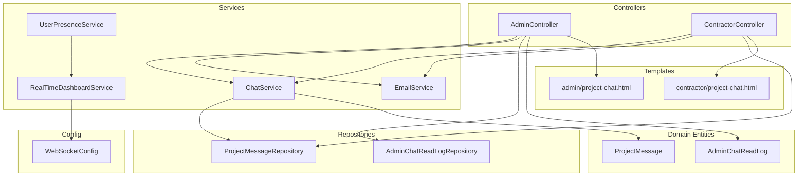

**Diagram sources**
- [AdminController.java:629-683](file://src/main/java/root/cyb/mh/skylink_media_service/infrastructure/web/AdminController.java#L629-L683)
- [ContractorController.java:190-256](file://src/main/java/root/cyb/mh/skylink_media_service/infrastructure/web/ContractorController.java#L190-L256)
- [ChatService.java:24-43](file://src/main/java/root/cyb/mh/skylink_media_service/application/services/ChatService.java#L24-L43)
- [EmailService.java:29-72](file://src/main/java/root/cyb/mh/skylink_media_service/application/services/EmailService.java#L29-L72)
- [UserPresenceService.java:18-72](file://src/main/java/root/cyb/mh/skylink_media_service/application/services/UserPresenceService.java#L18-L72)
- [RealTimeDashboardService.java:19-62](file://src/main/java/root/cyb/mh/skylink_media_service/application/services/RealTimeDashboardService.java#L19-L62)
- [ProjectMessage.java:6-31](file://src/main/java/root/cyb/mh/skylink_media_service/domain/entities/ProjectMessage.java#L6-L31)
- [AdminChatReadLog.java:6-35](file://src/main/java/root/cyb/mh/skylink_media_service/domain/entities/AdminChatReadLog.java#L6-L35)
- [ProjectMessageRepository.java:14-22](file://src/main/java/root/cyb/mh/skylink_media_service/infrastructure/persistence/ProjectMessageRepository.java#L14-L22)
- [AdminChatReadLogRepository.java:10-16](file://src/main/java/root/cyb/mh/skylink_media_service/infrastructure/persistence/AdminChatReadLogRepository.java#L10-L16)
- [WebSocketConfig.java:9-28](file://src/main/java/root/cyb/mh/skylink_media_service/infrastructure/config/WebSocketConfig.java#L9-L28)
- [project-chat.html (Admin):1-225](file://src/main/resources/templates/admin/project-chat.html#L1-L225)
- [project-chat.html (Contractor):1-206](file://src/main/resources/templates/contractor/project-chat.html#L1-L206)

**Section sources**
- [ChatService.java:15-44](file://src/main/java/root/cyb/mh/skylink_media_service/application/services/ChatService.java#L15-L44)
- [EmailService.java:12-88](file://src/main/java/root/cyb/mh/skylink_media_service/application/services/EmailService.java#L12-L88)
- [ProjectMessage.java:6-83](file://src/main/java/root/cyb/mh/skylink_media_service/domain/entities/ProjectMessage.java#L6-L83)
- [ProjectMessageRepository.java:14-22](file://src/main/java/root/cyb/mh/skylink_media_service/infrastructure/persistence/ProjectMessageRepository.java#L14-L22)
- [AdminChatReadLog.java:6-41](file://src/main/java/root/cyb/mh/skylink_media_service/domain/entities/AdminChatReadLog.java#L6-L41)
- [AdminChatReadLogRepository.java:10-16](file://src/main/java/root/cyb/mh/skylink_media_service/infrastructure/persistence/AdminChatReadLogRepository.java#L10-L16)
- [AdminController.java:629-683](file://src/main/java/root/cyb/mh/skylink_media_service/infrastructure/web/AdminController.java#L629-L683)
- [ContractorController.java:190-256](file://src/main/java/root/cyb/mh/skylink_media_service/infrastructure/web/ContractorController.java#L190-L256)
- [UserPresenceService.java:13-146](file://src/main/java/root/cyb/mh/skylink_media_service/application/services/UserPresenceService.java#L13-L146)
- [RealTimeDashboardService.java:14-62](file://src/main/java/root/cyb/mh/skylink_media_service/application/services/RealTimeDashboardService.java#L14-L62)
- [WebSocketConfig.java:9-28](file://src/main/java/root/cyb/mh/skylink_media_service/infrastructure/config/WebSocketConfig.java#L9-L28)
- [project-chat.html (Admin):1-225](file://src/main/resources/templates/admin/project-chat.html#L1-L225)
- [project-chat.html (Contractor):1-206](file://src/main/resources/templates/contractor/project-chat.html#L1-L206)

## Core Components
- ChatService: Handles message persistence, retrieval, and unread counting using repositories.
- EmailService: Sends asynchronous HTML and plain-text notifications to recipients.
- AdminChatReadLog: Tracks admin read receipts per project for accurate unread counts.
- ProjectMessage: Domain entity representing chat messages with sender, content, and timestamps.
- AdminController: Provides admin chat UI, sends messages, and triggers notifications.
- ContractorController: Provides contractor chat UI, marks read, and triggers notifications.
- UserPresenceService: Tracks active sessions and user presence for monitoring.
- RealTimeDashboardService: Broadcasts user presence and chat activity via WebSocket.
- WebSocketConfig: Enables STOMP over SockJS for real-time messaging.
- Thymeleaf Templates: Render admin and contractor chat pages with message lists.

**Section sources**
- [ChatService.java:24-43](file://src/main/java/root/cyb/mh/skylink_media_service/application/services/ChatService.java#L24-L43)
- [EmailService.java:29-72](file://src/main/java/root/cyb/mh/skylink_media_service/application/services/EmailService.java#L29-L72)
- [AdminChatReadLog.java:25-41](file://src/main/java/root/cyb/mh/skylink_media_service/domain/entities/AdminChatReadLog.java#L25-L41)
- [ProjectMessage.java:34-83](file://src/main/java/root/cyb/mh/skylink_media_service/domain/entities/ProjectMessage.java#L34-L83)
- [AdminController.java:629-683](file://src/main/java/root/cyb/mh/skylink_media_service/infrastructure/web/AdminController.java#L629-L683)
- [ContractorController.java:190-256](file://src/main/java/root/cyb/mh/skylink_media_service/infrastructure/web/ContractorController.java#L190-L256)
- [UserPresenceService.java:18-72](file://src/main/java/root/cyb/mh/skylink_media_service/application/services/UserPresenceService.java#L18-L72)
- [RealTimeDashboardService.java:25-62](file://src/main/java/root/cyb/mh/skylink_media_service/application/services/RealTimeDashboardService.java#L25-L62)
- [WebSocketConfig.java:13-27](file://src/main/java/root/cyb/mh/skylink_media_service/infrastructure/config/WebSocketConfig.java#L13-L27)
- [project-chat.html (Admin):155-216](file://src/main/resources/templates/admin/project-chat.html#L155-L216)
- [project-chat.html (Contractor):138-198](file://src/main/resources/templates/contractor/project-chat.html#L138-L198)

## Architecture Overview
The communication system integrates Spring MVC controllers, application services, JPA repositories, and Thymeleaf templates. Real-time updates are supported via Spring WebSocket (STOMP over SockJS). Email notifications are sent asynchronously.

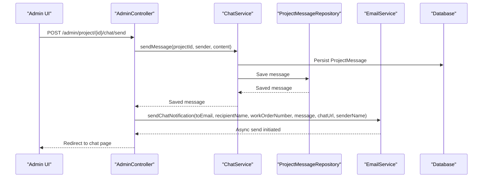

**Diagram sources**
- [AdminController.java:649-683](file://src/main/java/root/cyb/mh/skylink_media_service/infrastructure/web/AdminController.java#L649-L683)
- [ChatService.java:24-30](file://src/main/java/root/cyb/mh/skylink_media_service/application/services/ChatService.java#L24-L30)
- [ProjectMessageRepository.java:14-22](file://src/main/java/root/cyb/mh/skylink_media_service/infrastructure/persistence/ProjectMessageRepository.java#L14-L22)
- [EmailService.java:29-72](file://src/main/java/root/cyb/mh/skylink_media_service/application/services/EmailService.java#L29-L72)

**Section sources**
- [AdminController.java:629-683](file://src/main/java/root/cyb/mh/skylink_media_service/infrastructure/web/AdminController.java#L629-L683)
- [ChatService.java:24-43](file://src/main/java/root/cyb/mh/skylink_media_service/application/services/ChatService.java#L24-L43)
- [EmailService.java:29-72](file://src/main/java/root/cyb/mh/skylink_media_service/application/services/EmailService.java#L29-L72)
- [ProjectMessageRepository.java:14-22](file://src/main/java/root/cyb/mh/skylink_media_service/infrastructure/persistence/ProjectMessageRepository.java#L14-L22)

## Detailed Component Analysis

### ChatService Implementation
Responsibilities:
- Send messages: validates project existence, constructs ProjectMessage, persists via repository
- Retrieve messages: loads messages ordered by sent time ascending
- Unread counting: counts messages sent after a given timestamp and excluding the viewer’s own messages

Key behaviors:
- Transactional write operations for message creation
- Transactional read operations for message retrieval and unread counts
- Uses ProjectMessageRepository for persistence and queries

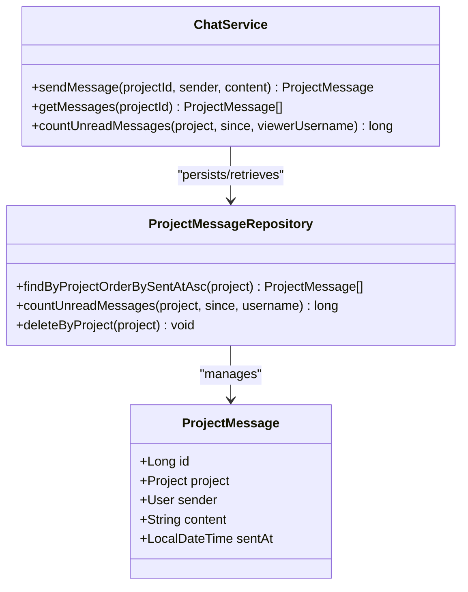

**Diagram sources**
- [ChatService.java:24-43](file://src/main/java/root/cyb/mh/skylink_media_service/application/services/ChatService.java#L24-L43)
- [ProjectMessageRepository.java:14-22](file://src/main/java/root/cyb/mh/skylink_media_service/infrastructure/persistence/ProjectMessageRepository.java#L14-L22)
- [ProjectMessage.java:6-83](file://src/main/java/root/cyb/mh/skylink_media_service/domain/entities/ProjectMessage.java#L6-L83)

**Section sources**
- [ChatService.java:24-43](file://src/main/java/root/cyb/mh/skylink_media_service/application/services/ChatService.java#L24-L43)
- [ProjectMessageRepository.java:16-19](file://src/main/java/root/cyb/mh/skylink_media_service/infrastructure/persistence/ProjectMessageRepository.java#L16-L19)

### EmailService Integration
Responsibilities:
- Asynchronously sends HTML and plain-text emails
- Builds subject and body with project work order number and chat URL
- Filters out invalid or blank email addresses
- Escapes HTML content to prevent XSS in templates

Key behaviors:
- Uses JavaMailSender to create and send MIME messages
- Logs success and errors during delivery
- Reads from and from-name from application properties

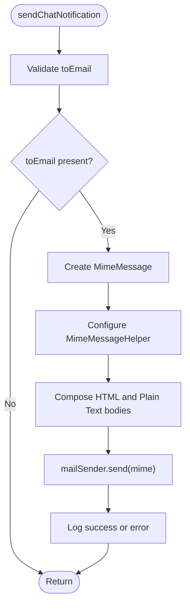

**Diagram sources**
- [EmailService.java:29-72](file://src/main/java/root/cyb/mh/skylink_media_service/application/services/EmailService.java#L29-L72)
- [application.properties:43-58](file://src/main/resources/application.properties#L43-L58)

**Section sources**
- [EmailService.java:29-72](file://src/main/java/root/cyb/mh/skylink_media_service/application/services/EmailService.java#L29-L72)
- [application.properties:43-58](file://src/main/resources/application.properties#L43-L58)

### Admin Chat Interface and Read Receipts
Admin chat features:
- Chat page loads messages and marks chat as read by updating AdminChatReadLog
- Message sending triggers email notifications to assigned contractors
- Unread counts per project are computed using AdminChatReadLog timestamps

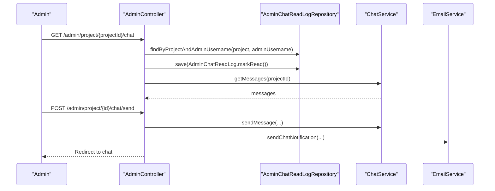

**Diagram sources**
- [AdminController.java:629-683](file://src/main/java/root/cyb/mh/skylink_media_service/infrastructure/web/AdminController.java#L629-L683)
- [AdminChatReadLogRepository.java:13-13](file://src/main/java/root/cyb/mh/skylink_media_service/infrastructure/persistence/AdminChatReadLogRepository.java#L13-L13)
- [ChatService.java:32-37](file://src/main/java/root/cyb/mh/skylink_media_service/application/services/ChatService.java#L32-L37)
- [EmailService.java:29-72](file://src/main/java/root/cyb/mh/skylink_media_service/application/services/EmailService.java#L29-L72)

**Section sources**
- [AdminController.java:629-683](file://src/main/java/root/cyb/mh/skylink_media_service/infrastructure/web/AdminController.java#L629-L683)
- [AdminChatReadLog.java:33-35](file://src/main/java/root/cyb/mh/skylink_media_service/domain/entities/AdminChatReadLog.java#L33-L35)
- [AdminChatReadLogRepository.java:13-13](file://src/main/java/root/cyb/mh/skylink_media_service/infrastructure/persistence/AdminChatReadLogRepository.java#L13-L13)

### Contractor Chat Interface and Read Receipts
Contractor chat features:
- Chat page loads messages and marks chat as read by updating ProjectViewLog
- Message sending triggers email to the project’s WO Admin if configured

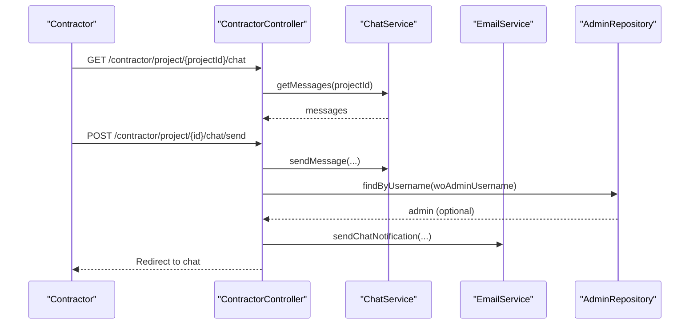

**Diagram sources**
- [ContractorController.java:190-256](file://src/main/java/root/cyb/mh/skylink_media_service/infrastructure/web/ContractorController.java#L190-L256)
- [ChatService.java:32-37](file://src/main/java/root/cyb/mh/skylink_media_service/application/services/ChatService.java#L32-L37)
- [EmailService.java:29-72](file://src/main/java/root/cyb/mh/skylink_media_service/application/services/EmailService.java#L29-L72)

**Section sources**
- [ContractorController.java:190-256](file://src/main/java/root/cyb/mh/skylink_media_service/infrastructure/web/ContractorController.java#L190-L256)

### User Presence Tracking and Real-Time Monitoring
UserPresenceService maintains active sessions and exposes counts and per-page metrics. RealTimeDashboardService broadcasts presence and chat activity via WebSocket.

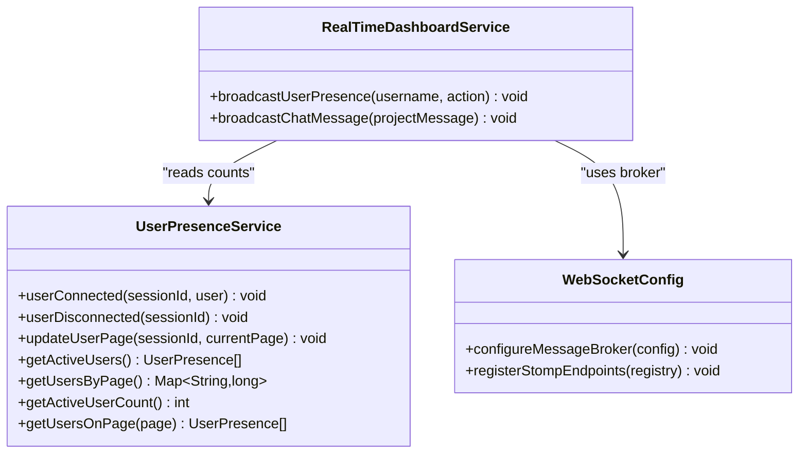

**Diagram sources**
- [UserPresenceService.java:18-118](file://src/main/java/root/cyb/mh/skylink_media_service/application/services/UserPresenceService.java#L18-L118)
- [RealTimeDashboardService.java:19-62](file://src/main/java/root/cyb/mh/skylink_media_service/application/services/RealTimeDashboardService.java#L19-L62)
- [WebSocketConfig.java:13-27](file://src/main/java/root/cyb/mh/skylink_media_service/infrastructure/config/WebSocketConfig.java#L13-L27)

**Section sources**
- [UserPresenceService.java:18-118](file://src/main/java/root/cyb/mh/skylink_media_service/application/services/UserPresenceService.java#L18-L118)
- [RealTimeDashboardService.java:25-62](file://src/main/java/root/cyb/mh/skylink_media_service/application/services/RealTimeDashboardService.java#L25-L62)
- [WebSocketConfig.java:13-27](file://src/main/java/root/cyb/mh/skylink_media_service/infrastructure/config/WebSocketConfig.java#L13-L27)

### Email Notification Templates and Delivery Mechanisms
- Template: HTML email with branded header, message block, and call-to-action link
- Recipient filtering: skips blank or null emails
- Delivery: asynchronous via @Async; logs success/error
- From address and name: configured in application.properties

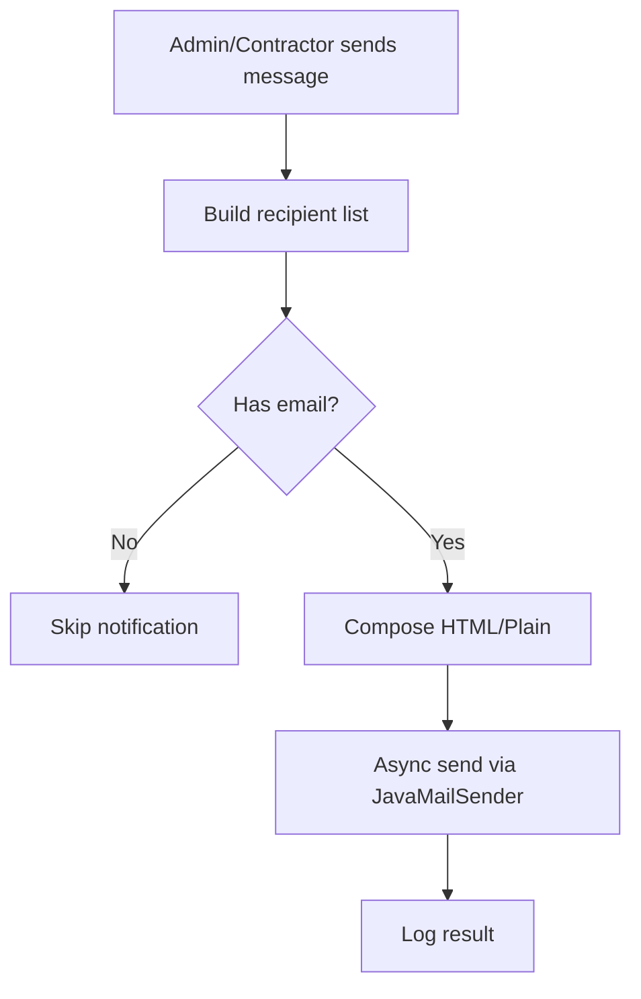

**Diagram sources**
- [EmailService.java:29-72](file://src/main/java/root/cyb/mh/skylink_media_service/application/services/EmailService.java#L29-L72)
- [application.properties:43-58](file://src/main/resources/application.properties#L43-L58)

**Section sources**
- [EmailService.java:29-72](file://src/main/java/root/cyb/mh/skylink_media_service/application/services/EmailService.java#L29-L72)
- [application.properties:43-58](file://src/main/resources/application.properties#L43-L58)

### Chat Workflows and Examples
- Admin sends message:
  - Admin posts to /admin/project/{id}/chat/send
  - ChatService persists message
  - EmailService asynchronously notifies contractors
  - AuditLogService records the event
- Contractor sends message:
  - Contractor posts to /contractor/project/{id}/chat/send
  - ChatService persists message
  - EmailService asynchronously notifies the WO Admin
- Unread tracking:
  - Admin: AdminChatReadLog timestamp used by ChatService.countUnreadMessages
  - Contractor: ProjectViewLog timestamp used similarly

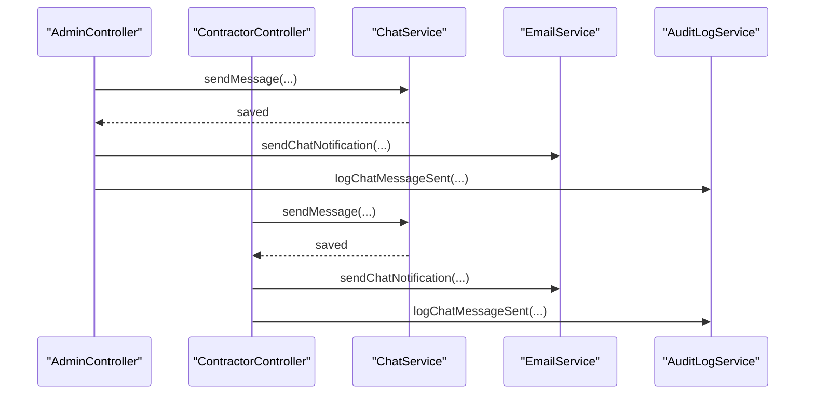

**Diagram sources**
- [AdminController.java:649-683](file://src/main/java/root/cyb/mh/skylink_media_service/infrastructure/web/AdminController.java#L649-L683)
- [ContractorController.java:217-256](file://src/main/java/root/cyb/mh/skylink_media_service/infrastructure/web/ContractorController.java#L217-L256)
- [ChatService.java:24-30](file://src/main/java/root/cyb/mh/skylink_media_service/application/services/ChatService.java#L24-L30)
- [EmailService.java:29-72](file://src/main/java/root/cyb/mh/skylink_media_service/application/services/EmailService.java#L29-L72)
- [AuditLogService.java:254-275](file://src/main/java/root/cyb/mh/skylink_media_service/application/services/AuditLogService.java#L254-L275)

**Section sources**
- [AdminController.java:649-683](file://src/main/java/root/cyb/mh/skylink_media_service/infrastructure/web/AdminController.java#L649-L683)
- [ContractorController.java:217-256](file://src/main/java/root/cyb/mh/skylink_media_service/infrastructure/web/ContractorController.java#L217-L256)
- [AuditLogService.java:254-275](file://src/main/java/root/cyb/mh/skylink_media_service/application/services/AuditLogService.java#L254-L275)

### Communication Monitoring
- Real-time presence: UserPresenceService + RealTimeDashboardService broadcast presence events
- Real-time chat: RealTimeDashboardService broadcasts chat messages to subscribed clients
- UI templates render chat histories and provide input forms for both roles

**Section sources**
- [UserPresenceService.java:48-86](file://src/main/java/root/cyb/mh/skylink_media_service/application/services/UserPresenceService.java#L48-L86)
- [RealTimeDashboardService.java:25-62](file://src/main/java/root/cyb/mh/skylink_media_service/application/services/RealTimeDashboardService.java#L25-L62)
- [project-chat.html (Admin):155-216](file://src/main/resources/templates/admin/project-chat.html#L155-L216)
- [project-chat.html (Contractor):138-198](file://src/main/resources/templates/contractor/project-chat.html#L138-L198)

## Dependency Analysis
- Controllers depend on ChatService and EmailService for chat operations and notifications
- ChatService depends on ProjectMessageRepository and AdminChatReadLogRepository for persistence and unread calculations
- RealTimeDashboardService depends on SimpMessagingTemplate and UserPresenceService for broadcasting
- WebSocketConfig configures the STOMP broker and endpoints

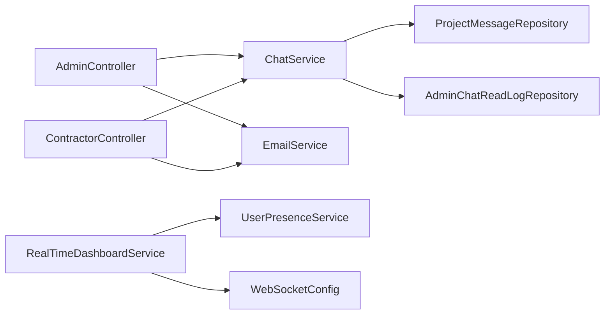

**Diagram sources**
- [AdminController.java:82-104](file://src/main/java/root/cyb/mh/skylink_media_service/infrastructure/web/AdminController.java#L82-L104)
- [ContractorController.java:60-69](file://src/main/java/root/cyb/mh/skylink_media_service/infrastructure/web/ContractorController.java#L60-L69)
- [ChatService.java:18-22](file://src/main/java/root/cyb/mh/skylink_media_service/application/services/ChatService.java#L18-L22)
- [ProjectMessageRepository.java:14-22](file://src/main/java/root/cyb/mh/skylink_media_service/infrastructure/persistence/ProjectMessageRepository.java#L14-L22)
- [AdminChatReadLogRepository.java:10-16](file://src/main/java/root/cyb/mh/skylink_media_service/infrastructure/persistence/AdminChatReadLogRepository.java#L10-L16)
- [RealTimeDashboardService.java:19-23](file://src/main/java/root/cyb/mh/skylink_media_service/application/services/RealTimeDashboardService.java#L19-L23)
- [WebSocketConfig.java:13-27](file://src/main/java/root/cyb/mh/skylink_media_service/infrastructure/config/WebSocketConfig.java#L13-L27)

**Section sources**
- [AdminController.java:82-104](file://src/main/java/root/cyb/mh/skylink_media_service/infrastructure/web/AdminController.java#L82-L104)
- [ContractorController.java:60-69](file://src/main/java/root/cyb/mh/skylink_media_service/infrastructure/web/ContractorController.java#L60-L69)
- [ChatService.java:18-22](file://src/main/java/root/cyb/mh/skylink_media_service/application/services/ChatService.java#L18-L22)
- [RealTimeDashboardService.java:19-23](file://src/main/java/root/cyb/mh/skylink_media_service/application/services/RealTimeDashboardService.java#L19-L23)

## Performance Considerations
- Asynchronous email delivery: EmailService uses @Async to avoid blocking HTTP threads
- Efficient unread counting: Repository query filters by project, timestamp, and excludes sender’s own messages
- Minimal UI polling: Templates render initial message sets server-side; historical loading fixed to prevent disappearing messages
- Presence tracking: ConcurrentHashMap-based active sessions minimize contention

[No sources needed since this section provides general guidance]

## Troubleshooting Guide
Common issues and resolutions:
- Chat messages disappear after refresh:
  - Cause: Incorrect lastMessageTime initialization causing poller to miss historical messages
  - Resolution: Ensure initial timestamp seeds server-rendered messages and polls correctly
  - Reference: [CHAT_FIX_DOCUMENTATION.md:23-55](file://CHAT_FIX_DOCUMENTATION.md#L23-L55)
- Email delivery failures:
  - Verify mail configuration in application.properties
  - Check logs for error messages from EmailService
  - Reference: [EmailService.java:69-71](file://src/main/java/root/cyb/mh/skylink_media_service/application/services/EmailService.java#L69-L71), [application.properties:43-58](file://src/main/resources/application.properties#L43-L58)
- Read receipt discrepancies:
  - Confirm AdminChatReadLog and ProjectViewLog updates occur on chat page visits
  - Reference: [AdminController.java:635-641](file://src/main/java/root/cyb/mh/skylink_media_service/infrastructure/web/AdminController.java#L635-L641), [ContractorController.java:201-206](file://src/main/java/root/cyb/mh/skylink_media_service/infrastructure/web/ContractorController.java#L201-L206)
- WebSocket not broadcasting:
  - Ensure WebSocketConfig is active and SimpMessagingTemplate is available
  - Reference: [WebSocketConfig.java:13-27](file://src/main/java/root/cyb/mh/skylink_media_service/infrastructure/config/WebSocketConfig.java#L13-L27), [RealTimeDashboardService.java:25-33](file://src/main/java/root/cyb/mh/skylink_media_service/application/services/RealTimeDashboardService.java#L25-L33)

**Section sources**
- [CHAT_FIX_DOCUMENTATION.md:23-55](file://CHAT_FIX_DOCUMENTATION.md#L23-L55)
- [EmailService.java:69-71](file://src/main/java/root/cyb/mh/skylink_media_service/application/services/EmailService.java#L69-L71)
- [application.properties:43-58](file://src/main/resources/application.properties#L43-L58)
- [AdminController.java:635-641](file://src/main/java/root/cyb/mh/skylink_media_service/infrastructure/web/AdminController.java#L635-L641)
- [ContractorController.java:201-206](file://src/main/java/root/cyb/mh/skylink_media_service/infrastructure/web/ContractorController.java#L201-L206)
- [WebSocketConfig.java:13-27](file://src/main/java/root/cyb/mh/skylink_media_service/infrastructure/config/WebSocketConfig.java#L13-L27)
- [RealTimeDashboardService.java:25-33](file://src/main/java/root/cyb/mh/skylink_media_service/application/services/RealTimeDashboardService.java#L25-L33)

## Conclusion
The communication system provides robust, asynchronous messaging with accurate read receipts and real-time presence monitoring. Admin and contractor chat interfaces integrate seamlessly with email notifications and audit logging, ensuring transparency and traceability across project communications.

[No sources needed since this section summarizes without analyzing specific files]

## Appendices

### Data Models Diagram
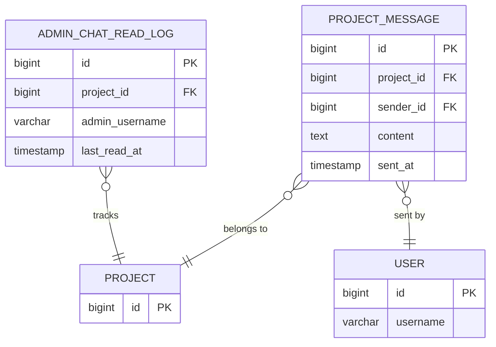

**Diagram sources**
- [ProjectMessage.java:6-83](file://src/main/java/root/cyb/mh/skylink_media_service/domain/entities/ProjectMessage.java#L6-L83)
- [AdminChatReadLog.java:6-41](file://src/main/java/root/cyb/mh/skylink_media_service/domain/entities/AdminChatReadLog.java#L6-L41)

### Notification Triggers Summary
- Admin sends message: notify assigned contractors
- Contractor sends message: notify WO Admin
- References: [AdminController.java:668-678](file://src/main/java/root/cyb/mh/skylink_media_service/infrastructure/web/AdminController.java#L668-L678), [ContractorController.java:238-250](file://src/main/java/root/cyb/mh/skylink_media_service/infrastructure/web/ContractorController.java#L238-L250)

**Section sources**
- [AdminController.java:668-678](file://src/main/java/root/cyb/mh/skylink_media_service/infrastructure/web/AdminController.java#L668-L678)
- [ContractorController.java:238-250](file://src/main/java/root/cyb/mh/skylink_media_service/infrastructure/web/ContractorController.java#L238-L250)