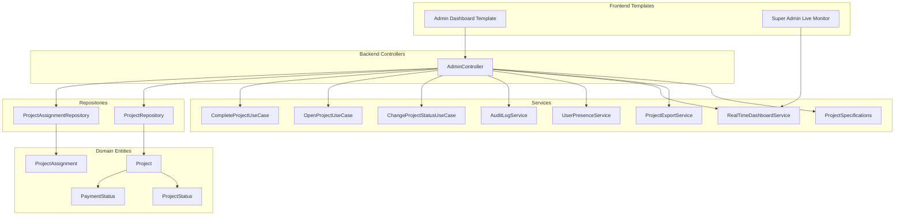
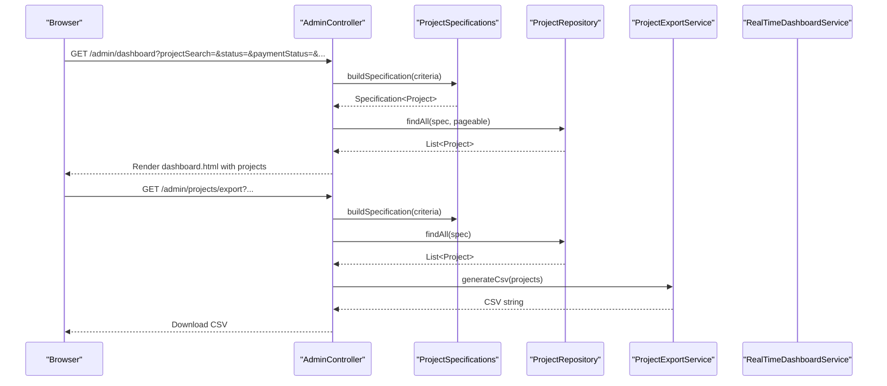
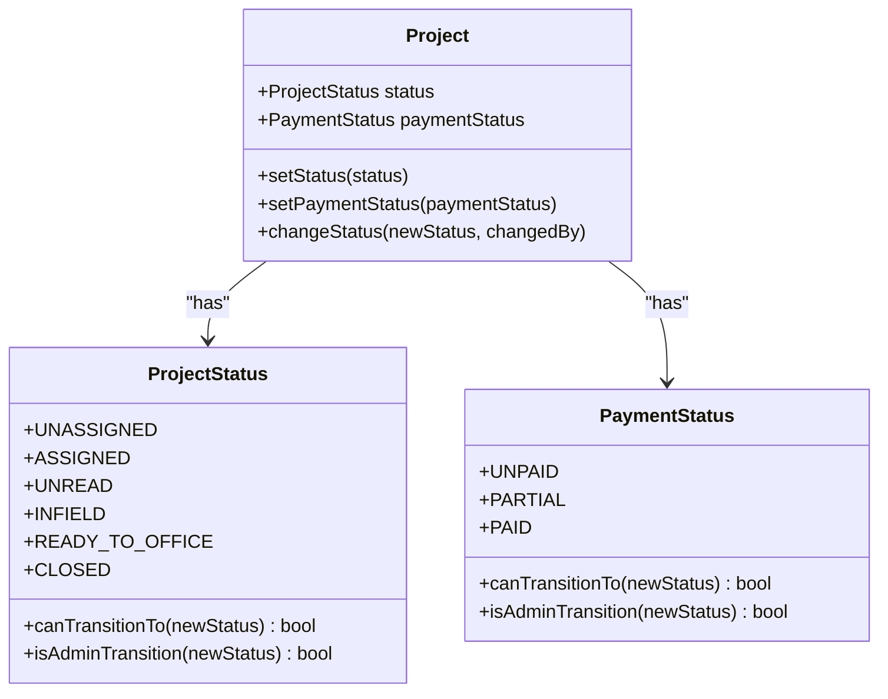
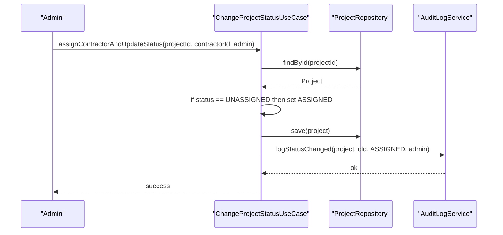
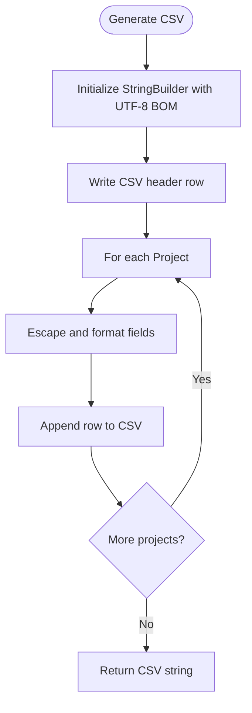
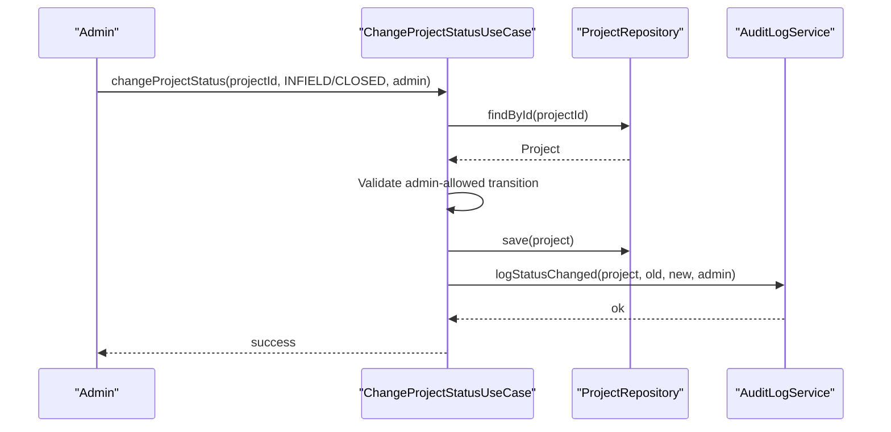
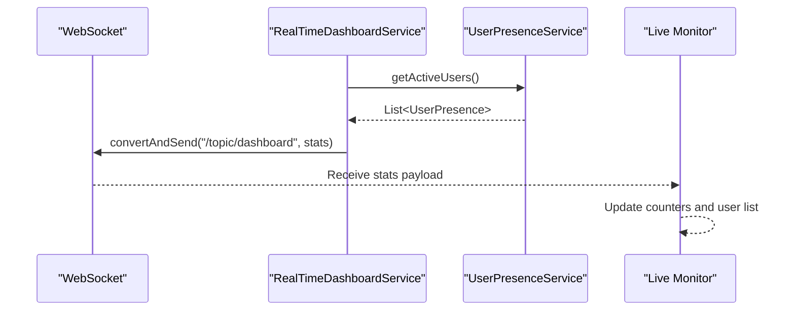
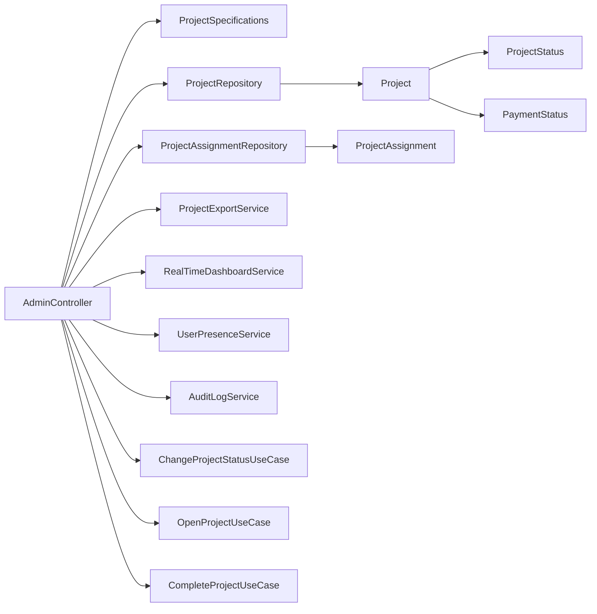

# Project Management Dashboard

<cite>
**Referenced Files in This Document**
- [AdminController.java](file://src/main/java/root/cyb/mh/skylink_media_service/infrastructure/web/AdminController.java)
- [dashboard.html](file://src/main/resources/templates/admin/dashboard.html)
- [live-monitor.html](file://src/main/resources/templates/super-admin/live-monitor.html)
- [Project.java](file://src/main/java/root/cyb/mh/skylink_media_service/domain/entities/Project.java)
- [ProjectAssignment.java](file://src/main/java/root/cyb/mh/skylink_media_service/domain/entities/ProjectAssignment.java)
- [ProjectRepository.java](file://src/main/java/root/cyb/mh/skylink_media_service/infrastructure/persistence/ProjectRepository.java)
- [ProjectAssignmentRepository.java](file://src/main/java/root/cyb/mh/skylink_media_service/infrastructure/persistence/ProjectAssignmentRepository.java)
- [ProjectSearchCriteria.java](file://src/main/java/root/cyb/mh/skylink_media_service/application/dto/ProjectSearchCriteria.java)
- [ProjectSpecifications.java](file://src/main/java/root/cyb/mh/skylink_media_service/application/services/ProjectSpecifications.java)
- [ProjectExportService.java](file://src/main/java/root/cyb/mh/skylink_media_service/application/services/ProjectExportService.java)
- [RealTimeDashboardService.java](file://src/main/java/root/cyb/mh/skylink_media_service/application/services/RealTimeDashboardService.java)
- [UserPresenceService.java](file://src/main/java/root/cyb/mh/skylink_media_service/application/services/UserPresenceService.java)
- [AuditLogService.java](file://src/main/java/root/cyb/mh/skylink_media_service/application/services/AuditLogService.java)
- [ChangeProjectStatusUseCase.java](file://src/main/java/root/cyb/mh/skylink_media_service/application/usecases/ChangeProjectStatusUseCase.java)
- [CompleteProjectUseCase.java](file://src/main/java/root/cyb/mh/skylink_media_service/application/usecases/CompleteProjectUseCase.java)
- [OpenProjectUseCase.java](file://src/main/java/root/cyb/mh/skylink_media_service/application/usecases/OpenProjectUseCase.java)
- [ProjectStatus.java](file://src/main/java/root/cyb/mh/skylink_media_service/domain/valueobjects/ProjectStatus.java)
- [PaymentStatus.java](file://src/main/java/root/cyb/mh/skylink_media_service/domain/valueobjects/PaymentStatus.java)
</cite>

## Table of Contents
1. [Introduction](#introduction)
2. [Project Structure](#project-structure)
3. [Core Components](#core-components)
4. [Architecture Overview](#architecture-overview)
5. [Detailed Component Analysis](#detailed-component-analysis)
6. [Dependency Analysis](#dependency-analysis)
7. [Performance Considerations](#performance-considerations)
8. [Troubleshooting Guide](#troubleshooting-guide)
9. [Conclusion](#conclusion)

## Introduction
This document provides comprehensive documentation for the project management dashboard functionality. It covers the AdminController dashboard implementation, advanced search and filtering, contractor assignment management, project creation workflows, CSV export generation, status management, contractor availability tracking, real-time monitoring, and practical examples for navigation and administrative tasks.

## Project Structure
The dashboard spans backend services and frontend templates:
- Backend: Controllers, services, repositories, use cases, and domain entities
- Frontend: Thymeleaf templates for admin and super-admin dashboards
- Real-time: WebSocket broadcasting for live updates

**Diagram sources**
- [dashboard.html](file://src/main/resources/templates/admin/dashboard.html)
- [live-monitor.html](file://src/main/resources/templates/super-admin/live-monitor.html)
- [AdminController.java](file://src/main/java/root/cyb/mh/skylink_media_service/infrastructure/web/AdminController.java)
- [ProjectSpecifications.java](file://src/main/java/root/cyb/mh/skylink_media_service/application/services/ProjectSpecifications.java)
- [ProjectExportService.java](file://src/main/java/root/cyb/mh/skylink_media_service/application/services/ProjectExportService.java)
- [RealTimeDashboardService.java](file://src/main/java/root/cyb/mh/skylink_media_service/application/services/RealTimeDashboardService.java)
- [UserPresenceService.java](file://src/main/java/root/cyb/mh/skylink_media_service/application/services/UserPresenceService.java)
- [AuditLogService.java](file://src/main/java/root/cyb/mh/skylink_media_service/application/services/AuditLogService.java)
- [ChangeProjectStatusUseCase.java](file://src/main/java/root/cyb/mh/skylink_media_service/application/usecases/ChangeProjectStatusUseCase.java)
- [OpenProjectUseCase.java](file://src/main/java/root/cyb/mh/skylink_media_service/application/usecases/OpenProjectUseCase.java)
- [CompleteProjectUseCase.java](file://src/main/java/root/cyb/mh/skylink_media_service/application/usecases/CompleteProjectUseCase.java)
- [ProjectRepository.java](file://src/main/java/root/cyb/mh/skylink_media_service/infrastructure/persistence/ProjectRepository.java)
- [ProjectAssignmentRepository.java](file://src/main/java/root/cyb/mh/skylink_media_service/infrastructure/persistence/ProjectAssignmentRepository.java)
- [Project.java](file://src/main/java/root/cyb/mh/skylink_media_service/domain/entities/Project.java)
- [ProjectAssignment.java](file://src/main/java/root/cyb/mh/skylink_media_service/domain/entities/ProjectAssignment.java)
- [ProjectStatus.java](file://src/main/java/root/cyb/mh/skylink_media_service/domain/valueobjects/ProjectStatus.java)
- [PaymentStatus.java](file://src/main/java/root/cyb/mh/skylink_media_service/domain/valueobjects/PaymentStatus.java)

**Section sources**
- [dashboard.html](file://src/main/resources/templates/admin/dashboard.html)
- [live-monitor.html](file://src/main/resources/templates/super-admin/live-monitor.html)
- [AdminController.java](file://src/main/java/root/cyb/mh/skylink_media_service/infrastructure/web/AdminController.java)

## Core Components
- AdminController: Orchestrates dashboard rendering, search/filtering, project actions, exports, and real-time updates
- ProjectSpecifications: Builds dynamic JPA Specifications for advanced filtering
- ProjectExportService: Generates CSV reports with safety measures against CSV injection
- RealTimeDashboardService: Broadcasts user presence, chat messages, and project updates via WebSocket
- UserPresenceService: Tracks active sessions and page distribution for live monitoring
- AuditLogService: Centralized logging for all administrative actions
- Status management use cases: Controlled transitions for project and payment statuses
- Domain entities: Project, ProjectAssignment, enums for status and payment status

**Section sources**
- [AdminController.java](file://src/main/java/root/cyb/mh/skylink_media_service/infrastructure/web/AdminController.java)
- [ProjectSpecifications.java](file://src/main/java/root/cyb/mh/skylink_media_service/application/services/ProjectSpecifications.java)
- [ProjectExportService.java](file://src/main/java/root/cyb/mh/skylink_media_service/application/services/ProjectExportService.java)
- [RealTimeDashboardService.java](file://src/main/java/root/cyb/mh/skylink_media_service/application/services/RealTimeDashboardService.java)
- [UserPresenceService.java](file://src/main/java/root/cyb/mh/skylink_media_service/application/services/UserPresenceService.java)
- [AuditLogService.java](file://src/main/java/root/cyb/mh/skylink_media_service/application/services/AuditLogService.java)
- [ChangeProjectStatusUseCase.java](file://src/main/java/root/cyb/mh/skylink_media_service/application/usecases/ChangeProjectStatusUseCase.java)
- [Project.java](file://src/main/java/root/cyb/mh/skylink_media_service/domain/entities/Project.java)
- [ProjectAssignment.java](file://src/main/java/root/cyb/mh/skylink_media_service/domain/entities/ProjectAssignment.java)
- [ProjectStatus.java](file://src/main/java/root/cyb/mh/skylink_media_service/domain/valueobjects/ProjectStatus.java)
- [PaymentStatus.java](file://src/main/java/root/cyb/mh/skylink_media_service/domain/valueobjects/PaymentStatus.java)

## Architecture Overview
The dashboard follows a layered architecture:
- Presentation: Thymeleaf templates render the admin and super-admin dashboards
- Controller: AdminController handles requests, applies filters, and coordinates services
- Services: Business logic for search, export, real-time updates, presence tracking, and auditing
- Persistence: Repositories manage data access and queries
- Domain: Entities and value objects define project lifecycle and status semantics

**Diagram sources**
- [dashboard.html](file://src/main/resources/templates/admin/dashboard.html)
- [ProjectSpecifications.java](file://src/main/java/root/cyb/mh/skylink_media_service/application/services/ProjectSpecifications.java)
- [ProjectRepository.java](file://src/main/java/root/cyb/mh/skylink_media_service/infrastructure/persistence/ProjectRepository.java)
- [ProjectExportService.java](file://src/main/java/root/cyb/mh/skylink_media_service/application/services/ProjectExportService.java)
- [AdminController.java](file://src/main/java/root/cyb/mh/skylink_media_service/infrastructure/web/AdminController.java)

## Detailed Component Analysis

### AdminController Dashboard Implementation
- Renders the admin dashboard with metrics, tabs, and project cards
- Supports quick search and advanced filters (status, payment status, due dates, price range, assigned contractor)
- Provides export to CSV with current filter parameters
- Enables contractor assignment/unassignment and status updates for eligible projects
- Integrates real-time updates for project and user presence

Key responsibilities:
- Build search criteria from request parameters
- Apply JPA Specifications for filtering
- Fetch projects with assignments for availability checks
- Compute contractor availability and project assignment status
- Render dashboard with active filters summary

**Section sources**
- [dashboard.html](file://src/main/resources/templates/admin/dashboard.html)
- [AdminController.java](file://src/main/java/root/cyb/mh/skylink_media_service/infrastructure/web/AdminController.java)

### Advanced Search and Filtering
- Text search across work order number, location, client code, and description
- Status and payment status filters
- Due date range and invoice price range
- Assigned contractor filter
- Dynamic filter summary and reset functionality

Implementation highlights:
- ProjectSearchCriteria encapsulates filter fields
- ProjectSpecifications builds predicates dynamically
- ProjectRepository supports text search and fetch-by-id with assignments

```mermaid
flowchart TD
Start(["Build Specification"]) --> CheckText["Text search present?"]
CheckText --> |Yes| AddTextPred["Add OR predicates for WO#, location, client code, description"]
CheckText --> |No| Next1["Skip text predicate"]
AddTextPred --> Next1
Next1 --> CheckStatus["Status filter?"]
CheckStatus --> |Yes| AddStatus["Add status equality predicate"]
CheckStatus --> |No| Next2["Skip status predicate"]
AddStatus --> Next2
Next2 --> CheckPayStatus["Payment status filter?"]
CheckPayStatus --> |Yes| AddPay["Add payment status equality predicate"]
CheckPayStatus --> |No| Next3["Skip payment predicate"]
AddPay --> Next3
Next3 --> CheckDueFrom["Due date from?"]
CheckDueFrom --> |Yes| AddDueFrom["Add >= dueDate predicate"]
CheckDueFrom --> |No| Next4["Skip dueFrom predicate"]
AddDueFrom --> Next4
Next4 --> CheckDueTo["Due date to?"]
CheckDueTo --> |Yes| AddDueTo["Add <= dueDate predicate"]
CheckDueTo --> |No| Next5["Skip dueTo predicate"]
AddDueTo --> Next5
Next5 --> CheckPriceFrom["Price from?"]
CheckPriceFrom --> |Yes| AddPriceFrom["Add >= invoicePrice predicate"]
CheckPriceFrom --> |No| Next6["Skip priceFrom predicate"]
AddPriceFrom --> Next6
Next6 --> CheckPriceTo["Price to?"]
CheckPriceTo --> |Yes| AddPriceTo["Add <= invoicePrice predicate"]
CheckPriceTo --> |No| Next7["Skip priceTo predicate"]
AddPriceTo --> Next7
Next7 --> CheckContractor["Assigned contractor filter?"]
CheckContractor --> |Yes| JoinAssign["Join assignments and add contractor equality"]
CheckContractor --> |No| Done["Return combined predicates"]
JoinAssign --> Done
```

**Diagram sources**
- [ProjectSpecifications.java](file://src/main/java/root/cyb/mh/skylink_media_service/application/services/ProjectSpecifications.java)
- [ProjectSearchCriteria.java](file://src/main/java/root/cyb/mh/skylink_media_service/application/dto/ProjectSearchCriteria.java)
- [ProjectRepository.java](file://src/main/java/root/cyb/mh/skylink_media_service/infrastructure/persistence/ProjectRepository.java)

**Section sources**
- [ProjectSpecifications.java](file://src/main/java/root/cyb/mh/skylink_media_service/application/services/ProjectSpecifications.java)
- [ProjectSearchCriteria.java](file://src/main/java/root/cyb/mh/skylink_media_service/application/dto/ProjectSearchCriteria.java)
- [ProjectRepository.java](file://src/main/java/root/cyb/mh/skylink_media_service/infrastructure/persistence/ProjectRepository.java)

### Project Filtering by Status and Payment Status
- Status filtering uses ProjectStatus enumeration with predefined transitions
- Payment status filtering uses PaymentStatus with forward-only progression
- Admins can only set INFIELD or CLOSED from READY_TO_OFFICE for project status
- Payment status transitions enforce UNPAID → PARTIAL → PAID progression

**Diagram sources**
- [Project.java](file://src/main/java/root/cyb/mh/skylink_media_service/domain/entities/Project.java)
- [ProjectStatus.java](file://src/main/java/root/cyb/mh/skylink_media_service/domain/valueobjects/ProjectStatus.java)
- [PaymentStatus.java](file://src/main/java/root/cyb/mh/skylink_media_service/domain/valueobjects/PaymentStatus.java)

**Section sources**
- [ProjectStatus.java](file://src/main/java/root/cyb/mh/skylink_media_service/domain/valueobjects/ProjectStatus.java)
- [PaymentStatus.java](file://src/main/java/root/cyb/mh/skylink_media_service/domain/valueobjects/PaymentStatus.java)
- [ChangeProjectStatusUseCase.java](file://src/main/java/root/cyb/mh/skylink_media_service/application/usecases/ChangeProjectStatusUseCase.java)

### Contractor Assignment Management
- Assignment logic ensures projects move from UNASSIGNED to ASSIGNED upon assignment
- Availability tracking prevents over-assignment (per contractor limits)
- Unassignment is supported except for CLOSED projects
- Assignment history and counts are surfaced in the UI

**Diagram sources**
- [ChangeProjectStatusUseCase.java](file://src/main/java/root/cyb/mh/skylink_media_service/application/usecases/ChangeProjectStatusUseCase.java)
- [ProjectRepository.java](file://src/main/java/root/cyb/mh/skylink_media_service/infrastructure/persistence/ProjectRepository.java)
- [AuditLogService.java](file://src/main/java/root/cyb/mh/skylink_media_service/application/services/AuditLogService.java)

**Section sources**
- [ChangeProjectStatusUseCase.java](file://src/main/java/root/cyb/mh/skylink_media_service/application/usecases/ChangeProjectStatusUseCase.java)
- [ProjectAssignmentRepository.java](file://src/main/java/root/cyb/mh/skylink_media_service/infrastructure/persistence/ProjectAssignmentRepository.java)
- [Project.java](file://src/main/java/root/cyb/mh/skylink_media_service/domain/entities/Project.java)

### Project Creation Workflows
- New project creation is supported via the admin template navigation
- The dashboard template links to the "New Project" page
- Audit logging captures creation events for compliance

**Section sources**
- [dashboard.html](file://src/main/resources/templates/admin/dashboard.html)
- [AuditLogService.java](file://src/main/java/root/cyb/mh/skylink_media_service/application/services/AuditLogService.java)

### Project Export Functionality
- CSV export includes comprehensive project metadata and contractor lists
- Safety measures prevent CSV injection by escaping special characters and quoting values
- Export respects current filter parameters passed from the dashboard

**Diagram sources**
- [ProjectExportService.java](file://src/main/java/root/cyb/mh/skylink_media_service/application/services/ProjectExportService.java)

**Section sources**
- [ProjectExportService.java](file://src/main/java/root/cyb/mh/skylink_media_service/application/services/ProjectExportService.java)
- [dashboard.html](file://src/main/resources/templates/admin/dashboard.html)

### Project Status Management and Transitions
- Admin-controlled transitions: INFIELD or CLOSED from READY_TO_OFFICE
- Automatic transitions driven by contractor actions (Open/Complete)
- Payment status progression enforced (UNPAID → PARTIAL → PAID)

**Diagram sources**
- [ChangeProjectStatusUseCase.java](file://src/main/java/root/cyb/mh/skylink_media_service/application/usecases/ChangeProjectStatusUseCase.java)
- [ProjectRepository.java](file://src/main/java/root/cyb/mh/skylink_media_service/infrastructure/persistence/ProjectRepository.java)
- [AuditLogService.java](file://src/main/java/root/cyb/mh/skylink_media_service/application/services/AuditLogService.java)

**Section sources**
- [ChangeProjectStatusUseCase.java](file://src/main/java/root/cyb/mh/skylink_media_service/application/usecases/ChangeProjectStatusUseCase.java)
- [OpenProjectUseCase.java](file://src/main/java/root/cyb/mh/skylink_media_service/application/usecases/OpenProjectUseCase.java)
- [CompleteProjectUseCase.java](file://src/main/java/root/cyb/mh/skylink_media_service/application/usecases/CompleteProjectUseCase.java)

### Contractor Availability Tracking and Assignment Logic
- Availability computed per contractor and per project
- UI disables assignment options when contractor is full or project is already assigned
- Assignment repository provides counts and active assignment checks

**Section sources**
- [ProjectAssignmentRepository.java](file://src/main/java/root/cyb/mh/skylink_media_service/infrastructure/persistence/ProjectAssignmentRepository.java)
- [dashboard.html](file://src/main/resources/templates/admin/dashboard.html)

### Real-Time Project Monitoring Features
- WebSocket broadcasts user presence, chat messages, and project updates
- Live monitor displays active users and page distribution
- Stats broadcast includes totals and recent activity

**Diagram sources**
- [RealTimeDashboardService.java](file://src/main/java/root/cyb/mh/skylink_media_service/application/services/RealTimeDashboardService.java)
- [UserPresenceService.java](file://src/main/java/root/cyb/mh/skylink_media_service/application/services/UserPresenceService.java)
- [live-monitor.html](file://src/main/resources/templates/super-admin/live-monitor.html)

**Section sources**
- [RealTimeDashboardService.java](file://src/main/java/root/cyb/mh/skylink_media_service/application/services/RealTimeDashboardService.java)
- [UserPresenceService.java](file://src/main/java/root/cyb/mh/skylink_media_service/application/services/UserPresenceService.java)
- [live-monitor.html](file://src/main/resources/templates/super-admin/live-monitor.html)

### Examples of Dashboard Navigation, Search Operations, and Administrative Tasks
- Dashboard navigation: Sidebar links to Dashboard, New Project, New Contractor, System Config
- Search operations: Quick search bar and advanced filters; export button passes current filters
- Administrative tasks: Assign contractor dropdown, unassign contractor, set status (admin-only), edit project, view project history, chat access

**Section sources**
- [dashboard.html](file://src/main/resources/templates/admin/dashboard.html)

## Dependency Analysis
The dashboard exhibits cohesive coupling around the AdminController and shared services:
- AdminController depends on specifications, repositories, export service, real-time service, presence service, and audit service
- Repositories depend on domain entities and JPA
- Use cases encapsulate business rules for status transitions
- Enumerations define valid state transitions

**Diagram sources**
- [AdminController.java](file://src/main/java/root/cyb/mh/skylink_media_service/infrastructure/web/AdminController.java)
- [ProjectSpecifications.java](file://src/main/java/root/cyb/mh/skylink_media_service/application/services/ProjectSpecifications.java)
- [ProjectRepository.java](file://src/main/java/root/cyb/mh/skylink_media_service/infrastructure/persistence/ProjectRepository.java)
- [ProjectAssignmentRepository.java](file://src/main/java/root/cyb/mh/skylink_media_service/infrastructure/persistence/ProjectAssignmentRepository.java)
- [ProjectExportService.java](file://src/main/java/root/cyb/mh/skylink_media_service/application/services/ProjectExportService.java)
- [RealTimeDashboardService.java](file://src/main/java/root/cyb/mh/skylink_media_service/application/services/RealTimeDashboardService.java)
- [UserPresenceService.java](file://src/main/java/root/cyb/mh/skylink_media_service/application/services/UserPresenceService.java)
- [AuditLogService.java](file://src/main/java/root/cyb/mh/skylink_media_service/application/services/AuditLogService.java)
- [ChangeProjectStatusUseCase.java](file://src/main/java/root/cyb/mh/skylink_media_service/application/usecases/ChangeProjectStatusUseCase.java)
- [OpenProjectUseCase.java](file://src/main/java/root/cyb/mh/skylink_media_service/application/usecases/OpenProjectUseCase.java)
- [CompleteProjectUseCase.java](file://src/main/java/root/cyb/mh/skylink_media_service/application/usecases/CompleteProjectUseCase.java)
- [Project.java](file://src/main/java/root/cyb/mh/skylink_media_service/domain/entities/Project.java)
- [ProjectAssignment.java](file://src/main/java/root/cyb/mh/skylink_media_service/domain/entities/ProjectAssignment.java)
- [ProjectStatus.java](file://src/main/java/root/cyb/mh/skylink_media_service/domain/valueobjects/ProjectStatus.java)
- [PaymentStatus.java](file://src/main/java/root/cyb/mh/skylink_media_service/domain/valueobjects/PaymentStatus.java)

**Section sources**
- [AdminController.java](file://src/main/java/root/cyb/mh/skylink_media_service/infrastructure/web/AdminController.java)

## Performance Considerations
- Use JPA Specifications to avoid N+1 queries and apply joins conditionally
- Fetch projects with assignments when availability checks are needed
- Limit export result sets and stream large exports if necessary
- Cache frequently accessed contractor availability counts
- Optimize database indexes for search fields (work order number, location, client code, status, payment status, due date, invoice price)

## Troubleshooting Guide
- Status transition errors: Verify current status allows the requested transition; admin transitions are restricted to READY_TO_OFFICE
- Payment status errors: Ensure progression follows UNPAID → PARTIAL → PAID
- Assignment failures: Confirm contractor availability and project assignment status
- Export issues: Validate filter parameters and ensure sufficient memory for large datasets
- Real-time updates: Confirm WebSocket configuration and presence service initialization

**Section sources**
- [ChangeProjectStatusUseCase.java](file://src/main/java/root/cyb/mh/skylink_media_service/application/usecases/ChangeProjectStatusUseCase.java)
- [ProjectAssignmentRepository.java](file://src/main/java/root/cyb/mh/skylink_media_service/infrastructure/persistence/ProjectAssignmentRepository.java)
- [RealTimeDashboardService.java](file://src/main/java/root/cyb/mh/skylink_media_service/application/services/RealTimeDashboardService.java)

## Conclusion
The project management dashboard integrates advanced search, robust filtering, contractor assignment controls, CSV export, and real-time monitoring. The AdminController orchestrates these features while domain-enforced status transitions and audit logging ensure operational integrity. The modular design supports maintainability and scalability for future enhancements.