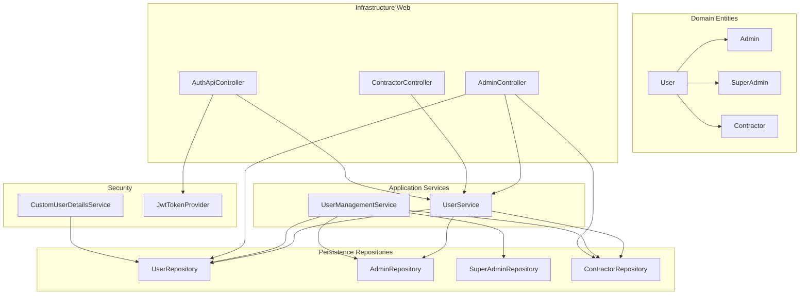
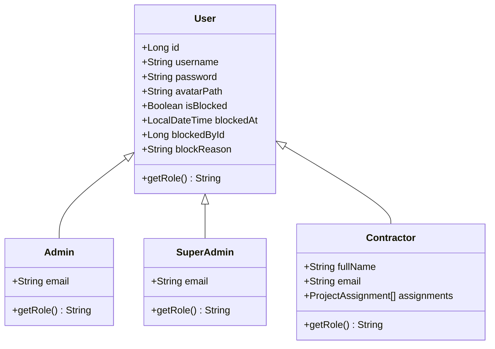
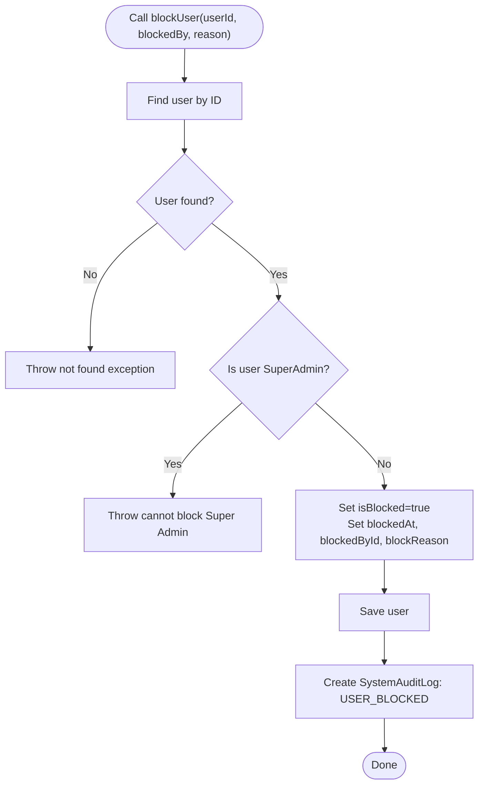
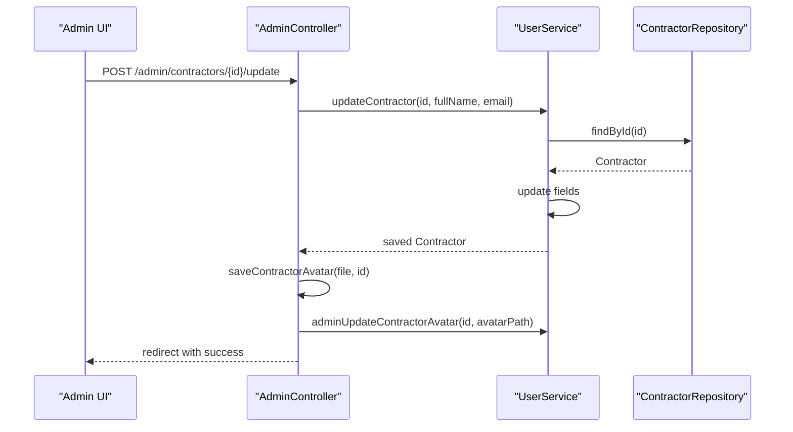
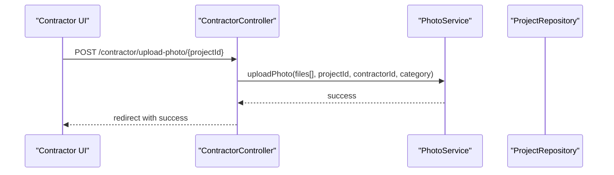
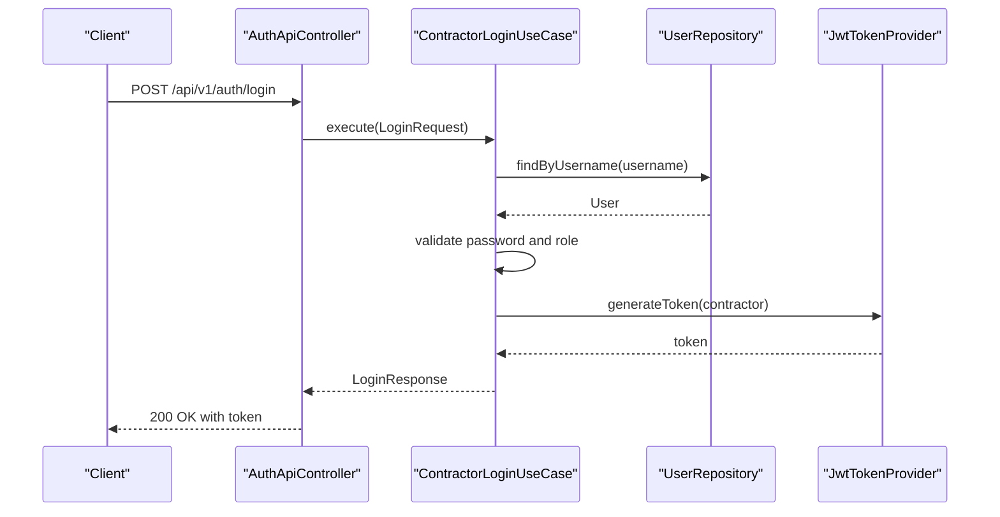
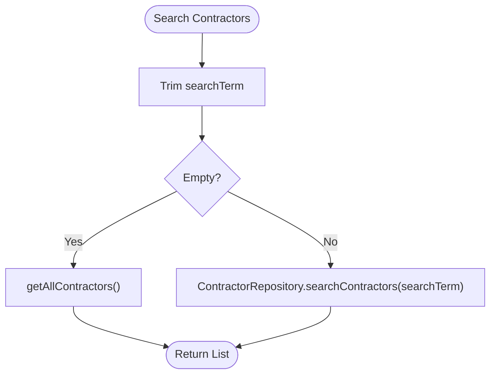
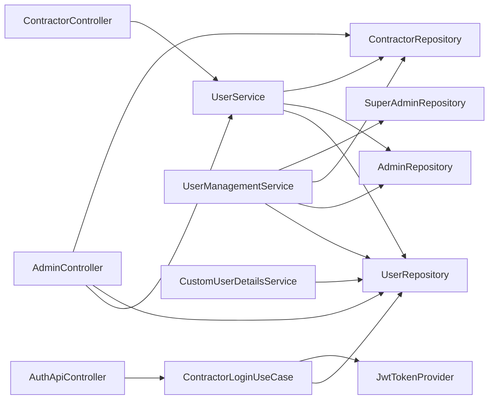

# User Management

<cite>
**Referenced Files in This Document**
- [UserManagementService.java](file://src/main/java/root/cyb/mh/skylink_media_service/application/services/UserManagementService.java)
- [UserController.java](file://src/main/java/root/cyb/mh/skylink_media_service/infrastructure/web/AdminController.java)
- [ContractorController.java](file://src/main/java/root/cyb/mh/skylink_media_service/infrastructure/web/ContractorController.java)
- [User.java](file://src/main/java/root/cyb/mh/skylink_media_service/domain/entities/User.java)
- [Admin.java](file://src/main/java/root/cyb/mh/skylink_media_service/domain/entities/Admin.java)
- [SuperAdmin.java](file://src/main/java/root/cyb/mh/skylink_media_service/domain/entities/SuperAdmin.java)
- [Contractor.java](file://src/main/java/root/cyb/mh/skylink_media_service/domain/entities/Contractor.java)
- [UserRepository.java](file://src/main/java/root/cyb/mh/skylink_media_service/infrastructure/persistence/UserRepository.java)
- [AdminRepository.java](file://src/main/java/root/cyb/mh/skylink_media_service/infrastructure/persistence/AdminRepository.java)
- [ContractorRepository.java](file://src/main/java/root/cyb/mh/skylink_media_service/infrastructure/persistence/ContractorRepository.java)
- [SuperAdminRepository.java](file://src/main/java/root/cyb/mh/skylink_media_service/infrastructure/persistence/SuperAdminRepository.java)
- [UserService.java](file://src/main/java/root/cyb/mh/skylink_media_service/application/services/UserService.java)
- [AuthApiController.java](file://src/main/java/root/cyb/mh/skylink_media_service/infrastructure/web/api/AuthApiController.java)
- [ContractorLoginUseCase.java](file://src/main/java/root/cyb/mh/skylink_media_service/application/usecases/ContractorLoginUseCase.java)
- [LoginRequest.java](file://src/main/java/root/cyb/mh/skylink_media_service/application/dto/api/LoginRequest.java)
- [LoginResponse.java](file://src/main/java/root/cyb/mh/skylink_media_service/application/dto/api/LoginResponse.java)
- [CustomUserDetailsService.java](file://src/main/java/root/cyb/mh/skylink_media_service/infrastructure/security/CustomUserDetailsService.java)
- [JwtTokenProvider.java](file://src/main/java/root/cyb/mh/skylink_media_service/infrastructure/security/jwt/JwtTokenProvider.java)
</cite>

## Table of Contents
1. [Introduction](#introduction)
2. [Project Structure](#project-structure)
3. [Core Components](#core-components)
4. [Architecture Overview](#architecture-overview)
5. [Detailed Component Analysis](#detailed-component-analysis)
6. [Dependency Analysis](#dependency-analysis)
7. [Performance Considerations](#performance-considerations)
8. [Troubleshooting Guide](#troubleshooting-guide)
9. [Conclusion](#conclusion)
10. [Appendices](#appendices)

## Introduction
This document provides comprehensive documentation for the user management system. It explains how administrators create and manage users across roles (ADMIN, SUPER_ADMIN, CONTRACTOR), how contractor registration and profile management works, and how authentication flows operate. It also covers contractor-specific workflows such as profile updates, avatar uploads, and password changes, along with user search capabilities, contractor availability tracking, and administrative maintenance procedures.

## Project Structure
The user management system spans several layers:
- Domain entities define the user hierarchy and attributes.
- Application services encapsulate business logic for user creation, updates, blocking/deletion, and role-specific operations.
- Infrastructure web controllers expose endpoints for administrative and contractor workflows.
- Persistence repositories provide data access for users and roles.
- Security components handle authentication and authorization.

**Diagram sources**
- [User.java:1-82](file://src/main/java/root/cyb/mh/skylink_media_service/domain/entities/User.java#L1-L82)
- [Admin.java:1-33](file://src/main/java/root/cyb/mh/skylink_media_service/domain/entities/Admin.java#L1-L33)
- [SuperAdmin.java:1-33](file://src/main/java/root/cyb/mh/skylink_media_service/domain/entities/SuperAdmin.java#L1-L33)
- [Contractor.java:1-48](file://src/main/java/root/cyb/mh/skylink_media_service/domain/entities/Contractor.java#L1-L48)
- [UserService.java:1-120](file://src/main/java/root/cyb/mh/skylink_media_service/application/services/UserService.java#L1-L120)
- [UserManagementService.java:1-351](file://src/main/java/root/cyb/mh/skylink_media_service/application/services/UserManagementService.java#L1-L351)
- [AdminController.java:1-775](file://src/main/java/root/cyb/mh/skylink_media_service/infrastructure/web/AdminController.java#L1-L775)
- [ContractorController.java:1-258](file://src/main/java/root/cyb/mh/skylink_media_service/infrastructure/web/ContractorController.java#L1-L258)
- [AuthApiController.java:1-34](file://src/main/java/root/cyb/mh/skylink_media_service/infrastructure/web/api/AuthApiController.java#L1-L34)
- [UserRepository.java:1-22](file://src/main/java/root/cyb/mh/skylink_media_service/infrastructure/persistence/UserRepository.java#L1-L22)
- [AdminRepository.java:1-19](file://src/main/java/root/cyb/mh/skylink_media_service/infrastructure/persistence/AdminRepository.java#L1-L19)
- [ContractorRepository.java:1-18](file://src/main/java/root/cyb/mh/skylink_media_service/infrastructure/persistence/ContractorRepository.java#L1-L18)
- [SuperAdminRepository.java:1-16](file://src/main/java/root/cyb/mh/skylink_media_service/infrastructure/persistence/SuperAdminRepository.java#L1-L16)
- [CustomUserDetailsService.java:1-36](file://src/main/java/root/cyb/mh/skylink_media_service/infrastructure/security/CustomUserDetailsService.java#L1-L36)
- [JwtTokenProvider.java:1-81](file://src/main/java/root/cyb/mh/skylink_media_service/infrastructure/security/jwt/JwtTokenProvider.java#L1-L81)

**Section sources**
- [UserManagementService.java:1-351](file://src/main/java/root/cyb/mh/skylink_media_service/application/services/UserManagementService.java#L1-L351)
- [UserService.java:1-120](file://src/main/java/root/cyb/mh/skylink_media_service/application/services/UserService.java#L1-L120)
- [AdminController.java:1-775](file://src/main/java/root/cyb/mh/skylink_media_service/infrastructure/web/AdminController.java#L1-L775)
- [ContractorController.java:1-258](file://src/main/java/root/cyb/mh/skylink_media_service/infrastructure/web/ContractorController.java#L1-L258)
- [AuthApiController.java:1-34](file://src/main/java/root/cyb/mh/skylink_media_service/infrastructure/web/api/AuthApiController.java#L1-L34)

## Core Components
- User entity hierarchy with SINGLE_TABLE inheritance and discriminator values for ADMIN, SUPER_ADMIN, and CONTRACTOR.
- UserService: Handles contractor and admin creation, profile updates, password changes, and contractor search.
- UserManagementService: Provides administrative operations such as blocking/unblocking/deleting users, role creation, profile updates, and password resets.
- AdminController: Exposes administrative endpoints for contractor creation, profile editing, avatar uploads, password changes, and admin registration/update.
- ContractorController: Supports contractor dashboards, photo uploads, project actions, and chat interactions.
- Authentication: Contractor login via JWT with dedicated API controller and use case.

**Section sources**
- [User.java:1-82](file://src/main/java/root/cyb/mh/skylink_media_service/domain/entities/User.java#L1-L82)
- [Admin.java:1-33](file://src/main/java/root/cyb/mh/skylink_media_service/domain/entities/Admin.java#L1-L33)
- [SuperAdmin.java:1-33](file://src/main/java/root/cyb/mh/skylink_media_service/domain/entities/SuperAdmin.java#L1-L33)
- [Contractor.java:1-48](file://src/main/java/root/cyb/mh/skylink_media_service/domain/entities/Contractor.java#L1-L48)
- [UserService.java:1-120](file://src/main/java/root/cyb/mh/skylink_media_service/application/services/UserService.java#L1-L120)
- [UserManagementService.java:1-351](file://src/main/java/root/cyb/mh/skylink_media_service/application/services/UserManagementService.java#L1-L351)
- [AdminController.java:1-775](file://src/main/java/root/cyb/mh/skylink_media_service/infrastructure/web/AdminController.java#L1-L775)
- [ContractorController.java:1-258](file://src/main/java/root/cyb/mh/skylink_media_service/infrastructure/web/ContractorController.java#L1-L258)
- [AuthApiController.java:1-34](file://src/main/java/root/cyb/mh/skylink_media_service/infrastructure/web/api/AuthApiController.java#L1-L34)

## Architecture Overview
The system follows layered architecture:
- Presentation layer: Controllers for Admin and Contractor, plus an API controller for authentication.
- Application layer: Services orchestrating business logic and repositories.
- Domain layer: Entities modeling users and roles.
- Persistence layer: Repositories for data access.
- Security layer: Custom user details service and JWT provider.

**Diagram sources**
- [User.java:1-82](file://src/main/java/root/cyb/mh/skylink_media_service/domain/entities/User.java#L1-L82)
- [Admin.java:1-33](file://src/main/java/root/cyb/mh/skylink_media_service/domain/entities/Admin.java#L1-L33)
- [SuperAdmin.java:1-33](file://src/main/java/root/cyb/mh/skylink_media_service/domain/entities/SuperAdmin.java#L1-L33)
- [Contractor.java:1-48](file://src/main/java/root/cyb/mh/skylink_media_service/domain/entities/Contractor.java#L1-L48)

**Section sources**
- [User.java:1-82](file://src/main/java/root/cyb/mh/skylink_media_service/domain/entities/User.java#L1-L82)
- [Admin.java:1-33](file://src/main/java/root/cyb/mh/skylink_media_service/domain/entities/Admin.java#L1-L33)
- [SuperAdmin.java:1-33](file://src/main/java/root/cyb/mh/skylink_media_service/domain/entities/SuperAdmin.java#L1-L33)
- [Contractor.java:1-48](file://src/main/java/root/cyb/mh/skylink_media_service/domain/entities/Contractor.java#L1-L48)

## Detailed Component Analysis

### UserManagementService
Responsibilities:
- Retrieve all users by type (ADMIN, SUPER_ADMIN, CONTRACTOR) with pagination.
- Block/unblock and delete users with audit logging.
- Create ADMIN, SUPER_ADMIN, and CONTRACTOR accounts with validation and audit logs.
- Update role-specific profiles and handle avatar updates.
- Reset user passwords with constraints and audit logs.

Key operations:
- Listing: getAllUsers, getUsersByType, getAllAdmins, getAllSuperAdmins, getAllContractors.
- Blocking/Unblocking/Delete: blockUser, unblockUser, deleteUser.
- Role creation: createAdmin, createSuperAdmin, createContractor.
- Profile updates: updateAdminProfile, updateContractorProfile, updateSuperAdminProfile, updateUserAvatar.
- Password management: resetUserPassword.

**Diagram sources**
- [UserManagementService.java:64-114](file://src/main/java/root/cyb/mh/skylink_media_service/application/services/UserManagementService.java#L64-L114)

**Section sources**
- [UserManagementService.java:40-143](file://src/main/java/root/cyb/mh/skylink_media_service/application/services/UserManagementService.java#L40-L143)
- [UserManagementService.java:145-351](file://src/main/java/root/cyb/mh/skylink_media_service/application/services/UserManagementService.java#L145-L351)

### UserController (AdminController)
Endpoints for administrative user management:
- Admin registration: GET/POST /admin/register-admin.
- Email update: POST /admin/update-email.
- Contractor creation: GET/POST /admin/create-contractor.
- Contractor profile edit and avatar upload: GET/POST /admin/contractors/{contractorId}/update.
- Contractor password change: POST /admin/contractors/{contractorId}/change-password.
- Dashboard with contractor availability indicators and project assignment helpers.

Administrative workflows:
- Avatar upload validation and storage path resolution.
- Audit logging for contractor updates and password changes.
- Integration with project services for availability checks.

**Diagram sources**
- [AdminController.java:687-775](file://src/main/java/root/cyb/mh/skylink_media_service/infrastructure/web/AdminController.java#L687-L775)
- [UserService.java:94-118](file://src/main/java/root/cyb/mh/skylink_media_service/application/services/UserService.java#L94-L118)

**Section sources**
- [AdminController.java:268-300](file://src/main/java/root/cyb/mh/skylink_media_service/infrastructure/web/AdminController.java#L268-L300)
- [AdminController.java:361-378](file://src/main/java/root/cyb/mh/skylink_media_service/infrastructure/web/AdminController.java#L361-L378)
- [AdminController.java:687-775](file://src/main/java/root/cyb/mh/skylink_media_service/infrastructure/web/AdminController.java#L687-L775)

### ContractorController
Contractor workflows:
- Dashboard with project assignments, photo counts, and unread message counts.
- Photo upload with categories and bulk file handling.
- Project actions: open and complete project.
- Chat interactions with admin notifications.

**Diagram sources**
- [ContractorController.java:128-154](file://src/main/java/root/cyb/mh/skylink_media_service/infrastructure/web/ContractorController.java#L128-L154)

**Section sources**
- [ContractorController.java:71-107](file://src/main/java/root/cyb/mh/skylink_media_service/infrastructure/web/ContractorController.java#L71-L107)
- [ContractorController.java:128-154](file://src/main/java/root/cyb/mh/skylink_media_service/infrastructure/web/ContractorController.java#L128-L154)
- [ContractorController.java:156-186](file://src/main/java/root/cyb/mh/skylink_media_service/infrastructure/web/ContractorController.java#L156-L186)
- [ContractorController.java:190-256](file://src/main/java/root/cyb/mh/skylink_media_service/infrastructure/web/ContractorController.java#L190-L256)

### Authentication Flow (Contractor)
Contractor login via API:
- Endpoint: POST /api/v1/auth/login.
- Use case validates credentials, ensures user is a contractor, generates JWT with expiration, and returns token details.

**Diagram sources**
- [AuthApiController.java:23-32](file://src/main/java/root/cyb/mh/skylink_media_service/infrastructure/web/api/AuthApiController.java#L23-L32)
- [ContractorLoginUseCase.java:29-58](file://src/main/java/root/cyb/mh/skylink_media_service/application/usecases/ContractorLoginUseCase.java#L29-L58)
- [JwtTokenProvider.java:25-37](file://src/main/java/root/cyb/mh/skylink_media_service/infrastructure/security/jwt/JwtTokenProvider.java#L25-L37)

**Section sources**
- [AuthApiController.java:1-34](file://src/main/java/root/cyb/mh/skylink_media_service/infrastructure/web/api/AuthApiController.java#L1-L34)
- [ContractorLoginUseCase.java:1-60](file://src/main/java/root/cyb/mh/skylink_media_service/application/usecases/ContractorLoginUseCase.java#L1-L60)
- [LoginRequest.java:1-29](file://src/main/java/root/cyb/mh/skylink_media_service/application/dto/api/LoginRequest.java#L1-L29)
- [LoginResponse.java:1-42](file://src/main/java/root/cyb/mh/skylink_media_service/application/dto/api/LoginResponse.java#L1-L42)
- [CustomUserDetailsService.java:1-36](file://src/main/java/root/cyb/mh/skylink_media_service/infrastructure/security/CustomUserDetailsService.java#L1-L36)
- [JwtTokenProvider.java:1-81](file://src/main/java/root/cyb/mh/skylink_media_service/infrastructure/security/jwt/JwtTokenProvider.java#L1-L81)

### User Search and Availability Tracking
- Contractor search: UserService.searchContractors delegates to ContractorRepository with LIKE queries on username/full name.
- Availability indicators: Admin dashboard computes active project counts and availability flags for contractors and projects.

**Diagram sources**
- [UserService.java:82-87](file://src/main/java/root/cyb/mh/skylink_media_service/application/services/UserService.java#L82-L87)
- [ContractorRepository.java:13-16](file://src/main/java/root/cyb/mh/skylink_media_service/infrastructure/persistence/ContractorRepository.java#L13-L16)

**Section sources**
- [UserService.java:78-87](file://src/main/java/root/cyb/mh/skylink_media_service/application/services/UserService.java#L78-L87)
- [ContractorRepository.java:13-16](file://src/main/java/root/cyb/mh/skylink_media_service/infrastructure/persistence/ContractorRepository.java#L13-L16)
- [AdminController.java:159-176](file://src/main/java/root/cyb/mh/skylink_media_service/infrastructure/web/AdminController.java#L159-L176)

### Administrative User Management Tasks
Common administrative tasks and where they are implemented:
- Create ADMIN: AdminController.registerAdminForm/registerAdmin.
- Create SUPER_ADMIN: UserManagementService.createSuperAdmin (via audit/logged process).
- Create CONTRACTOR: AdminController.createContractorForm/createContractor.
- Update contractor profile and avatar: AdminController.updateContractor.
- Change contractor password: AdminController.changeContractorPassword.
- Block/unblock/delete users: UserManagementService.blockUser/unblockUser/deleteUser.
- Reset user password: UserManagementService.resetUserPassword.

**Section sources**
- [AdminController.java:268-300](file://src/main/java/root/cyb/mh/skylink_media_service/infrastructure/web/AdminController.java#L268-L300)
- [AdminController.java:361-378](file://src/main/java/root/cyb/mh/skylink_media_service/infrastructure/web/AdminController.java#L361-L378)
- [AdminController.java:687-775](file://src/main/java/root/cyb/mh/skylink_media_service/infrastructure/web/AdminController.java#L687-L775)
- [UserManagementService.java:64-143](file://src/main/java/root/cyb/mh/skylink_media_service/application/services/UserManagementService.java#L64-L143)
- [UserManagementService.java:311-338](file://src/main/java/root/cyb/mh/skylink_media_service/application/services/UserManagementService.java#L311-L338)

### System Maintenance Procedures
- Export projects: AdminController.exportProjects generates CSV for filtered projects.
- Audit logging: UserManagementService and AdminController record actions in SystemAuditLog.
- Development-only operations: AdminController.delete-project endpoint guarded by DevModeConfig.

**Section sources**
- [AdminController.java:205-266](file://src/main/java/root/cyb/mh/skylink_media_service/infrastructure/web/AdminController.java#L205-L266)
- [UserManagementService.java:80-114](file://src/main/java/root/cyb/mh/skylink_media_service/application/services/UserManagementService.java#L80-L114)
- [AdminController.java:412-428](file://src/main/java/root/cyb/mh/skylink_media_service/infrastructure/web/AdminController.java#L412-L428)

## Dependency Analysis
The following diagram shows key dependencies among components involved in user management.

**Diagram sources**
- [AdminController.java:1-775](file://src/main/java/root/cyb/mh/skylink_media_service/infrastructure/web/AdminController.java#L1-L775)
- [ContractorController.java:1-258](file://src/main/java/root/cyb/mh/skylink_media_service/infrastructure/web/ContractorController.java#L1-L258)
- [AuthApiController.java:1-34](file://src/main/java/root/cyb/mh/skylink_media_service/infrastructure/web/api/AuthApiController.java#L1-L34)
- [ContractorLoginUseCase.java:1-60](file://src/main/java/root/cyb/mh/skylink_media_service/application/usecases/ContractorLoginUseCase.java#L1-L60)
- [UserService.java:1-120](file://src/main/java/root/cyb/mh/skylink_media_service/application/services/UserService.java#L1-L120)
- [UserManagementService.java:1-351](file://src/main/java/root/cyb/mh/skylink_media_service/application/services/UserManagementService.java#L1-L351)
- [UserRepository.java:1-22](file://src/main/java/root/cyb/mh/skylink_media_service/infrastructure/persistence/UserRepository.java#L1-L22)
- [AdminRepository.java:1-19](file://src/main/java/root/cyb/mh/skylink_media_service/infrastructure/persistence/AdminRepository.java#L1-L19)
- [ContractorRepository.java:1-18](file://src/main/java/root/cyb/mh/skylink_media_service/infrastructure/persistence/ContractorRepository.java#L1-L18)
- [SuperAdminRepository.java:1-16](file://src/main/java/root/cyb/mh/skylink_media_service/infrastructure/persistence/SuperAdminRepository.java#L1-L16)
- [CustomUserDetailsService.java:1-36](file://src/main/java/root/cyb/mh/skylink_media_service/infrastructure/security/CustomUserDetailsService.java#L1-L36)
- [JwtTokenProvider.java:1-81](file://src/main/java/root/cyb/mh/skylink_media_service/infrastructure/security/jwt/JwtTokenProvider.java#L1-L81)

**Section sources**
- [UserManagementService.java:1-351](file://src/main/java/root/cyb/mh/skylink_media_service/application/services/UserManagementService.java#L1-L351)
- [UserService.java:1-120](file://src/main/java/root/cyb/mh/skylink_media_service/application/services/UserService.java#L1-L120)
- [AdminController.java:1-775](file://src/main/java/root/cyb/mh/skylink_media_service/infrastructure/web/AdminController.java#L1-L775)
- [ContractorController.java:1-258](file://src/main/java/root/cyb/mh/skylink_media_service/infrastructure/web/ContractorController.java#L1-L258)
- [AuthApiController.java:1-34](file://src/main/java/root/cyb/mh/skylink_media_service/infrastructure/web/api/AuthApiController.java#L1-L34)

## Performance Considerations
- Pagination: Use Pageable-aware queries for listing users and contractors to avoid large result sets.
- Indexing: Ensure username uniqueness and indexes on user-type discriminator columns for efficient filtering.
- Bulk operations: Batch contractor photo uploads and project exports to reduce overhead.
- Caching: Consider caching frequently accessed contractor availability metrics on the admin dashboard.

## Troubleshooting Guide
Common issues and resolutions:
- User not found errors: Validate usernames and IDs before invoking services; ensure repositories return Optional values.
- Blocked account: CustomUserDetailsService prevents login for blocked users; unblock via UserManagementService.
- Password constraints: resetUserPassword and adminChangeContractorPassword enforce minimum length; adjust accordingly.
- Avatar upload failures: AdminController.saveContractorAvatar enforces image MIME type and size limits; verify file constraints.
- Duplicate usernames: Creation methods check existence; resolve conflicts before retrying.

**Section sources**
- [CustomUserDetailsService.java:24-27](file://src/main/java/root/cyb/mh/skylink_media_service/infrastructure/security/CustomUserDetailsService.java#L24-L27)
- [UserManagementService.java:320-322](file://src/main/java/root/cyb/mh/skylink_media_service/application/services/UserManagementService.java#L320-L322)
- [UserService.java:105-108](file://src/main/java/root/cyb/mh/skylink_media_service/application/services/UserService.java#L105-L108)
- [AdminController.java:750-773](file://src/main/java/root/cyb/mh/skylink_media_service/infrastructure/web/AdminController.java#L750-L773)

## Conclusion
The user management system provides robust administrative controls for creating, updating, and maintaining users across ADMIN, SUPER_ADMIN, and CONTRACTOR roles. It integrates contractor-specific workflows, secure authentication via JWT, and comprehensive audit logging. Administrative endpoints support contractor management, profile updates, avatar handling, and password changes, while contractor dashboards enable efficient project and communication workflows.

## Appendices
- Example administrative tasks:
  - Register a new ADMIN via AdminController.registerAdminForm/registerAdmin.
  - Create a new CONTRACTOR via AdminController.createContractorForm/createContractor.
  - Update contractor profile and avatar via AdminController.updateContractor.
  - Change contractor password via AdminController.changeContractorPassword.
  - Block/unblock/delete users via UserManagementService.blockUser/unblockUser/deleteUser.
  - Reset user password via UserManagementService.resetUserPassword.
- Example contractor tasks:
  - Upload photos via ContractorController.uploadPhoto.
  - Open/complete projects via ContractorController.openProject/completeProject.
  - Authenticate via AuthApiController.login and use the returned token for protected endpoints.