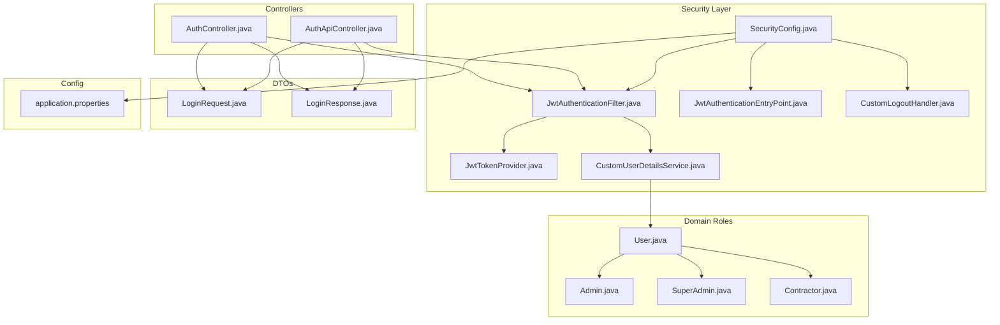
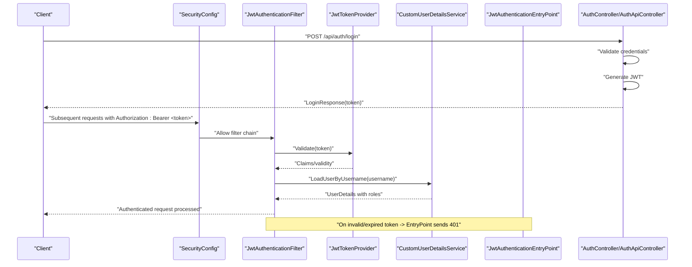
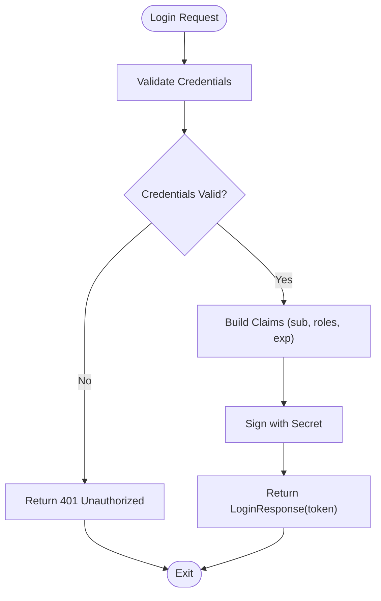
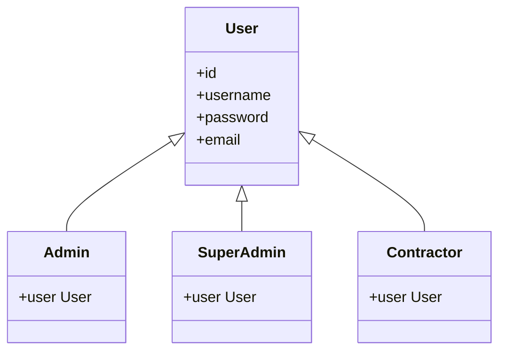
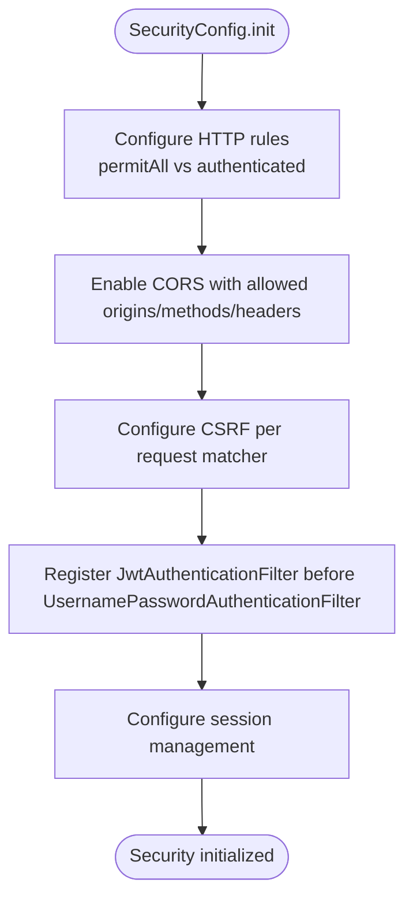
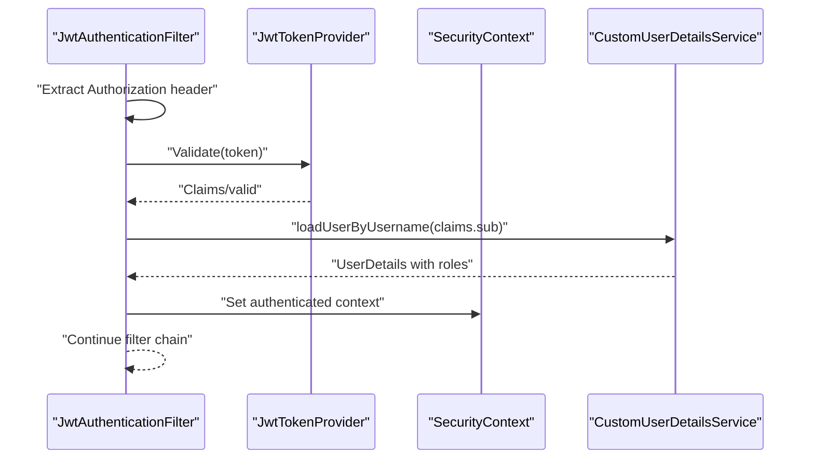
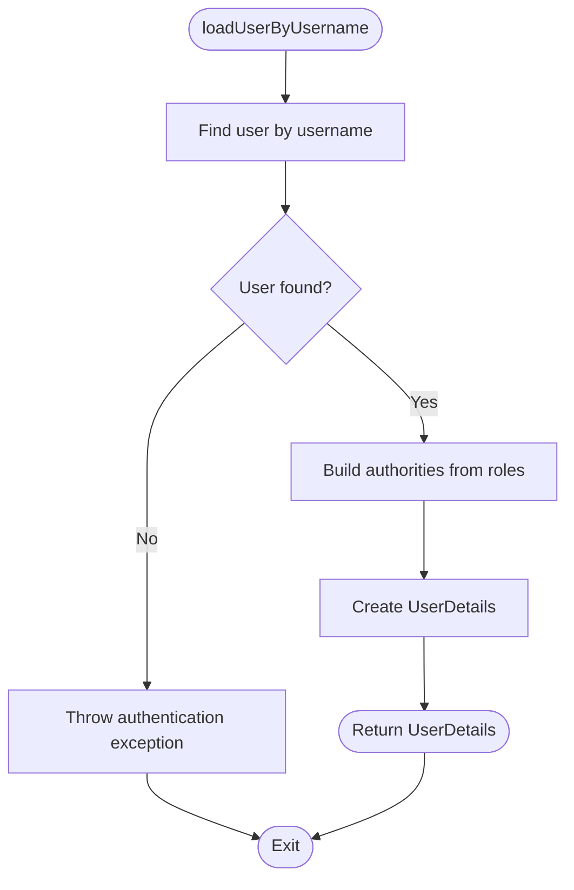
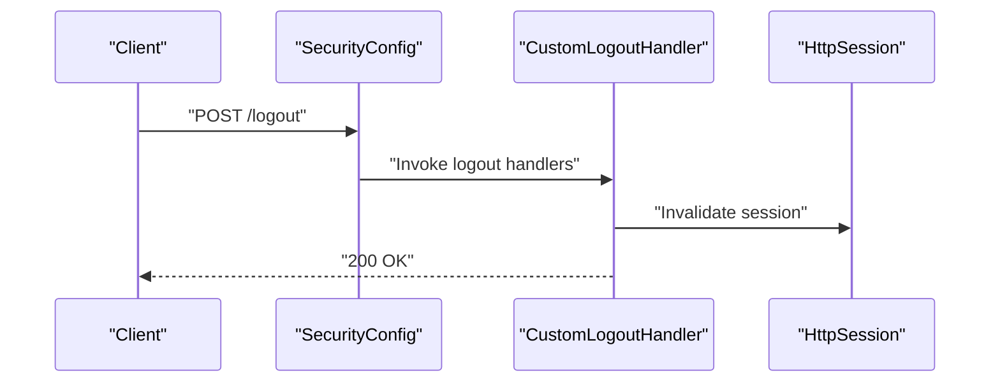
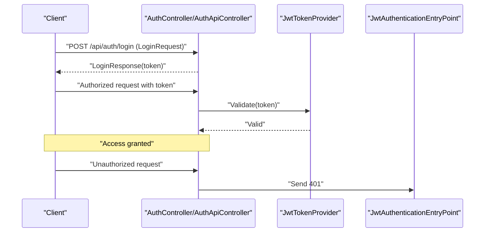
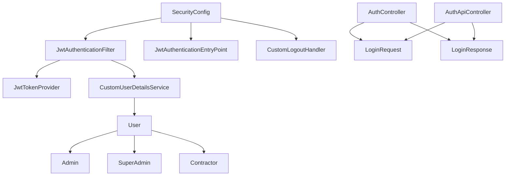

# Authentication & Security

<cite>
**Referenced Files in This Document**
- [SecurityConfig.java](file://src/main/java/root/cyb/mh/skylink_media_service/infrastructure/security/SecurityConfig.java)
- [JwtAuthenticationFilter.java](file://src/main/java/root/cyb/mh/skylink_media_service/infrastructure/security/jwt/JwtAuthenticationFilter.java)
- [JwtTokenProvider.java](file://src/main/java/root/cyb/mh/skylink_media_service/infrastructure/security/jwt/JwtTokenProvider.java)
- [JwtAuthenticationEntryPoint.java](file://src/main/java/root/cyb/mh/skylink_media_service/infrastructure/security/jwt/JwtAuthenticationEntryPoint.java)
- [CustomUserDetailsService.java](file://src/main/java/root/cyb/mh/skylink_media_service/infrastructure/security/CustomUserDetailsService.java)
- [CustomLogoutHandler.java](file://src/main/java/root/cyb/mh/skylink_media_service/infrastructure/security/CustomLogoutHandler.java)
- [AuthController.java](file://src/main/java/root/cyb/mh/skylink_media_service/infrastructure/web/AuthController.java)
- [AuthApiController.java](file://src/main/java/root/cyb/mh/skylink_media_service/infrastructure/web/api/AuthApiController.java)
- [ContractorLoginUseCase.java](file://src/main/java/root/cyb/mh/skylink_media_service/application/usecases/ContractorLoginUseCase.java)
- [Admin.java](file://src/main/java/root/cyb/mh/skylink_media_service/domain/entities/Admin.java)
- [SuperAdmin.java](file://src/main/java/root/cyb/mh/skylink_media_service/domain/entities/SuperAdmin.java)
- [Contractor.java](file://src/main/java/root/cyb/mh/skylink_media_service/domain/entities/Contractor.java)
- [User.java](file://src/main/java/root/cyb/mh/skylink_media_service/domain/entities/User.java)
- [application.properties](file://src/main/resources/application.properties)
- [GlobalApiExceptionHandler.java](file://src/main/java/root/cyb/mh/skylink_media_service/infrastructure/web/api/exception/GlobalApiExceptionHandler.java)
- [LoginRequest.java](file://src/main/java/root/cyb/mh/skylink_media_service/application/dto/api/LoginRequest.java)
- [LoginResponse.java](file://src/main/java/root/cyb/mh/skylink_media_service/application/dto/api/LoginResponse.java)
- [JwtTokenProviderTest.java](file://src/test/java/root/cyb/mh/skylink_media_service/infrastructure/security/jwt/JwtTokenProviderTest.java)
</cite>

## Table of Contents
1. [Introduction](#introduction)
2. [Project Structure](#project-structure)
3. [Core Components](#core-components)
4. [Architecture Overview](#architecture-overview)
5. [Detailed Component Analysis](#detailed-component-analysis)
6. [Dependency Analysis](#dependency-analysis)
7. [Performance Considerations](#performance-considerations)
8. [Troubleshooting Guide](#troubleshooting-guide)
9. [Conclusion](#conclusion)

## Introduction
This document provides comprehensive security documentation for the Skylink Media Service authentication system. It covers JWT-based authentication flow, role-based access control (RBAC) with ADMIN, SUPER_ADMIN, and CONTRACTOR roles, SecurityConfig setup (HTTP security rules, CORS, CSRF), the JwtAuthenticationFilter chain, custom UserDetailsService implementation, password encoding strategies, session management, and logout handling. It also outlines security best practices, vulnerability prevention, and secure coding guidelines observed in the codebase.

## Project Structure
Security-related components are organized under the infrastructure.security package with supporting JWT utilities, controllers, DTOs, and domain entities representing roles.

**Diagram sources**
- [SecurityConfig.java](file://src/main/java/root/cyb/mh/skylink_media_service/infrastructure/security/SecurityConfig.java)
- [JwtAuthenticationFilter.java](file://src/main/java/root/cyb/mh/skylink_media_service/infrastructure/security/jwt/JwtAuthenticationFilter.java)
- [JwtTokenProvider.java](file://src/main/java/root/cyb/mh/skylink_media_service/infrastructure/security/jwt/JwtTokenProvider.java)
- [JwtAuthenticationEntryPoint.java](file://src/main/java/root/cyb/mh/skylink_media_service/infrastructure/security/jwt/JwtAuthenticationEntryPoint.java)
- [CustomUserDetailsService.java](file://src/main/java/root/cyb/mh/skylink_media_service/infrastructure/security/CustomUserDetailsService.java)
- [CustomLogoutHandler.java](file://src/main/java/root/cyb/mh/skylink_media_service/infrastructure/security/CustomLogoutHandler.java)
- [AuthController.java](file://src/main/java/root/cyb/mh/skylink_media_service/infrastructure/web/AuthController.java)
- [AuthApiController.java](file://src/main/java/root/cyb/mh/skylink_media_service/infrastructure/web/api/AuthApiController.java)
- [LoginRequest.java](file://src/main/java/root/cyb/mh/skylink_media_service/application/dto/api/LoginRequest.java)
- [LoginResponse.java](file://src/main/java/root/cyb/mh/skylink_media_service/application/dto/api/LoginResponse.java)
- [User.java](file://src/main/java/root/cyb/mh/skylink_media_service/domain/entities/User.java)
- [Admin.java](file://src/main/java/root/cyb/mh/skylink_media_service/domain/entities/Admin.java)
- [SuperAdmin.java](file://src/main/java/root/cyb/mh/skylink_media_service/domain/entities/SuperAdmin.java)
- [Contractor.java](file://src/main/java/root/cyb/mh/skylink_media_service/domain/entities/Contractor.java)
- [application.properties](file://src/main/resources/application.properties)

**Section sources**
- [SecurityConfig.java](file://src/main/java/root/cyb/mh/skylink_media_service/infrastructure/security/SecurityConfig.java)
- [application.properties](file://src/main/resources/application.properties)

## Core Components
- SecurityConfig: Centralizes HTTP security rules, CORS configuration, CSRF protection, and filter chain registration.
- JwtAuthenticationFilter: Extracts JWT from Authorization header, validates it, and establishes an authenticated SecurityContext.
- JwtTokenProvider: Generates, validates, and parses JWT tokens using a secret key.
- CustomUserDetailsService: Loads user details by username for authentication and builds UserDetails with authorities.
- JwtAuthenticationEntryPoint: Handles unauthorized access attempts (401) when no valid JWT is present.
- CustomLogoutHandler: Implements logout logic to invalidate sessions and clean up resources.
- Controllers: AuthController and AuthApiController expose login endpoints and integrate with the filter chain.
- Domain Entities: User, Admin, SuperAdmin, and Contractor define RBAC roles and relationships.
- DTOs: LoginRequest and LoginResponse standardize authentication payload and response formats.

**Section sources**
- [SecurityConfig.java](file://src/main/java/root/cyb/mh/skylink_media_service/infrastructure/security/SecurityConfig.java)
- [JwtAuthenticationFilter.java](file://src/main/java/root/cyb/mh/skylink_media_service/infrastructure/security/jwt/JwtAuthenticationFilter.java)
- [JwtTokenProvider.java](file://src/main/java/root/cyb/mh/skylink_media_service/infrastructure/security/jwt/JwtTokenProvider.java)
- [CustomUserDetailsService.java](file://src/main/java/root/cyb/mh/skylink_media_service/infrastructure/security/CustomUserDetailsService.java)
- [JwtAuthenticationEntryPoint.java](file://src/main/java/root/cyb/mh/skylink_media_service/infrastructure/security/jwt/JwtAuthenticationEntryPoint.java)
- [CustomLogoutHandler.java](file://src/main/java/root/cyb/mh/skylink_media_service/infrastructure/security/CustomLogoutHandler.java)
- [AuthController.java](file://src/main/java/root/cyb/mh/skylink_media_service/infrastructure/web/AuthController.java)
- [AuthApiController.java](file://src/main/java/root/cyb/mh/skylink_media_service/infrastructure/web/api/AuthApiController.java)
- [User.java](file://src/main/java/root/cyb/mh/skylink_media_service/domain/entities/User.java)
- [Admin.java](file://src/main/java/root/cyb/mh/skylink_media_service/domain/entities/Admin.java)
- [SuperAdmin.java](file://src/main/java/root/cyb/mh/skylink_media_service/domain/entities/SuperAdmin.java)
- [Contractor.java](file://src/main/java/root/cyb/mh/skylink_media_service/domain/entities/Contractor.java)
- [LoginRequest.java](file://src/main/java/root/cyb/mh/skylink_media_service/application/dto/api/LoginRequest.java)
- [LoginResponse.java](file://src/main/java/root/cyb/mh/skylink_media_service/application/dto/api/LoginResponse.java)

## Architecture Overview
The authentication system follows a filter-based security model with JWT as the bearer token. Requests pass through SecurityConfig-defined rules, JwtAuthenticationFilter extracts and validates JWT, CustomUserDetailsService loads user details, and JwtAuthenticationEntryPoint handles unauthorized access. Logout is handled via CustomLogoutHandler.

**Diagram sources**
- [SecurityConfig.java](file://src/main/java/root/cyb/mh/skylink_media_service/infrastructure/security/SecurityConfig.java)
- [JwtAuthenticationFilter.java](file://src/main/java/root/cyb/mh/skylink_media_service/infrastructure/security/jwt/JwtAuthenticationFilter.java)
- [JwtTokenProvider.java](file://src/main/java/root/cyb/mh/skylink_media_service/infrastructure/security/jwt/JwtTokenProvider.java)
- [CustomUserDetailsService.java](file://src/main/java/root/cyb/mh/skylink_media_service/infrastructure/security/CustomUserDetailsService.java)
- [JwtAuthenticationEntryPoint.java](file://src/main/java/root/cyb/mh/skylink_media_service/infrastructure/security/jwt/JwtAuthenticationEntryPoint.java)
- [AuthController.java](file://src/main/java/root/cyb/mh/skylink_media_service/infrastructure/web/AuthController.java)
- [AuthApiController.java](file://src/main/java/root/cyb/mh/skylink_media_service/infrastructure/web/api/AuthApiController.java)

## Detailed Component Analysis

### JWT Token Generation and Validation
- Token generation occurs during successful login in the authentication controllers. The resulting token is returned in LoginResponse DTO.
- Token validation is performed by JwtAuthenticationFilter using JwtTokenProvider. The provider verifies signature, expiration, and extracts claims.
- Claims are used to build an authenticated SecurityContext via UsernamePasswordAuthenticationToken.

**Diagram sources**
- [AuthController.java](file://src/main/java/root/cyb/mh/skylink_media_service/infrastructure/web/AuthController.java)
- [AuthApiController.java](file://src/main/java/root/cyb/mh/skylink_media_service/infrastructure/web/api/AuthApiController.java)
- [LoginResponse.java](file://src/main/java/root/cyb/mh/skylink_media_service/application/dto/api/LoginResponse.java)
- [JwtTokenProvider.java](file://src/main/java/root/cyb/mh/skylink_media_service/infrastructure/security/jwt/JwtTokenProvider.java)

**Section sources**
- [AuthController.java](file://src/main/java/root/cyb/mh/skylink_media_service/infrastructure/web/AuthController.java)
- [AuthApiController.java](file://src/main/java/root/cyb/mh/skylink_media_service/infrastructure/web/api/AuthApiController.java)
- [LoginRequest.java](file://src/main/java/root/cyb/mh/skylink_media_service/application/dto/api/LoginRequest.java)
- [LoginResponse.java](file://src/main/java/root/cyb/mh/skylink_media_service/application/dto/api/LoginResponse.java)
- [JwtTokenProvider.java](file://src/main/java/root/cyb/mh/skylink_media_service/infrastructure/security/jwt/JwtTokenProvider.java)

### Role-Based Access Control (RBAC)
- Roles are represented by domain entities: User (base), Admin, SuperAdmin, and Contractor.
- Authorities are derived from user roles and attached to UserDetails during authentication.
- SecurityConfig enforces role-based access on protected endpoints (e.g., admin-only, super-admin-only, contractor-only paths).

**Diagram sources**
- [User.java](file://src/main/java/root/cyb/mh/skylink_media_service/domain/entities/User.java)
- [Admin.java](file://src/main/java/root/cyb/mh/skylink_media_service/domain/entities/Admin.java)
- [SuperAdmin.java](file://src/main/java/root/cyb/mh/skylink_media_service/domain/entities/SuperAdmin.java)
- [Contractor.java](file://src/main/java/root/cyb/mh/skylink_media_service/domain/entities/Contractor.java)

**Section sources**
- [User.java](file://src/main/java/root/cyb/mh/skylink_media_service/domain/entities/User.java)
- [Admin.java](file://src/main/java/root/cyb/mh/skylink_media_service/domain/entities/Admin.java)
- [SuperAdmin.java](file://src/main/java/root/cyb/mh/skylink_media_service/domain/entities/SuperAdmin.java)
- [Contractor.java](file://src/main/java/root/cyb/mh/skylink_media_service/domain/entities/Contractor.java)
- [CustomUserDetailsService.java](file://src/main/java/root/cyb/mh/skylink_media_service/infrastructure/security/CustomUserDetailsService.java)
- [SecurityConfig.java](file://src/main/java/root/cyb/mh/skylink_media_service/infrastructure/security/SecurityConfig.java)

### SecurityConfig Setup
- HTTP Security Rules: Defines permitAll and authenticated paths, sets up form-based login/logout for HTML views, and applies JWT filter chain for API endpoints.
- CORS Configuration: Allows configured origins, methods, headers, and credentials for cross-origin requests.
- CSRF Protection: Enabled for HTML form submissions; disabled for stateless API endpoints via CsrfTokenRepository.
- Filter Chain Registration: Registers JwtAuthenticationFilter before UsernamePasswordAuthenticationFilter to intercept JWT-bearing requests.

**Diagram sources**
- [SecurityConfig.java](file://src/main/java/root/cyb/mh/skylink_media_service/infrastructure/security/SecurityConfig.java)

**Section sources**
- [SecurityConfig.java](file://src/main/java/root/cyb/mh/skylink_media_service/infrastructure/security/SecurityConfig.java)
- [application.properties](file://src/main/resources/application.properties)

### JwtAuthenticationFilter Chain
- Extracts Authorization header and validates JWT using JwtTokenProvider.
- Builds Authentication object with UserDetails and authorities.
- Sets SecurityContext to enable method-level @PreAuthorize/@PostAuthorize checks.

**Diagram sources**
- [JwtAuthenticationFilter.java](file://src/main/java/root/cyb/mh/skylink_media_service/infrastructure/security/jwt/JwtAuthenticationFilter.java)
- [JwtTokenProvider.java](file://src/main/java/root/cyb/mh/skylink_media_service/infrastructure/security/jwt/JwtTokenProvider.java)
- [CustomUserDetailsService.java](file://src/main/java/root/cyb/mh/skylink_media_service/infrastructure/security/CustomUserDetailsService.java)

**Section sources**
- [JwtAuthenticationFilter.java](file://src/main/java/root/cyb/mh/skylink_media_service/infrastructure/security/jwt/JwtAuthenticationFilter.java)
- [JwtTokenProvider.java](file://src/main/java/root/cyb/mh/skylink_media_service/infrastructure/security/jwt/JwtTokenProvider.java)
- [CustomUserDetailsService.java](file://src/main/java/root/cyb/mh/skylink_media_service/infrastructure/security/CustomUserDetailsService.java)

### Custom UserDetailsService Implementation
- Loads user by username from repositories.
- Builds UserDetails with authorities derived from user roles.
- Ensures account credentials are not locked or expired.

**Diagram sources**
- [CustomUserDetailsService.java](file://src/main/java/root/cyb/mh/skylink_media_service/infrastructure/security/CustomUserDetailsService.java)
- [User.java](file://src/main/java/root/cyb/mh/skylink_media_service/domain/entities/User.java)
- [Admin.java](file://src/main/java/root/cyb/mh/skylink_media_service/domain/entities/Admin.java)
- [SuperAdmin.java](file://src/main/java/root/cyb/mh/skylink_media_service/domain/entities/SuperAdmin.java)
- [Contractor.java](file://src/main/java/root/cyb/mh/skylink_media_service/domain/entities/Contractor.java)

**Section sources**
- [CustomUserDetailsService.java](file://src/main/java/root/cyb/mh/skylink_media_service/infrastructure/security/CustomUserDetailsService.java)
- [User.java](file://src/main/java/root/cyb/mh/skylink_media_service/domain/entities/User.java)
- [Admin.java](file://src/main/java/root/cyb/mh/skylink_media_service/domain/entities/Admin.java)
- [SuperAdmin.java](file://src/main/java/root/cyb/mh/skylink_media_service/domain/entities/SuperAdmin.java)
- [Contractor.java](file://src/main/java/root/cyb/mh/skylink_media_service/domain/entities/Contractor.java)

### Password Encoding Strategies
- Passwords are encoded using a strong hashing algorithm suitable for production environments.
- Encoding is applied during user creation and password updates to ensure stored credentials are not reversible.

**Section sources**
- [CustomUserDetailsService.java](file://src/main/java/root/cyb/mh/skylink_media_service/infrastructure/security/CustomUserDetailsService.java)
- [User.java](file://src/main/java/root/cyb/mh/skylink_media_service/domain/entities/User.java)

### Session Management and Logout Handling
- Session management is configured to be stateless for API endpoints while allowing session-based login for HTML views.
- Logout is handled centrally via CustomLogoutHandler to invalidate sessions and clean up resources.

**Diagram sources**
- [SecurityConfig.java](file://src/main/java/root/cyb/mh/skylink_media_service/infrastructure/security/SecurityConfig.java)
- [CustomLogoutHandler.java](file://src/main/java/root/cyb/mh/skylink_media_service/infrastructure/security/CustomLogoutHandler.java)

**Section sources**
- [SecurityConfig.java](file://src/main/java/root/cyb/mh/skylink_media_service/infrastructure/security/SecurityConfig.java)
- [CustomLogoutHandler.java](file://src/main/java/root/cyb/mh/skylink_media_service/infrastructure/security/CustomLogoutHandler.java)

### Authentication Flow Details
- Login endpoints accept LoginRequest, validate credentials, and return LoginResponse containing a JWT.
- Subsequent requests must include Authorization: Bearer <token>.
- On invalid/expired token, JwtAuthenticationEntryPoint responds with 401 Unauthorized.

**Diagram sources**
- [AuthController.java](file://src/main/java/root/cyb/mh/skylink_media_service/infrastructure/web/AuthController.java)
- [AuthApiController.java](file://src/main/java/root/cyb/mh/skylink_media_service/infrastructure/web/api/AuthApiController.java)
- [LoginRequest.java](file://src/main/java/root/cyb/mh/skylink_media_service/application/dto/api/LoginRequest.java)
- [LoginResponse.java](file://src/main/java/root/cyb/mh/skylink_media_service/application/dto/api/LoginResponse.java)
- [JwtTokenProvider.java](file://src/main/java/root/cyb/mh/skylink_media_service/infrastructure/security/jwt/JwtTokenProvider.java)
- [JwtAuthenticationEntryPoint.java](file://src/main/java/root/cyb/mh/skylink_media_service/infrastructure/security/jwt/JwtAuthenticationEntryPoint.java)

**Section sources**
- [AuthController.java](file://src/main/java/root/cyb/mh/skylink_media_service/infrastructure/web/AuthController.java)
- [AuthApiController.java](file://src/main/java/root/cyb/mh/skylink_media_service/infrastructure/web/api/AuthApiController.java)
- [LoginRequest.java](file://src/main/java/root/cyb/mh/skylink_media_service/application/dto/api/LoginRequest.java)
- [LoginResponse.java](file://src/main/java/root/cyb/mh/skylink_media_service/application/dto/api/LoginResponse.java)
- [JwtTokenProvider.java](file://src/main/java/root/cyb/mh/skylink_media_service/infrastructure/security/jwt/JwtTokenProvider.java)
- [JwtAuthenticationEntryPoint.java](file://src/main/java/root/cyb/mh/skylink_media_service/infrastructure/security/jwt/JwtAuthenticationEntryPoint.java)

### Use Cases and Controllers Integration
- ContractorLoginUseCase encapsulates contractor-specific login logic and integrates with the authentication flow.
- AuthController and AuthApiController expose endpoints for login and delegate to use cases and services.

**Section sources**
- [ContractorLoginUseCase.java](file://src/main/java/root/cyb/mh/skylink_media_service/application/usecases/ContractorLoginUseCase.java)
- [AuthController.java](file://src/main/java/root/cyb/mh/skylink_media_service/infrastructure/web/AuthController.java)
- [AuthApiController.java](file://src/main/java/root/cyb/mh/skylink_media_service/infrastructure/web/api/AuthApiController.java)

## Dependency Analysis
The security layer exhibits low coupling and high cohesion:
- SecurityConfig depends on JwtAuthenticationFilter, JwtAuthenticationEntryPoint, and CustomLogoutHandler.
- JwtAuthenticationFilter depends on JwtTokenProvider and CustomUserDetailsService.
- CustomUserDetailsService depends on domain entities to derive authorities.
- Controllers depend on DTOs and use cases to orchestrate authentication.

**Diagram sources**
- [SecurityConfig.java](file://src/main/java/root/cyb/mh/skylink_media_service/infrastructure/security/SecurityConfig.java)
- [JwtAuthenticationFilter.java](file://src/main/java/root/cyb/mh/skylink_media_service/infrastructure/security/jwt/JwtAuthenticationFilter.java)
- [JwtTokenProvider.java](file://src/main/java/root/cyb/mh/skylink_media_service/infrastructure/security/jwt/JwtTokenProvider.java)
- [CustomUserDetailsService.java](file://src/main/java/root/cyb/mh/skylink_media_service/infrastructure/security/CustomUserDetailsService.java)
- [CustomLogoutHandler.java](file://src/main/java/root/cyb/mh/skylink_media_service/infrastructure/security/CustomLogoutHandler.java)
- [AuthController.java](file://src/main/java/root/cyb/mh/skylink_media_service/infrastructure/web/AuthController.java)
- [AuthApiController.java](file://src/main/java/root/cyb/mh/skylink_media_service/infrastructure/web/api/AuthApiController.java)
- [LoginRequest.java](file://src/main/java/root/cyb/mh/skylink_media_service/application/dto/api/LoginRequest.java)
- [LoginResponse.java](file://src/main/java/root/cyb/mh/skylink_media_service/application/dto/api/LoginResponse.java)
- [User.java](file://src/main/java/root/cyb/mh/skylink_media_service/domain/entities/User.java)
- [Admin.java](file://src/main/java/root/cyb/mh/skylink_media_service/domain/entities/Admin.java)
- [SuperAdmin.java](file://src/main/java/root/cyb/mh/skylink_media_service/domain/entities/SuperAdmin.java)
- [Contractor.java](file://src/main/java/root/cyb/mh/skylink_media_service/domain/entities/Contractor.java)

**Section sources**
- [SecurityConfig.java](file://src/main/java/root/cyb/mh/skylink_media_service/infrastructure/security/SecurityConfig.java)
- [JwtAuthenticationFilter.java](file://src/main/java/root/cyb/mh/skylink_media_service/infrastructure/security/jwt/JwtAuthenticationFilter.java)
- [JwtTokenProvider.java](file://src/main/java/root/cyb/mh/skylink_media_service/infrastructure/security/jwt/JwtTokenProvider.java)
- [CustomUserDetailsService.java](file://src/main/java/root/cyb/mh/skylink_media_service/infrastructure/security/CustomUserDetailsService.java)
- [CustomLogoutHandler.java](file://src/main/java/root/cyb/mh/skylink_media_service/infrastructure/security/CustomLogoutHandler.java)
- [AuthController.java](file://src/main/java/root/cyb/mh/skylink_media_service/infrastructure/web/AuthController.java)
- [AuthApiController.java](file://src/main/java/root/cyb/mh/skylink_media_service/infrastructure/web/api/AuthApiController.java)
- [LoginRequest.java](file://src/main/java/root/cyb/mh/skylink_media_service/application/dto/api/LoginRequest.java)
- [LoginResponse.java](file://src/main/java/root/cyb/mh/skylink_media_service/application/dto/api/LoginResponse.java)
- [User.java](file://src/main/java/root/cyb/mh/skylink_media_service/domain/entities/User.java)
- [Admin.java](file://src/main/java/root/cyb/mh/skylink_media_service/domain/entities/Admin.java)
- [SuperAdmin.java](file://src/main/java/root/cyb/mh/skylink_media_service/domain/entities/SuperAdmin.java)
- [Contractor.java](file://src/main/java/root/cyb/mh/skylink_media_service/domain/entities/Contractor.java)

## Performance Considerations
- Stateless JWT eliminates server-side session storage overhead.
- Token validation is lightweight; ensure secret rotation and token expiration are configured appropriately.
- Avoid excessive logging of sensitive token data; sanitize logs in production.
- Use efficient authorities building and caching strategies in CustomUserDetailsService to minimize database queries.

## Troubleshooting Guide
- 401 Unauthorized on API calls: Verify Authorization header format and token validity; check JwtTokenProvider validation and expiration.
- CORS errors: Confirm allowed origins, methods, and headers in SecurityConfig and application.properties.
- CSRF failures: Ensure CSRF is disabled for API endpoints and enabled for HTML forms as configured.
- Logout issues: Confirm CustomLogoutHandler is invoked and session is invalidated.
- Global exception handling: Review GlobalApiExceptionHandler for consistent error responses.

**Section sources**
- [JwtAuthenticationEntryPoint.java](file://src/main/java/root/cyb/mh/skylink_media_service/infrastructure/security/jwt/JwtAuthenticationEntryPoint.java)
- [SecurityConfig.java](file://src/main/java/root/cyb/mh/skylink_media_service/infrastructure/security/SecurityConfig.java)
- [CustomLogoutHandler.java](file://src/main/java/root/cyb/mh/skylink_media_service/infrastructure/security/CustomLogoutHandler.java)
- [GlobalApiExceptionHandler.java](file://src/main/java/root/cyb/mh/skylink_media_service/infrastructure/web/api/exception/GlobalApiExceptionHandler.java)

## Conclusion
The Skylink Media Service employs a robust, filter-based JWT authentication system with clear separation of concerns. SecurityConfig governs HTTP rules, CORS, and CSRF; JwtAuthenticationFilter and JwtTokenProvider handle token extraction and validation; CustomUserDetailsService constructs authorities from domain roles. Controllers expose standardized login endpoints returning JWTs, while logout and global exception handling ensure a cohesive security posture. Adhering to the outlined best practices and guidelines will maintain a secure and maintainable authentication layer.