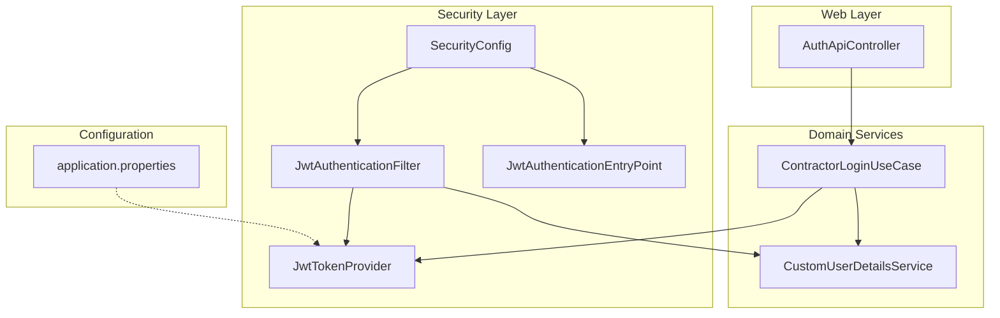
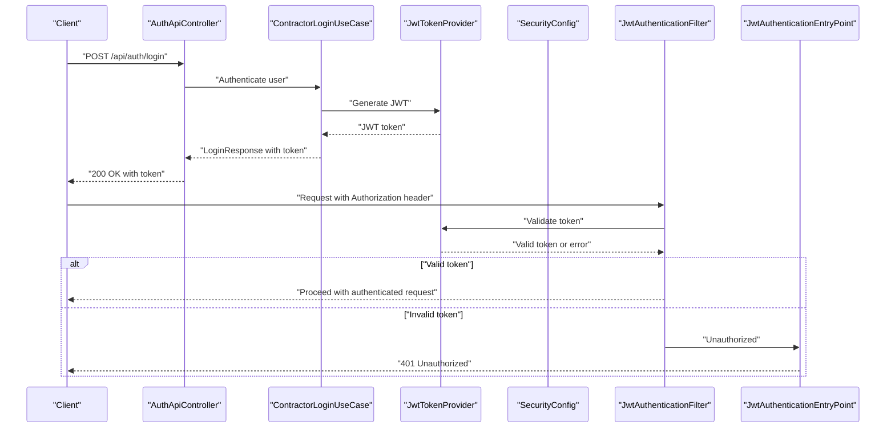
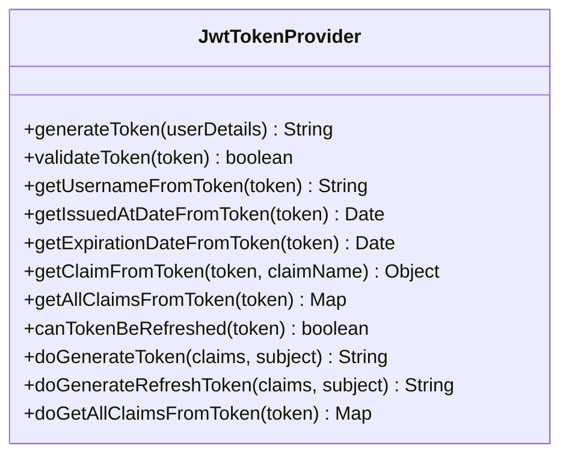
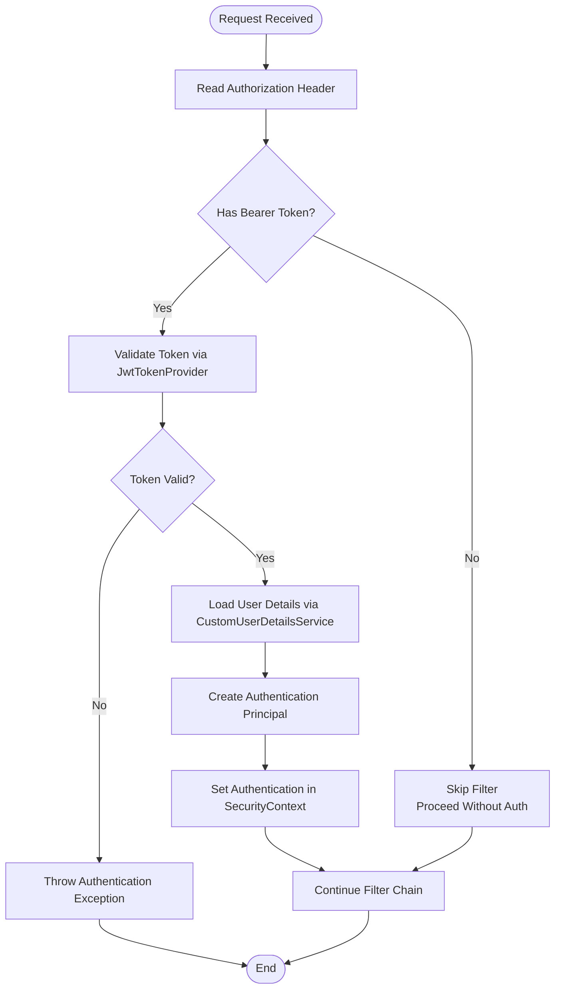
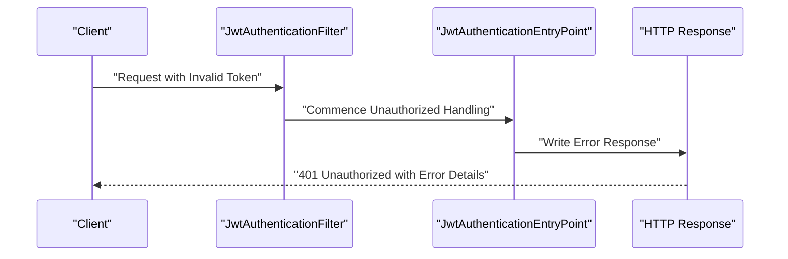
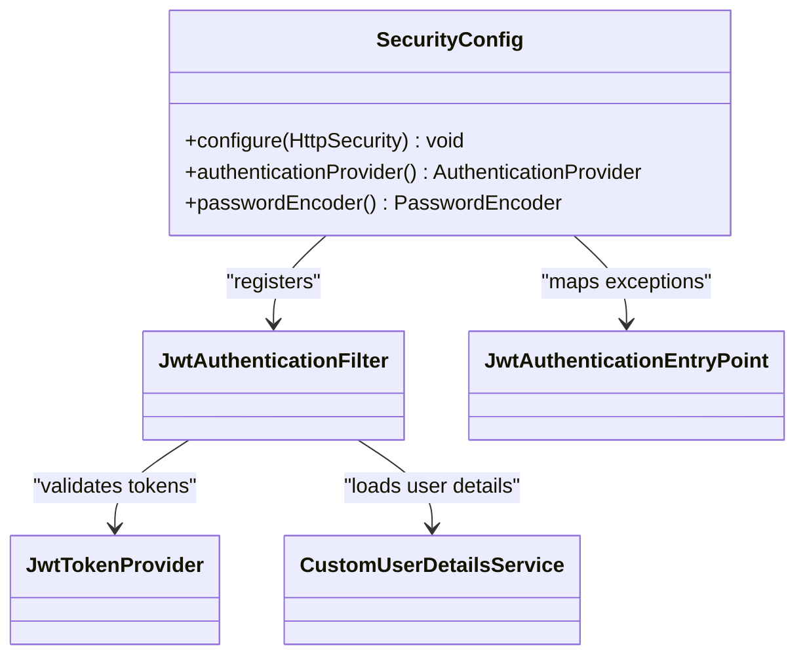
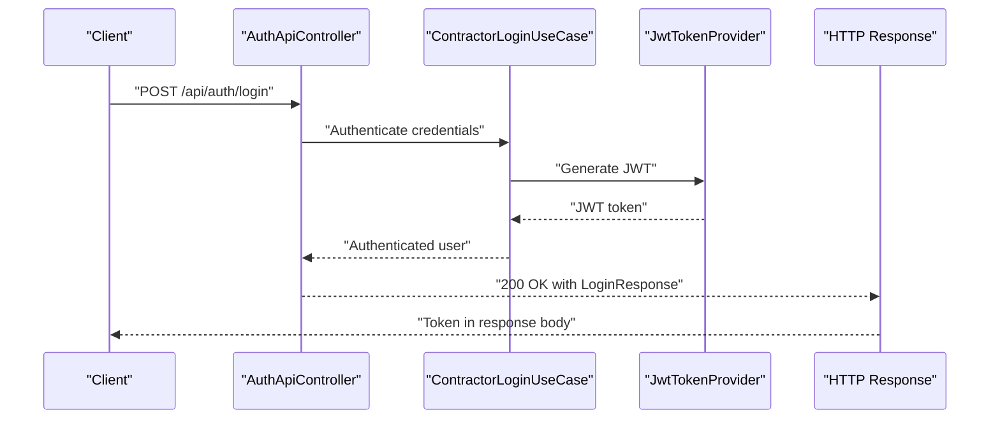
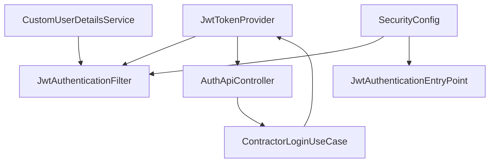

# JWT Authentication Implementation

<cite>
**Referenced Files in This Document**
- [JwtTokenProvider.java](file://src/main/java/root/cyb/mh/skylink_media_service/infrastructure/security/jwt/JwtTokenProvider.java)
- [JwtAuthenticationFilter.java](file://src/main/java/root/cyb/mh/skylink_media_service/infrastructure/security/jwt/JwtAuthenticationFilter.java)
- [JwtAuthenticationEntryPoint.java](file://src/main/java/root/cyb/mh/skylink_media_service/infrastructure/security/jwt/JwtAuthenticationEntryPoint.java)
- [SecurityConfig.java](file://src/main/java/root/cyb/mh/skylink_media_service/infrastructure/security/SecurityConfig.java)
- [AuthApiController.java](file://src/main/java/root/cyb/mh/skylink_media_service/infrastructure/web/api/AuthApiController.java)
- [application.properties](file://src/main/resources/application.properties)
- [LoginRequest.java](file://src/main/java/root/cyb/mh/skylink_media_service/application/dto/api/LoginRequest.java)
- [LoginResponse.java](file://src/main/java/root/cyb/mh/skylink_media_service/application/dto/api/LoginResponse.java)
- [ErrorResponse.java](file://src/main/java/root/cyb/mh/skylink_media_service/application/dto/api/ErrorResponse.java)
- [ContractorLoginUseCase.java](file://src/main/java/root/cyb/mh/skylink_media_service/application/usecases/ContractorLoginUseCase.java)
- [CustomUserDetailsService.java](file://src/main/java/root/cyb/mh/skylink_media_service/infrastructure/security/CustomUserDetailsService.java)
- [JwtTokenProviderTest.java](file://src/test/java/root/cyb/mh/skylink_media_service/infrastructure/security/jwt/JwtTokenProviderTest.java)
</cite>

## Table of Contents
1. [Introduction](#introduction)
2. [Project Structure](#project-structure)
3. [Core Components](#core-components)
4. [Architecture Overview](#architecture-overview)
5. [Detailed Component Analysis](#detailed-component-analysis)
6. [Dependency Analysis](#dependency-analysis)
7. [Performance Considerations](#performance-considerations)
8. [Troubleshooting Guide](#troubleshooting-guide)
9. [Conclusion](#conclusion)

## Introduction
This document provides comprehensive coverage of the JWT authentication implementation in the Skylink Media Service backend. It explains the complete authentication flow, focusing on token generation, validation, and refresh mechanisms via the JwtTokenProvider, the request processing pipeline handled by JwtAuthenticationFilter, and the unauthorized response handling performed by JwtAuthenticationEntryPoint. The documentation also covers token lifecycle management, security considerations, and integration with Spring Security’s authentication system. Practical examples of token usage in API requests and troubleshooting guidance for common JWT-related issues are included.

## Project Structure
The JWT authentication implementation resides in the security module under infrastructure/security. The key components are:
- JwtTokenProvider: responsible for generating, validating, and refreshing JWT tokens
- JwtAuthenticationFilter: extracts tokens from incoming requests and authenticates principals
- JwtAuthenticationEntryPoint: handles unauthorized responses for protected API endpoints
- SecurityConfig: integrates filters and entry points into Spring Security
- AuthApiController: exposes login/logout endpoints that produce JWT tokens
- Supporting DTOs for login requests/responses and error handling

**Diagram sources**
- [JwtTokenProvider.java](file://src/main/java/root/cyb/mh/skylink_media_service/infrastructure/security/jwt/JwtTokenProvider.java)
- [JwtAuthenticationFilter.java](file://src/main/java/root/cyb/mh/skylink_media_service/infrastructure/security/jwt/JwtAuthenticationFilter.java)
- [JwtAuthenticationEntryPoint.java](file://src/main/java/root/cyb/mh/skylink_media_service/infrastructure/security/jwt/JwtAuthenticationEntryPoint.java)
- [SecurityConfig.java](file://src/main/java/root/cyb/mh/skylink_media_service/infrastructure/security/SecurityConfig.java)
- [AuthApiController.java](file://src/main/java/root/cyb/mh/skylink_media_service/infrastructure/web/api/AuthApiController.java)
- [application.properties](file://src/main/resources/application.properties)
- [CustomUserDetailsService.java](file://src/main/java/root/cyb/mh/skylink_media_service/infrastructure/security/CustomUserDetailsService.java)
- [ContractorLoginUseCase.java](file://src/main/java/root/cyb/mh/skylink_media_service/application/usecases/ContractorLoginUseCase.java)

**Section sources**
- [SecurityConfig.java](file://src/main/java/root/cyb/mh/skylink_media_service/infrastructure/security/SecurityConfig.java)
- [application.properties](file://src/main/resources/application.properties)

## Core Components
This section outlines the primary JWT components and their roles in the authentication flow.

- JwtTokenProvider
  - Generates JWT tokens with configured issuer, expiration, and signing key
  - Validates tokens and verifies signatures
  - Provides token refresh capabilities
  - Manages token parsing and payload extraction
  - Integrates with application properties for configuration

- JwtAuthenticationFilter
  - Extracts Authorization header tokens
  - Validates tokens and builds authentication principals
  - Integrates with Spring Security’s filter chain
  - Delegates user details resolution to CustomUserDetailsService

- JwtAuthenticationEntryPoint
  - Handles unauthorized responses for protected API endpoints
  - Returns standardized error responses for missing or invalid tokens

- SecurityConfig
  - Registers JwtAuthenticationFilter in the filter chain
  - Configures HTTP security rules and exception handling
  - Integrates with Spring Security’s WebSecurityConfigurerAdapter

- AuthApiController
  - Exposes login endpoint returning JWT tokens
  - Uses ContractorLoginUseCase for authentication logic
  - Returns LoginResponse DTO containing token information

**Section sources**
- [JwtTokenProvider.java](file://src/main/java/root/cyb/mh/skylink_media_service/infrastructure/security/jwt/JwtTokenProvider.java)
- [JwtAuthenticationFilter.java](file://src/main/java/root/cyb/mh/skylink_media_service/infrastructure/security/jwt/JwtAuthenticationFilter.java)
- [JwtAuthenticationEntryPoint.java](file://src/main/java/root/cyb/mh/skylink_media_service/infrastructure/security/jwt/JwtAuthenticationEntryPoint.java)
- [SecurityConfig.java](file://src/main/java/root/cyb/mh/skylink_media_service/infrastructure/security/SecurityConfig.java)
- [AuthApiController.java](file://src/main/java/root/cyb/mh/skylink_media_service/infrastructure/web/api/AuthApiController.java)

## Architecture Overview
The JWT authentication architecture integrates tightly with Spring Security. The flow begins with a login request processed by AuthApiController, which delegates to ContractorLoginUseCase and ultimately to JwtTokenProvider to issue a JWT. Subsequent requests are intercepted by JwtAuthenticationFilter, which validates the token and establishes an authenticated session. Unauthorized access attempts trigger JwtAuthenticationEntryPoint to return appropriate error responses.

**Diagram sources**
- [AuthApiController.java](file://src/main/java/root/cyb/mh/skylink_media_service/infrastructure/web/api/AuthApiController.java)
- [ContractorLoginUseCase.java](file://src/main/java/root/cyb/mh/skylink_media_service/application/usecases/ContractorLoginUseCase.java)
- [JwtTokenProvider.java](file://src/main/java/root/cyb/mh/skylink_media_service/infrastructure/security/jwt/JwtTokenProvider.java)
- [SecurityConfig.java](file://src/main/java/root/cyb/mh/skylink_media_service/infrastructure/security/SecurityConfig.java)
- [JwtAuthenticationFilter.java](file://src/main/java/root/cyb/mh/skylink_media_service/infrastructure/security/jwt/JwtAuthenticationFilter.java)
- [JwtAuthenticationEntryPoint.java](file://src/main/java/root/cyb/mh/skylink_media_service/infrastructure/security/jwt/JwtAuthenticationEntryPoint.java)

## Detailed Component Analysis

### JwtTokenProvider
JwtTokenProvider encapsulates all token-related operations:
- Token Generation
  - Builds JWT with configured issuer and expiration
  - Signs tokens using a secret key from application properties
  - Encodes user-specific claims (e.g., user ID, roles)
- Token Validation
  - Verifies signatures and expiration
  - Parses claims and extracts user identity
- Token Refresh
  - Implements refresh logic to extend token validity
- Payload Structure
  - Standard JWT claims: issuer, subject, issued-at, expiration
  - Custom claims for user identity and roles
- Expiration Handling
  - Enforces token lifetime policies
  - Prevents replay attacks via expiration checks
- Signature Verification
  - Uses symmetric signing for compact tokens
  - Ensures integrity and authenticity

**Diagram sources**
- [JwtTokenProvider.java](file://src/main/java/root/cyb/mh/skylink_media_service/infrastructure/security/jwt/JwtTokenProvider.java)

**Section sources**
- [JwtTokenProvider.java](file://src/main/java/root/cyb/mh/skylink_media_service/infrastructure/security/jwt/JwtTokenProvider.java)
- [application.properties](file://src/main/resources/application.properties)

### JwtAuthenticationFilter
JwtAuthenticationFilter processes incoming requests:
- Request Processing Pipeline
  - Extracts Authorization header
  - Validates token via JwtTokenProvider
  - Creates authentication principal using CustomUserDetailsService
  - Sets authentication in SecurityContext
- Token Extraction from Headers
  - Reads Authorization header and expects Bearer token scheme
  - Handles malformed or missing tokens gracefully
- Authentication Principal Creation
  - Loads user details by username extracted from token
  - Constructs UsernamePasswordAuthenticationToken
  - Establishes authenticated session for the request

**Diagram sources**
- [JwtAuthenticationFilter.java](file://src/main/java/root/cyb/mh/skylink_media_service/infrastructure/security/jwt/JwtAuthenticationFilter.java)
- [JwtTokenProvider.java](file://src/main/java/root/cyb/mh/skylink_media_service/infrastructure/security/jwt/JwtTokenProvider.java)
- [CustomUserDetailsService.java](file://src/main/java/root/cyb/mh/skylink_media_service/infrastructure/security/CustomUserDetailsService.java)

**Section sources**
- [JwtAuthenticationFilter.java](file://src/main/java/root/cyb/mh/skylink_media_service/infrastructure/security/jwt/JwtAuthenticationFilter.java)
- [JwtTokenProvider.java](file://src/main/java/root/cyb/mh/skylink_media_service/infrastructure/security/jwt/JwtTokenProvider.java)
- [CustomUserDetailsService.java](file://src/main/java/root/cyb/mh/skylink_media_service/infrastructure/security/CustomUserDetailsService.java)

### JwtAuthenticationEntryPoint
JwtAuthenticationEntryPoint manages unauthorized responses:
- Unauthorized Response Handling
  - Intercepts authentication exceptions for API endpoints
  - Returns standardized error responses with appropriate status codes
  - Ensures consistent error messaging across the API

**Diagram sources**
- [JwtAuthenticationEntryPoint.java](file://src/main/java/root/cyb/mh/skylink_media_service/infrastructure/security/jwt/JwtAuthenticationEntryPoint.java)

**Section sources**
- [JwtAuthenticationEntryPoint.java](file://src/main/java/root/cyb/mh/skylink_media_service/infrastructure/security/jwt/JwtAuthenticationEntryPoint.java)

### SecurityConfig Integration
SecurityConfig integrates JWT components into Spring Security:
- Filter Registration
  - Registers JwtAuthenticationFilter in the filter chain
  - Defines request patterns to intercept
- HTTP Security Rules
  - Configures permitAll for login endpoints
  - Secures API endpoints requiring authentication
- Exception Handling
  - Maps unauthorized exceptions to JwtAuthenticationEntryPoint
  - Ensures consistent error responses

**Diagram sources**
- [SecurityConfig.java](file://src/main/java/root/cyb/mh/skylink_media_service/infrastructure/security/SecurityConfig.java)
- [JwtAuthenticationFilter.java](file://src/main/java/root/cyb/mh/skylink_media_service/infrastructure/security/jwt/JwtAuthenticationFilter.java)
- [JwtAuthenticationEntryPoint.java](file://src/main/java/root/cyb/mh/skylink_media_service/infrastructure/security/jwt/JwtAuthenticationEntryPoint.java)
- [JwtTokenProvider.java](file://src/main/java/root/cyb/mh/skylink_media_service/infrastructure/security/jwt/JwtTokenProvider.java)
- [CustomUserDetailsService.java](file://src/main/java/root/cyb/mh/skylink_media_service/infrastructure/security/CustomUserDetailsService.java)

**Section sources**
- [SecurityConfig.java](file://src/main/java/root/cyb/mh/skylink_media_service/infrastructure/security/SecurityConfig.java)

### AuthApiController and Login Flow
AuthApiController coordinates the login process:
- Login Endpoint
  - Accepts LoginRequest DTO with credentials
  - Delegates to ContractorLoginUseCase for authentication
  - Returns LoginResponse DTO containing JWT token
- Integration with JwtTokenProvider
  - Uses provider to generate tokens after successful authentication
- Error Handling
  - Returns ErrorResponse for authentication failures

**Diagram sources**
- [AuthApiController.java](file://src/main/java/root/cyb/mh/skylink_media_service/infrastructure/web/api/AuthApiController.java)
- [ContractorLoginUseCase.java](file://src/main/java/root/cyb/mh/skylink_media_service/application/usecases/ContractorLoginUseCase.java)
- [JwtTokenProvider.java](file://src/main/java/root/cyb/mh/skylink_media_service/infrastructure/security/jwt/JwtTokenProvider.java)
- [LoginRequest.java](file://src/main/java/root/cyb/mh/skylink_media_service/application/dto/api/LoginRequest.java)
- [LoginResponse.java](file://src/main/java/root/cyb/mh/skylink_media_service/application/dto/api/LoginResponse.java)
- [ErrorResponse.java](file://src/main/java/root/cyb/mh/skylink_media_service/application/dto/api/ErrorResponse.java)

**Section sources**
- [AuthApiController.java](file://src/main/java/root/cyb/mh/skylink_media_service/infrastructure/web/api/AuthApiController.java)
- [ContractorLoginUseCase.java](file://src/main/java/root/cyb/mh/skylink_media_service/application/usecases/ContractorLoginUseCase.java)
- [LoginRequest.java](file://src/main/java/root/cyb/mh/skylink_media_service/application/dto/api/LoginRequest.java)
- [LoginResponse.java](file://src/main/java/root/cyb/mh/skylink_media_service/application/dto/api/LoginResponse.java)
- [ErrorResponse.java](file://src/main/java/root/cyb/mh/skylink_media_service/application/dto/api/ErrorResponse.java)

## Dependency Analysis
The JWT authentication system exhibits low coupling and high cohesion among components:
- JwtTokenProvider is central and consumed by JwtAuthenticationFilter and AuthApiController
- JwtAuthenticationFilter depends on JwtTokenProvider and CustomUserDetailsService
- SecurityConfig orchestrates filter registration and exception mapping
- AuthApiController depends on ContractorLoginUseCase and JwtTokenProvider
- No circular dependencies observed

**Diagram sources**
- [JwtTokenProvider.java](file://src/main/java/root/cyb/mh/skylink_media_service/infrastructure/security/jwt/JwtTokenProvider.java)
- [JwtAuthenticationFilter.java](file://src/main/java/root/cyb/mh/skylink_media_service/infrastructure/security/jwt/JwtAuthenticationFilter.java)
- [JwtAuthenticationEntryPoint.java](file://src/main/java/root/cyb/mh/skylink_media_service/infrastructure/security/jwt/JwtAuthenticationEntryPoint.java)
- [SecurityConfig.java](file://src/main/java/root/cyb/mh/skylink_media_service/infrastructure/security/SecurityConfig.java)
- [AuthApiController.java](file://src/main/java/root/cyb/mh/skylink_media_service/infrastructure/web/api/AuthApiController.java)
- [ContractorLoginUseCase.java](file://src/main/java/root/cyb/mh/skylink_media_service/application/usecases/ContractorLoginUseCase.java)
- [CustomUserDetailsService.java](file://src/main/java/root/cyb/mh/skylink_media_service/infrastructure/security/CustomUserDetailsService.java)

**Section sources**
- [JwtTokenProvider.java](file://src/main/java/root/cyb/mh/skylink_media_service/infrastructure/security/jwt/JwtTokenProvider.java)
- [JwtAuthenticationFilter.java](file://src/main/java/root/cyb/mh/skylink_media_service/infrastructure/security/jwt/JwtAuthenticationFilter.java)
- [SecurityConfig.java](file://src/main/java/root/cyb/mh/skylink_media_service/infrastructure/security/SecurityConfig.java)

## Performance Considerations
- Token Validation Overhead
  - Signature verification and claim parsing add minimal overhead
  - Consider caching validated tokens for short-lived sessions if needed
- Token Size and Network Impact
  - Keep claims minimal to reduce token size
  - Prefer compact payloads to minimize bandwidth usage
- Expiration and Refresh Strategy
  - Balance token lifetime with security requirements
  - Implement efficient refresh mechanisms to avoid frequent re-authentication
- Filter Chain Efficiency
  - Place JwtAuthenticationFilter early to fail fast on invalid tokens
  - Avoid redundant validations by leveraging existing Spring Security caches

## Troubleshooting Guide
Common JWT-related issues and resolutions:
- Invalid Signature
  - Symptom: Authentication fails with signature verification errors
  - Resolution: Verify signing key matches between provider and client
- Expired Token
  - Symptom: Requests receive 401 Unauthorized after token expiry
  - Resolution: Implement token refresh mechanism or increase token lifetime
- Missing Authorization Header
  - Symptom: Requests bypass JWT filter and proceed without authentication
  - Resolution: Ensure clients send Authorization: Bearer <token> header
- Malformed Token
  - Symptom: Filter throws exceptions on malformed tokens
  - Resolution: Validate token format and encoding before sending requests
- Incorrect Issuer or Claims
  - Symptom: Token rejected due to issuer mismatch or missing claims
  - Resolution: Align issuer and claims with JwtTokenProvider configuration
- Unauthorized Responses
  - Symptom: API returns 401 Unauthorized for protected endpoints
  - Resolution: Confirm token validity and proper header formatting

**Section sources**
- [JwtTokenProvider.java](file://src/main/java/root/cyb/mh/skylink_media_service/infrastructure/security/jwt/JwtTokenProvider.java)
- [JwtAuthenticationFilter.java](file://src/main/java/root/cyb/mh/skylink_media_service/infrastructure/security/jwt/JwtAuthenticationFilter.java)
- [JwtAuthenticationEntryPoint.java](file://src/main/java/root/cyb/mh/skylink_media_service/infrastructure/security/jwt/JwtAuthenticationEntryPoint.java)

## Conclusion
The JWT authentication implementation provides a robust, secure, and well-integrated solution for protecting API endpoints. JwtTokenProvider manages token lifecycle, JwtAuthenticationFilter enforces authentication per request, and JwtAuthenticationEntryPoint ensures consistent unauthorized responses. The system integrates seamlessly with Spring Security through SecurityConfig, while AuthApiController offers a clean login interface. By following the security considerations and troubleshooting guidance, teams can maintain a reliable and secure authentication flow.