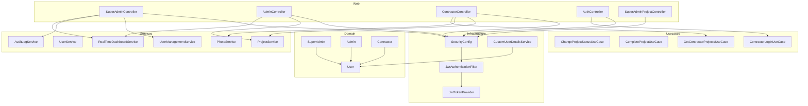
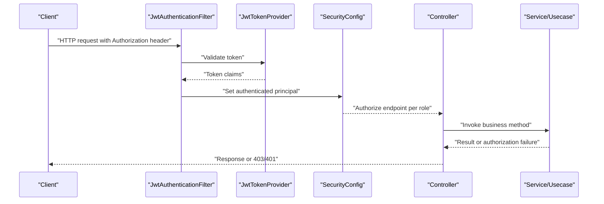
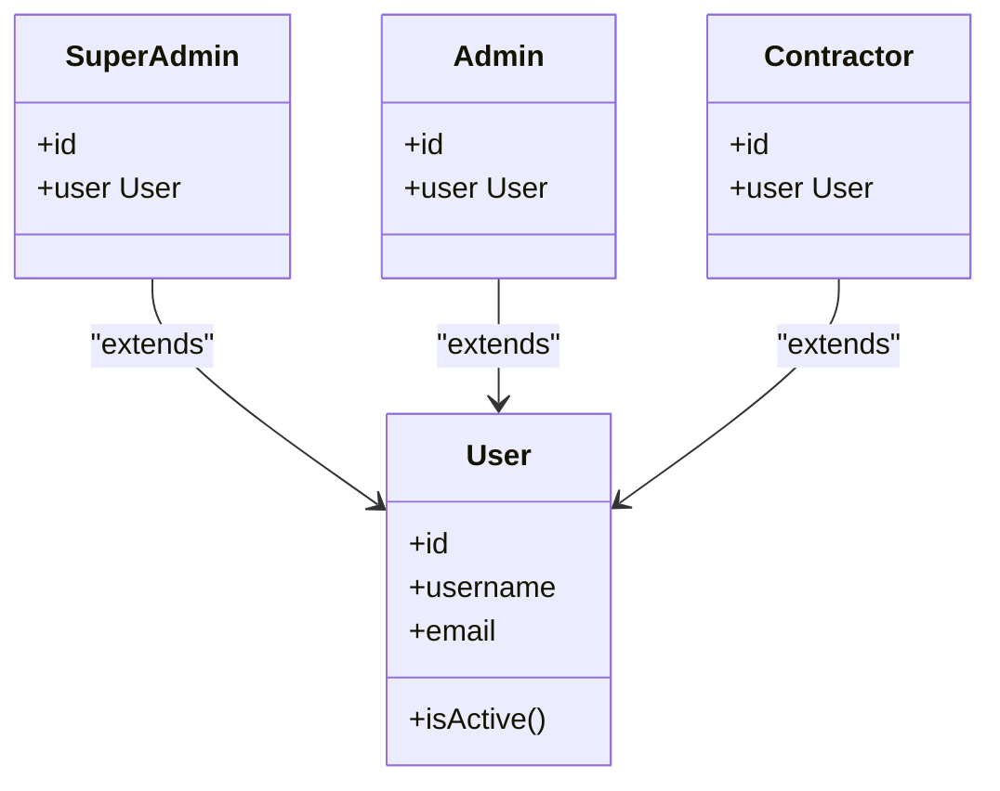
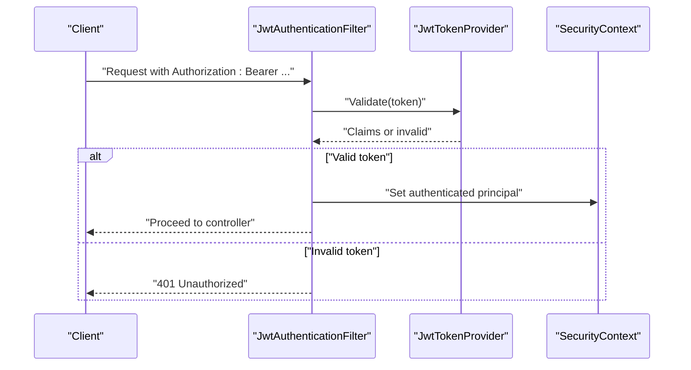
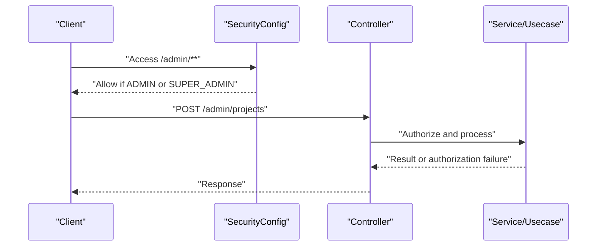
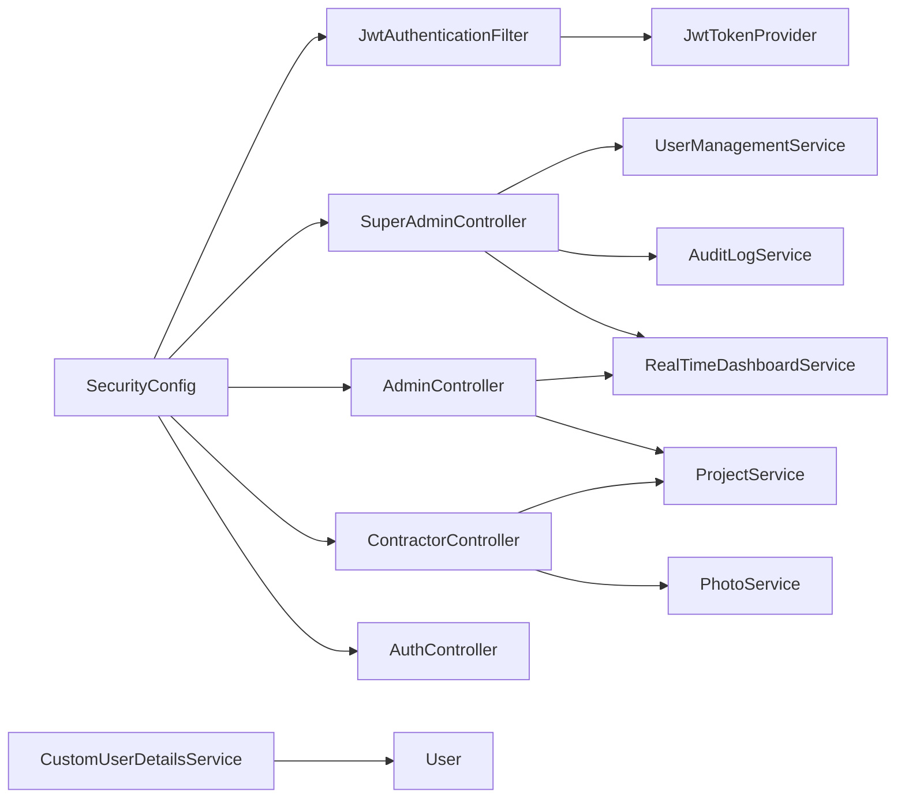

# Role-Based Access Control (RBAC)

<cite>
**Referenced Files in This Document**
- [SecurityConfig.java](file://src/main/java/root/cyb/mh/skylink_media_service/infrastructure/security/SecurityConfig.java)
- [CustomUserDetailsService.java](file://src/main/java/root/cyb/mh/skylink_media_service/infrastructure/security/CustomUserDetailsService.java)
- [JwtAuthenticationFilter.java](file://src/main/java/root/cyb/mh/skylink_media_service/infrastructure/security/jwt/JwtAuthenticationFilter.java)
- [JwtTokenProvider.java](file://src/main/java/root/cyb/mh/skylink_media_service/infrastructure/security/jwt/JwtTokenProvider.java)
- [SuperAdmin.java](file://src/main/java/root/cyb/mh/skylink_media_service/domain/entities/SuperAdmin.java)
- [Admin.java](file://src/main/java/root/cyb/mh/skylink_media_service/domain/entities/Admin.java)
- [Contractor.java](file://src/main/java/root/cyb/mh/skylink_media_service/domain/entities/Contractor.java)
- [User.java](file://src/main/java/root/cyb/mh/skylink_media_service/domain/entities/User.java)
- [SuperAdminController.java](file://src/main/java/root/cyb/mh/skylink_media_service/web/SuperAdminController.java)
- [AdminController.java](file://src/main/java/root/cyb/mh/skylink_media_service/web/AdminController.java)
- [ContractorController.java](file://src/main/java/root/cyb/mh/skylink_media_service/web/ContractorController.java)
- [AuthController.java](file://src/main/java/root/cyb/mh/skylink_media_service/web/AuthController.java)
- [SuperAdminProjectController.java](file://src/main/java/root/cyb/mh/skylink_media_service/web/SuperAdminProjectController.java)
- [UserManagementService.java](file://src/main/java/root/cyb/mh/skylink_media_service/application/services/UserManagementService.java)
- [UserService.java](file://src/main/java/root/cyb/mh/skylink_media_service/application/services/UserService.java)
- [ProjectService.java](file://src/main/java/root/cyb/mh/skylink_media_service/application/services/ProjectService.java)
- [PhotoService.java](file://src/main/java/root/cyb/mh/skylink_media_service/application/services/PhotoService.java)
- [RealTimeDashboardService.java](file://src/main/java/root/cyb/mh/skylink_media_service/application/services/RealTimeDashboardService.java)
- [AuditLogService.java](file://src/main/java/root/cyb/mh/skylink_media_service/application/services/AuditLogService.java)
- [ChangeProjectStatusUseCase.java](file://src/main/java/root/cyb/mh/skylink_media_service/application/usecases/ChangeProjectStatusUseCase.java)
- [CompleteProjectUseCase.java](file://src/main/java/root/cyb/mh/skylink_media_service/application/usecases/CompleteProjectUseCase.java)
- [GetContractorProjectsUseCase.java](file://src/main/java/root/cyb/mh/skylink_media_service/application/usecases/GetContractorProjectsUseCase.java)
- [ContractorLoginUseCase.java](file://src/main/java/root/cyb/mh/skylink_media_service/application/usecases/ContractorLoginUseCase.java)
- [GlobalApiExceptionHandler.java](file://src/main/java/root/cyb/mh/skylink_media_service/web/api/exception/GlobalApiExceptionHandler.java)
- [application.properties](file://src/main/resources/application.properties)
</cite>

## Table of Contents
1. [Introduction](#introduction)
2. [Project Structure](#project-structure)
3. [Core Components](#core-components)
4. [Architecture Overview](#architecture-overview)
5. [Detailed Component Analysis](#detailed-component-analysis)
6. [Dependency Analysis](#dependency-analysis)
7. [Performance Considerations](#performance-considerations)
8. [Troubleshooting Guide](#troubleshooting-guide)
9. [Conclusion](#conclusion)

## Introduction
This document explains the Role-Based Access Control (RBAC) implementation in the media service backend. The system enforces a three-tier role hierarchy:
- SUPER_ADMIN: highest privilege, administrative oversight and system-wide operations
- ADMIN: administrative functions within defined scopes
- CONTRACTOR: basic user operations and project-specific tasks

The RBAC model combines URL pattern-based authorization, method-level security annotations, and dynamic permission evaluation. It integrates JWT-based authentication, a custom user details service for role resolution, and Spring Security configuration to enforce access constraints across controllers, services, and use cases.

## Project Structure
The RBAC implementation spans several layers:
- Domain entities define roles and base user identity
- Infrastructure security configures global security policies and URL authorization
- JWT components handle authentication and token validation
- Controllers expose endpoints with role-based access
- Services and use cases implement authorization checks and business logic
- Exception handling centralizes security-related error responses

**Diagram sources**
- [SecurityConfig.java](file://src/main/java/root/cyb/mh/skylink_media_service/infrastructure/security/SecurityConfig.java)
- [CustomUserDetailsService.java](file://src/main/java/root/cyb/mh/skylink_media_service/infrastructure/security/CustomUserDetailsService.java)
- [JwtAuthenticationFilter.java](file://src/main/java/root/cyb/mh/skylink_media_service/infrastructure/security/jwt/JwtAuthenticationFilter.java)
- [JwtTokenProvider.java](file://src/main/java/root/cyb/mh/skylink_media_service/infrastructure/security/jwt/JwtTokenProvider.java)
- [SuperAdminController.java](file://src/main/java/root/cyb/mh/skylink_media_service/web/SuperAdminController.java)
- [AdminController.java](file://src/main/java/root/cyb/mh/skylink_media_service/web/AdminController.java)
- [ContractorController.java](file://src/main/java/root/cyb/mh/skylink_media_service/web/ContractorController.java)
- [AuthController.java](file://src/main/java/root/cyb/mh/skylink_media_service/web/AuthController.java)
- [SuperAdminProjectController.java](file://src/main/java/root/cyb/mh/skylink_media_service/web/SuperAdminProjectController.java)
- [UserManagementService.java](file://src/main/java/root/cyb/mh/skylink_media_service/application/services/UserManagementService.java)
- [UserService.java](file://src/main/java/root/cyb/mh/skylink_media_service/application/services/UserService.java)
- [ProjectService.java](file://src/main/java/root/cyb/mh/skylink_media_service/application/services/ProjectService.java)
- [PhotoService.java](file://src/main/java/root/cyb/mh/skylink_media_service/application/services/PhotoService.java)
- [RealTimeDashboardService.java](file://src/main/java/root/cyb/mh/skylink_media_service/application/services/RealTimeDashboardService.java)
- [AuditLogService.java](file://src/main/java/root/cyb/mh/skylink_media_service/application/services/AuditLogService.java)
- [ChangeProjectStatusUseCase.java](file://src/main/java/root/cyb/mh/skylink_media_service/application/usecases/ChangeProjectStatusUseCase.java)
- [CompleteProjectUseCase.java](file://src/main/java/root/cyb/mh/skylink_media_service/application/usecases/CompleteProjectUseCase.java)
- [GetContractorProjectsUseCase.java](file://src/main/java/root/cyb/mh/skylink_media_service/application/usecases/GetContractorProjectsUseCase.java)
- [ContractorLoginUseCase.java](file://src/main/java/root/cyb/mh/skylink_media_service/application/usecases/ContractorLoginUseCase.java)

**Section sources**
- [SecurityConfig.java](file://src/main/java/root/cyb/mh/skylink_media_service/infrastructure/security/SecurityConfig.java)
- [application.properties](file://src/main/resources/application.properties)

## Core Components
- Three-tier role hierarchy:
  - SUPER_ADMIN: system-level privileges and oversight
  - ADMIN: administrative functions within defined scopes
  - CONTRACTOR: basic user operations and project tasks
- URL pattern-based authorization: routes mapped to roles via SecurityConfig
- Method-level security: annotations on controllers and services for fine-grained checks
- Dynamic permission evaluation: runtime checks in controllers and services
- JWT authentication pipeline: filter validates tokens and populates authentication context
- CustomUserDetailsService: loads user details, resolves roles, and grants authorities

**Section sources**
- [SecurityConfig.java](file://src/main/java/root/cyb/mh/skylink_media_service/infrastructure/security/SecurityConfig.java)
- [CustomUserDetailsService.java](file://src/main/java/root/cyb/mh/skylink_media_service/infrastructure/security/CustomUserDetailsService.java)
- [JwtAuthenticationFilter.java](file://src/main/java/root/cyb/mh/skylink_media_service/infrastructure/security/jwt/JwtAuthenticationFilter.java)
- [JwtTokenProvider.java](file://src/main/java/root/cyb/mh/skylink_media_service/infrastructure/security/jwt/JwtTokenProvider.java)
- [SuperAdmin.java](file://src/main/java/root/cyb/mh/skylink_media_service/domain/entities/SuperAdmin.java)
- [Admin.java](file://src/main/java/root/cyb/mh/skylink_media_service/domain/entities/Admin.java)
- [Contractor.java](file://src/main/java/root/cyb/mh/skylink_media_service/domain/entities/Contractor.java)
- [User.java](file://src/main/java/root/cyb/mh/skylink_media_service/domain/entities/User.java)

## Architecture Overview
The RBAC architecture enforces access control at multiple layers:
- Authentication: JWT filter extracts token, validates signature, and sets authentication
- Authorization: SecurityConfig defines URL-to-role mappings and method-level security
- Identity: CustomUserDetailsService loads user entity and resolves role authorities
- Enforcement: Controllers and services apply security expressions and runtime checks

**Diagram sources**
- [JwtAuthenticationFilter.java](file://src/main/java/root/cyb/mh/skylink_media_service/infrastructure/security/jwt/JwtAuthenticationFilter.java)
- [JwtTokenProvider.java](file://src/main/java/root/cyb/mh/skylink_media_service/infrastructure/security/jwt/JwtTokenProvider.java)
- [SecurityConfig.java](file://src/main/java/root/cyb/mh/skylink_media_service/infrastructure/security/SecurityConfig.java)
- [SuperAdminController.java](file://src/main/java/root/cyb/mh/skylink_media_service/web/SuperAdminController.java)
- [AdminController.java](file://src/main/java/root/cyb/mh/skylink_media_service/web/AdminController.java)
- [ContractorController.java](file://src/main/java/root/cyb/mh/skylink_media_service/web/ContractorController.java)
- [AuthController.java](file://src/main/java/root/cyb/mh/skylink_media_service/web/AuthController.java)

## Detailed Component Analysis

### Role Hierarchy and Entities
The three-tier hierarchy is modeled by distinct domain entities extending a shared base user identity. Each role type encapsulates specific capabilities and constraints aligned with organizational responsibilities.

**Diagram sources**
- [User.java](file://src/main/java/root/cyb/mh/skylink_media_service/domain/entities/User.java)
- [SuperAdmin.java](file://src/main/java/root/cyb/mh/skylink_media_service/domain/entities/SuperAdmin.java)
- [Admin.java](file://src/main/java/root/cyb/mh/skylink_media_service/domain/entities/Admin.java)
- [Contractor.java](file://src/main/java/root/cyb/mh/skylink_media_service/domain/entities/Contractor.java)

**Section sources**
- [User.java](file://src/main/java/root/cyb/mh/skylink_media_service/domain/entities/User.java)
- [SuperAdmin.java](file://src/main/java/root/cyb/mh/skylink_media_service/domain/entities/SuperAdmin.java)
- [Admin.java](file://src/main/java/root/cyb/mh/skylink_media_service/domain/entities/Admin.java)
- [Contractor.java](file://src/main/java/root/cyb/mh/skylink_media_service/domain/entities/Contractor.java)

### Security Configuration and URL Pattern Matching
SecurityConfig defines:
- URL pattern-to-role mappings for public, protected, and role-scoped endpoints
- Method-level security activation for annotations on controllers/services
- Global security rules for CORS, CSRF, headers, and session management
- Permit-all patterns for login and health endpoints

Key authorization patterns include:
- Public endpoints: login and related authentication routes
- Role-scoped endpoints: super admin, admin, and contractor controllers
- Protected endpoints: require authenticated users with appropriate roles

**Section sources**
- [SecurityConfig.java](file://src/main/java/root/cyb/mh/skylink_media_service/infrastructure/security/SecurityConfig.java)

### JWT Authentication Pipeline
The JWT pipeline authenticates requests before authorization:
- JwtAuthenticationFilter intercepts requests and extracts the Authorization header
- JwtTokenProvider validates the token and reads claims
- On successful validation, the filter sets an authenticated principal in the security context

**Diagram sources**
- [JwtAuthenticationFilter.java](file://src/main/java/root/cyb/mh/skylink_media_service/infrastructure/security/jwt/JwtAuthenticationFilter.java)
- [JwtTokenProvider.java](file://src/main/java/root/cyb/mh/skylink_media_service/infrastructure/security/jwt/JwtTokenProvider.java)

**Section sources**
- [JwtAuthenticationFilter.java](file://src/main/java/root/cyb/mh/skylink_media_service/infrastructure/security/jwt/JwtAuthenticationFilter.java)
- [JwtTokenProvider.java](file://src/main/java/root/cyb/mh/skylink_media_service/infrastructure/security/jwt/JwtTokenProvider.java)

### CustomUserDetailsService: User Loading, Role Resolution, and Authority Granting
CustomUserDetailsService performs:
- User lookup by username or identifier
- Role resolution from the loaded entity (SuperAdmin, Admin, or Contractor)
- Authority granting based on resolved role
- Account status validation (enabled, not expired, not locked)

This service bridges the domain entities to Spring Security’s authentication model, ensuring authorities align with the three-tier hierarchy.

**Section sources**
- [CustomUserDetailsService.java](file://src/main/java/root/cyb/mh/skylink_media_service/infrastructure/security/CustomUserDetailsService.java)

### Controllers: Role-Based URL Patterns and Security Expressions
Controllers enforce RBAC through:
- URL pattern mappings aligned with SecurityConfig
- Method-level security annotations for fine-grained checks
- Security expressions in service-layer invocations

Examples of role-based access patterns:
- Super admin endpoints: accessible only to SUPER_ADMIN
- Admin endpoints: accessible to ADMIN and higher roles
- Contractor endpoints: accessible to CONTRACTOR and higher roles
- Shared endpoints: require authentication but may vary by role

**Diagram sources**
- [SecurityConfig.java](file://src/main/java/root/cyb/mh/skylink_media_service/infrastructure/security/SecurityConfig.java)
- [AdminController.java](file://src/main/java/root/cyb/mh/skylink_media_service/web/AdminController.java)
- [SuperAdminController.java](file://src/main/java/root/cyb/mh/skylink_media_service/web/SuperAdminController.java)
- [ContractorController.java](file://src/main/java/root/cyb/mh/skylink_media_service/web/ContractorController.java)

**Section sources**
- [SuperAdminController.java](file://src/main/java/root/cyb/mh/skylink_media_service/web/SuperAdminController.java)
- [AdminController.java](file://src/main/java/root/cyb/mh/skylink_media_service/web/AdminController.java)
- [ContractorController.java](file://src/main/java/root/cyb/mh/skylink_media_service/web/ContractorController.java)
- [AuthController.java](file://src/main/java/root/cyb/mh/skylink_media_service/web/AuthController.java)

### Services and Usecases: Dynamic Permission Evaluation
Services and use cases implement dynamic permission evaluation:
- Authorization checks before processing sensitive operations
- Role-based logic branching for different resource types (projects, photos, audits)
- Use cases encapsulate specific workflows with embedded authorization gates

Examples:
- Project operations: change status, complete project, list contractor projects
- Media operations: photo upload and management
- Administrative operations: audit logs, real-time dashboards

**Section sources**
- [ProjectService.java](file://src/main/java/root/cyb/mh/skylink_media_service/application/services/ProjectService.java)
- [PhotoService.java](file://src/main/java/root/cyb/mh/skylink_media_service/application/services/PhotoService.java)
- [RealTimeDashboardService.java](file://src/main/java/root/cyb/mh/skylink_media_service/application/services/RealTimeDashboardService.java)
- [AuditLogService.java](file://src/main/java/root/cyb/mh/skylink_media_service/application/services/AuditLogService.java)
- [ChangeProjectStatusUseCase.java](file://src/main/java/root/cyb/mh/skylink_media_service/application/usecases/ChangeProjectStatusUseCase.java)
- [CompleteProjectUseCase.java](file://src/main/java/root/cyb/mh/skylink_media_service/application/usecases/CompleteProjectUseCase.java)
- [GetContractorProjectsUseCase.java](file://src/main/java/root/cyb/mh/skylink_media_service/application/usecases/GetContractorProjectsUseCase.java)
- [ContractorLoginUseCase.java](file://src/main/java/root/cyb/mh/skylink_media_service/application/usecases/ContractorLoginUseCase.java)

### Practical Examples of Role-Based Access Patterns
- SUPER_ADMIN:
  - Full access to super admin controllers and project management
  - Oversight of audit logs and system monitoring
- ADMIN:
  - Manage projects and contractors within defined scopes
  - Access dashboards and reporting features
- CONTRACTOR:
  - View and update personal profile
  - Upload and manage photos for assigned projects
  - Participate in project chat and view project history

Permission inheritance:
- Higher roles inherit lower-role permissions plus additional privileges
- URL patterns and method-level annotations enforce strict boundaries

Security constraint enforcement:
- Controllers restrict access by role
- Services validate user identity and permissions for sensitive operations
- Use cases embed authorization checks for workflow steps

[No sources needed since this section synthesizes patterns without quoting specific files]

## Dependency Analysis
RBAC depends on cohesive interactions among security components, controllers, services, and domain entities. Coupling is primarily through:
- SecurityConfig as the central policy definition
- CustomUserDetailsService as the bridge between domain and security authorities
- JWT components for authentication preconditions
- Controllers and services for runtime authorization enforcement

**Diagram sources**
- [SecurityConfig.java](file://src/main/java/root/cyb/mh/skylink_media_service/infrastructure/security/SecurityConfig.java)
- [JwtAuthenticationFilter.java](file://src/main/java/root/cyb/mh/skylink_media_service/infrastructure/security/jwt/JwtAuthenticationFilter.java)
- [JwtTokenProvider.java](file://src/main/java/root/cyb/mh/skylink_media_service/infrastructure/security/jwt/JwtTokenProvider.java)
- [CustomUserDetailsService.java](file://src/main/java/root/cyb/mh/skylink_media_service/infrastructure/security/CustomUserDetailsService.java)
- [SuperAdminController.java](file://src/main/java/root/cyb/mh/skylink_media_service/web/SuperAdminController.java)
- [AdminController.java](file://src/main/java/root/cyb/mh/skylink_media_service/web/AdminController.java)
- [ContractorController.java](file://src/main/java/root/cyb/mh/skylink_media_service/web/ContractorController.java)
- [AuthController.java](file://src/main/java/root/cyb/mh/skylink_media_service/web/AuthController.java)
- [UserManagementService.java](file://src/main/java/root/cyb/mh/skylink_media_service/application/services/UserManagementService.java)
- [ProjectService.java](file://src/main/java/root/cyb/mh/skylink_media_service/application/services/ProjectService.java)
- [PhotoService.java](file://src/main/java/root/cyb/mh/skylink_media_service/application/services/PhotoService.java)
- [AuditLogService.java](file://src/main/java/root/cyb/mh/skylink_media_service/application/services/AuditLogService.java)
- [RealTimeDashboardService.java](file://src/main/java/root/cyb/mh/skylink_media_service/application/services/RealTimeDashboardService.java)
- [User.java](file://src/main/java/root/cyb/mh/skylink_media_service/domain/entities/User.java)

**Section sources**
- [SecurityConfig.java](file://src/main/java/root/cyb/mh/skylink_media_service/infrastructure/security/SecurityConfig.java)
- [CustomUserDetailsService.java](file://src/main/java/root/cyb/mh/skylink_media_service/infrastructure/security/CustomUserDetailsService.java)
- [JwtAuthenticationFilter.java](file://src/main/java/root/cyb/mh/skylink_media_service/infrastructure/security/jwt/JwtAuthenticationFilter.java)
- [JwtTokenProvider.java](file://src/main/java/root/cyb/mh/skylink_media_service/infrastructure/security/jwt/JwtTokenProvider.java)

## Performance Considerations
- Token validation overhead: minimize unnecessary re-validations by leveraging cached authorities where appropriate
- Role resolution cost: cache frequently accessed role authorities after initial load
- Endpoint caching: avoid redundant authorization checks for read-only endpoints where feasible
- Logging and auditing: ensure audit trails do not introduce significant latency under load

[No sources needed since this section provides general guidance]

## Troubleshooting Guide
Common issues and resolutions:
- 403 Forbidden:
  - Verify the user’s role matches the endpoint’s required role
  - Confirm method-level security annotations are present and effective
- 401 Unauthorized:
  - Ensure the Authorization header is present and contains a valid JWT
  - Check token expiration and issuer/signature validation
- Role mismatch:
  - Confirm CustomUserDetailsService grants correct authorities for the entity type
  - Validate that domain entity role mapping aligns with authorities
- Endpoint access errors:
  - Review SecurityConfig URL patterns and method-level security rules
  - Check controller-level security expressions and service-layer authorization checks

**Section sources**
- [GlobalApiExceptionHandler.java](file://src/main/java/root/cyb/mh/skylink_media_service/web/api/exception/GlobalApiExceptionHandler.java)
- [SecurityConfig.java](file://src/main/java/root/cyb/mh/skylink_media_service/infrastructure/security/SecurityConfig.java)
- [JwtAuthenticationFilter.java](file://src/main/java/root/cyb/mh/skylink_media_service/infrastructure/security/jwt/JwtAuthenticationFilter.java)
- [CustomUserDetailsService.java](file://src/main/java/root/cyb/mh/skylink_media_service/infrastructure/security/CustomUserDetailsService.java)

## Conclusion
The RBAC implementation establishes a robust, multi-tiered permission system integrating JWT authentication, URL pattern-based authorization, method-level security, and dynamic permission evaluation. The three-tier hierarchy (SUPER_ADMIN, ADMIN, CONTRACTOR) is enforced consistently across controllers, services, and use cases, ensuring secure access to diverse resource types while maintaining clear separation of duties and operational efficiency.