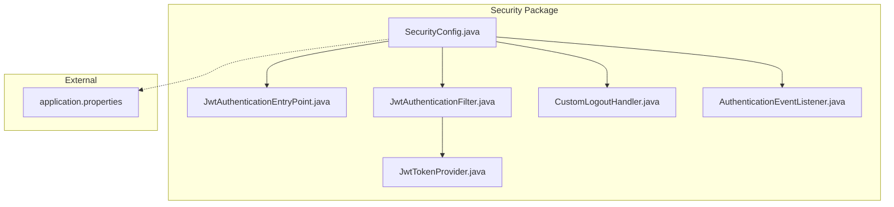
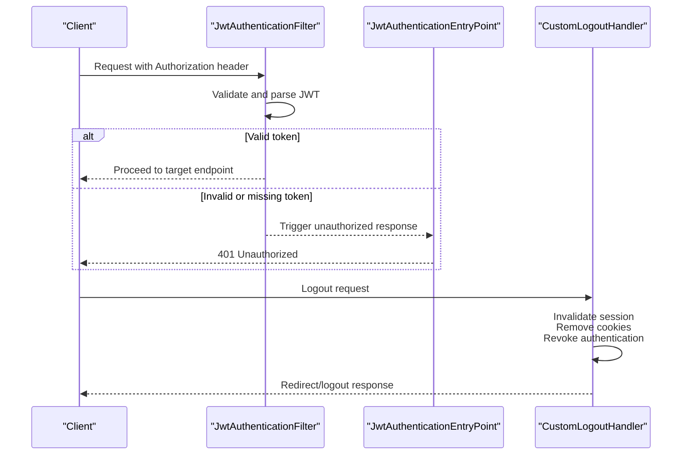
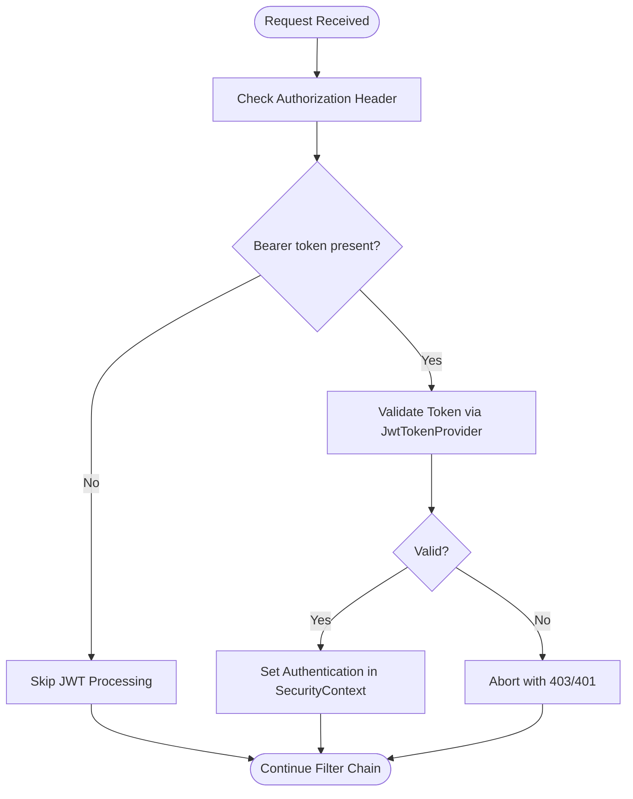
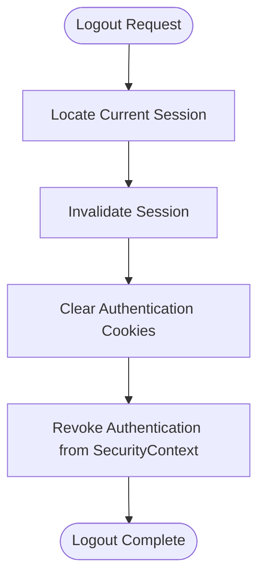
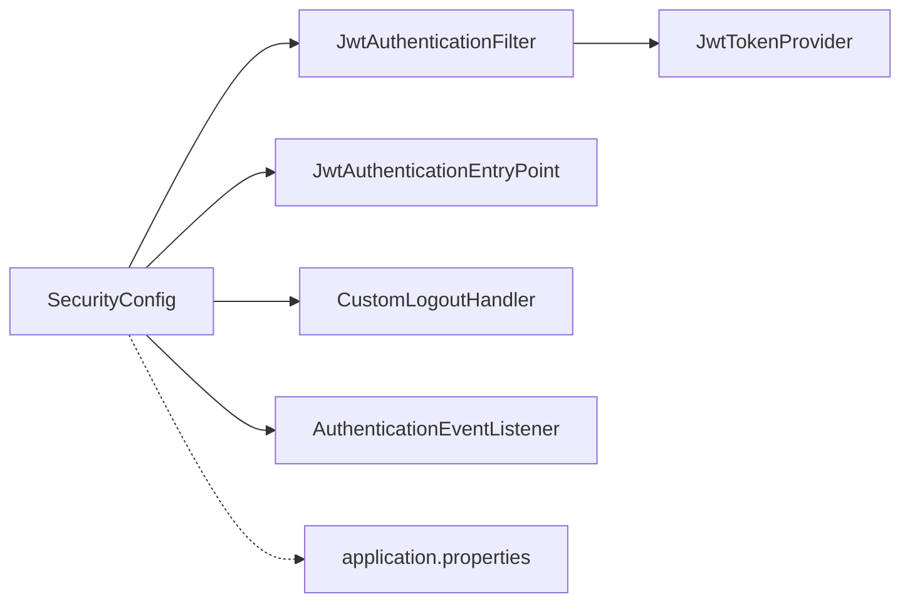

# Security Filters & Middleware

<cite>
**Referenced Files in This Document**
- [SecurityConfig.java](file://src/main/java/root/cyb/mh/skylink_media_service/infrastructure/security/SecurityConfig.java)
- [JwtAuthenticationEntryPoint.java](file://src/main/java/root/cyb/mh/skylink_media_service/infrastructure/security/jwt/JwtAuthenticationEntryPoint.java)
- [JwtAuthenticationFilter.java](file://src/main/java/root/cyb/mh/skylink_media_service/infrastructure/security/jwt/JwtAuthenticationFilter.java)
- [JwtTokenProvider.java](file://src/main/java/root/cyb/mh/skylink_media_service/infrastructure/security/jwt/JwtTokenProvider.java)
- [CustomLogoutHandler.java](file://src/main/java/root/cyb/mh/skylink_media_service/infrastructure/security/CustomLogoutHandler.java)
- [AuthenticationEventListener.java](file://src/main/java/root/cyb/mh/skylink_media_service/infrastructure/security/AuthenticationEventListener.java)
- [application.properties](file://src/main/resources/application.properties)
</cite>

## Table of Contents
1. [Introduction](#introduction)
2. [Project Structure](#project-structure)
3. [Core Components](#core-components)
4. [Architecture Overview](#architecture-overview)
5. [Detailed Component Analysis](#detailed-component-analysis)
6. [Dependency Analysis](#dependency-analysis)
7. [Performance Considerations](#performance-considerations)
8. [Troubleshooting Guide](#troubleshooting-guide)
9. [Conclusion](#conclusion)

## Introduction
This document explains the security filter chain and middleware components used to protect the backend APIs. It covers CORS configuration, CSRF protection, session management, filter ordering, authentication entry points, logout handlers, JWT-based authentication, event-driven audit logging, and security headers. Guidance is also provided for debugging, customization, and integrating with external authentication systems.

## Project Structure
Security-related components are organized under the infrastructure.security package, with JWT support under infrastructure.security.jwt. Configuration is centralized in SecurityConfig, while JWT utilities and entry points are provided by dedicated classes. Application-wide security properties are defined in application.properties.

**Diagram sources**
- [SecurityConfig.java](file://src/main/java/root/cyb/mh/skylink_media_service/infrastructure/security/SecurityConfig.java)
- [JwtAuthenticationEntryPoint.java](file://src/main/java/root/cyb/mh/skylink_media_service/infrastructure/security/jwt/JwtAuthenticationEntryPoint.java)
- [JwtAuthenticationFilter.java](file://src/main/java/root/cyb/mh/skylink_media_service/infrastructure/security/jwt/JwtAuthenticationFilter.java)
- [JwtTokenProvider.java](file://src/main/java/root/cyb/mh/skylink_media_service/infrastructure/security/jwt/JwtTokenProvider.java)
- [CustomLogoutHandler.java](file://src/main/java/root/cyb/mh/skylink_media_service/infrastructure/security/CustomLogoutHandler.java)
- [AuthenticationEventListener.java](file://src/main/java/root/cyb/mh/skylink_media_service/infrastructure/security/AuthenticationEventListener.java)
- [application.properties](file://src/main/resources/application.properties)

**Section sources**
- [SecurityConfig.java](file://src/main/java/root/cyb/mh/skylink_media_service/infrastructure/security/SecurityConfig.java)
- [application.properties](file://src/main/resources/application.properties)

## Core Components
- SecurityConfig: Centralizes Spring Security configuration including CORS, CSRF, session management, security headers, and filter chain ordering.
- JwtAuthenticationEntryPoint: Handles unauthorized access responses for protected endpoints.
- JwtAuthenticationFilter: Extracts and validates JWT tokens and establishes an authentication context.
- JwtTokenProvider: Provides token generation, validation, and claims extraction.
- CustomLogoutHandler: Implements logout behavior including session cleanup, cookie invalidation, and authentication revocation.
- AuthenticationEventListener: Listens to authentication events to record audit logs and perform post-authentication actions.

**Section sources**
- [SecurityConfig.java](file://src/main/java/root/cyb/mh/skylink_media_service/infrastructure/security/SecurityConfig.java)
- [JwtAuthenticationEntryPoint.java](file://src/main/java/root/cyb/mh/skylink_media_service/infrastructure/security/jwt/JwtAuthenticationEntryPoint.java)
- [JwtAuthenticationFilter.java](file://src/main/java/root/cyb/mh/skylink_media_service/infrastructure/security/jwt/JwtAuthenticationFilter.java)
- [JwtTokenProvider.java](file://src/main/java/root/cyb/mh/skylink_media_service/infrastructure/security/jwt/JwtTokenProvider.java)
- [CustomLogoutHandler.java](file://src/main/java/root/cyb/mh/skylink_media_service/infrastructure/security/CustomLogoutHandler.java)
- [AuthenticationEventListener.java](file://src/main/java/root/cyb/mh/skylink_media_service/infrastructure/security/AuthenticationEventListener.java)

## Architecture Overview
The security architecture enforces authentication via JWT before allowing access to protected endpoints. Unauthenticated requests are redirected to a standardized entry point. Logout is handled centrally to invalidate sessions and tokens. Events are emitted for authentication success/failure to support audit logging.

**Diagram sources**
- [JwtAuthenticationFilter.java](file://src/main/java/root/cyb/mh/skylink_media_service/infrastructure/security/jwt/JwtAuthenticationFilter.java)
- [JwtAuthenticationEntryPoint.java](file://src/main/java/root/cyb/mh/skylink_media_service/infrastructure/security/jwt/JwtAuthenticationEntryPoint.java)
- [CustomLogoutHandler.java](file://src/main/java/root/cyb/mh/skylink_media_service/infrastructure/security/CustomLogoutHandler.java)

## Detailed Component Analysis

### SecurityFilterChain Configuration
SecurityConfig defines the security filter chain with the following characteristics:
- CORS: Configured to permit cross-origin requests from trusted origins.
- CSRF: Disabled for stateless APIs using JWT.
- Session Management: Stateless (no server-side session).
- Security Headers: Includes frameOptions, contentTypeOptions, and XSS protection.
- Filter Order: Places JwtAuthenticationFilter before Spring Security’s default filters to intercept requests early.
- Authentication Entry Point: Uses JwtAuthenticationEntryPoint for unauthorized access scenarios.
- Logout Handler: Integrates CustomLogoutHandler for logout processing.

Key responsibilities:
- Define permitted paths (public endpoints).
- Apply JWT filter for protected paths.
- Configure logout behavior and handlers.
- Enforce security headers and policies.

**Section sources**
- [SecurityConfig.java](file://src/main/java/root/cyb/mh/skylink_media_service/infrastructure/security/SecurityConfig.java)

### JwtAuthenticationFilter
Purpose:
- Extracts the bearer token from the Authorization header.
- Validates the token using JwtTokenProvider.
- Establishes an authentication context for the current request.

Processing logic:
- Header parsing and token extraction.
- Token validation and claims retrieval.
- Authentication creation and propagation to the security context.

**Diagram sources**
- [JwtAuthenticationFilter.java](file://src/main/java/root/cyb/mh/skylink_media_service/infrastructure/security/jwt/JwtAuthenticationFilter.java)
- [JwtTokenProvider.java](file://src/main/java/root/cyb/mh/skylink_media_service/infrastructure/security/jwt/JwtTokenProvider.java)

**Section sources**
- [JwtAuthenticationFilter.java](file://src/main/java/root/cyb/mh/skylink_media_service/infrastructure/security/jwt/JwtAuthenticationFilter.java)
- [JwtTokenProvider.java](file://src/main/java/root/cyb/mh/skylink_media_service/infrastructure/security/jwt/JwtTokenProvider.java)

### JwtAuthenticationEntryPoint
Purpose:
- Standardizes unauthorized responses for protected endpoints when no valid authentication is present.

Behavior:
- Returns appropriate HTTP status codes and response bodies for authentication failures.

**Section sources**
- [JwtAuthenticationEntryPoint.java](file://src/main/java/root/cyb/mh/skylink_media_service/infrastructure/security/jwt/JwtAuthenticationEntryPoint.java)

### CustomLogoutHandler
Responsibilities:
- Session cleanup: Ensures server-side session termination.
- Cookie invalidation: Removes or clears authentication cookies.
- Authentication revocation: Clears the current authentication from the security context.

Logout flow:
- Identify current session and authentication.
- Invalidate session and clear stored tokens.
- Remove client cookies related to authentication.
- Redirect to logout success page or return JSON response.

**Diagram sources**
- [CustomLogoutHandler.java](file://src/main/java/root/cyb/mh/skylink_media_service/infrastructure/security/CustomLogoutHandler.java)

**Section sources**
- [CustomLogoutHandler.java](file://src/main/java/root/cyb/mh/skylink_media_service/infrastructure/security/CustomLogoutHandler.java)

### AuthenticationEventListener
Role:
- Listens to authentication success and failure events.
- Triggers audit logging and optional post-authentication tasks.

Typical activities:
- Record successful login attempts.
- Log failed attempts with reasons.
- Publish audit events for monitoring and compliance.

**Section sources**
- [AuthenticationEventListener.java](file://src/main/java/root/cyb/mh/skylink_media_service/infrastructure/security/AuthenticationEventListener.java)

### Security Headers and Policies
SecurityConfig applies the following headers and policies:
- Frame Options: Prevents clickjacking by disallowing framing.
- Content Type Options: Blocks MIME-type sniffing.
- XSS Protection: Enables browser XSS filters.
- CSRF: Disabled for stateless JWT APIs.
- Session Management: Stateless to avoid session fixation and improve scalability.

These are configured centrally to apply consistently across all requests.

**Section sources**
- [SecurityConfig.java](file://src/main/java/root/cyb/mh/skylink_media_service/infrastructure/security/SecurityConfig.java)

### CORS Setup
SecurityConfig configures CORS to:
- Allow specific origins, methods, and headers.
- Permit credentials when necessary.
- Apply preflight checks appropriately.

This ensures frontend applications can securely communicate with the backend.

**Section sources**
- [SecurityConfig.java](file://src/main/java/root/cyb/mh/skylink_media_service/infrastructure/security/SecurityConfig.java)

### Filter Chain Ordering and Purpose
Ordering:
- JwtAuthenticationFilter runs before Spring Security’s default filters to intercept requests early.
- Static resources and public endpoints bypass JWT filtering.
- Logout requests are handled by CustomLogoutHandler.

Purpose:
- Early authentication enforcement.
- Efficient handling of public routes.
- Centralized logout and session cleanup.

**Section sources**
- [SecurityConfig.java](file://src/main/java/root/cyb/mh/skylink_media_service/infrastructure/security/SecurityConfig.java)
- [JwtAuthenticationFilter.java](file://src/main/java/root/cyb/mh/skylink_media_service/infrastructure/security/jwt/JwtAuthenticationFilter.java)
- [CustomLogoutHandler.java](file://src/main/java/root/cyb/mh/skylink_media_service/infrastructure/security/CustomLogoutHandler.java)

### Integration with External Authentication Systems
- JWT-based authentication supports third-party identity providers that issue JWTs.
- SecurityConfig can be extended to integrate with OAuth2/OIDC providers by adding appropriate filters and entry points.
- CustomLogoutHandler can be adapted to revoke external tokens if needed.

[No sources needed since this section provides general guidance]

## Dependency Analysis
The security components depend on each other as follows:
- SecurityConfig composes JwtAuthenticationFilter, JwtAuthenticationEntryPoint, CustomLogoutHandler, and AuthenticationEventListener.
- JwtAuthenticationFilter depends on JwtTokenProvider for token validation.
- Application properties supply global security settings.

**Diagram sources**
- [SecurityConfig.java](file://src/main/java/root/cyb/mh/skylink_media_service/infrastructure/security/SecurityConfig.java)
- [JwtAuthenticationFilter.java](file://src/main/java/root/cyb/mh/skylink_media_service/infrastructure/security/jwt/JwtAuthenticationFilter.java)
- [JwtAuthenticationEntryPoint.java](file://src/main/java/root/cyb/mh/skylink_media_service/infrastructure/security/jwt/JwtAuthenticationEntryPoint.java)
- [CustomLogoutHandler.java](file://src/main/java/root/cyb/mh/skylink_media_service/infrastructure/security/CustomLogoutHandler.java)
- [AuthenticationEventListener.java](file://src/main/java/root/cyb/mh/skylink_media_service/infrastructure/security/AuthenticationEventListener.java)
- [JwtTokenProvider.java](file://src/main/java/root/cyb/mh/skylink_media_service/infrastructure/security/jwt/JwtTokenProvider.java)
- [application.properties](file://src/main/resources/application.properties)

**Section sources**
- [SecurityConfig.java](file://src/main/java/root/cyb/mh/skylink_media_service/infrastructure/security/SecurityConfig.java)
- [JwtAuthenticationFilter.java](file://src/main/java/root/cyb/mh/skylink_media_service/infrastructure/security/jwt/JwtAuthenticationFilter.java)
- [JwtTokenProvider.java](file://src/main/java/root/cyb/mh/skylink_media_service/infrastructure/security/jwt/JwtTokenProvider.java)
- [CustomLogoutHandler.java](file://src/main/java/root/cyb/mh/skylink_media_service/infrastructure/security/CustomLogoutHandler.java)
- [AuthenticationEventListener.java](file://src/main/java/root/cyb/mh/skylink_media_service/infrastructure/security/AuthenticationEventListener.java)
- [application.properties](file://src/main/resources/application.properties)

## Performance Considerations
- Stateless design reduces server memory footprint and improves horizontal scaling.
- JWT validation should leverage efficient token providers and caching for claims when applicable.
- Minimize unnecessary filter chain traversals by carefully defining permitted paths.
- Ensure logout handlers are lightweight to avoid blocking request threads.

[No sources needed since this section provides general guidance]

## Troubleshooting Guide
Common issues and resolutions:
- Unauthorized responses: Verify Authorization header presence and token validity. Check JwtAuthenticationEntryPoint behavior.
- CORS errors: Confirm allowed origins, methods, and headers in SecurityConfig.
- Logout not working: Ensure CustomLogoutHandler is invoked and session/cookie cleanup is executed.
- Duplicate authentication: Review filter ordering to prevent multiple authentications.
- Event logging gaps: Confirm AuthenticationEventListener is registered and configured.

Debugging tips:
- Enable Spring Security debug logs to trace filter execution and authentication decisions.
- Add request/response logging around JwtAuthenticationFilter to inspect token handling.
- Validate application.properties entries for security-related settings.

**Section sources**
- [SecurityConfig.java](file://src/main/java/root/cyb/mh/skylink_media_service/infrastructure/security/SecurityConfig.java)
- [JwtAuthenticationEntryPoint.java](file://src/main/java/root/cyb/mh/skylink_media_service/infrastructure/security/jwt/JwtAuthenticationEntryPoint.java)
- [JwtAuthenticationFilter.java](file://src/main/java/root/cyb/mh/skylink_media_service/infrastructure/security/jwt/JwtAuthenticationFilter.java)
- [CustomLogoutHandler.java](file://src/main/java/root/cyb/mh/skylink_media_service/infrastructure/security/CustomLogoutHandler.java)
- [AuthenticationEventListener.java](file://src/main/java/root/cyb/mh/skylink_media_service/infrastructure/security/AuthenticationEventListener.java)
- [application.properties](file://src/main/resources/application.properties)

## Conclusion
The security filter chain and middleware provide a robust, stateless, and auditable foundation for protecting backend APIs. By centralizing configuration in SecurityConfig, leveraging JWT for authentication, enforcing security headers, and integrating event-driven audit logging, the system achieves strong security posture with clear extension points for future enhancements and integrations.