# User Authentication Flow

<cite>
**Referenced Files in This Document**
- [AuthController.java](file://src/main/java/root/cyb/mh/skylink_media_service/infrastructure/web/AuthController.java)
- [AuthApiController.java](file://src/main/java/root/cyb/mh/skylink_media_service/infrastructure/web/api/AuthApiController.java)
- [ContractorLoginUseCase.java](file://src/main/java/root/cyb/mh/skylink_media_service/application/usecases/ContractorLoginUseCase.java)
- [LoginRequest.java](file://src/main/java/root/cyb/mh/skylink_media_service/application/dto/api/LoginRequest.java)
- [LoginResponse.java](file://src/main/java/root/cyb/mh/skylink_media_service/application/dto/api/LoginResponse.java)
- [JwtTokenProvider.java](file://src/main/java/root/cyb/mh/skylink_media_service/infrastructure/security/jwt/JwtTokenProvider.java)
- [CustomUserDetailsService.java](file://src/main/java/root/cyb/mh/skylink_media_service/infrastructure/security/CustomUserDetailsService.java)
- [SecurityConfig.java](file://src/main/java/root/cyb/mh/skylink_media_service/infrastructure/config/SecurityConfig.java)
- [CustomLogoutHandler.java](file://src/main/java/root/cyb/mh/skylink_media_service/infrastructure/security/CustomLogoutHandler.java)
- [LoginAuditLog.java](file://src/main/java/root/cyb/mh/skylink_media_service/domain/entities/LoginAuditLog.java)
- [LoginAuditLogRepository.java](file://src/main/java/root/cyb/mh/skylink_media_service/infrastructure/persistence/LoginAuditLogRepository.java)
- [Contractor.java](file://src/main/java/root/cyb/mh/skylink_media_service/domain/entities/Contractor.java)
- [Admin.java](file://src/main/java/root/cyb/mh/skylink_media_service/domain/entities/Admin.java)
- [SuperAdmin.java](file://src/main/java/root/cyb/mh/skylink_media_service/domain/entities/SuperAdmin.java)
- [User.java](file://src/main/java/root/cyb/mh/skylink_media_service/domain/entities/User.java)
- [ContractorRepository.java](file://src/main/java/root/cyb/mh/skylink_media_service/infrastructure/persistence/ContractorRepository.java)
- [UserRepository.java](file://src/main/java/root/cyb/mh/skylink_media_service/infrastructure/persistence/UserRepository.java)
- [GlobalApiExceptionHandler.java](file://src/main/java/root/cyb/mh/skylink_media_service/infrastructure/web/api/exception/GlobalApiExceptionHandler.java)
</cite>

## Table of Contents
1. [Introduction](#introduction)
2. [Project Structure](#project-structure)
3. [Core Components](#core-components)
4. [Architecture Overview](#architecture-overview)
5. [Detailed Component Analysis](#detailed-component-analysis)
6. [Dependency Analysis](#dependency-analysis)
7. [Performance Considerations](#performance-considerations)
8. [Troubleshooting Guide](#troubleshooting-guide)
9. [Conclusion](#conclusion)

## Introduction
This document explains the complete user authentication workflow from login initiation to session establishment. It traces the flow through both MVC and API controllers, credential validation, password verification, token generation, and role-specific authentication paths. It also documents login schemas, error handling, session management, remember-me functionality, concurrent session control, brute force protection, and logout procedures.

## Project Structure
Authentication spans MVC controllers, API controllers, use cases, JWT infrastructure, domain entities, repositories, and security configuration.

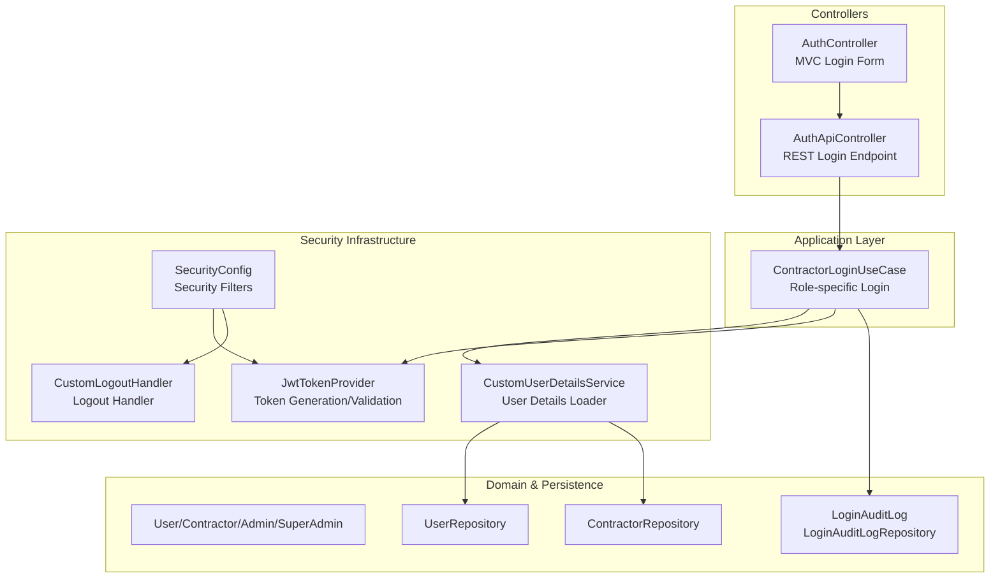

**Diagram sources**
- [AuthController.java](file://src/main/java/root/cyb/mh/skylink_media_service/infrastructure/web/AuthController.java)
- [AuthApiController.java](file://src/main/java/root/cyb/mh/skylink_media_service/infrastructure/web/api/AuthApiController.java)
- [ContractorLoginUseCase.java](file://src/main/java/root/cyb/mh/skylink_media_service/application/usecases/ContractorLoginUseCase.java)
- [JwtTokenProvider.java](file://src/main/java/root/cyb/mh/skylink_media_service/infrastructure/security/jwt/JwtTokenProvider.java)
- [CustomUserDetailsService.java](file://src/main/java/root/cyb/mh/skylink_media_service/infrastructure/security/CustomUserDetailsService.java)
- [SecurityConfig.java](file://src/main/java/root/cyb/mh/skylink_media_service/infrastructure/config/SecurityConfig.java)
- [CustomLogoutHandler.java](file://src/main/java/root/cyb/mh/skylink_media_service/infrastructure/security/CustomLogoutHandler.java)
- [LoginAuditLog.java](file://src/main/java/root/cyb/mh/skylink_media_service/domain/entities/LoginAuditLog.java)
- [LoginAuditLogRepository.java](file://src/main/java/root/cyb/mh/skylink_media_service/infrastructure/persistence/LoginAuditLogRepository.java)
- [UserRepository.java](file://src/main/java/root/cyb/mh/skylink_media_service/infrastructure/persistence/UserRepository.java)
- [ContractorRepository.java](file://src/main/java/root/cyb/mh/skylink_media_service/infrastructure/persistence/ContractorRepository.java)

**Section sources**
- [AuthController.java](file://src/main/java/root/cyb/mh/skylink_media_service/infrastructure/web/AuthController.java)
- [AuthApiController.java](file://src/main/java/root/cyb/mh/skylink_media_service/infrastructure/web/api/AuthApiController.java)
- [ContractorLoginUseCase.java](file://src/main/java/root/cyb/mh/skylink_media_service/application/usecases/ContractorLoginUseCase.java)
- [JwtTokenProvider.java](file://src/main/java/root/cyb/mh/skylink_media_service/infrastructure/security/jwt/JwtTokenProvider.java)
- [CustomUserDetailsService.java](file://src/main/java/root/cyb/mh/skylink_media_service/infrastructure/security/CustomUserDetailsService.java)
- [SecurityConfig.java](file://src/main/java/root/cyb/mh/skylink_media_service/infrastructure/config/SecurityConfig.java)
- [CustomLogoutHandler.java](file://src/main/java/root/cyb/mh/skylink_media_service/infrastructure/security/CustomLogoutHandler.java)
- [LoginAuditLog.java](file://src/main/java/root/cyb/mh/skylink_media_service/domain/entities/LoginAuditLog.java)
- [LoginAuditLogRepository.java](file://src/main/java/root/cyb/mh/skylink_media_service/infrastructure/persistence/LoginAuditLogRepository.java)
- [UserRepository.java](file://src/main/java/root/cyb/mh/skylink_media_service/infrastructure/persistence/UserRepository.java)
- [ContractorRepository.java](file://src/main/java/root/cyb/mh/skylink_media_service/infrastructure/persistence/ContractorRepository.java)

## Core Components
- AuthController: Handles form-based login via MVC, delegates to use cases, and manages session attributes.
- AuthApiController: Provides REST endpoint for login, returning tokens and user info.
- ContractorLoginUseCase: Orchestrates contractor-specific login, credential validation, and token issuance.
- LoginRequest/LoginResponse: Request/response DTOs for login operations.
- JwtTokenProvider: Generates and validates JWT tokens.
- CustomUserDetailsService: Loads user details for authentication and authorization.
- SecurityConfig: Configures Spring Security filters, CSRF, session management, and logout behavior.
- CustomLogoutHandler: Implements logout cleanup and token invalidation.
- LoginAuditLog/LoginAuditLogRepository: Tracks login attempts for audit and brute-force detection.
- Role Entities: User, Contractor, Admin, SuperAdmin define roles and authorities.

**Section sources**
- [AuthController.java](file://src/main/java/root/cyb/mh/skylink_media_service/infrastructure/web/AuthController.java)
- [AuthApiController.java](file://src/main/java/root/cyb/mh/skylink_media_service/infrastructure/web/api/AuthApiController.java)
- [ContractorLoginUseCase.java](file://src/main/java/root/cyb/mh/skylink_media_service/application/usecases/ContractorLoginUseCase.java)
- [LoginRequest.java](file://src/main/java/root/cyb/mh/skylink_media_service/application/dto/api/LoginRequest.java)
- [LoginResponse.java](file://src/main/java/root/cyb/mh/skylink_media_service/application/dto/api/LoginResponse.java)
- [JwtTokenProvider.java](file://src/main/java/root/cyb/mh/skylink_media_service/infrastructure/security/jwt/JwtTokenProvider.java)
- [CustomUserDetailsService.java](file://src/main/java/root/cyb/mh/skylink_media_service/infrastructure/security/CustomUserDetailsService.java)
- [SecurityConfig.java](file://src/main/java/root/cyb/mh/skylink_media_service/infrastructure/config/SecurityConfig.java)
- [CustomLogoutHandler.java](file://src/main/java/root/cyb/mh/skylink_media_service/infrastructure/security/CustomLogoutHandler.java)
- [LoginAuditLog.java](file://src/main/java/root/cyb/mh/skylink_media_service/domain/entities/LoginAuditLog.java)
- [LoginAuditLogRepository.java](file://src/main/java/root/cyb/mh/skylink_media_service/infrastructure/persistence/LoginAuditLogRepository.java)
- [User.java](file://src/main/java/root/cyb/mh/skylink_media_service/domain/entities/User.java)
- [Contractor.java](file://src/main/java/root/cyb/mh/skylink_media_service/domain/entities/Contractor.java)
- [Admin.java](file://src/main/java/root/cyb/mh/skylink_media_service/domain/entities/Admin.java)
- [SuperAdmin.java](file://src/main/java/root/cyb/mh/skylink_media_service/domain/entities/SuperAdmin.java)

## Architecture Overview
The authentication pipeline integrates MVC and REST login paths, centralized credential validation, role-specific use cases, JWT issuance, and robust session management.

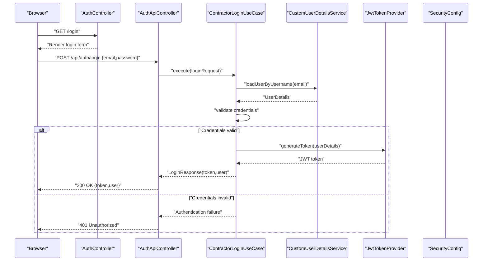

**Diagram sources**
- [AuthController.java](file://src/main/java/root/cyb/mh/skylink_media_service/infrastructure/web/AuthController.java)
- [AuthApiController.java](file://src/main/java/root/cyb/mh/skylink_media_service/infrastructure/web/api/AuthApiController.java)
- [ContractorLoginUseCase.java](file://src/main/java/root/cyb/mh/skylink_media_service/application/usecases/ContractorLoginUseCase.java)
- [CustomUserDetailsService.java](file://src/main/java/root/cyb/mh/skylink_media_service/infrastructure/security/CustomUserDetailsService.java)
- [JwtTokenProvider.java](file://src/main/java/root/cyb/mh/skylink_media_service/infrastructure/security/jwt/JwtTokenProvider.java)
- [SecurityConfig.java](file://src/main/java/root/cyb/mh/skylink_media_service/infrastructure/config/SecurityConfig.java)

## Detailed Component Analysis

### Login Request/Response Schemas
- LoginRequest: Contains email and password fields for authentication.
- LoginResponse: Contains the issued token and user identity information.

These DTOs define the contract for the login API and are validated by the controller layer.

**Section sources**
- [LoginRequest.java](file://src/main/java/root/cyb/mh/skylink_media_service/application/dto/api/LoginRequest.java)
- [LoginResponse.java](file://src/main/java/root/cyb/mh/skylink_media_service/application/dto/api/LoginResponse.java)
- [AuthApiController.java](file://src/main/java/root/cyb/mh/skylink_media_service/infrastructure/web/api/AuthApiController.java)

### AuthController (MVC Login)
- Renders the login page.
- Processes form submissions.
- Delegates to use cases for authentication.
- Manages session attributes and redirects after successful login.

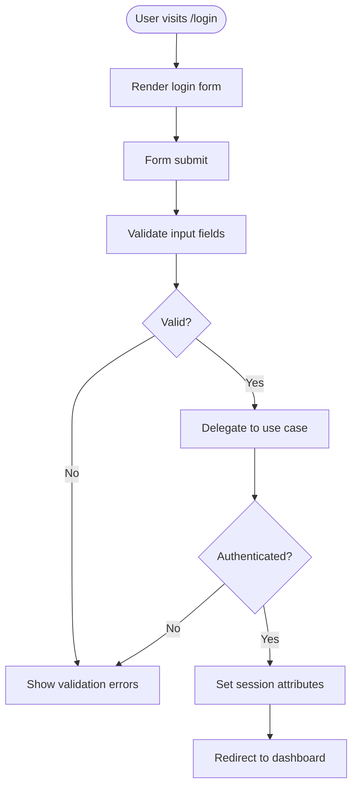

**Diagram sources**
- [AuthController.java](file://src/main/java/root/cyb/mh/skylink_media_service/infrastructure/web/AuthController.java)

**Section sources**
- [AuthController.java](file://src/main/java/root/cyb/mh/skylink_media_service/infrastructure/web/AuthController.java)

### AuthApiController (REST Login)
- Accepts POST requests to /api/auth/login.
- Validates LoginRequest payload.
- Calls ContractorLoginUseCase to authenticate.
- Returns LoginResponse with token and user info on success; otherwise returns appropriate error responses.

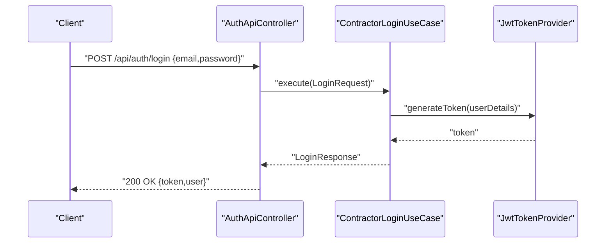

**Diagram sources**
- [AuthApiController.java](file://src/main/java/root/cyb/mh/skylink_media_service/infrastructure/web/api/AuthApiController.java)
- [ContractorLoginUseCase.java](file://src/main/java/root/cyb/mh/skylink_media_service/application/usecases/ContractorLoginUseCase.java)
- [JwtTokenProvider.java](file://src/main/java/root/cyb/mh/skylink_media_service/infrastructure/security/jwt/JwtTokenProvider.java)

**Section sources**
- [AuthApiController.java](file://src/main/java/root/cyb/mh/skylink_media_service/infrastructure/web/api/AuthApiController.java)

### ContractorLoginUseCase Implementation
- Loads user details via CustomUserDetailsService.
- Validates credentials (password encoding verification).
- Generates JWT token using JwtTokenProvider.
- Records login audit events.
- Returns LoginResponse containing token and user identity.

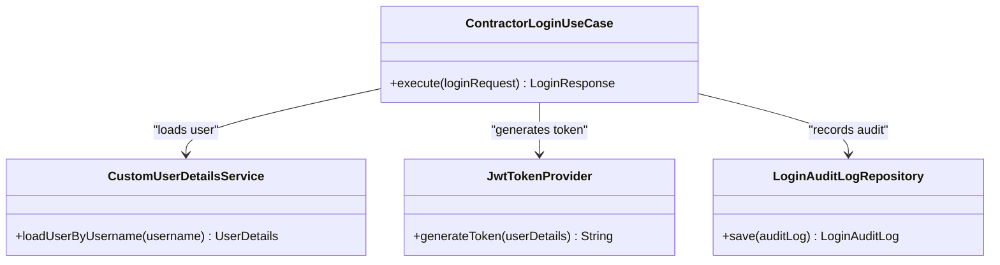

**Diagram sources**
- [ContractorLoginUseCase.java](file://src/main/java/root/cyb/mh/skylink_media_service/application/usecases/ContractorLoginUseCase.java)
- [CustomUserDetailsService.java](file://src/main/java/root/cyb/mh/skylink_media_service/infrastructure/security/CustomUserDetailsService.java)
- [JwtTokenProvider.java](file://src/main/java/root/cyb/mh/skylink_media_service/infrastructure/security/jwt/JwtTokenProvider.java)
- [LoginAuditLogRepository.java](file://src/main/java/root/cyb/mh/skylink_media_service/infrastructure/persistence/LoginAuditLogRepository.java)

**Section sources**
- [ContractorLoginUseCase.java](file://src/main/java/root/cyb/mh/skylink_media_service/application/usecases/ContractorLoginUseCase.java)
- [CustomUserDetailsService.java](file://src/main/java/root/cyb/mh/skylink_media_service/infrastructure/security/CustomUserDetailsService.java)
- [JwtTokenProvider.java](file://src/main/java/root/cyb/mh/skylink_media_service/infrastructure/security/jwt/JwtTokenProvider.java)
- [LoginAuditLogRepository.java](file://src/main/java/root/cyb/mh/skylink_media_service/infrastructure/persistence/LoginAuditLogRepository.java)

### Credential Validation and Password Encoding Verification
- CustomUserDetailsService loads user details by email.
- Password verification is performed during authentication checks.
- The system relies on Spring Security's encoded password comparison.

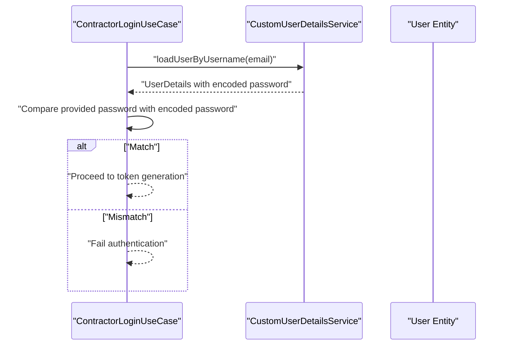

**Diagram sources**
- [ContractorLoginUseCase.java](file://src/main/java/root/cyb/mh/skylink_media_service/application/usecases/ContractorLoginUseCase.java)
- [CustomUserDetailsService.java](file://src/main/java/root/cyb/mh/skylink_media_service/infrastructure/security/CustomUserDetailsService.java)
- [User.java](file://src/main/java/root/cyb/mh/skylink_media_service/domain/entities/User.java)

**Section sources**
- [ContractorLoginUseCase.java](file://src/main/java/root/cyb/mh/skylink_media_service/application/usecases/ContractorLoginUseCase.java)
- [CustomUserDetailsService.java](file://src/main/java/root/cyb/mh/skylink_media_service/infrastructure/security/CustomUserDetailsService.java)
- [User.java](file://src/main/java/root/cyb/mh/skylink_media_service/domain/entities/User.java)

### Token Generation and Management
- JwtTokenProvider generates tokens for authenticated users.
- Tokens are returned in LoginResponse for client consumption.
- SecurityConfig configures JWT filter chain and session management.

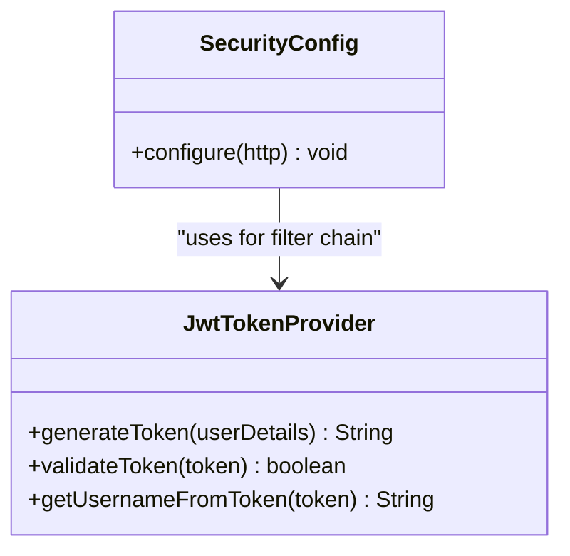

**Diagram sources**
- [JwtTokenProvider.java](file://src/main/java/root/cyb/mh/skylink_media_service/infrastructure/security/jwt/JwtTokenProvider.java)
- [SecurityConfig.java](file://src/main/java/root/cyb/mh/skylink_media_service/infrastructure/config/SecurityConfig.java)

**Section sources**
- [JwtTokenProvider.java](file://src/main/java/root/cyb/mh/skylink_media_service/infrastructure/security/jwt/JwtTokenProvider.java)
- [SecurityConfig.java](file://src/main/java/root/cyb/mh/skylink_media_service/infrastructure/config/SecurityConfig.java)

### Session Management, Remember-Me, and Concurrent Sessions
- SecurityConfig defines session fixation protection and maximum sessions per user.
- Remember-me functionality can be configured for persistent login.
- Logout handler clears session and performs additional cleanup.

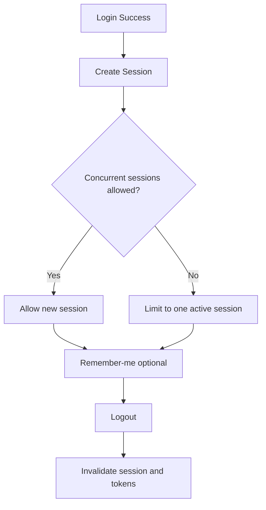

**Diagram sources**
- [SecurityConfig.java](file://src/main/java/root/cyb/mh/skylink_media_service/infrastructure/config/SecurityConfig.java)
- [CustomLogoutHandler.java](file://src/main/java/root/cyb/mh/skylink_media_service/infrastructure/security/CustomLogoutHandler.java)

**Section sources**
- [SecurityConfig.java](file://src/main/java/root/cyb/mh/skylink_media_service/infrastructure/config/SecurityConfig.java)
- [CustomLogoutHandler.java](file://src/main/java/root/cyb/mh/skylink_media_service/infrastructure/security/CustomLogoutHandler.java)

### Brute Force Protection, Account Lockout, and Failed Attempt Tracking
- LoginAuditLogRepository persists login attempts with outcomes.
- Failed attempts can trigger temporary locks or rate limits.
- GlobalApiExceptionHandler centralizes error responses for authentication failures.

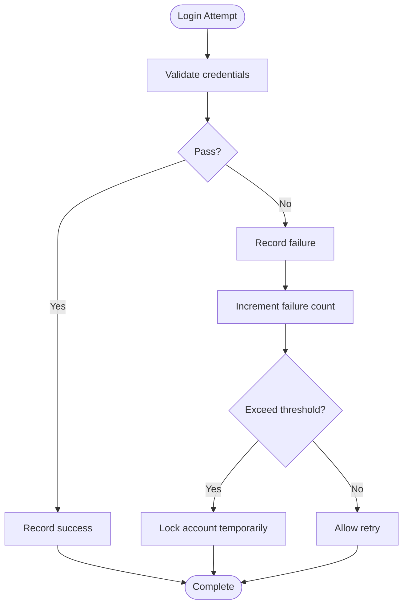

**Diagram sources**
- [LoginAuditLog.java](file://src/main/java/root/cyb/mh/skylink_media_service/domain/entities/LoginAuditLog.java)
- [LoginAuditLogRepository.java](file://src/main/java/root/cyb/mh/skylink_media_service/infrastructure/persistence/LoginAuditLogRepository.java)
- [GlobalApiExceptionHandler.java](file://src/main/java/root/cyb/mh/skylink_media_service/infrastructure/web/api/exception/GlobalApiExceptionHandler.java)

**Section sources**
- [LoginAuditLog.java](file://src/main/java/root/cyb/mh/skylink_media_service/domain/entities/LoginAuditLog.java)
- [LoginAuditLogRepository.java](file://src/main/java/root/cyb/mh/skylink_media_service/infrastructure/persistence/LoginAuditLogRepository.java)
- [GlobalApiExceptionHandler.java](file://src/main/java/root/cyb/mh/skylink_media_service/infrastructure/web/api/exception/GlobalApiExceptionHandler.java)

### Role-Specific Authentication Paths
- User: Base authenticated user.
- Contractor: Specialized contractor entity with contractor-specific repositories and use cases.
- Admin/SuperAdmin: Higher privilege roles with administrative endpoints.

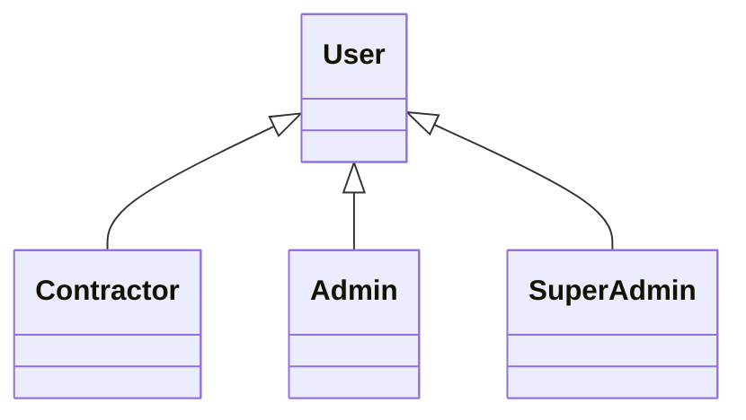

**Diagram sources**
- [User.java](file://src/main/java/root/cyb/mh/skylink_media_service/domain/entities/User.java)
- [Contractor.java](file://src/main/java/root/cyb/mh/skylink_media_service/domain/entities/Contractor.java)
- [Admin.java](file://src/main/java/root/cyb/mh/skylink_media_service/domain/entities/Admin.java)
- [SuperAdmin.java](file://src/main/java/root/cyb/mh/skylink_media_service/domain/entities/SuperAdmin.java)

**Section sources**
- [User.java](file://src/main/java/root/cyb/mh/skylink_media_service/domain/entities/User.java)
- [Contractor.java](file://src/main/java/root/cyb/mh/skylink_media_service/domain/entities/Contractor.java)
- [Admin.java](file://src/main/java/root/cyb/mh/skylink_media_service/domain/entities/Admin.java)
- [SuperAdmin.java](file://src/main/java/root/cyb/mh/skylink_media_service/domain/entities/SuperAdmin.java)

### Logout Procedures
- CustomLogoutHandler invalidates sessions and performs cleanup.
- SecurityConfig configures logout endpoints and behavior.
- Clients should clear stored tokens upon logout.

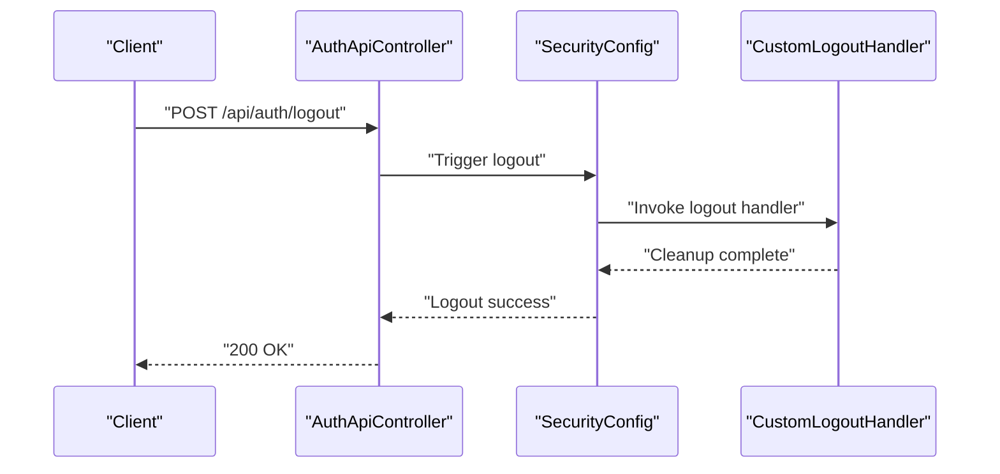

**Diagram sources**
- [AuthApiController.java](file://src/main/java/root/cyb/mh/skylink_media_service/infrastructure/web/api/AuthApiController.java)
- [SecurityConfig.java](file://src/main/java/root/cyb/mh/skylink_media_service/infrastructure/config/SecurityConfig.java)
- [CustomLogoutHandler.java](file://src/main/java/root/cyb/mh/skylink_media_service/infrastructure/security/CustomLogoutHandler.java)

**Section sources**
- [AuthApiController.java](file://src/main/java/root/cyb/mh/skylink_media_service/infrastructure/web/api/AuthApiController.java)
- [SecurityConfig.java](file://src/main/java/root/cyb/mh/skylink_media_service/infrastructure/config/SecurityConfig.java)
- [CustomLogoutHandler.java](file://src/main/java/root/cyb/mh/skylink_media_service/infrastructure/security/CustomLogoutHandler.java)

## Dependency Analysis
Authentication depends on layered components with clear separation of concerns.

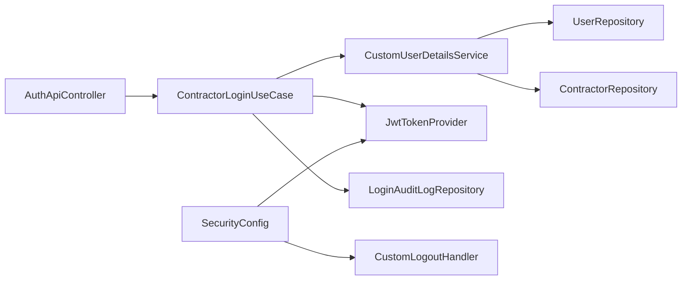

**Diagram sources**
- [AuthApiController.java](file://src/main/java/root/cyb/mh/skylink_media_service/infrastructure/web/api/AuthApiController.java)
- [ContractorLoginUseCase.java](file://src/main/java/root/cyb/mh/skylink_media_service/application/usecases/ContractorLoginUseCase.java)
- [CustomUserDetailsService.java](file://src/main/java/root/cyb/mh/skylink_media_service/infrastructure/security/CustomUserDetailsService.java)
- [JwtTokenProvider.java](file://src/main/java/root/cyb/mh/skylink_media_service/infrastructure/security/jwt/JwtTokenProvider.java)
- [LoginAuditLogRepository.java](file://src/main/java/root/cyb/mh/skylink_media_service/infrastructure/persistence/LoginAuditLogRepository.java)
- [UserRepository.java](file://src/main/java/root/cyb/mh/skylink_media_service/infrastructure/persistence/UserRepository.java)
- [ContractorRepository.java](file://src/main/java/root/cyb/mh/skylink_media_service/infrastructure/persistence/ContractorRepository.java)
- [SecurityConfig.java](file://src/main/java/root/cyb/mh/skylink_media_service/infrastructure/config/SecurityConfig.java)
- [CustomLogoutHandler.java](file://src/main/java/root/cyb/mh/skylink_media_service/infrastructure/security/CustomLogoutHandler.java)

**Section sources**
- [AuthApiController.java](file://src/main/java/root/cyb/mh/skylink_media_service/infrastructure/web/api/AuthApiController.java)
- [ContractorLoginUseCase.java](file://src/main/java/root/cyb/mh/skylink_media_service/application/usecases/ContractorLoginUseCase.java)
- [CustomUserDetailsService.java](file://src/main/java/root/cyb/mh/skylink_media_service/infrastructure/security/CustomUserDetailsService.java)
- [JwtTokenProvider.java](file://src/main/java/root/cyb/mh/skylink_media_service/infrastructure/security/jwt/JwtTokenProvider.java)
- [LoginAuditLogRepository.java](file://src/main/java/root/cyb/mh/skylink_media_service/infrastructure/persistence/LoginAuditLogRepository.java)
- [UserRepository.java](file://src/main/java/root/cyb/mh/skylink_media_service/infrastructure/persistence/UserRepository.java)
- [ContractorRepository.java](file://src/main/java/root/cyb/mh/skylink_media_service/infrastructure/persistence/ContractorRepository.java)
- [SecurityConfig.java](file://src/main/java/root/cyb/mh/skylink_media_service/infrastructure/config/SecurityConfig.java)
- [CustomLogoutHandler.java](file://src/main/java/root/cyb/mh/skylink_media_service/infrastructure/security/CustomLogoutHandler.java)

## Performance Considerations
- Prefer efficient password encoding algorithms and avoid unnecessary database queries.
- Cache frequently accessed user roles and permissions where appropriate.
- Limit concurrent sessions to reduce resource contention.
- Use asynchronous audit logging to minimize latency.

## Troubleshooting Guide
Common issues and resolutions:
- 401 Unauthorized on login: Verify email/password correctness and ensure the account is unlocked.
- Rate limit exceeded: Wait for the cooldown period; failed attempts are tracked to prevent brute force.
- Session conflicts: Configure maximum sessions per user to enforce single active session.
- Logout not effective: Ensure clients invalidate stored tokens and cookies; server-side session invalidation occurs via CustomLogoutHandler.

**Section sources**
- [GlobalApiExceptionHandler.java](file://src/main/java/root/cyb/mh/skylink_media_service/infrastructure/web/api/exception/GlobalApiExceptionHandler.java)
- [LoginAuditLogRepository.java](file://src/main/java/root/cyb/mh/skylink_media_service/infrastructure/persistence/LoginAuditLogRepository.java)
- [SecurityConfig.java](file://src/main/java/root/cyb/mh/skylink_media_service/infrastructure/config/SecurityConfig.java)
- [CustomLogoutHandler.java](file://src/main/java/root/cyb/mh/skylink_media_service/infrastructure/security/CustomLogoutHandler.java)

## Conclusion
The authentication system integrates MVC and REST login paths, robust credential validation, role-aware use cases, secure token generation, and comprehensive session and audit controls. By leveraging JwtTokenProvider, CustomUserDetailsService, and SecurityConfig, the system ensures secure, scalable, and maintainable authentication across contractor, admin, and super admin roles.