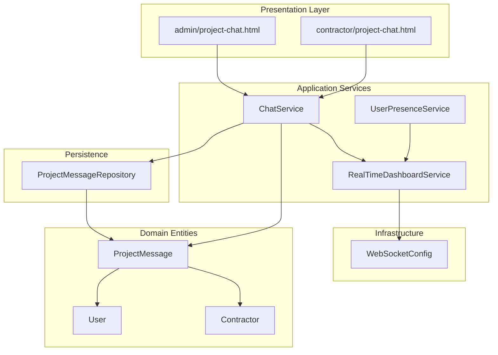
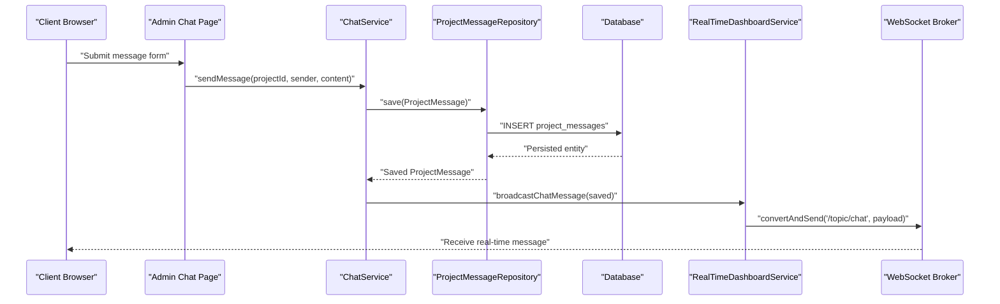
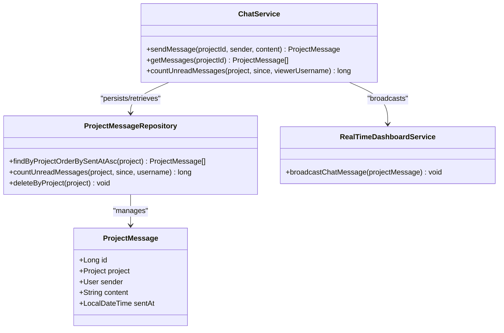
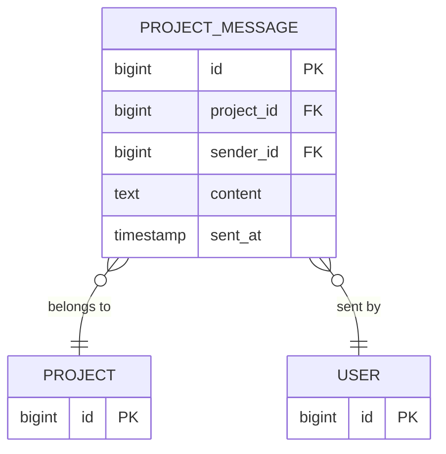
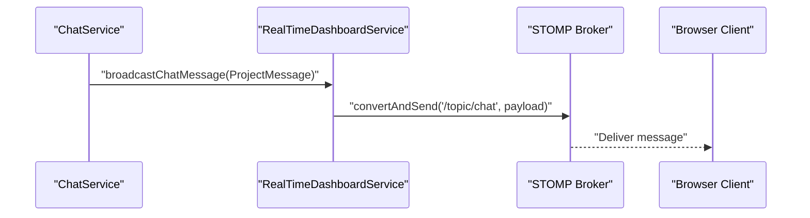
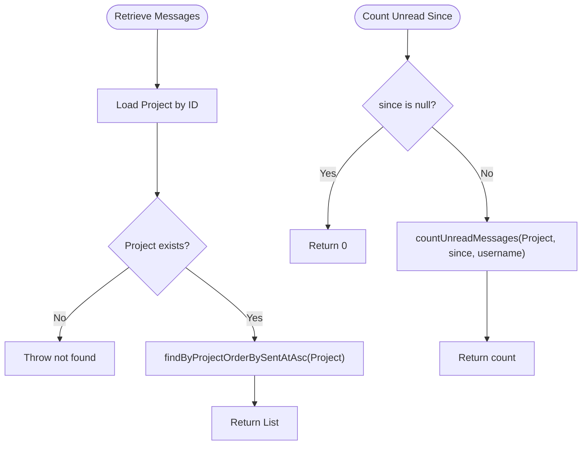
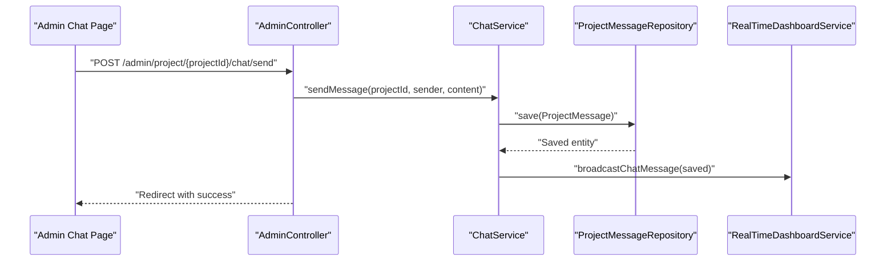
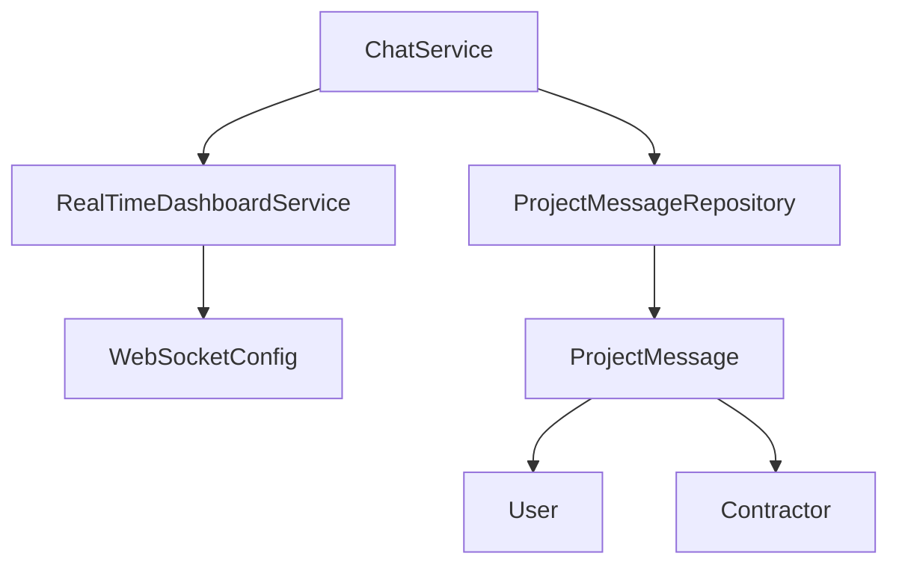

# Chat Service Implementation

<cite>
**Referenced Files in This Document**
- [ChatService.java](file://src/main/java/root/cyb/mh/skylink_media_service/application/services/ChatService.java)
- [ProjectMessage.java](file://src/main/java/root/cyb/mh/skylink_media_service/domain/entities/ProjectMessage.java)
- [RealTimeDashboardService.java](file://src/main/java/root/cyb/mh/skylink_media_service/application/services/RealTimeDashboardService.java)
- [ProjectMessageRepository.java](file://src/main/java/root/cyb/mh/skylink_media_service/infrastructure/persistence/ProjectMessageRepository.java)
- [WebSocketConfig.java](file://src/main/java/root/cyb/mh/skylink_media_service/infrastructure/config/WebSocketConfig.java)
- [UserPresenceService.java](file://src/main/java/root/cyb/mh/skylink_media_service/application/services/UserPresenceService.java)
- [project-chat.html (contractor)](file://src/main/resources/templates/contractor/project-chat.html)
- [project-chat.html (admin)](file://src/main/resources/templates/admin/project-chat.html)
- [SecurityConfig.java](file://src/main/java/root/cyb/mh/skylink_media_service/infrastructure/security/SecurityConfig.java)
- [User.java](file://src/main/java/root/cyb/mh/skylink_media_service/domain/entities/User.java)
- [Contractor.java](file://src/main/java/root/cyb/mh/skylink_media_service/domain/entities/Contractor.java)
- [AdminController.java](file://src/main/java/root/cyb/mh/skylink_media_service/infrastructure/web/AdminController.java)
- [CHAT_FIX_DOCUMENTATION.md](file://CHAT_FIX_DOCUMENTATION.md)
</cite>

## Table of Contents
1. [Introduction](#introduction)
2. [Project Structure](#project-structure)
3. [Core Components](#core-components)
4. [Architecture Overview](#architecture-overview)
5. [Detailed Component Analysis](#detailed-component-analysis)
6. [Dependency Analysis](#dependency-analysis)
7. [Performance Considerations](#performance-considerations)
8. [Troubleshooting Guide](#troubleshooting-guide)
9. [Conclusion](#conclusion)

## Introduction
This document explains the chat service implementation for managing project-related chat messages. It covers the ChatService class, the ProjectMessage entity, persistence and retrieval mechanisms, real-time broadcasting via RealTimeDashboardService, and the integration with WebSocket infrastructure. It also documents message creation workflows, user permissions, message history management, and security considerations.

## Project Structure
The chat feature spans application services, domain entities, repositories, WebSocket configuration, and Thymeleaf templates for admin and contractor views. The following diagram shows the primary components involved in the chat lifecycle.

**Diagram sources**
- [ChatService.java:15-44](file://src/main/java/root/cyb/mh/skylink_media_service/application/services/ChatService.java#L15-L44)
- [ProjectMessage.java:6-83](file://src/main/java/root/cyb/mh/skylink_media_service/domain/entities/ProjectMessage.java#L6-L83)
- [RealTimeDashboardService.java:14-142](file://src/main/java/root/cyb/mh/skylink_media_service/application/services/RealTimeDashboardService.java#L14-L142)
- [ProjectMessageRepository.java:13-22](file://src/main/java/root/cyb/mh/skylink_media_service/infrastructure/persistence/ProjectMessageRepository.java#L13-L22)
- [WebSocketConfig.java:9-28](file://src/main/java/root/cyb/mh/skylink_media_service/infrastructure/config/WebSocketConfig.java#L9-L28)
- [UserPresenceService.java:13-146](file://src/main/java/root/cyb/mh/skylink_media_service/application/services/UserPresenceService.java#L13-L146)
- [project-chat.html (admin):629-647](file://src/main/resources/templates/admin/project-chat.html#L629-L647)
- [project-chat.html (contractor):182-198](file://src/main/resources/templates/contractor/project-chat.html#L182-L198)

**Section sources**
- [ChatService.java:15-44](file://src/main/java/root/cyb/mh/skylink_media_service/application/services/ChatService.java#L15-L44)
- [ProjectMessage.java:6-83](file://src/main/java/root/cyb/mh/skylink_media_service/domain/entities/ProjectMessage.java#L6-L83)
- [RealTimeDashboardService.java:14-142](file://src/main/java/root/cyb/mh/skylink_media_service/application/services/RealTimeDashboardService.java#L14-L142)
- [ProjectMessageRepository.java:13-22](file://src/main/java/root/cyb/mh/skylink_media_service/infrastructure/persistence/ProjectMessageRepository.java#L13-L22)
- [WebSocketConfig.java:9-28](file://src/main/java/root/cyb/mh/skylink_media_service/infrastructure/config/WebSocketConfig.java#L9-L28)
- [UserPresenceService.java:13-146](file://src/main/java/root/cyb/mh/skylink_media_service/application/services/UserPresenceService.java#L13-L146)
- [project-chat.html (admin):629-647](file://src/main/resources/templates/admin/project-chat.html#L629-L647)
- [project-chat.html (contractor):182-198](file://src/main/resources/templates/contractor/project-chat.html#L182-L198)

## Core Components
- ChatService: Manages sending, retrieving, and unread counting of project messages. It orchestrates persistence and integrates with RealTimeDashboardService for real-time broadcasting.
- ProjectMessage: JPA entity representing a single chat message with sender, content, timestamp, and project association.
- ProjectMessageRepository: Spring Data JPA repository providing queries for message retrieval and unread counts.
- RealTimeDashboardService: Broadcasts chat updates to WebSocket clients and supports user presence notifications.
- WebSocketConfig: Enables STOMP over WebSocket for real-time messaging.
- UserPresenceService: Tracks active users and supports presence broadcasts.
- Thymeleaf Templates: Render initial message lists and provide input forms for chat submission.

**Section sources**
- [ChatService.java:15-44](file://src/main/java/root/cyb/mh/skylink_media_service/application/services/ChatService.java#L15-L44)
- [ProjectMessage.java:6-83](file://src/main/java/root/cyb/mh/skylink_media_service/domain/entities/ProjectMessage.java#L6-L83)
- [ProjectMessageRepository.java:13-22](file://src/main/java/root/cyb/mh/skylink_media_service/infrastructure/persistence/ProjectMessageRepository.java#L13-L22)
- [RealTimeDashboardService.java:14-142](file://src/main/java/root/cyb/mh/skylink_media_service/application/services/RealTimeDashboardService.java#L14-L142)
- [WebSocketConfig.java:9-28](file://src/main/java/root/cyb/mh/skylink_media_service/infrastructure/config/WebSocketConfig.java#L9-L28)
- [UserPresenceService.java:13-146](file://src/main/java/root/cyb/mh/skylink_media_service/application/services/UserPresenceService.java#L13-L146)

## Architecture Overview
The chat system follows a layered architecture:
- Presentation: Thymeleaf templates render chat UI and initial message lists.
- Application: ChatService coordinates message creation and retrieval; RealTimeDashboardService handles real-time broadcasting.
- Domain: ProjectMessage encapsulates message semantics and persistence metadata.
- Persistence: ProjectMessageRepository provides typed queries.
- Infrastructure: WebSocketConfig enables STOMP messaging; SecurityConfig enforces role-based access.

**Diagram sources**
- [ChatService.java:24-30](file://src/main/java/root/cyb/mh/skylink_media_service/application/services/ChatService.java#L24-L30)
- [ProjectMessageRepository.java:16-19](file://src/main/java/root/cyb/mh/skylink_media_service/infrastructure/persistence/ProjectMessageRepository.java#L16-L19)
- [RealTimeDashboardService.java:45-64](file://src/main/java/root/cyb/mh/skylink_media_service/application/services/RealTimeDashboardService.java#L45-L64)
- [WebSocketConfig.java:14-27](file://src/main/java/root/cyb/mh/skylink_media_service/infrastructure/config/WebSocketConfig.java#L14-L27)

## Detailed Component Analysis

### ChatService
Responsibilities:
- Send messages: Validates project existence, constructs a ProjectMessage, persists it, and returns the saved entity.
- Retrieve messages: Loads a project and returns all messages ordered by sent time ascending.
- Unread counts: Counts messages sent after a given timestamp for a specific viewer, excluding the viewer’s own messages.

Key behaviors:
- Transactional boundaries ensure atomicity for send/retrieve operations.
- Uses ProjectRepository to validate project ownership and existence.
- Delegates real-time broadcasting to RealTimeDashboardService after successful save.

**Diagram sources**
- [ChatService.java:15-44](file://src/main/java/root/cyb/mh/skylink_media_service/application/services/ChatService.java#L15-L44)
- [ProjectMessageRepository.java:13-22](file://src/main/java/root/cyb/mh/skylink_media_service/infrastructure/persistence/ProjectMessageRepository.java#L13-L22)
- [RealTimeDashboardService.java:14-142](file://src/main/java/root/cyb/mh/skylink_media_service/application/services/RealTimeDashboardService.java#L14-L142)
- [ProjectMessage.java:6-83](file://src/main/java/root/cyb/mh/skylink_media_service/domain/entities/ProjectMessage.java#L6-L83)

**Section sources**
- [ChatService.java:24-43](file://src/main/java/root/cyb/mh/skylink_media_service/application/services/ChatService.java#L24-L43)
- [ProjectMessageRepository.java:16-19](file://src/main/java/root/cyb/mh/skylink_media_service/infrastructure/persistence/ProjectMessageRepository.java#L16-L19)

### ProjectMessage Entity
Structure and behavior:
- Identifiers: Auto-generated ID.
- Associations: Many-to-one to Project and User (sender).
- Content: TEXT field for message body.
- Timestamp: Automatically set on persist.
- Constructors: Default and parameterized constructors for convenience.

Validation and constraints:
- Non-null content and sentAt enforced by JPA annotations.
- Project and sender are required foreign keys.

**Diagram sources**
- [ProjectMessage.java:6-83](file://src/main/java/root/cyb/mh/skylink_media_service/domain/entities/ProjectMessage.java#L6-L83)

**Section sources**
- [ProjectMessage.java:10-41](file://src/main/java/root/cyb/mh/skylink_media_service/domain/entities/ProjectMessage.java#L10-L41)

### RealTimeDashboardService and WebSocket Integration
Real-time broadcasting:
- Broadcasts chat messages to clients subscribed to “/topic/chat”.
- Payload includes project identifier, work order number, sender username, content, and timestamp.
- Presence and project update broadcasts are supported for broader dashboard features.

WebSocket configuration:
- Enables a simple broker for “/topic” destinations.
- Registers “/ws” endpoint with SockJS fallback.
- Allows cross-origin requests from configured origins.

**Diagram sources**
- [RealTimeDashboardService.java:45-64](file://src/main/java/root/cyb/mh/skylink_media_service/application/services/RealTimeDashboardService.java#L45-L64)
- [WebSocketConfig.java:14-27](file://src/main/java/root/cyb/mh/skylink_media_service/infrastructure/config/WebSocketConfig.java#L14-L27)

**Section sources**
- [RealTimeDashboardService.java:45-64](file://src/main/java/root/cyb/mh/skylink_media_service/application/services/RealTimeDashboardService.java#L45-L64)
- [WebSocketConfig.java:14-27](file://src/main/java/root/cyb/mh/skylink_media_service/infrastructure/config/WebSocketConfig.java#L14-L27)

### Message Persistence, Retrieval, and Filtering
Persistence:
- ProjectMessageRepository.save persists messages to the project_messages table.

Retrieval:
- findByProjectOrderBySentAtAsc returns messages sorted chronologically ascending.

Filtering:
- countUnreadMessages filters messages newer than a timestamp, excluding the viewer’s own messages.

**Diagram sources**
- [ChatService.java:32-43](file://src/main/java/root/cyb/mh/skylink_media_service/application/services/ChatService.java#L32-L43)
- [ProjectMessageRepository.java:16-19](file://src/main/java/root/cyb/mh/skylink_media_service/infrastructure/persistence/ProjectMessageRepository.java#L16-L19)

**Section sources**
- [ChatService.java:32-43](file://src/main/java/root/cyb/mh/skylink_media_service/application/services/ChatService.java#L32-L43)
- [ProjectMessageRepository.java:16-19](file://src/main/java/root/cyb/mh/skylink_media_service/infrastructure/persistence/ProjectMessageRepository.java#L16-L19)

### Message Creation Workflows
End-to-end flow:
- Admin or Contractor submits a message via the chat page.
- Backend controller invokes ChatService.sendMessage.
- ChatService validates project, creates ProjectMessage, saves to repository, and triggers RealTimeDashboardService broadcast.

**Diagram sources**
- [AdminController.java:649-651](file://src/main/java/root/cyb/mh/skylink_media_service/infrastructure/web/AdminController.java#L649-L651)
- [ChatService.java:24-30](file://src/main/java/root/cyb/mh/skylink_media_service/application/services/ChatService.java#L24-L30)
- [RealTimeDashboardService.java:45-64](file://src/main/java/root/cyb/mh/skylink_media_service/application/services/RealTimeDashboardService.java#L45-L64)

**Section sources**
- [AdminController.java:629-651](file://src/main/java/root/cyb/mh/skylink_media_service/infrastructure/web/AdminController.java#L629-L651)
- [ChatService.java:24-30](file://src/main/java/root/cyb/mh/skylink_media_service/application/services/ChatService.java#L24-L30)

### User Permissions and Access Control
Access enforcement:
- SecurityConfig permits unauthenticated access to specific UI assets and WebSocket endpoint.
- Role-based paths: “/super-admin/**” requires SUPER_ADMIN, “/admin/**” requires ADMIN or SUPER_ADMIN, “/contractor/**” requires CONTRACTOR.
- API endpoints under “/api/v1/**” require authentication; exceptions are handled by JWT entry point.

Templates:
- Admin chat template path: /admin/project/{projectId}/chat
- Contractor chat template path: /contractor/project/{projectId}/chat

**Section sources**
- [SecurityConfig.java:49-57](file://src/main/java/root/cyb/mh/skylink_media_service/infrastructure/security/SecurityConfig.java#L49-L57)
- [SecurityConfig.java:52-55](file://src/main/java/root/cyb/mh/skylink_media_service/infrastructure/security/SecurityConfig.java#L52-L55)
- [project-chat.html (admin):629-647](file://src/main/resources/templates/admin/project-chat.html#L629-L647)
- [project-chat.html (contractor):182-198](file://src/main/resources/templates/contractor/project-chat.html#L182-L198)

### Message History Management
Historical visibility:
- The chat templates initially render server-side message lists.
- A documented fix ensures reliable historical message visibility across refreshes by aligning client polling with server-rendered state.

Operational notes:
- The system does not automatically purge old messages; retention depends on application policy and database configuration.

**Section sources**
- [project-chat.html (admin):138-177](file://src/main/resources/templates/admin/project-chat.html#L138-L177)
- [project-chat.html (contractor):138-177](file://src/main/resources/templates/contractor/project-chat.html#L138-L177)
- [CHAT_FIX_DOCUMENTATION.md:197-210](file://CHAT_FIX_DOCUMENTATION.md#L197-L210)

### Security, Content Filtering, and Moderation
Current implementation highlights:
- Authentication: JWT-based authentication for API endpoints; form-based for UI.
- Authorization: Role-based access control for admin, contractor, and super-admin paths.
- Transport security: WebSocket endpoint is permitted for UI usage; production deployments should enforce TLS.
- Content handling: No explicit content sanitization or moderation logic is present in the reviewed files.

Recommendations:
- Add content validation and sanitization at the application boundary.
- Introduce keyword filtering or external moderation hooks.
- Enforce rate limiting for message sending.
- Consider message encryption in transit and at rest where applicable.

**Section sources**
- [SecurityConfig.java:43-87](file://src/main/java/root/cyb/mh/skylink_media_service/infrastructure/security/SecurityConfig.java#L43-L87)
- [WebSocketConfig.java:22-27](file://src/main/java/root/cyb/mh/skylink_media_service/infrastructure/config/WebSocketConfig.java#L22-L27)
- [User.java:15-38](file://src/main/java/root/cyb/mh/skylink_media_service/domain/entities/User.java#L15-L38)
- [Contractor.java:34-37](file://src/main/java/root/cyb/mh/skylink_media_service/domain/entities/Contractor.java#L34-L37)

## Dependency Analysis
High-level dependencies:
- ChatService depends on ProjectMessageRepository and RealTimeDashboardService.
- ProjectMessageRepository extends JPA repository and defines custom queries.
- RealTimeDashboardService depends on SimpMessagingTemplate and UserPresenceService.
- WebSocketConfig enables STOMP endpoints and message broker routing.

**Diagram sources**
- [ChatService.java:18-22](file://src/main/java/root/cyb/mh/skylink_media_service/application/services/ChatService.java#L18-L22)
- [ProjectMessageRepository.java:13-22](file://src/main/java/root/cyb/mh/skylink_media_service/infrastructure/persistence/ProjectMessageRepository.java#L13-L22)
- [RealTimeDashboardService.java:19-23](file://src/main/java/root/cyb/mh/skylink_media_service/application/services/RealTimeDashboardService.java#L19-L23)
- [WebSocketConfig.java:14-19](file://src/main/java/root/cyb/mh/skylink_media_service/infrastructure/config/WebSocketConfig.java#L14-L19)
- [ProjectMessage.java:14-20](file://src/main/java/root/cyb/mh/skylink_media_service/domain/entities/ProjectMessage.java#L14-L20)
- [User.java:6-10](file://src/main/java/root/cyb/mh/skylink_media_service/domain/entities/User.java#L6-L10)
- [Contractor.java:6-8](file://src/main/java/root/cyb/mh/skylink_media_service/domain/entities/Contractor.java#L6-L8)

**Section sources**
- [ChatService.java:18-22](file://src/main/java/root/cyb/mh/skylink_media_service/application/services/ChatService.java#L18-L22)
- [ProjectMessageRepository.java:13-22](file://src/main/java/root/cyb/mh/skylink_media_service/infrastructure/persistence/ProjectMessageRepository.java#L13-L22)
- [RealTimeDashboardService.java:19-23](file://src/main/java/root/cyb/mh/skylink_media_service/application/services/RealTimeDashboardService.java#L19-L23)
- [WebSocketConfig.java:14-19](file://src/main/java/root/cyb/mh/skylink_media_service/infrastructure/config/WebSocketConfig.java#L14-L19)
- [ProjectMessage.java:14-20](file://src/main/java/root/cyb/mh/skylink_media_service/domain/entities/ProjectMessage.java#L14-L20)
- [User.java:6-10](file://src/main/java/root/cyb/mh/skylink_media_service/domain/entities/User.java#L6-L10)
- [Contractor.java:6-8](file://src/main/java/root/cyb/mh/skylink_media_service/domain/entities/Contractor.java#L6-L8)

## Performance Considerations
- Query efficiency: Sorting by sent_at asc is straightforward; ensure appropriate indexing on project_id and sent_at for large datasets.
- Real-time overhead: Broadcasting per message is lightweight but consider batching if throughput increases significantly.
- Pagination: Current retrieval loads all messages; consider pagination for projects with extensive histories.
- Presence metrics: UserPresenceService maintains in-memory state; monitor memory footprint under high concurrency.

## Troubleshooting Guide
Common issues and resolutions:
- Messages disappear after refresh: A previous bug caused client-side polling to start from “now,” missing historical messages. The fix ensures reliable historical visibility across refreshes.
- WebSocket not available: RealTimeDashboardService checks for messaging template availability and logs a debug message when unavailable.
- Permission denied: Verify roles for admin, contractor, and super-admin paths in SecurityConfig.

**Section sources**
- [CHAT_FIX_DOCUMENTATION.md:197-210](file://CHAT_FIX_DOCUMENTATION.md#L197-L210)
- [RealTimeDashboardService.java:46-49](file://src/main/java/root/cyb/mh/skylink_media_service/application/services/RealTimeDashboardService.java#L46-L49)
- [SecurityConfig.java:52-57](file://src/main/java/root/cyb/mh/skylink_media_service/infrastructure/security/SecurityConfig.java#L52-L57)

## Conclusion
The chat service provides a clean separation between persistence, application orchestration, and real-time delivery. ProjectMessage encapsulates message semantics, while ChatService and ProjectMessageRepository handle creation and retrieval. RealTimeDashboardService and WebSocketConfig enable immediate message delivery to clients. Access control is enforced via SecurityConfig, and templates deliver a functional UI for both admin and contractor roles. Future enhancements should focus on content safety, scalability, and moderation capabilities.