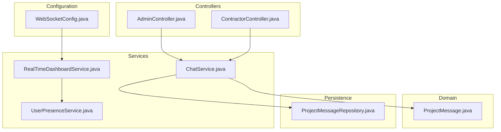
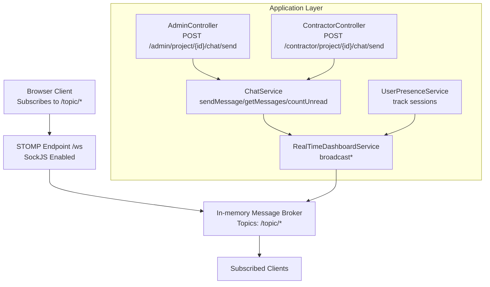
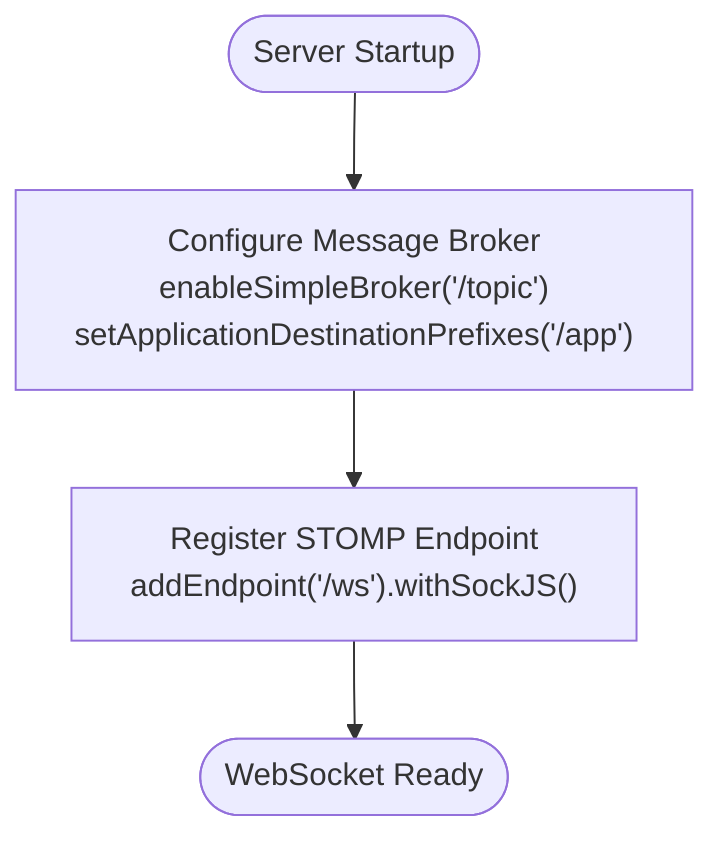
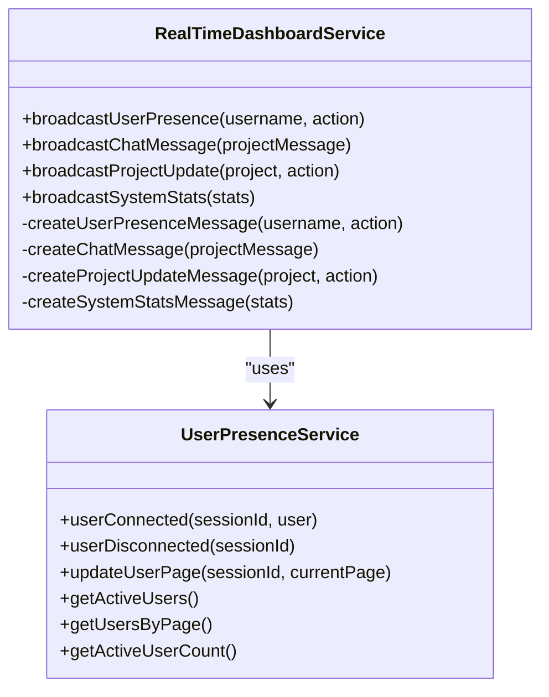
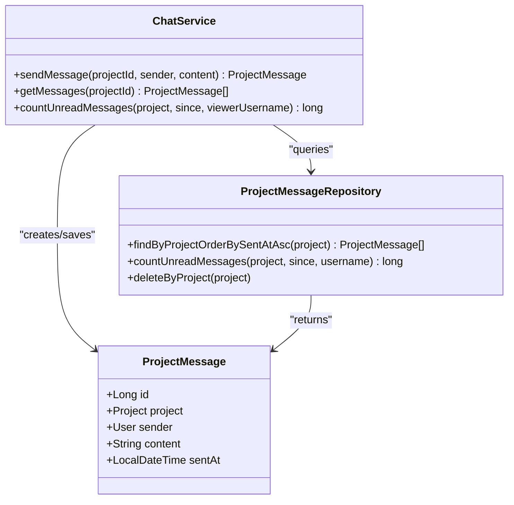
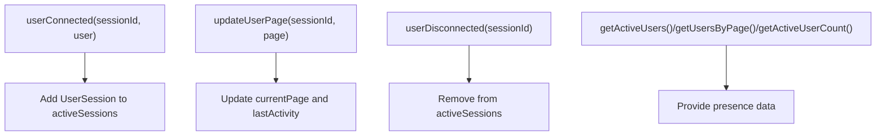
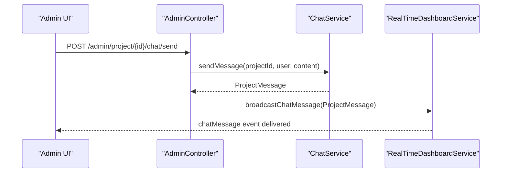
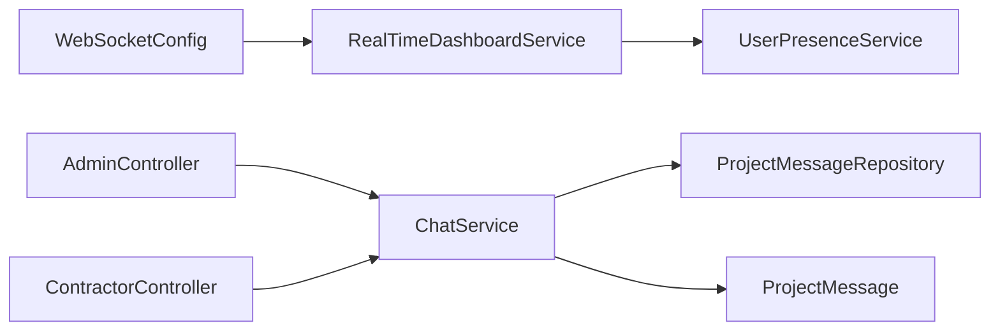

# Communication System

<cite>
**Referenced Files in This Document**
- [WebSocketConfig.java](file://src/main/java/root/cyb/mh/skylink_media_service/infrastructure/config/WebSocketConfig.java)
- [RealTimeDashboardService.java](file://src/main/java/root/cyb/mh/skylink_media_service/application/services/RealTimeDashboardService.java)
- [ChatService.java](file://src/main/java/root/cyb/mh/skylink_media_service/application/services/ChatService.java)
- [UserPresenceService.java](file://src/main/java/root/cyb/mh/skylink_media_service/application/services/UserPresenceService.java)
- [ProjectMessage.java](file://src/main/java/root/cyb/mh/skylink_media_service/domain/entities/ProjectMessage.java)
- [ProjectMessageRepository.java](file://src/main/java/root/cyb/mh/skylink_media_service/infrastructure/persistence/ProjectMessageRepository.java)
- [AdminController.java](file://src/main/java/root/cyb/mh/skylink_media_service/infrastructure/web/AdminController.java)
- [ContractorController.java](file://src/main/java/root/cyb/mh/skylink_media_service/infrastructure/web/ContractorController.java)
- [application.properties](file://src/main/resources/application.properties)
</cite>

## Table of Contents
1. [Introduction](#introduction)
2. [Project Structure](#project-structure)
3. [Core Components](#core-components)
4. [Architecture Overview](#architecture-overview)
5. [Detailed Component Analysis](#detailed-component-analysis)
6. [Dependency Analysis](#dependency-analysis)
7. [Performance Considerations](#performance-considerations)
8. [Troubleshooting Guide](#troubleshooting-guide)
9. [Conclusion](#conclusion)

## Introduction
This document describes the real-time communication system for the Skylink Media Service backend. It covers WebSocket configuration, chat message handling, live dashboard notifications, and user presence tracking. It also documents the ProjectMessage entity, message broadcasting mechanisms, and practical examples of chat workflows, notification systems, and user presence indicators. Scalability considerations for concurrent connections and message persistence are addressed to guide production deployment decisions.

## Project Structure
The real-time features are implemented across configuration, services, domain entities, repositories, and controllers:
- WebSocket configuration defines the STOMP endpoint and message broker destinations.
- Services encapsulate chat, presence, and dashboard broadcasting logic.
- Domain entities represent persisted chat messages.
- Repositories provide data access for chat and presence analytics.
- Controllers integrate chat actions with UI pages and trigger notifications.

**Diagram sources**
- [WebSocketConfig.java:1-28](file://src/main/java/root/cyb/mh/skylink_media_service/infrastructure/config/WebSocketConfig.java#L1-L28)
- [RealTimeDashboardService.java:1-143](file://src/main/java/root/cyb/mh/skylink_media_service/application/services/RealTimeDashboardService.java#L1-L143)
- [ChatService.java:1-45](file://src/main/java/root/cyb/mh/skylink_media_service/application/services/ChatService.java#L1-L45)
- [UserPresenceService.java:1-147](file://src/main/java/root/cyb/mh/skylink_media_service/application/services/UserPresenceService.java#L1-L147)
- [ProjectMessage.java:1-84](file://src/main/java/root/cyb/mh/skylink_media_service/domain/entities/ProjectMessage.java#L1-L84)
- [ProjectMessageRepository.java:1-23](file://src/main/java/root/cyb/mh/skylink_media_service/infrastructure/persistence/ProjectMessageRepository.java#L1-L23)
- [AdminController.java:1-775](file://src/main/java/root/cyb/mh/skylink_media_service/infrastructure/web/AdminController.java#L1-L775)
- [ContractorController.java:1-258](file://src/main/java/root/cyb/mh/skylink_media_service/infrastructure/web/ContractorController.java#L1-L258)

**Section sources**
- [WebSocketConfig.java:1-28](file://src/main/java/root/cyb/mh/skylink_media_service/infrastructure/config/WebSocketConfig.java#L1-L28)
- [RealTimeDashboardService.java:1-143](file://src/main/java/root/cyb/mh/skylink_media_service/application/services/RealTimeDashboardService.java#L1-L143)
- [ChatService.java:1-45](file://src/main/java/root/cyb/mh/skylink_media_service/application/services/ChatService.java#L1-L45)
- [UserPresenceService.java:1-147](file://src/main/java/root/cyb/mh/skylink_media_service/application/services/UserPresenceService.java#L1-L147)
- [ProjectMessage.java:1-84](file://src/main/java/root/cyb/mh/skylink_media_service/domain/entities/ProjectMessage.java#L1-L84)
- [ProjectMessageRepository.java:1-23](file://src/main/java/root/cyb/mh/skylink_media_service/infrastructure/persistence/ProjectMessageRepository.java#L1-L23)
- [AdminController.java:1-775](file://src/main/java/root/cyb/mh/skylink_media_service/infrastructure/web/AdminController.java#L1-L775)
- [ContractorController.java:1-258](file://src/main/java/root/cyb/mh/skylink_media_service/infrastructure/web/ContractorController.java#L1-L258)

## Core Components
- WebSocketConfig: Registers the STOMP endpoint and configures the in-memory broker for topics.
- RealTimeDashboardService: Broadcasts user presence, chat messages, project updates, and system stats to subscribed clients.
- ChatService: Handles sending and retrieving chat messages and counting unread messages.
- UserPresenceService: Tracks active sessions, current pages, and last activity; exposes presence metrics.
- ProjectMessage: JPA entity representing chat messages with sender, project, and timestamps.
- ProjectMessageRepository: Provides queries for message retrieval and unread counts.
- AdminController and ContractorController: Integrate chat UI flows, persist messages, and trigger notifications.

**Section sources**
- [WebSocketConfig.java:13-27](file://src/main/java/root/cyb/mh/skylink_media_service/infrastructure/config/WebSocketConfig.java#L13-L27)
- [RealTimeDashboardService.java:25-108](file://src/main/java/root/cyb/mh/skylink_media_service/application/services/RealTimeDashboardService.java#L25-L108)
- [ChatService.java:24-43](file://src/main/java/root/cyb/mh/skylink_media_service/application/services/ChatService.java#L24-L43)
- [UserPresenceService.java:20-86](file://src/main/java/root/cyb/mh/skylink_media_service/application/services/UserPresenceService.java#L20-L86)
- [ProjectMessage.java:6-31](file://src/main/java/root/cyb/mh/skylink_media_service/domain/entities/ProjectMessage.java#L6-L31)
- [ProjectMessageRepository.java:14-21](file://src/main/java/root/cyb/mh/skylink_media_service/infrastructure/persistence/ProjectMessageRepository.java#L14-L21)
- [AdminController.java:629-683](file://src/main/java/root/cyb/mh/skylink_media_service/infrastructure/web/AdminController.java#L629-L683)
- [ContractorController.java:190-256](file://src/main/java/root/cyb/mh/skylink_media_service/infrastructure/web/ContractorController.java#L190-L256)

## Architecture Overview
The system uses Spring WebSocket with STOMP over SockJS. Clients connect to the /ws endpoint and subscribe to topics such as /topic/chat, /topic/presence, /topic/projects, and /topic/dashboard. Application services publish events to these topics via SimpMessagingTemplate. Controllers orchestrate chat actions and trigger notifications.

**Diagram sources**
- [WebSocketConfig.java:22-27](file://src/main/java/root/cyb/mh/skylink_media_service/infrastructure/config/WebSocketConfig.java#L22-L27)
- [RealTimeDashboardService.java:25-108](file://src/main/java/root/cyb/mh/skylink_media_service/application/services/RealTimeDashboardService.java#L25-L108)
- [ChatService.java:24-43](file://src/main/java/root/cyb/mh/skylink_media_service/application/services/ChatService.java#L24-L43)
- [UserPresenceService.java:20-86](file://src/main/java/root/cyb/mh/skylink_media_service/application/services/UserPresenceService.java#L20-L86)
- [AdminController.java:649-683](file://src/main/java/root/cyb/mh/skylink_media_service/infrastructure/web/AdminController.java#L649-L683)
- [ContractorController.java:217-256](file://src/main/java/root/cyb/mh/skylink_media_service/infrastructure/web/ContractorController.java#L217-L256)

## Detailed Component Analysis

### WebSocket Configuration
- Enables a simple broker for topics and sets application destination prefixes.
- Registers the /ws endpoint with SockJS and allows cross-origin requests.

**Diagram sources**
- [WebSocketConfig.java:14-19](file://src/main/java/root/cyb/mh/skylink_media_service/infrastructure/config/WebSocketConfig.java#L14-L19)
- [WebSocketConfig.java:22-27](file://src/main/java/root/cyb/mh/skylink_media_service/infrastructure/config/WebSocketConfig.java#L22-L27)

**Section sources**
- [WebSocketConfig.java:13-27](file://src/main/java/root/cyb/mh/skylink_media_service/infrastructure/config/WebSocketConfig.java#L13-L27)

### RealTimeDashboardService
- Broadcasts four event types to topics:
  - Presence: userPresence
  - Chat: chatMessage
  - Projects: projectUpdate
  - Dashboard stats: systemStats
- Uses SimpMessagingTemplate to send JSON payloads to subscribed clients.
- Integrates with UserPresenceService for active user counts and page distribution.

**Diagram sources**
- [RealTimeDashboardService.java:25-108](file://src/main/java/root/cyb/mh/skylink_media_service/application/services/RealTimeDashboardService.java#L25-L108)
- [UserPresenceService.java:20-86](file://src/main/java/root/cyb/mh/skylink_media_service/application/services/UserPresenceService.java#L20-L86)

**Section sources**
- [RealTimeDashboardService.java:25-108](file://src/main/java/root/cyb/mh/skylink_media_service/application/services/RealTimeDashboardService.java#L25-L108)

### ChatService and ProjectMessage
- ChatService persists messages and retrieves historical messages for a project.
- Counts unread messages since a given timestamp for a specific viewer.
- ProjectMessage is a JPA entity with lazy project association, eager sender, TEXT content, and automatic timestamp.

**Diagram sources**
- [ChatService.java:24-43](file://src/main/java/root/cyb/mh/skylink_media_service/application/services/ChatService.java#L24-L43)
- [ProjectMessage.java:6-31](file://src/main/java/root/cyb/mh/skylink_media_service/domain/entities/ProjectMessage.java#L6-L31)
- [ProjectMessageRepository.java:14-21](file://src/main/java/root/cyb/mh/skylink_media_service/infrastructure/persistence/ProjectMessageRepository.java#L14-L21)

**Section sources**
- [ChatService.java:24-43](file://src/main/java/root/cyb/mh/skylink_media_service/application/services/ChatService.java#L24-L43)
- [ProjectMessage.java:6-31](file://src/main/java/root/cyb/mh/skylink_media_service/domain/entities/ProjectMessage.java#L6-L31)
- [ProjectMessageRepository.java:14-21](file://src/main/java/root/cyb/mh/skylink_media_service/infrastructure/persistence/ProjectMessageRepository.java#L14-L21)

### UserPresenceService
- Tracks active sessions in a concurrent map with session metadata.
- Updates last activity and current page for each session.
- Exposes presence metrics for UI indicators and broadcasts.

**Diagram sources**
- [UserPresenceService.java:20-86](file://src/main/java/root/cyb/mh/skylink_media_service/application/services/UserPresenceService.java#L20-L86)

**Section sources**
- [UserPresenceService.java:20-86](file://src/main/java/root/cyb/mh/skylink_media_service/application/services/UserPresenceService.java#L20-L86)

### Controllers: Chat Workflows
- AdminController handles admin chat actions and marks messages as read.
- ContractorController handles contractor chat actions and marks messages as read.
- Both controllers call ChatService to persist messages and optionally send email notifications.

**Diagram sources**
- [AdminController.java:649-683](file://src/main/java/root/cyb/mh/skylink_media_service/infrastructure/web/AdminController.java#L649-L683)
- [ChatService.java:24-30](file://src/main/java/root/cyb/mh/skylink_media_service/application/services/ChatService.java#L24-L30)
- [RealTimeDashboardService.java:45-53](file://src/main/java/root/cyb/mh/skylink_media_service/application/services/RealTimeDashboardService.java#L45-L53)

**Section sources**
- [AdminController.java:629-683](file://src/main/java/root/cyb/mh/skylink_media_service/infrastructure/web/AdminController.java#L629-L683)
- [ContractorController.java:190-256](file://src/main/java/root/cyb/mh/skylink_media_service/infrastructure/web/ContractorController.java#L190-L256)

## Dependency Analysis
- WebSocketConfig depends on Spring WebSocket and STOMP configuration.
- RealTimeDashboardService depends on SimpMessagingTemplate and UserPresenceService.
- ChatService depends on ProjectMessageRepository and ProjectRepository.
- Controllers depend on services and repositories to handle chat workflows.
- ProjectMessageRepository provides JPQL queries for message retrieval and unread counts.

**Diagram sources**
- [WebSocketConfig.java:13-27](file://src/main/java/root/cyb/mh/skylink_media_service/infrastructure/config/WebSocketConfig.java#L13-L27)
- [RealTimeDashboardService.java:19-23](file://src/main/java/root/cyb/mh/skylink_media_service/application/services/RealTimeDashboardService.java#L19-L23)
- [ChatService.java:18-22](file://src/main/java/root/cyb/mh/skylink_media_service/application/services/ChatService.java#L18-L22)
- [ProjectMessageRepository.java:14-21](file://src/main/java/root/cyb/mh/skylink_media_service/infrastructure/persistence/ProjectMessageRepository.java#L14-L21)
- [ProjectMessage.java:6-31](file://src/main/java/root/cyb/mh/skylink_media_service/domain/entities/ProjectMessage.java#L6-L31)
- [AdminController.java:83-98](file://src/main/java/root/cyb/mh/skylink_media_service/infrastructure/web/AdminController.java#L83-L98)
- [ContractorController.java:60-66](file://src/main/java/root/cyb/mh/skylink_media_service/infrastructure/web/ContractorController.java#L60-L66)

**Section sources**
- [WebSocketConfig.java:13-27](file://src/main/java/root/cyb/mh/skylink_media_service/infrastructure/config/WebSocketConfig.java#L13-L27)
- [RealTimeDashboardService.java:19-23](file://src/main/java/root/cyb/mh/skylink_media_service/application/services/RealTimeDashboardService.java#L19-L23)
- [ChatService.java:18-22](file://src/main/java/root/cyb/mh/skylink_media_service/application/services/ChatService.java#L18-L22)
- [ProjectMessageRepository.java:14-21](file://src/main/java/root/cyb/mh/skylink_media_service/infrastructure/persistence/ProjectMessageRepository.java#L14-L21)
- [ProjectMessage.java:6-31](file://src/main/java/root/cyb/mh/skylink_media_service/domain/entities/ProjectMessage.java#L6-L31)
- [AdminController.java:83-98](file://src/main/java/root/cyb/mh/skylink_media_service/infrastructure/web/AdminController.java#L83-L98)
- [ContractorController.java:60-66](file://src/main/java/root/cyb/mh/skylink_media_service/infrastructure/web/ContractorController.java#L60-L66)

## Performance Considerations
- Current configuration uses an in-memory message broker suitable for single-instance deployments. For horizontal scaling, replace with a broker supporting clustering (e.g., RabbitMQ, Apache Kafka) or Spring Cloud Stream.
- Presence tracking uses an in-memory ConcurrentHashMap; for multi-instance deployments, externalize to Redis or a shared cache.
- Message persistence relies on JPA with PostgreSQL; ensure proper indexing on project_id and sent_at for efficient queries.
- Consider rate limiting and message size limits on the WebSocket server to prevent resource exhaustion.
- Offload heavy analytics (e.g., usersByPage aggregation) to periodic batch jobs or caches to reduce real-time overhead.

[No sources needed since this section provides general guidance]

## Troubleshooting Guide
- WebSocket not available: RealTimeDashboardService checks for a present messaging template and logs a debug message when unavailable. Ensure WebSocketConfig is loaded and the application context initializes SimpMessagingTemplate.
- Messages not appearing: Verify clients subscribe to the correct topics (/topic/chat, /topic/presence, /topic/projects, /topic/dashboard) and that broadcast methods are invoked after message persistence.
- Presence counters incorrect: Confirm UserPresenceService receives userConnected and userDisconnected events and that updateUserPage is called on navigation.
- Unread counts zero unexpectedly: Ensure the since parameter is provided and matches the viewer’s last read timestamp stored in the appropriate read-log repository.

**Section sources**
- [RealTimeDashboardService.java:25-33](file://src/main/java/root/cyb/mh/skylink_media_service/application/services/RealTimeDashboardService.java#L25-L33)
- [UserPresenceService.java:20-38](file://src/main/java/root/cyb/mh/skylink_media_service/application/services/UserPresenceService.java#L20-L38)
- [ProjectMessageRepository.java:18-19](file://src/main/java/root/cyb/mh/skylink_media_service/infrastructure/persistence/ProjectMessageRepository.java#L18-L19)

## Conclusion
The real-time communication system integrates WebSocket-based STOMP messaging with Spring services to deliver live chat, presence, project updates, and dashboard statistics. Controllers coordinate chat workflows, persist messages, and trigger notifications. For production, consider clustering the message broker, externalizing presence state, and optimizing database queries and caching to support concurrent connections and high throughput.