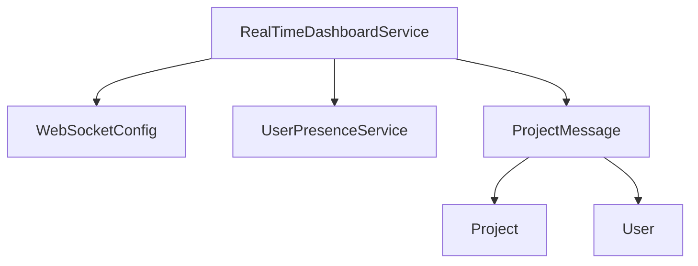
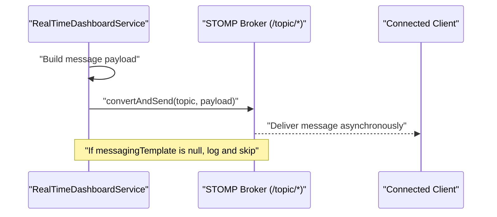
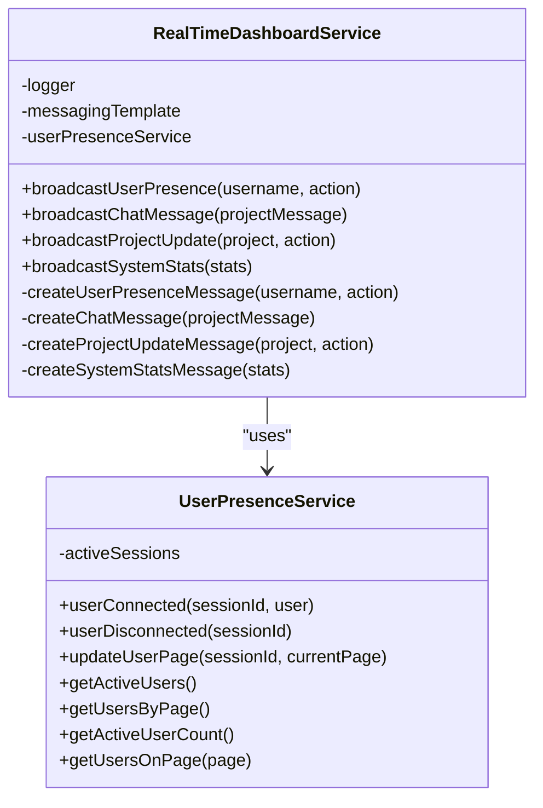
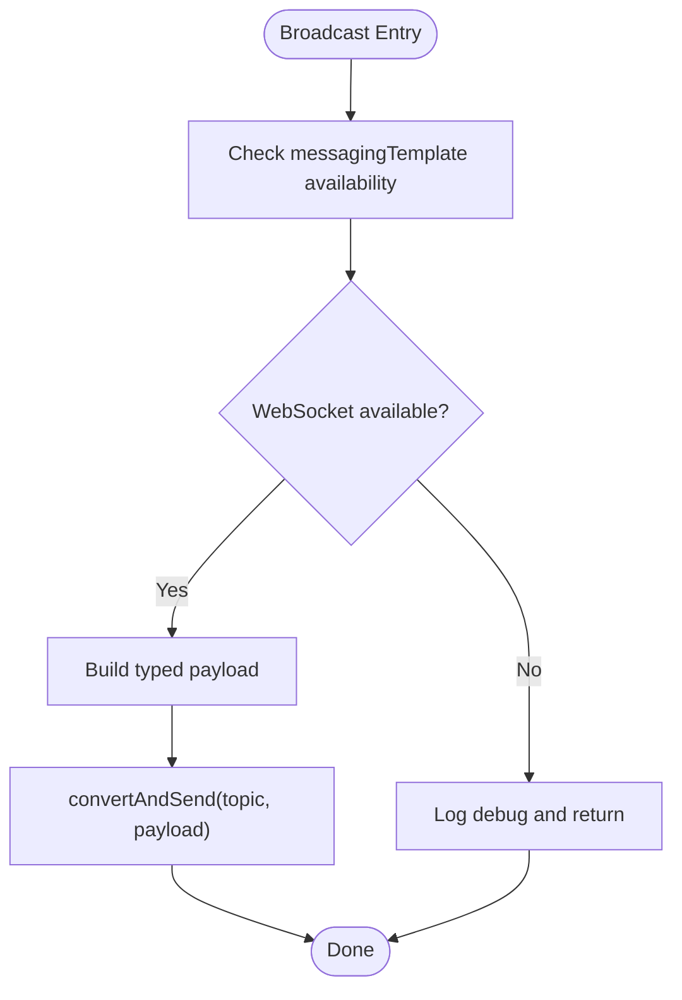
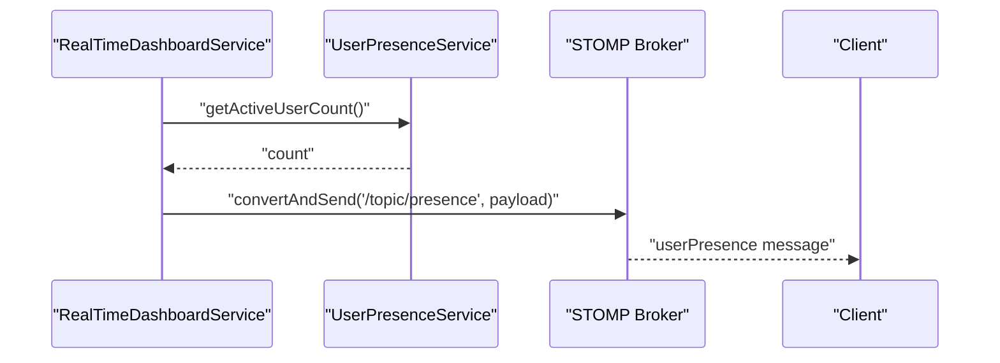
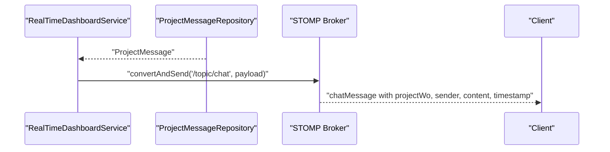
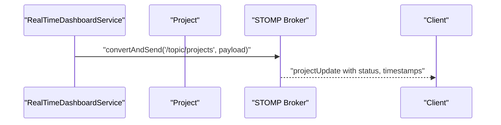
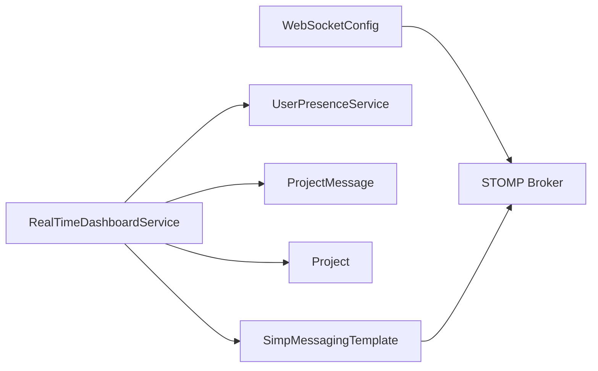

# Real-Time Dashboard Service

<cite>
**Referenced Files in This Document**
- [RealTimeDashboardService.java](file://src/main/java/root/cyb/mh/skylink_media_service/application/services/RealTimeDashboardService.java)
- [UserPresenceService.java](file://src/main/java/root/cyb/mh/skylink_media_service/application/services/UserPresenceService.java)
- [WebSocketConfig.java](file://src/main/java/root/cyb/mh/skylink_media_service/infrastructure/config/WebSocketConfig.java)
- [ProjectMessage.java](file://src/main/java/root/cyb/mh/skylink_media_service/domain/entities/ProjectMessage.java)
- [Project.java](file://src/main/java/root/cyb/mh/skylink_media_service/domain/entities/Project.java)
- [User.java](file://src/main/java/root/cyb/mh/skylink_media_service/domain/entities/User.java)
- [ProjectOpenedEvent.java](file://src/main/java/root/cyb/mh/skylink_media_service/domain/events/ProjectOpenedEvent.java)
- [ProjectCompletedEvent.java](file://src/main/java/root/cyb/mh/skylink_media_service/domain/events/ProjectCompletedEvent.java)
</cite>

## Table of Contents
1. [Introduction](#introduction)
2. [Project Structure](#project-structure)
3. [Core Components](#core-components)
4. [Architecture Overview](#architecture-overview)
5. [Detailed Component Analysis](#detailed-component-analysis)
6. [Dependency Analysis](#dependency-analysis)
7. [Performance Considerations](#performance-considerations)
8. [Troubleshooting Guide](#troubleshooting-guide)
9. [Conclusion](#conclusion)

## Introduction
This document explains the RealTimeDashboardService component and its role in broadcasting real-time updates to connected clients. It covers the three primary broadcast methods for user presence, project chat notifications, and project lifecycle changes, along with the DashboardStats DTO for system metrics. It also documents message payload structures, routing semantics, integration with UserPresenceService, error handling when WebSocket is unavailable, and performance considerations for high-volume broadcasts.

## Project Structure
The RealTimeDashboardService resides in the application services layer and integrates with Spring’s WebSocket/SIMP messaging infrastructure. It relies on:
- WebSocket configuration enabling a simple broker for topics
- Domain entities for project and chat messages
- Presence tracking via UserPresenceService

**Diagram sources**
- [RealTimeDashboardService.java:14-142](file://src/main/java/root/cyb/mh/skylink_media_service/application/services/RealTimeDashboardService.java#L14-L142)
- [WebSocketConfig.java:9-28](file://src/main/java/root/cyb/mh/skylink_media_service/infrastructure/config/WebSocketConfig.java#L9-L28)
- [UserPresenceService.java:13-146](file://src/main/java/root/cyb/mh/skylink_media_service/application/services/UserPresenceService.java#L13-L146)
- [ProjectMessage.java:6-83](file://src/main/java/root/cyb/mh/skylink_media_service/domain/entities/ProjectMessage.java#L6-L83)
- [Project.java:8-261](file://src/main/java/root/cyb/mh/skylink_media_service/domain/entities/Project.java#L8-L261)
- [User.java:6-81](file://src/main/java/root/cyb/mh/skylink_media_service/domain/entities/User.java#L6-L81)

**Section sources**
- [RealTimeDashboardService.java:14-142](file://src/main/java/root/cyb/mh/skylink_media_service/application/services/RealTimeDashboardService.java#L14-L142)
- [WebSocketConfig.java:9-28](file://src/main/java/root/cyb/mh/skylink_media_service/infrastructure/config/WebSocketConfig.java#L9-L28)

## Core Components
- RealTimeDashboardService: Central broadcaster for user presence, chat messages, project updates, and system stats. It uses SimpMessagingTemplate to publish to STOMP topics and delegates presence counts to UserPresenceService.
- UserPresenceService: Tracks active sessions and exposes presence-related metrics and page distribution.
- WebSocketConfig: Registers STOMP endpoint and enables a simple broker for topics such as /topic/presence, /topic/chat, /topic/projects, and /topic/dashboard.
- Domain entities: ProjectMessage, Project, and User provide the data for constructing broadcast payloads.

Key responsibilities:
- Broadcast routing: /topic/presence, /topic/chat, /topic/projects, /topic/dashboard
- Payload construction: type identifiers, project references, sender information, timestamps
- Metrics aggregation: active user counts and page distribution for presence and stats

**Section sources**
- [RealTimeDashboardService.java:19-23](file://src/main/java/root/cyb/mh/skylink_media_service/application/services/RealTimeDashboardService.java#L19-L23)
- [WebSocketConfig.java:14-27](file://src/main/java/root/cyb/mh/skylink_media_service/infrastructure/config/WebSocketConfig.java#L14-L27)
- [UserPresenceService.java:18-72](file://src/main/java/root/cyb/mh/skylink_media_service/application/services/UserPresenceService.java#L18-L72)

## Architecture Overview
RealTimeDashboardService publishes structured JSON messages to STOMP topics. Clients subscribe to topics to receive real-time updates. The service gracefully handles scenarios where WebSocket is unavailable by logging and skipping broadcasts.

**Diagram sources**
- [RealTimeDashboardService.java:25-33](file://src/main/java/root/cyb/mh/skylink_media_service/application/services/RealTimeDashboardService.java#L25-L33)
- [WebSocketConfig.java:14-19](file://src/main/java/root/cyb/mh/skylink_media_service/infrastructure/config/WebSocketConfig.java#L14-L19)

## Detailed Component Analysis

### RealTimeDashboardService
Responsibilities:
- Broadcast user presence updates to /topic/presence
- Broadcast chat messages to /topic/chat
- Broadcast project lifecycle updates to /topic/projects
- Broadcast system metrics to /topic/dashboard
- Graceful degradation when WebSocket is unavailable

Message payload structures:
- userPresence
  - type: "userPresence"
  - username: String
  - action: String
  - activeUsers: Integer (from UserPresenceService)
  - timestamp: Number (milliseconds)

- chatMessage
  - type: "chatMessage"
  - projectId: Number
  - projectWo: String
  - sender: String
  - content: String
  - timestamp: String (ISO-like from entity)

- projectUpdate
  - type: "projectUpdate"
  - projectId: Number
  - workOrderNumber: String
  - action: String
  - status: Enum name or null
  - timestamp: Number (milliseconds)

- systemStats
  - type: "systemStats"
  - totalUsers: Number
  - activeUsers: Number
  - totalProjects: Number
  - activeProjects: Number
  - recentLogins24h: Number
  - usersByPage: Map<String, Number>
  - timestamp: Number (milliseconds)

Integration with UserPresenceService:
- Uses active user count and page distribution for presence and stats broadcasts.

Routing and error handling:
- Each broadcast method checks for messagingTemplate availability and logs a debug message when unavailable, returning early to avoid errors.

**Diagram sources**
- [RealTimeDashboardService.java:14-142](file://src/main/java/root/cyb/mh/skylink_media_service/application/services/RealTimeDashboardService.java#L14-L142)
- [UserPresenceService.java:13-146](file://src/main/java/root/cyb/mh/skylink_media_service/application/services/UserPresenceService.java#L13-L146)

**Section sources**
- [RealTimeDashboardService.java:25-108](file://src/main/java/root/cyb/mh/skylink_media_service/application/services/RealTimeDashboardService.java#L25-L108)
- [UserPresenceService.java:48-72](file://src/main/java/root/cyb/mh/skylink_media_service/application/services/UserPresenceService.java#L48-L72)

### Message Routing and Payloads
- Routing
  - Presence: /topic/presence
  - Chat: /topic/chat
  - Projects: /topic/projects
  - Dashboard stats: /topic/dashboard

- Payloads
  - Presence: includes activeUsers count from UserPresenceService
  - Chat: includes project reference (id and work order number), sender username, content, and timestamp from the message entity
  - Project: includes project identity (id and work order number), action, status, and timestamp
  - Stats: includes aggregates and per-page distribution

**Diagram sources**
- [RealTimeDashboardService.java:25-33](file://src/main/java/root/cyb/mh/skylink_media_service/application/services/RealTimeDashboardService.java#L25-L33)
- [RealTimeDashboardService.java:45-53](file://src/main/java/root/cyb/mh/skylink_media_service/application/services/RealTimeDashboardService.java#L45-L53)
- [RealTimeDashboardService.java:66-74](file://src/main/java/root/cyb/mh/skylink_media_service/application/services/RealTimeDashboardService.java#L66-L74)
- [RealTimeDashboardService.java:87-95](file://src/main/java/root/cyb/mh/skylink_media_service/application/services/RealTimeDashboardService.java#L87-L95)

**Section sources**
- [RealTimeDashboardService.java:35-43](file://src/main/java/root/cyb/mh/skylink_media_service/application/services/RealTimeDashboardService.java#L35-L43)
- [RealTimeDashboardService.java:55-64](file://src/main/java/root/cyb/mh/skylink_media_service/application/services/RealTimeDashboardService.java#L55-L64)
- [RealTimeDashboardService.java:76-85](file://src/main/java/root/cyb/mh/skylink_media_service/application/services/RealTimeDashboardService.java#L76-L85)
- [RealTimeDashboardService.java:97-108](file://src/main/java/root/cyb/mh/skylink_media_service/application/services/RealTimeDashboardService.java#L97-L108)

### Integration with UserPresenceService
- Active user count is included in presence and system stats broadcasts.
- Page distribution is exposed for analytics and UI displays.

Usage patterns:
- Presence broadcasts include current activeUsers.
- System stats broadcast includes usersByPage map aggregated from active sessions.

**Section sources**
- [RealTimeDashboardService.java:40](file://src/main/java/root/cyb/mh/skylink_media_service/application/services/RealTimeDashboardService.java#L40)
- [UserPresenceService.java:61-68](file://src/main/java/root/cyb/mh/skylink_media_service/application/services/UserPresenceService.java#L61-L68)

### Domain Entities Used in Broadcasting
- ProjectMessage: Provides projectId, project work order number, sender username, content, and sent timestamp.
- Project: Provides projectId, work order number, status, and timestamps.
- User: Provides username for sender identification.

**Section sources**
- [ProjectMessage.java:52-82](file://src/main/java/root/cyb/mh/skylink_media_service/domain/entities/ProjectMessage.java#L52-L82)
- [Project.java:117-245](file://src/main/java/root/cyb/mh/skylink_media_service/domain/entities/Project.java#L117-L245)
- [User.java:52-63](file://src/main/java/root/cyb/mh/skylink_media_service/domain/entities/User.java#L52-L63)

### Example Workflows

#### Broadcast User Presence

**Diagram sources**
- [RealTimeDashboardService.java:25-43](file://src/main/java/root/cyb/mh/skylink_media_service/application/services/RealTimeDashboardService.java#L25-L43)
- [UserPresenceService.java:70-72](file://src/main/java/root/cyb/mh/skylink_media_service/application/services/UserPresenceService.java#L70-L72)

#### Broadcast Chat Message

**Diagram sources**
- [RealTimeDashboardService.java:45-64](file://src/main/java/root/cyb/mh/skylink_media_service/application/services/RealTimeDashboardService.java#L45-L64)
- [ProjectMessage.java:52-82](file://src/main/java/root/cyb/mh/skylink_media_service/domain/entities/ProjectMessage.java#L52-L82)

#### Broadcast Project Update

**Diagram sources**
- [RealTimeDashboardService.java:66-85](file://src/main/java/root/cyb/mh/skylink_media_service/application/services/RealTimeDashboardService.java#L66-L85)
- [Project.java:209-236](file://src/main/java/root/cyb/mh/skylink_media_service/domain/entities/Project.java#L209-L236)

## Dependency Analysis
- RealTimeDashboardService depends on:
  - SimpMessagingTemplate for publishing to topics
  - UserPresenceService for active user metrics
  - Domain entities for payload construction
- WebSocketConfig defines the broker destinations and endpoint registration

Potential circular dependencies:
- None observed among the analyzed components.

External integration points:
- STOMP broker for asynchronous delivery
- Client-side subscriptions to /topic/* destinations

**Diagram sources**
- [RealTimeDashboardService.java:19-23](file://src/main/java/root/cyb/mh/skylink_media_service/application/services/RealTimeDashboardService.java#L19-L23)
- [WebSocketConfig.java:14-19](file://src/main/java/root/cyb/mh/skylink_media_service/infrastructure/config/WebSocketConfig.java#L14-L19)

**Section sources**
- [RealTimeDashboardService.java:19-23](file://src/main/java/root/cyb/mh/skylink_media_service/application/services/RealTimeDashboardService.java#L19-L23)
- [WebSocketConfig.java:14-19](file://src/main/java/root/cyb/mh/skylink_media_service/infrastructure/config/WebSocketConfig.java#L14-L19)

## Performance Considerations
- Topic fan-out: Broadcasting to multiple subscribers scales horizontally with client count; keep payloads compact.
- Payload size: Presence and stats payloads are lightweight; chat and project payloads include identifiers and status, which are small.
- Frequency: Presence and stats can be rate-limited if needed; chat and project updates are event-driven.
- Memory: In-memory broker is suitable for moderate loads; consider clustering or external brokers for high volume.
- Serialization: Using Map-based payloads avoids heavy serialization overhead.
- Backpressure: STOMP broker manages delivery; monitor queue sizes under bursty traffic.

[No sources needed since this section provides general guidance]

## Troubleshooting Guide
Common issues and resolutions:
- WebSocket unavailable
  - Symptom: Broadcast methods log a debug message and return without sending.
  - Cause: messagingTemplate injection failure or missing WebSocket configuration.
  - Resolution: Verify WebSocketConfig is active and reachable; ensure clients connect to /ws.

- Missing presence or stats updates
  - Symptom: Clients do not receive presence or stats messages.
  - Causes: Incorrect subscription topic, client disconnect, or inactive broker.
  - Resolution: Confirm client subscribes to /topic/presence or /topic/dashboard; verify WebSocketConfig registration.

- Chat messages not appearing
  - Symptom: Chat messages do not show up for clients.
  - Causes: Client-side polling or rendering logic issues unrelated to server broadcasting.
  - Resolution: Review client-side message loading and polling logic; ensure proper subscription to /topic/chat.

- Timestamp inconsistencies
  - Symptom: Unexpected timestamps in payloads.
  - Resolution: Presence uses milliseconds; chat uses entity timestamp string. Align client parsing accordingly.

**Section sources**
- [RealTimeDashboardService.java:26-29](file://src/main/java/root/cyb/mh/skylink_media_service/application/services/RealTimeDashboardService.java#L26-L29)
- [RealTimeDashboardService.java:47-49](file://src/main/java/root/cyb/mh/skylink_media_service/application/services/RealTimeDashboardService.java#L47-L49)
- [RealTimeDashboardService.java:68-70](file://src/main/java/root/cyb/mh/skylink_media_service/application/services/RealTimeDashboardService.java#L68-L70)
- [RealTimeDashboardService.java:89-91](file://src/main/java/root/cyb/mh/skylink_media_service/application/services/RealTimeDashboardService.java#L89-L91)

## Conclusion
RealTimeDashboardService provides a concise, robust mechanism for broadcasting real-time updates across user presence, chat, project lifecycle, and system metrics. Its design leverages Spring’s STOMP/SIMP infrastructure, integrates with UserPresenceService for accurate presence metrics, and gracefully degrades when WebSocket is unavailable. By keeping payloads minimal and leveraging event-driven updates, it supports scalable, low-latency dashboards and live monitoring experiences.