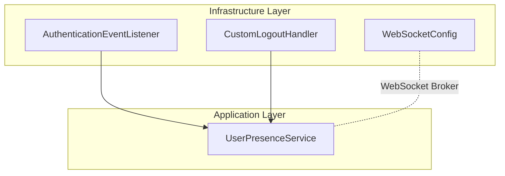
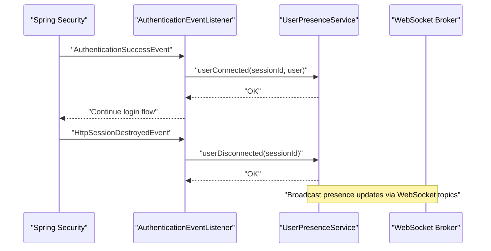
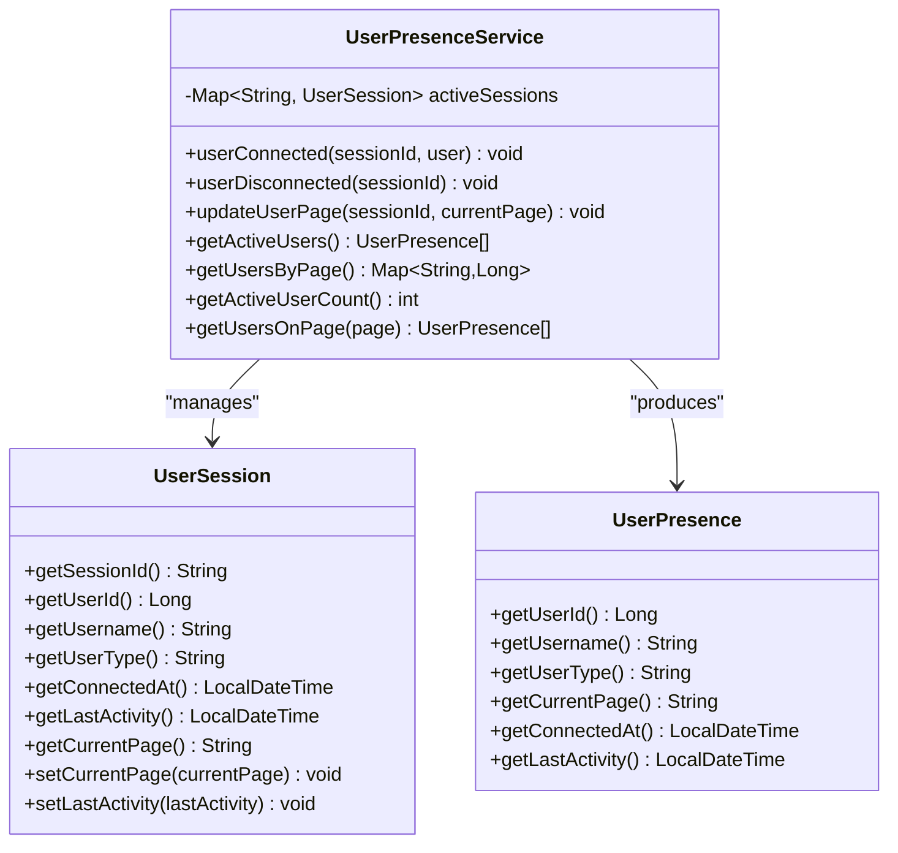
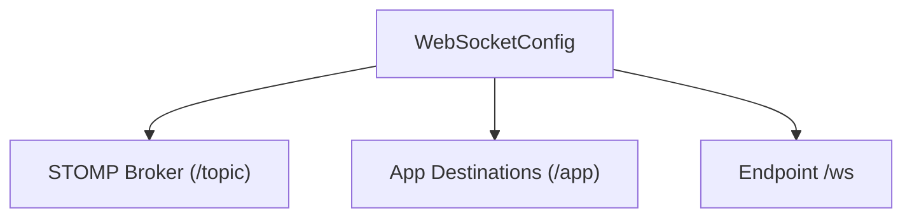
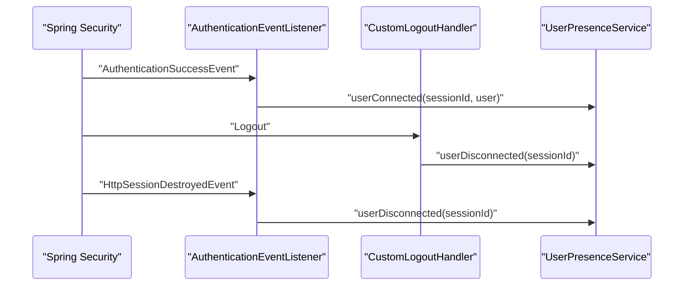
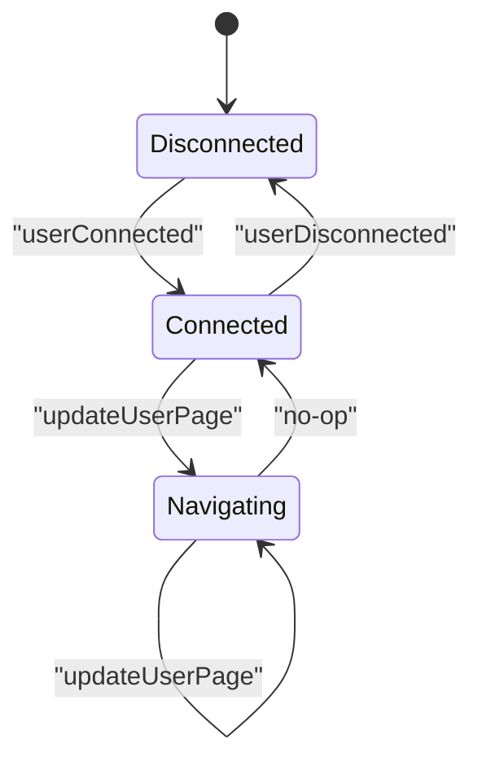
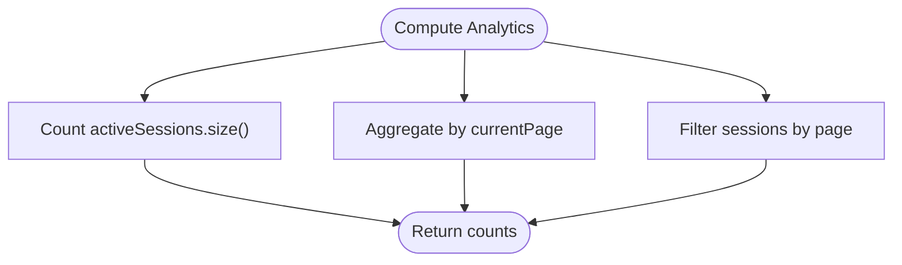
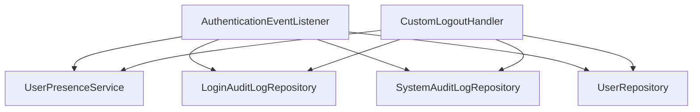

# User Presence Service

<cite>
**Referenced Files in This Document**
- [UserPresenceService.java](file://src/main/java/root/cyb/mh/skylink_media_service/application/services/UserPresenceService.java)
- [WebSocketConfig.java](file://src/main/java/root/cyb/mh/skylink_media_service/infrastructure/config/WebSocketConfig.java)
- [AuthenticationEventListener.java](file://src/main/java/root/cyb/mh/skylink_media_service/infrastructure/security/AuthenticationEventListener.java)
- [CustomLogoutHandler.java](file://src/main/java/root/cyb/mh/skylink_media_service/infrastructure/security/CustomLogoutHandler.java)
</cite>

## Table of Contents
1. [Introduction](#introduction)
2. [Project Structure](#project-structure)
3. [Core Components](#core-components)
4. [Architecture Overview](#architecture-overview)
5. [Detailed Component Analysis](#detailed-component-analysis)
6. [Dependency Analysis](#dependency-analysis)
7. [Performance Considerations](#performance-considerations)
8. [Troubleshooting Guide](#troubleshooting-guide)
9. [Conclusion](#conclusion)
10. [Appendices](#appendices)

## Introduction
This document describes the UserPresenceService component responsible for tracking user online status and activity levels. It explains how sessions are managed, presence state is tracked, and active user counts are computed. It also documents the integration with Spring WebSocket for real-time presence updates, the broadcast mechanism for presence updates, presence state transitions, session timeout handling, and cleanup procedures. Finally, it provides examples of presence monitoring, user activity analytics, and dashboard statistics integration, along with scalability and persistence considerations.

## Project Structure
The UserPresenceService resides in the application services layer and integrates with Spring Security and Spring WebSocket infrastructure. The primary files involved are:
- Application service: UserPresenceService
- WebSocket configuration: WebSocketConfig
- Security integration: AuthenticationEventListener and CustomLogoutHandler

**Diagram sources**
- [UserPresenceService.java:14-147](file://src/main/java/root/cyb/mh/skylink_media_service/application/services/UserPresenceService.java#L14-L147)
- [WebSocketConfig.java:11-29](file://src/main/java/root/cyb/mh/skylink_media_service/infrastructure/config/WebSocketConfig.java#L11-L29)
- [AuthenticationEventListener.java:26-202](file://src/main/java/root/cyb/mh/skylink_media_service/infrastructure/security/AuthenticationEventListener.java#L26-L202)
- [CustomLogoutHandler.java:25-117](file://src/main/java/root/cyb/mh/skylink_media_service/infrastructure/security/CustomLogoutHandler.java#L25-L117)

**Section sources**
- [UserPresenceService.java:14-147](file://src/main/java/root/cyb/mh/skylink_media_service/application/services/UserPresenceService.java#L14-L147)
- [WebSocketConfig.java:11-29](file://src/main/java/root/cyb/mh/skylink_media_service/infrastructure/config/WebSocketConfig.java#L11-L29)
- [AuthenticationEventListener.java:26-202](file://src/main/java/root/cyb/mh/skylink_media_service/infrastructure/security/AuthenticationEventListener.java#L26-L202)
- [CustomLogoutHandler.java:25-117](file://src/main/java/root/cyb/mh/skylink_media_service/infrastructure/security/CustomLogoutHandler.java#L25-L117)

## Core Components
- UserPresenceService: Tracks active sessions, user presence, and provides analytics such as active user counts and per-page distribution.
- WebSocketConfig: Enables a STOMP over SockJS WebSocket broker for real-time messaging.
- AuthenticationEventListener: Integrates presence updates with successful logins and session destruction.
- CustomLogoutHandler: Integrates presence updates with logout events.

Key responsibilities:
- Session lifecycle management (connect/disconnect/update).
- Presence state tracking (connected time, last activity, current page).
- Analytics: total active users, per-page distribution, and per-user presence snapshots.
- Integration hooks for WebSocket-based broadcasting of presence updates.

**Section sources**
- [UserPresenceService.java:18-147](file://src/main/java/root/cyb/mh/skylink_media_service/application/services/UserPresenceService.java#L18-L147)
- [WebSocketConfig.java:14-27](file://src/main/java/root/cyb/mh/skylink_media_service/infrastructure/config/WebSocketConfig.java#L14-L27)
- [AuthenticationEventListener.java:42-89](file://src/main/java/root/cyb/mh/skylink_media_service/infrastructure/security/AuthenticationEventListener.java#L42-L89)
- [CustomLogoutHandler.java:41-87](file://src/main/java/root/cyb/mh/skylink_media_service/infrastructure/security/CustomLogoutHandler.java#L41-L87)

## Architecture Overview
The presence tracking architecture combines in-memory session storage with Spring WebSocket for real-time updates. Authentication and logout events trigger presence updates, ensuring accurate online/offline state and activity timestamps.

**Diagram sources**
- [AuthenticationEventListener.java:42-89](file://src/main/java/root/cyb/mh/skylink_media_service/infrastructure/security/AuthenticationEventListener.java#L42-L89)
- [AuthenticationEventListener.java:122-167](file://src/main/java/root/cyb/mh/skylink_media_service/infrastructure/security/AuthenticationEventListener.java#L122-L167)
- [UserPresenceService.java:20-38](file://src/main/java/root/cyb/mh/skylink_media_service/application/services/UserPresenceService.java#L20-L38)
- [WebSocketConfig.java:14-27](file://src/main/java/root/cyb/mh/skylink_media_service/infrastructure/config/WebSocketConfig.java#L14-L27)

## Detailed Component Analysis

### UserPresenceService
Responsibilities:
- Maintains an in-memory map of active sessions keyed by session ID.
- Records connection time, username, role, and default page on connect.
- Updates last activity timestamp and current page on navigation.
- Provides presence snapshots and analytics (active users, per-page counts, per-page lists).

Data model:
- UserSession: stores session metadata and timestamps.
- UserPresence: immutable snapshot for external consumption.

Core methods:
- userConnected(sessionId, user): creates and stores a session.
- userDisconnected(sessionId): removes a session.
- updateUserPage(sessionId, currentPage): updates current page and last activity.
- getActiveUsers(): returns presence snapshots for all active sessions.
- getUsersByPage(): counts users per page.
- getActiveUserCount(): returns total active sessions.
- getUsersOnPage(page): returns presence snapshots for users on a given page.

**Diagram sources**
- [UserPresenceService.java:18-147](file://src/main/java/root/cyb/mh/skylink_media_service/application/services/UserPresenceService.java#L18-L147)

**Section sources**
- [UserPresenceService.java:18-147](file://src/main/java/root/cyb/mh/skylink_media_service/application/services/UserPresenceService.java#L18-L147)

### WebSocket Integration
The WebSocket configuration enables a simple broker for broadcasting messages to subscribed clients. While the UserPresenceService does not directly publish to WebSocket topics, it is designed to integrate with a WebSocket endpoint that can broadcast presence updates.

Key elements:
- Broker destination prefix: "/topic"
- Application destination prefix: "/app"
- STOMP endpoint: "/ws" with SockJS fallback

**Diagram sources**
- [WebSocketConfig.java:14-27](file://src/main/java/root/cyb/mh/skylink_media_service/infrastructure/config/WebSocketConfig.java#L14-L27)

**Section sources**
- [WebSocketConfig.java:14-27](file://src/main/java/root/cyb/mh/skylink_media_service/infrastructure/config/WebSocketConfig.java#L14-L27)

### Authentication and Logout Event Integration
Presence updates are triggered by Spring Security events:
- On successful login: AuthenticationSuccessListener invokes userConnected.
- On session destruction: HttpSessionDestroyedListener invokes userDisconnected.
- On logout: CustomLogoutHandler invokes userDisconnected.

**Diagram sources**
- [AuthenticationEventListener.java:42-89](file://src/main/java/root/cyb/mh/skylink_media_service/infrastructure/security/AuthenticationEventListener.java#L42-L89)
- [AuthenticationEventListener.java:122-167](file://src/main/java/root/cyb/mh/skylink_media_service/infrastructure/security/AuthenticationEventListener.java#L122-L167)
- [CustomLogoutHandler.java:41-87](file://src/main/java/root/cyb/mh/skylink_media_service/infrastructure/security/CustomLogoutHandler.java#L41-L87)
- [UserPresenceService.java:20-38](file://src/main/java/root/cyb/mh/skylink_media_service/application/services/UserPresenceService.java#L20-L38)

**Section sources**
- [AuthenticationEventListener.java:42-89](file://src/main/java/root/cyb/mh/skylink_media_service/infrastructure/security/AuthenticationEventListener.java#L42-L89)
- [AuthenticationEventListener.java:122-167](file://src/main/java/root/cyb/mh/skylink_media_service/infrastructure/security/AuthenticationEventListener.java#L122-L167)
- [CustomLogoutHandler.java:41-87](file://src/main/java/root/cyb/mh/skylink_media_service/infrastructure/security/CustomLogoutHandler.java#L41-L87)
- [UserPresenceService.java:20-38](file://src/main/java/root/cyb/mh/skylink_media_service/application/services/UserPresenceService.java#L20-L38)

### Presence State Transitions
Presence state transitions are driven by session lifecycle events:
- Connect: New session created with connectedAt and lastActivity equal to connect time.
- Navigate: updateUserPage updates lastActivity and current page.
- Disconnect: Session removed on logout or session destroy.

**Diagram sources**
- [UserPresenceService.java:20-46](file://src/main/java/root/cyb/mh/skylink_media_service/application/services/UserPresenceService.java#L20-L46)
- [UserPresenceService.java:89-118](file://src/main/java/root/cyb/mh/skylink_media_service/application/services/UserPresenceService.java#L89-L118)

**Section sources**
- [UserPresenceService.java:20-46](file://src/main/java/root/cyb/mh/skylink_media_service/application/services/UserPresenceService.java#L20-L46)
- [UserPresenceService.java:89-118](file://src/main/java/root/cyb/mh/skylink_media_service/application/services/UserPresenceService.java#L89-L118)

### Active User Counting Mechanisms
- Total active users: derived from the number of entries in the activeSessions map.
- Per-page distribution: aggregated counts grouped by current page.
- Per-page user list: filtered presence snapshots for a given page.

**Diagram sources**
- [UserPresenceService.java:70-86](file://src/main/java/root/cyb/mh/skylink_media_service/application/services/UserPresenceService.java#L70-L86)

**Section sources**
- [UserPresenceService.java:70-86](file://src/main/java/root/cyb/mh/skylink_media_service/application/services/UserPresenceService.java#L70-L86)

### Broadcast Mechanism and Real-Time Updates
While the UserPresenceService itself does not directly publish to WebSocket topics, the design supports real-time presence updates through the configured WebSocket broker. To implement broadcast:
- Subscribe to presence changes in a WebSocket endpoint.
- Publish presence snapshots to "/topic/presence" or similar.
- Clients receive updates and render presence indicators.

Integration points:
- WebSocketConfig defines broker destinations and endpoint registration.
- Authentication and logout events update presence state; a controller can publish updates after state changes.

Note: The broadcastUserPresence method is not present in the current codebase. Implementing a broadcast method would involve publishing to the STOMP broker after updating presence state.

**Section sources**
- [WebSocketConfig.java:14-27](file://src/main/java/root/cyb/mh/skylink_media_service/infrastructure/config/WebSocketConfig.java#L14-L27)

### Session Timeout Handling and Cleanup
- Automatic cleanup: userDisconnected is invoked on session destruction, removing stale sessions.
- Manual cleanup: userDisconnected can be called on explicit logout.
- Activity tracking: lastActivity is updated on navigation, enabling idle detection outside this service.

Cleanup procedures:
- Remove session from activeSessions on disconnect.
- Persist login/logout audit logs alongside presence updates.

**Section sources**
- [AuthenticationEventListener.java:122-167](file://src/main/java/root/cyb/mh/skylink_media_service/infrastructure/security/AuthenticationEventListener.java#L122-L167)
- [CustomLogoutHandler.java:41-87](file://src/main/java/root/cyb/mh/skylink_media_service/infrastructure/security/CustomLogoutHandler.java#L41-L87)
- [UserPresenceService.java:33-38](file://src/main/java/root/cyb/mh/skylink_media_service/application/services/UserPresenceService.java#L33-L38)

### Examples: Presence Monitoring, Analytics, and Dashboard Integration
- Presence monitoring:
  - Retrieve active users and render online indicators.
  - Track per-page distribution to monitor popular areas.
- User activity analytics:
  - Compute average session duration using connectedAt and lastActivity.
  - Identify inactive users based on lastActivity thresholds.
- Dashboard statistics:
  - Display total active users and per-page counts.
  - Provide drill-down to users on a specific page.

These examples rely on the existing APIs: getActiveUsers, getUsersByPage, getActiveUserCount, and getUsersOnPage.

**Section sources**
- [UserPresenceService.java:48-86](file://src/main/java/root/cyb/mh/skylink_media_service/application/services/UserPresenceService.java#L48-L86)

## Dependency Analysis
UserPresenceService depends on Spring Security events and repositories for audit logging. It is decoupled from WebSocket publishing but designed to integrate with a WebSocket endpoint.

**Diagram sources**
- [AuthenticationEventListener.java:30-40](file://src/main/java/root/cyb/mh/skylink_media_service/infrastructure/security/AuthenticationEventListener.java#L30-L40)
- [CustomLogoutHandler.java:29-39](file://src/main/java/root/cyb/mh/skylink_media_service/infrastructure/security/CustomLogoutHandler.java#L29-L39)
- [UserPresenceService.java:16-18](file://src/main/java/root/cyb/mh/skylink_media_service/application/services/UserPresenceService.java#L16-L18)

**Section sources**
- [AuthenticationEventListener.java:30-40](file://src/main/java/root/cyb/mh/skylink_media_service/infrastructure/security/AuthenticationEventListener.java#L30-L40)
- [CustomLogoutHandler.java:29-39](file://src/main/java/root/cyb/mh/skylink_media_service/infrastructure/security/CustomLogoutHandler.java#L29-L39)
- [UserPresenceService.java:16-18](file://src/main/java/root/cyb/mh/skylink_media_service/application/services/UserPresenceService.java#L16-L18)

## Performance Considerations
- In-memory storage: Uses ConcurrentHashMap for thread-safe session access; suitable for moderate scale but not persistent across restarts.
- Scalability:
  - Horizontal scaling: Deploy behind a load balancer with sticky sessions or externalize session state.
  - Persistence: Store presence snapshots in a database for durability and cross-instance visibility.
  - Caching: Use Redis for distributed presence state and pub/sub for real-time updates.
- Analytics cost: Aggregation operations are O(n) over active sessions; consider batching or sampling for very large user bases.
- WebSocket throughput: Ensure broker capacity and client-side subscription management to avoid overload.

[No sources needed since this section provides general guidance]

## Troubleshooting Guide
Common issues and resolutions:
- Missing presence updates:
  - Verify that AuthenticationSuccessListener and CustomLogoutHandler are registered and firing.
  - Confirm that sessionId is available during login/logout events.
- Stale presence data:
  - Ensure userDisconnected is called on session destroy and logout.
  - Implement periodic cleanup or idle detection to remove stale sessions.
- WebSocket broadcast not working:
  - Confirm WebSocketConfig registers the endpoint and broker destinations.
  - Ensure a controller publishes presence updates to the correct topic.

**Section sources**
- [AuthenticationEventListener.java:42-89](file://src/main/java/root/cyb/mh/skylink_media_service/infrastructure/security/AuthenticationEventListener.java#L42-L89)
- [AuthenticationEventListener.java:122-167](file://src/main/java/root/cyb/mh/skylink_media_service/infrastructure/security/AuthenticationEventListener.java#L122-L167)
- [CustomLogoutHandler.java:41-87](file://src/main/java/root/cyb/mh/skylink_media_service/infrastructure/security/CustomLogoutHandler.java#L41-L87)
- [WebSocketConfig.java:14-27](file://src/main/java/root/cyb/mh/skylink_media_service/infrastructure/config/WebSocketConfig.java#L14-L27)

## Conclusion
UserPresenceService provides a lightweight, in-memory solution for tracking user presence and activity. It integrates seamlessly with Spring Security to capture session lifecycle events and exposes APIs for analytics and dashboard integration. For production at scale, augment the service with persistence and distributed pub/sub to support horizontal scaling and reliable real-time updates.

[No sources needed since this section summarizes without analyzing specific files]

## Appendices
- Example usage patterns:
  - Retrieve active users for rendering online indicators.
  - Compute per-page counts to guide resource allocation.
  - Filter users on a specific page for targeted notifications.

[No sources needed since this section provides general guidance]