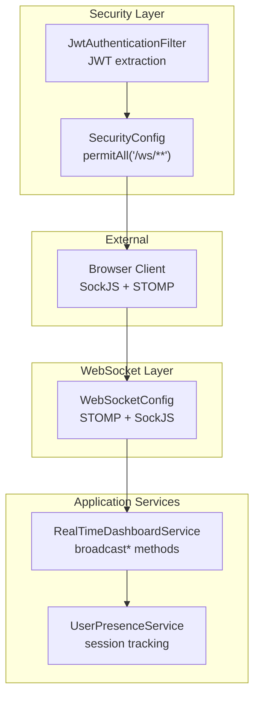
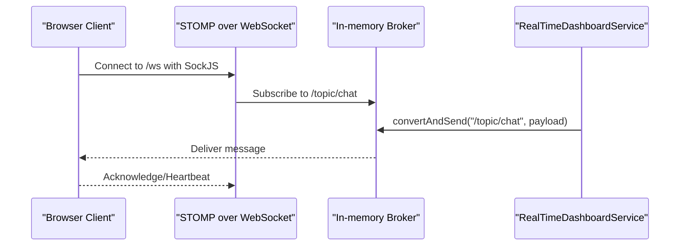
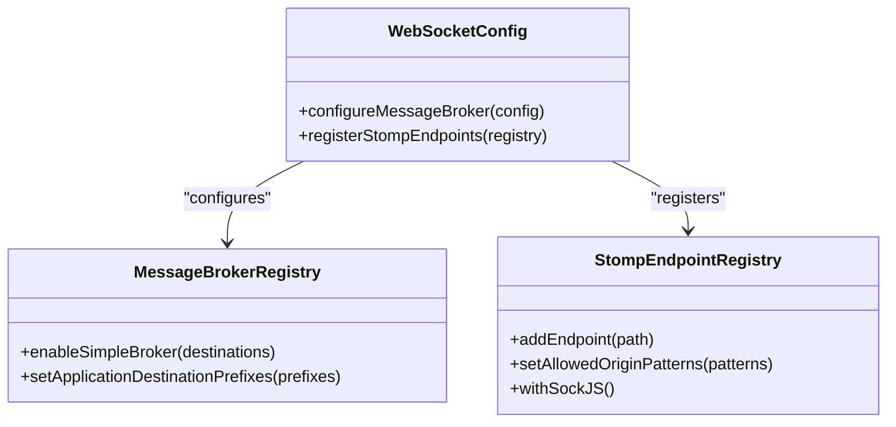
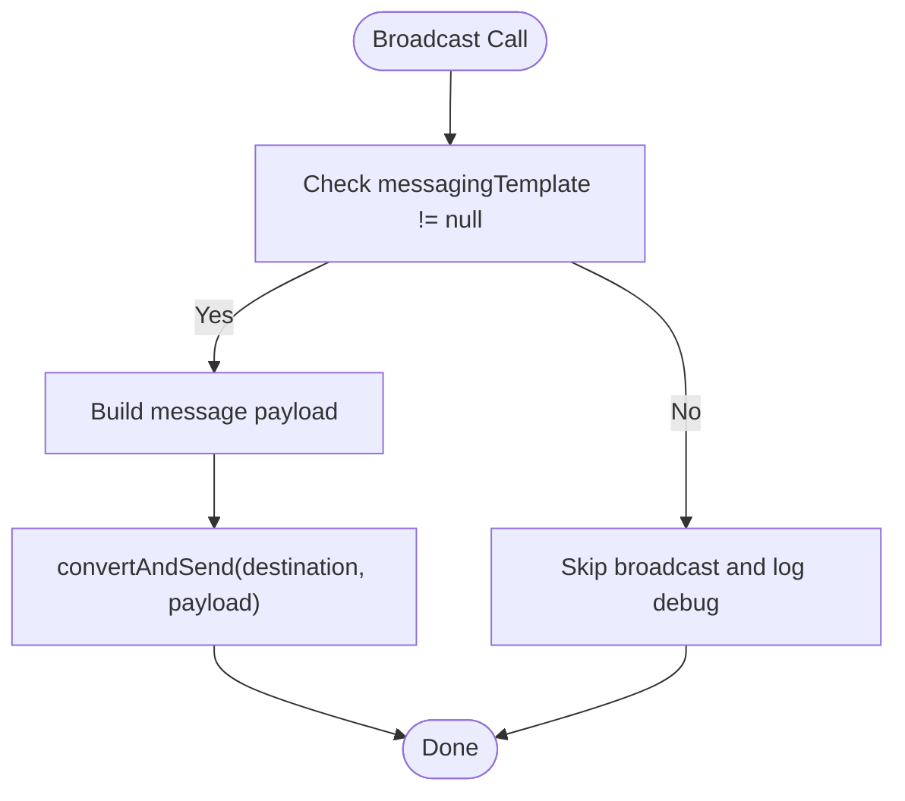
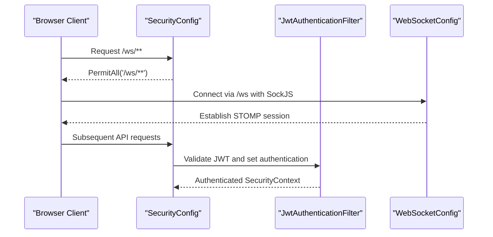
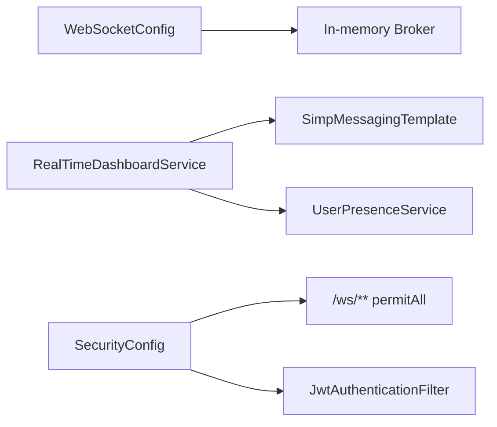

# WebSocket Configuration

<cite>
**Referenced Files in This Document**
- [WebSocketConfig.java](file://src/main/java/root/cyb/mh/skylink_media_service/infrastructure/config/WebSocketConfig.java)
- [RealTimeDashboardService.java](file://src/main/java/root/cyb/mh/skylink_media_service/application/services/RealTimeDashboardService.java)
- [UserPresenceService.java](file://src/main/java/root/cyb/mh/skylink_media_service/application/services/UserPresenceService.java)
- [SecurityConfig.java](file://src/main/java/root/cyb/mh/skylink_media_service/infrastructure/security/SecurityConfig.java)
- [JwtAuthenticationFilter.java](file://src/main/java/root/cyb/mh/skylink_media_service/infrastructure/security/jwt/JwtAuthenticationFilter.java)
- [application.properties](file://src/main/resources/application.properties)
</cite>

## Table of Contents
1. [Introduction](#introduction)
2. [Project Structure](#project-structure)
3. [Core Components](#core-components)
4. [Architecture Overview](#architecture-overview)
5. [Detailed Component Analysis](#detailed-component-analysis)
6. [Dependency Analysis](#dependency-analysis)
7. [Performance Considerations](#performance-considerations)
8. [Troubleshooting Guide](#troubleshooting-guide)
9. [Conclusion](#conclusion)

## Introduction
This document provides comprehensive documentation for WebSocket configuration and setup in the Skylink Media Service backend. It explains the WebSocketConfig class implementation, covering message broker configuration, STOMP endpoint registration, and security settings. It documents the SimpMessagingTemplate bean usage for message broadcasting, transport options via SockJS, and integration with Spring Security. The document also addresses scalability, memory management, and performance tuning considerations for WebSocket deployments.

## Project Structure
The WebSocket subsystem is implemented across configuration, service, and security layers:
- WebSocket configuration is centralized in a dedicated configuration class enabling STOMP over WebSocket with SockJS fallback.
- Real-time services use SimpMessagingTemplate to publish messages to subscribed clients.
- Security configuration permits WebSocket endpoints and integrates JWT authentication for protected APIs.

**Diagram sources**
- [WebSocketConfig.java:1-28](file://src/main/java/root/cyb/mh/skylink_media_service/infrastructure/config/WebSocketConfig.java#L1-L28)
- [RealTimeDashboardService.java:1-123](file://src/main/java/root/cyb/mh/skylink_media_service/application/services/RealTimeDashboardService.java#L1-L123)
- [UserPresenceService.java:1-147](file://src/main/java/root/cyb/mh/skylink_media_service/application/services/UserPresenceService.java#L1-L147)
- [SecurityConfig.java:43-87](file://src/main/java/root/cyb/mh/skylink_media_service/infrastructure/security/SecurityConfig.java#L43-L87)
- [JwtAuthenticationFilter.java:32-54](file://src/main/java/root/cyb/mh/skylink_media_service/infrastructure/security/jwt/JwtAuthenticationFilter.java#L32-L54)

**Section sources**
- [WebSocketConfig.java:1-28](file://src/main/java/root/cyb/mh/skylink_media_service/infrastructure/config/WebSocketConfig.java#L1-L28)
- [RealTimeDashboardService.java:1-123](file://src/main/java/root/cyb/mh/skylink_media_service/application/services/RealTimeDashboardService.java#L1-L123)
- [UserPresenceService.java:1-147](file://src/main/java/root/cyb/mh/skylink_media_service/application/services/UserPresenceService.java#L1-L147)
- [SecurityConfig.java:43-87](file://src/main/java/root/cyb/mh/skylink_media_service/infrastructure/security/SecurityConfig.java#L43-L87)
- [JwtAuthenticationFilter.java:32-54](file://src/main/java/root/cyb/mh/skylink_media_service/infrastructure/security/jwt/JwtAuthenticationFilter.java#L32-L54)

## Core Components
- WebSocketConfig: Enables STOMP over WebSocket with a simple in-memory broker and registers the /ws endpoint with SockJS fallback.
- RealTimeDashboardService: Uses SimpMessagingTemplate to broadcast real-time updates to topics such as /topic/chat, /topic/projects, /topic/presence, and /topic/dashboard.
- UserPresenceService: Tracks active user sessions and pages for presence reporting.
- SecurityConfig: Permits WebSocket endpoint access and integrates JWT authentication for REST APIs.
- JwtAuthenticationFilter: Extracts and validates JWT tokens for stateless authentication.

Key configuration highlights:
- Message broker destinations: /topic/*
- Application destination prefix: /app
- STOMP endpoint: /ws with SockJS enabled
- Allowed origins: wildcard pattern for development

**Section sources**
- [WebSocketConfig.java:13-27](file://src/main/java/root/cyb/mh/skylink_media_service/infrastructure/config/WebSocketConfig.java#L13-L27)
- [RealTimeDashboardService.java:19-20](file://src/main/java/root/cyb/mh/skylink_media_service/application/services/RealTimeDashboardService.java#L19-L20)
- [SecurityConfig.java:52](file://src/main/java/root/cyb/mh/skylink_media_service/infrastructure/security/SecurityConfig.java#L52)

## Architecture Overview
The WebSocket architecture combines Spring WebSocket with STOMP for structured messaging and SockJS for broad client compatibility. The in-memory broker routes messages to subscribers based on destination prefixes.

**Diagram sources**
- [WebSocketConfig.java:22-27](file://src/main/java/root/cyb/mh/skylink_media_service/infrastructure/config/WebSocketConfig.java#L22-L27)
- [RealTimeDashboardService.java:45-53](file://src/main/java/root/cyb/mh/skylink_media_service/application/services/RealTimeDashboardService.java#L45-L53)

## Detailed Component Analysis

### WebSocketConfig Implementation
WebSocketConfig implements WebSocketMessageBrokerConfigurer to:
- Configure the message broker to enable a simple in-memory broker for destinations under /topic.
- Set application destination prefixes to route messages to @MessageMapping handlers under /app.
- Register the STOMP endpoint at /ws with SockJS fallback and allow all origin patterns.

**Diagram sources**
- [WebSocketConfig.java:13-19](file://src/main/java/root/cyb/mh/skylink_media_service/infrastructure/config/WebSocketConfig.java#L13-L19)
- [WebSocketConfig.java:22-27](file://src/main/java/root/cyb/mh/skylink_media_service/infrastructure/config/WebSocketConfig.java#L22-L27)

**Section sources**
- [WebSocketConfig.java:13-27](file://src/main/java/root/cyb/mh/skylink_media_service/infrastructure/config/WebSocketConfig.java#L13-L27)

### SimpMessagingTemplate Bean and Message Broadcasting
RealTimeDashboardService autowires SimpMessagingTemplate and broadcasts messages to multiple topics:
- Presence updates: /topic/presence
- Chat messages: /topic/chat
- Project updates: /topic/projects
- System statistics: /topic/dashboard

The service gracefully handles scenarios where WebSocket is unavailable by checking for a null template.

**Diagram sources**
- [RealTimeDashboardService.java:19-20](file://src/main/java/root/cyb/mh/skylink_media_service/application/services/RealTimeDashboardService.java#L19-L20)
- [RealTimeDashboardService.java:25-33](file://src/main/java/root/cyb/mh/skylink_media_service/application/services/RealTimeDashboardService.java#L25-L33)
- [RealTimeDashboardService.java:45-53](file://src/main/java/root/cyb/mh/skylink_media_service/application/services/RealTimeDashboardService.java#L45-L53)
- [RealTimeDashboardService.java:66-74](file://src/main/java/root/cyb/mh/skylink_media_service/application/services/RealTimeDashboardService.java#L66-L74)
- [RealTimeDashboardService.java:87-95](file://src/main/java/root/cyb/mh/skylink_media_service/application/services/RealTimeDashboardService.java#L87-L95)

**Section sources**
- [RealTimeDashboardService.java:19-20](file://src/main/java/root/cyb/mh/skylink_media_service/application/services/RealTimeDashboardService.java#L19-L20)
- [RealTimeDashboardService.java:25-95](file://src/main/java/root/cyb/mh/skylink_media_service/application/services/RealTimeDashboardService.java#L25-L95)

### WebSocket Transport Options and Heartbeats
- Transport: STOMP over WebSocket with SockJS fallback configured in WebSocketConfig.
- Heartbeats: No explicit heartbeat configuration is present in the current setup.
- Connection timeout: No explicit connection timeout settings are configured in the current setup.

Recommendations:
- Configure heartbeat intervals and timeouts in production for reliability.
- Consider deploying behind a reverse proxy that supports WebSocket upgrades and sticky sessions for horizontal scaling.

**Section sources**
- [WebSocketConfig.java:24-26](file://src/main/java/root/cyb/mh/skylink_media_service/infrastructure/config/WebSocketConfig.java#L24-L26)

### Security Settings and Integration with Spring Security
SecurityConfig permits WebSocket endpoint access and integrates JWT authentication:
- Permits access to /ws/** for WebSocket connections.
- Integrates JwtAuthenticationFilter before the default form-based filter chain.
- Applies CSRF ignoring for REST API paths while maintaining session policy.

**Diagram sources**
- [SecurityConfig.java:52](file://src/main/java/root/cyb/mh/skylink_media_service/infrastructure/security/SecurityConfig.java#L52)
- [SecurityConfig.java:84](file://src/main/java/root/cyb/mh/skylink_media_service/infrastructure/security/SecurityConfig.java#L84)
- [JwtAuthenticationFilter.java:32-54](file://src/main/java/root/cyb/mh/skylink_media_service/infrastructure/security/jwt/JwtAuthenticationFilter.java#L32-L54)
- [WebSocketConfig.java:22-27](file://src/main/java/root/cyb/mh/skylink_media_service/infrastructure/config/WebSocketConfig.java#L22-L27)

**Section sources**
- [SecurityConfig.java:43-87](file://src/main/java/root/cyb/mh/skylink_media_service/infrastructure/security/SecurityConfig.java#L43-L87)
- [JwtAuthenticationFilter.java:32-54](file://src/main/java/root/cyb/mh/skylink_media_service/infrastructure/security/jwt/JwtAuthenticationFilter.java#L32-L54)
- [WebSocketConfig.java:22-27](file://src/main/java/root/cyb/mh/skylink_media_service/infrastructure/config/WebSocketConfig.java#L22-L27)

### Message Conversion Setup
RealTimeDashboardService constructs JSON-like payloads and sends them using SimpMessagingTemplate.convertAndSend. Payloads include metadata such as type, identifiers, timestamps, and counts. This approach leverages Spring's default message conversion to deliver structured data to subscribed clients.

Topics used:
- /topic/presence
- /topic/chat
- /topic/projects
- /topic/dashboard

**Section sources**
- [RealTimeDashboardService.java:35-43](file://src/main/java/root/cyb/mh/skylink_media_service/application/services/RealTimeDashboardService.java#L35-L43)
- [RealTimeDashboardService.java:55-64](file://src/main/java/root/cyb/mh/skylink_media_service/application/services/RealTimeDashboardService.java#L55-L64)
- [RealTimeDashboardService.java:76-85](file://src/main/java/root/cyb/mh/skylink_media_service/application/services/RealTimeDashboardService.java#L76-L85)
- [RealTimeDashboardService.java:97-108](file://src/main/java/root/cyb/mh/skylink_media_service/application/services/RealTimeDashboardService.java#L97-L108)

## Dependency Analysis
The WebSocket subsystem exhibits low coupling and clear separation of concerns:
- WebSocketConfig depends on Spring WebSocket and STOMP abstractions.
- RealTimeDashboardService depends on SimpMessagingTemplate and UserPresenceService.
- SecurityConfig orchestrates permit-all for WebSocket endpoints and integrates JWT filtering.

**Diagram sources**
- [WebSocketConfig.java:13-19](file://src/main/java/root/cyb/mh/skylink_media_service/infrastructure/config/WebSocketConfig.java#L13-L19)
- [RealTimeDashboardService.java:19-20](file://src/main/java/root/cyb/mh/skylink_media_service/application/services/RealTimeDashboardService.java#L19-L20)
- [UserPresenceService.java:18](file://src/main/java/root/cyb/mh/skylink_media_service/application/services/UserPresenceService.java#L18)
- [SecurityConfig.java:52](file://src/main/java/root/cyb/mh/skylink_media_service/infrastructure/security/SecurityConfig.java#L52)
- [JwtAuthenticationFilter.java:32-54](file://src/main/java/root/cyb/mh/skylink_media_service/infrastructure/security/jwt/JwtAuthenticationFilter.java#L32-L54)

**Section sources**
- [WebSocketConfig.java:13-27](file://src/main/java/root/cyb/mh/skylink_media_service/infrastructure/config/WebSocketConfig.java#L13-L27)
- [RealTimeDashboardService.java:19-20](file://src/main/java/root/cyb/mh/skylink_media_service/application/services/RealTimeDashboardService.java#L19-L20)
- [UserPresenceService.java:18](file://src/main/java/root/cyb/mh/skylink_media_service/application/services/UserPresenceService.java#L18)
- [SecurityConfig.java:52](file://src/main/java/root/cyb/mh/skylink_media_service/infrastructure/security/SecurityConfig.java#L52)
- [JwtAuthenticationFilter.java:32-54](file://src/main/java/root/cyb/mh/skylink_media_service/infrastructure/security/jwt/JwtAuthenticationFilter.java#L32-L54)

## Performance Considerations
- Memory broker: The current setup uses an in-memory broker suitable for development but not recommended for production scale.
- Scalability: For horizontal scaling, replace the in-memory broker with a message broker supporting clustering (e.g., RabbitMQ, Apache Kafka, Redis).
- Heartbeats: Configure STOMP heartbeats to detect dead connections and maintain reliable delivery.
- Connection timeouts: Set appropriate handshake and connection timeouts to prevent resource leaks.
- Load balancing: Use sticky sessions or shared state to ensure message delivery continuity across instances.
- Payload sizes: Keep message payloads compact to reduce bandwidth and GC pressure.
- Monitoring: Track concurrent connections, subscription counts, and broker throughput.

[No sources needed since this section provides general guidance]

## Troubleshooting Guide
Common issues and resolutions:
- WebSocket endpoint blocked: Verify SecurityConfig permits /ws/** and that the filter chain does not block it.
- No messages received: Confirm RealTimeDashboardService has a non-null SimpMessagingTemplate and that clients subscribe to the correct topics.
- Authentication failures: Ensure JwtAuthenticationFilter extracts and validates tokens correctly for API requests; WebSocket connections bypass JWT by design but subsequent API calls require it.
- Cross-origin errors: Confirm allowed origin patterns are configured for the /ws endpoint.

**Section sources**
- [SecurityConfig.java:52](file://src/main/java/root/cyb/mh/skylink_media_service/infrastructure/security/SecurityConfig.java#L52)
- [RealTimeDashboardService.java:19-20](file://src/main/java/root/cyb/mh/skylink_media_service/application/services/RealTimeDashboardService.java#L19-L20)
- [WebSocketConfig.java:24-26](file://src/main/java/root/cyb/mh/skylink_media_service/infrastructure/config/WebSocketConfig.java#L24-L26)
- [JwtAuthenticationFilter.java:32-54](file://src/main/java/root/cyb/mh/skylink_media_service/infrastructure/security/jwt/JwtAuthenticationFilter.java#L32-L54)

## Conclusion
The WebSocket configuration establishes a solid foundation for real-time messaging using STOMP over WebSocket with SockJS fallback. The in-memory broker simplifies development, while SecurityConfig and JwtAuthenticationFilter integrate authentication for REST APIs. For production, consider replacing the in-memory broker with a clustered message broker, configuring heartbeats and timeouts, and implementing monitoring and scaling strategies.