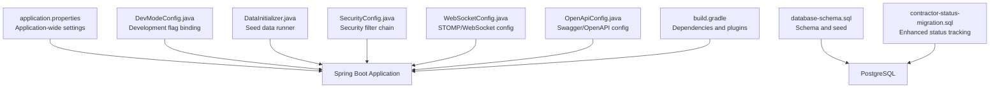
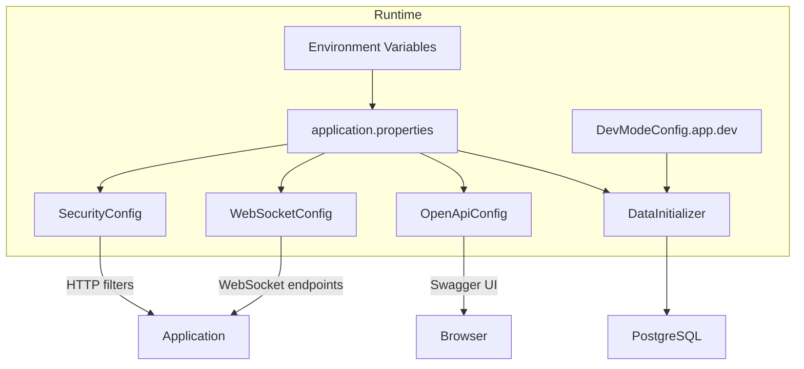
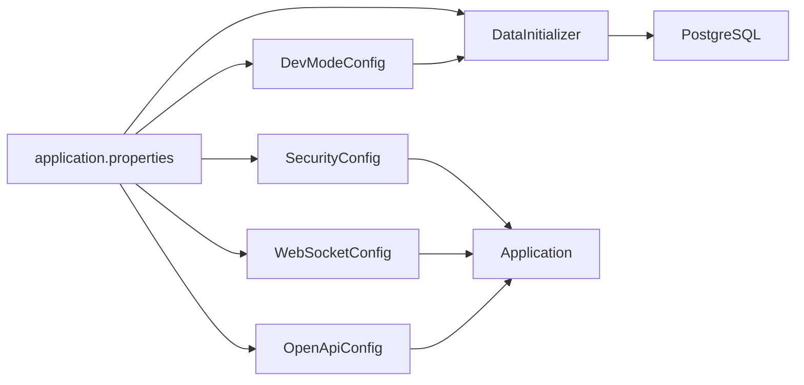

# Configuration & Deployment

<cite>
**Referenced Files in This Document**
- [application.properties](file://src/main/resources/application.properties)
- [DevModeConfig.java](file://src/main/java/root/cyb/mh/skylink_media_service/infrastructure/config/DevModeConfig.java)
- [DataInitializer.java](file://src/main/java/root/cyb/mh/skylink_media_service/infrastructure/config/DataInitializer.java)
- [SecurityConfig.java](file://src/main/java/root/cyb/mh/skylink_media_service/infrastructure/security/SecurityConfig.java)
- [WebSocketConfig.java](file://src/main/java/root/cyb/mh/skylink_media_service/infrastructure/config/WebSocketConfig.java)
- [OpenApiConfig.java](file://src/main/java/root/cyb/mh/skylink_media_service/infrastructure/config/OpenApiConfig.java)
- [build.gradle](file://build.gradle)
- [settings.gradle](file://settings.gradle)
- [database-schema.sql](file://database-schema.sql)
- [contractor-status-migration.sql](file://contractor-status-migration.sql)
- [application-test.properties](file://src/test/resources/application-test.properties)
</cite>

## Table of Contents
1. [Introduction](#introduction)
2. [Project Structure](#project-structure)
3. [Core Components](#core-components)
4. [Architecture Overview](#architecture-overview)
5. [Detailed Component Analysis](#detailed-component-analysis)
6. [Dependency Analysis](#dependency-analysis)
7. [Performance Considerations](#performance-considerations)
8. [Troubleshooting Guide](#troubleshooting-guide)
9. [Conclusion](#conclusion)
10. [Appendices](#appendices)

## Introduction
This document provides comprehensive configuration and deployment guidance for the Skylink Media Service backend. It covers application properties, environment-specific settings, development vs. production profiles, security and JWT configuration, file storage paths, database initialization and migrations, and operational considerations such as backups, monitoring, and deployment checklists.

## Project Structure
The backend is a Spring Boot 4 application written in Java 21. Key configuration and bootstrapping elements reside under src/main/resources and src/main/java. The Gradle build defines dependencies and packaging behavior. Database schema and migration scripts are provided as SQL files.

**Diagram sources**
- [application.properties](file://src/main/resources/application.properties)
- [DevModeConfig.java](file://src/main/java/root/cyb/mh/skylink_media_service/infrastructure/config/DevModeConfig.java)
- [DataInitializer.java](file://src/main/java/root/cyb/mh/skylink_media_service/infrastructure/config/DataInitializer.java)
- [SecurityConfig.java](file://src/main/java/root/cyb/mh/skylink_media_service/infrastructure/security/SecurityConfig.java)
- [WebSocketConfig.java](file://src/main/java/root/cyb/mh/skylink_media_service/infrastructure/config/WebSocketConfig.java)
- [OpenApiConfig.java](file://src/main/java/root/cyb/mh/skylink_media_service/infrastructure/config/OpenApiConfig.java)
- [build.gradle](file://build.gradle)
- [database-schema.sql](file://database-schema.sql)
- [contractor-status-migration.sql](file://contractor-status-migration.sql)

**Section sources**
- [build.gradle](file://build.gradle)
- [settings.gradle](file://settings.gradle)

## Core Components
- Application properties: Centralized configuration for datasource, file upload limits, development mode, logging, JWT, API base path, CORS, mail transport, and sender identity.
- DevModeConfig: Binds the app.dev property to a typed configuration bean to enable development-only features.
- DataInitializer: Seeds the database with default administrative accounts during startup when missing.
- SecurityConfig: Defines HTTP security, CORS, role-based access, and logout behavior.
- WebSocketConfig: Enables STOMP over WebSocket for real-time features.
- OpenApiConfig: Exposes Swagger/OpenAPI with bearer JWT security scheme.

**Section sources**
- [application.properties](file://src/main/resources/application.properties)
- [DevModeConfig.java](file://src/main/java/root/cyb/mh/skylink_media_service/infrastructure/config/DevModeConfig.java)
- [DataInitializer.java](file://src/main/java/root/cyb/mh/skylink_media_service/infrastructure/config/DataInitializer.java)
- [SecurityConfig.java](file://src/main/java/root/cyb/mh/skylink_media_service/infrastructure/security/SecurityConfig.java)
- [WebSocketConfig.java](file://src/main/java/root/cyb/mh/skylink_media_service/infrastructure/config/WebSocketConfig.java)
- [OpenApiConfig.java](file://src/main/java/root/cyb/mh/skylink_media_service/infrastructure/config/OpenApiConfig.java)

## Architecture Overview
The runtime configuration and deployment architecture integrates Spring Boot’s autoconfiguration with explicit security, messaging, and API documentation beans. Environment variables override application.properties at runtime. Development mode toggles extra capabilities. DataInitializer ensures minimal viable data post-deploy.

**Diagram sources**
- [application.properties](file://src/main/resources/application.properties)
- [DevModeConfig.java](file://src/main/java/root/cyb/mh/skylink_media_service/infrastructure/config/DevModeConfig.java)
- [DataInitializer.java](file://src/main/java/root/cyb/mh/skylink_media_service/infrastructure/config/DataInitializer.java)
- [SecurityConfig.java](file://src/main/java/root/cyb/mh/skylink_media_service/infrastructure/security/SecurityConfig.java)
- [WebSocketConfig.java](file://src/main/java/root/cyb/mh/skylink_media_service/infrastructure/config/WebSocketConfig.java)
- [OpenApiConfig.java](file://src/main/java/root/cyb/mh/skylink_media_service/infrastructure/config/OpenApiConfig.java)

## Detailed Component Analysis

### Application Properties Reference
Key categories and their roles:
- Application metadata and server: Sets application name and port.
- Database connection: JDBC URL, credentials, Hibernate dialect, and DDL strategy.
- File upload: Max file and request sizes; upload directory path.
- Development mode: Controls development-only features via app.dev.
- Thymeleaf: Disables template caching for development.
- Logging: Root package logging level for a specific controller.
- JWT: Secret, expiration, header name, and prefix.
- API: Version and base path for REST endpoints.
- CORS: Allowed origins, methods, headers, and max age.
- Mail: SMTP host, port, credentials, SSL settings, timeouts, and sender identity.

Operational guidance:
- Override sensitive values via environment variables or externalized configuration.
- Keep app.dev set to false in production.
- Adjust multipart limits according to workload.
- Align CORS with frontend origins and reverse proxy behavior.
- Ensure mail credentials match your SMTP provider.

**Section sources**
- [application.properties](file://src/main/resources/application.properties)

### DevModeConfig
Purpose:
- Binds the app.dev property to a strongly-typed bean to gate development-only features.

Behavior:
- Defaults to disabled; production deployments should keep it off.
- Used by components that require development flexibility (e.g., extra cleanup or destructive actions).

Recommendations:
- Never enable app.dev in production.
- Use Spring profiles to manage environment-specific overrides.

**Section sources**
- [DevModeConfig.java](file://src/main/java/root/cyb/mh/skylink_media_service/infrastructure/config/DevModeConfig.java)
- [application.properties](file://src/main/resources/application.properties)

### DataInitializer
Purpose:
- Seeds the database with default administrative accounts during application startup if missing.

Behavior:
- Creates a default super-admin account if none exists.
- Creates a default admin account if the username does not exist.

Operational notes:
- Runs as a CommandLineRunner with order 2.
- Uses a PasswordEncoder to hash passwords before persisting.
- Useful for quickstarts and local development; ensure idempotent behavior.

**Section sources**
- [DataInitializer.java](file://src/main/java/root/cyb/mh/skylink_media_service/infrastructure/config/DataInitializer.java)

### SecurityConfig
Purpose:
- Configures Spring Security filter chain, CORS, CSRF, authentication entry point, logout handler, and role-based access.

Key behaviors:
- Permits unauthenticated access to login page, static assets, uploads, thumbnails, and Swagger UI.
- Requires authentication for API and admin/contractor paths with role-based restrictions.
- Adds a JWT filter before the default form filter.
- Configures form login and logout handlers.

CORS and CSRF:
- CORS applies to /api/v1/** with allowed origins, methods, headers, and credentials.
- CSRF ignores API routes while keeping protection for HTML forms.

**Section sources**
- [SecurityConfig.java](file://src/main/java/root/cyb/mh/skylink_media_service/infrastructure/security/SecurityConfig.java)
- [application.properties](file://src/main/resources/application.properties)

### WebSocketConfig
Purpose:
- Enables STOMP over WebSocket for real-time features.

Endpoints and broker:
- Registers /ws with SockJS fallback.
- Uses a simple in-memory broker for topics.
- Sets application destination prefixes for message mapping.

Operational notes:
- Suitable for development and small-scale deployments.
- For clustered/prod scenarios, consider a message broker (Redis/RabbitMQ) or Spring Cloud Stream.

**Section sources**
- [WebSocketConfig.java](file://src/main/java/root/cyb/mh/skylink_media_service/infrastructure/config/WebSocketConfig.java)

### OpenApiConfig
Purpose:
- Provides Swagger/OpenAPI documentation with a bearer JWT security scheme.

Behavior:
- Declares a bearerAuth security requirement.
- Describes how to supply a JWT token obtained from the login endpoint.

**Section sources**
- [OpenApiConfig.java](file://src/main/java/root/cyb/mh/skylink_media_service/infrastructure/config/OpenApiConfig.java)

### Database Schema and Migrations
Schema:
- Defines users (including inherited roles), projects, assignments, and photos.
- Includes indexes for performance and inserts default admin record.
- Adds optional columns via a migration block.

Migrations:
- contractor-status-migration.sql adds contractor interaction logs and completion tracking fields to projects with supporting indexes.

Operational guidance:
- Apply database-schema.sql to initialize the schema.
- Apply contractor-status-migration.sql after schema initialization.
- Use DDL strategy update cautiously in production; prefer explicit migrations.

**Section sources**
- [database-schema.sql](file://database-schema.sql)
- [contractor-status-migration.sql](file://contractor-status-migration.sql)

### Build and Packaging
- Java 21 toolchain.
- Spring Boot 4 starter dependencies for web, security, JPA, mail, WebSocket, Thymeleaf, and OpenAPI.
- JWT libraries included for token handling.
- Test dependencies include H2 for in-memory testing.

Packaging:
- Standard Spring Boot executable JAR.
- No Dockerfile present; containerization can be added externally.

**Section sources**
- [build.gradle](file://build.gradle)

## Dependency Analysis
High-level dependencies among configuration components:

**Diagram sources**
- [application.properties](file://src/main/resources/application.properties)
- [DevModeConfig.java](file://src/main/java/root/cyb/mh/skylink_media_service/infrastructure/config/DevModeConfig.java)
- [DataInitializer.java](file://src/main/java/root/cyb/mh/skylink_media_service/infrastructure/config/DataInitializer.java)
- [SecurityConfig.java](file://src/main/java/root/cyb/mh/skylink_media_service/infrastructure/security/SecurityConfig.java)
- [WebSocketConfig.java](file://src/main/java/root/cyb/mh/skylink_media_service/infrastructure/config/WebSocketConfig.java)
- [OpenApiConfig.java](file://src/main/java/root/cyb/mh/skylink_media_service/infrastructure/config/OpenApiConfig.java)

**Section sources**
- [build.gradle](file://build.gradle)

## Performance Considerations
- Database:
  - Use indexes defined in schema and migration scripts for frequent joins and lookups.
  - Prefer explicit migrations over update for production stability.
- File storage:
  - Tune multipart limits per workload; ensure disk capacity for uploads and thumbnails.
- Security:
  - Keep JWT expiration aligned with operational needs; rotate secrets periodically.
- CORS:
  - Restrict allowed origins to trusted domains in production.
- Logging:
  - Reduce DEBUG logging in production to minimize I/O overhead.

[No sources needed since this section provides general guidance]

## Troubleshooting Guide
Common deployment issues and resolutions:
- Database connectivity:
  - Verify JDBC URL, credentials, and PostgreSQL availability.
  - Confirm DDL strategy and migration status.
- JWT authentication failures:
  - Ensure JWT secret matches across instances and is rotated securely.
  - Confirm Authorization header format and prefix.
- CORS errors:
  - Align allowed origins with frontend origin and reverse proxy configuration.
- File upload failures:
  - Check max-file-size and max-request-size against client uploads.
  - Confirm upload directory permissions and disk space.
- Development-only features:
  - Ensure app.dev is false in production to avoid unintended behaviors.
- Seed data not present:
  - Confirm DataInitializer ran and that default accounts were created.
- OpenAPI/Swagger:
  - Access /v3/api-docs and /swagger-ui after login if protected by authentication.

**Section sources**
- [application.properties](file://src/main/resources/application.properties)
- [SecurityConfig.java](file://src/main/java/root/cyb/mh/skylink_media_service/infrastructure/security/SecurityConfig.java)
- [DataInitializer.java](file://src/main/java/root/cyb/mh/skylink_media_service/infrastructure/config/DataInitializer.java)

## Conclusion
The Skylink Media Service relies on a clean separation of concerns between Spring Boot configuration, explicit security and messaging beans, and database schema/migrations. By externalizing sensitive settings, carefully managing development vs. production flags, and following the migration and backup procedures outlined below, teams can deploy a secure, scalable, and maintainable platform.

[No sources needed since this section summarizes without analyzing specific files]

## Appendices

### A. Environment-Specific Configuration and Profiles
- Use Spring profiles to separate dev, test, and prod settings.
- Externalize secrets via environment variables or a secrets manager.
- Example pattern:
  - application-dev.properties for local overrides.
  - application-prod.properties for production hardening.
- Keep app.dev=false in prod; enable only in controlled dev environments.

**Section sources**
- [application.properties](file://src/main/resources/application.properties)
- [DevModeConfig.java](file://src/main/java/root/cyb/mh/skylink_media_service/infrastructure/config/DevModeConfig.java)

### B. Database Initialization and Migration Strategy
- Initial schema: apply database-schema.sql to create tables and indexes.
- Subsequent enhancements: apply contractor-status-migration.sql.
- For production, prefer explicit migration tools and version control for SQL scripts.

**Section sources**
- [database-schema.sql](file://database-schema.sql)
- [contractor-status-migration.sql](file://contractor-status-migration.sql)

### C. Backup Procedures
- PostgreSQL logical backup: Use pg_dump/pg_restore for full or selective backups.
- Incremental backups: Schedule based on change frequency.
- Offsite retention: Store backups in secure, geo-redundant storage.
- Test restore: Periodically validate restore procedures.

[No sources needed since this section provides general guidance]

### D. Monitoring Setup
- Health checks: Expose Spring Boot Actuator endpoints (ensure security in production).
- Logs: Centralize application logs and correlate with database and file storage metrics.
- Metrics: Track JVM, database, and request latency.
- Alerts: Notify on authentication failures, DB outages, and disk pressure.

[No sources needed since this section provides general guidance]

### E. Containerization Options
- Current state: No Dockerfile present.
- Recommended approach:
  - Build a Spring Boot JAR artifact.
  - Package with a lightweight base image (e.g., eclipse-temurin:21-jre).
  - Mount persistent volumes for uploads/thumbnails if not using cloud storage.
  - Configure environment variables for database credentials and JWT secret.
- Orchestration:
  - Kubernetes: Deploy with ConfigMap for non-sensitive settings and Secrets for credentials.
  - Docker Compose: Define services for app, PostgreSQL, and optional Redis for WebSocket clustering.

[No sources needed since this section provides general guidance]

### F. Deployment Checklist
- Pre-deployment
  - Review and approve database migration scripts.
  - Prepare environment variables for database, JWT, mail, and CORS.
  - Confirm upload directory permissions and disk quotas.
- Deploy
  - Provision PostgreSQL and ensure network accessibility.
  - Start the application with production profile.
  - Verify health, Swagger UI, and basic authentication.
- Post-deploy
  - Confirm seed data presence (default admin accounts).
  - Validate file uploads and thumbnail generation.
  - Monitor logs and metrics for anomalies.
- Rollback
  - Keep previous artifact and database snapshots ready.

[No sources needed since this section provides general guidance]

### G. Test Configuration Reference
- Test database: H2 in-memory database with automatic schema creation/drop.
- Useful for unit and integration tests without external dependencies.

**Section sources**
- [application-test.properties](file://src/test/resources/application-test.properties)