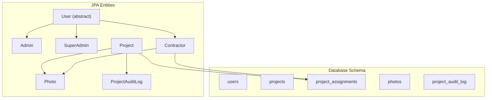
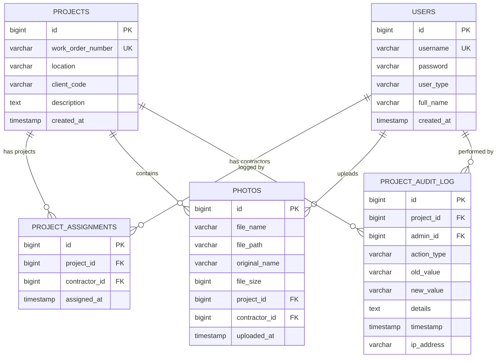
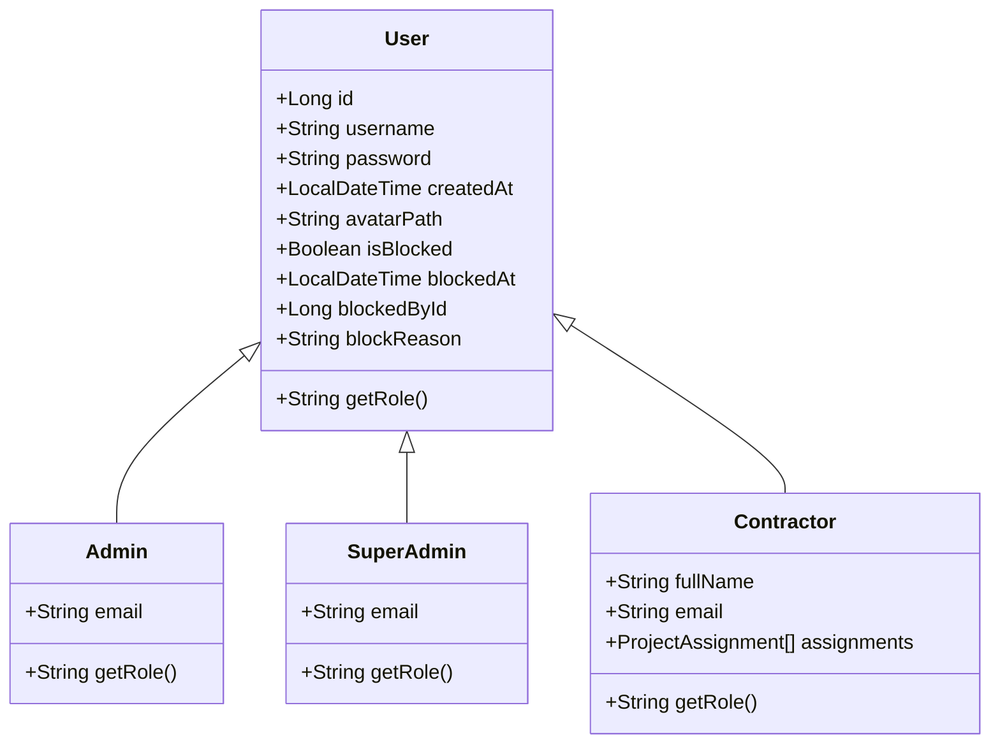
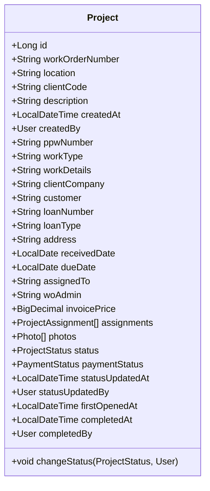
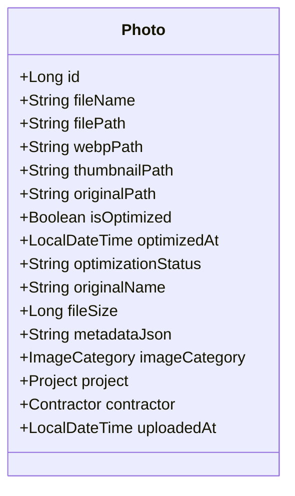
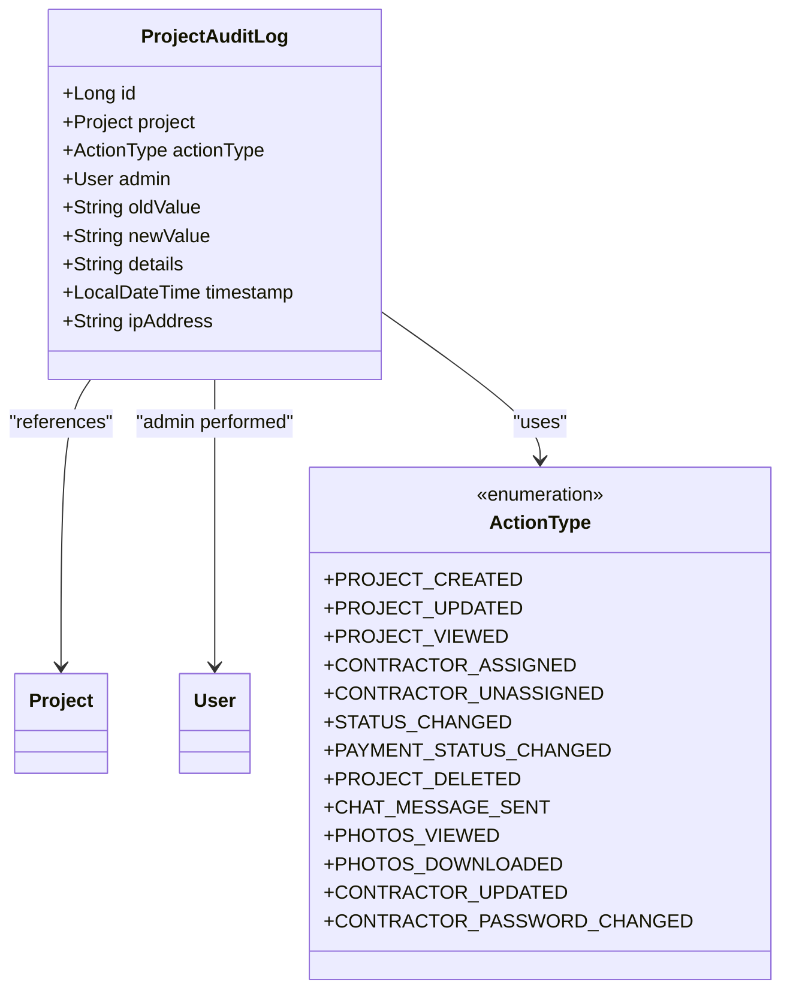
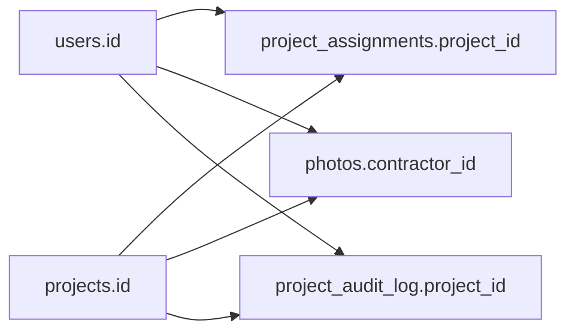

# Database Design

<cite>
**Referenced Files in This Document**
- [database-schema.sql](file://database-schema.sql)
- [User.java](file://src/main/java/root/cyb/mh/skylink_media_service/domain/entities/User.java)
- [Admin.java](file://src/main/java/root/cyb/mh/skylink_media_service/domain/entities/Admin.java)
- [SuperAdmin.java](file://src/main/java/root/cyb/mh/skylink_media_service/domain/entities/SuperAdmin.java)
- [Contractor.java](file://src/main/java/root/cyb/mh/skylink_media_service/domain/entities/Contractor.java)
- [Project.java](file://src/main/java/root/cyb/mh/skylink_media_service/domain/entities/Project.java)
- [Photo.java](file://src/main/java/root/cyb/mh/skylink_media_service/domain/entities/Photo.java)
- [ProjectAuditLog.java](file://src/main/java/root/cyb/mh/skylink_media_service/domain/entities/ProjectAuditLog.java)
</cite>

## Table of Contents
1. [Introduction](#introduction)
2. [Project Structure](#project-structure)
3. [Core Components](#core-components)
4. [Architecture Overview](#architecture-overview)
5. [Detailed Component Analysis](#detailed-component-analysis)
6. [Dependency Analysis](#dependency-analysis)
7. [Performance Considerations](#performance-considerations)
8. [Troubleshooting Guide](#troubleshooting-guide)
9. [Conclusion](#conclusion)

## Introduction
This document provides comprehensive data model documentation for the Skylink Media Service database schema and its JPA entity mappings. It details the relational design of Projects, Contractors, Users, Photos, and audit logs, including primary keys, foreign keys, indexes, constraints, and JPA annotations. It also explains the user hierarchy with Admin, SuperAdmin, and Contractor roles, data access patterns via repositories, and the lifecycle of entities including cascading operations and referential integrity.

## Project Structure
The database schema is defined in a single SQL script and is mapped to JPA entities under the domain layer. The entities represent a single-table inheritance strategy for Users with discriminator values for Admin, SuperAdmin, and Contractor. Projects are central and maintain associations to Contractors via ProjectAssignment and to Photos. Audit logging is implemented as a dedicated entity with indexes for efficient querying.

**Diagram sources**
- [database-schema.sql](file://database-schema.sql)
- [User.java](file://src/main/java/root/cyb/mh/skylink_media_service/domain/entities/User.java)
- [Admin.java](file://src/main/java/root/cyb/mh/skylink_media_service/domain/entities/Admin.java)
- [SuperAdmin.java](file://src/main/java/root/cyb/mh/skylink_media_service/domain/entities/SuperAdmin.java)
- [Contractor.java](file://src/main/java/root/cyb/mh/skylink_media_service/domain/entities/Contractor.java)
- [Project.java](file://src/main/java/root/cyb/mh/skylink_media_service/domain/entities/Project.java)
- [Photo.java](file://src/main/java/root/cyb/mh/skylink_media_service/domain/entities/Photo.java)
- [ProjectAuditLog.java](file://src/main/java/root/cyb/mh/skylink_media_service/domain/entities/ProjectAuditLog.java)

**Section sources**
- [database-schema.sql](file://database-schema.sql)
- [User.java](file://src/main/java/root/cyb/mh/skylink_media_service/domain/entities/User.java)
- [Project.java](file://src/main/java/root/cyb/mh/skylink_media_service/domain/entities/Project.java)

## Core Components
This section documents each table and its JPA entity counterpart, including primary keys, foreign keys, indexes, constraints, and JPA annotations.

- Users
  - Table: users
  - Columns: id (BIGSERIAL, PK), username (VARCHAR, UNIQUE, NOT NULL), password (VARCHAR, NOT NULL), user_type (VARCHAR, NOT NULL), full_name (VARCHAR), created_at (TIMESTAMP)
  - Constraints: UNIQUE(username), NOT NULL on username and password
  - Indexes: idx_users_username, idx_users_user_type
  - JPA Entity: User (abstract, SINGLE_TABLE inheritance, discriminator column user_type)
  - Roles: Admin (DISCRIMINATOR_VALUE "ADMIN"), SuperAdmin (DISCRIMINATOR_VALUE "SUPER_ADMIN"), Contractor (DISCRIMINATOR_VALUE "CONTRACTOR")
  - Additional fields in JPA: avatar_path, is_blocked, blocked_at, blocked_by_id, block_reason

- Projects
  - Table: projects
  - Columns: id (BIGSERIAL, PK), work_order_number (VARCHAR, UNIQUE, NOT NULL), location (VARCHAR, NOT NULL), client_code (VARCHAR, NOT NULL), description (TEXT), created_at (TIMESTAMP)
  - Constraints: UNIQUE(work_order_number), NOT NULL on work_order_number, location, client_code
  - Indexes: idx_projects_work_order
  - JPA Entity: Project with fields for work order, location, client code, description, created_at, createdBy, status, paymentStatus, timestamps, and associations to ProjectAssignment and Photo

- Project Assignments
  - Table: project_assignments
  - Columns: id (BIGSERIAL, PK), project_id (BIGINT, NOT NULL, FK to projects.id), contractor_id (BIGINT, NOT NULL, FK to users.id), assigned_at (TIMESTAMP)
  - Constraints: UNIQUE(project_id, contractor_id), ON DELETE CASCADE for both foreign keys
  - Indexes: idx_project_assignments_project, idx_project_assignments_contractor
  - JPA Entity: ProjectAssignment (mapped by Project and Contractor)

- Photos
  - Table: photos
  - Columns: id (BIGSERIAL, PK), file_name (VARCHAR, NOT NULL), file_path (VARCHAR, NOT NULL), original_name (VARCHAR), file_size (BIGINT), project_id (BIGINT, NOT NULL, FK to projects.id), contractor_id (BIGINT, NOT NULL, FK to users.id), uploaded_at (TIMESTAMP)
  - Constraints: NOT NULL on file_name and file_path, ON DELETE CASCADE for both foreign keys
  - Indexes: idx_photos_project, idx_photos_contractor
  - JPA Entity: Photo with metadata fields, optimization flags, categories, and associations to Project and Contractor

- Project Audit Log
  - Table: project_audit_log
  - Columns: id (BIGINT, PK), project_id (BIGINT, nullable), admin_id (BIGINT, NOT NULL, FK to users.id), action_type (VARCHAR ENUM), old_value (VARCHAR), new_value (VARCHAR), details (TEXT), timestamp (TIMESTAMP), ip_address (VARCHAR)
  - Constraints: NOT NULL on action_type and admin_id, indexes on project_id, timestamp, admin_id
  - JPA Entity: ProjectAuditLog with enumerated action types and lazy/eager fetch strategies

**Section sources**
- [database-schema.sql](file://database-schema.sql)
- [User.java](file://src/main/java/root/cyb/mh/skylink_media_service/domain/entities/User.java)
- [Admin.java](file://src/main/java/root/cyb/mh/skylink_media_service/domain/entities/Admin.java)
- [SuperAdmin.java](file://src/main/java/root/cyb/mh/skylink_media_service/domain/entities/SuperAdmin.java)
- [Contractor.java](file://src/main/java/root/cyb/mh/skylink_media_service/domain/entities/Contractor.java)
- [Project.java](file://src/main/java/root/cyb/mh/skylink_media_service/domain/entities/Project.java)
- [Photo.java](file://src/main/java/root/cyb/mh/skylink_media_service/domain/entities/Photo.java)
- [ProjectAuditLog.java](file://src/main/java/root/cyb/mh/skylink_media_service/domain/entities/ProjectAuditLog.java)

## Architecture Overview
The data model follows a central Project-centric design with Users as the base type and Contractors linked via ProjectAssignment. Photos belong to Projects and Contractors. Audit logging captures administrative actions against Projects.

**Diagram sources**
- [database-schema.sql](file://database-schema.sql)
- [ProjectAuditLog.java](file://src/main/java/root/cyb/mh/skylink_media_service/domain/entities/ProjectAuditLog.java)

## Detailed Component Analysis

### Users and Role Hierarchy
- Single-table inheritance with discriminator column user_type.
- Admin and SuperAdmin are concrete subtypes with email fields.
- Contractor extends User and maintains a collection of ProjectAssignment.
- JPA annotations define discriminator values and identity generation.

**Diagram sources**
- [User.java](file://src/main/java/root/cyb/mh/skylink_media_service/domain/entities/User.java)
- [Admin.java](file://src/main/java/root/cyb/mh/skylink_media_service/domain/entities/Admin.java)
- [SuperAdmin.java](file://src/main/java/root/cyb/mh/skylink_media_service/domain/entities/SuperAdmin.java)
- [Contractor.java](file://src/main/java/root/cyb/mh/skylink_media_service/domain/entities/Contractor.java)

**Section sources**
- [User.java](file://src/main/java/root/cyb/mh/skylink_media_service/domain/entities/User.java)
- [Admin.java](file://src/main/java/root/cyb/mh/skylink_media_service/domain/entities/Admin.java)
- [SuperAdmin.java](file://src/main/java/root/cyb/mh/skylink_media_service/domain/entities/SuperAdmin.java)
- [Contractor.java](file://src/main/java/root/cyb/mh/skylink_media_service/domain/entities/Contractor.java)

### Projects
- Central entity with extensive metadata fields and status/payment tracking.
- Associations: ProjectAssignment (one-to-many), Photo (one-to-many).
- Lifecycle hooks set created_at on persist.
- Status and payment status are enums with update timestamps and auditors.

**Diagram sources**
- [Project.java](file://src/main/java/root/cyb/mh/skylink_media_service/domain/entities/Project.java)

**Section sources**
- [Project.java](file://src/main/java/root/cyb/mh/skylink_media_service/domain/entities/Project.java)

### Photos
- Represents media assets uploaded by Contractors to Projects.
- Includes optimization metadata and categories.
- Associations to Project and Contractor.

**Diagram sources**
- [Photo.java](file://src/main/java/root/cyb/mh/skylink_media_service/domain/entities/Photo.java)

**Section sources**
- [Photo.java](file://src/main/java/root/cyb/mh/skylink_media_service/domain/entities/Photo.java)

### Project Audit Log
- Tracks administrative actions on Projects with detailed fields for old/new values and IP address.
- Enumerated action types capture lifecycle events.
- Indexed for efficient filtering by project, timestamp, and admin.

**Diagram sources**
- [ProjectAuditLog.java](file://src/main/java/root/cyb/mh/skylink_media_service/domain/entities/ProjectAuditLog.java)

**Section sources**
- [ProjectAuditLog.java](file://src/main/java/root/cyb/mh/skylink_media_service/domain/entities/ProjectAuditLog.java)

### Data Access Patterns and Repositories
- The domain layer defines JPA entities and relationships; repositories are declared in the infrastructure/persistence package.
- Typical access patterns include:
  - Find projects by work order number (unique index)
  - List contractor assignments and photos by project/contractor
  - Query audit logs by project, admin, and timestamp ranges
- Cascading operations:
  - ProjectAssignments and Photos are deleted when their parent Project is removed (ON DELETE CASCADE in schema; cascade = CascadeType.ALL in JPA for Project associations)
  - Contractor photos are deleted when a Contractor is removed (ON DELETE CASCADE in schema; cascade = CascadeType.ALL in JPA for Contractor assignments)

**Section sources**
- [database-schema.sql](file://database-schema.sql)
- [Project.java](file://src/main/java/root/cyb/mh/skylink_media_service/domain/entities/Project.java)
- [Contractor.java](file://src/main/java/root/cyb/mh/skylink_media_service/domain/entities/Contractor.java)

## Dependency Analysis
- Referential integrity:
  - project_assignments.project_id → projects.id (CASCADE)
  - project_assignments.contractor_id → users.id (CASCADE)
  - photos.project_id → projects.id (CASCADE)
  - photos.contractor_id → users.id (CASCADE)
  - project_audit_log.admin_id → users.id
  - project_audit_log.project_id → projects.id
- Indexes:
  - users(username), users(user_type)
  - projects(work_order_number)
  - project_assignments(project_id), project_assignments(contractor_id)
  - photos(project_id), photos(contractor_id)
  - project_audit_log(project_id), project_audit_log(timestamp), project_audit_log(admin_id)

**Diagram sources**
- [database-schema.sql](file://database-schema.sql)

**Section sources**
- [database-schema.sql](file://database-schema.sql)

## Performance Considerations
- Indexes are defined for frequently filtered columns:
  - Username and user_type on users
  - Work order number on projects
  - Foreign keys on project_assignments and photos
  - Audit log columns for reporting
- Recommendations:
  - Use pagination and range filters for audit log queries
  - Consider partitioning large tables by date where appropriate
  - Monitor slow queries and add composite indexes if needed

[No sources needed since this section provides general guidance]

## Troubleshooting Guide
- Unique constraint violations:
  - Duplicate usernames or work order numbers will fail inserts/updates
- Referential integrity errors:
  - Deleting a Project or Contractor without removing dependent records will cause FK violations
- Cascade behavior:
  - Removing a Project removes assignments and photos automatically
  - Removing a Contractor removes their photos and assignments
- Audit log queries:
  - Use indexed columns (project_id, admin_id, timestamp) for efficient filtering

**Section sources**
- [database-schema.sql](file://database-schema.sql)

## Conclusion
The Skylink Media Service database design centers on Projects with robust associations to Contractors and Photos, supported by a flexible User hierarchy and comprehensive audit logging. The JPA entities align closely with the schema, leveraging inheritance, cascades, and indexes to enforce integrity and optimize performance. Following the documented constraints and access patterns ensures reliable operation across the platform.