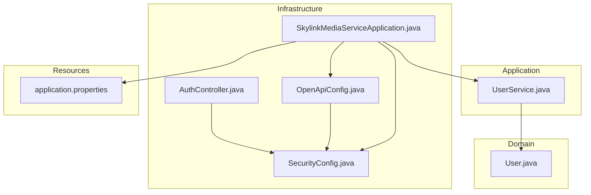
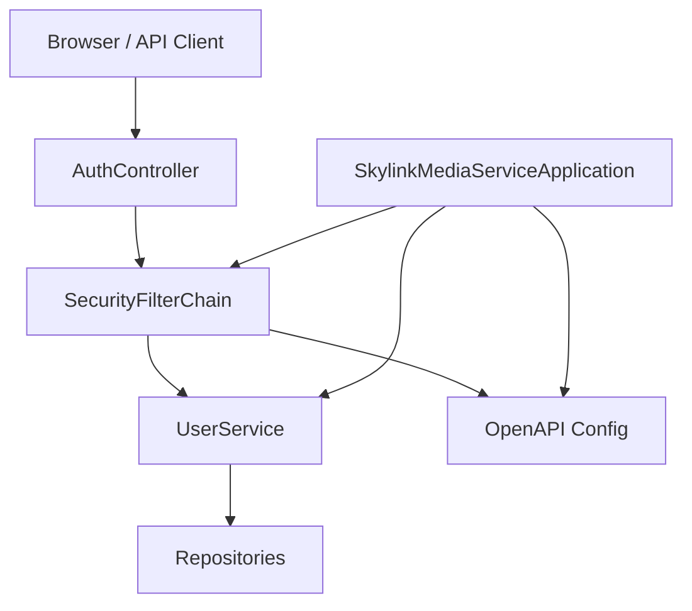
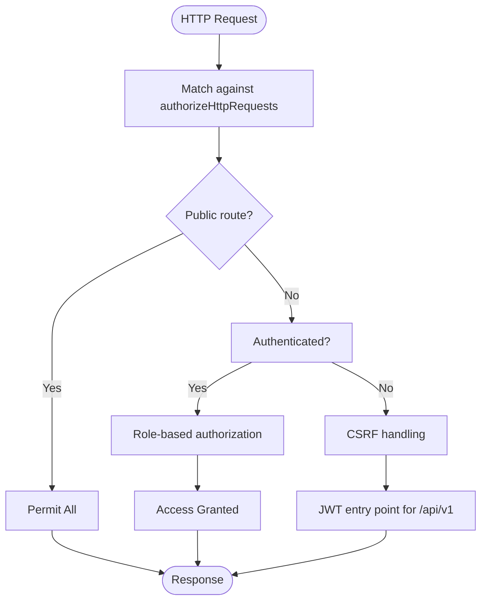
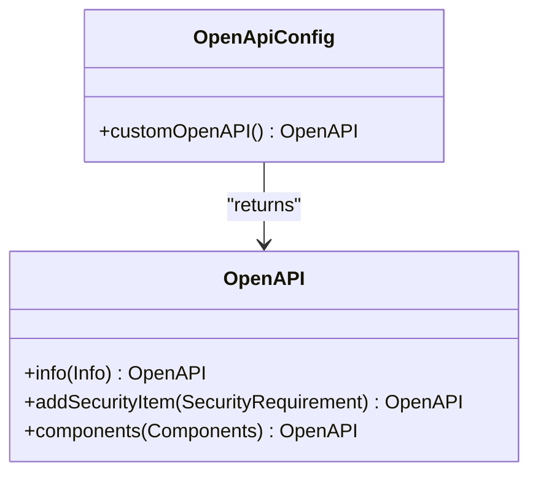
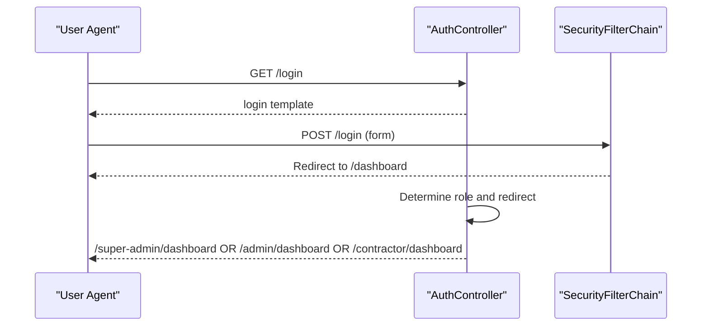
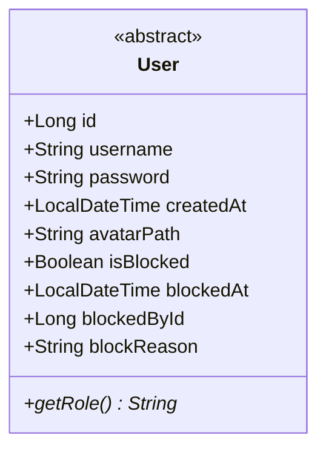
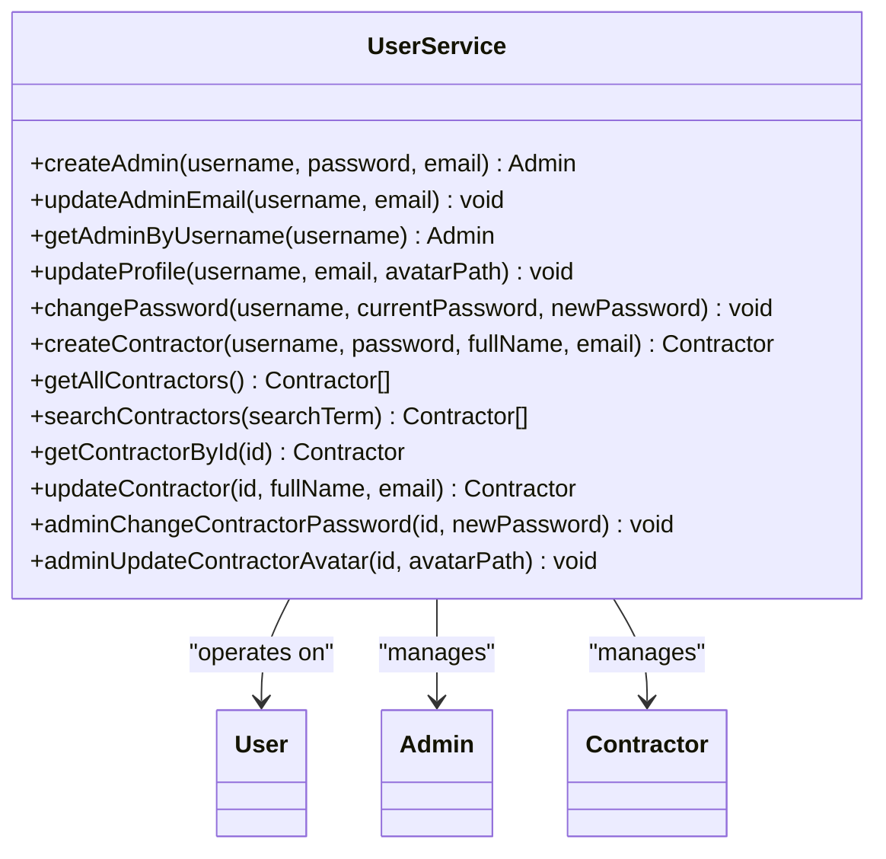
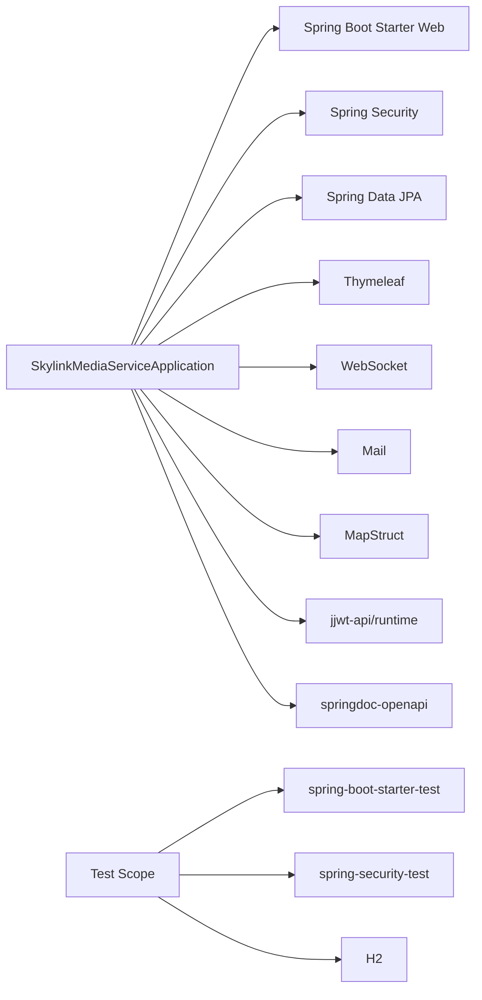
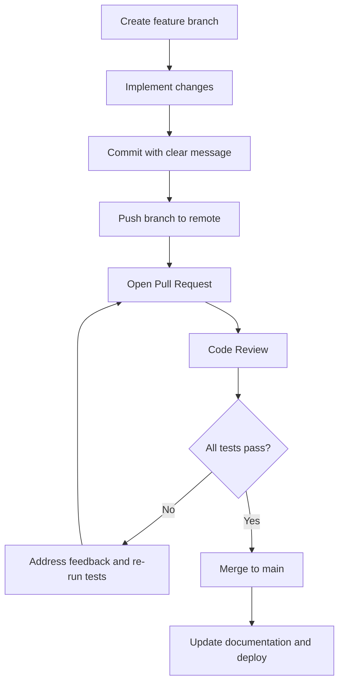

# Development Guidelines

<cite>
**Referenced Files in This Document**
- [README.md](file://README.md)
- [build.gradle](file://build.gradle)
- [settings.gradle](file://settings.gradle)
- [SkylinkMediaServiceApplication.java](file://src/main/java/root/cyb/mh/skylink_media_service/SkylinkMediaServiceApplication.java)
- [application.properties](file://src/main/resources/application.properties)
- [OpenApiConfig.java](file://src/main/java/root/cyb/mh/skylink_media_service/infrastructure/config/OpenApiConfig.java)
- [SecurityConfig.java](file://src/main/java/root/cyb/mh/skylink_media_service/infrastructure/security/SecurityConfig.java)
- [AuthController.java](file://src/main/java/root/cyb/mh/skylink_media_service/infrastructure/web/AuthController.java)
- [User.java](file://src/main/java/root/cyb/mh/skylink_media_service/domain/entities/User.java)
- [UserService.java](file://src/main/java/root/cyb/mh/skylink_media_service/application/services/UserService.java)
- [SkylinkMediaServiceApplicationTests.java](file://src/test/java/root/cyb/mh/skylink_media_service/SkylinkMediaServiceApplicationTests.java)
- [.gitignore](file://.gitignore)
- [CHANGES.md](file://CHANGES.md)
- [requirements.md](file://requirements.md)
</cite>

## Table of Contents
1. [Introduction](#introduction)
2. [Project Structure](#project-structure)
3. [Core Components](#core-components)
4. [Architecture Overview](#architecture-overview)
5. [Detailed Component Analysis](#detailed-component-analysis)
6. [Dependency Analysis](#dependency-analysis)
7. [Performance Considerations](#performance-considerations)
8. [Troubleshooting Guide](#troubleshooting-guide)
9. [Code Standards and Naming Conventions](#code-standards-and-naming-conventions)
10. [Git Workflow and Pull Request Procedures](#git-workflow-and-pull-request-procedures)
11. [Development Environment Setup](#development-environment-setup)
12. [Testing Requirements and Quality Gates](#testing-requirements-and-quality-gates)
13. [Documentation Standards](#documentation-standards)
14. [Feature Development, Bug Fixes, and Maintenance Tasks](#feature-development-bug-fixes-and-maintenance-tasks)
15. [Conclusion](#conclusion)

## Introduction
This document provides comprehensive development guidelines for contributing to the Skylink Media Service project. It consolidates code standards, Git workflow, environment setup, testing, documentation, and operational practices observed in the repository. The project is a Spring Boot 4.0.3 application written in Java 21, using PostgreSQL, Spring Security, Thymeleaf, and Gradle. It supports admin and contractor roles with photo upload capabilities and integrates OpenAPI/Swagger for API documentation.

## Project Structure
The backend follows a layered architecture with clear separation of concerns:
- Domain layer: Entities and value objects encapsulate business concepts.
- Application layer: Services orchestrate business use cases.
- Infrastructure layer: Persistence, security, web controllers, configuration, and storage.
- Resources: Templates, properties, and static assets.

**Diagram sources**
- [SkylinkMediaServiceApplication.java:1-18](file://src/main/java/root/cyb/mh/skylink_media_service/SkylinkMediaServiceApplication.java#L1-L18)
- [SecurityConfig.java:1-104](file://src/main/java/root/cyb/mh/skylink_media_service/infrastructure/security/SecurityConfig.java#L1-L104)
- [OpenApiConfig.java:1-30](file://src/main/java/root/cyb/mh/skylink_media_service/infrastructure/config/OpenApiConfig.java#L1-L30)
- [AuthController.java:1-28](file://src/main/java/root/cyb/mh/skylink_media_service/infrastructure/web/AuthController.java#L1-L28)
- [User.java:1-82](file://src/main/java/root/cyb/mh/skylink_media_service/domain/entities/User.java#L1-L82)
- [UserService.java:1-120](file://src/main/java/root/cyb/mh/skylink_media_service/application/services/UserService.java#L1-L120)
- [application.properties:1-58](file://src/main/resources/application.properties#L1-L58)

**Section sources**
- [README.md:102-116](file://README.md#L102-L116)
- [settings.gradle:1-2](file://settings.gradle#L1-L2)
- [build.gradle:1-52](file://build.gradle#L1-L52)

## Core Components
- Application bootstrap: Declares Spring Boot startup, scheduling, and async support.
- Security configuration: Defines role-based access control, CSRF behavior, CORS, session policy, and JWT filter chain integration.
- OpenAPI/Swagger: Exposes API documentation with bearer JWT authentication scheme.
- Authentication controller: Provides login and dashboard redirection logic based on roles.
- Domain entity: Base User with discriminator inheritance for Admin/Contractor.
- Application service: Implements user creation, updates, password changes, and contractor management.

**Section sources**
- [SkylinkMediaServiceApplication.java:1-18](file://src/main/java/root/cyb/mh/skylink_media_service/SkylinkMediaServiceApplication.java#L1-L18)
- [SecurityConfig.java:1-104](file://src/main/java/root/cyb/mh/skylink_media_service/infrastructure/security/SecurityConfig.java#L1-L104)
- [OpenApiConfig.java:1-30](file://src/main/java/root/cyb/mh/skylink_media_service/infrastructure/config/OpenApiConfig.java#L1-L30)
- [AuthController.java:1-28](file://src/main/java/root/cyb/mh/skylink_media_service/infrastructure/web/AuthController.java#L1-L28)
- [User.java:1-82](file://src/main/java/root/cyb/mh/skylink_media_service/domain/entities/User.java#L1-L82)
- [UserService.java:1-120](file://src/main/java/root/cyb/mh/skylink_media_service/application/services/UserService.java#L1-L120)

## Architecture Overview
The system enforces layered architecture with explicit boundaries:
- Controllers handle HTTP requests and redirect based on roles.
- Security filters enforce authentication and authorization.
- Services encapsulate business logic and coordinate repositories.
- Repositories persist domain entities.
- Configuration sets up OpenAPI, CORS, and application properties.

**Diagram sources**
- [AuthController.java:1-28](file://src/main/java/root/cyb/mh/skylink_media_service/infrastructure/web/AuthController.java#L1-L28)
- [SecurityConfig.java:1-104](file://src/main/java/root/cyb/mh/skylink_media_service/infrastructure/security/SecurityConfig.java#L1-L104)
- [OpenApiConfig.java:1-30](file://src/main/java/root/cyb/mh/skylink_media_service/infrastructure/config/OpenApiConfig.java#L1-L30)
- [UserService.java:1-120](file://src/main/java/root/cyb/mh/skylink_media_service/application/services/UserService.java#L1-L120)
- [SkylinkMediaServiceApplication.java:1-18](file://src/main/java/root/cyb/mh/skylink_media_service/SkylinkMediaServiceApplication.java#L1-L18)

## Detailed Component Analysis

### Security Configuration
Key behaviors:
- CSRF disabled for API endpoints under /api/v1.
- Public access for Swagger UI and OpenAPI docs.
- Role-based paths: /super-admin requires SUPER_ADMIN, /admin allows ADMIN and SUPER_ADMIN, /contractor requires CONTRACTOR.
- Form login and logout handlers configured.
- JWT filter integrated before UsernamePasswordAuthenticationFilter.
- CORS configured for allowed origins, methods, headers, and max age.

**Diagram sources**
- [SecurityConfig.java:43-87](file://src/main/java/root/cyb/mh/skylink_media_service/infrastructure/security/SecurityConfig.java#L43-L87)

**Section sources**
- [SecurityConfig.java:1-104](file://src/main/java/root/cyb/mh/skylink_media_service/infrastructure/security/SecurityConfig.java#L1-L104)

### OpenAPI Configuration
- Defines API info and version.
- Adds a bearerAuth security scheme for JWT tokens.
- Documents the expected Authorization header format.

**Diagram sources**
- [OpenApiConfig.java:1-30](file://src/main/java/root/cyb/mh/skylink_media_service/infrastructure/config/OpenApiConfig.java#L1-L30)

**Section sources**
- [OpenApiConfig.java:1-30](file://src/main/java/root/cyb/mh/skylink_media_service/infrastructure/config/OpenApiConfig.java#L1-L30)

### Authentication Controller
- Exposes GET /login and redirects to appropriate dashboard based on granted authorities.
- Uses role constants to determine destination.

**Diagram sources**
- [AuthController.java:1-28](file://src/main/java/root/cyb/mh/skylink_media_service/infrastructure/web/AuthController.java#L1-L28)
- [SecurityConfig.java:61-74](file://src/main/java/root/cyb/mh/skylink_media_service/infrastructure/security/SecurityConfig.java#L61-L74)

**Section sources**
- [AuthController.java:1-28](file://src/main/java/root/cyb/mh/skylink_media_service/infrastructure/web/AuthController.java#L1-L28)

### Domain Entity: User
- Single-table inheritance with discriminator column for user types.
- Shared fields: username, password, timestamps, avatar path, blocking fields.
- Abstract role method to be implemented by concrete user types.

**Diagram sources**
- [User.java:1-82](file://src/main/java/root/cyb/mh/skylink_media_service/domain/entities/User.java#L1-L82)

**Section sources**
- [User.java:1-82](file://src/main/java/root/cyb/mh/skylink_media_service/domain/entities/User.java#L1-L82)

### Application Service: UserService
- Coordinates creation, updates, and password changes for Admin and Contractor.
- Uses PasswordEncoder for secure password handling.
- Encapsulates repository interactions and business validations.

**Diagram sources**
- [UserService.java:1-120](file://src/main/java/root/cyb/mh/skylink_media_service/application/services/UserService.java#L1-L120)
- [User.java:1-82](file://src/main/java/root/cyb/mh/skylink_media_service/domain/entities/User.java#L1-L82)

**Section sources**
- [UserService.java:1-120](file://src/main/java/root/cyb/mh/skylink_media_service/application/services/UserService.java#L1-L120)

## Dependency Analysis
- Build tooling: Gradle with Spring Boot plugin, Java toolchain set to 21.
- Dependencies include Spring Web, Web MVC, Thymeleaf, Security, Data JPA, Mail, WebSocket, MapStruct, JWT libraries, and OpenAPI starter.
- Test dependencies include Spring Boot Test, Spring Security Test, H2 in-memory database, and JUnit Platform Launcher.

**Diagram sources**
- [build.gradle:21-47](file://build.gradle#L21-L47)
- [SkylinkMediaServiceApplication.java:1-18](file://src/main/java/root/cyb/mh/skylink_media_service/SkylinkMediaServiceApplication.java#L1-L18)

**Section sources**
- [build.gradle:1-52](file://build.gradle#L1-L52)

## Performance Considerations
- Keep DTOs concise and avoid loading unnecessary entity graphs.
- Use pagination for lists and limit file upload sizes as configured.
- Leverage caching judiciously; templates are disabled in development for fast iteration.
- Monitor database queries and consider indexing for frequent filters.

## Troubleshooting Guide
Common areas to inspect:
- Application startup and port binding in application properties.
- Database connectivity and schema initialization behavior.
- CORS configuration for frontend-origin communication.
- Logging level for targeted components during development.
- JWT secret and expiration settings for API access.

**Section sources**
- [application.properties:1-58](file://src/main/resources/application.properties#L1-L58)
- [SecurityConfig.java:91-102](file://src/main/java/root/cyb/mh/skylink_media_service/infrastructure/security/SecurityConfig.java#L91-L102)

## Code Standards and Naming Conventions
- Package naming: Lowercase with dot-separated segments; consistent with existing package structure.
- Class naming: PascalCase for classes and interfaces.
- Method naming: camelCase for methods; verbs for actions.
- Constants: UPPER_SNAKE_CASE for configuration keys and secrets placeholders.
- Annotations: Prefer constructor injection via @Autowired on services; keep constructors minimal.
- Exceptions: Throw domain-appropriate exceptions; avoid generic RuntimeExceptions when possible.
- Logging: Use SLF4J logger instances; log at appropriate levels (debug/info/warn/error).
- DTOs: Keep DTOs free of business logic; map via MapStruct processors.
- Configuration: Centralize environment-specific settings in application.properties; avoid hardcoding secrets.

## Git Workflow and Pull Request Procedures
Observed practices in the repository:
- Branching: Use feature branches for new features and bug fixes.
- Commit messages: Summarize changes clearly; reference related issues if applicable.
- Pull requests: Include a summary of changes, impact analysis, and testing checklist.
- Review and merge: Ensure code reviewed, tests pass, and documentation updated before merging.

**Section sources**
- [CHANGES.md:128-151](file://CHANGES.md#L128-L151)

## Development Environment Setup
Prerequisites:
- Java 21, PostgreSQL 12+, Gradle (or wrapper), WebP tools (cwebp).

Setup steps:
- Install WebP tools per platform-specific instructions.
- Create PostgreSQL database and apply schema and migrations.
- Configure application properties with database credentials.
- Make Gradle wrapper executable and run tests.
- Start the application with bootRun.

IDE configuration:
- Enable annotation processing for MapStruct.
- Configure Java 21 toolchain in IDE.
- Import Gradle project and sync dependencies.

Debugging practices:
- Adjust logging levels for targeted components.
- Use breakpoints in controllers and services.
- Verify JWT configuration and CORS settings during API testing.

**Section sources**
- [README.md:34-88](file://README.md#L34-L88)
- [.gitignore:1-38](file://.gitignore#L1-L38)
- [application.properties:1-58](file://src/main/resources/application.properties#L1-L58)

## Testing Requirements and Quality Gates
- Unit/integration tests: Use Spring Boot Test and JUnit Platform; activate test profile.
- Database isolation: H2 in-memory database used for tests.
- Coverage: Aim for high coverage in services and critical business logic.
- API verification: Swagger/OpenAPI endpoints available for manual testing.
- Smoke checks: Build, application start, login page load, and basic functionality verification.

Quality gates:
- All tests must pass.
- Code reviewed and approved.
- Documentation updated to reflect changes.
- Deployment checklist verified before production release.

**Section sources**
- [SkylinkMediaServiceApplicationTests.java:1-16](file://src/test/java/root/cyb/mh/skylink_media_service/SkylinkMediaServiceApplicationTests.java#L1-L16)
- [build.gradle:34-37](file://build.gradle#L34-L37)
- [CHANGES.md:128-151](file://CHANGES.md#L128-L151)

## Documentation Standards
- Keep technical documentation current with code changes.
- Use Markdown for procedural documents and summaries.
- Include changelogs (e.g., CHANGES.md) with file diffs, impact analysis, and rollback instructions.
- Maintain quick-start guides and verification checklists for rapid QA cycles.
- Reference requirements and feature scope documents to align development with stakeholder expectations.

**Section sources**
- [CHANGES.md:1-157](file://CHANGES.md#L1-L157)
- [requirements.md:1-18](file://requirements.md#L1-L18)

## Feature Development, Bug Fixes, and Maintenance Tasks
Guidelines derived from repository practices:
- Feature development
  - Define scope against requirements.
  - Add tests covering new logic.
  - Update documentation and changelog.
- Bug fixes
  - Include reproduction steps and fix rationale.
  - Provide rollback instructions if necessary.
  - Verify UI/API behavior and logging.
- Maintenance tasks
  - Keep dependencies updated.
  - Optimize queries and reduce N+1 selects.
  - Refactor duplicated logic into services or utilities.

**Section sources**
- [CHANGES.md:108-125](file://CHANGES.md#L108-L125)
- [requirements.md:1-18](file://requirements.md#L1-L18)

## Conclusion
These guidelines consolidate the project’s architecture, standards, and operational practices. By adhering to the established conventions—layered design, role-based security, DTO mapping, and robust testing—you can contribute effectively while maintaining code quality and consistency across the Skylink Media Service backend.