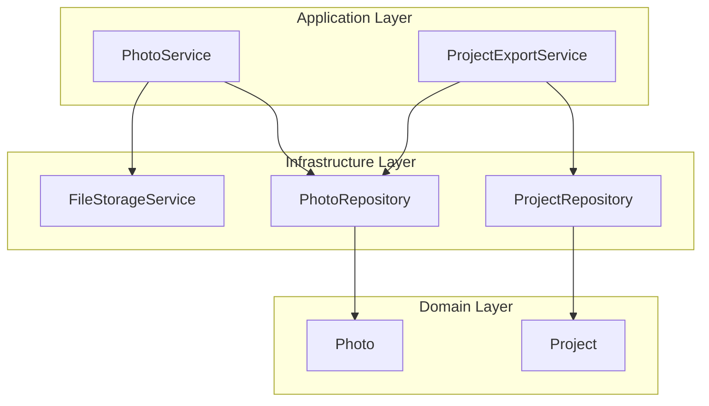
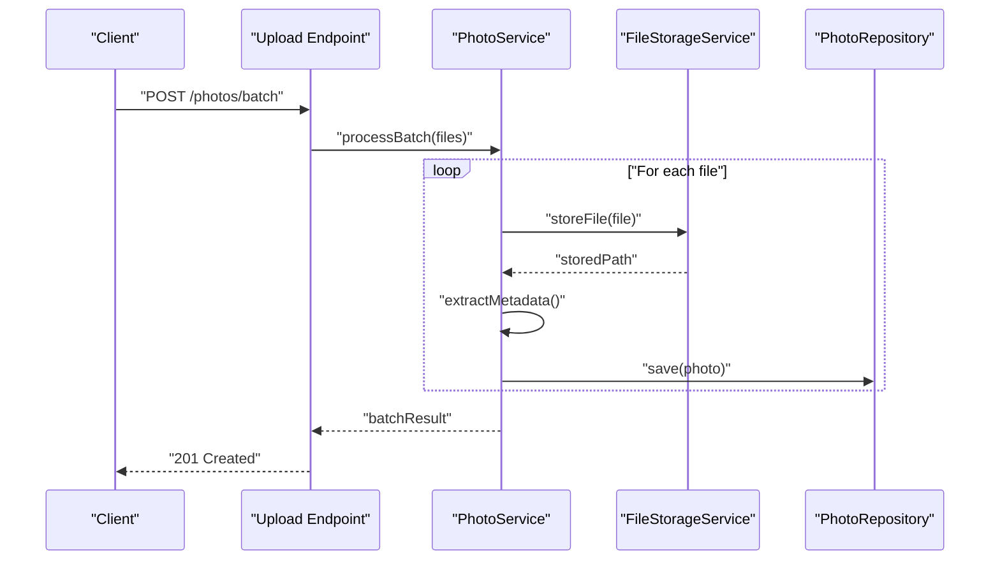
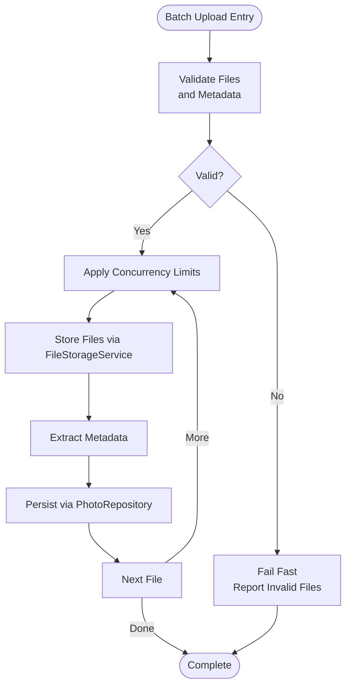
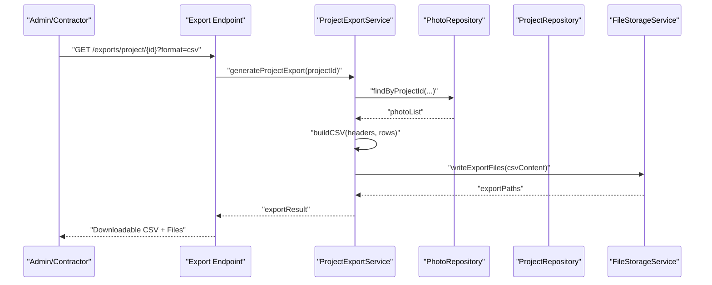
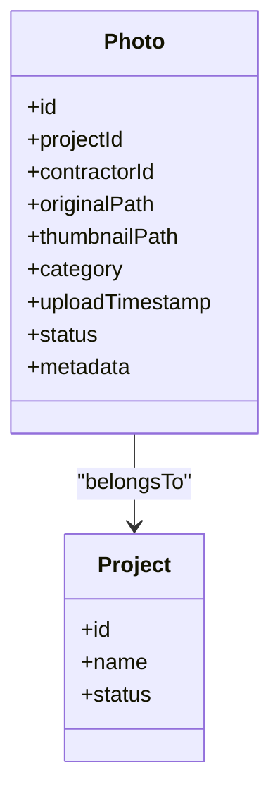
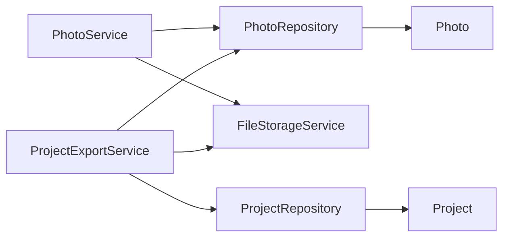

# Batch Operations & Exports

<cite>
**Referenced Files in This Document**
- [PhotoService.java](file://src/main/java/root/cyb/mh/skylink_media_service/application/services/PhotoService.java)
- [ProjectExportService.java](file://src/main/java/root/cyb/mh/skylink_media_service/application/services/ProjectExportService.java)
- [Photo.java](file://src/main/java/root/cyb/mh/skylink_media_service/domain/entities/Photo.java)
- [FileStorageService.java](file://src/main/java/root/cyb/mh/skylink_media_service/infrastructure/storage/FileStorageService.java)
- [PhotoRepository.java](file://src/main/java/root/cyb/mh/skylink_media_service/infrastructure/persistence/PhotoRepository.java)
- [ProjectRepository.java](file://src/main/java/root/cyb/mh/skylink_media_service/infrastructure/persistence/ProjectRepository.java)
- [CSV_EXPORT_IMPLEMENTATION.md](file://CSV_EXPORT_IMPLEMENTATION.md)
- [README.md](file://README.md)
- [REST_API_IMPLEMENTATION.md](file://REST_API_IMPLEMENTATION.md)
</cite>

## Table of Contents
1. [Introduction](#introduction)
2. [Project Structure](#project-structure)
3. [Core Components](#core-components)
4. [Architecture Overview](#architecture-overview)
5. [Detailed Component Analysis](#detailed-component-analysis)
6. [Dependency Analysis](#dependency-analysis)
7. [Performance Considerations](#performance-considerations)
8. [Troubleshooting Guide](#troubleshooting-guide)
9. [Conclusion](#conclusion)

## Introduction
This document explains batch operations and export capabilities for photo management within the media service backend. It covers bulk upload workflows, mass processing strategies, concurrent operation handling, and export mechanisms for project photo collections, contractor portfolios, and administrative reporting. It also documents CSV export formats, metadata inclusion, file organization strategies, performance considerations for large-scale operations, memory management, timeout handling, error recovery in batch processes, partial failure scenarios, and practical examples of batch job configurations and monitoring approaches.

## Project Structure
The relevant subsystems for batch operations and exports are organized around:
- Application services for photo handling and exports
- Domain entities representing photos and projects
- Infrastructure storage and persistence layers
- Export documentation and API implementation references

**Diagram sources**
- [PhotoService.java](file://src/main/java/root/cyb/mh/skylink_media_service/application/services/PhotoService.java)
- [ProjectExportService.java](file://src/main/java/root/cyb/mh/skylink_media_service/application/services/ProjectExportService.java)
- [Photo.java](file://src/main/java/root/cyb/mh/skylink_media_service/domain/entities/Photo.java)
- [PhotoRepository.java](file://src/main/java/root/cyb/mh/skylink_media_service/infrastructure/persistence/PhotoRepository.java)
- [ProjectRepository.java](file://src/main/java/root/cyb/mh/skylink_media_service/infrastructure/persistence/ProjectRepository.java)
- [FileStorageService.java](file://src/main/java/root/cyb/mh/skylink_media_service/infrastructure/storage/FileStorageService.java)

**Section sources**
- [README.md](file://README.md)
- [REST_API_IMPLEMENTATION.md](file://REST_API_IMPLEMENTATION.md)

## Core Components
- PhotoService: Handles photo ingestion, metadata extraction, thumbnail generation, and bulk upload orchestration.
- ProjectExportService: Coordinates exports for project photo collections, contractor portfolios, and administrative reporting.
- Photo entity: Represents stored photo metadata and associations.
- FileStorageService: Manages file system operations, including upload destinations and cleanup.
- Repositories: Persist and query photos and projects for batch operations and exports.

Key responsibilities:
- Bulk upload: Accept multiple files, validate formats, extract metadata, and persist records.
- Mass processing: Apply transformations (e.g., thumbnails) and handle concurrency safely.
- Concurrent operations: Use thread-safe patterns and bounded concurrency to avoid resource exhaustion.
- Exports: Aggregate photo sets per project or contractor, produce CSV with metadata, and organize exported files.

**Section sources**
- [PhotoService.java](file://src/main/java/root/cyb/mh/skylink_media_service/application/services/PhotoService.java)
- [ProjectExportService.java](file://src/main/java/root/cyb/mh/skylink_media_service/application/services/ProjectExportService.java)
- [Photo.java](file://src/main/java/root/cyb/mh/skylink_media_service/domain/entities/Photo.java)
- [FileStorageService.java](file://src/main/java/root/cyb/mh/skylink_media_service/infrastructure/storage/FileStorageService.java)
- [PhotoRepository.java](file://src/main/java/root/cyb/mh/skylink_media_service/infrastructure/persistence/PhotoRepository.java)
- [ProjectRepository.java](file://src/main/java/root/cyb/mh/skylink_media_service/infrastructure/persistence/ProjectRepository.java)

## Architecture Overview
The batch and export pipeline integrates application services with domain entities and infrastructure components. Photos are ingested via PhotoService, persisted through repositories, and later exported by ProjectExportService. FileStorageService manages physical file placement and cleanup.

**Diagram sources**
- [PhotoService.java](file://src/main/java/root/cyb/mh/skylink_media_service/application/services/PhotoService.java)
- [FileStorageService.java](file://src/main/java/root/cyb/mh/skylink_media_service/infrastructure/storage/FileStorageService.java)
- [PhotoRepository.java](file://src/main/java/root/cyb/mh/skylink_media_service/infrastructure/persistence/PhotoRepository.java)

## Detailed Component Analysis

### PhotoService: Bulk Upload and Mass Processing
Responsibilities:
- Accept multipart file arrays for batch uploads
- Validate file types and sizes
- Extract metadata (dimensions, timestamps, categories)
- Generate thumbnails and maintain original assets
- Persist photo records with associated project/contractor context
- Manage concurrency limits to prevent resource exhaustion

Concurrency and performance:
- Use bounded thread pools for parallel processing
- Stream large files to avoid excessive memory usage
- Apply backpressure when downstream systems throttle

Error handling:
- Fail-fast on invalid inputs
- Continue processing remaining files on individual failures
- Log errors with context for recovery

**Diagram sources**
- [PhotoService.java](file://src/main/java/root/cyb/mh/skylink_media_service/application/services/PhotoService.java)
- [FileStorageService.java](file://src/main/java/root/cyb/mh/skylink_media_service/infrastructure/storage/FileStorageService.java)
- [PhotoRepository.java](file://src/main/java/root/cyb/mh/skylink_media_service/infrastructure/persistence/PhotoRepository.java)

**Section sources**
- [PhotoService.java](file://src/main/java/root/cyb/mh/skylink_media_service/application/services/PhotoService.java)

### ProjectExportService: Export Workflows
Responsibilities:
- Build export sets for projects, contractors, and admin dashboards
- Generate CSV with standardized headers and embedded metadata
- Organize exported files by project/contractor and date
- Support filtering by status, category, and date range

Export formats and metadata:
- CSV headers include identifiers, timestamps, categories, and derived metrics
- Metadata fields align with Photo entity attributes and project associations
- File naming follows consistent patterns for traceability

**Diagram sources**
- [ProjectExportService.java](file://src/main/java/root/cyb/mh/skylink_media_service/application/services/ProjectExportService.java)
- [PhotoRepository.java](file://src/main/java/root/cyb/mh/skylink_media_service/infrastructure/persistence/PhotoRepository.java)
- [ProjectRepository.java](file://src/main/java/root/cyb/mh/skylink_media_service/infrastructure/persistence/ProjectRepository.java)
- [FileStorageService.java](file://src/main/java/root/cyb/mh/skylink_media_service/infrastructure/storage/FileStorageService.java)

**Section sources**
- [ProjectExportService.java](file://src/main/java/root/cyb/mh/skylink_media_service/application/services/ProjectExportService.java)
- [CSV_EXPORT_IMPLEMENTATION.md](file://CSV_EXPORT_IMPLEMENTATION.md)

### Photo Entity: Data Model for Batch Operations
The Photo entity encapsulates metadata and associations used across batch and export workflows.

**Diagram sources**
- [Photo.java](file://src/main/java/root/cyb/mh/skylink_media_service/domain/entities/Photo.java)
- [ProjectRepository.java](file://src/main/java/root/cyb/mh/skylink_media_service/infrastructure/persistence/ProjectRepository.java)

**Section sources**
- [Photo.java](file://src/main/java/root/cyb/mh/skylink_media_service/domain/entities/Photo.java)

### FileStorageService: Storage and Organization
Manages file placement, naming, and cleanup for uploaded and exported assets.

- Upload destination strategy: per-project/contractor/date-based folders
- Export organization: structured directories with CSV alongside assets
- Cleanup policies: retention windows and orphan detection

**Section sources**
- [FileStorageService.java](file://src/main/java/root/cyb/mh/skylink_media_service/infrastructure/storage/FileStorageService.java)

## Dependency Analysis
The following diagram shows key dependencies among components involved in batch operations and exports.

**Diagram sources**
- [PhotoService.java](file://src/main/java/root/cyb/mh/skylink_media_service/application/services/PhotoService.java)
- [ProjectExportService.java](file://src/main/java/root/cyb/mh/skylink_media_service/application/services/ProjectExportService.java)
- [PhotoRepository.java](file://src/main/java/root/cyb/mh/skylink_media_service/infrastructure/persistence/PhotoRepository.java)
- [ProjectRepository.java](file://src/main/java/root/cyb/mh/skylink_media_service/infrastructure/persistence/ProjectRepository.java)
- [FileStorageService.java](file://src/main/java/root/cyb/mh/skylink_media_service/infrastructure/storage/FileStorageService.java)
- [Photo.java](file://src/main/java/root/cyb/mh/skylink_media_service/domain/entities/Photo.java)

**Section sources**
- [PhotoService.java](file://src/main/java/root/cyb/mh/skylink_media_service/application/services/PhotoService.java)
- [ProjectExportService.java](file://src/main/java/root/cyb/mh/skylink_media_service/application/services/ProjectExportService.java)

## Performance Considerations
- Concurrency limits: Configure thread pool sizes aligned with CPU and I/O capacity to avoid saturation.
- Memory management: Stream file uploads and process in chunks; avoid loading entire files into memory.
- Timeout handling: Set explicit read/write timeouts for storage operations and repository transactions.
- Batching strategy: Use chunked processing for large batches; commit in smaller transactions to reduce lock contention.
- Caching: Cache frequently accessed metadata and thumbnails to reduce repeated computation.
- Monitoring: Track queue depths, throughput, and error rates for batch jobs.

[No sources needed since this section provides general guidance]

## Troubleshooting Guide
Common issues and recovery strategies:
- Partial failures in batch uploads: Log failed items with reasons; retry only failed entries; notify administrators for manual intervention.
- Storage errors: Validate disk space and permissions; implement fallback storage paths; monitor quota usage.
- Repository timeouts: Increase connection pool sizes; optimize queries; add pagination for large result sets.
- Export inconsistencies: Rebuild CSV incrementally; reconcile missing files; re-export only changed records.
- Monitoring gaps: Instrument critical paths; emit metrics for latency and error rates; set up alerts for sustained degradation.

**Section sources**
- [PhotoService.java](file://src/main/java/root/cyb/mh/skylink_media_service/application/services/PhotoService.java)
- [ProjectExportService.java](file://src/main/java/root/cyb/mh/skylink_media_service/application/services/ProjectExportService.java)

## Conclusion
The system provides robust foundations for batch photo operations and exports through coordinated services, entities, and infrastructure components. By applying bounded concurrency, streaming, and resilient error handling, it supports large-scale workflows while maintaining data integrity and operability. Administrators can configure batch jobs, monitor progress, and recover from partial failures with minimal disruption.