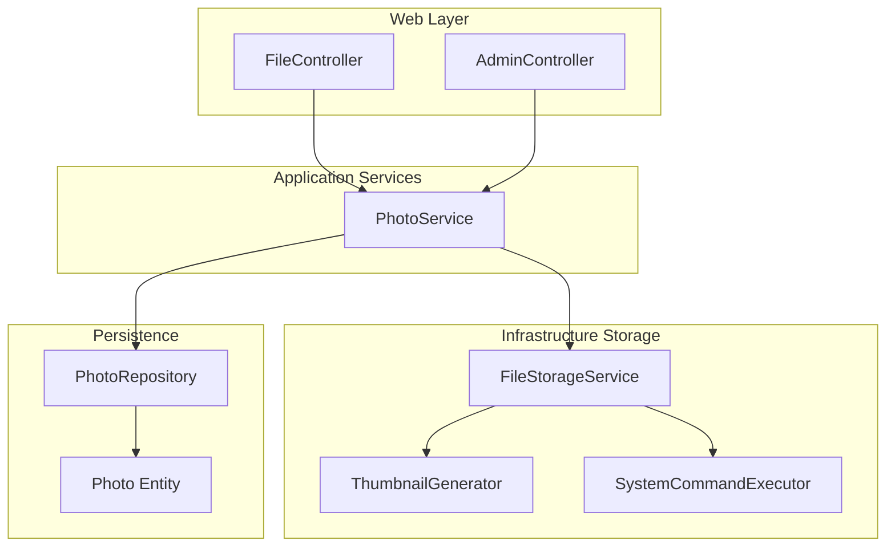
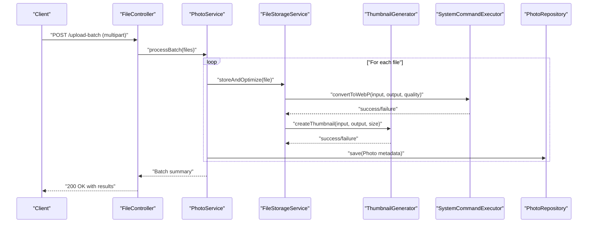
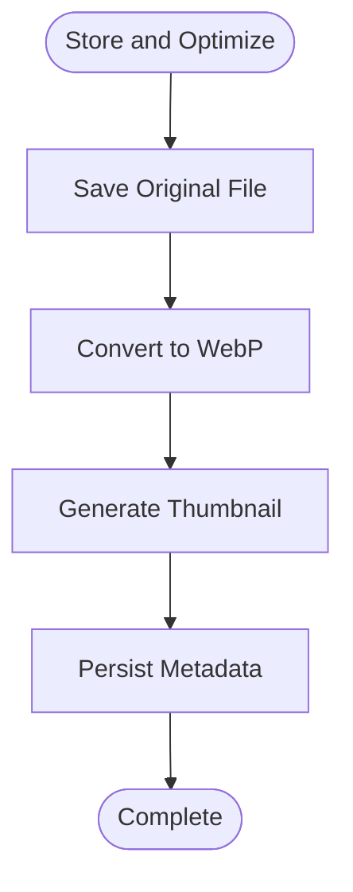
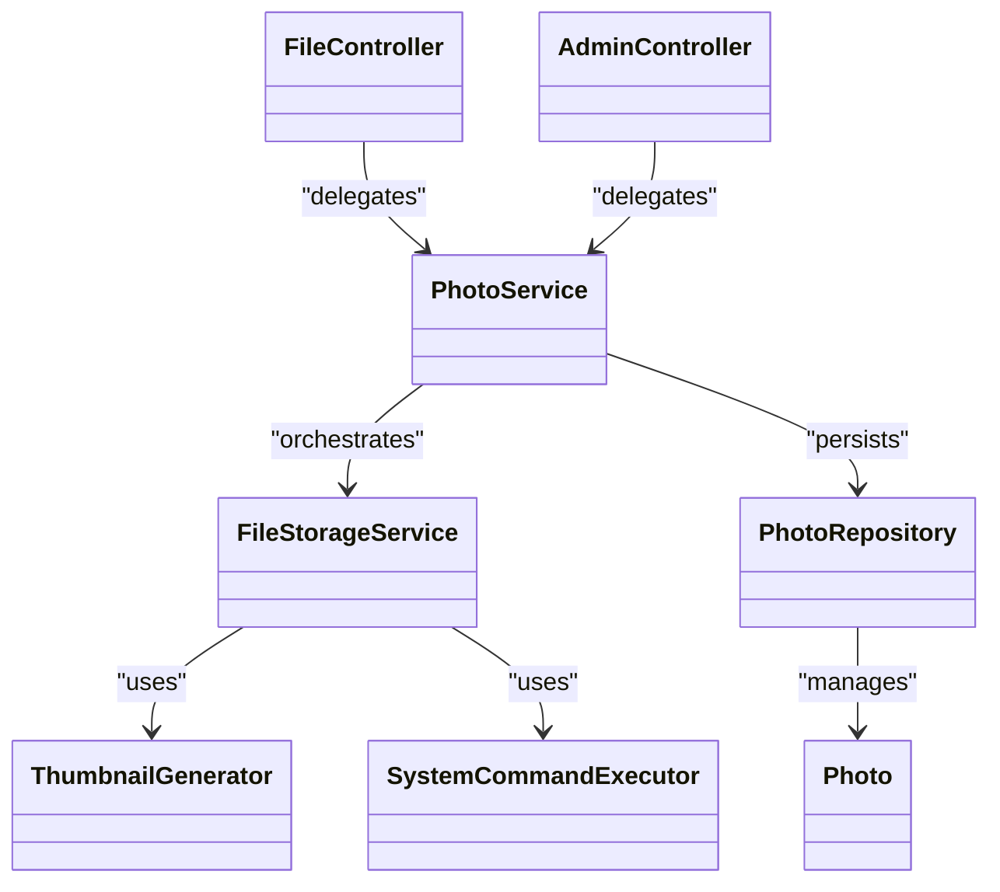

# Batch Processing

<cite>
**Referenced Files in This Document**
- [FileStorageService.java](file://src/main/java/root/cyb/mh/skylink_media_service/infrastructure/storage/FileStorageService.java)
- [SystemCommandExecutor.java](file://src/main/java/root/cyb/mh/skylink_media_service/infrastructure/storage/SystemCommandExecutor.java)
- [ThumbnailGenerator.java](file://src/main/java/root/cyb/mh/skylink_media_service/infrastructure/storage/ThumbnailGenerator.java)
- [FileController.java](file://src/main/java/root/cyb/mh/skylink_media_service/infrastructure/web/FileController.java)
- [PhotoService.java](file://src/main/java/root/cyb/mh/skylink_media_service/application/services/PhotoService.java)
- [PhotoRepository.java](file://src/main/java/root/cyb/mh/skylink_media_service/infrastructure/persistence/PhotoRepository.java)
- [Photo.java](file://src/main/java/root/cyb/mh/skylink_media_service/domain/entities/Photo.java)
- [AdminController.java](file://src/main/java/root/cyb/mh/skylink_media_service/infrastructure/web/AdminController.java)
- [GlobalApiExceptionHandler.java](file://src/main/java/root/cyb/mh/skylink_media_service/infrastructure/web/exception/GlobalApiExceptionHandler.java)
- [application.properties](file://src/main/resources/application.properties)
</cite>

## Table of Contents
1. [Introduction](#introduction)
2. [Project Structure](#project-structure)
3. [Core Components](#core-components)
4. [Architecture Overview](#architecture-overview)
5. [Detailed Component Analysis](#detailed-component-analysis)
6. [Dependency Analysis](#dependency-analysis)
7. [Performance Considerations](#performance-considerations)
8. [Troubleshooting Guide](#troubleshooting-guide)
9. [Conclusion](#conclusion)

## Introduction
This document explains the batch image processing capabilities implemented in the media service backend. It focuses on concurrent operation handling, queue management, and parallel processing strategies for batch uploads and bulk optimization. It also covers memory management during large-scale processing, error handling for partial failures, retry mechanisms, progress tracking, batch size optimization, resource allocation, performance monitoring, scalability, and load balancing for high-volume scenarios.

## Project Structure
The batch processing pipeline centers around the storage subsystem and web controllers:
- Infrastructure storage layer handles file conversion, thumbnail generation, and system command execution.
- Web controllers expose endpoints for uploading images and exporting batches.
- Application services orchestrate business logic and coordinate persistence.
- Persistence layer stores metadata for processed photos.
- Exception handling ensures robustness under partial failures.

**Diagram sources**
- [FileController.java](file://src/main/java/root/cyb/mh/skylink_media_service/infrastructure/web/FileController.java)
- [PhotoService.java](file://src/main/java/root/cyb/mh/skylink_media_service/application/services/PhotoService.java)
- [FileStorageService.java](file://src/main/java/root/cyb/mh/skylink_media_service/infrastructure/storage/FileStorageService.java)
- [ThumbnailGenerator.java](file://src/main/java/root/cyb/mh/skylink_media_service/infrastructure/storage/ThumbnailGenerator.java)
- [SystemCommandExecutor.java](file://src/main/java/root/cyb/mh/skylink_media_service/infrastructure/storage/SystemCommandExecutor.java)
- [PhotoRepository.java](file://src/main/java/root/cyb/mh/skylink_media_service/infrastructure/persistence/PhotoRepository.java)
- [Photo.java](file://src/main/java/root/cyb/mh/skylink_media_service/domain/entities/Photo.java)

**Section sources**
- [FileController.java](file://src/main/java/root/cyb/mh/skylink_media_service/infrastructure/web/FileController.java)
- [PhotoService.java](file://src/main/java/root/cyb/mh/skylink_media_service/application/services/PhotoService.java)
- [FileStorageService.java](file://src/main/java/root/cyb/mh/skylink_media_service/infrastructure/storage/FileStorageService.java)
- [ThumbnailGenerator.java](file://src/main/java/root/cyb/mh/skylink_media_service/infrastructure/storage/ThumbnailGenerator.java)
- [SystemCommandExecutor.java](file://src/main/java/root/cyb/mh/skylink_media_service/infrastructure/storage/SystemCommandExecutor.java)
- [PhotoRepository.java](file://src/main/java/root/cyb/mh/skylink_media_service/infrastructure/persistence/PhotoRepository.java)
- [Photo.java](file://src/main/java/root/cyb/mh/skylink_media_service/domain/entities/Photo.java)

## Core Components
- FileStorageService: Orchestrates saving originals, converting to WebP, and generating thumbnails. It coordinates with SystemCommandExecutor and ThumbnailGenerator.
- ThumbnailGenerator: Executes external commands to resize and encode thumbnails.
- SystemCommandExecutor: Runs cwebp for WebP conversion and validates exit codes.
- PhotoService: Coordinates batch operations, persists metadata, and integrates with repositories.
- FileController and AdminController: Expose endpoints for uploads and batch exports.
- PhotoRepository and Photo entity: Persist and model photo metadata.

Key batch-related capabilities:
- Batch upload workflow via multipart form submissions.
- Bulk optimization through WebP conversion and thumbnail generation.
- Memory-conscious streaming for large files.
- Partial failure handling with logging and graceful degradation.

**Section sources**
- [FileStorageService.java](file://src/main/java/root/cyb/mh/skylink_media_service/infrastructure/storage/FileStorageService.java)
- [SystemCommandExecutor.java](file://src/main/java/root/cyb/mh/skylink_media_service/infrastructure/storage/SystemCommandExecutor.java)
- [ThumbnailGenerator.java](file://src/main/java/root/cyb/mh/skylink_media_service/infrastructure/storage/ThumbnailGenerator.java)
- [PhotoService.java](file://src/main/java/root/cyb/mh/skylink_media_service/application/services/PhotoService.java)
- [FileController.java](file://src/main/java/root/cyb/mh/skylink_media_service/infrastructure/web/FileController.java)
- [PhotoRepository.java](file://src/main/java/root/cyb/mh/skylink_media_service/infrastructure/persistence/PhotoRepository.java)
- [Photo.java](file://src/main/java/root/cyb/mh/skylink_media_service/domain/entities/Photo.java)

## Architecture Overview
The batch processing architecture follows a layered design:
- Controllers accept batch requests and delegate to application services.
- Services manage concurrency, orchestrate storage operations, and persist results.
- Storage layer executes external commands for image optimization and thumbnailing.
- Persistence layer maintains metadata for retrieval and export.

**Diagram sources**
- [FileController.java](file://src/main/java/root/cyb/mh/skylink_media_service/infrastructure/web/FileController.java)
- [PhotoService.java](file://src/main/java/root/cyb/mh/skylink_media_service/application/services/PhotoService.java)
- [FileStorageService.java](file://src/main/java/root/cyb/mh/skylink_media_service/infrastructure/storage/FileStorageService.java)
- [ThumbnailGenerator.java](file://src/main/java/root/cyb/mh/skylink_media_service/infrastructure/storage/ThumbnailGenerator.java)
- [SystemCommandExecutor.java](file://src/main/java/root/cyb/mh/skylink_media_service/infrastructure/storage/SystemCommandExecutor.java)
- [PhotoRepository.java](file://src/main/java/root/cyb/mh/skylink_media_service/infrastructure/persistence/PhotoRepository.java)

## Detailed Component Analysis

### FileStorageService
Responsibilities:
- Save original files to preserve metadata.
- Convert originals to WebP using SystemCommandExecutor.
- Generate thumbnails using ThumbnailGenerator.
- Return storage results with paths for original, WebP, and thumbnail.

Concurrency and parallelism:
- The current implementation processes files sequentially per request. To enable batch parallelism, introduce a thread pool or reactive streams to process multiple files concurrently while respecting CPU and I/O limits.

Memory management:
- Uses streaming copy for large files and streaming reads/writes for ZIP exports.
- Avoids loading entire files into heap memory unnecessarily.

Error handling:
- Validates exit codes from external commands and propagates meaningful errors.
- Logs failures and continues processing remaining items in a batch.

**Diagram sources**
- [FileStorageService.java](file://src/main/java/root/cyb/mh/skylink_media_service/infrastructure/storage/FileStorageService.java)
- [SystemCommandExecutor.java](file://src/main/java/root/cyb/mh/skylink_media_service/infrastructure/storage/SystemCommandExecutor.java)
- [ThumbnailGenerator.java](file://src/main/java/root/cyb/mh/skylink_media_service/infrastructure/storage/ThumbnailGenerator.java)

**Section sources**
- [FileStorageService.java](file://src/main/java/root/cyb/mh/skylink_media_service/infrastructure/storage/FileStorageService.java)
- [SystemCommandExecutor.java](file://src/main/java/root/cyb/mh/skylink_media_service/infrastructure/storage/SystemCommandExecutor.java)
- [ThumbnailGenerator.java](file://src/main/java/root/cyb/mh/skylink_media_service/infrastructure/storage/ThumbnailGenerator.java)

### ThumbnailGenerator
Responsibilities:
- Resize and encode thumbnails using cwebp.
- Validate exit codes and capture error output for diagnostics.

Parallel processing:
- Can be executed concurrently for multiple images in a batch.
- Consider limiting concurrent invocations to avoid saturating CPU.

**Section sources**
- [ThumbnailGenerator.java](file://src/main/java/root/cyb/mh/skylink_media_service/infrastructure/storage/ThumbnailGenerator.java)

### SystemCommandExecutor
Responsibilities:
- Execute cwebp with quality and metadata flags.
- Wait for completion and check exit codes.
- Propagate interruptions and failures.

Resource allocation:
- External process execution consumes CPU and disk I/O.
- Tune quality and metadata flags to balance speed and output size.

**Section sources**
- [SystemCommandExecutor.java](file://src/main/java/root/cyb/mh/skylink_media_service/infrastructure/storage/SystemCommandExecutor.java)

### PhotoService
Responsibilities:
- Orchestrate batch operations.
- Persist photo metadata after successful processing.
- Coordinate with repositories for retrieval and export.

Batch orchestration:
- Iterate over uploaded files and apply store-and-optimize workflow.
- Aggregate results and handle partial failures gracefully.

**Section sources**
- [PhotoService.java](file://src/main/java/root/cyb/mh/skylink_media_service/application/services/PhotoService.java)
- [PhotoRepository.java](file://src/main/java/root/cyb/mh/skylink_media_service/infrastructure/persistence/PhotoRepository.java)
- [Photo.java](file://src/main/java/root/cyb/mh/skylink_media_service/domain/entities/Photo.java)

### FileController
Responsibilities:
- Expose endpoints for single and batch uploads.
- Validate requests and delegate to PhotoService.
- Stream ZIP exports for selected photos.

Batch upload workflow:
- Accept multipart form data.
- Iterate over parts and process each file through PhotoService.

ZIP export:
- Streams photo assets to a ZIP archive for download.
- Includes fallback logic for missing files and logs errors to continue.

**Section sources**
- [FileController.java](file://src/main/java/root/cyb/mh/skylink_media_service/infrastructure/web/FileController.java)
- [AdminController.java](file://src/main/java/root/cyb/mh/skylink_media_service/infrastructure/web/AdminController.java)

### PhotoRepository and Photo Entity
Responsibilities:
- Persist and retrieve photo metadata.
- Support queries for batch operations and exports.

**Section sources**
- [PhotoRepository.java](file://src/main/java/root/cyb/mh/skylink_media_service/infrastructure/persistence/PhotoRepository.java)
- [Photo.java](file://src/main/java/root/cyb/mh/skylink_media_service/domain/entities/Photo.java)

## Dependency Analysis

**Diagram sources**
- [FileStorageService.java](file://src/main/java/root/cyb/mh/skylink_media_service/infrastructure/storage/FileStorageService.java)
- [ThumbnailGenerator.java](file://src/main/java/root/cyb/mh/skylink_media_service/infrastructure/storage/ThumbnailGenerator.java)
- [SystemCommandExecutor.java](file://src/main/java/root/cyb/mh/skylink_media_service/infrastructure/storage/SystemCommandExecutor.java)
- [PhotoService.java](file://src/main/java/root/cyb/mh/skylink_media_service/application/services/PhotoService.java)
- [FileController.java](file://src/main/java/root/cyb/mh/skylink_media_service/infrastructure/web/FileController.java)
- [AdminController.java](file://src/main/java/root/cyb/mh/skylink_media_service/infrastructure/web/AdminController.java)
- [PhotoRepository.java](file://src/main/java/root/cyb/mh/skylink_media_service/infrastructure/persistence/PhotoRepository.java)
- [Photo.java](file://src/main/java/root/cyb/mh/skylink_media_service/domain/entities/Photo.java)

**Section sources**
- [FileStorageService.java](file://src/main/java/root/cyb/mh/skylink_media_service/infrastructure/storage/FileStorageService.java)
- [PhotoService.java](file://src/main/java/root/cyb/mh/skylink_media_service/application/services/PhotoService.java)
- [FileController.java](file://src/main/java/root/cyb/mh/skylink_media_service/infrastructure/web/FileController.java)
- [PhotoRepository.java](file://src/main/java/root/cyb/mh/skylink_media_service/infrastructure/persistence/PhotoRepository.java)
- [Photo.java](file://src/main/java/root/cyb/mh/skylink_media_service/domain/entities/Photo.java)

## Performance Considerations
- Concurrency model:
  - Introduce a bounded thread pool or reactive streams to process multiple files concurrently.
  - Limit concurrent external process executions to prevent CPU and I/O saturation.
- Batch sizing:
  - Tune batch size based on available CPU, memory, and disk throughput.
  - Monitor queue depth and adjust dynamically under load.
- Memory management:
  - Continue using streaming I/O for uploads and ZIP exports.
  - Avoid buffering entire images in memory; process in chunks.
- Resource allocation:
  - Configure JVM heap and GC settings for large-scale processing.
  - Set limits on file sizes and concurrent requests to protect the server.
- Quality and metadata trade-offs:
  - Adjust WebP quality and metadata flags to balance speed and output size.
- Monitoring:
  - Track throughput, latency, error rates, and queue length.
  - Instrument external command execution and storage operations.

[No sources needed since this section provides general guidance]

## Troubleshooting Guide
Common issues and resolutions:
- External command failures:
  - Verify cwebp availability and permissions.
  - Inspect exit codes and captured error output for diagnostics.
- Partial failures in batches:
  - Log individual failures and continue processing remaining items.
  - Provide a summary report indicating successes and failures.
- Missing files during ZIP export:
  - Implement fallback paths and skip missing assets with warnings.
- Interrupted operations:
  - Ensure proper interruption handling and cleanup of temporary resources.
- Global exception handling:
  - Centralized exception handling ensures consistent error responses.

**Section sources**
- [SystemCommandExecutor.java](file://src/main/java/root/cyb/mh/skylink_media_service/infrastructure/storage/SystemCommandExecutor.java)
- [ThumbnailGenerator.java](file://src/main/java/root/cyb/mh/skylink_media_service/infrastructure/storage/ThumbnailGenerator.java)
- [GlobalApiExceptionHandler.java](file://src/main/java/root/cyb/mh/skylink_media_service/infrastructure/web/exception/GlobalApiExceptionHandler.java)
- [AdminController.java](file://src/main/java/root/cyb/mh/skylink_media_service/infrastructure/web/AdminController.java)

## Conclusion
The media service backend provides a solid foundation for batch image processing with WebP conversion and thumbnail generation. To scale to high-volume scenarios, adopt a bounded concurrency model, optimize batch sizes, monitor resource utilization, and implement robust error handling and progress tracking. These enhancements will improve throughput, reliability, and operability under load.