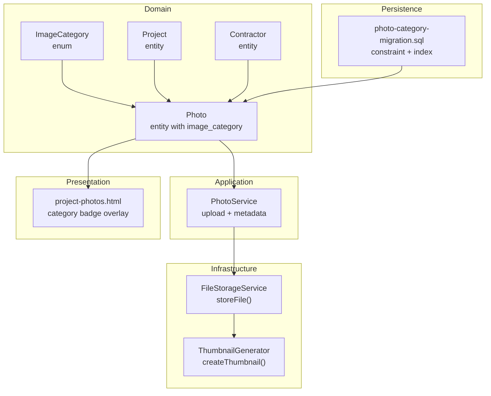
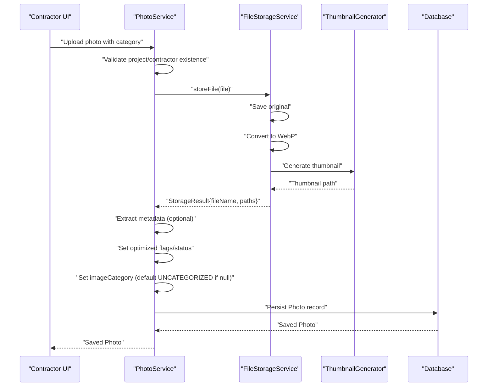
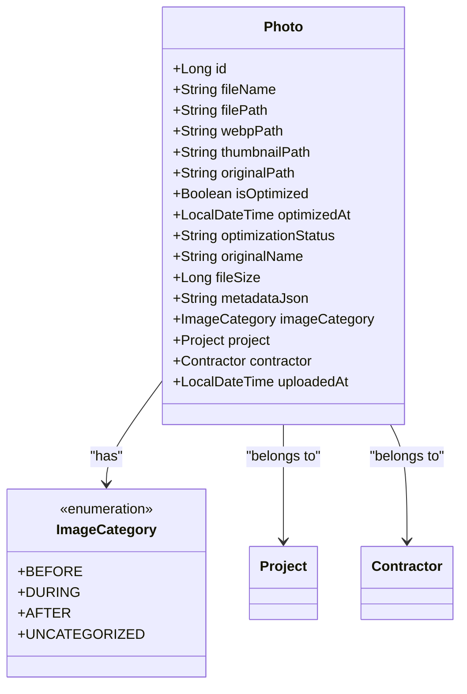
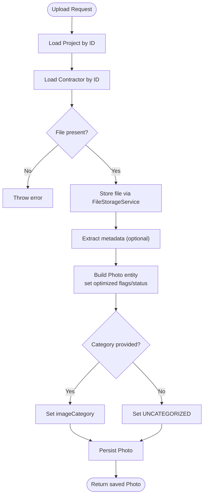
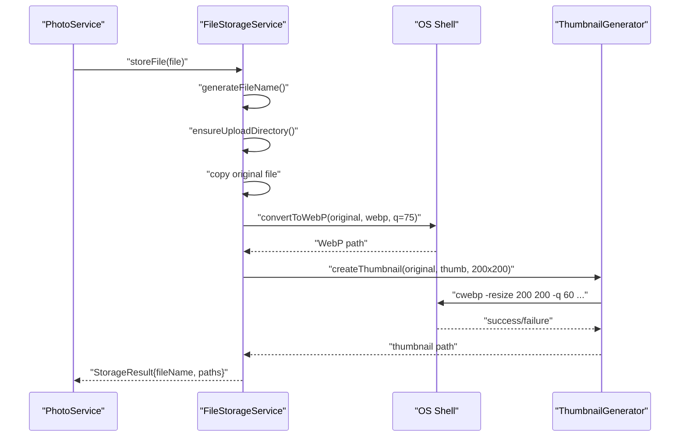
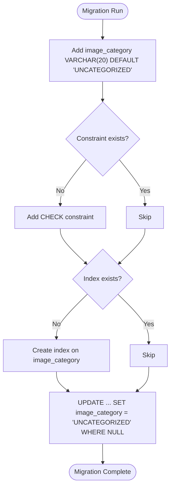
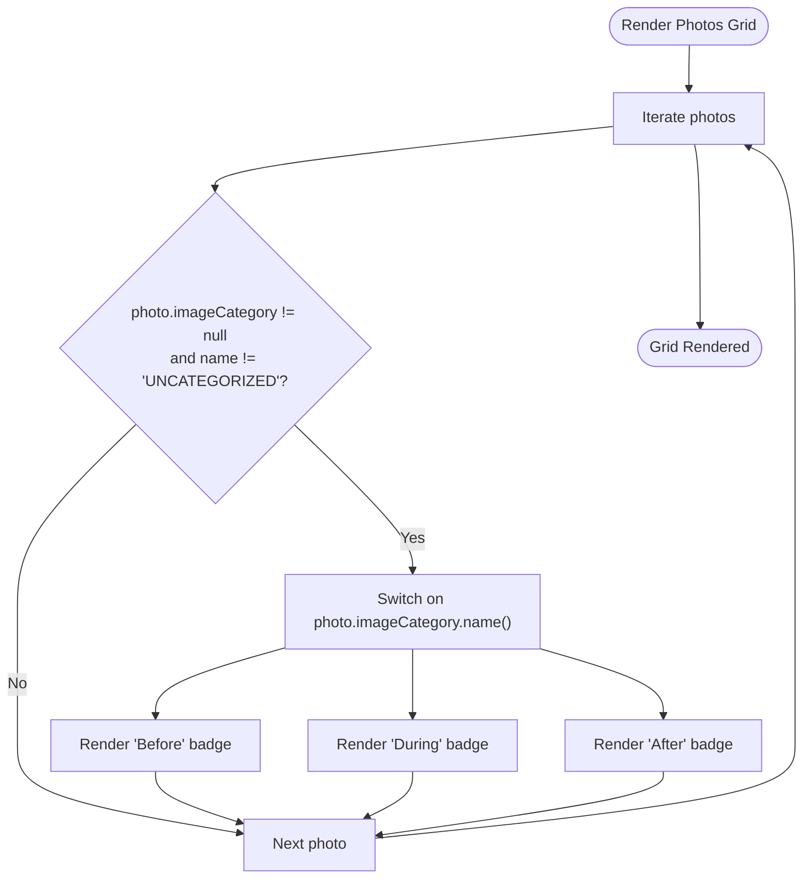
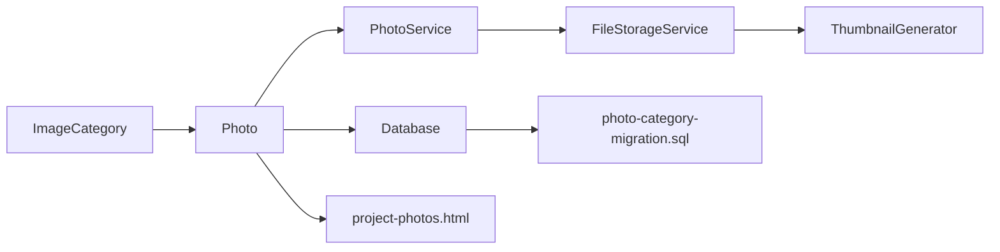

# Image Categorization

<cite>
**Referenced Files in This Document**
- [ImageCategory.java](file://src/main/java/root/cyb/mh/skylink_media_service/domain/valueobjects/ImageCategory.java)
- [Photo.java](file://src/main/java/root/cyb/mh/skylink_media_service/domain/entities/Photo.java)
- [PhotoService.java](file://src/main/java/root/cyb/mh/skylink_media_service/application/services/PhotoService.java)
- [FileStorageService.java](file://src/main/java/root/cyb/mh/skylink_media_service/infrastructure/storage/FileStorageService.java)
- [ThumbnailGenerator.java](file://src/main/java/root/cyb/mh/skylink_media_service/infrastructure/storage/ThumbnailGenerator.java)
- [photo-category-migration.sql](file://photo-category-migration.sql)
- [project-photos.html](file://src/main/resources/templates/contractor/project-photos.html)
- [Project.java](file://src/main/java/root/cyb/mh/skylink_media_service/domain/entities/Project.java)
- [Contractor.java](file://src/main/java/root/cyb/mh/skylink_media_service/domain/entities/Contractor.java)
</cite>

## Table of Contents
1. [Introduction](#introduction)
2. [Project Structure](#project-structure)
3. [Core Components](#core-components)
4. [Architecture Overview](#architecture-overview)
5. [Detailed Component Analysis](#detailed-component-analysis)
6. [Dependency Analysis](#dependency-analysis)
7. [Performance Considerations](#performance-considerations)
8. [Troubleshooting Guide](#troubleshooting-guide)
9. [Conclusion](#conclusion)

## Introduction
This document describes the image categorization system used to classify photos uploaded during project execution. It explains how the ImageCategory enum defines categories, how categories influence processing workflows, and how they integrate with storage, display, and business rules. The system supports four categories: Before, During, After, and Uncategorized. Categories are persisted in the database, validated via migrations, and rendered in contractor-facing views. Uploads are optimized and stored regardless of category, but category metadata drives display and filtering.

## Project Structure
The image categorization feature spans three layers:
- Domain value object: ImageCategory enum
- Domain entity: Photo with image_category column
- Application service: PhotoService orchestrating upload and metadata extraction
- Infrastructure: FileStorageService and ThumbnailGenerator for processing
- Persistence: Database migration enforcing category values
- Presentation: Thymeleaf templates displaying category badges

**Diagram sources**
- [ImageCategory.java:1-22](file://src/main/java/root/cyb/mh/skylink_media_service/domain/valueobjects/ImageCategory.java#L1-L22)
- [Photo.java:1-128](file://src/main/java/root/cyb/mh/skylink_media_service/domain/entities/Photo.java#L1-L128)
- [PhotoService.java:1-116](file://src/main/java/root/cyb/mh/skylink_media_service/application/services/PhotoService.java#L1-L116)
- [FileStorageService.java:1-89](file://src/main/java/root/cyb/mh/skylink_media_service/infrastructure/storage/FileStorageService.java#L1-L89)
- [ThumbnailGenerator.java:1-42](file://src/main/java/root/cyb/mh/skylink_media_service/infrastructure/storage/ThumbnailGenerator.java#L1-L42)
- [photo-category-migration.sql:1-22](file://photo-category-migration.sql#L1-L22)
- [project-photos.html:414-430](file://src/main/resources/templates/contractor/project-photos.html#L414-L430)

**Section sources**
- [ImageCategory.java:1-22](file://src/main/java/root/cyb/mh/skylink_media_service/domain/valueobjects/ImageCategory.java#L1-L22)
- [Photo.java:1-128](file://src/main/java/root/cyb/mh/skylink_media_service/domain/entities/Photo.java#L1-L128)
- [PhotoService.java:1-116](file://src/main/java/root/cyb/mh/skylink_media_service/application/services/PhotoService.java#L1-L116)
- [FileStorageService.java:1-89](file://src/main/java/root/cyb/mh/skylink_media_service/infrastructure/storage/FileStorageService.java#L1-L89)
- [ThumbnailGenerator.java:1-42](file://src/main/java/root/cyb/mh/skylink_media_service/infrastructure/storage/ThumbnailGenerator.java#L1-L42)
- [photo-category-migration.sql:1-22](file://photo-category-migration.sql#L1-L22)
- [project-photos.html:414-430](file://src/main/resources/templates/contractor/project-photos.html#L414-L430)

## Core Components
- ImageCategory enum defines the canonical set of categories and UI styling hooks for badges and dots. Each category exposes display name and Tailwind-style class strings for consistent rendering.
- Photo entity stores image_category as a persisted enum (string-backed) and links to Project and Contractor.
- PhotoService coordinates upload, metadata extraction, and category assignment. It persists optimized assets and sets category to the provided value or defaults to UNCATEGORIZED.
- FileStorageService handles original file preservation, WebP conversion, and thumbnail generation.
- ThumbnailGenerator invokes external cwebp to produce thumbnails.
- Database migration adds image_category column, enforces a check constraint, creates an index, and backfills existing rows to UNCATEGORIZED.
- Frontend template renders category badges conditionally for non-UNCATEGORIZED images.

**Section sources**
- [ImageCategory.java:1-22](file://src/main/java/root/cyb/mh/skylink_media_service/domain/valueobjects/ImageCategory.java#L1-L22)
- [Photo.java:47-49](file://src/main/java/root/cyb/mh/skylink_media_service/domain/entities/Photo.java#L47-L49)
- [PhotoService.java:46-98](file://src/main/java/root/cyb/mh/skylink_media_service/application/services/PhotoService.java#L46-L98)
- [FileStorageService.java:33-55](file://src/main/java/root/cyb/mh/skylink_media_service/infrastructure/storage/FileStorageService.java#L33-L55)
- [ThumbnailGenerator.java:17-40](file://src/main/java/root/cyb/mh/skylink_media_service/infrastructure/storage/ThumbnailGenerator.java#L17-L40)
- [photo-category-migration.sql:5-21](file://photo-category-migration.sql#L5-L21)
- [project-photos.html:414-422](file://src/main/resources/templates/contractor/project-photos.html#L414-L422)

## Architecture Overview
The upload pipeline integrates domain, application, and infrastructure concerns to deliver categorized, optimized media assets.

**Diagram sources**
- [PhotoService.java:46-98](file://src/main/java/root/cyb/mh/skylink_media_service/application/services/PhotoService.java#L46-L98)
- [FileStorageService.java:33-55](file://src/main/java/root/cyb/mh/skylink_media_service/infrastructure/storage/FileStorageService.java#L33-L55)
- [ThumbnailGenerator.java:17-40](file://src/main/java/root/cyb/mh/skylink_media_service/infrastructure/storage/ThumbnailGenerator.java#L17-L40)
- [Photo.java:70-98](file://src/main/java/root/cyb/mh/skylink_media_service/domain/entities/Photo.java#L70-L98)

## Detailed Component Analysis

### ImageCategory Enum
The enum defines four categories with associated metadata:
- BEFORE: "Before Image" with amber palette
- DURING: "During Image" with blue palette
- AFTER: "After Image" with green palette
- UNCATEGORIZED: "Uncategorized" with gray palette

Each category exposes:
- Display name for human-readable labels
- Badge classes for category badges
- Dot classes for visual indicators

These values are used by the frontend to render consistent, color-coded overlays on thumbnails.

**Section sources**
- [ImageCategory.java:3-7](file://src/main/java/root/cyb/mh/skylink_media_service/domain/valueobjects/ImageCategory.java#L3-L7)
- [ImageCategory.java:19-21](file://src/main/java/root/cyb/mh/skylink_media_service/domain/valueobjects/ImageCategory.java#L19-L21)
- [project-photos.html:416-421](file://src/main/resources/templates/contractor/project-photos.html#L416-L421)

### Photo Entity and Category Mapping
Photo persists image_category as a string-backed enum mapped to the database column image_category. The default value is UNCATEGORIZED. Photo also tracks optimization state and links to Project and Contractor.

**Diagram sources**
- [Photo.java:7-58](file://src/main/java/root/cyb/mh/skylink_media_service/domain/entities/Photo.java#L7-L58)
- [ImageCategory.java:3-7](file://src/main/java/root/cyb/mh/skylink_media_service/domain/valueobjects/ImageCategory.java#L3-L7)

**Section sources**
- [Photo.java:47-49](file://src/main/java/root/cyb/mh/skylink_media_service/domain/entities/Photo.java#L47-L49)
- [Photo.java:125-126](file://src/main/java/root/cyb/mh/skylink_media_service/domain/entities/Photo.java#L125-L126)

### PhotoService Upload Workflow
PhotoService handles upload requests:
- Validates project and contractor existence
- Stores file via FileStorageService
- Extracts metadata from image headers (best-effort)
- Sets optimized flags and status
- Assigns category from request or defaults to UNCATEGORIZED
- Persists the Photo entity

**Diagram sources**
- [PhotoService.java:46-98](file://src/main/java/root/cyb/mh/skylink_media_service/application/services/PhotoService.java#L46-L98)

**Section sources**
- [PhotoService.java:46-98](file://src/main/java/root/cyb/mh/skylink_media_service/application/services/PhotoService.java#L46-L98)

### FileStorageService and Thumbnail Generation
FileStorageService:
- Generates a unique filename with timestamp and UUID
- Ensures upload directory exists
- Saves the original file
- Converts to WebP using a system command executor
- Generates a thumbnail using ThumbnailGenerator

ThumbnailGenerator:
- Invokes cwebp with resize and quality parameters
- Returns an error if the process exits with non-zero status

**Diagram sources**
- [FileStorageService.java:33-55](file://src/main/java/root/cyb/mh/skylink_media_service/infrastructure/storage/FileStorageService.java#L33-L55)
- [ThumbnailGenerator.java:17-40](file://src/main/java/root/cyb/mh/skylink_media_service/infrastructure/storage/ThumbnailGenerator.java#L17-L40)

**Section sources**
- [FileStorageService.java:33-55](file://src/main/java/root/cyb/mh/skylink_media_service/infrastructure/storage/FileStorageService.java#L33-L55)
- [ThumbnailGenerator.java:17-40](file://src/main/java/root/cyb/mh/skylink_media_service/infrastructure/storage/ThumbnailGenerator.java#L17-L40)

### Database Constraints and Indexing
The migration script:
- Adds image_category column with default 'UNCATEGORIZED'
- Enforces a check constraint limiting values to BEFORE, DURING, AFTER, UNCATEGORIZED
- Creates an index on image_category for efficient filtering
- Updates existing rows to ensure non-null values

**Diagram sources**
- [photo-category-migration.sql:5-21](file://photo-category-migration.sql#L5-L21)

**Section sources**
- [photo-category-migration.sql:5-21](file://photo-category-migration.sql#L5-L21)

### Frontend Display of Categories
The contractor project photos page conditionally renders category badges for non-UNCATEGORIZED images using Thymeleaf switch-case rendering. Badge colors correspond to category colors defined in the enum.

**Diagram sources**
- [project-photos.html:414-422](file://src/main/resources/templates/contractor/project-photos.html#L414-L422)

**Section sources**
- [project-photos.html:414-422](file://src/main/resources/templates/contractor/project-photos.html#L414-L422)

## Dependency Analysis
The system exhibits clear separation of concerns:
- Domain: ImageCategory and Photo define the category model and persistence
- Application: PhotoService orchestrates upload and metadata extraction
- Infrastructure: FileStorageService and ThumbnailGenerator handle file processing
- Persistence: Database migration enforces category validity
- Presentation: Thymeleaf templates render category badges

**Diagram sources**
- [ImageCategory.java:1-22](file://src/main/java/root/cyb/mh/skylink_media_service/domain/valueobjects/ImageCategory.java#L1-L22)
- [Photo.java:1-128](file://src/main/java/root/cyb/mh/skylink_media_service/domain/entities/Photo.java#L1-L128)
- [PhotoService.java:1-116](file://src/main/java/root/cyb/mh/skylink_media_service/application/services/PhotoService.java#L1-L116)
- [FileStorageService.java:1-89](file://src/main/java/root/cyb/mh/skylink_media_service/infrastructure/storage/FileStorageService.java#L1-L89)
- [ThumbnailGenerator.java:1-42](file://src/main/java/root/cyb/mh/skylink_media_service/infrastructure/storage/ThumbnailGenerator.java#L1-L42)
- [photo-category-migration.sql:1-22](file://photo-category-migration.sql#L1-L22)
- [project-photos.html:414-430](file://src/main/resources/templates/contractor/project-photos.html#L414-L430)

**Section sources**
- [Photo.java:47-49](file://src/main/java/root/cyb/mh/skylink_media_service/domain/entities/Photo.java#L47-L49)
- [PhotoService.java:46-98](file://src/main/java/root/cyb/mh/skylink_media_service/application/services/PhotoService.java#L46-L98)
- [FileStorageService.java:33-55](file://src/main/java/root/cyb/mh/skylink_media_service/infrastructure/storage/FileStorageService.java#L33-L55)
- [ThumbnailGenerator.java:17-40](file://src/main/java/root/cyb/mh/skylink_media_service/infrastructure/storage/ThumbnailGenerator.java#L17-L40)
- [photo-category-migration.sql:5-21](file://photo-category-migration.sql#L5-L21)
- [project-photos.html:414-422](file://src/main/resources/templates/contractor/project-photos.html#L414-L422)

## Performance Considerations
- Thumbnail generation uses an external cwebp process; ensure the system has the tool installed and available in PATH to avoid failures.
- Metadata extraction reads image headers; large images or malformed metadata may increase processing time.
- Database queries benefit from the image_category index when filtering photos by category.
- Default category assignment avoids null handling and ensures consistent display.

[No sources needed since this section provides general guidance]

## Troubleshooting Guide
Common issues and resolutions:
- Thumbnail generation fails: Verify cwebp is installed and executable. Check process exit codes and error logs.
- Category not displayed: Confirm the photo’s image_category is not UNCATEGORIZED and that the frontend switch-case matches enum names.
- Invalid category value: The database constraint prevents invalid values; ensure clients send one of BEFORE, DURING, AFTER, or UNCATEGORIZED.
- Missing category badges: Ensure the frontend condition checks for null and non-UNCATEGORIZED values before rendering.

**Section sources**
- [ThumbnailGenerator.java:17-40](file://src/main/java/root/cyb/mh/skylink_media_service/infrastructure/storage/ThumbnailGenerator.java#L17-L40)
- [project-photos.html:414-422](file://src/main/resources/templates/contractor/project-photos.html#L414-L422)
- [photo-category-migration.sql:8-15](file://photo-category-migration.sql#L8-L15)

## Conclusion
The image categorization system cleanly separates domain semantics (ImageCategory), persistence (Photo with image_category), application orchestration (PhotoService), and infrastructure processing (FileStorageService/ThumbnailGenerator). Categories are enforced at the database level, consistently rendered in the UI, and integrated into the upload pipeline. This design supports clear business rules around category assignment, robust processing workflows, and maintainable presentation logic.