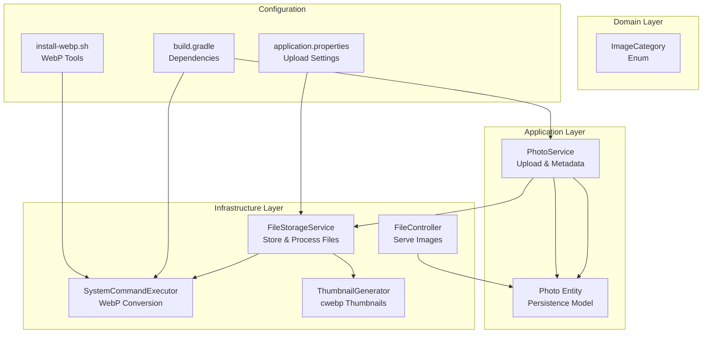
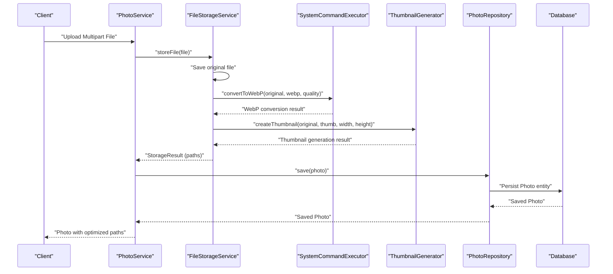
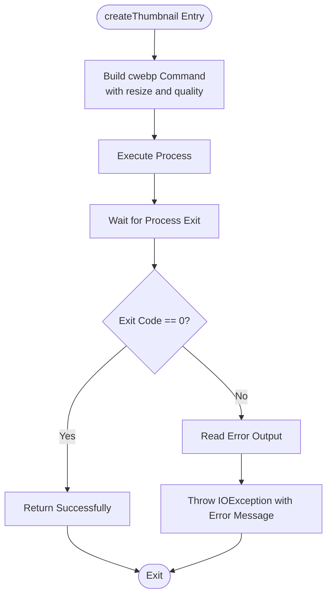
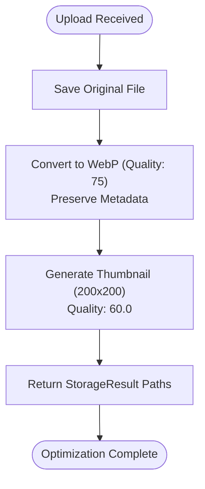
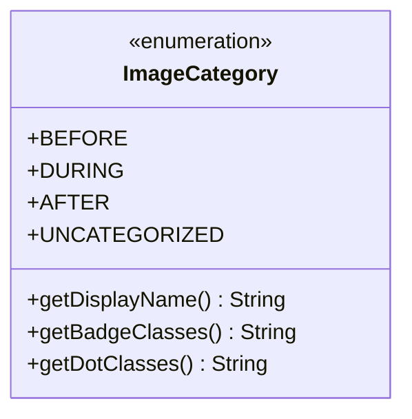
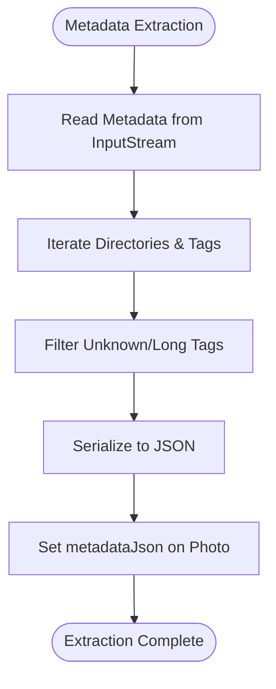
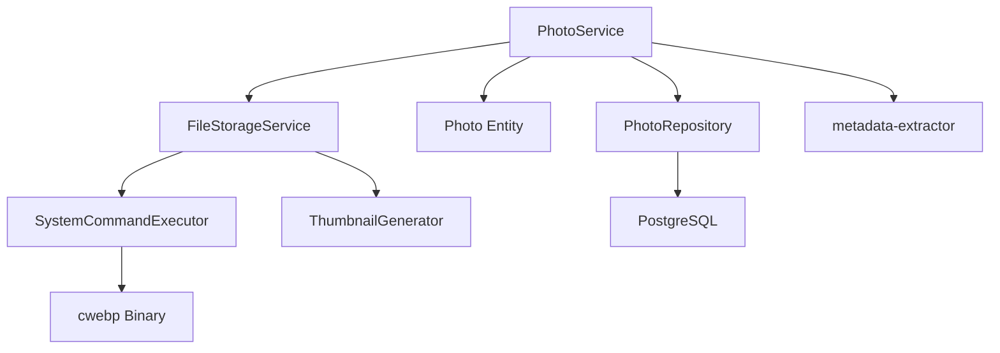

# Image Processing Pipeline

<cite>
**Referenced Files in This Document**
- [ImageCategory.java](file://skylink-media-service-backend/src/main/java/root/cyb/mh/skylink_media_service/domain/valueobjects/ImageCategory.java)
- [ThumbnailGenerator.java](file://skylink-media-service-backend/src/main/java/root/cyb/mh/skylink_media_service/infrastructure/storage/ThumbnailGenerator.java)
- [SystemCommandExecutor.java](file://skylink-media-service-backend/src/main/java/root/cyb/mh/skylink_media_service/infrastructure/storage/SystemCommandExecutor.java)
- [FileStorageService.java](file://skylink-media-service-backend/src/main/java/root/cyb/mh/skylink_media_service/infrastructure/storage/FileStorageService.java)
- [PhotoService.java](file://skylink-media-service-backend/src/main/java/root/cyb/mh/skylink_media_service/application/services/PhotoService.java)
- [Photo.java](file://skylink-media-service-backend/src/main/java/root/cyb/mh/skylink_media_service/domain/entities/Photo.java)
- [FileController.java](file://skylink-media-service-backend/src/main/java/root/cyb/mh/skylink_media_service/infrastructure/web/FileController.java)
- [application.properties](file://skylink-media-service-backend/src/main/resources/application.properties)
- [build.gradle](file://skylink-media-service-backend/build.gradle)
- [install-webp.sh](file://skylink-media-service-backend/install-webp.sh)
- [photo-metadata-migration.sql](file://skylink-media-service-backend/photo-metadata-migration.sql)
- [DatabaseMigrationRunner.java](file://skylink-media-service-backend/src/main/java/root/cyb/mh/skylink_media_service/infrastructure/persistence/DatabaseMigrationRunner.java)
</cite>

## Table of Contents
1. [Introduction](#introduction)
2. [Project Structure](#project-structure)
3. [Core Components](#core-components)
4. [Architecture Overview](#architecture-overview)
5. [Detailed Component Analysis](#detailed-component-analysis)
6. [Dependency Analysis](#dependency-analysis)
7. [Performance Considerations](#performance-considerations)
8. [Troubleshooting Guide](#troubleshooting-guide)
9. [Conclusion](#conclusion)

## Introduction
This document provides comprehensive documentation for the image processing pipeline, focusing on the ThumbnailGenerator implementation for WebP conversion and thumbnail creation, automatic optimization processes, image categorization, metadata extraction, and batch processing capabilities. The pipeline converts uploaded images to WebP format for efficient web delivery, generates thumbnails for preview, extracts EXIF metadata, and persists structured image data with categorization support.

## Project Structure
The image processing pipeline spans multiple layers:
- Domain: ImageCategory enum defines categorization options for photos
- Infrastructure: Storage services for file handling, WebP conversion, and thumbnail generation
- Application: PhotoService orchestrates upload, metadata extraction, and persistence
- Web: FileController serves processed images and thumbnails
- Configuration: Gradle dependencies and application properties define runtime behavior

**Diagram sources**
- [ImageCategory.java:1-23](file://skylink-media-service-backend/src/main/java/root/cyb/mh/skylink_media_service/domain/valueobjects/ImageCategory.java#L1-L23)
- [FileStorageService.java:1-89](file://skylink-media-service-backend/src/main/java/root/cyb/mh/skylink_media_service/infrastructure/storage/FileStorageService.java#L1-L89)
- [SystemCommandExecutor.java:1-32](file://skylink-media-service-backend/src/main/java/root/cyb/mh/skylink_media_service/infrastructure/storage/SystemCommandExecutor.java#L1-L32)
- [ThumbnailGenerator.java:1-42](file://skylink-media-service-backend/src/main/java/root/cyb/mh/skylink_media_service/infrastructure/storage/ThumbnailGenerator.java#L1-L42)
- [PhotoService.java:1-116](file://skylink-media-service-backend/src/main/java/root/cyb/mh/skylink_media_service/application/services/PhotoService.java#L1-L116)
- [Photo.java:1-128](file://skylink-media-service-backend/src/main/java/root/cyb/mh/skylink_media_service/domain/entities/Photo.java#L1-L128)
- [FileController.java:1-84](file://skylink-media-service-backend/src/main/java/root/cyb/mh/skylink_media_service/infrastructure/web/FileController.java#L1-L84)
- [application.properties:1-58](file://skylink-media-service-backend/src/main/resources/application.properties#L1-L58)
- [build.gradle:1-52](file://skylink-media-service-backend/build.gradle#L1-L52)
- [install-webp.sh:1-39](file://skylink-media-service-backend/install-webp.sh#L1-L39)

**Section sources**
- [ImageCategory.java:1-23](file://skylink-media-service-backend/src/main/java/root/cyb/mh/skylink_media_service/domain/valueobjects/ImageCategory.java#L1-L23)
- [FileStorageService.java:1-89](file://skylink-media-service-backend/src/main/java/root/cyb/mh/skylink_media_service/infrastructure/storage/FileStorageService.java#L1-L89)
- [PhotoService.java:1-116](file://skylink-media-service-backend/src/main/java/root/cyb/mh/skylink_media_service/application/services/PhotoService.java#L1-L116)
- [Photo.java:1-128](file://skylink-media-service-backend/src/main/java/root/cyb/mh/skylink_media_service/domain/entities/Photo.java#L1-L128)
- [FileController.java:1-84](file://skylink-media-service-backend/src/main/java/root/cyb/mh/skylink_media_service/infrastructure/web/FileController.java#L1-L84)
- [application.properties:1-58](file://skylink-media-service-backend/src/main/resources/application.properties#L1-L58)
- [build.gradle:1-52](file://skylink-media-service-backend/build.gradle#L1-L52)
- [install-webp.sh:1-39](file://skylink-media-service-backend/install-webp.sh#L1-L39)

## Core Components
This section documents the primary components involved in the image processing pipeline.

- ThumbnailGenerator: Executes cwebp to resize and convert images to WebP thumbnails with configurable quality and dimensions.
- SystemCommandExecutor: Converts full-resolution images to WebP while preserving metadata.
- FileStorageService: Orchestrates file saving, WebP conversion, thumbnail generation, and path management.
- PhotoService: Handles upload requests, metadata extraction, categorization, and persistence.
- Photo Entity: Stores file paths, optimization status, metadata, and category information.
- FileController: Serves uploaded files, WebP images, and thumbnails with appropriate content types.

**Section sources**
- [ThumbnailGenerator.java:1-42](file://skylink-media-service-backend/src/main/java/root/cyb/mh/skylink_media_service/infrastructure/storage/ThumbnailGenerator.java#L1-L42)
- [SystemCommandExecutor.java:1-32](file://skylink-media-service-backend/src/main/java/root/cyb/mh/skylink_media_service/infrastructure/storage/SystemCommandExecutor.java#L1-L32)
- [FileStorageService.java:1-89](file://skylink-media-service-backend/src/main/java/root/cyb/mh/skylink_media_service/infrastructure/storage/FileStorageService.java#L1-L89)
- [PhotoService.java:1-116](file://skylink-media-service-backend/src/main/java/root/cyb/mh/skylink_media_service/application/services/PhotoService.java#L1-L116)
- [Photo.java:1-128](file://skylink-media-service-backend/src/main/java/root/cyb/mh/skylink_media_service/domain/entities/Photo.java#L1-L128)
- [FileController.java:1-84](file://skylink-media-service-backend/src/main/java/root/cyb/mh/skylink_media_service/infrastructure/web/FileController.java#L1-L84)

## Architecture Overview
The image processing pipeline follows a layered architecture:
- Upload flow: PhotoService receives multipart files, delegates processing to FileStorageService, and persists metadata and categorization.
- Processing flow: FileStorageService saves originals, converts to WebP, and generates thumbnails using cwebp.
- Serving flow: FileController exposes endpoints to serve original images, WebP variants, and thumbnails.
- Persistence flow: Photo entity stores file paths, optimization status, metadata JSON, and category.

**Diagram sources**
- [PhotoService.java:46-98](file://skylink-media-service-backend/src/main/java/root/cyb/mh/skylink_media_service/application/services/PhotoService.java#L46-L98)
- [FileStorageService.java:33-55](file://skylink-media-service-backend/src/main/java/root/cyb/mh/skylink_media_service/infrastructure/storage/FileStorageService.java#L33-L55)
- [SystemCommandExecutor.java:11-30](file://skylink-media-service-backend/src/main/java/root/cyb/mh/skylink_media_service/infrastructure/storage/SystemCommandExecutor.java#L11-L30)
- [ThumbnailGenerator.java:17-40](file://skylink-media-service-backend/src/main/java/root/cyb/mh/skylink_media_service/infrastructure/storage/ThumbnailGenerator.java#L17-L40)
- [Photo.java:70-127](file://skylink-media-service-backend/src/main/java/root/cyb/mh/skylink_media_service/domain/entities/Photo.java#L70-L127)

## Detailed Component Analysis

### ThumbnailGenerator Implementation
The ThumbnailGenerator component executes cwebp to create WebP thumbnails with fixed dimensions and quality settings. It encapsulates process execution, error handling, and interruption management.

Key characteristics:
- Uses cwebp with resize parameters to target thumbnail dimensions.
- Applies a fixed quality setting for thumbnail generation.
- Redirects stderr to stdout for unified error capture.
- Throws IOException on non-zero exit codes with captured error messages.
- Handles thread interruption gracefully by restoring interrupt status.

**Diagram sources**
- [ThumbnailGenerator.java:17-40](file://skylink-media-service-backend/src/main/java/root/cyb/mh/skylink_media_service/infrastructure/storage/ThumbnailGenerator.java#L17-L40)

**Section sources**
- [ThumbnailGenerator.java:1-42](file://skylink-media-service-backend/src/main/java/root/cyb/mh/skylink_media_service/infrastructure/storage/ThumbnailGenerator.java#L1-L42)

### Automatic Optimization Process
The automatic optimization pipeline performs:
- Original file preservation: Saves the uploaded file to maintain exact EXIF data.
- WebP conversion: Converts the original to WebP with quality parameter and preserves metadata.
- Thumbnail generation: Creates a 200x200 pixel WebP thumbnail from the original.
- Path management: Returns standardized paths for original, WebP, and thumbnail files.

Quality and compression settings:
- WebP quality: Configured at 75 for the main WebP conversion.
- Thumbnail quality: Fixed at 60.0 for thumbnail generation.
- Metadata preservation: WebP conversion includes metadata preservation.

**Diagram sources**
- [FileStorageService.java:33-55](file://skylink-media-service-backend/src/main/java/root/cyb/mh/skylink_media_service/infrastructure/storage/FileStorageService.java#L33-L55)
- [SystemCommandExecutor.java:11-18](file://skylink-media-service-backend/src/main/java/root/cyb/mh/skylink_media_service/infrastructure/storage/SystemCommandExecutor.java#L11-L18)
- [ThumbnailGenerator.java:17-24](file://skylink-media-service-backend/src/main/java/root/cyb/mh/skylink_media_service/infrastructure/storage/ThumbnailGenerator.java#L17-L24)

**Section sources**
- [FileStorageService.java:1-89](file://skylink-media-service-backend/src/main/java/root/cyb/mh/skylink_media_service/infrastructure/storage/FileStorageService.java#L1-L89)
- [SystemCommandExecutor.java:1-32](file://skylink-media-service-backend/src/main/java/root/cyb/mh/skylink_media_service/infrastructure/storage/SystemCommandExecutor.java#L1-L32)
- [ThumbnailGenerator.java:1-42](file://skylink-media-service-backend/src/main/java/root/cyb/mh/skylink_media_service/infrastructure/storage/ThumbnailGenerator.java#L1-L42)

### Image Categorization with ImageCategory Enum
The ImageCategory enum defines four categories used to classify images:
- BEFORE: "Before Image" with amber styling
- DURING: "During Image" with blue styling
- AFTER: "After Image" with green styling
- UNCATEGORIZED: Default category with gray styling

These categories influence UI presentation and filtering but do not alter the processing workflow.

**Diagram sources**
- [ImageCategory.java:3-22](file://skylink-media-service-backend/src/main/java/root/cyb/mh/skylink_media_service/domain/valueobjects/ImageCategory.java#L3-L22)

**Section sources**
- [ImageCategory.java:1-23](file://skylink-media-service-backend/src/main/java/root/cyb/mh/skylink_media_service/domain/valueobjects/ImageCategory.java#L1-L23)
- [PhotoService.java:92](file://skylink-media-service-backend/src/main/java/root/cyb/mh/skylink_media_service/application/services/PhotoService.java#L92)
- [Photo.java:47-49](file://skylink-media-service-backend/src/main/java/root/cyb/mh/skylink_media_service/domain/entities/Photo.java#L47-L49)

### Metadata Extraction with ImageMetadataReader
The pipeline extracts EXIF and other image metadata using the metadata-extractor library. The extracted metadata is filtered to remove unknown or excessively long tags and serialized to JSON for persistence.

Processing logic:
- Reads metadata from the uploaded file stream.
- Iterates through directories and tags, filtering invalid entries.
- Serializes filtered metadata to JSON for storage.
- Handles extraction failures gracefully with warnings.

**Diagram sources**
- [PhotoService.java:62-81](file://skylink-media-service-backend/src/main/java/root/cyb/mh/skylink_media_service/application/services/PhotoService.java#L62-L81)

**Section sources**
- [PhotoService.java:17-21](file://skylink-media-service-backend/src/main/java/root/cyb/mh/skylink_media_service/application/services/PhotoService.java#L17-L21)
- [PhotoService.java:62-81](file://skylink-media-service-backend/src/main/java/root/cyb/mh/skylink_media_service/application/services/PhotoService.java#L62-L81)
- [Photo.java:44](file://skylink-media-service-backend/src/main/java/root/cyb/mh/skylink_media_service/domain/entities/Photo.java#L44)

### Batch Processing and Concurrent Operation Handling
The current implementation processes individual uploads synchronously. There is no explicit batch processing mechanism or concurrency control configured in the pipeline. Each upload triggers a sequential flow: save original, convert to WebP, generate thumbnail, persist metadata, and return results.

Implications:
- Single-threaded processing per request.
- No built-in queue or worker pool for background processing.
- Concurrency is managed by Spring Boot’s request handling threads.

Recommendations for future enhancements:
- Introduce a task queue (e.g., RabbitMQ, Kafka) for asynchronous processing.
- Add retry policies and circuit breakers for external cwebp calls.
- Implement rate limiting and backpressure mechanisms for high-volume scenarios.

**Section sources**
- [PhotoService.java:46-98](file://skylink-media-service-backend/src/main/java/root/cyb/mh/skylink_media_service/application/services/PhotoService.java#L46-L98)
- [FileStorageService.java:33-55](file://skylink-media-service-backend/src/main/java/root/cyb/mh/skylink_media_service/infrastructure/storage/FileStorageService.java#L33-L55)

### Serving Processed Images
The FileController provides endpoints to serve:
- Original uploaded files
- WebP conversions
- Thumbnails with pre-prefixed filenames

Content-type handling:
- WebP thumbnails served as image/webp
- Other images inferred from file extensions

Security and caching:
- Content-Disposition header for inline serving
- Cache-control headers to prevent caching

**Section sources**
- [FileController.java:21-43](file://skylink-media-service-backend/src/main/java/root/cyb/mh/skylink_media_service/infrastructure/web/FileController.java#L21-L43)
- [FileController.java:66-82](file://skylink-media-service-backend/src/main/java/root/cyb/mh/skylink_media_service/infrastructure/web/FileController.java#L66-L82)

## Dependency Analysis
External dependencies and integrations:
- cwebp: Executed via ProcessBuilder for WebP conversion and thumbnail generation.
- metadata-extractor: Library for reading EXIF and other image metadata.
- Spring Boot: Provides web, data JPA, and security infrastructure.
- PostgreSQL: Database backend for storing Photo entities.

**Diagram sources**
- [PhotoService.java:44](file://skylink-media-service-backend/src/main/java/root/cyb/mh/skylink_media_service/application/services/PhotoService.java#L44)
- [FileStorageService.java:25-31](file://skylink-media-service-backend/src/main/java/root/cyb/mh/skylink_media_service/infrastructure/storage/FileStorageService.java#L25-L31)
- [SystemCommandExecutor.java:11-18](file://skylink-media-service-backend/src/main/java/root/cyb/mh/skylink_media_service/infrastructure/storage/SystemCommandExecutor.java#L11-L18)
- [ThumbnailGenerator.java:17-24](file://skylink-media-service-backend/src/main/java/root/cyb/mh/skylink_media_service/infrastructure/storage/ThumbnailGenerator.java#L17-L24)
- [build.gradle:33](file://skylink-media-service-backend/build.gradle#L33)

**Section sources**
- [build.gradle:33](file://skylink-media-service-backend/build.gradle#L33)
- [build.gradle:21-47](file://skylink-media-service-backend/build.gradle#L21-L47)

## Performance Considerations
Current performance characteristics:
- CPU-bound operations: cwebp conversions and metadata extraction.
- Memory usage: Temporary file buffering during upload and conversion.
- I/O overhead: Disk writes for originals, WebP, and thumbnails.

Optimization techniques:
- Stream-based processing: Use streaming APIs to minimize memory footprint during conversion.
- Parallelism: Offload heavy operations to background tasks with bounded concurrency.
- Caching: Cache frequently accessed thumbnails and metadata.
- Compression tuning: Adjust WebP quality settings dynamically based on image characteristics.
- Disk optimization: Use SSD storage and separate partitions for uploads/thumbnails.

Memory management:
- Close InputStreams promptly after metadata extraction.
- Avoid loading entire images into memory unnecessarily.
- Monitor process output streams to prevent buffer overflow.

[No sources needed since this section provides general guidance]

## Troubleshooting Guide
Common issues and resolutions:
- cwebp not found: Ensure WebP tools are installed and accessible in PATH. Use the installation script for automated setup.
- Conversion failures: Check exit codes and captured error output from cwebp processes.
- Metadata extraction errors: Verify file integrity and supported formats; extraction failures are logged as warnings.
- File serving issues: Confirm upload directory configuration and file permissions.

Operational checks:
- Validate upload directory path and write permissions.
- Monitor process execution logs for cwebp errors.
- Review Photo entity persistence for missing paths or statuses.

**Section sources**
- [install-webp.sh:1-39](file://skylink-media-service-backend/install-webp.sh#L1-L39)
- [ThumbnailGenerator.java:31-39](file://skylink-media-service-backend/src/main/java/root/cyb/mh/skylink_media_service/infrastructure/storage/ThumbnailGenerator.java#L31-L39)
- [SystemCommandExecutor.java:22-29](file://skylink-media-service-backend/src/main/java/root/cyb/mh/skylink_media_service/infrastructure/storage/SystemCommandExecutor.java#L22-L29)
- [PhotoService.java:79-81](file://skylink-media-service-backend/src/main/java/root/cyb/mh/skylink_media_service/application/services/PhotoService.java#L79-L81)
- [application.properties:12-15](file://skylink-media-service-backend/src/main/resources/application.properties#L12-L15)

## Conclusion
The image processing pipeline provides a robust foundation for converting, optimizing, and serving images with WebP and thumbnails. It preserves metadata, supports categorization, and integrates with Spring Boot infrastructure. Future enhancements should focus on asynchronous processing, improved error handling, and performance tuning for large-scale deployments.