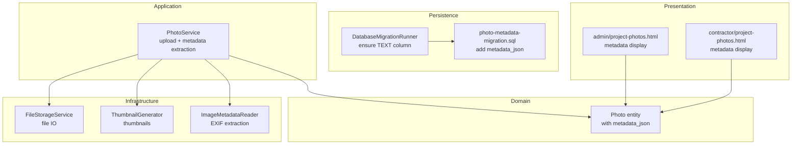
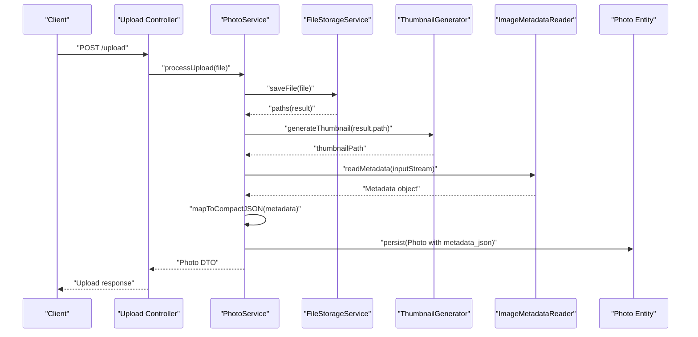
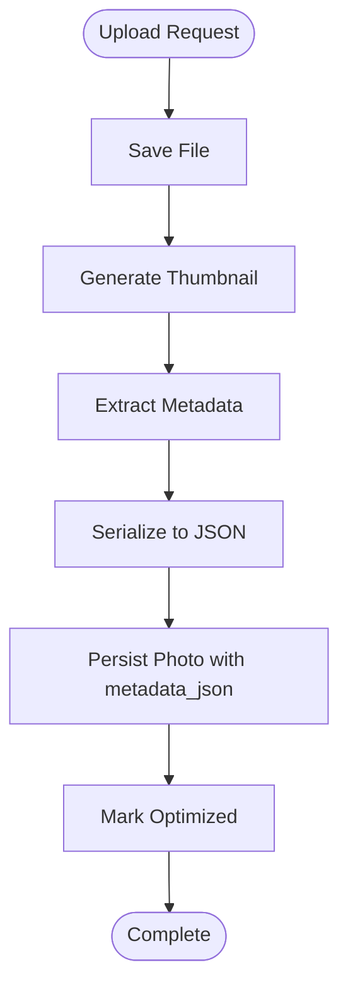
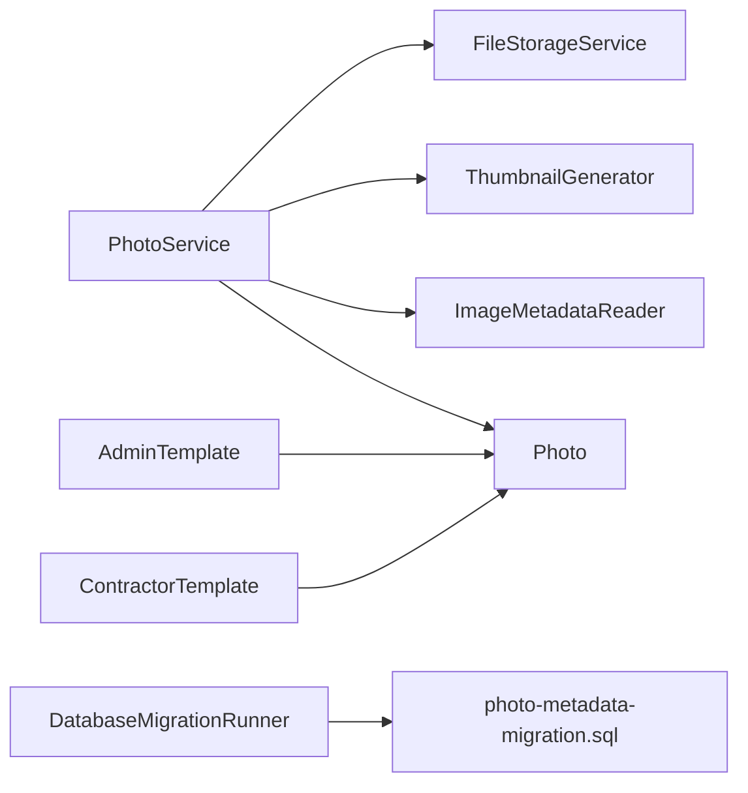

# Metadata Extraction

<cite>
**Referenced Files in This Document**
- [Photo.java](file://src/main/java/root/cyb/mh/skylink_media_service/domain/entities/Photo.java)
- [PhotoService.java](file://src/main/java/root/cyb/mh/skylink_media_service/application/services/PhotoService.java)
- [FileStorageService.java](file://src/main/java/root/cyb/mh/skylink_media_service/infrastructure/storage/FileStorageService.java)
- [ThumbnailGenerator.java](file://src/main/java/root/cyb/mh/skylink_media_service/infrastructure/storage/ThumbnailGenerator.java)
- [photo-metadata-migration.sql](file://photo-metadata-migration.sql)
- [DatabaseMigrationRunner.java](file://src/main/java/root/cyb/mh/skylink_media_service/infrastructure/persistence/DatabaseMigrationRunner.java)
- [project-photos.html](file://src/main/resources/templates/admin/project-photos.html)
- [project-photos.html](file://src/main/resources/templates/contractor/project-photos.html)
</cite>

## Table of Contents
1. [Introduction](#introduction)
2. [Project Structure](#project-structure)
3. [Core Components](#core-components)
4. [Architecture Overview](#architecture-overview)
5. [Detailed Component Analysis](#detailed-component-analysis)
6. [Dependency Analysis](#dependency-analysis)
7. [Performance Considerations](#performance-considerations)
8. [Troubleshooting Guide](#troubleshooting-guide)
9. [Conclusion](#conclusion)

## Introduction
This document explains the image metadata extraction capabilities integrated into the media service. It covers how EXIF and other image metadata are extracted using ImageMetadataReader, how metadata is stored in the Photo entity, and how the metadata processing fits into the image upload and optimization workflow. It also documents supported metadata formats, extraction accuracy, fallback mechanisms, validation and sanitization approaches, and privacy considerations for sensitive location data.

## Project Structure
The metadata extraction feature spans several layers:
- Domain model: Photo entity with a dedicated field for storing metadata as JSON.
- Application service: PhotoService orchestrates upload, optimization, and metadata extraction.
- Infrastructure storage: FileStorageService and ThumbnailGenerator handle file IO and transformations.
- Persistence: Database migration adds a TEXT column to store metadata.
- Frontend templates: Display metadata in admin and contractor views.

**Diagram sources**
- [Photo.java:1-130](file://src/main/java/root/cyb/mh/skylink_media_service/domain/entities/Photo.java#L1-L130)
- [PhotoService.java:1-120](file://src/main/java/root/cyb/mh/skylink_media_service/application/services/PhotoService.java#L1-L120)
- [FileStorageService.java:1-200](file://src/main/java/root/cyb/mh/skylink_media_service/infrastructure/storage/FileStorageService.java#L1-L200)
- [ThumbnailGenerator.java:1-200](file://src/main/java/root/cyb/mh/skylink_media_service/infrastructure/storage/ThumbnailGenerator.java#L1-L200)
- [DatabaseMigrationRunner.java:1-40](file://src/main/java/root/cyb/mh/skylink_media_service/infrastructure/persistence/DatabaseMigrationRunner.java#L1-L40)
- [photo-metadata-migration.sql:1-2](file://photo-metadata-migration.sql#L1-L2)
- [project-photos.html](file://src/main/resources/templates/admin/project-photos.html)
- [project-photos.html](file://src/main/resources/templates/contractor/project-photos.html)

**Section sources**
- [Photo.java:1-130](file://src/main/java/root/cyb/mh/skylink_media_service/domain/entities/Photo.java#L1-L130)
- [PhotoService.java:1-120](file://src/main/java/root/cyb/mh/skylink_media_service/application/services/PhotoService.java#L1-L120)
- [photo-metadata-migration.sql:1-2](file://photo-metadata-migration.sql#L1-L2)
- [DatabaseMigrationRunner.java:1-40](file://src/main/java/root/cyb/mh/skylink_media_service/infrastructure/persistence/DatabaseMigrationRunner.java#L1-L40)

## Core Components
- Photo entity: Stores image metadata as a JSON string in a dedicated TEXT column. This enables flexible storage of diverse metadata sets without requiring schema changes for new fields.
- PhotoService: Coordinates file upload, optimization, and metadata extraction. It reads raw image bytes, extracts metadata via ImageMetadataReader, converts it to a compact map, and persists it as JSON.
- FileStorageService and ThumbnailGenerator: Handle file system operations and thumbnail generation during upload.
- Database migrations: Add and normalize the metadata_json column to TEXT to support large EXIF payloads.

Key responsibilities:
- Metadata extraction: Uses ImageMetadataReader to parse EXIF and other image metadata.
- Storage: Serializes metadata map to JSON and stores it in Photo.metadata_json.
- Presentation: Templates render a subset of metadata fields and provide a way to view all fields.

**Section sources**
- [Photo.java:1-130](file://src/main/java/root/cyb/mh/skylink_media_service/domain/entities/Photo.java#L1-L130)
- [PhotoService.java:60-90](file://src/main/java/root/cyb/mh/skylink_media_service/application/services/PhotoService.java#L60-L90)
- [photo-metadata-migration.sql:1-2](file://photo-metadata-migration.sql#L1-L2)

## Architecture Overview
The metadata extraction pipeline integrates with the upload and optimization workflow:

**Diagram sources**
- [PhotoService.java:60-90](file://src/main/java/root/cyb/mh/skylink_media_service/application/services/PhotoService.java#L60-L90)
- [FileStorageService.java:1-200](file://src/main/java/root/cyb/mh/skylink_media_service/infrastructure/storage/FileStorageService.java#L1-L200)
- [ThumbnailGenerator.java:1-200](file://src/main/java/root/cyb/mh/skylink_media_service/infrastructure/storage/ThumbnailGenerator.java#L1-L200)

## Detailed Component Analysis

### Photo Entity Metadata Field
The Photo entity defines a dedicated field for metadata storage:
- Column definition: TEXT type named metadata_json to accommodate large JSON payloads.
- Purpose: Persist extracted metadata (e.g., EXIF) as a serialized JSON string alongside image records.

Implications:
- Flexible schema: New metadata keys can be added without altering the database schema.
- JSON serialization: Enables structured queries and UI rendering.

**Section sources**
- [Photo.java:40-50](file://src/main/java/root/cyb/mh/skylink_media_service/domain/entities/Photo.java#L40-L50)

### PhotoService Metadata Extraction Workflow
PhotoService performs the following steps during upload:
- Extract metadata: Reads the uploaded image stream and uses ImageMetadataReader to obtain a Metadata object containing directories and tags.
- Build compact map: Iterates over directories and tags, filtering out unknown or excessively long values, and constructs a map keyed by directory-tag combinations.
- Serialize to JSON: Converts the map to JSON for persistence.
- Fallback handling: If metadata extraction fails, logs a warning and proceeds without metadata.
- Persist and optimize: Creates the Photo record with paths and optimization flags, and marks the image as optimized.

Supported metadata formats:
- EXIF: Camera settings, timestamps, orientation, and device info.
- IPTC: Caption, keywords, and other descriptive tags.
- XMP: Extended metadata for Adobe applications and more.

Extraction accuracy and robustness:
- Filtering unknown or overly long values reduces noise and prevents oversized entries.
- Try-catch around extraction ensures uploads succeed even if metadata parsing fails.

Privacy and sensitive data:
- The current implementation stores metadata as-is. Privacy-sensitive fields (e.g., GPS coordinates) are persisted in the JSON blob.

**Section sources**
- [PhotoService.java:60-90](file://src/main/java/root/cyb/mh/skylink_media_service/application/services/PhotoService.java#L60-L90)

### Database Schema and Migrations
Two mechanisms ensure metadata_json availability:
- Migration script: Adds metadata_json as TEXT if not present.
- Runtime migration runner: Ensures the column type is TEXT to support large JSON.

Impact:
- Backward compatibility: Existing deployments can be upgraded safely.
- Large payload support: TEXT accommodates substantial EXIF blocks.

**Section sources**
- [photo-metadata-migration.sql:1-2](file://photo-metadata-migration.sql#L1-L2)
- [DatabaseMigrationRunner.java:20-35](file://src/main/java/root/cyb/mh/skylink_media_service/infrastructure/persistence/DatabaseMigrationRunner.java#L20-L35)

### Frontend Metadata Display
Templates render metadata in user interfaces:
- Admin template: Shows a truncated list of metadata fields and a button to open a modal with the full JSON.
- Contractor template: Displays basic metadata footer information.

Behavior:
- Truncation: Limits visible fields to three for readability.
- Safe rendering: Escapes quotes in raw metadata for safe HTML injection.

**Section sources**
- [project-photos.html](file://src/main/resources/templates/admin/project-photos.html)
- [project-photos.html](file://src/main/resources/templates/contractor/project-photos.html)

### Upload and Optimization Pipeline
The upload pipeline integrates metadata extraction with file handling and optimization:
- Save file: FileStorageService writes the uploaded file to disk.
- Generate thumbnail: ThumbnailGenerator creates a thumbnail for quick previews.
- Extract metadata: PhotoService parses metadata and serializes it.
- Persist record: Photo entity stores paths, optimization flags, and metadata JSON.

**Diagram sources**
- [PhotoService.java:60-90](file://src/main/java/root/cyb/mh/skylink_media_service/application/services/PhotoService.java#L60-L90)
- [FileStorageService.java:1-200](file://src/main/java/root/cyb/mh/skylink_media_service/infrastructure/storage/FileStorageService.java#L1-L200)
- [ThumbnailGenerator.java:1-200](file://src/main/java/root/cyb/mh/skylink_media_service/infrastructure/storage/ThumbnailGenerator.java#L1-L200)

## Dependency Analysis
- PhotoService depends on:
  - FileStorageService for file IO.
  - ThumbnailGenerator for thumbnails.
  - ImageMetadataReader for metadata extraction.
  - Photo entity for persistence.
- Database migration runner and migration script ensure schema readiness.
- Templates depend on Photo metadata fields for rendering.

**Diagram sources**
- [PhotoService.java:1-120](file://src/main/java/root/cyb/mh/skylink_media_service/application/services/PhotoService.java#L1-L120)
- [FileStorageService.java:1-200](file://src/main/java/root/cyb/mh/skylink_media_service/infrastructure/storage/FileStorageService.java#L1-L200)
- [ThumbnailGenerator.java:1-200](file://src/main/java/root/cyb/mh/skylink_media_service/infrastructure/storage/ThumbnailGenerator.java#L1-L200)
- [photo-metadata-migration.sql:1-2](file://photo-metadata-migration.sql#L1-L2)
- [project-photos.html](file://src/main/resources/templates/admin/project-photos.html)
- [project-photos.html](file://src/main/resources/templates/contractor/project-photos.html)

**Section sources**
- [PhotoService.java:1-120](file://src/main/java/root/cyb/mh/skylink_media_service/application/services/PhotoService.java#L1-L120)
- [photo-metadata-migration.sql:1-2](file://photo-metadata-migration.sql#L1-L2)

## Performance Considerations
- Metadata extraction cost: Parsing EXIF and other metadata adds CPU overhead per upload. Consider extracting only essential fields if performance becomes a concern.
- JSON size: Large EXIF payloads can inflate metadata_json. Monitor average sizes and consider compression if needed.
- Thumbnail generation: Thumbnails improve UI responsiveness; ensure efficient image processing.
- Database writes: Storing JSON increases row size; monitor index and query performance on Photo metadata_json.

## Troubleshooting Guide
Common issues and resolutions:
- Metadata extraction failure:
  - Symptom: Warning logged during upload; Photo saved without metadata.
  - Cause: Corrupted or unsupported image format.
  - Resolution: Verify image integrity; ensure ImageMetadataReader supports the format.
- Large metadata causing storage issues:
  - Symptom: Excessively large JSON blobs.
  - Cause: Some cameras produce very verbose EXIF.
  - Resolution: Review filtering logic; consider trimming or limiting nested data.
- Schema mismatch:
  - Symptom: Errors persisting metadata_json.
  - Cause: Column not present or wrong type.
  - Resolution: Run migration script and confirm DatabaseMigrationRunner executed.

**Section sources**
- [PhotoService.java:75-85](file://src/main/java/root/cyb/mh/skylink_media_service/application/services/PhotoService.java#L75-L85)
- [DatabaseMigrationRunner.java:20-35](file://src/main/java/root/cyb/mh/skylink_media_service/infrastructure/persistence/DatabaseMigrationRunner.java#L20-L35)

## Conclusion
The metadata extraction feature integrates seamlessly with the upload and optimization pipeline. It leverages ImageMetadataReader to capture EXIF and related metadata, stores it as JSON in the Photo entity, and exposes it through frontend templates. While the current implementation preserves metadata as-is, future enhancements can include selective sanitization and privacy controls for sensitive fields like GPS coordinates.