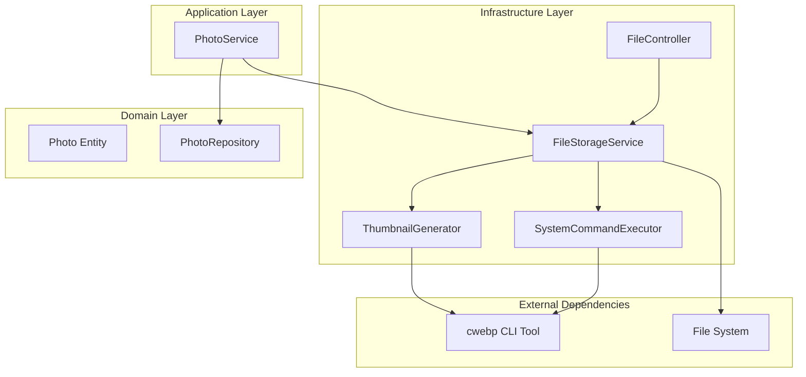
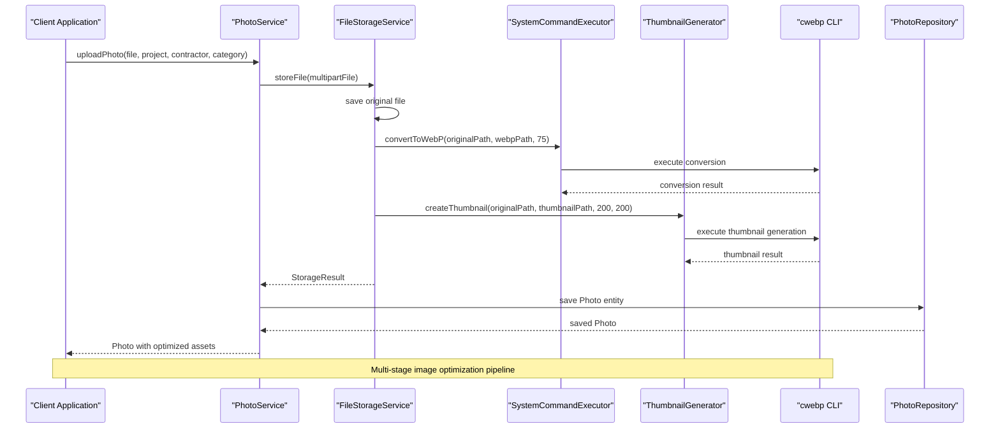
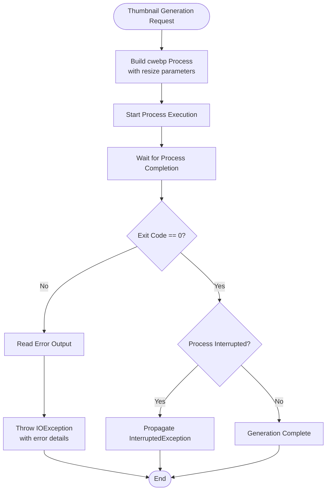
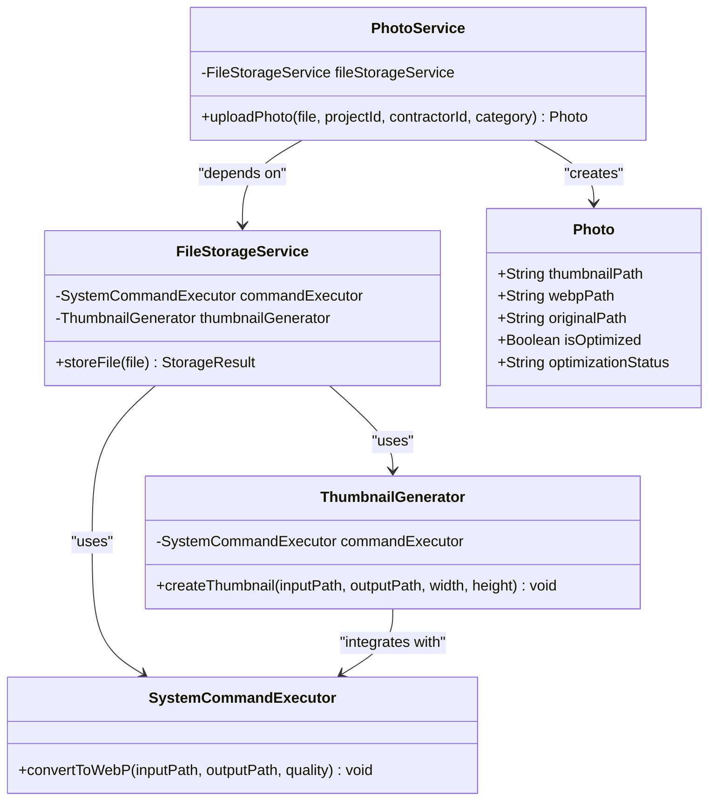

# Thumbnail Generation

<cite>
**Referenced Files in This Document**
- [ThumbnailGenerator.java](file://skylink-media-service-backend/src/main/java/root/cyb/mh/skylink_media_service/infrastructure/storage/ThumbnailGenerator.java)
- [SystemCommandExecutor.java](file://skylink-media-service-backend/src/main/java/root/cyb/mh/skylink_media_service/infrastructure/storage/SystemCommandExecutor.java)
- [FileStorageService.java](file://skylink-media-service-backend/src/main/java/root/cyb/mh/skylink_media_service/infrastructure/storage/FileStorageService.java)
- [PhotoService.java](file://skylink-media-service-backend/src/main/java/root/cyb/mh/skylink_media_service/application/services/PhotoService.java)
- [FileController.java](file://skylink-media-service-backend/src/main/java/root/cyb/mh/skylink_media_service/infrastructure/web/FileController.java)
- [Photo.java](file://skylink-media-service-backend/src/main/java/root/cyb/mh/skylink_media_service/domain/entities/Photo.java)
- [PhotoRepository.java](file://skylink-media-service-backend/src/main/java/root/cyb/mh/skylink_media_service/infrastructure/persistence/PhotoRepository.java)
- [application.properties](file://skylink-media-service-backend/src/main/resources/application.properties)
- [install-webp.sh](file://skylink-media-service-backend/install-webp.sh)
</cite>

## Table of Contents
1. [Introduction](#introduction)
2. [Project Structure](#project-structure)
3. [Core Components](#core-components)
4. [Architecture Overview](#architecture-overview)
5. [Detailed Component Analysis](#detailed-component-analysis)
6. [Dependency Analysis](#dependency-analysis)
7. [Performance Considerations](#performance-considerations)
8. [Troubleshooting Guide](#troubleshooting-guide)
9. [Conclusion](#conclusion)

## Introduction
This document provides comprehensive technical documentation for the thumbnail generation component within the media processing pipeline. The system converts uploaded images to WebP format using the cwebp command-line tool and generates thumbnails with specific resize parameters and quality settings. The implementation integrates tightly with the broader photo upload workflow, ensuring efficient storage and delivery of optimized image assets.

The thumbnail generation process follows a multi-stage pipeline: file upload, WebP conversion, thumbnail creation, metadata extraction, and persistent storage. Each stage is designed for reliability, performance, and maintainability while leveraging external system tools for optimal image compression.

## Project Structure
The thumbnail generation functionality is organized within the infrastructure layer, specifically under the storage package. The component architecture follows Spring Framework conventions with clear separation of concerns between storage operations, command execution, and service orchestration.

**Diagram sources**
- [FileStorageService.java:17-31](file://skylink-media-service-backend/src/main/java/root/cyb/mh/skylink_media_service/infrastructure/storage/FileStorageService.java#L17-L31)
- [ThumbnailGenerator.java:8-15](file://skylink-media-service-backend/src/main/java/root/cyb/mh/skylink_media_service/infrastructure/storage/ThumbnailGenerator.java#L8-L15)
- [SystemCommandExecutor.java:8-9](file://skylink-media-service-backend/src/main/java/root/cyb/mh/skylink_media_service/infrastructure/storage/SystemCommandExecutor.java#L8-L9)

**Section sources**
- [FileStorageService.java:17-31](file://skylink-media-service-backend/src/main/java/root/cyb/mh/skylink_media_service/infrastructure/storage/FileStorageService.java#L17-L31)
- [PhotoService.java:29-44](file://skylink-media-service-backend/src/main/java/root/cyb/mh/skylink_media_service/application/services/PhotoService.java#L29-L44)

## Core Components
The thumbnail generation system consists of three primary components working in concert:

### ThumbnailGenerator
The core component responsible for creating WebP thumbnails using the cwebp command-line tool. It implements precise resize parameters and quality settings for optimal image delivery.

### SystemCommandExecutor
A utility component that handles general WebP conversion operations with configurable quality settings and metadata preservation.

### FileStorageService
The orchestrator that coordinates the complete image processing pipeline, including thumbnail generation as part of the multi-stage optimization workflow.

**Section sources**
- [ThumbnailGenerator.java:8-41](file://skylink-media-service-backend/src/main/java/root/cyb/mh/skylink_media_service/infrastructure/storage/ThumbnailGenerator.java#L8-L41)
- [SystemCommandExecutor.java:8-31](file://skylink-media-service-backend/src/main/java/root/cyb/mh/skylink_media_service/infrastructure/storage/SystemCommandExecutor.java#L8-L31)
- [FileStorageService.java:17-55](file://skylink-media-service-backend/src/main/java/root/cyb/mh/skylink_media_service/infrastructure/storage/FileStorageService.java#L17-L55)

## Architecture Overview
The thumbnail generation architecture follows a layered approach with clear boundaries between storage operations, command execution, and service orchestration. The system leverages external cwebp tools for high-quality image compression while maintaining internal Java-based orchestration for reliability and error handling.

**Diagram sources**
- [PhotoService.java:46-98](file://skylink-media-service-backend/src/main/java/root/cyb/mh/skylink_media_service/application/services/PhotoService.java#L46-L98)
- [FileStorageService.java:33-55](file://skylink-media-service-backend/src/main/java/root/cyb/mh/skylink_media_service/infrastructure/storage/FileStorageService.java#L33-L55)
- [ThumbnailGenerator.java:17-40](file://skylink-media-service-backend/src/main/java/root/cyb/mh/skylink_media_service/infrastructure/storage/ThumbnailGenerator.java#L17-L40)

## Detailed Component Analysis

### ThumbnailGenerator Implementation
The ThumbnailGenerator component implements a focused approach to thumbnail creation using the cwebp command-line tool. The implementation prioritizes reliability through explicit error handling and process management.

#### Core Processing Logic
The component constructs a ProcessBuilder with specific cwebp parameters:
- Resize operation with fixed dimensions (200x200 pixels)
- Quality setting of 60.0 for balanced compression
- Input and output path specification
- Stream redirection for unified error handling

#### Error Handling Mechanisms
The implementation includes comprehensive error handling for various failure scenarios:
- Non-zero exit code detection with detailed error reporting
- Interrupted process detection with proper thread interruption propagation
- Unified IOException throwing for external tool failures
- Error stream reading for diagnostic information

**Diagram sources**
- [ThumbnailGenerator.java:17-40](file://skylink-media-service-backend/src/main/java/root/cyb/mh/skylink_media_service/infrastructure/storage/ThumbnailGenerator.java#L17-L40)

**Section sources**
- [ThumbnailGenerator.java:17-40](file://skylink-media-service-backend/src/main/java/root/cyb/mh/skylink_media_service/infrastructure/storage/ThumbnailGenerator.java#L17-L40)

### SystemCommandExecutor Integration
The SystemCommandExecutor provides a reusable foundation for WebP operations throughout the system. It maintains consistent error handling patterns and supports flexible quality configurations.

#### Command Construction Pattern
The executor builds standardized cwebp commands with:
- Quality parameter configuration (default 75 for main conversion)
- Metadata preservation for WebP files
- Input/output path specification
- Process lifecycle management

#### Process Management
The component ensures robust process execution through:
- Explicit process startup and termination
- Exit code validation with meaningful error messages
- Interrupt handling for graceful cancellation
- Consistent exception propagation

**Section sources**
- [SystemCommandExecutor.java:11-30](file://skylink-media-service-backend/src/main/java/root/cyb/mh/skylink_media_service/infrastructure/storage/SystemCommandExecutor.java#L11-L30)

### FileStorageService Orchestration
The FileStorageService coordinates the complete image processing pipeline, integrating thumbnail generation as a critical optimization step.

#### Multi-Stage Processing Workflow
The storage service implements a comprehensive workflow:
1. Original file preservation for metadata integrity
2. WebP conversion with quality 75 for UI rendering
3. Thumbnail generation with 200x200 pixel dimensions
4. Result packaging for downstream services

#### File Naming and Organization
The service implements systematic file naming:
- Timestamp-based original filenames for uniqueness
- WebP files with .webp extension
- Thumbnail files prefixed with "thumb_" for easy identification
- UUID-based filename segments for collision avoidance

**Section sources**
- [FileStorageService.java:33-55](file://skylink-media-service-backend/src/main/java/root/cyb/mh/skylink_media_service/infrastructure/storage/FileStorageService.java#L33-L55)

### PhotoService Integration
The PhotoService serves as the primary entry point for thumbnail generation within the application workflow, coordinating with multiple repositories and services.

#### Upload Pipeline Coordination
The service orchestrates the complete upload process:
- Project and contractor validation
- File content type verification
- Storage service invocation
- Photo entity creation with optimization metadata
- Repository persistence with optimization tracking

#### Metadata Integration
The service captures comprehensive image metadata:
- EXIF data extraction using ImageMetadataReader
- Structured JSON serialization for database storage
- Filtering of unreadable or excessive metadata
- Graceful fallback for extraction failures

**Section sources**
- [PhotoService.java:46-98](file://skylink-media-service-backend/src/main/java/root/cyb/mh/skylink_media_service/application/services/PhotoService.java#L46-L98)

### FileController Delivery
The FileController provides seamless access to generated thumbnails and processed images through dedicated endpoints.

#### Thumbnail Endpoint Design
The controller implements specialized endpoints:
- `/thumbnails/{filename}` for thumbnail delivery
- Content-type header management for WebP thumbnails
- Direct file serving with proper caching headers
- Error handling for missing or inaccessible files

#### File Serving Architecture
The controller supports multiple file serving scenarios:
- Main uploaded files with automatic content-type detection
- Avatar files with separate directory structure
- Thumbnail optimization for fast loading
- Proper HTTP headers for caching and security

**Section sources**
- [FileController.java:66-82](file://skylink-media-service-backend/src/main/java/root/cyb/mh/skylink_media_service/infrastructure/web/FileController.java#L66-L82)

## Dependency Analysis
The thumbnail generation system exhibits well-defined dependencies with clear separation of concerns and minimal coupling between components.

**Diagram sources**
- [ThumbnailGenerator.java:8-15](file://skylink-media-service-backend/src/main/java/root/cyb/mh/skylink_media_service/infrastructure/storage/ThumbnailGenerator.java#L8-L15)
- [SystemCommandExecutor.java:8-9](file://skylink-media-service-backend/src/main/java/root/cyb/mh/skylink_media_service/infrastructure/storage/SystemCommandExecutor.java#L8-L9)
- [FileStorageService.java:25-31](file://skylink-media-service-backend/src/main/java/root/cyb/mh/skylink_media_service/infrastructure/storage/FileStorageService.java#L25-L31)
- [PhotoService.java:44](file://skylink-media-service-backend/src/main/java/root/cyb/mh/skylink_media_service/application/services/PhotoService.java#L44)

### External Dependencies
The system relies on external cwebp tools for image processing capabilities. The dependency management ensures compatibility across different operating systems through platform-specific installation procedures.

**Section sources**
- [install-webp.sh:1-40](file://skylink-media-service-backend/install-webp.sh#L1-L40)
- [application.properties:15](file://skylink-media-service-backend/src/main/resources/application.properties#L15)

## Performance Considerations

### Thumbnail Dimensions and File Size Optimization
The current implementation uses fixed 200x200 pixel dimensions for thumbnails, providing optimal balance between visual fidelity and file size. This dimension choice offers several advantages:

- **Display Optimization**: 200x200 pixels provide excellent thumbnail quality for grid layouts and preview displays
- **Memory Efficiency**: Reduced resolution minimizes memory footprint during rendering
- **Bandwidth Savings**: Smaller file sizes reduce network transfer overhead
- **Storage Optimization**: Efficient disk space utilization for large photo collections

### Quality Settings and Compression Ratios
The system employs different quality settings across processing stages:
- **Main WebP Conversion**: Quality 75 for optimal UI rendering balance
- **Thumbnail Generation**: Quality 60.0 for reduced file size while maintaining visual quality
- **Metadata Preservation**: All metadata included in WebP files for comprehensive asset information

### Processing Pipeline Efficiency
The multi-stage processing pipeline optimizes resource utilization:
- **Parallel Processing**: Thumbnail generation occurs after WebP conversion completion
- **Memory Management**: Proper resource cleanup and process termination
- **Error Recovery**: Graceful handling of individual stage failures
- **Caching Strategy**: Direct file serving reduces server load

### Scalability Considerations
The architecture supports horizontal scaling through:
- **Stateless Operations**: Thumbnail generation is independent of application state
- **External Tool Reliance**: cwebp tools handle intensive processing tasks
- **Database Optimization**: Efficient photo entity storage with indexing support
- **Content Delivery**: Direct file serving reduces application server load

## Troubleshooting Guide

### Common Issues and Solutions

#### cwebp Installation Problems
**Issue**: Thumbnail generation fails with "command not found" errors
**Solution**: Verify cwebp installation using the provided installation script
- Run `./install-webp.sh` to automatically detect and install dependencies
- Manual installation requires platform-specific package managers
- Verify installation with `cwebp -version`

#### Process Execution Failures
**Issue**: Thumbnails not generated despite successful uploads
**Solution**: Check process execution logs and error streams
- Review application logs for detailed error messages
- Verify file permissions for input and output directories
- Ensure sufficient disk space for temporary processing files

#### Memory and Resource Constraints
**Issue**: OutOfMemoryError during thumbnail generation
**Solution**: Monitor system resources and adjust processing parameters
- Verify adequate RAM allocation for image processing
- Check concurrent upload limits and queue management
- Monitor disk space availability for temporary files

#### File Access Permissions
**Issue**: Permission denied errors for thumbnail files
**Solution**: Configure proper file system permissions
- Ensure write permissions for upload directories
- Verify executable permissions for cwebp binary
- Check SELinux or AppArmor restrictions on Linux systems

### Diagnostic Procedures
1. **Verify cwebp Installation**: Confirm cwebp binary availability and version
2. **Check File Paths**: Validate input and output file paths exist and are accessible
3. **Monitor Process Logs**: Review detailed error output from cwebp execution
4. **Test Individual Commands**: Manually execute cwebp commands to isolate issues
5. **Review System Resources**: Monitor CPU, memory, and disk usage during processing

**Section sources**
- [install-webp.sh:5-37](file://skylink-media-service-backend/install-webp.sh#L5-L37)
- [ThumbnailGenerator.java:32-39](file://skylink-media-service-backend/src/main/java/root/cyb/mh/skylink_media_service/infrastructure/storage/ThumbnailGenerator.java#L32-L39)

## Conclusion
The thumbnail generation component demonstrates robust implementation of external tool integration within a Spring-based architecture. The system successfully balances image quality optimization with performance efficiency through strategic use of cwebp tools and careful process management.

Key strengths of the implementation include:
- **Reliable Error Handling**: Comprehensive error detection and reporting mechanisms
- **Flexible Configuration**: Adjustable quality settings and processing parameters
- **Scalable Architecture**: Stateless operations supporting horizontal scaling
- **Performance Optimization**: Strategic use of external tools for intensive processing tasks
- **Integration Excellence**: Seamless coordination between storage, processing, and delivery layers

The component provides a solid foundation for high-performance image processing while maintaining code clarity and maintainability. Future enhancements could include configurable thumbnail dimensions, batch processing capabilities, and advanced optimization algorithms for specific use cases.