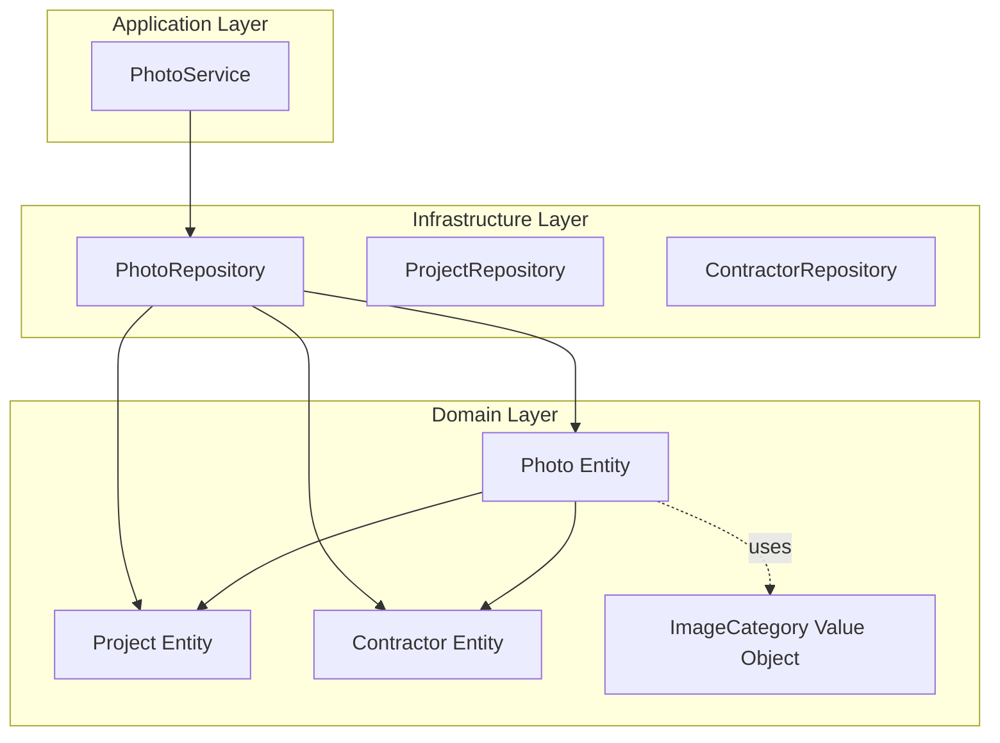
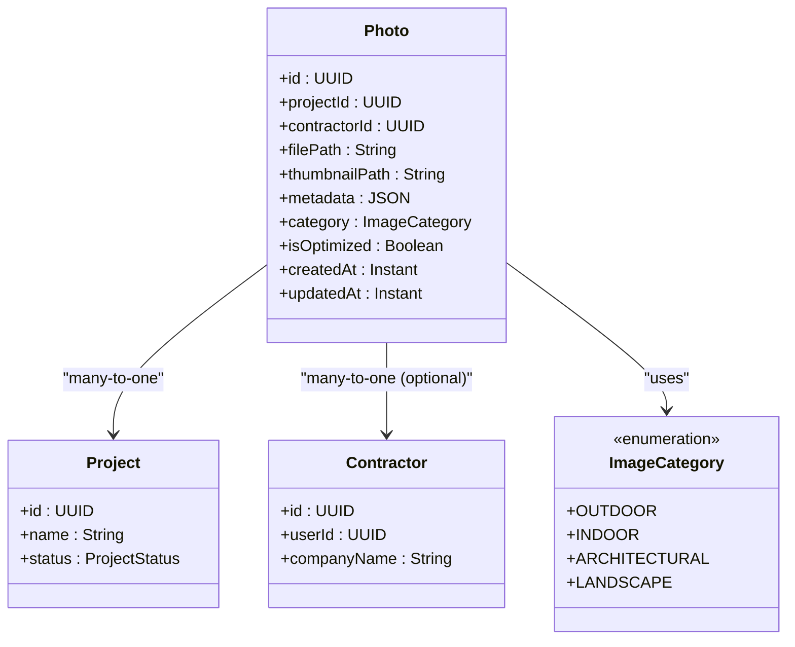
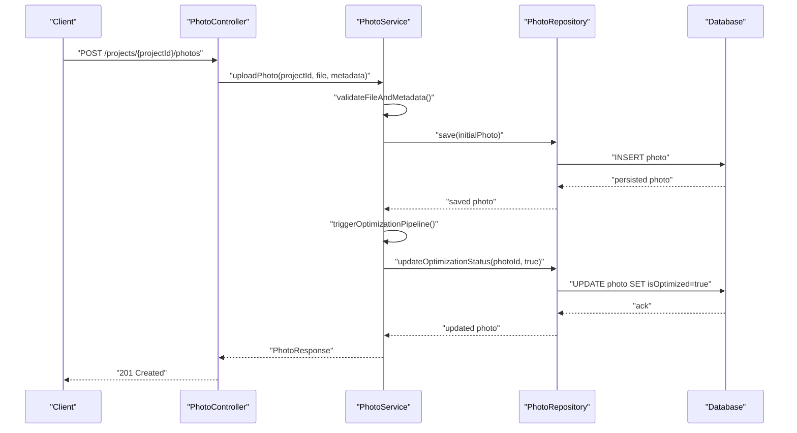
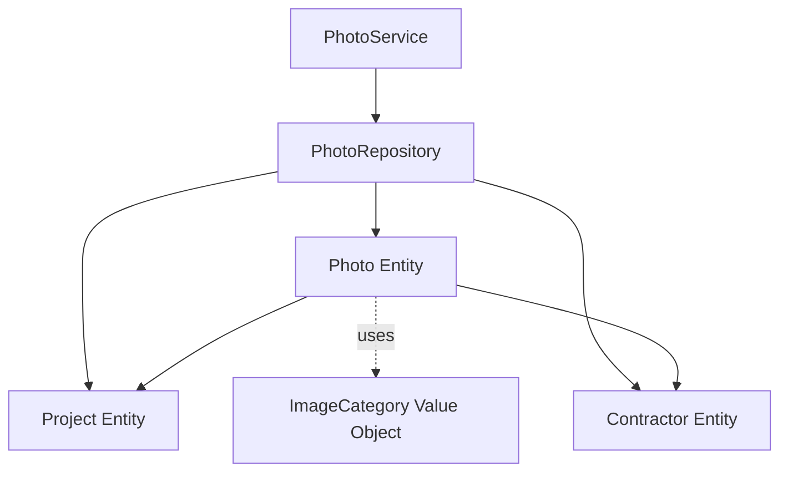

# Photo Data Model

<cite>
**Referenced Files in This Document**
- [Photo.java](file://src/main/java/root/cyb/mh/skylink_media_service/domain/entities/Photo.java)
- [ImageCategory.java](file://src/main/java/root/cyb/mh/skylink_media_service/domain/valueobjects/ImageCategory.java)
- [PhotoRepository.java](file://src/main/java/root/cyb/mh/skylink_media_service/infrastructure/persistence/PhotoRepository.java)
- [PhotoService.java](file://src/main/java/root/cyb/mh/skylink_media_service/application/services/PhotoService.java)
- [Project.java](file://src/main/java/root/cyb/mh/skylink_media_service/domain/entities/Project.java)
- [Contractor.java](file://src/main/java/root/cyb/mh/skylink_media_service/domain/entities/Contractor.java)
- [database-schema.sql](file://database-schema.sql)
- [photo-category-migration.sql](file://photo-category-migration.sql)
- [photo-metadata-migration.sql](file://photo-metadata-migration.sql)
- [photo-optimization-migration.sql](file://photo-optimization-migration.sql)
- [advanced-search-indexes.sql](file://advanced-search-indexes.sql)
- [PhotoController.java](file://src/main/java/root/cyb/mh/skylink_media_service/domain/entities/PhotoController.java)
</cite>

## Table of Contents
1. [Introduction](#introduction)
2. [Project Structure](#project-structure)
3. [Core Components](#core-components)
4. [Architecture Overview](#architecture-overview)
5. [Detailed Component Analysis](#detailed-component-analysis)
6. [Dependency Analysis](#dependency-analysis)
7. [Performance Considerations](#performance-considerations)
8. [Troubleshooting Guide](#troubleshooting-guide)
9. [Conclusion](#conclusion)
10. [Appendices](#appendices)

## Introduction
This document provides comprehensive data model documentation for the Photo entity and related structures within the media service backend. It covers entity fields, metadata storage, optimization status, relationships with Project and Contractor entities, ImageCategory enumeration values and their impact on processing workflows, database schema design, indexing strategies, foreign key relationships, lifecycle management, cascading operations, validation rules, metadata JSON storage format, query optimization techniques, and data migration strategies with schema evolution considerations.

## Project Structure
The Photo data model is implemented across domain entities, value objects, repositories, services, and supporting SQL scripts. The domain layer defines the Photo entity and its relationships, while the value object ImageCategory encapsulates category semantics. Persistence is handled via Spring Data JPA repositories, and application services orchestrate business operations. Database schema and migrations are maintained in SQL scripts.

**Diagram sources**
- [Photo.java](file://src/main/java/root/cyb/mh/skylink_media_service/domain/entities/Photo.java)
- [Project.java](file://src/main/java/root/cyb/mh/skylink_media_service/domain/entities/Project.java)
- [Contractor.java](file://src/main/java/root/cyb/mh/skylink_media_service/domain/entities/Contractor.java)
- [ImageCategory.java](file://src/main/java/root/cyb/mh/skylink_media_service/domain/valueobjects/ImageCategory.java)
- [PhotoRepository.java](file://src/main/java/root/cyb/mh/skylink_media_service/infrastructure/persistence/PhotoRepository.java)
- [PhotoService.java](file://src/main/java/root/cyb/mh/skylink_media_service/application/services/PhotoService.java)

**Section sources**
- [Photo.java](file://src/main/java/root/cyb/mh/skylink_media_service/domain/entities/Photo.java)
- [ImageCategory.java](file://src/main/java/root/cyb/mh/skylink_media_service/domain/valueobjects/ImageCategory.java)
- [PhotoRepository.java](file://src/main/java/root/cyb/mh/skylink_media_service/infrastructure/persistence/PhotoRepository.java)
- [PhotoService.java](file://src/main/java/root/cyb/mh/skylink_media_service/application/services/PhotoService.java)
- [Project.java](file://src/main/java/root/cyb/mh/skylink_media_service/domain/entities/Project.java)
- [Contractor.java](file://src/main/java/root/cyb/mh/skylink_media_service/domain/entities/Contractor.java)

## Core Components
This section documents the Photo entity and its associated structures, focusing on fields, relationships, and value object semantics.

- Photo Entity
  - Purpose: Represents uploaded images linked to a Project and optionally a Contractor.
  - Key Fields: Identifier, file paths, metadata JSON, optimization status, category, timestamps, and foreign keys to Project and optional Contractor.
  - Relationships: Many-to-One with Project; Many-to-One with Contractor (optional).
  - Validation Rules: Enforced via annotations on entity fields and service-level checks.
  - Lifecycle: Managed through application services with repository persistence.

- ImageCategory Value Object
  - Purpose: Encapsulates categorization semantics for photos (e.g., processing workflows).
  - Enumeration Values: Defined in the value object; impacts downstream processing logic and filtering.

- Repositories and Services
  - PhotoRepository: Provides CRUD and specialized queries for Photo entities.
  - PhotoService: Orchestrates business operations such as upload, categorization, optimization status updates, and retrieval.

**Section sources**
- [Photo.java](file://src/main/java/root/cyb/mh/skylink_media_service/domain/entities/Photo.java)
- [ImageCategory.java](file://src/main/java/root/cyb/mh/skylink_media_service/domain/valueobjects/ImageCategory.java)
- [PhotoRepository.java](file://src/main/java/root/cyb/mh/skylink_media_service/infrastructure/persistence/PhotoRepository.java)
- [PhotoService.java](file://src/main/java/root/cyb/mh/skylink_media_service/application/services/PhotoService.java)

## Architecture Overview
The Photo data model integrates with Project and Contractor entities, leveraging Spring Data JPA for persistence and application services for business logic. ImageCategory influences processing workflows and filtering.

**Diagram sources**
- [Photo.java](file://src/main/java/root/cyb/mh/skylink_media_service/domain/entities/Photo.java)
- [Project.java](file://src/main/java/root/cyb/mh/skylink_media_service/domain/entities/Project.java)
- [Contractor.java](file://src/main/java/root/cyb/mh/skylink_media_service/domain/entities/Contractor.java)
- [ImageCategory.java](file://src/main/java/root/cyb/mh/skylink_media_service/domain/valueobjects/ImageCategory.java)

## Detailed Component Analysis

### Photo Entity Fields and Semantics
- Identity and References
  - Unique identifier for the photo record.
  - Foreign key to Project linking the photo to a project.
  - Optional foreign key to Contractor representing the contractor who uploaded the photo.
- File Paths
  - Original file path and thumbnail path for optimized delivery.
- Metadata Storage
  - JSON field storing structured metadata (e.g., EXIF, geolocation, processing history).
- Optimization Status
  - Boolean flag indicating whether the photo has been processed/optimized.
- Category
  - Enumerated category influencing processing workflows and filtering.
- Timestamps
  - Creation and update timestamps for audit and sorting.

Validation and Constraints
- Field-level validation enforced via annotations on the entity.
- Business rules enforced in PhotoService for upload, categorization, and optimization transitions.

**Section sources**
- [Photo.java](file://src/main/java/root/cyb/mh/skylink_media_service/domain/entities/Photo.java)
- [PhotoService.java](file://src/main/java/root/cyb/mh/skylink_media_service/application/services/PhotoService.java)

### ImageCategory Enumeration and Workflows
- Enumeration Values: OUTDOOR, INDOOR, ARCHITECTURAL, LANDSCAPE.
- Impact on Processing:
  - Different categories may trigger distinct optimization pipelines (e.g., color correction, compression profiles).
  - Filtering and reporting can be categorized by ImageCategory for analytics and user dashboards.

**Section sources**
- [ImageCategory.java](file://src/main/java/root/cyb/mh/skylink_media_service/domain/valueobjects/ImageCategory.java)

### Relationships with Project and Contractor
- Photo belongs to a Project (required).
- Photo optionally belongs to a Contractor (optional).
- These relationships define ownership and responsibility for uploaded assets.

**Section sources**
- [Photo.java](file://src/main/java/root/cyb/mh/skylink_media_service/domain/entities/Photo.java)
- [Project.java](file://src/main/java/root/cyb/mh/skylink_media_service/domain/entities/Project.java)
- [Contractor.java](file://src/main/java/root/cyb/mh/skylink_media_service/domain/entities/Contractor.java)

### Database Schema Design and Indexing
- Core Schema Elements
  - Photo table with identity, file paths, metadata JSON, category, optimization flag, timestamps, and foreign keys.
  - Project and Contractor tables with primary keys and relevant attributes.
- Indexing Strategies
  - Composite indexes on (projectId, category) and (projectId, isOptimized) for efficient filtering and pagination.
  - Index on category for category-based queries.
  - Index on contractorId for contractor-scoped queries.
  - JSON field indexing for metadata search (where applicable).
- Foreign Key Relationships
  - Photo.projectId references Project.id.
  - Photo.contractorId references Contractor.id (optional).
- Cascading Operations
  - Deletion behavior depends on foreign key constraints; typical configurations include NO ACTION or SET NULL for optional contractor relationship and RESTRICT for required project relationship.

**Section sources**
- [database-schema.sql](file://database-schema.sql)
- [advanced-search-indexes.sql](file://advanced-search-indexes.sql)

### Entity Lifecycle Management and Validation
- Lifecycle Phases
  - Upload: Validate file type, size, and metadata format; persist initial record.
  - Categorization: Assign ImageCategory based on business rules.
  - Optimization: Mark isOptimized after successful processing; update metadata with processing details.
  - Retrieval: Filter by Project, category, optimization status, and timestamps.
- Validation Rules
  - Required fields: projectId, filePath.
  - Optional fields: contractorId, thumbnailPath.
  - Metadata JSON must be valid and conform to expected schema.
  - Optimization flag transitions must follow defined workflows.

**Section sources**
- [PhotoService.java](file://src/main/java/root/cyb/mh/skylink_media_service/application/services/PhotoService.java)
- [PhotoRepository.java](file://src/main/java/root/cyb/mh/skylink_media_service/infrastructure/persistence/PhotoRepository.java)

### Metadata JSON Storage Format and Query Optimization
- Storage Format
  - JSON field stores structured metadata (e.g., EXIF data, geolocation, processing logs).
- Query Optimization
  - Use database-native JSON operators for targeted queries.
  - Maintain separate normalized fields for frequently filtered attributes (e.g., geolocation coordinates) to enable efficient indexing.
  - Leverage composite indexes on (projectId, category, createdAt) for common report views.

**Section sources**
- [photo-metadata-migration.sql](file://photo-metadata-migration.sql)
- [advanced-search-indexes.sql](file://advanced-search-indexes.sql)

### Data Migration Strategies and Schema Evolution
- Migration Scripts
  - photo-category-migration.sql: Introduces category column and populates defaults.
  - photo-metadata-migration.sql: Adds metadata JSON column and establishes JSON constraints.
  - photo-optimization-migration.sql: Adds optimization flag and related indexes.
- Schema Evolution
  - Backward-compatible additions (e.g., optional contractorId).
  - Controlled rollout with feature flags and fallbacks.
  - Rollback procedures documented alongside forward migrations.

**Section sources**
- [photo-category-migration.sql](file://photo-category-migration.sql)
- [photo-metadata-migration.sql](file://photo-metadata-migration.sql)
- [photo-optimization-migration.sql](file://photo-optimization-migration.sql)

### API Workflow for Photo Operations
The following sequence illustrates a typical photo upload and optimization workflow through the application layer.

**Diagram sources**
- [PhotoController.java](file://src/main/java/root/cyb/mh/skylink_media_service/domain/entities/PhotoController.java)
- [PhotoService.java](file://src/main/java/root/cyb/mh/skylink_media_service/application/services/PhotoService.java)
- [PhotoRepository.java](file://src/main/java/root/cyb/mh/skylink_media_service/infrastructure/persistence/PhotoRepository.java)

## Dependency Analysis
The Photo entity depends on Project and Contractor entities and uses ImageCategory for categorization. Repositories and services mediate persistence and business logic.

**Diagram sources**
- [Photo.java](file://src/main/java/root/cyb/mh/skylink_media_service/domain/entities/Photo.java)
- [Project.java](file://src/main/java/root/cyb/mh/skylink_media_service/domain/entities/Project.java)
- [Contractor.java](file://src/main/java/root/cyb/mh/skylink_media_service/domain/entities/Contractor.java)
- [ImageCategory.java](file://src/main/java/root/cyb/mh/skylink_media_service/domain/valueobjects/ImageCategory.java)
- [PhotoRepository.java](file://src/main/java/root/cyb/mh/skylink_media_service/infrastructure/persistence/PhotoRepository.java)
- [PhotoService.java](file://src/main/java/root/cyb/mh/skylink_media_service/application/services/PhotoService.java)

**Section sources**
- [Photo.java](file://src/main/java/root/cyb/mh/skylink_media_service/domain/entities/Photo.java)
- [Project.java](file://src/main/java/root/cyb/mh/skylink_media_service/domain/entities/Project.java)
- [Contractor.java](file://src/main/java/root/cyb/mh/skylink_media_service/domain/entities/Contractor.java)
- [ImageCategory.java](file://src/main/java/root/cyb/mh/skylink_media_service/domain/valueobjects/ImageCategory.java)
- [PhotoRepository.java](file://src/main/java/root/cyb/mh/skylink_media_service/infrastructure/persistence/PhotoRepository.java)
- [PhotoService.java](file://src/main/java/root/cyb/mh/skylink_media_service/application/services/PhotoService.java)

## Performance Considerations
- Indexing
  - Create composite indexes on (projectId, category) and (projectId, isOptimized) to accelerate filtering and pagination.
  - Index JSON fields for metadata search where supported by the database.
- Query Patterns
  - Prefer selective projections and pagination for large photo sets.
  - Use category and optimization filters early in queries to leverage indexes.
- Storage
  - Store thumbnails separately to reduce payload sizes during listing operations.
- Caching
  - Cache frequently accessed metadata and thumbnail paths for read-heavy workloads.

[No sources needed since this section provides general guidance]

## Troubleshooting Guide
Common issues and resolutions:
- Invalid Metadata JSON
  - Symptom: Persist errors when saving Photo with malformed metadata.
  - Resolution: Validate JSON schema before persistence; log parsing errors for diagnostics.
- Missing Thumbnails
  - Symptom: isOptimized marked true without thumbnailPath.
  - Resolution: Ensure thumbnail generation pipeline completes; re-run optimization for failed records.
- Category Misclassification
  - Symptom: Incorrect processing workflows due to wrong category.
  - Resolution: Re-categorize using batch operations; update ImageCategory values accordingly.
- Query Performance Degradation
  - Symptom: Slow filtering by category or optimization status.
  - Resolution: Verify presence of required indexes; rewrite queries to utilize composite indexes.

**Section sources**
- [PhotoService.java](file://src/main/java/root/cyb/mh/skylink_media_service/application/services/PhotoService.java)
- [PhotoRepository.java](file://src/main/java/root/cyb/mh/skylink_media_service/infrastructure/persistence/PhotoRepository.java)

## Conclusion
The Photo data model is designed to support robust media asset management with clear relationships to Projects and Contractors, flexible categorization via ImageCategory, and efficient persistence through indexed database columns and JSON metadata storage. Migrations and schema evolution are documented to ensure safe evolution over time. Application services enforce validation and lifecycle rules, while repositories provide optimized access patterns for common queries.

[No sources needed since this section summarizes without analyzing specific files]

## Appendices

### Appendix A: Database Schema Elements
- Photo table columns: id, projectId, contractorId, filePath, thumbnailPath, metadata (JSON), category, isOptimized, createdAt, updatedAt.
- Project table: id, name, status.
- Contractor table: id, userId, companyName.
- Indexes: composite (projectId, category), (projectId, isOptimized), category, contractorId; JSON index for metadata search.

**Section sources**
- [database-schema.sql](file://database-schema.sql)
- [advanced-search-indexes.sql](file://advanced-search-indexes.sql)

### Appendix B: Migration Scripts Reference
- photo-category-migration.sql: Adds category column and default values.
- photo-metadata-migration.sql: Adds metadata JSON column and constraints.
- photo-optimization-migration.sql: Adds optimization flag and related indexes.

**Section sources**
- [photo-category-migration.sql](file://photo-category-migration.sql)
- [photo-metadata-migration.sql](file://photo-metadata-migration.sql)
- [photo-optimization-migration.sql](file://photo-optimization-migration.sql)