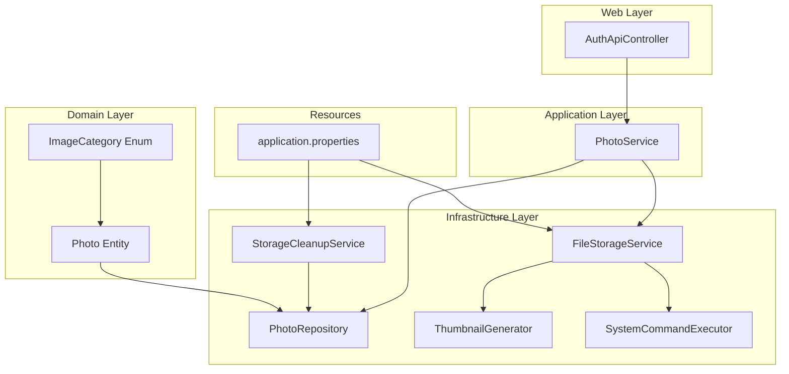
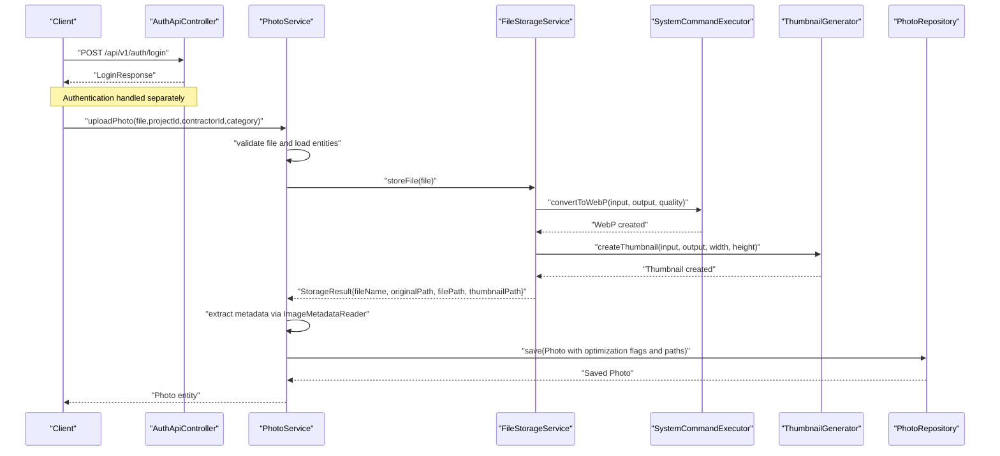
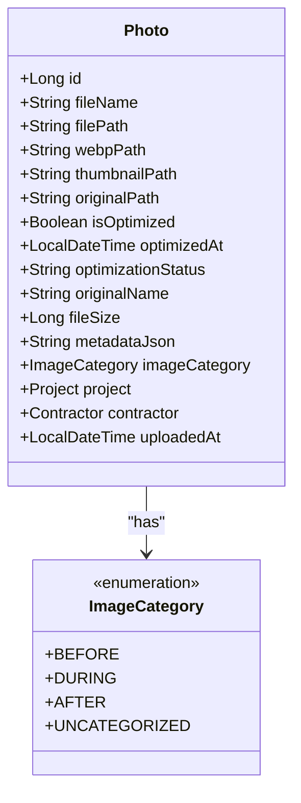
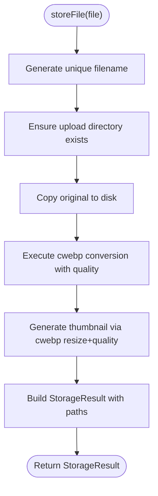
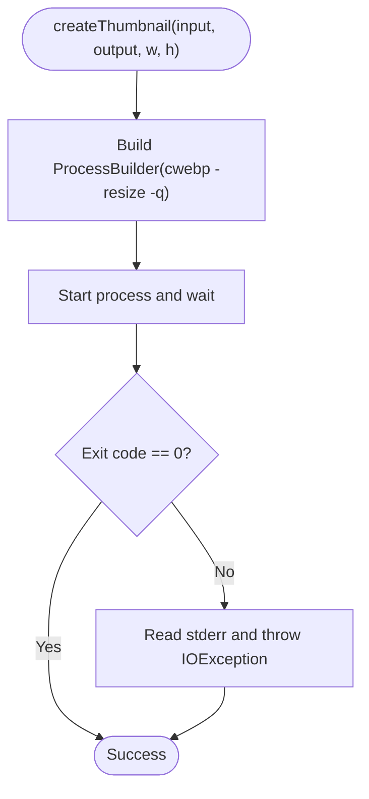
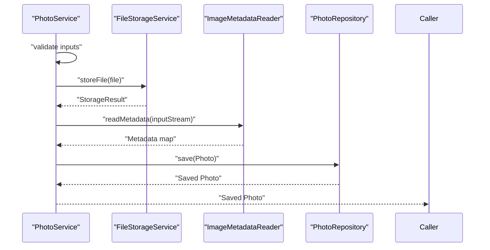
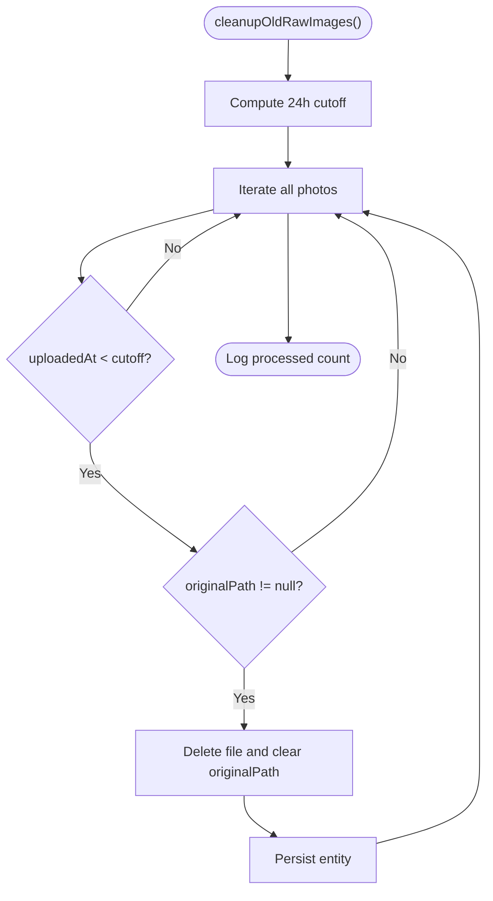
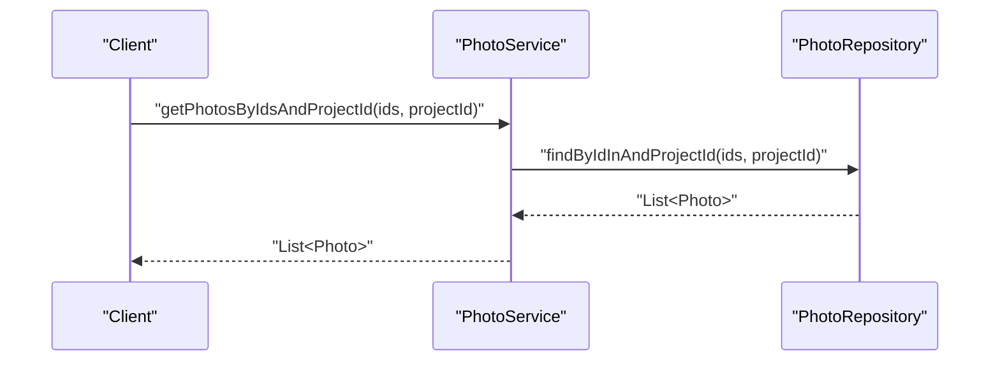
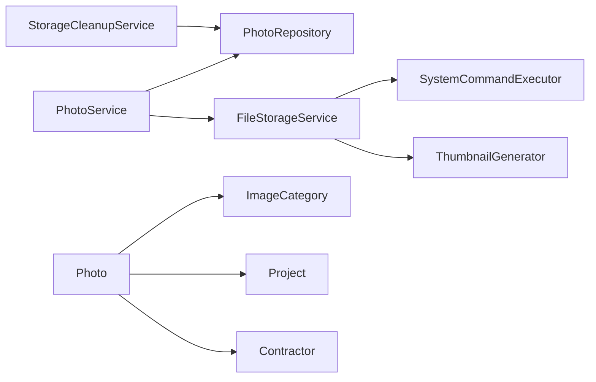

# Photo Management System

<cite>
**Referenced Files in This Document**
- [Photo.java](file://src/main/java/root/cyb/mh/skylink_media_service/domain/entities/Photo.java)
- [ImageCategory.java](file://src/main/java/root/cyb/mh/skylink_media_service/domain/valueobjects/ImageCategory.java)
- [FileStorageService.java](file://src/main/java/root/cyb/mh/skylink_media_service/infrastructure/storage/FileStorageService.java)
- [ThumbnailGenerator.java](file://src/main/java/root/cyb/mh/skylink_media_service/infrastructure/storage/ThumbnailGenerator.java)
- [SystemCommandExecutor.java](file://src/main/java/root/cyb/mh/skylink_media_service/infrastructure/storage/SystemCommandExecutor.java)
- [PhotoService.java](file://src/main/java/root/cyb/mh/skylink_media_service/application/services/PhotoService.java)
- [PhotoRepository.java](file://src/main/java/root/cyb/mh/skylink_media_service/infrastructure/persistence/PhotoRepository.java)
- [StorageCleanupService.java](file://src/main/java/root/cyb/mh/skylink_media_service/infrastructure/storage/StorageCleanupService.java)
- [application.properties](file://src/main/resources/application.properties)
- [photo-optimization-migration.sql](file://photo-optimization-migration.sql)
- [photo-category-migration.sql](file://photo-category-migration.sql)
- [install-webp.sh](file://install-webp.sh)
</cite>

## Table of Contents
1. [Introduction](#introduction)
2. [Project Structure](#project-structure)
3. [Core Components](#core-components)
4. [Architecture Overview](#architecture-overview)
5. [Detailed Component Analysis](#detailed-component-analysis)
6. [Dependency Analysis](#dependency-analysis)
7. [Performance Considerations](#performance-considerations)
8. [Troubleshooting Guide](#troubleshooting-guide)
9. [Conclusion](#conclusion)
10. [Appendices](#appendices)

## Introduction
This document describes the photo management system that handles image uploads, metadata extraction, optimization, and storage. It covers the complete workflow from validation and ingestion through storage optimization, thumbnail generation, and cleanup. It also documents the Photo entity model, categories, batch operations support, and operational guidelines for supported formats, size limits, and processing pipelines.

## Project Structure
The system follows a layered architecture:
- Domain: Entities and value objects define the core data model.
- Application: Services orchestrate business logic and coordinate repositories and infrastructure.
- Infrastructure: Persistence repositories, storage services, and system command executors implement storage and optimization.
- Web: Controllers expose REST endpoints for authentication and file operations.
- Resources: Configuration defines upload limits, storage directories, and runtime behavior.

**Diagram sources**
- [Photo.java:1-128](file://src/main/java/root/cyb/mh/skylink_media_service/domain/entities/Photo.java#L1-L128)
- [ImageCategory.java:1-23](file://src/main/java/root/cyb/mh/skylink_media_service/domain/valueobjects/ImageCategory.java#L1-L23)
- [PhotoService.java:1-116](file://src/main/java/root/cyb/mh/skylink_media_service/application/services/PhotoService.java#L1-L116)
- [PhotoRepository.java:1-22](file://src/main/java/root/cyb/mh/skylink_media_service/infrastructure/persistence/PhotoRepository.java#L1-L22)
- [FileStorageService.java:1-89](file://src/main/java/root/cyb/mh/skylink_media_service/infrastructure/storage/FileStorageService.java#L1-L89)
- [ThumbnailGenerator.java:1-42](file://src/main/java/root/cyb/mh/skylink_media_service/infrastructure/storage/ThumbnailGenerator.java#L1-L42)
- [SystemCommandExecutor.java:1-32](file://src/main/java/root/cyb/mh/skylink_media_service/infrastructure/storage/SystemCommandExecutor.java#L1-L32)
- [StorageCleanupService.java:1-52](file://src/main/java/root/cyb/mh/skylink_media_service/infrastructure/storage/StorageCleanupService.java#L1-L52)
- [application.properties:1-58](file://src/main/resources/application.properties#L1-L58)

**Section sources**
- [Photo.java:1-128](file://src/main/java/root/cyb/mh/skylink_media_service/domain/entities/Photo.java#L1-L128)
- [PhotoService.java:1-116](file://src/main/java/root/cyb/mh/skylink_media_service/application/services/PhotoService.java#L1-L116)
- [FileStorageService.java:1-89](file://src/main/java/root/cyb/mh/skylink_media_service/infrastructure/storage/FileStorageService.java#L1-L89)
- [PhotoRepository.java:1-22](file://src/main/java/root/cyb/mh/skylink_media_service/infrastructure/persistence/PhotoRepository.java#L1-L22)
- [application.properties:1-58](file://src/main/resources/application.properties#L1-L58)

## Core Components
- Photo entity: Stores file metadata, optimization state, paths for original, WebP, and thumbnails, and categorization.
- ImageCategory: Enumerates Before/During/After/Uncategorized with UI styling attributes.
- PhotoService: Orchestrates upload, metadata extraction, and persistence.
- FileStorageService: Handles file saving, WebP conversion, and thumbnail generation.
- ThumbnailGenerator: Uses cwebp to produce thumbnails with resize and quality parameters.
- SystemCommandExecutor: Executes cwebp for WebP conversion with metadata preservation.
- StorageCleanupService: Periodically removes old raw images to manage storage.
- PhotoRepository: JPA repository for photo queries and bulk operations.
- application.properties: Upload size limits, storage directory, and runtime settings.

**Section sources**
- [Photo.java:1-128](file://src/main/java/root/cyb/mh/skylink_media_service/domain/entities/Photo.java#L1-L128)
- [ImageCategory.java:1-23](file://src/main/java/root/cyb/mh/skylink_media_service/domain/valueobjects/ImageCategory.java#L1-L23)
- [PhotoService.java:1-116](file://src/main/java/root/cyb/mh/skylink_media_service/application/services/PhotoService.java#L1-L116)
- [FileStorageService.java:1-89](file://src/main/java/root/cyb/mh/skylink_media_service/infrastructure/storage/FileStorageService.java#L1-L89)
- [ThumbnailGenerator.java:1-42](file://src/main/java/root/cyb/mh/skylink_media_service/infrastructure/storage/ThumbnailGenerator.java#L1-L42)
- [SystemCommandExecutor.java:1-32](file://src/main/java/root/cyb/mh/skylink_media_service/infrastructure/storage/SystemCommandExecutor.java#L1-L32)
- [StorageCleanupService.java:1-52](file://src/main/java/root/cyb/mh/skylink_media_service/infrastructure/storage/StorageCleanupService.java#L1-L52)
- [PhotoRepository.java:1-22](file://src/main/java/root/cyb/mh/skylink_media_service/infrastructure/persistence/PhotoRepository.java#L1-L22)
- [application.properties:12-15](file://src/main/resources/application.properties#L12-L15)

## Architecture Overview
The upload pipeline integrates Spring MVC, application services, and system commands to transform images into optimized assets while preserving metadata and generating thumbnails.

**Diagram sources**
- [PhotoService.java:46-98](file://src/main/java/root/cyb/mh/skylink_media_service/application/services/PhotoService.java#L46-L98)
- [FileStorageService.java:33-55](file://src/main/java/root/cyb/mh/skylink_media_service/infrastructure/storage/FileStorageService.java#L33-L55)
- [SystemCommandExecutor.java:11-30](file://src/main/java/root/cyb/mh/skylink_media_service/infrastructure/storage/SystemCommandExecutor.java#L11-L30)
- [ThumbnailGenerator.java:17-40](file://src/main/java/root/cyb/mh/skylink_media_service/infrastructure/storage/ThumbnailGenerator.java#L17-L40)
- [PhotoRepository.java:11-21](file://src/main/java/root/cyb/mh/skylink_media_service/infrastructure/persistence/PhotoRepository.java#L11-L21)

## Detailed Component Analysis

### Photo Entity and Metadata Model
The Photo entity encapsulates:
- File identifiers and paths for original, WebP, and thumbnail outputs
- Optimization flags and timestamps
- Original filename, size, and JSON-encoded metadata extracted from the image
- Category classification and relationship to Project and Contractor
- Automatic timestamping on creation

**Diagram sources**
- [Photo.java:9-127](file://src/main/java/root/cyb/mh/skylink_media_service/domain/entities/Photo.java#L9-L127)
- [ImageCategory.java:3-7](file://src/main/java/root/cyb/mh/skylink_media_service/domain/valueobjects/ImageCategory.java#L3-L7)

**Section sources**
- [Photo.java:1-128](file://src/main/java/root/cyb/mh/skylink_media_service/domain/entities/Photo.java#L1-L128)
- [ImageCategory.java:1-23](file://src/main/java/root/cyb/mh/skylink_media_service/domain/valueobjects/ImageCategory.java#L1-L23)

### FileStorageService: File Handling and Optimization
Responsibilities:
- Ensures upload directory exists
- Generates unique filenames with timestamp and UUID
- Saves original file to preserve EXIF metadata
- Converts original to WebP with quality setting
- Generates a thumbnail from the original
- Returns a structured result containing all paths

Key behaviors:
- Filename generation ensures uniqueness and traceability
- WebP conversion preserves metadata and applies quality
- Thumbnail generation uses cwebp with fixed quality and resize parameters
- Logging tracks each step for observability

**Diagram sources**
- [FileStorageService.java:33-55](file://src/main/java/root/cyb/mh/skylink_media_service/infrastructure/storage/FileStorageService.java#L33-L55)
- [SystemCommandExecutor.java:11-30](file://src/main/java/root/cyb/mh/skylink_media_service/infrastructure/storage/SystemCommandExecutor.java#L11-L30)
- [ThumbnailGenerator.java:17-40](file://src/main/java/root/cyb/mh/skylink_media_service/infrastructure/storage/ThumbnailGenerator.java#L17-L40)

**Section sources**
- [FileStorageService.java:1-89](file://src/main/java/root/cyb/mh/skylink_media_service/infrastructure/storage/FileStorageService.java#L1-L89)
- [SystemCommandExecutor.java:1-32](file://src/main/java/root/cyb/mh/skylink_media_service/infrastructure/storage/SystemCommandExecutor.java#L1-L32)
- [ThumbnailGenerator.java:1-42](file://src/main/java/root/cyb/mh/skylink_media_service/infrastructure/storage/ThumbnailGenerator.java#L1-L42)

### ThumbnailGenerator: WebP Conversion and Thumbnail Creation
Behavior:
- Invokes cwebp with resize parameters to produce thumbnails
- Applies a fixed quality factor for balance between size and fidelity
- Streams and logs errors for diagnostics
- Throws exceptions on failure to signal upstream handling

**Diagram sources**
- [ThumbnailGenerator.java:17-40](file://src/main/java/root/cyb/mh/skylink_media_service/infrastructure/storage/ThumbnailGenerator.java#L17-L40)

**Section sources**
- [ThumbnailGenerator.java:1-42](file://src/main/java/root/cyb/mh/skylink_media_service/infrastructure/storage/ThumbnailGenerator.java#L1-L42)

### PhotoService: Upload Workflow and Metadata Extraction
Workflow:
- Validates non-empty file and loads associated Project and Contractor
- Delegates storage to FileStorageService
- Extracts metadata using ImageMetadataReader and serializes to JSON
- Populates Photo entity with optimization flags, paths, metadata, and category
- Persists and returns the saved entity

**Diagram sources**
- [PhotoService.java:46-98](file://src/main/java/root/cyb/mh/skylink_media_service/application/services/PhotoService.java#L46-L98)
- [FileStorageService.java:33-55](file://src/main/java/root/cyb/mh/skylink_media_service/infrastructure/storage/FileStorageService.java#L33-L55)

**Section sources**
- [PhotoService.java:1-116](file://src/main/java/root/cyb/mh/skylink_media_service/application/services/PhotoService.java#L1-L116)

### Storage Cleanup Mechanism
Purpose:
- Periodically remove raw/original images older than a threshold to reclaim disk space
- Updates Photo records to clear originalPath after deletion

Mechanics:
- Scheduled job runs hourly
- Filters photos by upload timestamp and presence of originalPath
- Deletes files and updates entity state

**Diagram sources**
- [StorageCleanupService.java:26-50](file://src/main/java/root/cyb/mh/skylink_media_service/infrastructure/storage/StorageCleanupService.java#L26-L50)

**Section sources**
- [StorageCleanupService.java:1-52](file://src/main/java/root/cyb/mh/skylink_media_service/infrastructure/storage/StorageCleanupService.java#L1-L52)

### Batch Operations and Bulk Exports
- Photo retrieval by project and contractor is supported via PhotoRepository.
- Bulk selection by IDs and project ID is supported for downstream export workflows.
- No dedicated batch upload endpoint is present in the analyzed code; bulk uploads would require extending the upload controller to accept arrays and invoking the existing upload logic per item.

**Diagram sources**
- [PhotoService.java:112-114](file://src/main/java/root/cyb/mh/skylink_media_service/application/services/PhotoService.java#L112-L114)
- [PhotoRepository.java:18](file://src/main/java/root/cyb/mh/skylink_media_service/infrastructure/persistence/PhotoRepository.java#L18)

**Section sources**
- [PhotoRepository.java:1-22](file://src/main/java/root/cyb/mh/skylink_media_service/infrastructure/persistence/PhotoRepository.java#L1-L22)
- [PhotoService.java:100-114](file://src/main/java/root/cyb/mh/skylink_media_service/application/services/PhotoService.java#L100-L114)

## Dependency Analysis
- PhotoService depends on PhotoRepository, ProjectRepository, ContractorRepository, and FileStorageService.
- FileStorageService depends on SystemCommandExecutor and ThumbnailGenerator.
- ThumbnailGenerator depends on SystemCommandExecutor.
- StorageCleanupService depends on PhotoRepository.
- Photo entity references ImageCategory and relationships to Project and Contractor.

**Diagram sources**
- [PhotoService.java:34-44](file://src/main/java/root/cyb/mh/skylink_media_service/application/services/PhotoService.java#L34-L44)
- [FileStorageService.java:25-31](file://src/main/java/root/cyb/mh/skylink_media_service/infrastructure/storage/FileStorageService.java#L25-L31)
- [ThumbnailGenerator.java:11-15](file://src/main/java/root/cyb/mh/skylink_media_service/infrastructure/storage/ThumbnailGenerator.java#L11-L15)
- [StorageCleanupService.java:20-24](file://src/main/java/root/cyb/mh/skylink_media_service/infrastructure/storage/StorageCleanupService.java#L20-L24)
- [Photo.java:47-57](file://src/main/java/root/cyb/mh/skylink_media_service/domain/entities/Photo.java#L47-L57)

**Section sources**
- [PhotoService.java:1-116](file://src/main/java/root/cyb/mh/skylink_media_service/application/services/PhotoService.java#L1-L116)
- [FileStorageService.java:1-89](file://src/main/java/root/cyb/mh/skylink_media_service/infrastructure/storage/FileStorageService.java#L1-L89)
- [ThumbnailGenerator.java:1-42](file://src/main/java/root/cyb/mh/skylink_media_service/infrastructure/storage/ThumbnailGenerator.java#L1-L42)
- [StorageCleanupService.java:1-52](file://src/main/java/root/cyb/mh/skylink_media_service/infrastructure/storage/StorageCleanupService.java#L1-L52)
- [Photo.java:1-128](file://src/main/java/root/cyb/mh/skylink_media_service/domain/entities/Photo.java#L1-L128)

## Performance Considerations
- WebP conversion quality: The system uses a fixed quality parameter during conversion. Adjusting this parameter affects file size and perceived quality.
- Thumbnail generation: Resize and quality parameters influence CPU usage and memory consumption. Larger thumbnails increase processing time.
- Metadata extraction: Image metadata parsing adds overhead proportional to file size and complexity; consider limiting concurrency for large batches.
- Storage cleanup: Running cleanup periodically prevents accumulation of raw images but may impact disk I/O; schedule during low-traffic windows.
- Upload limits: Current max file size and request size are configured in application properties; tune according to network conditions and server capacity.

[No sources needed since this section provides general guidance]

## Troubleshooting Guide
Common issues and resolutions:
- WebP conversion failures: Verify cwebp availability and permissions. The installation script supports Linux and macOS package managers.
- Thumbnail generation errors: cwebp exit codes are captured and logged; inspect error output for specific causes.
- Missing original files after cleanup: Confirm cleanup thresholds and logging; ensure cleanup does not remove files still referenced by active records.
- Metadata extraction warnings: Some files may lack readable metadata; the system logs warnings and continues without metadata.

Operational checks:
- Confirm cwebp installation and version compatibility.
- Review application logs for conversion and thumbnail generation steps.
- Validate upload directory permissions and disk space.

**Section sources**
- [install-webp.sh:1-40](file://install-webp.sh#L1-L40)
- [SystemCommandExecutor.java:11-30](file://src/main/java/root/cyb/mh/skylink_media_service/infrastructure/storage/SystemCommandExecutor.java#L11-L30)
- [ThumbnailGenerator.java:17-40](file://src/main/java/root/cyb/mh/skylink_media_service/infrastructure/storage/ThumbnailGenerator.java#L17-L40)
- [StorageCleanupService.java:26-50](file://src/main/java/root/cyb/mh/skylink_media_service/infrastructure/storage/StorageCleanupService.java#L26-L50)
- [PhotoService.java:79-81](file://src/main/java/root/cyb/mh/skylink_media_service/application/services/PhotoService.java#L79-L81)

## Conclusion
The photo management system provides a robust pipeline for uploading, optimizing, and organizing images. It preserves original metadata, generates WebP assets for efficient delivery, and creates thumbnails for previews. Automated cleanup helps maintain storage hygiene. Extending the system to support batch uploads and exports involves leveraging existing repositories and services with minimal modifications.

[No sources needed since this section summarizes without analyzing specific files]

## Appendices

### Supported Formats and Size Limits
- Formats: Images are converted to WebP for UI rendering; original files are preserved. Thumbnail generation uses cwebp, which supports common raster formats.
- Size limits: Maximum file size and request size are defined in application properties.

**Section sources**
- [application.properties:12-15](file://src/main/resources/application.properties#L12-L15)

### Processing Pipelines and Optimization Settings
- WebP conversion: Quality parameter applied during conversion; metadata preserved.
- Thumbnail generation: Fixed quality and resize parameters; output dimensions configurable in code.
- Optimization flags: isOptimized, optimizationStatus, and optimizedAt track processing state.

**Section sources**
- [FileStorageService.java:43-54](file://src/main/java/root/cyb/mh/skylink_media_service/infrastructure/storage/FileStorageService.java#L43-L54)
- [ThumbnailGenerator.java:17-24](file://src/main/java/root/cyb/mh/skylink_media_service/infrastructure/storage/ThumbnailGenerator.java#L17-L24)
- [photo-optimization-migration.sql:4-11](file://photo-optimization-migration.sql#L4-L11)

### Database Schema Notes
- Optimization fields: Added via migration script to track WebP/thumbnail paths and optimization state.
- Categories: Added via migration script with constraints and indexes for filtering.

**Section sources**
- [photo-optimization-migration.sql:1-16](file://photo-optimization-migration.sql#L1-L16)
- [photo-category-migration.sql:1-22](file://photo-category-migration.sql#L1-L22)