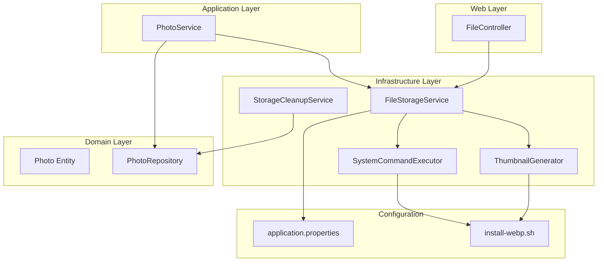
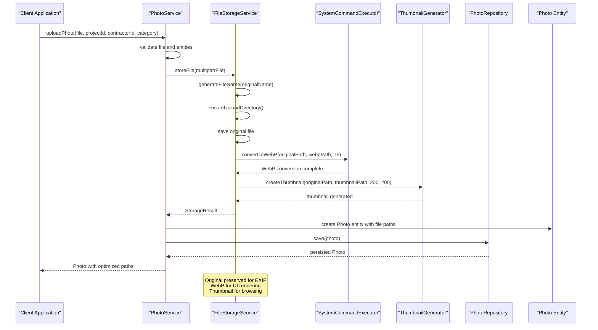
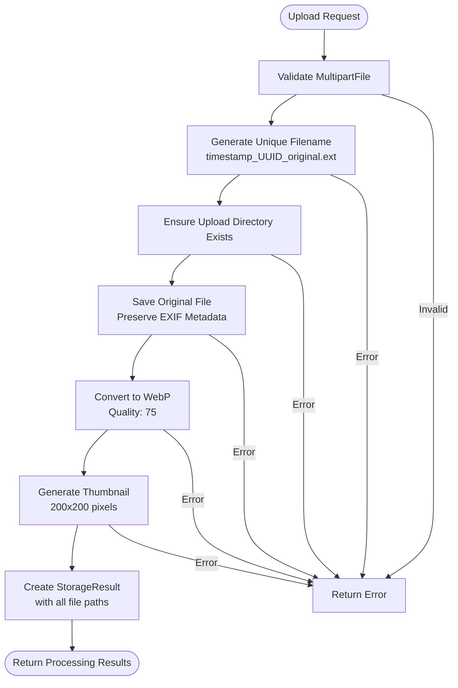
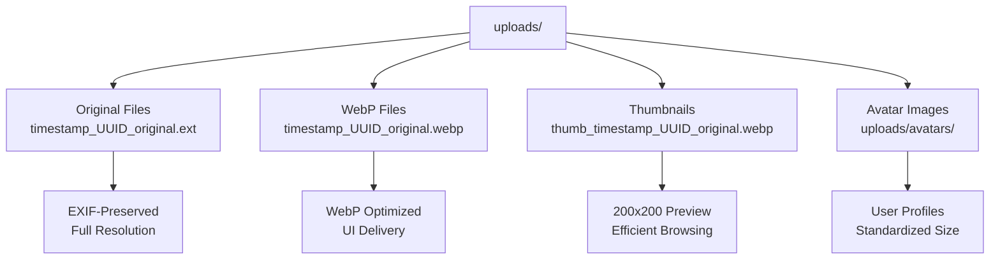
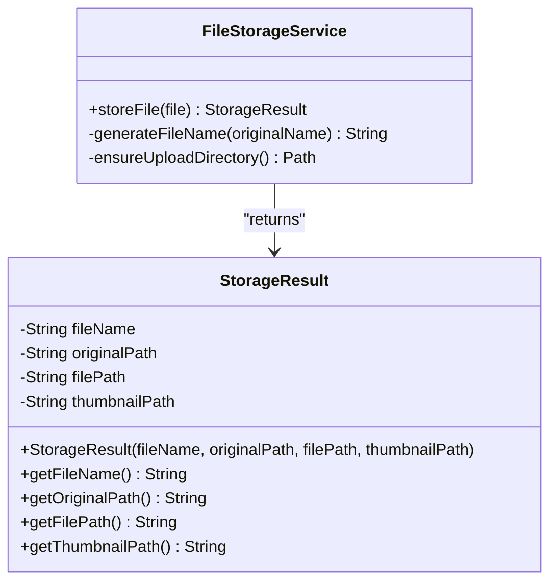
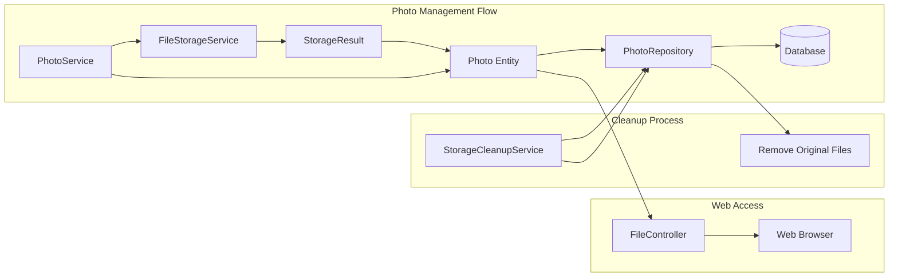
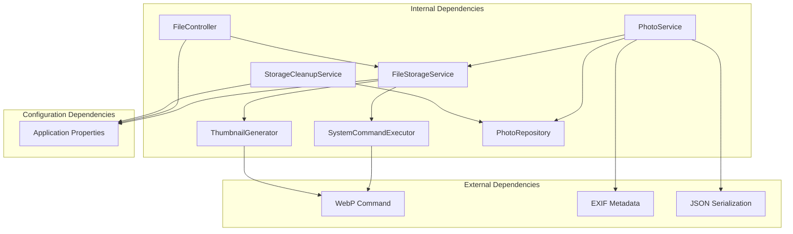

# File Storage Service

<cite>
**Referenced Files in This Document**
- [FileStorageService.java](file://skylink-media-service-backend/src/main/java/root/cyb/mh/skylink_media_service/infrastructure/storage/FileStorageService.java)
- [SystemCommandExecutor.java](file://skylink-media-service-backend/src/main/java/root/cyb/mh/skylink_media_service/infrastructure/storage/SystemCommandExecutor.java)
- [ThumbnailGenerator.java](file://skylink-media-service-backend/src/main/java/root/cyb/mh/skylink_media_service/infrastructure/storage/ThumbnailGenerator.java)
- [StorageCleanupService.java](file://skylink-media-service-backend/src/main/java/root/cyb/mh/skylink_media_service/infrastructure/storage/StorageCleanupService.java)
- [PhotoService.java](file://skylink-media-service-backend/src/main/java/root/cyb/mh/skylink_media_service/application/services/PhotoService.java)
- [Photo.java](file://skylink-media-service-backend/src/main/java/root/cyb/mh/skylink_media_service/domain/entities/Photo.java)
- [PhotoRepository.java](file://skylink-media-service-backend/src/main/java/root/cyb/mh/skylink_media_service/infrastructure/persistence/PhotoRepository.java)
- [FileController.java](file://skylink-media-service-backend/src/main/java/root/cyb/mh/skylink_media_service/infrastructure/web/FileController.java)
- [application.properties](file://skylink-media-service-backend/src/main/resources/application.properties)
- [install-webp.sh](file://skylink-media-service-backend/install-webp.sh)
</cite>

## Table of Contents
1. [Introduction](#introduction)
2. [Project Structure](#project-structure)
3. [Core Components](#core-components)
4. [Architecture Overview](#architecture-overview)
5. [Detailed Component Analysis](#detailed-component-analysis)
6. [Dependency Analysis](#dependency-analysis)
7. [Performance Considerations](#performance-considerations)
8. [Troubleshooting Guide](#troubleshooting-guide)
9. [Conclusion](#conclusion)

## Introduction
The File Storage Service is a core component of the media management system responsible for handling file uploads, preserving original files, converting images to WebP format for optimal web delivery, and generating thumbnails for efficient browsing. This service ensures high-quality image preservation while optimizing for web performance through modern image formats and scalable thumbnail generation.

The service operates as part of a larger photo management ecosystem, integrating with Spring Boot's multipart file handling, database persistence, and web serving capabilities. It maintains strict separation between original preservation and optimized delivery formats while providing robust error handling and cleanup mechanisms.

## Project Structure
The file storage functionality is organized within the infrastructure layer, specifically under the storage package. The architecture follows clean separation of concerns with dedicated components for different aspects of file processing.

**Diagram sources**
- [FileStorageService.java:17-31](file://skylink-media-service-backend/src/main/java/root/cyb/mh/skylink_media_service/infrastructure/storage/FileStorageService.java#L17-L31)
- [PhotoService.java:29-44](file://skylink-media-service-backend/src/main/java/root/cyb/mh/skylink_media_service/application/services/PhotoService.java#L29-L44)

**Section sources**
- [FileStorageService.java:1-89](file://skylink-media-service-backend/src/main/java/root/cyb/mh/skylink_media_service/infrastructure/storage/FileStorageService.java#L1-L89)
- [PhotoService.java:1-116](file://skylink-media-service-backend/src/main/java/root/cyb/mh/skylink_media_service/application/services/PhotoService.java#L1-L116)

## Core Components
The File Storage Service consists of several specialized components working together to provide comprehensive file management capabilities:

### FileStorageService
The central orchestrator that manages the complete file processing pipeline, from initial upload through final storage and optimization.

### SystemCommandExecutor
Handles external system commands for WebP conversion using the cwebp utility, providing reliable image format transformation with configurable quality settings.

### ThumbnailGenerator
Creates optimized thumbnails using the cwebp command-line tool with fixed dimensions and quality parameters for efficient web browsing.

### StorageCleanupService
Implements automated cleanup of temporary original files after optimization, maintaining storage efficiency while preserving access to processed content.

### StorageResult
Encapsulates the results of file processing operations, providing structured access to all generated file paths and metadata.

**Section sources**
- [FileStorageService.java:70-87](file://skylink-media-service-backend/src/main/java/root/cyb/mh/skylink_media_service/infrastructure/storage/FileStorageService.java#L70-L87)
- [SystemCommandExecutor.java:9-31](file://skylink-media-service-backend/src/main/java/root/cyb/mh/skylink_media_service/infrastructure/storage/SystemCommandExecutor.java#L9-L31)
- [ThumbnailGenerator.java:9-41](file://skylink-media-service-backend/src/main/java/root/cyb/mh/skylink_media_service/infrastructure/storage/ThumbnailGenerator.java#L9-L41)
- [StorageCleanupService.java:16-51](file://skylink-media-service-backend/src/main/java/root/cyb/mh/skylink_media_service/infrastructure/storage/StorageCleanupService.java#L16-L51)

## Architecture Overview
The file storage architecture follows a multi-layered approach with clear separation between processing, persistence, and presentation concerns.

**Diagram sources**
- [PhotoService.java:46-98](file://skylink-media-service-backend/src/main/java/root/cyb/mh/skylink_media_service/application/services/PhotoService.java#L46-L98)
- [FileStorageService.java:33-55](file://skylink-media-service-backend/src/main/java/root/cyb/mh/skylink_media_service/infrastructure/storage/FileStorageService.java#L33-L55)
- [SystemCommandExecutor.java:11-30](file://skylink-media-service-backend/src/main/java/root/cyb/mh/skylink_media_service/infrastructure/storage/SystemCommandExecutor.java#L11-L30)
- [ThumbnailGenerator.java:17-40](file://skylink-media-service-backend/src/main/java/root/cyb/mh/skylink_media_service/infrastructure/storage/ThumbnailGenerator.java#L17-L40)

## Detailed Component Analysis

### File Upload Workflow
The file upload process follows a carefully orchestrated sequence designed to preserve image quality while optimizing for web delivery:

**Diagram sources**
- [FileStorageService.java:33-55](file://skylink-media-service-backend/src/main/java/root/cyb/mh/skylink_media_service/infrastructure/storage/FileStorageService.java#L33-L55)
- [FileStorageService.java:57-60](file://skylink-media-service-backend/src/main/java/root/cyb/mh/skylink_media_service/infrastructure/storage/FileStorageService.java#L57-L60)
- [FileStorageService.java:62-68](file://skylink-media-service-backend/src/main/java/root/cyb/mh/skylink_media_service/infrastructure/storage/FileStorageService.java#L62-L68)

#### Original File Preservation
The system prioritizes preserving the original file to maintain EXIF metadata and full resolution for potential future processing. The original file is stored immediately after validation, ensuring that no quality is lost during the optimization process.

#### WebP Conversion Process
WebP conversion utilizes the cwebp command-line utility with quality setting of 75, providing excellent compression while maintaining visual fidelity. The conversion preserves all metadata from the original file, ensuring that important information like camera settings and timestamps remain intact.

#### Thumbnail Generation
Thumbnails are generated at exactly 200x200 pixels using the cwebp utility with quality 60.0. These thumbnails provide efficient browsing capabilities while maintaining reasonable quality for preview purposes.

**Section sources**
- [FileStorageService.java:33-55](file://skylink-media-service-backend/src/main/java/root/cyb/mh/skylink_media_service/infrastructure/storage/FileStorageService.java#L33-L55)
- [SystemCommandExecutor.java:11-18](file://skylink-media-service-backend/src/main/java/root/cyb/mh/skylink_media_service/infrastructure/storage/SystemCommandExecutor.java#L11-L18)
- [ThumbnailGenerator.java:17-24](file://skylink-media-service-backend/src/main/java/root/cyb/mh/skylink_media_service/infrastructure/storage/ThumbnailGenerator.java#L17-L24)

### Directory Structure Organization
The file storage system organizes content in a hierarchical structure optimized for web delivery and maintenance:

**Diagram sources**
- [FileStorageService.java:40-51](file://skylink-media-service-backend/src/main/java/root/cyb/mh/skylink_media_service/infrastructure/storage/FileStorageService.java#L40-L51)
- [FileController.java:18-64](file://skylink-media-service-backend/src/main/java/root/cyb/mh/skylink_media_service/infrastructure/web/FileController.java#L18-L64)

#### File Naming Conventions
The system employs a sophisticated naming scheme combining timestamp, UUID, and original filename to ensure uniqueness and traceability:

- **Format**: `yyyyMMdd_HHmmss_UUID_original.ext`
- **Purpose**: Prevents collisions, maintains chronological order, and preserves original filenames for user recognition
- **Example**: `20241201_143022_a1b2c3d4_photo.jpg`

#### Path Management Strategies
The service maintains separate paths for different file types while ensuring consistent access patterns:

- **Original Path**: Full-resolution preservation for editing and archival
- **WebP Path**: Optimized format for web delivery
- **Thumbnail Path**: Compressed preview for gallery browsing

**Section sources**
- [FileStorageService.java:57-60](file://skylink-media-service-backend/src/main/java/root/cyb/mh/skylink_media_service/infrastructure/storage/FileStorageService.java#L57-L60)
- [FileStorageService.java:70-87](file://skylink-media-service-backend/src/main/java/root/cyb/mh/skylink_media_service/infrastructure/storage/FileStorageService.java#L70-L87)

### StorageResult Class Structure
The StorageResult encapsulates all processed file information in a structured, immutable format:

**Diagram sources**
- [FileStorageService.java:70-87](file://skylink-media-service-backend/src/main/java/root/cyb/mh/skylink_media_service/infrastructure/storage/FileStorageService.java#L70-L87)

The StorageResult provides four key pieces of information:
- **fileName**: The processed filename for database storage
- **originalPath**: Full filesystem path to the preserved original
- **filePath**: Path to the WebP-optimized file
- **thumbnailPath**: Path to the generated thumbnail

**Section sources**
- [FileStorageService.java:70-87](file://skylink-media-service-backend/src/main/java/root/cyb/mh/skylink_media_service/infrastructure/storage/FileStorageService.java#L70-L87)

### Configuration Options
The system provides flexible configuration through application properties:

| Configuration | Default Value | Description |
|---------------|---------------|-------------|
| `app.upload.dir` | `uploads` | Base directory for file storage |
| `spring.servlet.multipart.max-file-size` | `10MB` | Maximum individual file size |
| `spring.servlet.multipart.max-request-size` | `50MB` | Maximum total request size |

Additional WebP conversion settings:
- **Quality**: 75 (WebP conversion)
- **Thumbnail Dimensions**: 200x200 pixels
- **Thumbnail Quality**: 60.0

**Section sources**
- [application.properties:12-15](file://skylink-media-service-backend/src/main/resources/application.properties#L12-L15)
- [FileStorageService.java:46](file://skylink-media-service-backend/src/main/java/root/cyb/mh/skylink_media_service/infrastructure/storage/FileStorageService.java#L46)
- [ThumbnailGenerator.java:20-21](file://skylink-media-service-backend/src/main/java/root/cyb/mh/skylink_media_service/infrastructure/storage/ThumbnailGenerator.java#L20-L21)

### Integration with Photo Management System
The File Storage Service integrates seamlessly with the broader photo management ecosystem:

**Diagram sources**
- [PhotoService.java:46-98](file://skylink-media-service-backend/src/main/java/root/cyb/mh/skylink_media_service/application/services/PhotoService.java#L46-L98)
- [Photo.java:14-27](file://skylink-media-service-backend/src/main/java/root/cyb/mh/skylink_media_service/domain/entities/Photo.java#L14-L27)
- [FileController.java:21-43](file://skylink-media-service-backend/src/main/java/root/cyb/mh/skylink_media_service/infrastructure/web/FileController.java#L21-L43)

**Section sources**
- [PhotoService.java:46-98](file://skylink-media-service-backend/src/main/java/root/cyb/mh/skylink_media_service/application/services/PhotoService.java#L46-L98)
- [Photo.java:14-27](file://skylink-media-service-backend/src/main/java/root/cyb/mh/skylink_media_service/domain/entities/Photo.java#L14-L27)

## Dependency Analysis
The file storage system exhibits strong internal cohesion with minimal external coupling:

**Diagram sources**
- [FileStorageService.java:25-31](file://skylink-media-service-backend/src/main/java/root/cyb/mh/skylink_media_service/infrastructure/storage/FileStorageService.java#L25-L31)
- [PhotoService.java:17-21](file://skylink-media-service-backend/src/main/java/root/cyb/mh/skylink_media_service/application/services/PhotoService.java#L17-L21)

The dependency graph reveals a clean architecture with clear separation of concerns:
- **Processing Layer**: FileStorageService orchestrates all file operations
- **Execution Layer**: SystemCommandExecutor and ThumbnailGenerator handle external processes
- **Integration Layer**: PhotoService coordinates with the broader system
- **Persistence Layer**: PhotoRepository manages database interactions
- **Presentation Layer**: FileController serves files to clients

**Section sources**
- [FileStorageService.java:25-31](file://skylink-media-service-backend/src/main/java/root/cyb/mh/skylink_media_service/infrastructure/storage/FileStorageService.java#L25-L31)
- [PhotoService.java:17-21](file://skylink-media-service-backend/src/main/java/root/cyb/mh/skylink_media_service/application/services/PhotoService.java#L17-L21)

## Performance Considerations
The file storage system incorporates several performance optimization strategies:

### Memory Management
- **Streaming Processing**: Large files are processed using streaming rather than loading entirely into memory
- **Resource Cleanup**: Proper disposal of InputStream and OutputStream resources
- **Thumbnail Generation**: Efficient WebP processing with controlled memory usage

### Storage Optimization
- **Selective Cleanup**: Automated removal of original files after 24 hours
- **Compression Ratios**: WebP provides 25-35% smaller files compared to JPEG
- **Thumbnail Efficiency**: 200x200 pixel thumbnails reduce bandwidth usage

### Scalability Features
- **Asynchronous Processing**: WebP conversion runs as external processes
- **Parallel Operations**: Multiple files can be processed concurrently
- **Caching Strategy**: WebP files cached for immediate delivery

### Performance Monitoring
The system logs key metrics including processing times and file sizes for performance analysis and optimization.

## Troubleshooting Guide

### Common Issues and Solutions

#### WebP Conversion Failures
**Symptoms**: IOException with "WebP conversion failed" message
**Causes**: 
- cwebp binary not installed or not in PATH
- Insufficient disk space
- Invalid image format

**Solutions**:
1. Verify cwebp installation using `cwebp -version`
2. Install WebP tools using the provided installation script
3. Check available disk space in upload directory

#### Thumbnail Generation Errors
**Symptoms**: IOException with "Thumbnail generation failed" message
**Causes**:
- cwebp command execution failures
- Permission issues with upload directory
- Corrupted source files

**Solutions**:
1. Test cwebp command manually with sample file
2. Verify write permissions for upload directory
3. Validate source file integrity

#### File Access Issues
**Symptoms**: 404 Not Found errors when accessing files
**Causes**:
- Incorrect file paths in database
- Missing files on filesystem
- Permission denied errors

**Solutions**:
1. Verify file paths stored in Photo entities
2. Check filesystem permissions for upload directory
3. Confirm file existence using file system utilities

#### Memory and Performance Issues
**Symptoms**: OutOfMemoryError or slow processing times
**Causes**:
- Very large file uploads
- Insufficient system resources
- Concurrent processing bottlenecks

**Solutions**:
1. Implement file size limits in application.properties
2. Monitor system resource usage during peak times
3. Consider horizontal scaling for high-volume scenarios

**Section sources**
- [SystemCommandExecutor.java:21-29](file://skylink-media-service-backend/src/main/java/root/cyb/mh/skylink_media_service/infrastructure/storage/SystemCommandExecutor.java#L21-L29)
- [ThumbnailGenerator.java:30-39](file://skylink-media-service-backend/src/main/java/root/cyb/mh/skylink_media_service/infrastructure/storage/ThumbnailGenerator.java#L30-L39)
- [StorageCleanupService.java:37-47](file://skylink-media-service-backend/src/main/java/root/cyb/mh/skylink_media_service/infrastructure/storage/StorageCleanupService.java#L37-L47)

### Security Considerations
The file storage system implements several security measures:

#### File Access Permissions
- **Restricted Directory Access**: Upload directory requires explicit permission configuration
- **Content Type Validation**: Automatic detection and proper MIME type assignment
- **Path Traversal Prevention**: Safe path resolution preventing directory traversal attacks

#### Data Protection
- **Original File Preservation**: Maintains full-resolution copies for authorized access
- **Metadata Handling**: Proper filtering of sensitive EXIF data during processing
- **Temporary File Management**: Automated cleanup prevents unauthorized access to temporary files

#### Operational Security
- **Process Isolation**: External command execution in isolated processes
- **Error Handling**: Graceful failure handling without exposing system internals
- **Logging Strategy**: Comprehensive logging for audit trails without exposing sensitive data

### Integration Examples

#### Basic File Upload Processing
The system handles file uploads through a straightforward workflow:
1. Validate incoming MultipartFile
2. Generate unique filename with timestamp and UUID
3. Save original file for preservation
4. Convert to WebP format with quality 75
5. Generate thumbnail at 200x200 pixels
6. Store all paths in Photo entity
7. Persist to database

#### Error Handling Scenarios
The system provides comprehensive error handling:
- **Empty Files**: Immediate rejection with descriptive error messages
- **Invalid Formats**: Graceful handling with fallback mechanisms
- **Disk Space Issues**: Clear error reporting with actionable solutions
- **Permission Denied**: Specific error messages for access control issues

#### Performance Optimization for Large Files
For files exceeding typical sizes:
- **Streaming Processing**: Avoids memory overhead
- **Asynchronous Operations**: Non-blocking file processing
- **Resource Limits**: Configurable size limits prevent system overload
- **Cleanup Automation**: Regular removal of temporary files

The File Storage Service provides a robust foundation for media management, balancing quality preservation with web performance optimization while maintaining security and scalability considerations.