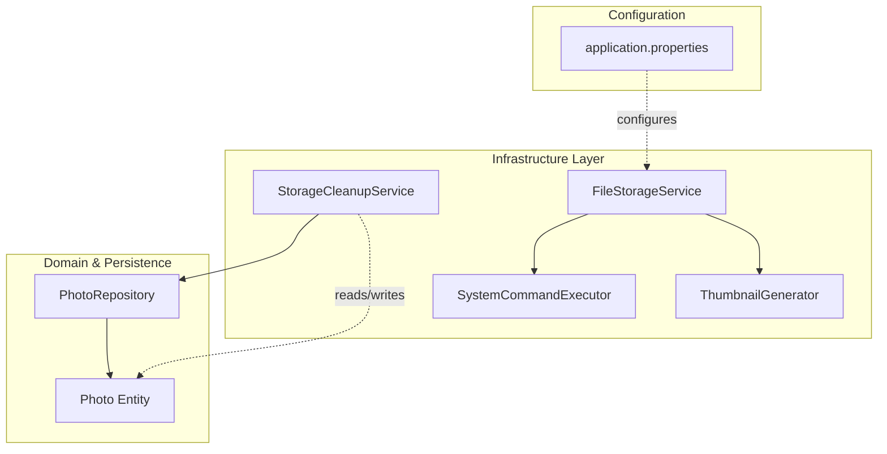
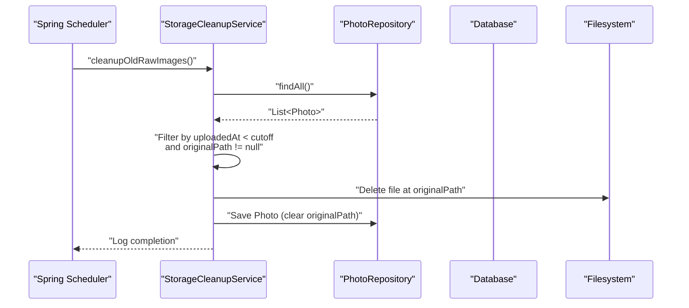
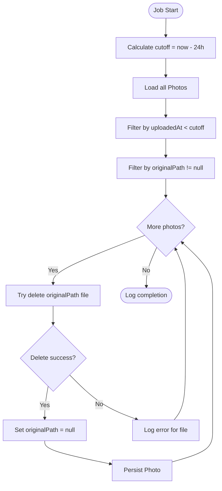
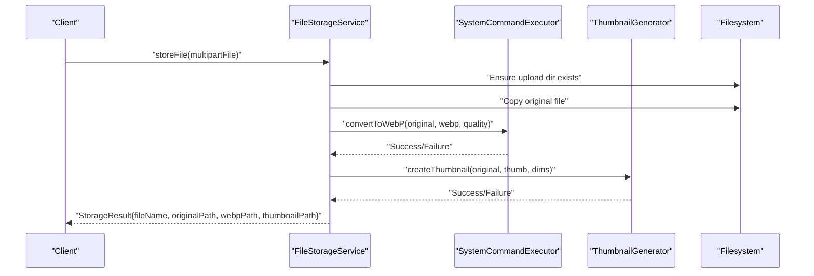
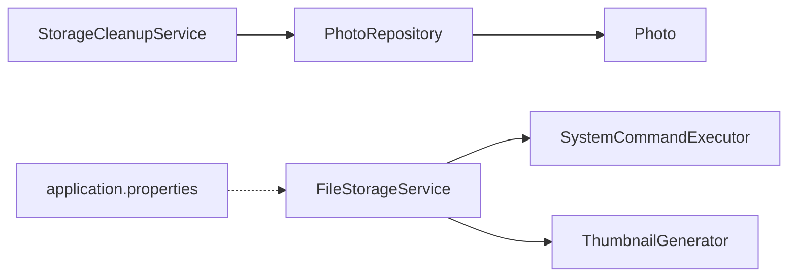

# Storage Cleanup Service

<cite>
**Referenced Files in This Document**
- [StorageCleanupService.java](file://src/main/java/root/cyb/mh/skylink_media_service/infrastructure/storage/StorageCleanupService.java)
- [FileStorageService.java](file://src/main/java/root/cyb/mh/skylink_media_service/infrastructure/storage/FileStorageService.java)
- [SystemCommandExecutor.java](file://src/main/java/root/cyb/mh/skylink_media_service/infrastructure/storage/SystemCommandExecutor.java)
- [ThumbnailGenerator.java](file://src/main/java/root/cyb/mh/skylink_media_service/infrastructure/storage/ThumbnailGenerator.java)
- [Photo.java](file://src/main/java/root/cyb/mh/skylink_media_service/domain/entities/Photo.java)
- [PhotoRepository.java](file://src/main/java/root/cyb/mh/skylink_media_service/infrastructure/persistence/PhotoRepository.java)
- [application.properties](file://src/main/resources/application.properties)
- [README.md](file://README.md)
- [photo-optimization-migration.sql](file://photo-optimization-migration.sql)
- [database-schema.sql](file://database-schema.sql)
</cite>

## Table of Contents
1. [Introduction](#introduction)
2. [Project Structure](#project-structure)
3. [Core Components](#core-components)
4. [Architecture Overview](#architecture-overview)
5. [Detailed Component Analysis](#detailed-component-analysis)
6. [Dependency Analysis](#dependency-analysis)
7. [Performance Considerations](#performance-considerations)
8. [Troubleshooting Guide](#troubleshooting-guide)
9. [Conclusion](#conclusion)
10. [Appendices](#appendices)

## Introduction
This document describes the StorageCleanupService responsible for automated file cleanup operations in the Skylink Media Service backend. It explains cleanup schedules, retention policies, orphaned file detection, and the storage optimization pipeline that generates WebP images and thumbnails. It also covers configuration options for cleanup intervals, storage thresholds, and operational monitoring, along with safety measures and recovery guidance.

## Project Structure
The storage cleanup functionality is implemented within the infrastructure layer under the storage package. It integrates with the domain model (Photo entity), persistence layer (PhotoRepository), and file storage pipeline (FileStorageService, SystemCommandExecutor, ThumbnailGenerator). Configuration is centralized in application properties, and schema migrations define the storage-related database columns and indexes.

**Diagram sources**
- [StorageCleanupService.java:15-52](file://src/main/java/root/cyb/mh/skylink_media_service/infrastructure/storage/StorageCleanupService.java#L15-L52)
- [FileStorageService.java:17-89](file://src/main/java/root/cyb/mh/skylink_media_service/infrastructure/storage/FileStorageService.java#L17-L89)
- [SystemCommandExecutor.java:8-32](file://src/main/java/root/cyb/mh/skylink_media_service/infrastructure/storage/SystemCommandExecutor.java#L8-L32)
- [ThumbnailGenerator.java:8-42](file://src/main/java/root/cyb/mh/skylink_media_service/infrastructure/storage/ThumbnailGenerator.java#L8-L42)
- [Photo.java:7-128](file://src/main/java/root/cyb/mh/skylink_media_service/domain/entities/Photo.java#L7-L128)
- [PhotoRepository.java:10-22](file://src/main/java/root/cyb/mh/skylink_media_service/infrastructure/persistence/PhotoRepository.java#L10-L22)
- [application.properties:12-16](file://src/main/resources/application.properties#L12-L16)

**Section sources**
- [StorageCleanupService.java:15-52](file://src/main/java/root/cyb/mh/skylink_media_service/infrastructure/storage/StorageCleanupService.java#L15-L52)
- [FileStorageService.java:17-89](file://src/main/java/root/cyb/mh/skylink_media_service/infrastructure/storage/FileStorageService.java#L17-L89)
- [application.properties:12-16](file://src/main/resources/application.properties#L12-L16)

## Core Components
- StorageCleanupService: Scheduled cleanup of raw/original images older than a retention threshold, removing files from disk and clearing the original path reference in the database.
- FileStorageService: Centralizes file storage operations, including saving originals, converting to WebP, and generating thumbnails.
- SystemCommandExecutor: Executes external WebP conversion commands.
- ThumbnailGenerator: Generates thumbnails via the WebP toolkit.
- Photo entity and PhotoRepository: Persist metadata and file paths, enabling cleanup decisions based on timestamps and presence of original paths.

Key cleanup criteria:
- Temporary/raw files: Original files older than 24 hours are candidates for removal.
- Unused thumbnails: Not currently handled by the cleanup service; thumbnails are generated during upload and referenced by the Photo entity.
- Abandoned uploads: Not explicitly modeled in the current cleanup service; the retention policy targets original files based on upload time.

Retention policy:
- Raw/original images older than 24 hours are eligible for cleanup.

Cleanup triggers:
- Fixed-rate scheduling runs the cleanup job every hour.

Storage optimization pipeline:
- On upload, the original file is saved, converted to WebP, and a thumbnail is generated. These paths are recorded in the Photo entity.

**Section sources**
- [StorageCleanupService.java:26-50](file://src/main/java/root/cyb/mh/skylink_media_service/infrastructure/storage/StorageCleanupService.java#L26-L50)
- [FileStorageService.java:33-55](file://src/main/java/root/cyb/mh/skylink_media_service/infrastructure/storage/FileStorageService.java#L33-L55)
- [Photo.java:26-27](file://src/main/java/root/cyb/mh/skylink_media_service/domain/entities/Photo.java#L26-L27)
- [PhotoRepository.java:10-22](file://src/main/java/root/cyb/mh/skylink_media_service/infrastructure/persistence/PhotoRepository.java#L10-L22)

## Architecture Overview
The cleanup service orchestrates periodic scans of the Photo entity collection to identify stale original files and remove them from the filesystem while updating the entity accordingly. The file storage pipeline handles the creation of optimized assets and thumbnails during normal operations.

**Diagram sources**
- [StorageCleanupService.java:26-50](file://src/main/java/root/cyb/mh/skylink_media_service/infrastructure/storage/StorageCleanupService.java#L26-L50)
- [PhotoRepository.java:10-22](file://src/main/java/root/cyb/mh/skylink_media_service/infrastructure/persistence/PhotoRepository.java#L10-L22)

## Detailed Component Analysis

### StorageCleanupService
Responsibilities:
- Periodic scanning of Photo entities to locate original files older than the retention threshold.
- Safe deletion of files from disk and clearing the original path reference in the database.
- Logging of cleanup actions and errors.

Cleanup schedule:
- Runs every hour using fixed-rate scheduling.

Retention policy:
- Removes original files older than 24 hours.

Safety and error handling:
- Checks for file existence before attempting deletion.
- Catches and logs IO exceptions per file.
- Updates the entity to clear the original path upon successful deletion.

**Diagram sources**
- [StorageCleanupService.java:26-50](file://src/main/java/root/cyb/mh/skylink_media_service/infrastructure/storage/StorageCleanupService.java#L26-L50)

**Section sources**
- [StorageCleanupService.java:15-52](file://src/main/java/root/cyb/mh/skylink_media_service/infrastructure/storage/StorageCleanupService.java#L15-L52)

### FileStorageService and Optimization Pipeline
Responsibilities:
- Save uploaded files to the configured upload directory.
- Convert originals to WebP with a specified quality.
- Generate thumbnails from the original file.
- Return structured results containing file paths for downstream use.

Configuration:
- Upload directory configurable via application properties.

Optimization steps:
- Copy original file to upload directory.
- Convert to WebP using SystemCommandExecutor.
- Generate thumbnail using ThumbnailGenerator.

**Diagram sources**
- [FileStorageService.java:33-55](file://src/main/java/root/cyb/mh/skylink_media_service/infrastructure/storage/FileStorageService.java#L33-L55)
- [SystemCommandExecutor.java:11-30](file://src/main/java/root/cyb/mh/skylink_media_service/infrastructure/storage/SystemCommandExecutor.java#L11-L30)
- [ThumbnailGenerator.java:17-40](file://src/main/java/root/cyb/mh/skylink_media_service/infrastructure/storage/ThumbnailGenerator.java#L17-L40)

**Section sources**
- [FileStorageService.java:17-89](file://src/main/java/root/cyb/mh/skylink_media_service/infrastructure/storage/FileStorageService.java#L17-L89)
- [SystemCommandExecutor.java:8-32](file://src/main/java/root/cyb/mh/skylink_media_service/infrastructure/storage/SystemCommandExecutor.java#L8-L32)
- [ThumbnailGenerator.java:8-42](file://src/main/java/root/cyb/mh/skylink_media_service/infrastructure/storage/ThumbnailGenerator.java#L8-L42)

### Photo Entity and Database Schema
The Photo entity stores file paths for original, WebP, and thumbnail assets, along with metadata and timestamps. The schema migration adds optimization-related columns and indexes to support cleanup and retrieval performance.

Key fields:
- originalPath: Path to the original uploaded file.
- webpPath: Path to the WebP-converted asset.
- thumbnailPath: Path to the generated thumbnail.
- uploadedAt: Timestamp indicating when the photo was uploaded.
- optimization-related fields: webpPath, thumbnailPath, originalPath, isOptimized, optimizedAt, optimizationStatus.

Indexes:
- Index on uploadedAt to optimize cleanup queries.
- Index on optimization_status to support optimization workflows.

**Section sources**
- [Photo.java:26-27](file://src/main/java/root/cyb/mh/skylink_media_service/domain/entities/Photo.java#L26-L27)
- [Photo.java:107-123](file://src/main/java/root/cyb/mh/skylink_media_service/domain/entities/Photo.java#L107-L123)
- [photo-optimization-migration.sql:4-16](file://photo-optimization-migration.sql#L4-L16)
- [database-schema.sql:38-48](file://database-schema.sql#L38-L48)

## Dependency Analysis
The cleanup service depends on the PhotoRepository to enumerate and update Photo entities. The file storage pipeline depends on external tools (WebP) executed via SystemCommandExecutor and ThumbnailGenerator. Configuration is centralized in application properties.

**Diagram sources**
- [StorageCleanupService.java:20-24](file://src/main/java/root/cyb/mh/skylink_media_service/infrastructure/storage/StorageCleanupService.java#L20-L24)
- [PhotoRepository.java:10-22](file://src/main/java/root/cyb/mh/skylink_media_service/infrastructure/persistence/PhotoRepository.java#L10-L22)
- [FileStorageService.java:22-31](file://src/main/java/root/cyb/mh/skylink_media_service/infrastructure/storage/FileStorageService.java#L22-L31)
- [application.properties:12-16](file://src/main/resources/application.properties#L12-L16)

**Section sources**
- [StorageCleanupService.java:20-24](file://src/main/java/root/cyb/mh/skylink_media_service/infrastructure/storage/StorageCleanupService.java#L20-L24)
- [FileStorageService.java:22-31](file://src/main/java/root/cyb/mh/skylink_media_service/infrastructure/storage/FileStorageService.java#L22-L31)
- [application.properties:12-16](file://src/main/resources/application.properties#L12-L16)

## Performance Considerations
- Cleanup frequency: Running hourly balances resource usage with timely cleanup. Adjust fixedRate to match workload and storage pressure.
- Query performance: The optimization migration adds an index on uploadedAt to speed up cleanup scans.
- Filesystem operations: Batch deletions occur per entity; ensure adequate filesystem permissions and avoid excessive concurrent cleanup jobs.
- External tool reliability: WebP conversion and thumbnail generation rely on external binaries; ensure availability and consistent exit codes.

[No sources needed since this section provides general guidance]

## Troubleshooting Guide
Common issues and resolutions:
- WebP conversion failures: Verify the WebP tools installation and PATH configuration. Check logs for conversion exit codes and error streams.
- Thumbnail generation failures: Confirm external tool availability and permissions; review error output captured during generation.
- Cleanup errors: Inspect logs for per-file deletion failures; verify filesystem permissions and path correctness.
- Missing originalPath: After cleanup, originalPath is cleared in the database; ensure downstream logic does not expect original files to persist.

Manual cleanup procedure:
- Trigger the cleanup method programmatically if needed (e.g., via a controller endpoint or scheduled task runner).
- Validate the upload directory path in application properties and ensure it is writable.
- Monitor logs for successful deletions and errors.

Monitoring cleanup operations:
- Observe scheduled job logs for start/end timestamps and processed counts.
- Review error logs for individual file failures and remediate accordingly.

Safety measures and recovery:
- The cleanup service checks for file existence before deletion and logs failures.
- After cleanup, originalPath is cleared in the database; if original files were removed, downstream logic should rely on WebP/thumbnail paths.
- To recover accidentally removed original files, restore from backups prior to cleanup execution.

Rollback procedures:
- Revert to a previous database backup to restore originalPath entries.
- Re-upload missing original files to the expected upload directory and re-run cleanup to confirm deletion.

**Section sources**
- [StorageCleanupService.java:37-47](file://src/main/java/root/cyb/mh/skylink_media_service/infrastructure/storage/StorageCleanupService.java#L37-L47)
- [SystemCommandExecutor.java:20-30](file://src/main/java/root/cyb/mh/skylink_media_service/infrastructure/storage/SystemCommandExecutor.java#L20-L30)
- [ThumbnailGenerator.java:26-40](file://src/main/java/root/cyb/mh/skylink_media_service/infrastructure/storage/ThumbnailGenerator.java#L26-L40)

## Conclusion
The StorageCleanupService provides a focused, scheduled cleanup mechanism that removes original images older than 24 hours, reducing storage footprint and maintaining system hygiene. Combined with the file storage pipeline that generates WebP and thumbnails, the system achieves efficient asset serving while controlling long-term storage costs. Proper configuration, monitoring, and safety practices ensure reliable operation in production environments.

[No sources needed since this section summarizes without analyzing specific files]

## Appendices

### Cleanup Job Configuration Examples
- Schedule interval: Adjust the fixedRate property to control how often the cleanup job runs.
- Retention period: Modify the cutoff calculation to change the age threshold for original files.
- Upload directory: Configure the app.upload.dir property to control where files are stored.

**Section sources**
- [StorageCleanupService.java:26](file://src/main/java/root/cyb/mh/skylink_media_service/infrastructure/storage/StorageCleanupService.java#L26)
- [StorageCleanupService.java:28](file://src/main/java/root/cyb/mh/skylink_media_service/infrastructure/storage/StorageCleanupService.java#L28)
- [application.properties:12-16](file://src/main/resources/application.properties#L12-L16)

### Storage Quota Management and Disk Space Monitoring
- Current implementation: No explicit storage quota enforcement or disk space monitoring is present in the cleanup service.
- Recommendations: Integrate disk usage checks before cleanup, implement quotas per tenant/project, and add alerting when thresholds are exceeded.

[No sources needed since this section provides general guidance]

### Orphaned File Detection Mechanisms
- Current scope: The cleanup service focuses on original files older than the retention threshold.
- Orphan detection: Not implemented; consider adding periodic scans to identify unreferenced files in the upload directory and remove them after a grace period.

[No sources needed since this section provides general guidance]

### Automated Cleanup Triggers
- Fixed-rate scheduler: The cleanup job runs every hour.
- Manual invocation: Can be triggered programmatically if required.

**Section sources**
- [StorageCleanupService.java:26](file://src/main/java/root/cyb/mh/skylink_media_service/infrastructure/storage/StorageCleanupService.java#L26)

### Data Recovery Options
- Restore from backups: Recover originalPath entries and files from pre-cleanup backups.
- Re-upload originals: Repopulate original files and re-run cleanup to confirm deletion.

[No sources needed since this section provides general guidance]