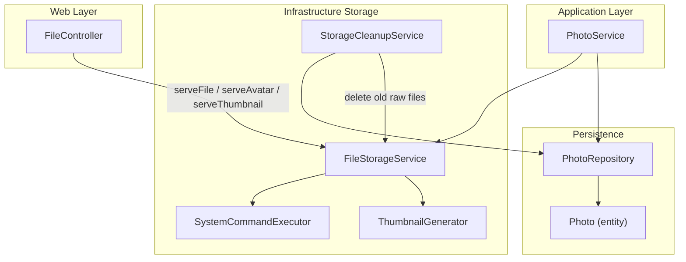
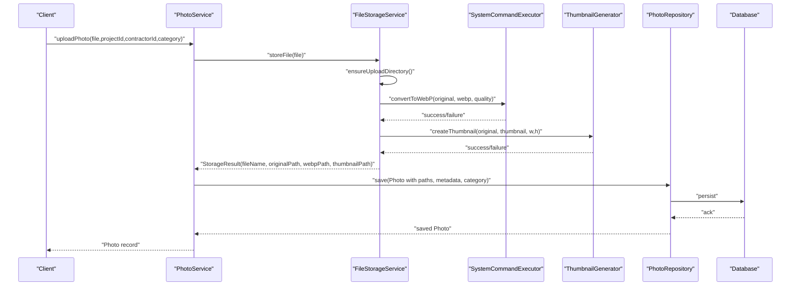
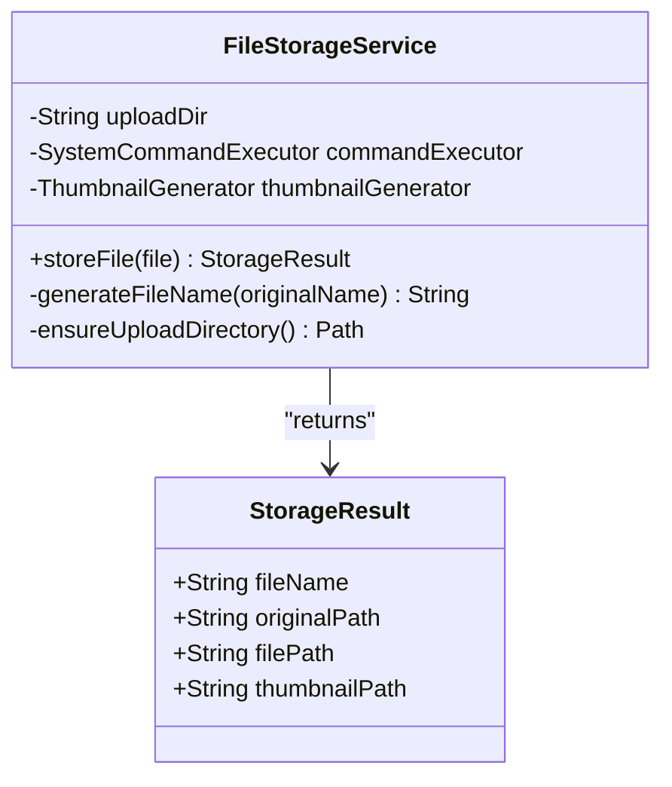
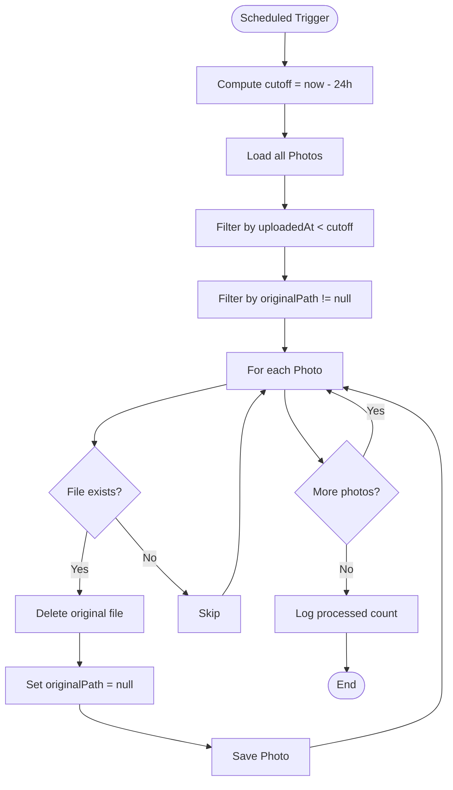
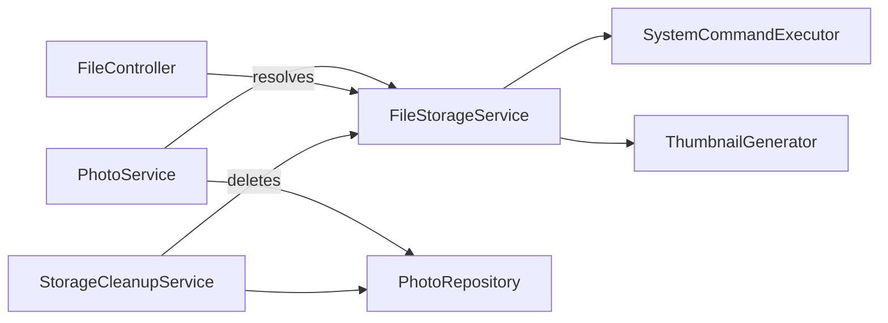

# Storage Management

<cite>
**Referenced Files in This Document**
- [FileStorageService.java](file://src/main/java/root/cyb/mh/skylink_media_service/infrastructure/storage/FileStorageService.java)
- [StorageCleanupService.java](file://src/main/java/root/cyb/mh/skylink_media_service/infrastructure/storage/StorageCleanupService.java)
- [SystemCommandExecutor.java](file://src/main/java/root/cyb/mh/skylink_media_service/infrastructure/storage/SystemCommandExecutor.java)
- [ThumbnailGenerator.java](file://src/main/java/root/cyb/mh/skylink_media_service/infrastructure/storage/ThumbnailGenerator.java)
- [Photo.java](file://src/main/java/root/cyb/mh/skylink_media_service/domain/entities/Photo.java)
- [PhotoRepository.java](file://src/main/java/root/cyb/mh/skylink_media_service/infrastructure/persistence/PhotoRepository.java)
- [PhotoService.java](file://src/main/java/root/cyb/mh/skylink_media_service/application/services/PhotoService.java)
- [FileController.java](file://src/main/java/root/cyb/mh/skylink_media_service/infrastructure/web/FileController.java)
- [application.properties](file://src/main/resources/application.properties)
- [install-webp.sh](file://install-webp.sh)
</cite>

## Table of Contents
1. [Introduction](#introduction)
2. [Project Structure](#project-structure)
3. [Core Components](#core-components)
4. [Architecture Overview](#architecture-overview)
5. [Detailed Component Analysis](#detailed-component-analysis)
6. [Dependency Analysis](#dependency-analysis)
7. [Performance Considerations](#performance-considerations)
8. [Troubleshooting Guide](#troubleshooting-guide)
9. [Conclusion](#conclusion)
10. [Appendices](#appendices)

## Introduction
This document describes the storage management system for the media service backend. It focuses on the FileStorageService architecture for file handling, organization, and retrieval; directory structure and file naming conventions; path management strategies; automated cleanup via StorageCleanupService; and operational guidance for quotas, disk monitoring, scheduling, backups, disaster recovery, access permissions, security, and integrity checks. The system converts uploaded images to WebP for efficient delivery and generates thumbnails for previews, while tracking file metadata and paths in the database.

## Project Structure
The storage subsystem resides under the infrastructure storage package and integrates with application services, persistence, and web controllers. Key elements:
- Storage services: FileStorageService, SystemCommandExecutor, ThumbnailGenerator
- Cleanup service: StorageCleanupService
- Domain and persistence: Photo entity and PhotoRepository
- Application service: PhotoService orchestrates uploads and metadata extraction
- Web layer: FileController exposes endpoints to serve files and thumbnails
- Configuration: application.properties defines upload directory and limits

**Diagram sources**
- [FileStorageService.java:18-89](file://src/main/java/root/cyb/mh/skylink_media_service/infrastructure/storage/FileStorageService.java#L18-L89)
- [SystemCommandExecutor.java:9-32](file://src/main/java/root/cyb/mh/skylink_media_service/infrastructure/storage/SystemCommandExecutor.java#L9-L32)
- [ThumbnailGenerator.java:9-42](file://src/main/java/root/cyb/mh/skylink_media_service/infrastructure/storage/ThumbnailGenerator.java#L9-L42)
- [StorageCleanupService.java:16-52](file://src/main/java/root/cyb/mh/skylink_media_service/infrastructure/storage/StorageCleanupService.java#L16-L52)
- [PhotoService.java:30-116](file://src/main/java/root/cyb/mh/skylink_media_service/application/services/PhotoService.java#L30-L116)
- [PhotoRepository.java:11-22](file://src/main/java/root/cyb/mh/skylink_media_service/infrastructure/persistence/PhotoRepository.java#L11-L22)
- [Photo.java:9-128](file://src/main/java/root/cyb/mh/skylink_media_service/domain/entities/Photo.java#L9-L128)
- [FileController.java:16-84](file://src/main/java/root/cyb/mh/skylink_media_service/infrastructure/web/FileController.java#L16-L84)

**Section sources**
- [FileStorageService.java:18-89](file://src/main/java/root/cyb/mh/skylink_media_service/infrastructure/storage/FileStorageService.java#L18-L89)
- [PhotoService.java:30-116](file://src/main/java/root/cyb/mh/skylink_media_service/application/services/PhotoService.java#L30-L116)
- [PhotoRepository.java:11-22](file://src/main/java/root/cyb/mh/skylink_media_service/infrastructure/persistence/PhotoRepository.java#L11-L22)
- [Photo.java:9-128](file://src/main/java/root/cyb/mh/skylink_media_service/domain/entities/Photo.java#L9-L128)
- [FileController.java:16-84](file://src/main/java/root/cyb/mh/skylink_media_service/infrastructure/web/FileController.java#L16-L84)
- [application.properties:12-16](file://src/main/resources/application.properties#L12-L16)

## Core Components
- FileStorageService: Handles file upload, directory creation, original file preservation, WebP conversion, and thumbnail generation. Returns a StorageResult containing logical names and physical paths for the original, WebP, and thumbnail files.
- SystemCommandExecutor: Executes external cwebp commands to convert images to WebP with metadata preservation and configurable quality.
- ThumbnailGenerator: Generates WebP thumbnails using cwebp with fixed resize and quality parameters.
- PhotoService: Coordinates upload flow, extracts image metadata, persists Photo records with file paths, and marks optimization as completed.
- Photo entity and repository: Persist file metadata, paths, categories, and timestamps; support queries by project and contractor.
- FileController: Serves uploaded files and thumbnails via HTTP endpoints with appropriate content types and cache controls.
- StorageCleanupService: Periodically removes old raw images after 24 hours and clears stale original paths from the database.

**Section sources**
- [FileStorageService.java:33-55](file://src/main/java/root/cyb/mh/skylink_media_service/infrastructure/storage/FileStorageService.java#L33-L55)
- [SystemCommandExecutor.java:11-30](file://src/main/java/root/cyb/mh/skylink_media_service/infrastructure/storage/SystemCommandExecutor.java#L11-L30)
- [ThumbnailGenerator.java:17-40](file://src/main/java/root/cyb/mh/skylink_media_service/infrastructure/storage/ThumbnailGenerator.java#L17-L40)
- [PhotoService.java:46-98](file://src/main/java/root/cyb/mh/skylink_media_service/application/services/PhotoService.java#L46-L98)
- [Photo.java:14-65](file://src/main/java/root/cyb/mh/skylink_media_service/domain/entities/Photo.java#L14-L65)
- [PhotoRepository.java:11-22](file://src/main/java/root/cyb/mh/skylink_media_service/infrastructure/persistence/PhotoRepository.java#L11-L22)
- [FileController.java:21-83](file://src/main/java/root/cyb/mh/skylink_media_service/infrastructure/web/FileController.java#L21-L83)
- [StorageCleanupService.java:26-50](file://src/main/java/root/cyb/mh/skylink_media_service/infrastructure/storage/StorageCleanupService.java#L26-L50)

## Architecture Overview
The storage pipeline transforms uploaded images into optimized assets and serves them efficiently:
- Upload flow: PhotoService receives MultipartFile, delegates to FileStorageService, and persists metadata.
- Optimization: FileStorageService preserves the original, converts to WebP, and generates a thumbnail using cwebp.
- Serving: FileController resolves physical paths from the configured upload directory and serves files with appropriate headers.
- Cleanup: StorageCleanupService periodically prunes old raw images and updates the database.

**Diagram sources**
- [PhotoService.java:46-98](file://src/main/java/root/cyb/mh/skylink_media_service/application/services/PhotoService.java#L46-L98)
- [FileStorageService.java:33-55](file://src/main/java/root/cyb/mh/skylink_media_service/infrastructure/storage/FileStorageService.java#L33-L55)
- [SystemCommandExecutor.java:11-30](file://src/main/java/root/cyb/mh/skylink_media_service/infrastructure/storage/SystemCommandExecutor.java#L11-L30)
- [ThumbnailGenerator.java:17-40](file://src/main/java/root/cyb/mh/skylink_media_service/infrastructure/storage/ThumbnailGenerator.java#L17-L40)
- [PhotoRepository.java:11-22](file://src/main/java/root/cyb/mh/skylink_media_service/infrastructure/persistence/PhotoRepository.java#L11-L22)

## Detailed Component Analysis

### FileStorageService
Responsibilities:
- Ensures the upload directory exists and is writable.
- Generates a unique filename combining timestamp, UUID substring, and original name.
- Preserves the original file to maintain EXIF metadata.
- Converts the original to WebP using SystemCommandExecutor with quality and metadata preservation.
- Generates a thumbnail using ThumbnailGenerator.
- Returns a StorageResult encapsulating logical and physical paths.

Key behaviors:
- Directory management: Creates upload directory if missing.
- Naming convention: Timestamp_UuidShort_original.ext.
- Path management: Stores absolute paths for original, WebP, and thumbnail files.
- Error handling: Propagates IO exceptions from file operations and cwebp failures.

**Diagram sources**
- [FileStorageService.java:18-89](file://src/main/java/root/cyb/mh/skylink_media_service/infrastructure/storage/FileStorageService.java#L18-L89)

**Section sources**
- [FileStorageService.java:22-68](file://src/main/java/root/cyb/mh/skylink_media_service/infrastructure/storage/FileStorageService.java#L22-L68)
- [FileStorageService.java:70-87](file://src/main/java/root/cyb/mh/skylink_media_service/infrastructure/storage/FileStorageService.java#L70-L87)

### SystemCommandExecutor
Responsibilities:
- Invokes cwebp with quality and metadata flags for WebP conversion.
- Waits for process completion and translates non-zero exit codes into exceptions.
- Interrupt handling ensures thread interruption is preserved.

Operational notes:
- Requires cwebp to be installed and available on PATH.
- Logs errors and aborts on failure.

**Section sources**
- [SystemCommandExecutor.java:11-30](file://src/main/java/root/cyb/mh/skylink_media_service/infrastructure/storage/SystemCommandExecutor.java#L11-L30)

### ThumbnailGenerator
Responsibilities:
- Resizes input to thumbnail dimensions and writes a WebP thumbnail.
- Captures and surfaces stderr for diagnostics on failure.
- Uses a fixed quality parameter for consistent thumbnail size.

**Section sources**
- [ThumbnailGenerator.java:17-40](file://src/main/java/root/cyb/mh/skylink_media_service/infrastructure/storage/ThumbnailGenerator.java#L17-L40)

### PhotoService
Responsibilities:
- Validates inputs and loads associated Project and Contractor.
- Delegates file storage to FileStorageService.
- Extracts image metadata using a metadata reader and stores JSON.
- Persists Photo with paths, optimization flags, category, and timestamps.

**Section sources**
- [PhotoService.java:46-98](file://src/main/java/root/cyb/mh/skylink_media_service/application/services/PhotoService.java#L46-L98)

### Photo Entity and Repository
Data model:
- Tracks logical and physical paths for original, WebP, and thumbnail files.
- Stores optimization status, timestamps, metadata JSON, category, and associations to Project and Contractor.
- Provides JPA repository methods for querying by project, contractor, and composite filters.

**Section sources**
- [Photo.java:14-65](file://src/main/java/root/cyb/mh/skylink_media_service/domain/entities/Photo.java#L14-L65)
- [PhotoRepository.java:11-22](file://src/main/java/root/cyb/mh/skylink_media_service/infrastructure/persistence/PhotoRepository.java#L11-L22)

### FileController
Responsibilities:
- Serves files from the configured upload directory with appropriate content types.
- Serves avatars from a dedicated subdirectory.
- Serves thumbnails with explicit WebP content type.
- Applies cache-control headers to prevent browser caching of dynamic assets.

**Section sources**
- [FileController.java:21-83](file://src/main/java/root/cyb/mh/skylink_media_service/infrastructure/web/FileController.java#L21-L83)

### StorageCleanupService
Responsibilities:
- Runs on a fixed schedule (hourly) to remove raw images older than 24 hours.
- Iterates all photos, identifies those with originalPath and uploadedAt older than threshold, deletes the file, and clears the originalPath in the database.

**Diagram sources**
- [StorageCleanupService.java:26-50](file://src/main/java/root/cyb/mh/skylink_media_service/infrastructure/storage/StorageCleanupService.java#L26-L50)

**Section sources**
- [StorageCleanupService.java:26-50](file://src/main/java/root/cyb/mh/skylink_media_service/infrastructure/storage/StorageCleanupService.java#L26-L50)

## Dependency Analysis
- FileStorageService depends on SystemCommandExecutor and ThumbnailGenerator for asset conversion and thumbnail generation.
- PhotoService depends on FileStorageService and PhotoRepository to orchestrate uploads and persist metadata.
- FileController depends on the configured upload directory to resolve and serve files.
- StorageCleanupService depends on PhotoRepository to discover orphaned raw files and update the database.

**Diagram sources**
- [PhotoService.java:44-44](file://src/main/java/root/cyb/mh/skylink_media_service/application/services/PhotoService.java#L44-L44)
- [FileStorageService.java:25-31](file://src/main/java/root/cyb/mh/skylink_media_service/infrastructure/storage/FileStorageService.java#L25-L31)
- [SystemCommandExecutor.java:9-32](file://src/main/java/root/cyb/mh/skylink_media_service/infrastructure/storage/SystemCommandExecutor.java#L9-L32)
- [ThumbnailGenerator.java:9-42](file://src/main/java/root/cyb/mh/skylink_media_service/infrastructure/storage/ThumbnailGenerator.java#L9-L42)
- [PhotoRepository.java:11-22](file://src/main/java/root/cyb/mh/skylink_media_service/infrastructure/persistence/PhotoRepository.java#L11-L22)
- [FileController.java:18-19](file://src/main/java/root/cyb/mh/skylink_media_service/infrastructure/web/FileController.java#L18-L19)
- [StorageCleanupService.java:20-24](file://src/main/java/root/cyb/mh/skylink_media_service/infrastructure/storage/StorageCleanupService.java#L20-L24)

**Section sources**
- [PhotoService.java:44-44](file://src/main/java/root/cyb/mh/skylink_media_service/application/services/PhotoService.java#L44-L44)
- [FileStorageService.java:25-31](file://src/main/java/root/cyb/mh/skylink_media_service/infrastructure/storage/FileStorageService.java#L25-L31)
- [PhotoRepository.java:11-22](file://src/main/java/root/cyb/mh/skylink_media_service/infrastructure/persistence/PhotoRepository.java#L11-L22)
- [FileController.java:18-19](file://src/main/java/root/cyb/mh/skylink_media_service/infrastructure/web/FileController.java#L18-L19)
- [StorageCleanupService.java:20-24](file://src/main/java/root/cyb/mh/skylink_media_service/infrastructure/storage/StorageCleanupService.java#L20-L24)

## Performance Considerations
- WebP conversion and thumbnail generation rely on external cwebp. Ensure sufficient CPU and I/O capacity for concurrent conversions.
- ThumbnailGenerator uses a fixed quality; tune quality and dimensions to balance fidelity and size.
- FileStorageService preserves originals to maintain EXIF; this increases storage usage. Consider retention policies and cleanup schedules.
- PhotoService extracts metadata; metadata extraction adds latency. Consider async processing for large batches.
- FileController serves files directly from disk; ensure the upload directory is on fast storage and accessible to the application process.

[No sources needed since this section provides general guidance]

## Troubleshooting Guide
Common issues and resolutions:
- cwebp not found or failing:
  - Install WebP tools using the provided installation script and verify cwebp availability on PATH.
  - Confirm SystemCommandExecutor logs indicate non-zero exit codes and review error output captured during thumbnail generation.
- Disk space exhaustion:
  - Monitor the upload directory and configure cleanup schedules. Use StorageCleanupService to remove old raw images after 24 hours.
  - Implement quotas at the filesystem level and alert on thresholds.
- Files not served:
  - Verify app.upload.dir in application.properties matches the actual upload directory.
  - Ensure FileController routes resolve to existing files and that the application process has read permissions.
- Orphaned files:
  - StorageCleanupService removes old raw images; confirm it runs hourly and that Photo records are updated to clear stale originalPath.
- Metadata extraction failures:
  - PhotoService logs warnings when metadata extraction fails; verify image formats and external metadata libraries.

**Section sources**
- [install-webp.sh:1-40](file://install-webp.sh#L1-L40)
- [SystemCommandExecutor.java:23-29](file://src/main/java/root/cyb/mh/skylink_media_service/infrastructure/storage/SystemCommandExecutor.java#L23-L29)
- [ThumbnailGenerator.java:32-35](file://src/main/java/root/cyb/mh/skylink_media_service/infrastructure/storage/ThumbnailGenerator.java#L32-L35)
- [application.properties:12-16](file://src/main/resources/application.properties#L12-L16)
- [FileController.java:21-43](file://src/main/java/root/cyb/mh/skylink_media_service/infrastructure/web/FileController.java#L21-L43)
- [StorageCleanupService.java:26-50](file://src/main/java/root/cyb/mh/skylink_media_service/infrastructure/storage/StorageCleanupService.java#L26-L50)
- [PhotoService.java:79-81](file://src/main/java/root/cyb/mh/skylink_media_service/application/services/PhotoService.java#L79-L81)

## Conclusion
The storage management system combines Spring-managed services with external cwebp tools to deliver optimized image assets. It preserves originals for metadata fidelity, converts to WebP for efficient delivery, and generates thumbnails for previews. Persistence tracks file paths and metadata, while cleanup services remove stale raw images. Operational practices around quotas, monitoring, scheduling, and backups are essential for reliable, secure, and high-performance operation.

[No sources needed since this section summarizes without analyzing specific files]

## Appendices

### Directory Structure and File Naming Conventions
- Upload directory: Configured via app.upload.dir with default "uploads".
- File naming: timestamp_uuid_short_original.ext to avoid collisions and preserve original names.
- Thumbnail naming: thumb_webp_filename.webp.
- Serving paths:
  - /uploads/{filename} for original and WebP files.
  - /uploads/avatars/{filename} for avatar images.
  - /thumbnails/{filename} for thumbnails.

**Section sources**
- [application.properties:15-15](file://src/main/resources/application.properties#L15-L15)
- [FileStorageService.java:57-60](file://src/main/java/root/cyb/mh/skylink_media_service/infrastructure/storage/FileStorageService.java#L57-L60)
- [FileController.java:21-83](file://src/main/java/root/cyb/mh/skylink_media_service/infrastructure/web/FileController.java#L21-L83)

### Path Management Strategies
- Absolute paths are stored in the Photo entity for original, WebP, and thumbnail files.
- FileStorageService ensures the upload directory exists before writing.
- Cleanup service removes files and clears originalPath in the database to prevent dangling references.

**Section sources**
- [Photo.java:26-27](file://src/main/java/root/cyb/mh/skylink_media_service/domain/entities/Photo.java#L26-L27)
- [Photo.java:20-24](file://src/main/java/root/cyb/mh/skylink_media_service/domain/entities/Photo.java#L20-L24)
- [FileStorageService.java:62-68](file://src/main/java/root/cyb/mh/skylink_media_service/infrastructure/storage/FileStorageService.java#L62-L68)
- [StorageCleanupService.java:37-47](file://src/main/java/root/cyb/mh/skylink_media_service/infrastructure/storage/StorageCleanupService.java#L37-L47)

### Storage Quota Management and Disk Monitoring
- Implement filesystem quotas at the OS level for the upload directory.
- Monitor disk usage via system tools and integrate alerts when thresholds are exceeded.
- Use StorageCleanupService to reduce retained raw images and reclaim space.

[No sources needed since this section provides general guidance]

### Cleanup Scheduling
- StorageCleanupService runs hourly and removes raw images older than 24 hours.
- Adjust fixedRate in the scheduler to match operational needs.

**Section sources**
- [StorageCleanupService.java:26-26](file://src/main/java/root/cyb/mh/skylink_media_service/infrastructure/storage/StorageCleanupService.java#L26-L26)

### Backup and Disaster Recovery
- Back up the upload directory regularly to offsite storage.
- Back up the database containing Photo records to preserve metadata and file references.
- Test restore procedures to ensure both file and database consistency.

[No sources needed since this section provides general guidance]

### File Access Permissions and Security Measures
- Restrict write access to the upload directory to the application process only.
- Serve files with cache-control headers to prevent unintended caching.
- Validate and sanitize filenames to avoid path traversal risks.
- Store sensitive configuration (e.g., app.upload.dir) securely and avoid committing secrets to source control.

**Section sources**
- [FileController.java:30-36](file://src/main/java/root/cyb/mh/skylink_media_service/infrastructure/web/FileController.java#L30-L36)
- [application.properties:15-15](file://src/main/resources/application.properties#L15-L15)

### Data Integrity Checks
- Verify WebP conversion exit codes and capture stderr for diagnostics.
- Validate file existence before serving and log not-found responses.
- Periodically reconcile database paths with actual files to detect mismatches.

**Section sources**
- [SystemCommandExecutor.java:23-29](file://src/main/java/root/cyb/mh/skylink_media_service/infrastructure/storage/SystemCommandExecutor.java#L23-L29)
- [ThumbnailGenerator.java:32-35](file://src/main/java/root/cyb/mh/skylink_media_service/infrastructure/storage/ThumbnailGenerator.java#L32-L35)
- [FileController.java:26-42](file://src/main/java/root/cyb/mh/skylink_media_service/infrastructure/web/FileController.java#L26-L42)

### Examples: Storage Configuration and Maintenance
- Configure upload directory and file size limits in application.properties.
- Install WebP tools using the provided script to enable cwebp-based conversion.
- Monitor logs from FileStorageService and StorageCleanupService for errors and progress.

**Section sources**
- [application.properties:12-16](file://src/main/resources/application.properties#L12-L16)
- [install-webp.sh:1-40](file://install-webp.sh#L1-L40)
- [FileStorageService.java:37-52](file://src/main/java/root/cyb/mh/skylink_media_service/infrastructure/storage/FileStorageService.java#L37-L52)
- [StorageCleanupService.java:28-49](file://src/main/java/root/cyb/mh/skylink_media_service/infrastructure/storage/StorageCleanupService.java#L28-L49)