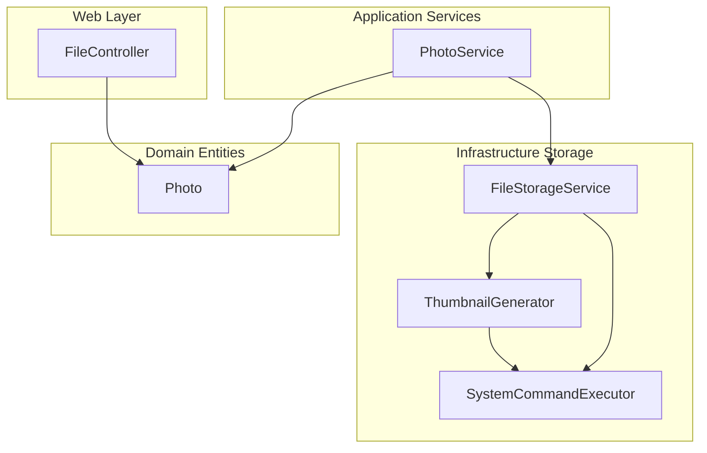
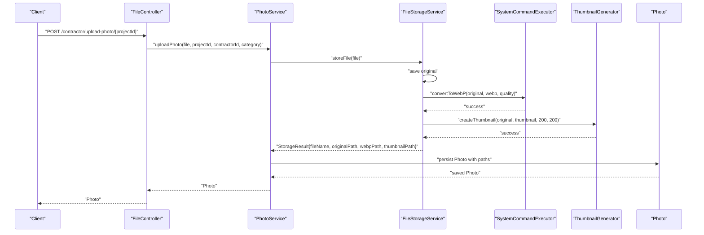
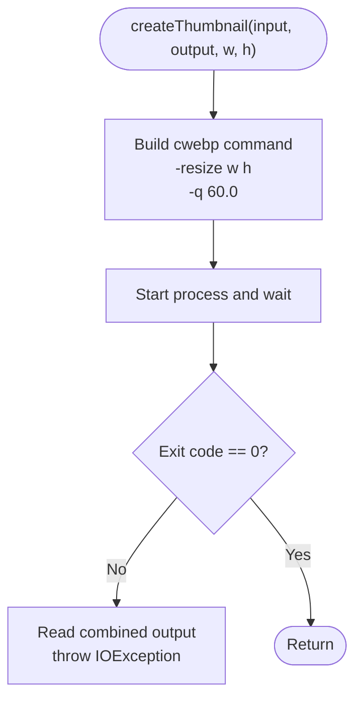
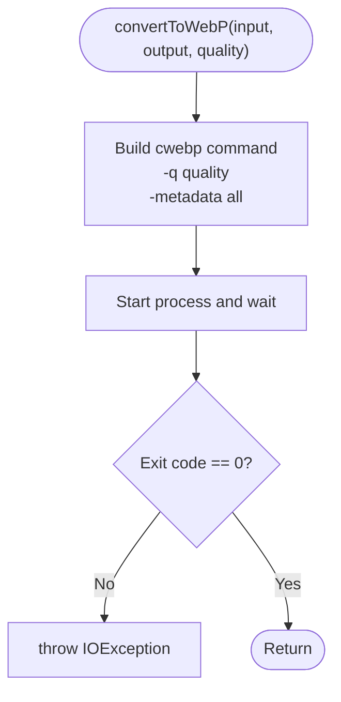
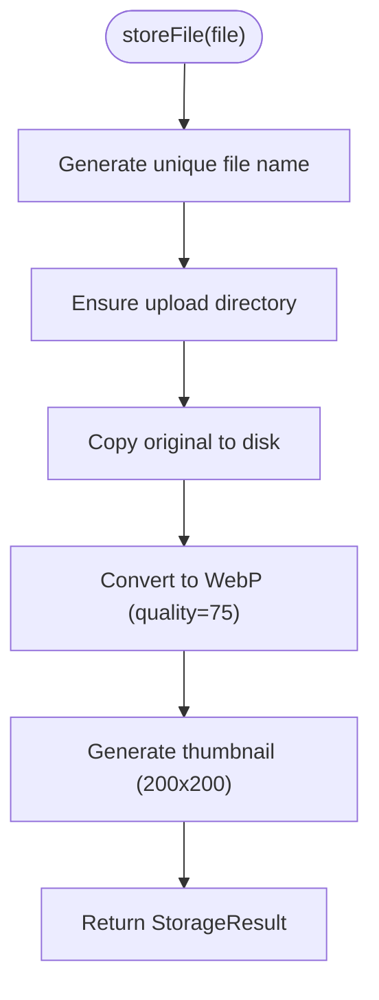
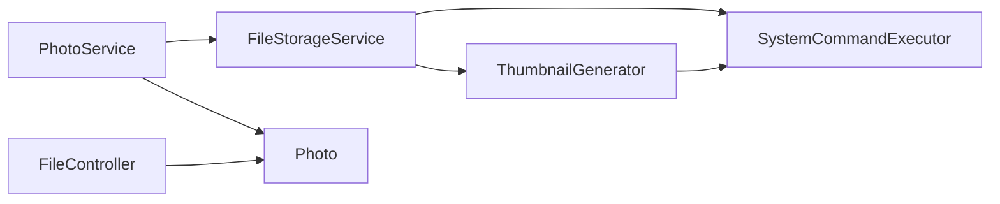

# Thumbnail Generation

<cite>
**Referenced Files in This Document**
- [ThumbnailGenerator.java](file://src/main/java/root/cyb/mh/skylink_media_service/infrastructure/storage/ThumbnailGenerator.java)
- [SystemCommandExecutor.java](file://src/main/java/root/cyb/mh/skylink_media_service/infrastructure/storage/SystemCommandExecutor.java)
- [FileStorageService.java](file://src/main/java/root/cyb/mh/skylink_media_service/infrastructure/storage/FileStorageService.java)
- [PhotoService.java](file://src/main/java/root/cyb/mh/skylink_media_service/application/services/PhotoService.java)
- [Photo.java](file://src/main/java/root/cyb/mh/skylink_media_service/domain/entities/Photo.java)
- [FileController.java](file://src/main/java/root/cyb/mh/skylink_media_service/infrastructure/web/FileController.java)
- [application.properties](file://src/main/resources/application.properties)
- [install-webp.sh](file://install-webp.sh)
- [README.md](file://README.md)
</cite>

## Table of Contents
1. [Introduction](#introduction)
2. [Project Structure](#project-structure)
3. [Core Components](#core-components)
4. [Architecture Overview](#architecture-overview)
5. [Detailed Component Analysis](#detailed-component-analysis)
6. [Dependency Analysis](#dependency-analysis)
7. [Performance Considerations](#performance-considerations)
8. [Troubleshooting Guide](#troubleshooting-guide)
9. [Conclusion](#conclusion)

## Introduction
This document explains the thumbnail generation system used by the media service to optimize uploaded images. It focuses on how thumbnails are created, scaled, and served, along with configuration options, supported formats, and operational considerations for high-volume scenarios.

The system converts uploaded images to WebP for efficient delivery, generates a thumbnail sized to 200x200 pixels, and serves both the optimized image and thumbnail via dedicated endpoints.

## Project Structure
The thumbnail generation pipeline spans several layers:
- Infrastructure storage: image conversion and thumbnail generation
- Application services: orchestration of upload and metadata extraction
- Domain entities: persistence of image metadata and paths
- Web layer: serving of original, WebP, and thumbnail assets
- Configuration: upload directories and limits

**Diagram sources**
- [FileStorageService.java:33-55](file://src/main/java/root/cyb/mh/skylink_media_service/infrastructure/storage/FileStorageService.java#L33-L55)
- [ThumbnailGenerator.java:17-40](file://src/main/java/root/cyb/mh/skylink_media_service/infrastructure/storage/ThumbnailGenerator.java#L17-L40)
- [SystemCommandExecutor.java:11-30](file://src/main/java/root/cyb/mh/skylink_media_service/infrastructure/storage/SystemCommandExecutor.java#L11-L30)
- [PhotoService.java:46-98](file://src/main/java/root/cyb/mh/skylink_media_service/application/services/PhotoService.java#L46-L98)
- [Photo.java:14-45](file://src/main/java/root/cyb/mh/skylink_media_service/domain/entities/Photo.java#L14-L45)
- [FileController.java:21-83](file://src/main/java/root/cyb/mh/skylink_media_service/infrastructure/web/FileController.java#L21-L83)

**Section sources**
- [README.md:20-25](file://README.md#L20-L25)
- [application.properties:12-15](file://src/main/resources/application.properties#L12-L15)

## Core Components
- ThumbnailGenerator: executes the WebP tool to resize and encode thumbnails.
- SystemCommandExecutor: runs cwebp for WebP conversion and metadata preservation.
- FileStorageService: orchestrates saving originals, converting to WebP, generating thumbnails, and returning storage results.
- PhotoService: coordinates upload, metadata extraction, and persistence of image records.
- Photo entity: stores file paths for original, WebP, and thumbnail assets.
- FileController: serves uploaded and thumbnail files with appropriate content types.

Key configuration highlights:
- Upload directory configured via application properties.
- Maximum file and request sizes for uploads.
- WebP quality setting for UI rendering.
- Thumbnail dimensions set to 200x200 pixels.

**Section sources**
- [ThumbnailGenerator.java:17-40](file://src/main/java/root/cyb/mh/skylink_media_service/infrastructure/storage/ThumbnailGenerator.java#L17-L40)
- [SystemCommandExecutor.java:11-30](file://src/main/java/root/cyb/mh/skylink_media_service/infrastructure/storage/SystemCommandExecutor.java#L11-L30)
- [FileStorageService.java:33-55](file://src/main/java/root/cyb/mh/skylink_media_service/infrastructure/storage/FileStorageService.java#L33-L55)
- [PhotoService.java:46-98](file://src/main/java/root/cyb/mh/skylink_media_service/application/services/PhotoService.java#L46-L98)
- [Photo.java:14-45](file://src/main/java/root/cyb/mh/skylink_media_service/domain/entities/Photo.java#L14-L45)
- [application.properties:12-15](file://src/main/resources/application.properties#L12-L15)

## Architecture Overview
The thumbnail generation pipeline follows a deterministic flow:
1. Upload request is received and validated.
2. Original file is saved to disk.
3. Original is converted to WebP with quality tuning.
4. A thumbnail is generated from the original using a fixed size.
5. Paths to WebP and thumbnail are persisted in the Photo record.
6. Assets are served via dedicated endpoints.

**Diagram sources**
- [PhotoService.java:46-98](file://src/main/java/root/cyb/mh/skylink_media_service/application/services/PhotoService.java#L46-L98)
- [FileStorageService.java:33-55](file://src/main/java/root/cyb/mh/skylink_media_service/infrastructure/storage/FileStorageService.java#L33-L55)
- [SystemCommandExecutor.java:11-30](file://src/main/java/root/cyb/mh/skylink_media_service/infrastructure/storage/SystemCommandExecutor.java#L11-L30)
- [ThumbnailGenerator.java:17-40](file://src/main/java/root/cyb/mh/skylink_media_service/infrastructure/storage/ThumbnailGenerator.java#L17-L40)
- [Photo.java:14-45](file://src/main/java/root/cyb/mh/skylink_media_service/domain/entities/Photo.java#L14-L45)

## Detailed Component Analysis

### ThumbnailGenerator
Responsibilities:
- Invokes the WebP tool to resize an image to specified dimensions and encode it as WebP.
- Handles process lifecycle, exit codes, and error propagation.

Behavior:
- Uses a fixed quality setting for thumbnail encoding.
- Resizing is performed to fit within the target dimensions while preserving aspect ratio implicitly by the tool’s behavior.
- Errors are captured and rethrown as I/O exceptions with diagnostic information.

**Diagram sources**
- [ThumbnailGenerator.java:17-40](file://src/main/java/root/cyb/mh/skylink_media_service/infrastructure/storage/ThumbnailGenerator.java#L17-L40)

**Section sources**
- [ThumbnailGenerator.java:17-40](file://src/main/java/root/cyb/mh/skylink_media_service/infrastructure/storage/ThumbnailGenerator.java#L17-L40)

### SystemCommandExecutor
Responsibilities:
- Executes WebP conversion for the original image to produce a WebP asset suitable for UI rendering.
- Preserves metadata during conversion.

Behavior:
- Accepts a quality parameter for the WebP encoder.
- Throws on non-zero exit codes.

**Diagram sources**
- [SystemCommandExecutor.java:11-30](file://src/main/java/root/cyb/mh/skylink_media_service/infrastructure/storage/SystemCommandExecutor.java#L11-L30)

**Section sources**
- [SystemCommandExecutor.java:11-30](file://src/main/java/root/cyb/mh/skylink_media_service/infrastructure/storage/SystemCommandExecutor.java#L11-L30)

### FileStorageService
Responsibilities:
- Manages file storage lifecycle for uploads.
- Converts originals to WebP and generates thumbnails.
- Returns a structured result containing file names and paths.

Behavior:
- Saves the original file to preserve EXIF metadata.
- Generates a WebP file with a configurable quality.
- Produces a thumbnail from the original at a fixed size.
- Ensures the upload directory exists.

**Diagram sources**
- [FileStorageService.java:33-55](file://src/main/java/root/cyb/mh/skylink_media_service/infrastructure/storage/FileStorageService.java#L33-L55)

**Section sources**
- [FileStorageService.java:33-55](file://src/main/java/root/cyb/mh/skylink_media_service/infrastructure/storage/FileStorageService.java#L33-L55)

### PhotoService
Responsibilities:
- Coordinates the upload workflow, including metadata extraction.
- Persists the Photo entity with paths to original, WebP, and thumbnail assets.
- Marks the image as optimized and sets timestamps and status.

Behavior:
- Reads metadata from the uploaded file stream.
- Saves the Photo record with optimization flags and category.

**Section sources**
- [PhotoService.java:46-98](file://src/main/java/root/cyb/mh/skylink_media_service/application/services/PhotoService.java#L46-L98)

### Photo Entity
Responsibilities:
- Stores file paths for original, WebP, and thumbnail assets.
- Tracks optimization state and metadata.

Fields relevant to thumbnails:
- originalPath: path to the preserved original.
- webpPath: path to the WebP asset.
- thumbnailPath: path to the thumbnail.

**Section sources**
- [Photo.java:14-45](file://src/main/java/root/cyb/mh/skylink_media_service/domain/entities/Photo.java#L14-L45)

### FileController
Responsibilities:
- Serves uploaded files and thumbnails.
- Sets appropriate content types for WebP and other formats.

Behavior:
- Serves files from the configured upload directory.
- Serves thumbnails with the correct content type.

**Section sources**
- [FileController.java:21-83](file://src/main/java/root/cyb/mh/skylink_media_service/infrastructure/web/FileController.java#L21-L83)

## Dependency Analysis
The thumbnail generation system relies on external tools and internal components:

- ThumbnailGenerator depends on SystemCommandExecutor for process execution.
- FileStorageService composes SystemCommandExecutor and ThumbnailGenerator.
- PhotoService persists paths produced by FileStorageService.
- FileController reads files from disk using configured paths.

**Diagram sources**
- [PhotoService.java:46-98](file://src/main/java/root/cyb/mh/skylink_media_service/application/services/PhotoService.java#L46-L98)
- [FileStorageService.java:25-31](file://src/main/java/root/cyb/mh/skylink_media_service/infrastructure/storage/FileStorageService.java#L25-L31)
- [ThumbnailGenerator.java:11-15](file://src/main/java/root/cyb/mh/skylink_media_service/infrastructure/storage/ThumbnailGenerator.java#L11-L15)
- [SystemCommandExecutor.java:11-18](file://src/main/java/root/cyb/mh/skylink_media_service/infrastructure/storage/SystemCommandExecutor.java#L11-L18)
- [Photo.java:14-45](file://src/main/java/root/cyb/mh/skylink_media_service/domain/entities/Photo.java#L14-L45)
- [FileController.java:21-83](file://src/main/java/root/cyb/mh/skylink_media_service/infrastructure/web/FileController.java#L21-L83)

**Section sources**
- [PhotoService.java:46-98](file://src/main/java/root/cyb/mh/skylink_media_service/application/services/PhotoService.java#L46-L98)
- [FileStorageService.java:25-31](file://src/main/java/root/cyb/mh/skylink_media_service/infrastructure/storage/FileStorageService.java#L25-L31)
- [ThumbnailGenerator.java:11-15](file://src/main/java/root/cyb/mh/skylink_media_service/infrastructure/storage/ThumbnailGenerator.java#L11-L15)
- [SystemCommandExecutor.java:11-18](file://src/main/java/root/cyb/mh/skylink_media_service/infrastructure/storage/SystemCommandExecutor.java#L11-L18)
- [Photo.java:14-45](file://src/main/java/root/cyb/mh/skylink_media_service/domain/entities/Photo.java#L14-L45)
- [FileController.java:21-83](file://src/main/java/root/cyb/mh/skylink_media_service/infrastructure/web/FileController.java#L21-L83)

## Performance Considerations
- External tool dependency: The system spawns the WebP tool for each conversion. This introduces process overhead and requires the tool to be installed and available on the host.
- Fixed thumbnail size: Using a constant 200x200 dimension simplifies caching and reduces variability in processing time.
- Quality settings: Separate quality controls exist for WebP conversion and thumbnail generation. Tuning these can balance file size and visual fidelity.
- Batch processing: The current implementation processes uploads synchronously. For high-volume scenarios, consider asynchronous processing with queues and worker pools.
- Memory management: Large images can increase memory usage during conversion. Monitor heap usage and consider streaming or chunked processing if needed.
- Disk I/O: Converting and resizing occur on disk. Ensure sufficient disk throughput and consider SSD-backed storage for improved performance.
- Caching: Serve thumbnails and WebP assets with appropriate cache headers to reduce repeated conversions.

[No sources needed since this section provides general guidance]

## Troubleshooting Guide
Common issues and resolutions:
- WebP tool not installed: Ensure cwebp is installed and discoverable in PATH. Use the provided installation script for convenience.
- Conversion failures: Non-zero exit codes trigger exceptions. Review logs for the tool’s error output.
- Thumbnail generation errors: The generator captures and surfaces tool output for diagnostics.
- File serving problems: Verify upload directory configuration and file permissions.

Operational checks:
- Confirm the upload directory exists and is writable.
- Validate that the WebP tool is accessible and functional.
- Inspect logs for detailed error messages from the conversion processes.

**Section sources**
- [install-webp.sh:1-40](file://install-webp.sh#L1-L40)
- [SystemCommandExecutor.java:20-29](file://src/main/java/root/cyb/mh/skylink_media_service/infrastructure/storage/SystemCommandExecutor.java#L20-L29)
- [ThumbnailGenerator.java:29-39](file://src/main/java/root/cyb/mh/skylink_media_service/infrastructure/storage/ThumbnailGenerator.java#L29-L39)
- [application.properties:12-15](file://src/main/resources/application.properties#L12-L15)

## Conclusion
The thumbnail generation system integrates external WebP tooling with internal orchestration to deliver optimized images and thumbnails. It preserves original metadata, produces WebP assets for efficient delivery, and creates fixed-size thumbnails for list views. For high-volume workloads, consider asynchronous processing and caching strategies to improve throughput and reduce latency.

[No sources needed since this section summarizes without analyzing specific files]