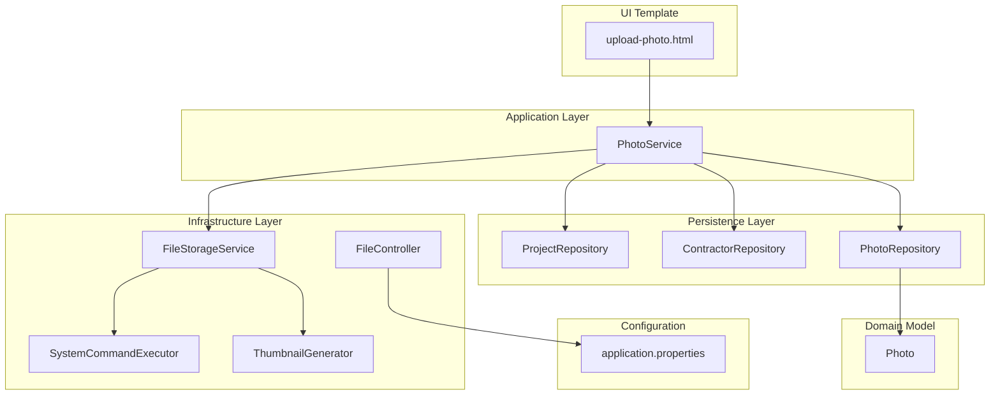
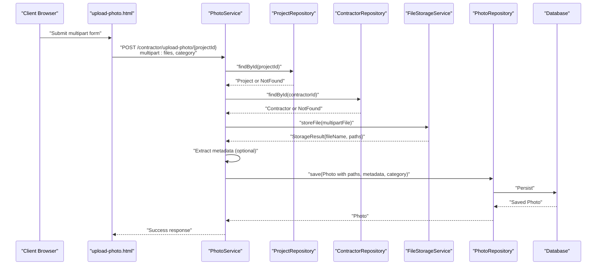
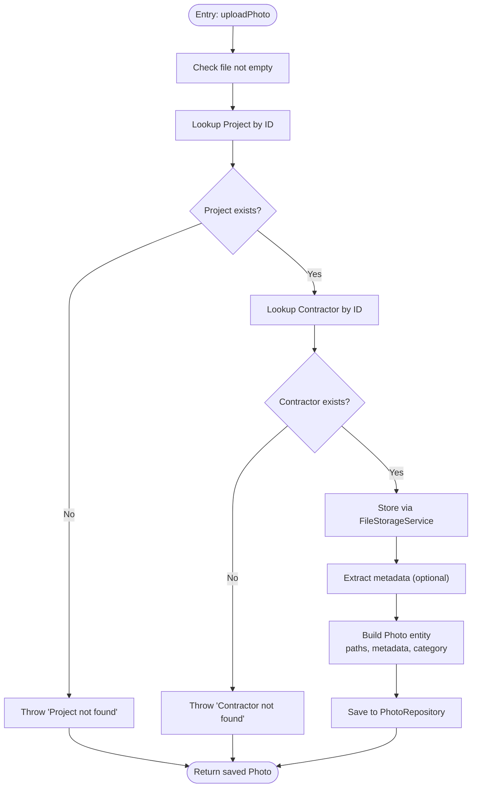
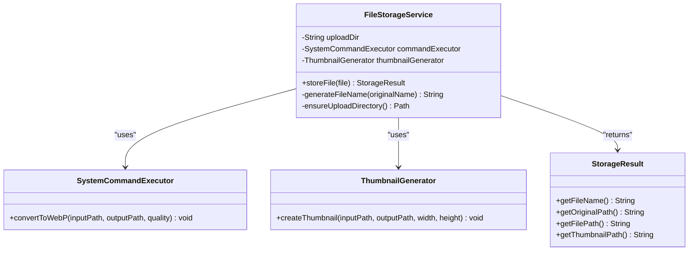
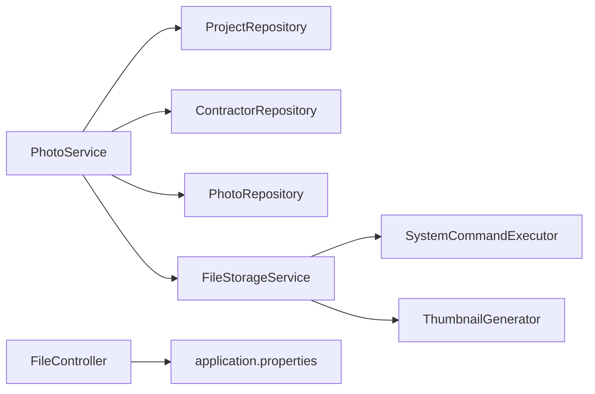
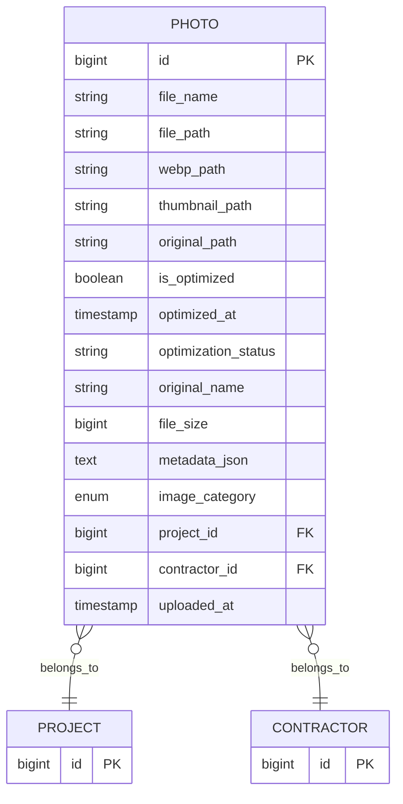

# Upload Workflow

<cite>
**Referenced Files in This Document**
- [PhotoService.java](file://src/main/java/root/cyb/mh/skylink_media_service/application/services/PhotoService.java)
- [FileStorageService.java](file://src/main/java/root/cyb/mh/skylink_media_service/infrastructure/storage/FileStorageService.java)
- [SystemCommandExecutor.java](file://src/main/java/root/cyb/mh/skylink_media_service/infrastructure/storage/SystemCommandExecutor.java)
- [ThumbnailGenerator.java](file://src/main/java/root/cyb/mh/skylink_media_service/infrastructure/storage/ThumbnailGenerator.java)
- [Photo.java](file://src/main/java/root/cyb/mh/skylink_media_service/domain/entities/Photo.java)
- [PhotoRepository.java](file://src/main/java/root/cyb/mh/skylink_media_service/infrastructure/persistence/PhotoRepository.java)
- [ProjectRepository.java](file://src/main/java/root/cyb/mh/skylink_media_service/infrastructure/persistence/ProjectRepository.java)
- [ContractorRepository.java](file://src/main/java/root/cyb/mh/skylink_media_service/infrastructure/persistence/ContractorRepository.java)
- [application.properties](file://src/main/resources/application.properties)
- [upload-photo.html](file://src/main/resources/templates/contractor/upload-photo.html)
- [FileController.java](file://src/main/java/root/cyb/mh/skylink_media_service/infrastructure/web/FileController.java)
- [ImageCategory.java](file://src/main/java/root/cyb/mh/skylink_media_service/domain/valueobjects/ImageCategory.java)
</cite>

## Table of Contents
1. [Introduction](#introduction)
2. [Project Structure](#project-structure)
3. [Core Components](#core-components)
4. [Architecture Overview](#architecture-overview)
5. [Detailed Component Analysis](#detailed-component-analysis)
6. [Dependency Analysis](#dependency-analysis)
7. [Performance Considerations](#performance-considerations)
8. [Troubleshooting Guide](#troubleshooting-guide)
9. [Conclusion](#conclusion)
10. [Appendices](#appendices)

## Introduction
This document explains the complete photo upload workflow in the media service backend. It covers validation, project and contractor verification, secure file handling, storage location management, metadata extraction, and persistence. It also documents the PhotoService.uploadPhoto method, the FileStorageService integration, validation rules, error handling strategies, and practical examples of success and failure scenarios.

## Project Structure
The upload workflow spans several layers:
- Application services orchestrate the upload and persist entities.
- Infrastructure storage handles file conversion, thumbnails, and safe storage.
- Persistence repositories manage entity storage and retrieval.
- Web controllers expose endpoints for serving stored assets.
- Templates define the frontend upload form and categories.

**Diagram sources**
- [PhotoService.java:46-98](file://src/main/java/root/cyb/mh/skylink_media_service/application/services/PhotoService.java#L46-L98)
- [FileStorageService.java:33-55](file://src/main/java/root/cyb/mh/skylink_media_service/infrastructure/storage/FileStorageService.java#L33-L55)
- [SystemCommandExecutor.java:11-30](file://src/main/java/root/cyb/mh/skylink_media_service/infrastructure/storage/SystemCommandExecutor.java#L11-L30)
- [ThumbnailGenerator.java:17-40](file://src/main/java/root/cyb/mh/skylink_media_service/infrastructure/storage/ThumbnailGenerator.java#L17-L40)
- [PhotoRepository.java:11-21](file://src/main/java/root/cyb/mh/skylink_media_service/infrastructure/persistence/PhotoRepository.java#L11-L21)
- [application.properties:12-15](file://src/main/resources/application.properties#L12-L15)
- [upload-photo.html:54-72](file://src/main/resources/templates/contractor/upload-photo.html#L54-L72)

**Section sources**
- [PhotoService.java:29-98](file://src/main/java/root/cyb/mh/skylink_media_service/application/services/PhotoService.java#L29-L98)
- [FileStorageService.java:17-89](file://src/main/java/root/cyb/mh/skylink_media_service/infrastructure/storage/FileStorageService.java#L17-L89)
- [PhotoRepository.java:11-21](file://src/main/java/root/cyb/mh/skylink_media_service/infrastructure/persistence/PhotoRepository.java#L11-L21)
- [application.properties:12-15](file://src/main/resources/application.properties#L12-L15)
- [upload-photo.html:54-72](file://src/main/resources/templates/contractor/upload-photo.html#L54-L72)

## Core Components
- PhotoService: Validates inputs, verifies project and contractor existence, stores files via FileStorageService, extracts metadata, and persists a Photo entity.
- FileStorageService: Ensures upload directory, saves originals, converts to WebP, generates thumbnails, and returns normalized paths.
- SystemCommandExecutor: Executes external cwebp for WebP conversion.
- ThumbnailGenerator: Generates thumbnails using cwebp.
- Photo entity: Stores file paths, metadata, optimization state, and categorization.
- Repositories: Provide lookup and persistence for projects, contractors, and photos.
- FileController: Serves uploaded images and thumbnails.

**Section sources**
- [PhotoService.java:46-98](file://src/main/java/root/cyb/mh/skylink_media_service/application/services/PhotoService.java#L46-L98)
- [FileStorageService.java:33-55](file://src/main/java/root/cyb/mh/skylink_media_service/infrastructure/storage/FileStorageService.java#L33-L55)
- [SystemCommandExecutor.java:11-30](file://src/main/java/root/cyb/mh/skylink_media_service/infrastructure/storage/SystemCommandExecutor.java#L11-L30)
- [ThumbnailGenerator.java:17-40](file://src/main/java/root/cyb/mh/skylink_media_service/infrastructure/storage/ThumbnailGenerator.java#L17-L40)
- [Photo.java:7-127](file://src/main/java/root/cyb/mh/skylink_media_service/domain/entities/Photo.java#L7-L127)
- [PhotoRepository.java:11-21](file://src/main/java/root/cyb/mh/skylink_media_service/infrastructure/persistence/PhotoRepository.java#L11-L21)
- [FileController.java:21-82](file://src/main/java/root/cyb/mh/skylink_media_service/infrastructure/web/FileController.java#L21-L82)

## Architecture Overview
The upload pipeline integrates Spring MVC multipart handling, service-layer validation, and infrastructure-level file processing.

**Diagram sources**
- [upload-photo.html:54-72](file://src/main/resources/templates/contractor/upload-photo.html#L54-L72)
- [PhotoService.java:46-98](file://src/main/java/root/cyb/mh/skylink_media_service/application/services/PhotoService.java#L46-L98)
- [ProjectRepository.java:13-13](file://src/main/java/root/cyb/mh/skylink_media_service/infrastructure/persistence/ProjectRepository.java#L13-L13)
- [ContractorRepository.java:11-11](file://src/main/java/root/cyb/mh/skylink_media_service/infrastructure/persistence/ContractorRepository.java#L11-L11)
- [FileStorageService.java:33-55](file://src/main/java/root/cyb/mh/skylink_media_service/infrastructure/storage/FileStorageService.java#L33-L55)
- [PhotoRepository.java:11-11](file://src/main/java/root/cyb/mh/skylink_media_service/infrastructure/persistence/PhotoRepository.java#L11-L11)

## Detailed Component Analysis

### PhotoService.uploadPhoto Method
Responsibilities:
- Parameter validation: checks for empty file and ensures non-null category fallback.
- Project and contractor verification: retrieves entities by ID; throws if not found.
- File processing pipeline: delegates to FileStorageService for storage and optimization.
- Metadata extraction: reads EXIF/IPTC/XMP via metadata library and serializes readable tags.
- Persistence: constructs Photo entity with optimized paths, metadata JSON, category, and timestamps.

Key validations and behaviors:
- Empty file guard prevents saving zero-length uploads.
- Category normalization defaults to uncategorized if null.
- Metadata extraction filters unknown or excessively long values.
- Optimization flags and timestamps are set automatically.

**Diagram sources**
- [PhotoService.java:46-98](file://src/main/java/root/cyb/mh/skylink_media_service/application/services/PhotoService.java#L46-L98)

**Section sources**
- [PhotoService.java:46-98](file://src/main/java/root/cyb/mh/skylink_media_service/application/services/PhotoService.java#L46-L98)
- [ImageCategory.java:3-7](file://src/main/java/root/cyb/mh/skylink_media_service/domain/valueobjects/ImageCategory.java#L3-L7)

### FileStorageService Integration
Responsibilities:
- Ensures upload directory exists.
- Saves original file to preserve EXIF.
- Converts original to WebP using cwebp with metadata preservation.
- Generates a thumbnail using cwebp resized to fixed dimensions.
- Returns a normalized StorageResult with file name and all paths.

Security and storage management:
- Upload directory configurable via property.
- Unique file naming with timestamp and UUID to avoid collisions.
- Thumbnails prefixed for easy resolution.

**Diagram sources**
- [FileStorageService.java:18-89](file://src/main/java/root/cyb/mh/skylink_media_service/infrastructure/storage/FileStorageService.java#L18-L89)
- [SystemCommandExecutor.java:9-31](file://src/main/java/root/cyb/mh/skylink_media_service/infrastructure/storage/SystemCommandExecutor.java#L9-L31)
- [ThumbnailGenerator.java:8-41](file://src/main/java/root/cyb/mh/skylink_media_service/infrastructure/storage/ThumbnailGenerator.java#L8-L41)

**Section sources**
- [FileStorageService.java:33-55](file://src/main/java/root/cyb/mh/skylink_media_service/infrastructure/storage/FileStorageService.java#L33-L55)
- [SystemCommandExecutor.java:11-30](file://src/main/java/root/cyb/mh/skylink_media_service/infrastructure/storage/SystemCommandExecutor.java#L11-L30)
- [ThumbnailGenerator.java:17-40](file://src/main/java/root/cyb/mh/skylink_media_service/infrastructure/storage/ThumbnailGenerator.java#L17-L40)

### Validation Rules and Constraints
- File size limits: enforced by Spring Boot multipart configuration.
- File type: client-side accepts images; server-side metadata extraction supports standard image formats.
- Category: enum with predefined values; defaults to uncategorized if null.
- Presence: project and contractor IDs must exist; otherwise, exceptions are thrown.

**Section sources**
- [application.properties:12-15](file://src/main/resources/application.properties#L12-L15)
- [upload-photo.html:57-70](file://src/main/resources/templates/contractor/upload-photo.html#L57-L70)
- [ImageCategory.java:3-7](file://src/main/java/root/cyb/mh/skylink_media_service/domain/valueobjects/ImageCategory.java#L3-L7)
- [PhotoService.java:47-51](file://src/main/java/root/cyb/mh/skylink_media_service/application/services/PhotoService.java#L47-L51)

### Error Handling Strategies
Common errors and handling:
- Invalid file: empty or unsupported content triggers immediate failure.
- Missing project: lookup failure raises an error before any storage.
- Missing contractor: lookup failure aborts the operation.
- Metadata extraction failures: logged but do not fail the upload; entity still persisted.
- External tool failures: cwebp conversion or thumbnail generation errors are surfaced as exceptions.

Resolution guidance:
- Ensure multipart form includes files and category.
- Verify project and contractor IDs correspond to existing records.
- Confirm cwebp is installed and executable in the runtime environment.
- Monitor logs for metadata extraction warnings.

**Section sources**
- [PhotoService.java:53-55](file://src/main/java/root/cyb/mh/skylink_media_service/application/services/PhotoService.java#L53-L55)
- [PhotoService.java:47-51](file://src/main/java/root/cyb/mh/skylink_media_service/application/services/PhotoService.java#L47-L51)
- [PhotoService.java:79-81](file://src/main/java/root/cyb/mh/skylink_media_service/application/services/PhotoService.java#L79-L81)
- [SystemCommandExecutor.java:20-29](file://src/main/java/root/cyb/mh/skylink_media_service/infrastructure/storage/SystemCommandExecutor.java#L20-L29)
- [ThumbnailGenerator.java:30-35](file://src/main/java/root/cyb/mh/skylink_media_service/infrastructure/storage/ThumbnailGenerator.java#L30-L35)

### Successful Upload Scenarios
- Scenario: Contractor uploads multiple images for a valid project with a chosen category.
  - Outcome: Originals preserved, WebP and thumbnails generated, metadata extracted, Photo entity saved with optimization status and category.

**Section sources**
- [upload-photo.html:54-72](file://src/main/resources/templates/contractor/upload-photo.html#L54-L72)
- [PhotoService.java:83-97](file://src/main/java/root/cyb/mh/skylink_media_service/application/services/PhotoService.java#L83-L97)
- [FileStorageService.java:39-54](file://src/main/java/root/cyb/mh/skylink_media_service/infrastructure/storage/FileStorageService.java#L39-L54)

### Common Failure Cases and Resolutions
- Case: Empty file submitted.
  - Symptom: Immediate failure during validation.
  - Resolution: Select a valid image file.
- Case: Nonexistent project ID.
  - Symptom: Error before storage.
  - Resolution: Use a valid project ID.
- Case: Nonexistent contractor ID.
  - Symptom: Error before storage.
  - Resolution: Use a valid contractor ID.
- Case: cwebp not installed or not executable.
  - Symptom: Conversion/thumbnail generation fails.
  - Resolution: Install cwebp and ensure PATH accessibility.

**Section sources**
- [PhotoService.java:53-55](file://src/main/java/root/cyb/mh/skylink_media_service/application/services/PhotoService.java#L53-L55)
- [PhotoService.java:47-51](file://src/main/java/root/cyb/mh/skylink_media_service/application/services/PhotoService.java#L47-L51)
- [SystemCommandExecutor.java:20-29](file://src/main/java/root/cyb/mh/skylink_media_service/infrastructure/storage/SystemCommandExecutor.java#L20-L29)
- [ThumbnailGenerator.java:30-35](file://src/main/java/root/cyb/mh/skylink_media_service/infrastructure/storage/ThumbnailGenerator.java#L30-L35)

## Dependency Analysis
- PhotoService depends on repositories for project/contractor lookup and PhotoRepository for persistence.
- FileStorageService depends on SystemCommandExecutor and ThumbnailGenerator for conversions.
- PhotoRepository persists Photo entities linked to Project and Contractor.
- FileController serves files from the configured upload directory.

**Diagram sources**
- [PhotoService.java:34-44](file://src/main/java/root/cyb/mh/skylink_media_service/application/services/PhotoService.java#L34-L44)
- [FileStorageService.java:25-31](file://src/main/java/root/cyb/mh/skylink_media_service/infrastructure/storage/FileStorageService.java#L25-L31)
- [PhotoRepository.java:11-21](file://src/main/java/root/cyb/mh/skylink_media_service/infrastructure/persistence/PhotoRepository.java#L11-L21)
- [application.properties:12-15](file://src/main/resources/application.properties#L12-L15)

**Section sources**
- [PhotoService.java:34-44](file://src/main/java/root/cyb/mh/skylink_media_service/application/services/PhotoService.java#L34-L44)
- [FileStorageService.java:25-31](file://src/main/java/root/cyb/mh/skylink_media_service/infrastructure/storage/FileStorageService.java#L25-L31)
- [PhotoRepository.java:11-21](file://src/main/java/root/cyb/mh/skylink_media_service/infrastructure/persistence/PhotoRepository.java#L11-L21)

## Performance Considerations
- Metadata extraction: Optional and logged; disable or limit for very large batches if needed.
- WebP conversion: Quality and metadata preservation add CPU overhead; ensure adequate resources.
- Thumbnail generation: Fixed small size reduces bandwidth and improves UI responsiveness.
- File size limits: Prevents excessive memory usage and disk pressure.

[No sources needed since this section provides general guidance]

## Troubleshooting Guide
- Uploads fail immediately:
  - Verify multipart form includes files and category.
  - Confirm project and contractor IDs exist.
- WebP or thumbnail generation errors:
  - Install cwebp and ensure it is available in PATH.
  - Check permissions for the upload directory.
- Serving images returns 404:
  - Confirm app.upload.dir property matches actual directory.
  - Ensure filenames match stored paths.

**Section sources**
- [application.properties:12-15](file://src/main/resources/application.properties#L12-L15)
- [FileController.java:21-43](file://src/main/java/root/cyb/mh/skylink_media_service/infrastructure/web/FileController.java#L21-L43)
- [SystemCommandExecutor.java:20-29](file://src/main/java/root/cyb/mh/skylink_media_service/infrastructure/storage/SystemCommandExecutor.java#L20-L29)
- [ThumbnailGenerator.java:30-35](file://src/main/java/root/cyb/mh/skylink_media_service/infrastructure/storage/ThumbnailGenerator.java#L30-L35)

## Conclusion
The upload workflow combines robust validation, secure storage, and efficient asset delivery. PhotoService orchestrates validation and persistence, while FileStorageService manages conversions and thumbnails. Clear error handling and configuration options support reliable operation across environments.

[No sources needed since this section summarizes without analyzing specific files]

## Appendices

### Data Model for Photos

**Diagram sources**
- [Photo.java:7-127](file://src/main/java/root/cyb/mh/skylink_media_service/domain/entities/Photo.java#L7-L127)