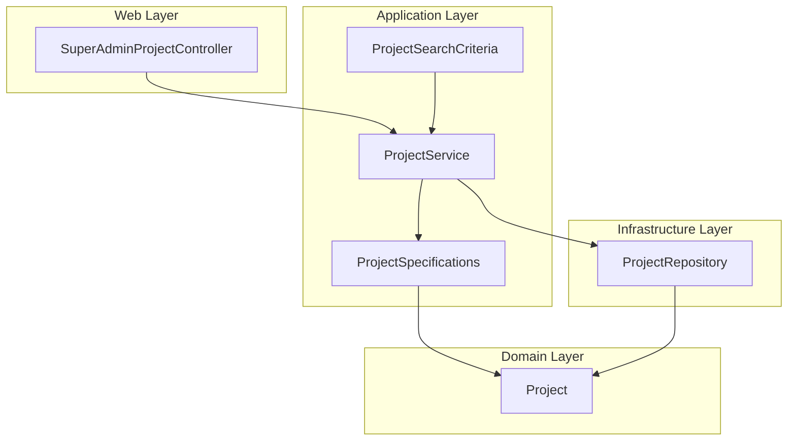
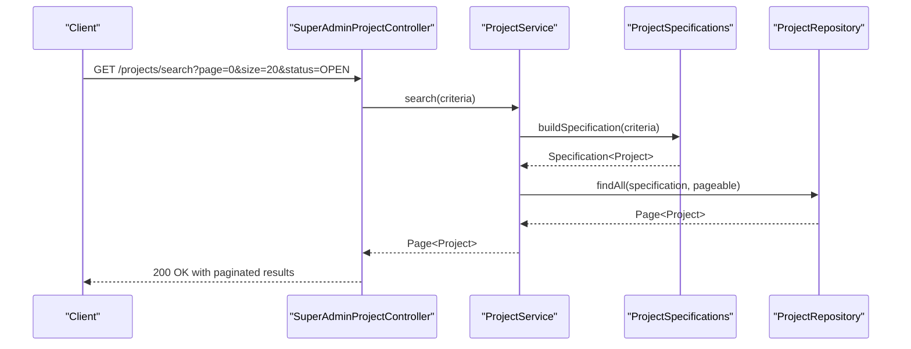
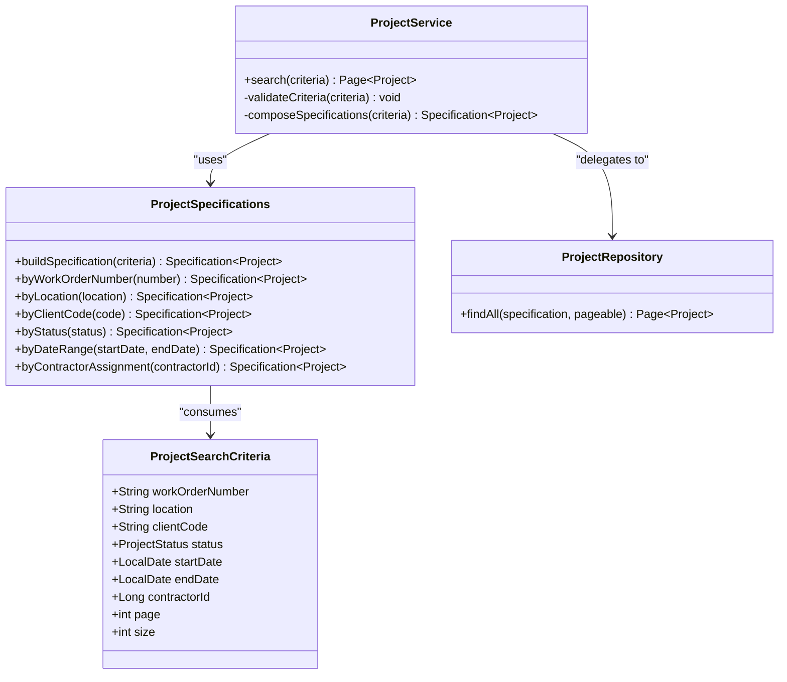
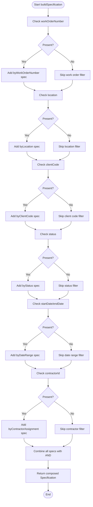
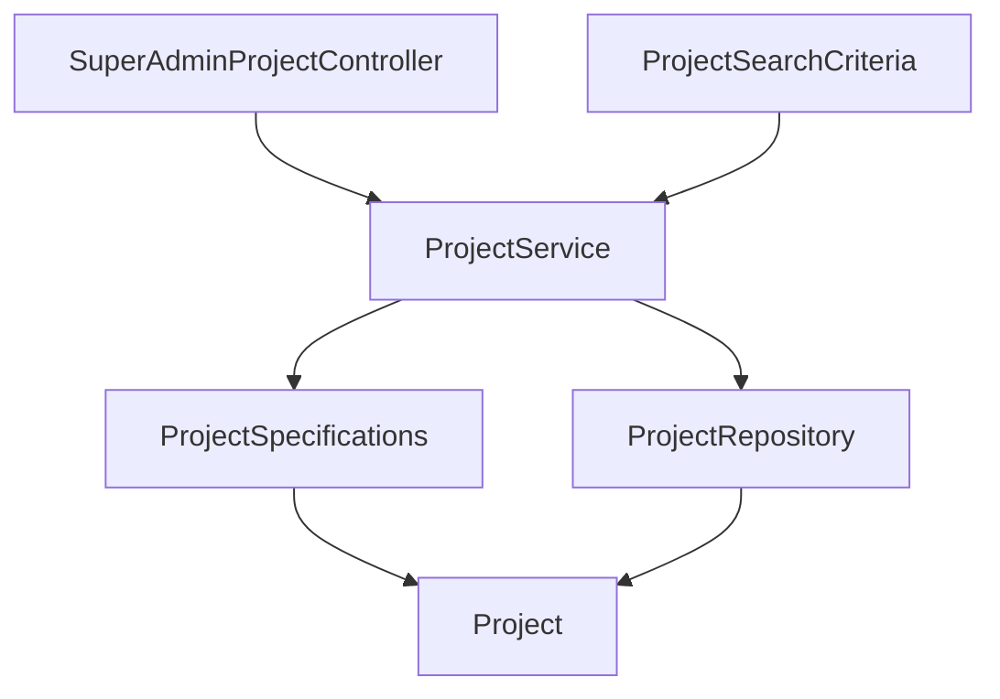

# Advanced Search & Filtering

<cite>
**Referenced Files in This Document**
- [ProjectSearchCriteria.java](file://src/main/java/root/cyb/mh/skylink_media_service/application/dto/ProjectSearchCriteria.java)
- [ProjectSpecifications.java](file://src/main/java/root/cyb/mh/skylink_media_service/application/services/ProjectSpecifications.java)
- [ProjectService.java](file://src/main/java/root/cyb/mh/skylink_media_service/application/services/ProjectService.java)
- [Project.java](file://src/main/java/root/cyb/mh/skylink_media_service/domain/entities/Project.java)
- [ProjectRepository.java](file://src/main/java/root/cyb/mh/skylink_media_service/infrastructure/persistence/ProjectRepository.java)
- [SuperAdminProjectController.java](file://src/main/java/root/cyb/mh/skylink_media_service/infrastructure/web/SuperAdminProjectController.java)
- [advanced-search-indexes.sql](file://advanced-search-indexes.sql)
- [IMPLEMENTATION_ADVANCED_SEARCH.md](file://IMPLEMENTATION_ADVANCED_SEARCH.md)
- [ADVANCED_SEARCH_CHECKLIST.md](file://ADVANCED_SEARCH_CHECKLIST.md)
- [ADMIN_SEARCH_GUIDE.md](file://ADMIN_SEARCH_GUIDE.md)
</cite>

## Table of Contents
1. [Introduction](#introduction)
2. [Project Structure](#project-structure)
3. [Core Components](#core-components)
4. [Architecture Overview](#architecture-overview)
5. [Detailed Component Analysis](#detailed-component-analysis)
6. [Dependency Analysis](#dependency-analysis)
7. [Performance Considerations](#performance-considerations)
8. [Troubleshooting Guide](#troubleshooting-guide)
9. [Conclusion](#conclusion)
10. [Appendices](#appendices)

## Introduction
This document provides comprehensive documentation for the advanced search and filtering system implemented in the Skylink Media Service backend. The system leverages the Specification pattern to dynamically build JPA Criteria queries based on flexible filter criteria. It supports complex filtering across multiple fields, including work order number, location, client code, status, date ranges, and contractor assignments. The documentation covers the ProjectSpecifications class, ProjectSearchCriteria DTO, integration with ProjectService search operations, performance optimization techniques, practical search examples, pagination strategies, and client-side integration patterns.

## Project Structure
The advanced search functionality spans several layers:
- Application DTO: ProjectSearchCriteria defines the filter surface exposed to clients
- Application Service: ProjectSpecifications implements the Specification pattern for dynamic query construction
- Domain Entity: Project represents the persisted entity being queried
- Infrastructure Repository: ProjectRepository extends JpaSpecificationExecutor to execute Specifications
- Web Layer: SuperAdminProjectController exposes REST endpoints for search operations
- Supporting Documentation: Implementation guides and index strategies

**Diagram sources**
- [SuperAdminProjectController.java](file://src/main/java/root/cyb/mh/skylink_media_service/infrastructure/web/SuperAdminProjectController.java)
- [ProjectService.java](file://src/main/java/root/cyb/mh/skylink_media_service/application/services/ProjectService.java)
- [ProjectSpecifications.java](file://src/main/java/root/cyb/mh/skylink_media_service/application/services/ProjectSpecifications.java)
- [ProjectSearchCriteria.java](file://src/main/java/root/cyb/mh/skylink_media_service/application/dto/ProjectSearchCriteria.java)
- [ProjectRepository.java](file://src/main/java/root/cyb/mh/skylink_media_service/infrastructure/persistence/ProjectRepository.java)
- [Project.java](file://src/main/java/root/cyb/mh/skylink_media_service/domain/entities/Project.java)

**Section sources**
- [SuperAdminProjectController.java](file://src/main/java/root/cyb/mh/skylink_media_service/infrastructure/web/SuperAdminProjectController.java)
- [ProjectService.java](file://src/main/java/root/cyb/mh/skylink_media_service/application/services/ProjectService.java)
- [ProjectSpecifications.java](file://src/main/java/root/cyb/mh/skylink_media_service/application/services/ProjectSpecifications.java)
- [ProjectSearchCriteria.java](file://src/main/java/root/cyb/mh/skylink_media_service/application/dto/ProjectSearchCriteria.java)
- [ProjectRepository.java](file://src/main/java/root/cyb/mh/skylink_media_service/infrastructure/persistence/ProjectRepository.java)
- [Project.java](file://src/main/java/root/cyb/mh/skylink_media_service/domain/entities/Project.java)

## Core Components
This section documents the primary components involved in the advanced search and filtering system.

### ProjectSearchCriteria DTO
The ProjectSearchCriteria DTO encapsulates all supported filter fields and pagination parameters. It serves as the contract between the client and server for specifying search filters. The DTO includes:
- Work Order Number: String-based filter for project identifiers
- Location: String-based filter for geographic or facility locations
- Client Code: String-based filter for client identification codes
- Status: Enum-based filter for project lifecycle status
- Date Range Filters: Start and end dates for creation/update timestamps
- Contractor Assignment: Filter for projects assigned to specific contractors
- Pagination: Page number and page size for result pagination

These fields collectively enable precise targeting of projects while maintaining flexibility for diverse administrative and contractor use cases.

**Section sources**
- [ProjectSearchCriteria.java](file://src/main/java/root/cyb/mh/skylink_media_service/application/dto/ProjectSearchCriteria.java)

### ProjectSpecifications Class
The ProjectSpecifications class implements the Specification pattern to construct dynamic JPA Criteria queries. It provides reusable, composable specifications for various filter scenarios. Key capabilities include:
- Dynamic Query Building: Specifications adapt to the presence or absence of filter criteria
- Logical Combinations: Support for AND/OR conditions across multiple fields
- Type-Safe Filtering: Leverages JPA Metamodel for compile-time safety
- Reusability: Individual specifications can be combined to form complex queries

The class centralizes query logic, ensuring consistency and maintainability across different search contexts.

**Section sources**
- [ProjectSpecifications.java](file://src/main/java/root/cyb/mh/skylink_media_service/application/services/ProjectSpecifications.java)

### ProjectService Integration
ProjectService coordinates search operations by:
- Validating and normalizing search criteria from ProjectSearchCriteria
- Constructing composite Specifications using ProjectSpecifications
- Executing queries via ProjectRepository with pagination support
- Returning paginated results to the controller layer

This service acts as the orchestrator between the web layer and persistence layer, encapsulating business logic for search and filtering.

**Section sources**
- [ProjectService.java](file://src/main/java/root/cyb/mh/skylink_media_service/application/services/ProjectService.java)

### Project Entity and Repository
The Project entity represents the persisted model with attributes supporting the search criteria. ProjectRepository extends JpaSpecificationExecutor to enable Specification-based queries. Together, they provide the foundation for dynamic filtering and efficient result retrieval.

**Section sources**
- [Project.java](file://src/main/java/root/cyb/mh/skylink_media_service/domain/entities/Project.java)
- [ProjectRepository.java](file://src/main/java/root/cyb/mh/skylink_media_service/infrastructure/persistence/ProjectRepository.java)

## Architecture Overview
The advanced search architecture follows a layered approach with clear separation of concerns:
- Web Layer: Exposes REST endpoints for search operations
- Application Layer: Implements business logic and Specification composition
- Domain Layer: Defines the persistent entity model
- Infrastructure Layer: Provides data access through repositories

**Diagram sources**
- [SuperAdminProjectController.java](file://src/main/java/root/cyb/mh/skylink_media_service/infrastructure/web/SuperAdminProjectController.java)
- [ProjectService.java](file://src/main/java/root/cyb/mh/skylink_media_service/application/services/ProjectService.java)
- [ProjectSpecifications.java](file://src/main/java/root/cyb/mh/skylink_media_service/application/services/ProjectSpecifications.java)
- [ProjectRepository.java](file://src/main/java/root/cyb/mh/skylink_media_service/infrastructure/persistence/ProjectRepository.java)

## Detailed Component Analysis

### Specification Pattern Implementation
The Specification pattern enables dynamic query construction by encapsulating query logic in reusable, composable units. The ProjectSpecifications class demonstrates:
- Single Responsibility: Each specification handles a specific filter criterion
- Composition: Multiple specifications can be combined using logical operators
- Type Safety: Uses JPA Metamodel for compile-time validation
- Testability: Individual specifications can be unit tested in isolation

**Diagram sources**
- [ProjectSpecifications.java](file://src/main/java/root/cyb/mh/skylink_media_service/application/services/ProjectSpecifications.java)
- [ProjectSearchCriteria.java](file://src/main/java/root/cyb/mh/skylink_media_service/application/dto/ProjectSearchCriteria.java)
- [ProjectService.java](file://src/main/java/root/cyb/mh/skylink_media_service/application/services/ProjectService.java)
- [ProjectRepository.java](file://src/main/java/root/cyb/mh/skylink_media_service/infrastructure/persistence/ProjectRepository.java)

### Search Criteria Composition Flow
The buildSpecification method orchestrates the construction of complex queries by combining individual specifications based on provided criteria. The flow supports:
- Optional Filters: Only included specifications for non-null criteria
- Logical Operators: AND conditions for multiple filters
- Date Range Handling: Flexible start/end date boundaries
- Enum Filtering: Safe enumeration-based status filtering

**Diagram sources**
- [ProjectSpecifications.java](file://src/main/java/root/cyb/mh/skylink_media_service/application/services/ProjectSpecifications.java)

### Search API Endpoints and Client Integration
The system exposes REST endpoints for search operations, enabling client-side integration patterns:
- Endpoint: GET /projects/search
- Query Parameters: workOrderNumber, location, clientCode, status, startDate, endDate, contractorId, page, size
- Response: Paginated list of projects matching the criteria
- Client Integration: Frontend applications can construct filter objects from ProjectSearchCriteria and submit them to the endpoint

Client-side patterns include:
- Form-based filtering with real-time updates
- Multi-select dropdowns for status and contractor assignments
- Calendar pickers for date range selection
- Infinite scroll or pagination controls for result navigation

**Section sources**
- [SuperAdminProjectController.java](file://src/main/java/root/cyb/mh/skylink_media_service/infrastructure/web/SuperAdminProjectController.java)
- [ProjectSearchCriteria.java](file://src/main/java/root/cyb/mh/skylink_media_service/application/dto/ProjectSearchCriteria.java)

## Dependency Analysis
The advanced search system exhibits low coupling and high cohesion:
- ProjectService depends on ProjectSpecifications for query construction and ProjectRepository for data access
- ProjectSpecifications encapsulates query logic, minimizing coupling to external components
- ProjectSearchCriteria provides a stable interface between the web layer and application logic
- ProjectRepository extends JpaSpecificationExecutor, enabling Specification-based queries without exposing implementation details

**Diagram sources**
- [SuperAdminProjectController.java](file://src/main/java/root/cyb/mh/skylink_media_service/infrastructure/web/SuperAdminProjectController.java)
- [ProjectService.java](file://src/main/java/root/cyb/mh/skylink_media_service/application/services/ProjectService.java)
- [ProjectSpecifications.java](file://src/main/java/root/cyb/mh/skylink_media_service/application/services/ProjectSpecifications.java)
- [ProjectRepository.java](file://src/main/java/root/cyb/mh/skylink_media_service/infrastructure/persistence/ProjectRepository.java)
- [ProjectSearchCriteria.java](file://src/main/java/root/cyb/mh/skylink_media_service/application/dto/ProjectSearchCriteria.java)
- [Project.java](file://src/main/java/root/cyb/mh/skylink_media_service/domain/entities/Project.java)

**Section sources**
- [ProjectService.java](file://src/main/java/root/cyb/mh/skylink_media_service/application/services/ProjectService.java)
- [ProjectSpecifications.java](file://src/main/java/root/cyb/mh/skylink_media_service/application/services/ProjectSpecifications.java)
- [ProjectRepository.java](file://src/main/java/root/cyb/mh/skylink_media_service/infrastructure/persistence/ProjectRepository.java)
- [ProjectSearchCriteria.java](file://src/main/java/root/cyb/mh/skylink_media_service/application/dto/ProjectSearchCriteria.java)
- [Project.java](file://src/main/java/root/cyb/mh/skylink_media_service/domain/entities/Project.java)

## Performance Considerations
Performance optimization is critical for scalable search operations. The system incorporates several strategies:
- Database Indexes: Strategic indexing on frequently filtered columns (work order number, location, client code, status, timestamps) improves query performance
- Pagination: Default page sizes and reasonable limits prevent excessive memory usage
- Selective Filtering: Only included specifications for present criteria reduce query complexity
- Efficient Date Range Queries: Proper index utilization for date comparisons
- Specification Composition: Minimizing unnecessary joins and projections

Index utilization recommendations include:
- Composite indexes for commonly combined filters (e.g., status + creation date)
- Separate indexes for high-cardinality fields (e.g., work order number)
- Consider covering indexes for frequently accessed column combinations

**Section sources**
- [advanced-search-indexes.sql](file://advanced-search-indexes.sql)
- [IMPLEMENTATION_ADVANCED_SEARCH.md](file://IMPLEMENTATION_ADVANCED_SEARCH.md)

## Troubleshooting Guide
Common issues and resolutions for the advanced search system:
- Empty Results: Verify that filter criteria match existing data formats and case sensitivity
- Performance Degradation: Review applied filters and consider adding appropriate database indexes
- Pagination Issues: Ensure page and size parameters are within acceptable ranges
- Specification Errors: Validate that all filter fields in ProjectSearchCriteria correspond to actual entity attributes
- Controller Mapping: Confirm endpoint availability and proper parameter binding

Diagnostic steps:
- Enable SQL logging to inspect generated queries
- Test individual specifications in isolation
- Validate DTO field mappings against the Project entity
- Monitor query execution plans for index usage

**Section sources**
- [ProjectService.java](file://src/main/java/root/cyb/mh/skylink_media_service/application/services/ProjectService.java)
- [ProjectSpecifications.java](file://src/main/java/root/cyb/mh/skylink_media_service/application/services/ProjectSpecifications.java)
- [ProjectSearchCriteria.java](file://src/main/java/root/cyb/mh/skylink_media_service/application/dto/ProjectSearchCriteria.java)

## Conclusion
The advanced search and filtering system successfully implements the Specification pattern to provide flexible, type-safe, and maintainable query construction. By separating concerns across layers and leveraging reusable specifications, the system supports complex filter combinations while maintaining performance through strategic indexing and pagination. The modular design facilitates future enhancements and ensures consistent behavior across different search contexts.

## Appendices

### Practical Search Examples
Example filter combinations and their intended use cases:
- Basic Status Filter: Filter projects by status (e.g., OPEN, IN_PROGRESS)
- Date Range Search: Find projects created within a specific period
- Multi-Criteria Combination: Combine status, date range, and location filters for targeted results
- Contractor Assignment: Retrieve projects assigned to specific contractors
- Pagination Strategy: Use page and size parameters for efficient result navigation

### Best Practices
- Keep filter criteria mutually exclusive when necessary to avoid ambiguous results
- Use enums for status filtering to prevent typos and ensure consistency
- Apply appropriate database indexes for frequently used filter combinations
- Implement rate limiting and reasonable page size limits to protect system resources
- Provide clear error messages for invalid filter values

**Section sources**
- [ADMIN_SEARCH_GUIDE.md](file://ADMIN_SEARCH_GUIDE.md)
- [ADVANCED_SEARCH_CHECKLIST.md](file://ADVANCED_SEARCH_CHECKLIST.md)
- [IMPLEMENTATION_ADVANCED_SEARCH.md](file://IMPLEMENTATION_ADVANCED_SEARCH.md)