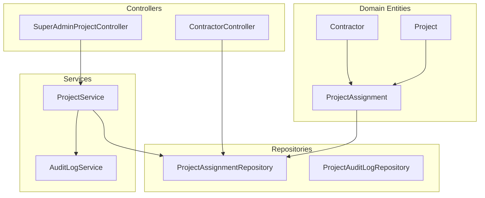
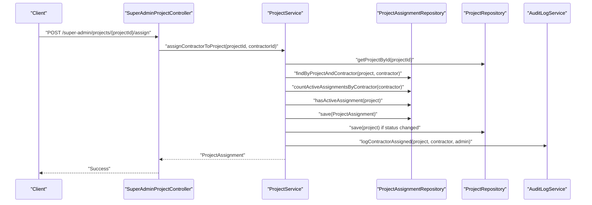
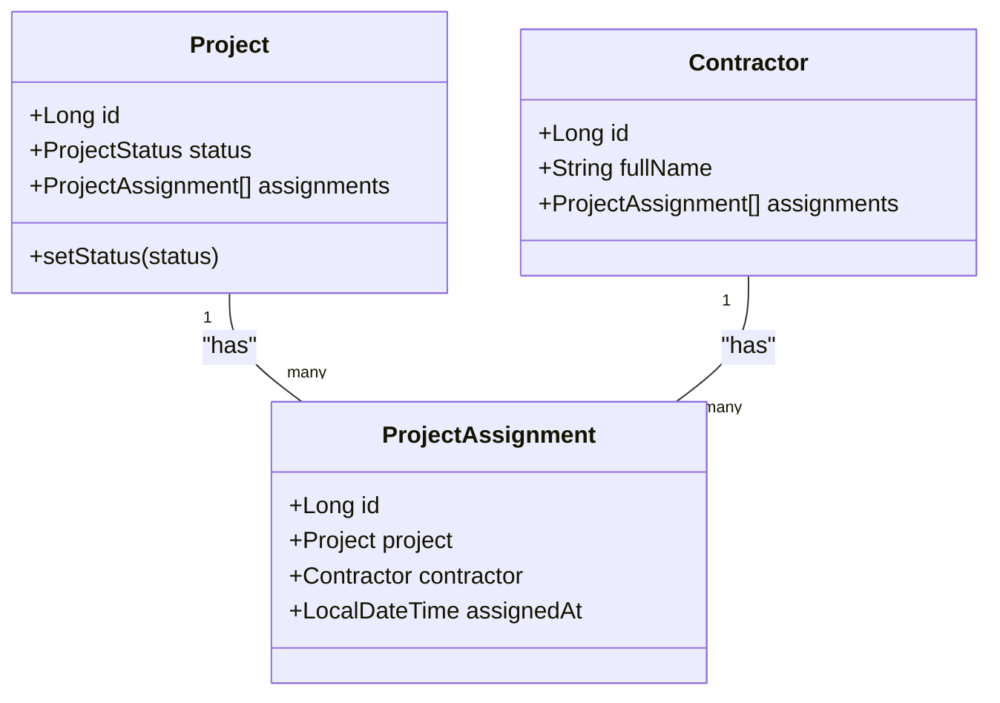
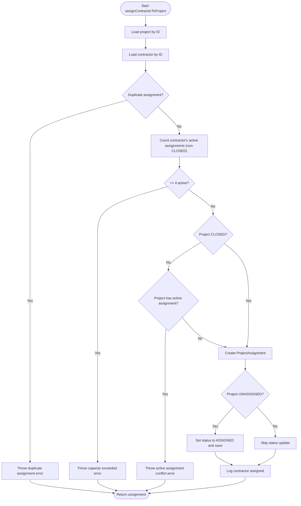
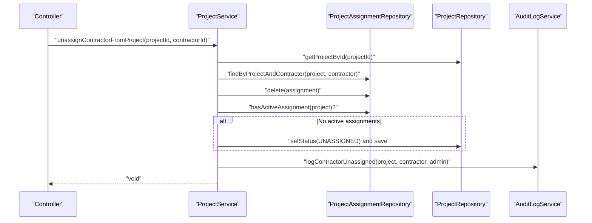
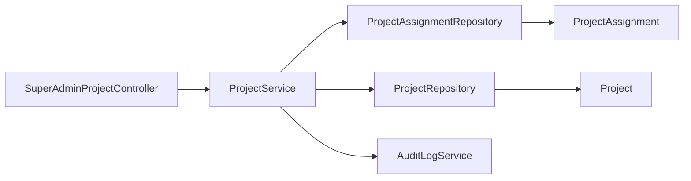

# Contractor Assignment System

<cite>
**Referenced Files in This Document**
- [ProjectAssignment.java](file://src/main/java/root/cyb/mh/skylink_media_service/domain/entities/ProjectAssignment.java)
- [ProjectAssignmentRepository.java](file://src/main/java/root/cyb/mh/skylink_media_service/infrastructure/persistence/ProjectAssignmentRepository.java)
- [ProjectService.java](file://src/main/java/root/cyb/mh/skylink_media_service/application/services/ProjectService.java)
- [Contractor.java](file://src/main/java/root/cyb/mh/skylink_media_service/domain/entities/Contractor.java)
- [Project.java](file://src/main/java/root/cyb/mh/skylink_media_service/domain/entities/Project.java)
- [AuditLogService.java](file://src/main/java/root/cyb/mh/skylink_media_service/application/services/AuditLogService.java)
- [ProjectAuditLog.java](file://src/main/java/root/cyb/mh/skylink_media_service/domain/entities/ProjectAuditLog.java)
- [ProjectAuditLogRepository.java](file://src/main/java/root/cyb/mh/skylink_media_service/infrastructure/persistence/ProjectAuditLogRepository.java)
- [ProjectStatus.java](file://src/main/java/root/cyb/mh/skylink_media_service/domain/valueobjects/ProjectStatus.java)
- [ContractorController.java](file://src/main/java/root/cyb/mh/skylink_media_service/infrastructure/web/ContractorController.java)
- [SuperAdminProjectController.java](file://src/main/java/root/cyb/mh/skylink_media_service/infrastructure/web/SuperAdminProjectController.java)
</cite>

## Table of Contents
1. [Introduction](#introduction)
2. [Project Structure](#project-structure)
3. [Core Components](#core-components)
4. [Architecture Overview](#architecture-overview)
5. [Detailed Component Analysis](#detailed-component-analysis)
6. [Dependency Analysis](#dependency-analysis)
7. [Performance Considerations](#performance-considerations)
8. [Troubleshooting Guide](#troubleshooting-guide)
9. [Conclusion](#conclusion)

## Introduction
This document describes the contractor assignment system responsible for assigning and unassigning contractors to projects. It covers the assignContractorToProject() method with business rule validation, the unassignContractorFromProject() operation with status restoration logic, the ProjectAssignment entity and repository operations, automatic status updates, practical assignment workflows, capacity management scenarios, error handling, contractor availability checks, project assignment queries, integration with status management, and audit logging for assignment operations.

## Project Structure
The contractor assignment system spans domain entities, repositories, application services, and web controllers:
- Domain entities define the assignment relationship and project state.
- Repositories encapsulate data access and queries for assignments and audit logs.
- Application services orchestrate business logic, validation, and status transitions.
- Web controllers expose endpoints for contractor dashboards and administrative views.

**Diagram sources**
- [ProjectAssignment.java:1-50](file://src/main/java/root/cyb/mh/skylink_media_service/domain/entities/ProjectAssignment.java#L1-L50)
- [Project.java:1-262](file://src/main/java/root/cyb/mh/skylink_media_service/domain/entities/Project.java#L1-L262)
- [Contractor.java:1-48](file://src/main/java/root/cyb/mh/skylink_media_service/domain/entities/Contractor.java#L1-L48)
- [ProjectAssignmentRepository.java:1-49](file://src/main/java/root/cyb/mh/skylink_media_service/infrastructure/persistence/ProjectAssignmentRepository.java#L1-L49)
- [ProjectService.java:1-428](file://src/main/java/root/cyb/mh/skylink_media_service/application/services/ProjectService.java#L1-L428)
- [AuditLogService.java:1-317](file://src/main/java/root/cyb/mh/skylink_media_service/application/services/AuditLogService.java#L1-L317)
- [ProjectAuditLogRepository.java:1-34](file://src/main/java/root/cyb/mh/skylink_media_service/infrastructure/persistence/ProjectAuditLogRepository.java#L1-L34)
- [ContractorController.java:1-258](file://src/main/java/root/cyb/mh/skylink_media_service/infrastructure/web/ContractorController.java#L1-L258)
- [SuperAdminProjectController.java:1-307](file://src/main/java/root/cyb/mh/skylink_media_service/infrastructure/web/SuperAdminProjectController.java#L1-L307)

**Section sources**
- [ProjectAssignment.java:1-50](file://src/main/java/root/cyb/mh/skylink_media_service/domain/entities/ProjectAssignment.java#L1-L50)
- [ProjectAssignmentRepository.java:1-49](file://src/main/java/root/cyb/mh/skylink_media_service/infrastructure/persistence/ProjectAssignmentRepository.java#L1-L49)
- [ProjectService.java:1-428](file://src/main/java/root/cyb/mh/skylink_media_service/application/services/ProjectService.java#L1-L428)
- [Contractor.java:1-48](file://src/main/java/root/cyb/mh/skylink_media_service/domain/entities/Contractor.java#L1-L48)
- [Project.java:1-262](file://src/main/java/root/cyb/mh/skylink_media_service/domain/entities/Project.java#L1-L262)
- [AuditLogService.java:1-317](file://src/main/java/root/cyb/mh/skylink_media_service/application/services/AuditLogService.java#L1-L317)
- [ProjectAuditLog.java:1-102](file://src/main/java/root/cyb/mh/skylink_media_service/domain/entities/ProjectAuditLog.java#L1-L102)
- [ProjectAuditLogRepository.java:1-34](file://src/main/java/root/cyb/mh/skylink_media_service/infrastructure/persistence/ProjectAuditLogRepository.java#L1-L34)
- [ProjectStatus.java:1-54](file://src/main/java/root/cyb/mh/skylink_media_service/domain/valueobjects/ProjectStatus.java#L1-L54)
- [ContractorController.java:1-258](file://src/main/java/root/cyb/mh/skylink_media_service/infrastructure/web/ContractorController.java#L1-L258)
- [SuperAdminProjectController.java:1-307](file://src/main/java/root/cyb/mh/skylink_media_service/infrastructure/web/SuperAdminProjectController.java#L1-L307)

## Core Components
- ProjectAssignment entity: Represents the many-to-many relationship between Project and Contractor with timestamps and persistence hooks.
- ProjectAssignmentRepository: Provides typed queries for assignments, active assignment counting, availability checks, and bulk deletions.
- ProjectService: Implements business logic for assignment/unassignment, validates capacity and uniqueness, updates project status automatically, and logs audit events.
- AuditLogService and ProjectAuditLog: Centralized audit logging for contractor assignment/unassignment and other lifecycle events.
- ProjectStatus: Defines allowed status transitions and supports automatic status updates during assignment/unassignment.

Key responsibilities:
- Enforce maximum 4 active projects per contractor.
- Enforce single contractor assignment per project except for CLOSED projects.
- Automatically set project status from UNASSIGNED to ASSIGNED upon first assignment.
- Restore project status to UNASSIGNED when the last active assignment is removed.
- Log assignment operations with detailed audit entries.

**Section sources**
- [ProjectAssignment.java:1-50](file://src/main/java/root/cyb/mh/skylink_media_service/domain/entities/ProjectAssignment.java#L1-L50)
- [ProjectAssignmentRepository.java:1-49](file://src/main/java/root/cyb/mh/skylink_media_service/infrastructure/persistence/ProjectAssignmentRepository.java#L1-L49)
- [ProjectService.java:118-205](file://src/main/java/root/cyb/mh/skylink_media_service/application/services/ProjectService.java#L118-L205)
- [AuditLogService.java:77-117](file://src/main/java/root/cyb/mh/skylink_media_service/application/services/AuditLogService.java#L77-L117)
- [ProjectStatus.java:25-34](file://src/main/java/root/cyb/mh/skylink_media_service/domain/valueobjects/ProjectStatus.java#L25-L34)

## Architecture Overview
The assignment system follows layered architecture:
- Controllers handle HTTP requests and delegate to use cases/services.
- Services encapsulate business rules and coordinate repositories.
- Repositories abstract persistence and expose typed queries.
- Entities model domain concepts with JPA mappings.

**Diagram sources**
- [SuperAdminProjectController.java:1-307](file://src/main/java/root/cyb/mh/skylink_media_service/infrastructure/web/SuperAdminProjectController.java#L1-L307)
- [ProjectService.java:118-170](file://src/main/java/root/cyb/mh/skylink_media_service/application/services/ProjectService.java#L118-L170)
- [ProjectAssignmentRepository.java:14-42](file://src/main/java/root/cyb/mh/skylink_media_service/infrastructure/persistence/ProjectAssignmentRepository.java#L14-L42)
- [AuditLogService.java:77-96](file://src/main/java/root/cyb/mh/skylink_media_service/application/services/AuditLogService.java#L77-L96)

## Detailed Component Analysis

### ProjectAssignment Entity and Repository
The ProjectAssignment entity defines the assignment relationship and persistence behavior:
- Many-to-one to Project and Contractor.
- Timestamp tracking via @PrePersist.
- Standard JPA annotations for identity and foreign keys.

The repository provides:
- Find by contractor or project.
- Find by project and contractor tuple.
- Search assignments by contractor with a term across project metadata.
- Count active (non-CLOSED) assignments for a contractor.
- Find active assignment for a project.
- Check if a project has any active assignment.
- Bulk delete by project.

**Diagram sources**
- [Project.java:1-262](file://src/main/java/root/cyb/mh/skylink_media_service/domain/entities/Project.java#L1-L262)
- [Contractor.java:1-48](file://src/main/java/root/cyb/mh/skylink_media_service/domain/entities/Contractor.java#L1-L48)
- [ProjectAssignment.java:1-50](file://src/main/java/root/cyb/mh/skylink_media_service/domain/entities/ProjectAssignment.java#L1-L50)

**Section sources**
- [ProjectAssignment.java:1-50](file://src/main/java/root/cyb/mh/skylink_media_service/domain/entities/ProjectAssignment.java#L1-L50)
- [ProjectAssignmentRepository.java:14-48](file://src/main/java/root/cyb/mh/skylink_media_service/infrastructure/persistence/ProjectAssignmentRepository.java#L14-L48)

### assignContractorToProject() Method
Business rule validation:
- Prevent duplicate assignments: throws if an assignment already exists for the given project-contractor pair.
- Capacity management: enforce maximum 4 active projects per contractor using a repository query that excludes CLOSED projects.
- Single contractor assignment: prevent multiple active assignments for a project unless it is CLOSED; CLOSED projects can accept assignments for record-keeping.

Automatic status updates:
- If a project is UNASSIGNED and receives its first assignment, set status to ASSIGNED and persist.

Audit logging:
- Logs contractor assignment with actor details.

**Diagram sources**
- [ProjectService.java:118-170](file://src/main/java/root/cyb/mh/skylink_media_service/application/services/ProjectService.java#L118-L170)
- [ProjectAssignmentRepository.java:19-42](file://src/main/java/root/cyb/mh/skylink_media_service/infrastructure/persistence/ProjectAssignmentRepository.java#L19-L42)
- [Project.java:211-221](file://src/main/java/root/cyb/mh/skylink_media_service/domain/entities/Project.java#L211-L221)
- [AuditLogService.java:77-96](file://src/main/java/root/cyb/mh/skylink_media_service/application/services/AuditLogService.java#L77-L96)

**Section sources**
- [ProjectService.java:118-170](file://src/main/java/root/cyb/mh/skylink_media_service/application/services/ProjectService.java#L118-L170)
- [ProjectAssignmentRepository.java:19-42](file://src/main/java/root/cyb/mh/skylink_media_service/infrastructure/persistence/ProjectAssignmentRepository.java#L19-L42)
- [AuditLogService.java:77-96](file://src/main/java/root/cyb/mh/skylink_media_service/application/services/AuditLogService.java#L77-L96)

### unassignContractorFromProject() Operation
Validation rules:
- Ensure the contractor is assigned to the project; otherwise throw an error.
- Prevent unassignment from CLOSED projects.

Status restoration logic:
- After successful deletion of the assignment, if no active assignments remain for the project, set status back to UNASSIGNED and persist.

Audit logging:
- Logs contractor unassignment with actor details.

**Diagram sources**
- [ProjectService.java:176-205](file://src/main/java/root/cyb/mh/skylink_media_service/application/services/ProjectService.java#L176-L205)
- [ProjectAssignmentRepository.java:17-42](file://src/main/java/root/cyb/mh/skylink_media_service/infrastructure/persistence/ProjectAssignmentRepository.java#L17-L42)
- [Project.java:211-221](file://src/main/java/root/cyb/mh/skylink_media_service/domain/entities/Project.java#L211-L221)
- [AuditLogService.java:98-117](file://src/main/java/root/cyb/mh/skylink_media_service/application/services/AuditLogService.java#L98-L117)

**Section sources**
- [ProjectService.java:176-205](file://src/main/java/root/cyb/mh/skylink_media_service/application/services/ProjectService.java#L176-L205)
- [ProjectAssignmentRepository.java:17-42](file://src/main/java/root/cyb/mh/skylink_media_service/infrastructure/persistence/ProjectAssignmentRepository.java#L17-L42)
- [AuditLogService.java:98-117](file://src/main/java/root/cyb/mh/skylink_media_service/application/services/AuditLogService.java#L98-L117)

### Project Assignment Queries and Availability Checks
- Search assignments by contractor with a free-text term across project metadata.
- Count active assignments for a contractor (non-CLOSED).
- Check if a project has any active assignment.
- Determine project availability for assignment considering CLOSED status.

These utilities support contractor dashboards and administrative views.

**Section sources**
- [ProjectAssignmentRepository.java:19-42](file://src/main/java/root/cyb/mh/skylink_media_service/infrastructure/persistence/ProjectAssignmentRepository.java#L19-L42)
- [ProjectService.java:349-370](file://src/main/java/root/cyb/mh/skylink_media_service/application/services/ProjectService.java#L349-L370)

### Integration with Status Management
- Automatic status transitions:
  - UNASSIGNED → ASSIGNED when the first active assignment is created.
  - Last active assignment removal restores UNASSIGNED status.
- ProjectStatus enforces allowed transitions and distinguishes contractor vs admin transitions.

**Section sources**
- [ProjectService.java:158-162](file://src/main/java/root/cyb/mh/skylink_media_service/application/services/ProjectService.java#L158-L162)
- [ProjectService.java:195-199](file://src/main/java/root/cyb/mh/skylink_media_service/application/services/ProjectService.java#L195-L199)
- [ProjectStatus.java:25-34](file://src/main/java/root/cyb/mh/skylink_media_service/domain/valueobjects/ProjectStatus.java#L25-L34)

### Audit Logging and Change Tracking
- Dedicated audit log entries for contractor assignment/unassignment.
- Centralized AuditLogService writes structured logs with actor, timestamp, and details.
- ProjectAuditLogRepository provides lookup by project, admin, and action type.

**Section sources**
- [AuditLogService.java:77-117](file://src/main/java/root/cyb/mh/skylink_media_service/application/services/AuditLogService.java#L77-L117)
- [ProjectAuditLog.java:18-42](file://src/main/java/root/cyb/mh/skylink_media_service/domain/entities/ProjectAuditLog.java#L18-L42)
- [ProjectAuditLogRepository.java:14-32](file://src/main/java/root/cyb/mh/skylink_media_service/infrastructure/persistence/ProjectAuditLogRepository.java#L14-L32)

### Practical Examples

#### Example 1: Successful Assignment Workflow
- Scenario: Assign a contractor to an UNASSIGNED project with less than 4 active assignments.
- Expected outcome: Assignment created, project status updated to ASSIGNED, audit logged.

**Section sources**
- [ProjectService.java:118-170](file://src/main/java/root/cyb/mh/skylink_media_service/application/services/ProjectService.java#L118-L170)
- [AuditLogService.java:77-96](file://src/main/java/root/cyb/mh/skylink_media_service/application/services/AuditLogService.java#L77-L96)

#### Example 2: Capacity Management Scenario
- Scenario: Attempt to assign a contractor who already has 4 active projects.
- Expected outcome: Error indicating capacity limit reached.

**Section sources**
- [ProjectService.java:131-137](file://src/main/java/root/cyb/mh/skylink_media_service/application/services/ProjectService.java#L131-L137)

#### Example 3: Conflict Resolution
- Scenario: Attempt to assign another contractor to an ACTIVE project.
- Expected outcome: Error instructing to close or reassign the project.

**Section sources**
- [ProjectService.java:139-153](file://src/main/java/root/cyb/mh/skylink_media_service/application/services/ProjectService.java#L139-L153)

#### Example 4: Unassignment Restores Status
- Scenario: Remove the last active assignment from an ASSIGNED project.
- Expected outcome: Project status restored to UNASSIGNED.

**Section sources**
- [ProjectService.java:176-205](file://src/main/java/root/cyb/mh/skylink_media_service/application/services/ProjectService.java#L176-L205)

## Dependency Analysis
The assignment system exhibits clear separation of concerns:
- ProjectService depends on repositories for data access and AuditLogService for logging.
- Controllers depend on services for business operations.
- Entities are decoupled from persistence via repositories.

**Diagram sources**
- [SuperAdminProjectController.java:1-307](file://src/main/java/root/cyb/mh/skylink_media_service/infrastructure/web/SuperAdminProjectController.java#L1-L307)
- [ProjectService.java:1-428](file://src/main/java/root/cyb/mh/skylink_media_service/application/services/ProjectService.java#L1-L428)
- [ProjectAssignmentRepository.java:1-49](file://src/main/java/root/cyb/mh/skylink_media_service/infrastructure/persistence/ProjectAssignmentRepository.java#L1-L49)
- [Project.java:1-262](file://src/main/java/root/cyb/mh/skylink_media_service/domain/entities/Project.java#L1-L262)

**Section sources**
- [ProjectService.java:1-428](file://src/main/java/root/cyb/mh/skylink_media_service/application/services/ProjectService.java#L1-L428)
- [ProjectAssignmentRepository.java:1-49](file://src/main/java/root/cyb/mh/skylink_media_service/infrastructure/persistence/ProjectAssignmentRepository.java#L1-L49)
- [SuperAdminProjectController.java:1-307](file://src/main/java/root/cyb/mh/skylink_media_service/infrastructure/web/SuperAdminProjectController.java#L1-L307)

## Performance Considerations
- Repository queries for active assignment counts and existence checks are efficient due to JPQL filters excluding CLOSED projects.
- Indexes on audit log and project tables improve retrieval performance.
- Transaction boundaries in service methods ensure atomicity for assignment operations.

## Troubleshooting Guide
Common errors and resolutions:
- Duplicate assignment: Ensure the project-contractor pair does not already exist before creating an assignment.
- Capacity exceeded: Verify contractor’s active assignment count is below 4 before assigning.
- Active assignment conflict: Close or reassign the project before assigning a new contractor.
- Unassignment from CLOSED project: CLOSED projects cannot have assignments removed; close them first if necessary.
- Not assigned: Confirm the contractor is currently assigned to the project before attempting unassignment.

**Section sources**
- [ProjectService.java:127-129](file://src/main/java/root/cyb/mh/skylink_media_service/application/services/ProjectService.java#L127-L129)
- [ProjectService.java:131-137](file://src/main/java/root/cyb/mh/skylink_media_service/application/services/ProjectService.java#L131-L137)
- [ProjectService.java:139-153](file://src/main/java/root/cyb/mh/skylink_media_service/application/services/ProjectService.java#L139-L153)
- [ProjectService.java:188-191](file://src/main/java/root/cyb/mh/skylink_media_service/application/services/ProjectService.java#L188-L191)
- [ProjectService.java:185-186](file://src/main/java/root/cyb/mh/skylink_media_service/application/services/ProjectService.java#L185-L186)

## Conclusion
The contractor assignment system enforces strict business rules while maintaining clean separation of concerns. It ensures capacity management, prevents conflicts, automates status updates, and provides comprehensive audit logging for all assignment-related operations. The design supports both administrative and contractor-facing workflows through dedicated controllers and robust service-layer logic.