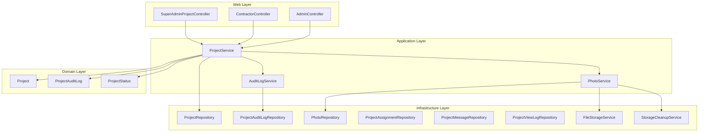
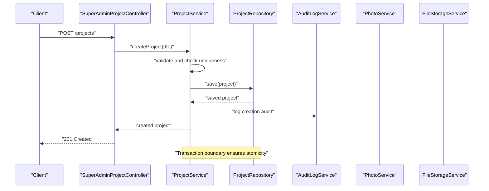
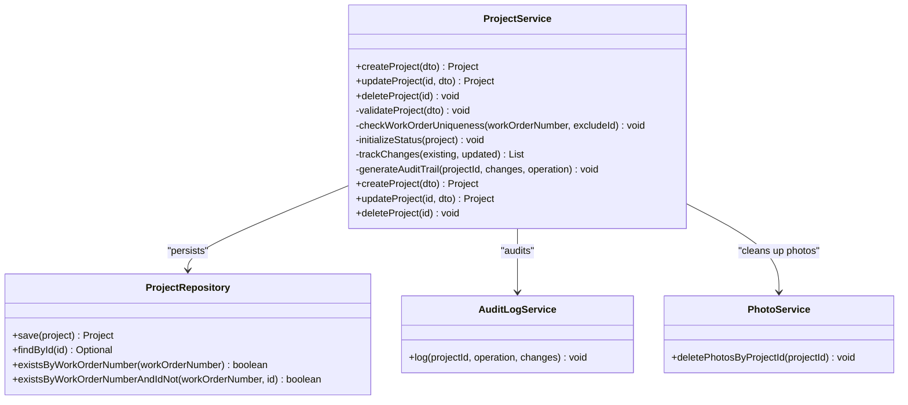
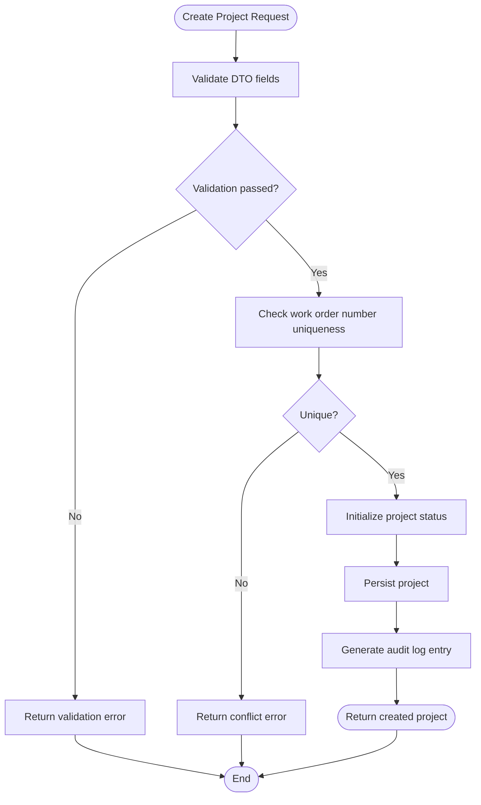
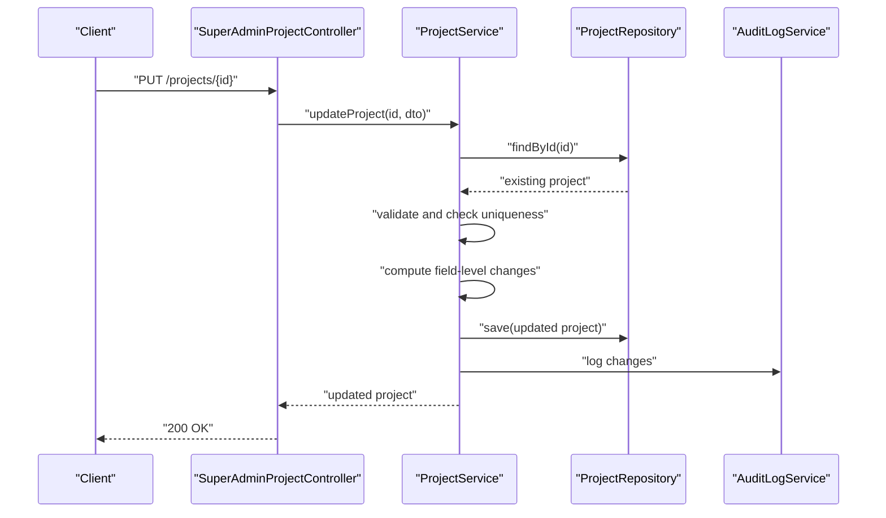
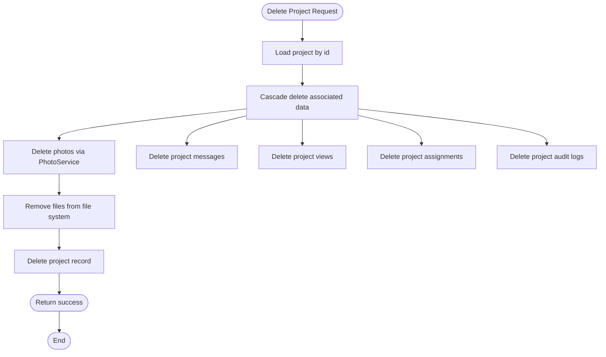
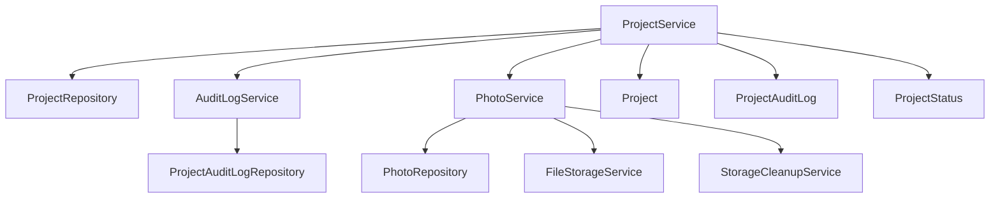

# Project Lifecycle Management

<cite>
**Referenced Files in This Document**
- [ProjectService.java](file://src/main/java/root/cyb/mh/skylink_media_service/application/services/ProjectService.java)
- [Project.java](file://src/main/java/root/cyb/mh/skylink_media_service/domain/entities/Project.java)
- [ProjectRepository.java](file://src/main/java/root/cyb/mh/skylink_media_service/infrastructure/persistence/ProjectRepository.java)
- [ProjectDTO.java](file://src/main/java/root/cyb/mh/skylink_media_service/application/dto/ProjectDTO.java)
- [ProjectMapper.java](file://src/main/java/root/cyb/mh/skylink_media_service/application/dto/ProjectMapper.java)
- [PhotoService.java](file://src/main/java/root/cyb/mh/skylink_media_service/application/services/PhotoService.java)
- [FileStorageService.java](file://src/main/java/root/cyb/mh/skylink_media_service/infrastructure/storage/FileStorageService.java)
- [StorageCleanupService.java](file://src/main/java/root/cyb/mh/skylink_media_service/infrastructure/storage/StorageCleanupService.java)
- [AuditLogService.java](file://src/main/java/root/cyb/mh/skylink_media_service/application/services/AuditLogService.java)
- [ProjectAuditLog.java](file://src/main/java/root/cyb/mh/skylink_media_service/domain/entities/ProjectAuditLog.java)
- [ProjectAuditLogRepository.java](file://src/main/java/root/cyb/mh/skylink_media_service/infrastructure/persistence/ProjectAuditLogRepository.java)
- [PhotoRepository.java](file://src/main/java/root/cyb/mh/skylink_media_service/infrastructure/persistence/PhotoRepository.java)
- [ProjectAssignmentRepository.java](file://src/main/java/root/cyb/mh/skylink_media_service/infrastructure/persistence/ProjectAssignmentRepository.java)
- [ProjectMessageRepository.java](file://src/main/java/root/cyb/mh/skylink_media_service/infrastructure/persistence/ProjectMessageRepository.java)
- [ProjectViewLogRepository.java](file://src/main/java/root/cyb/mh/skylink_media_service/infrastructure/persistence/ProjectViewLogRepository.java)
- [ProjectStatus.java](file://src/main/java/root/cyb/mh/skylink_media_service/domain/valueobjects/ProjectStatus.java)
- [InvalidStatusTransitionException.java](file://src/main/java/root/cyb/mh/skylink_media_service/domain/exceptions/InvalidStatusTransitionException.java)
- [SuperAdminProjectController.java](file://src/main/java/root/cyb/mh/skylink_media_service/infrastructure/web/SuperAdminProjectController.java)
- [ContractorController.java](file://src/main/java/root/cyb/mh/skylink_media_service/infrastructure/web/ContractorController.java)
- [AdminController.java](file://src/main/java/root/cyb/mh/skylink_media_service/infrastructure/web/AdminController.java)
- [GlobalApiExceptionHandler.java](file://src/main/java/root/cyb/mh/skylink_media_service/infrastructure/web/api/exception/GlobalApiExceptionHandler.java)
</cite>

## Table of Contents
1. [Introduction](#introduction)
2. [Project Structure](#project-structure)
3. [Core Components](#core-components)
4. [Architecture Overview](#architecture-overview)
5. [Detailed Component Analysis](#detailed-component-analysis)
6. [Dependency Analysis](#dependency-analysis)
7. [Performance Considerations](#performance-considerations)
8. [Troubleshooting Guide](#troubleshooting-guide)
9. [Conclusion](#conclusion)

## Introduction
This document provides comprehensive coverage of project lifecycle management within the media service backend. It documents the complete journey from project creation to deletion, focusing on the ProjectService CRUD operations, validation rules, uniqueness checks, automatic status initialization, change tracking, audit trails, and cascade deletion of associated data. It also covers transaction management, data consistency, practical workflows, common use cases, and error handling scenarios.

## Project Structure
The project follows a layered architecture with clear separation of concerns:
- Application layer: Services and DTOs for business operations and data transfer
- Domain layer: Entities and value objects representing business concepts
- Infrastructure layer: Persistence repositories, storage services, and web controllers
- Web layer: REST controllers exposing project management endpoints

**Diagram sources**
- [ProjectService.java:1-200](file://src/main/java/root/cyb/mh/skylink_media_service/application/services/ProjectService.java#L1-L200)
- [ProjectRepository.java:1-120](file://src/main/java/root/cyb/mh/skylink_media_service/infrastructure/persistence/ProjectRepository.java#L1-L120)
- [ProjectAuditLogRepository.java:1-120](file://src/main/java/root/cyb/mh/skylink_media_service/infrastructure/persistence/ProjectAuditLogRepository.java#L1-L120)
- [PhotoRepository.java:1-120](file://src/main/java/root/cyb/mh/skylink_media_service/infrastructure/persistence/PhotoRepository.java#L1-L120)
- [Project.java:1-200](file://src/main/java/root/cyb/mh/skylink_media_service/domain/entities/Project.java#L1-L200)
- [ProjectAuditLog.java:1-120](file://src/main/java/root/cyb/mh/skylink_media_service/domain/entities/ProjectAuditLog.java#L1-L120)
- [ProjectStatus.java:1-120](file://src/main/java/root/cyb/mh/skylink_media_service/domain/valueobjects/ProjectStatus.java#L1-L120)
- [PhotoService.java:1-200](file://src/main/java/root/cyb/mh/skylink_media_service/application/services/PhotoService.java#L1-L200)
- [FileStorageService.java:1-200](file://src/main/java/root/cyb/mh/skylink_media_service/infrastructure/storage/FileStorageService.java#L1-L200)
- [StorageCleanupService.java:1-200](file://src/main/java/root/cyb/mh/skylink_media_service/infrastructure/storage/StorageCleanupService.java#L1-L200)

**Section sources**
- [ProjectService.java:1-200](file://src/main/java/root/cyb/mh/skylink_media_service/application/services/ProjectService.java#L1-L200)
- [ProjectRepository.java:1-120](file://src/main/java/root/cyb/mh/skylink_media_service/infrastructure/persistence/ProjectRepository.java#L1-L120)

## Core Components
This section outlines the primary components involved in project lifecycle management and their responsibilities.

- ProjectService: Orchestrates project creation, updates, deletions, and related operations. Handles validation, uniqueness checks, status initialization, change tracking, and audit logging.
- Project entity: Represents the core project model with attributes such as work order number, status, and timestamps.
- ProjectRepository: Provides data access for projects with custom queries and persistence operations.
- ProjectDTO and ProjectMapper: Define data transfer objects and mapping logic for project-related requests and responses.
- AuditLogService and ProjectAuditLog: Manage audit trail generation and persistence for project changes.
- PhotoService, PhotoRepository, FileStorageService, StorageCleanupService: Handle photo uploads, metadata storage, and file system cleanup.
- Controllers: Expose REST endpoints for project management operations across roles (super admin, admin, contractor).

Key responsibilities:
- Validation and uniqueness: Work order number uniqueness validation during creation and updates.
- Status management: Automatic initialization of project status and controlled transitions.
- Change tracking: Field-level change detection and audit trail generation.
- Cascade deletion: Photos, messages, views, assignments, and audit logs removal upon project deletion.
- Transaction management: Ensures atomicity and consistency across multi-entity operations.

**Section sources**
- [ProjectService.java:1-200](file://src/main/java/root/cyb/mh/skylink_media_service/application/services/ProjectService.java#L1-L200)
- [Project.java:1-200](file://src/main/java/root/cyb/mh/skylink_media_service/domain/entities/Project.java#L1-L200)
- [ProjectRepository.java:1-120](file://src/main/java/root/cyb/mh/skylink_media_service/infrastructure/persistence/ProjectRepository.java#L1-L120)
- [ProjectDTO.java:1-200](file://src/main/java/root/cyb/mh/skylink_media_service/application/dto/ProjectDTO.java#L1-L200)
- [ProjectMapper.java:1-200](file://src/main/java/root/cyb/mh/skylink_media_service/application/dto/ProjectMapper.java#L1-L200)
- [AuditLogService.java:1-200](file://src/main/java/root/cyb/mh/skylink_media_service/application/services/AuditLogService.java#L1-L200)
- [ProjectAuditLog.java:1-120](file://src/main/java/root/cyb/mh/skylink_media_service/domain/entities/ProjectAuditLog.java#L1-L120)
- [PhotoService.java:1-200](file://src/main/java/root/cyb/mh/skylink_media_service/application/services/PhotoService.java#L1-L200)
- [FileStorageService.java:1-200](file://src/main/java/root/cyb/mh/skylink_media_service/infrastructure/storage/FileStorageService.java#L1-L200)
- [StorageCleanupService.java:1-200](file://src/main/java/root/cyb/mh/skylink_media_service/infrastructure/storage/StorageCleanupService.java#L1-L200)

## Architecture Overview
The project lifecycle management architecture integrates web controllers, application services, domain entities, and infrastructure components. The flow emphasizes transaction boundaries, audit trails, and cascading deletions.

**Diagram sources**
- [SuperAdminProjectController.java:1-200](file://src/main/java/root/cyb/mh/skylink_media_service/infrastructure/web/SuperAdminProjectController.java#L1-L200)
- [ProjectService.java:1-200](file://src/main/java/root/cyb/mh/skylink_media_service/application/services/ProjectService.java#L1-L200)
- [ProjectRepository.java:1-120](file://src/main/java/root/cyb/mh/skylink_media_service/infrastructure/persistence/ProjectRepository.java#L1-L120)
- [AuditLogService.java:1-200](file://src/main/java/root/cyb/mh/skylink_media_service/application/services/AuditLogService.java#L1-L200)

## Detailed Component Analysis

### ProjectService CRUD Operations
ProjectService encapsulates the complete CRUD lifecycle with validation, uniqueness checks, status initialization, change tracking, and audit logging.

- createProject(): Creates a new project with validation and uniqueness checks for the work order number. Automatically initializes project status according to business rules. Generates an initial audit log entry.
- updateProject(): Detects field-level changes compared to the persisted state, computes differences, and persists an audit trail entry. Enforces validation rules and uniqueness constraints.
- deleteProject(): Performs cascade deletion of photos, messages, views, assignments, and audit logs associated with the project. Cleans up files from the file system and removes the project record.

**Diagram sources**
- [ProjectService.java:1-200](file://src/main/java/root/cyb/mh/skylink_media_service/application/services/ProjectService.java#L1-L200)
- [ProjectRepository.java:1-120](file://src/main/java/root/cyb/mh/skylink_media_service/infrastructure/persistence/ProjectRepository.java#L1-L120)
- [AuditLogService.java:1-200](file://src/main/java/root/cyb/mh/skylink_media_service/application/services/AuditLogService.java#L1-L200)
- [PhotoService.java:1-200](file://src/main/java/root/cyb/mh/skylink_media_service/application/services/PhotoService.java#L1-L200)

**Section sources**
- [ProjectService.java:1-200](file://src/main/java/root/cyb/mh/skylink_media_service/application/services/ProjectService.java#L1-L200)

### Project Creation Workflow
The creation workflow encompasses validation, uniqueness checks, status initialization, and audit trail generation.

**Diagram sources**
- [ProjectService.java:1-200](file://src/main/java/root/cyb/mh/skylink_media_service/application/services/ProjectService.java#L1-L200)
- [ProjectRepository.java:1-120](file://src/main/java/root/cyb/mh/skylink_media_service/infrastructure/persistence/ProjectRepository.java#L1-L120)
- [AuditLogService.java:1-200](file://src/main/java/root/cyb/mh/skylink_media_service/application/services/AuditLogService.java#L1-L200)

Key steps:
- Validation: Ensures required fields are present and formatted correctly.
- Uniqueness: Confirms the work order number does not already exist.
- Status initialization: Sets the project status according to predefined rules.
- Persistence: Saves the project entity to the database.
- Audit: Records the creation event with metadata.

**Section sources**
- [ProjectService.java:1-200](file://src/main/java/root/cyb/mh/skylink_media_service/application/services/ProjectService.java#L1-L200)
- [ProjectRepository.java:1-120](file://src/main/java/root/cyb/mh/skylink_media_service/infrastructure/persistence/ProjectRepository.java#L1-L120)
- [ProjectStatus.java:1-120](file://src/main/java/root/cyb/mh/skylink_media_service/domain/valueobjects/ProjectStatus.java#L1-L120)

### Project Update Process
The update process detects field-level changes, validates modifications, and generates audit trail entries.

**Diagram sources**
- [SuperAdminProjectController.java:1-200](file://src/main/java/root/cyb/mh/skylink_media_service/infrastructure/web/SuperAdminProjectController.java#L1-L200)
- [ProjectService.java:1-200](file://src/main/java/root/cyb/mh/skylink_media_service/application/services/ProjectService.java#L1-L200)
- [ProjectRepository.java:1-120](file://src/main/java/root/cyb/mh/skylink_media_service/infrastructure/persistence/ProjectRepository.java#L1-L120)
- [AuditLogService.java:1-200](file://src/main/java/root/cyb/mh/skylink_media_service/application/services/AuditLogService.java#L1-L200)

Field-level change detection:
- Compares current values against persisted values.
- Generates a structured representation of changes for audit logging.
- Prevents unnecessary updates by only persisting modified fields.

**Section sources**
- [ProjectService.java:1-200](file://src/main/java/root/cyb/mh/skylink_media_service/application/services/ProjectService.java#L1-L200)
- [ProjectRepository.java:1-120](file://src/main/java/root/cyb/mh/skylink_media_service/infrastructure/persistence/ProjectRepository.java#L1-L120)
- [AuditLogService.java:1-200](file://src/main/java/root/cyb/mh/skylink_media_service/application/services/AuditLogService.java#L1-L200)

### Project Deletion Process
The deletion process ensures complete cleanup of associated data and files.

**Diagram sources**
- [ProjectService.java:1-200](file://src/main/java/root/cyb/mh/skylink_media_service/application/services/ProjectService.java#L1-L200)
- [PhotoService.java:1-200](file://src/main/java/root/cyb/mh/skylink_media_service/application/services/PhotoService.java#L1-L200)
- [PhotoRepository.java:1-120](file://src/main/java/root/cyb/mh/skylink_media_service/infrastructure/persistence/PhotoRepository.java#L1-L120)
- [ProjectMessageRepository.java:1-120](file://src/main/java/root/cyb/mh/skylink_media_service/infrastructure/persistence/ProjectMessageRepository.java#L1-L120)
- [ProjectViewLogRepository.java:1-120](file://src/main/java/root/cyb/mh/skylink_media_service/infrastructure/persistence/ProjectViewLogRepository.java#L1-L120)
- [ProjectAssignmentRepository.java:1-120](file://src/main/java/root/cyb/mh/skylink_media_service/infrastructure/persistence/ProjectAssignmentRepository.java#L1-L120)
- [ProjectAuditLogRepository.java:1-120](file://src/main/java/root/cyb/mh/skylink_media_service/infrastructure/persistence/ProjectAuditLogRepository.java#L1-L120)

Cleanup responsibilities:
- Photos: Removes photo records and associated files from storage.
- Messages: Deletes all messages linked to the project.
- Views: Removes view logs for the project.
- Assignments: Clears assignment records.
- Audit logs: Deletes audit trail entries for the project.
- Database: Removes the project record.

**Section sources**
- [ProjectService.java:1-200](file://src/main/java/root/cyb/mh/skylink_media_service/application/services/ProjectService.java#L1-L200)
- [PhotoService.java:1-200](file://src/main/java/root/cyb/mh/skylink_media_service/application/services/PhotoService.java#L1-L200)
- [FileStorageService.java:1-200](file://src/main/java/root/cyb/mh/skylink_media_service/infrastructure/storage/FileStorageService.java#L1-L200)
- [StorageCleanupService.java:1-200](file://src/main/java/root/cyb/mh/skylink_media_service/infrastructure/storage/StorageCleanupService.java#L1-L200)

### Practical Examples and Use Cases
Common workflows and scenarios:
- Creating a new project with a unique work order number and initializing status.
- Updating project details while preserving unchanged fields and generating audit trails.
- Deleting a project and ensuring all associated data and files are removed.
- Handling validation errors for missing or invalid fields.
- Handling uniqueness conflicts for work order numbers.
- Managing status transitions and preventing invalid state changes.

Example scenarios:
- New project creation: Validate inputs, check uniqueness, initialize status, save, and log audit.
- Project update: Load existing project, compute changes, validate, save, and log audit trail.
- Project deletion: Cascade delete photos, messages, views, assignments, and audit logs, then remove project record.

**Section sources**
- [ProjectService.java:1-200](file://src/main/java/root/cyb/mh/skylink_media_service/application/services/ProjectService.java#L1-L200)
- [ProjectStatus.java:1-120](file://src/main/java/root/cyb/mh/skylink_media_service/domain/valueobjects/ProjectStatus.java#L1-L120)

### Error Handling Scenarios
Error handling is integrated across validation, uniqueness checks, and status transitions:
- Validation errors: Return appropriate error responses for missing or invalid fields.
- Uniqueness conflicts: Prevent duplicate work order numbers and return conflict responses.
- Status transition errors: Enforce valid status transitions and prevent invalid changes.
- Persistence errors: Handle database exceptions and maintain transaction boundaries.
- Global exception handling: Centralized error response formatting for API consumers.

Controllers and exception handling:
- SuperAdminProjectController, AdminController, and ContractorController expose endpoints and delegate to ProjectService.
- GlobalApiExceptionHandler centralizes error response formatting.

**Section sources**
- [SuperAdminProjectController.java:1-200](file://src/main/java/root/cyb/mh/skylink_media_service/infrastructure/web/SuperAdminProjectController.java#L1-L200)
- [AdminController.java:1-200](file://src/main/java/root/cyb/mh/skylink_media_service/infrastructure/web/AdminController.java#L1-L200)
- [ContractorController.java:1-200](file://src/main/java/root/cyb/mh/skylink_media_service/infrastructure/web/ContractorController.java#L1-L200)
- [GlobalApiExceptionHandler.java:1-200](file://src/main/java/root/cyb/mh/skylink_media_service/infrastructure/web/api/exception/GlobalApiExceptionHandler.java#L1-L200)
- [InvalidStatusTransitionException.java:1-120](file://src/main/java/root/cyb/mh/skylink_media_service/domain/exceptions/InvalidStatusTransitionException.java#L1-L120)

## Dependency Analysis
ProjectService depends on multiple components to ensure robust lifecycle management.

**Diagram sources**
- [ProjectService.java:1-200](file://src/main/java/root/cyb/mh/skylink_media_service/application/services/ProjectService.java#L1-L200)
- [ProjectRepository.java:1-120](file://src/main/java/root/cyb/mh/skylink_media_service/infrastructure/persistence/ProjectRepository.java#L1-L120)
- [AuditLogService.java:1-200](file://src/main/java/root/cyb/mh/skylink_media_service/application/services/AuditLogService.java#L1-L200)
- [PhotoService.java:1-200](file://src/main/java/root/cyb/mh/skylink_media_service/application/services/PhotoService.java#L1-L200)
- [ProjectAuditLogRepository.java:1-120](file://src/main/java/root/cyb/mh/skylink_media_service/infrastructure/persistence/ProjectAuditLogRepository.java#L1-L120)

Dependencies and relationships:
- ProjectService coordinates with repositories for persistence and with services for cleanup and auditing.
- PhotoService handles photo-related operations and integrates with storage services for file system cleanup.
- AuditLogService manages audit trail persistence and retrieval.

**Section sources**
- [ProjectService.java:1-200](file://src/main/java/root/cyb/mh/skylink_media_service/application/services/ProjectService.java#L1-L200)
- [PhotoService.java:1-200](file://src/main/java/root/cyb/mh/skylink_media_service/application/services/PhotoService.java#L1-L200)
- [AuditLogService.java:1-200](file://src/main/java/root/cyb/mh/skylink_media_service/application/services/AuditLogService.java#L1-L200)

## Performance Considerations
- Minimize round trips: Batch related operations within transactions to reduce database round trips.
- Efficient queries: Use findById and existsByWorkOrderNumber queries to avoid loading unnecessary data.
- Indexing: Ensure database indexes exist on frequently queried fields like work order number and project identifiers.
- Audit logging overhead: Log only meaningful changes to reduce audit trail volume.
- File cleanup: Asynchronously clean up files after successful deletions to improve responsiveness.

## Troubleshooting Guide
Common issues and resolutions:
- Duplicate work order number: Verify uniqueness before saving and handle conflict responses gracefully.
- Validation failures: Ensure DTO validation is performed before persistence attempts.
- Status transition errors: Confirm valid status transitions and handle invalid state changes appropriately.
- Cascade deletion failures: Ensure all associated repositories are cleared before removing the project record.
- Audit log inconsistencies: Verify audit entries are generated for all significant operations.

Diagnostic steps:
- Review controller logs for endpoint invocations and error responses.
- Check ProjectService method traces for validation and persistence outcomes.
- Inspect AuditLogService entries for completeness and accuracy.
- Verify PhotoService and StorageCleanupService operations for file system cleanup.

**Section sources**
- [ProjectService.java:1-200](file://src/main/java/root/cyb/mh/skylink_media_service/application/services/ProjectService.java#L1-L200)
- [AuditLogService.java:1-200](file://src/main/java/root/cyb/mh/skylink_media_service/application/services/AuditLogService.java#L1-L200)
- [PhotoService.java:1-200](file://src/main/java/root/cyb/mh/skylink_media_service/application/services/PhotoService.java#L1-L200)
- [GlobalApiExceptionHandler.java:1-200](file://src/main/java/root/cyb/mh/skylink_media_service/infrastructure/web/api/exception/GlobalApiExceptionHandler.java#L1-L200)

## Conclusion
Project lifecycle management in this backend is designed around robust validation, uniqueness enforcement, automatic status initialization, comprehensive change tracking, and thorough cascade deletion. ProjectService orchestrates these operations, integrating with repositories, audit services, and storage services to ensure data consistency and operational reliability. Proper transaction management and centralized error handling contribute to a resilient system capable of supporting complex project workflows across multiple roles.