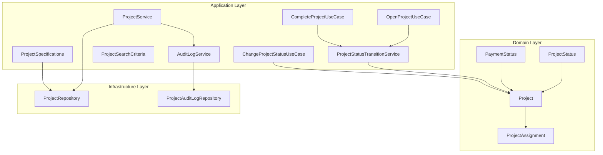
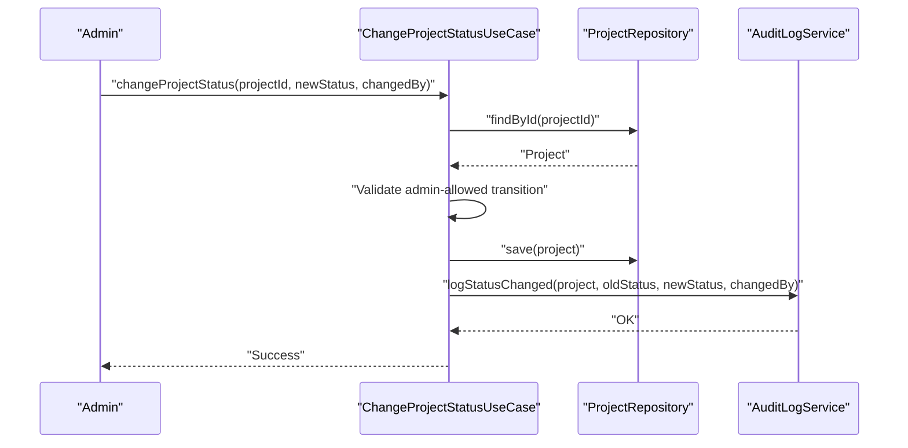
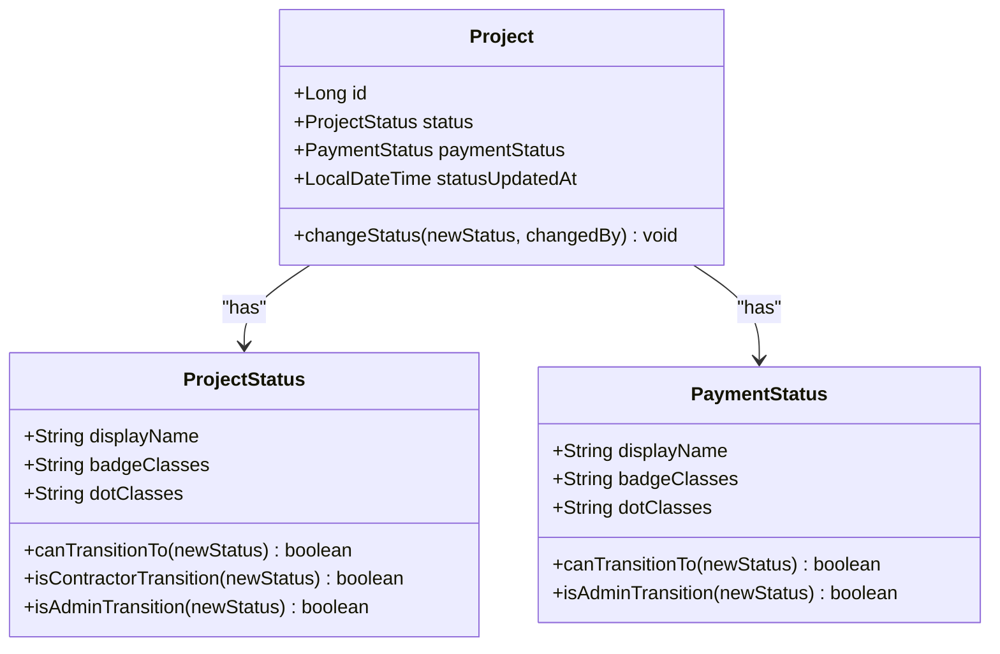
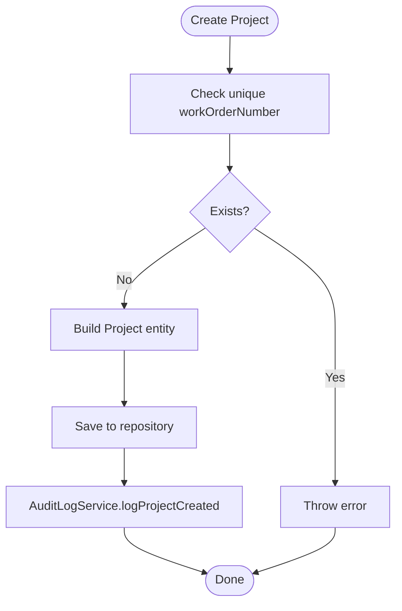
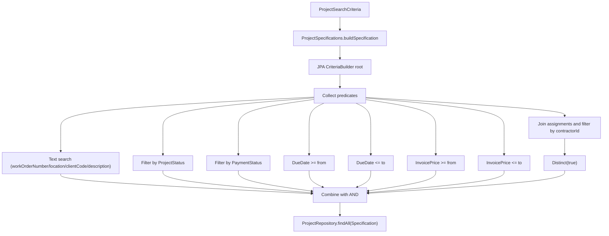
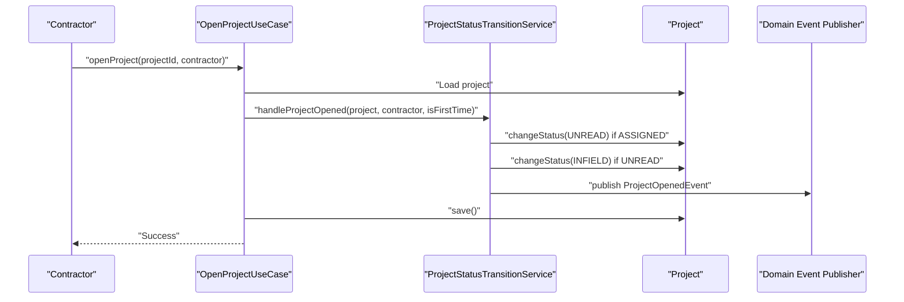
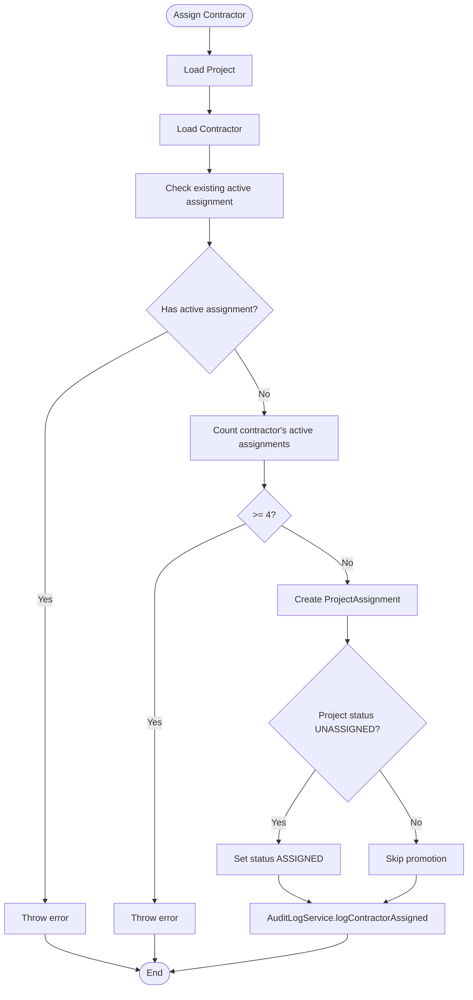
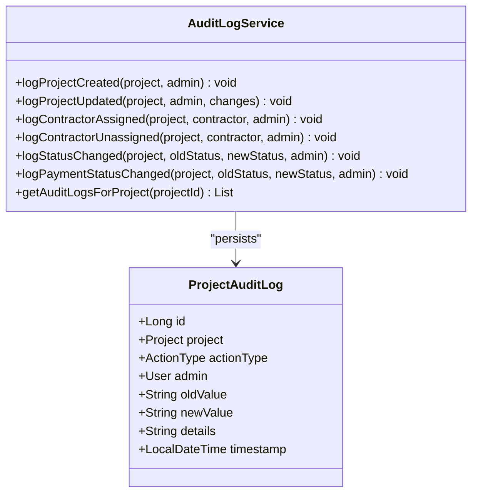
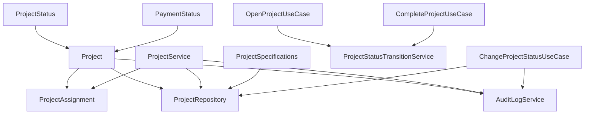

# Project Management

<cite>
**Referenced Files in This Document**
- [ProjectStatus.java](file://src/main/java/root/cyb/mh/skylink_media_service/domain/valueobjects/ProjectStatus.java)
- [Project.java](file://src/main/java/root/cyb/mh/skylink_media_service/domain/entities/Project.java)
- [ProjectAssignment.java](file://src/main/java/root/cyb/mh/skylink_media_service/domain/entities/ProjectAssignment.java)
- [ProjectService.java](file://src/main/java/root/cyb/mh/skylink_media_service/application/services/ProjectService.java)
- [ProjectSpecifications.java](file://src/main/java/root/cyb/mh/skylink_media_service/application/services/ProjectSpecifications.java)
- [ProjectSearchCriteria.java](file://src/main/java/root/cyb/mh/skylink_media_service/application/dto/ProjectSearchCriteria.java)
- [ProjectStatusTransitionService.java](file://src/main/java/root/cyb/mh/skylink_media_service/domain/services/ProjectStatusTransitionService.java)
- [ChangeProjectStatusUseCase.java](file://src/main/java/root/cyb/mh/skylink_media_service/application/usecases/ChangeProjectStatusUseCase.java)
- [CompleteProjectUseCase.java](file://src/main/java/root/cyb/mh/skylink_media_service/application/usecases/CompleteProjectUseCase.java)
- [OpenProjectUseCase.java](file://src/main/java/root/cyb/mh/skylink_media_service/application/usecases/OpenProjectUseCase.java)
- [ProjectRepository.java](file://src/main/java/root/cyb/mh/skylink_media_service/infrastructure/persistence/ProjectRepository.java)
- [AuditLogService.java](file://src/main/java/root/cyb/mh/skylink_media_service/application/services/AuditLogService.java)
- [ProjectAuditLog.java](file://src/main/java/root/cyb/mh/skylink_media_service/domain/entities/ProjectAuditLog.java)
- [ProjectAuditLogRepository.java](file://src/main/java/root/cyb/mh/skylink_media_service/infrastructure/persistence/ProjectAuditLogRepository.java)
- [InvalidStatusTransitionException.java](file://src/main/java/root/cyb/mh/skylink_media_service/domain/exceptions/InvalidStatusTransitionException.java)
- [PaymentStatus.java](file://src/main/java/root/cyb/mh/skylink_media_service/domain/valueobjects/PaymentStatus.java)
- [README.md](file://README.md)
</cite>

## Table of Contents
1. [Introduction](#introduction)
2. [Project Structure](#project-structure)
3. [Core Components](#core-components)
4. [Architecture Overview](#architecture-overview)
5. [Detailed Component Analysis](#detailed-component-analysis)
6. [Dependency Analysis](#dependency-analysis)
7. [Performance Considerations](#performance-considerations)
8. [Troubleshooting Guide](#troubleshooting-guide)
9. [Conclusion](#conclusion)
10. [Appendices](#appendices)

## Introduction
This document describes the project management system with a focus on the complete project lifecycle: creation, assignment, status tracking, and completion. It documents the ProjectService implementation covering CRUD operations, status transitions, and contractor assignments. It explains the ProjectStatusTransitionService business rules and validation logic, details the advanced search functionality using ProjectSpecifications for dynamic query building, and enumerates ProjectStatus and PaymentStatus values with allowed transitions. Practical workflows, status change scenarios, and audit trail generation are included, along with performance considerations for large datasets and search optimization.

## Project Structure
The system follows a layered architecture:
- Domain layer: Entities and value objects define the core model and business semantics.
- Application layer: Services and use cases orchestrate workflows and enforce business rules.
- Infrastructure layer: Repositories and persistence provide data access.
- Web layer: Controllers expose endpoints (refer to README for endpoint overview).

**Diagram sources**
- [Project.java:1-252](file://src/main/java/root/cyb/mh/skylink_media_service/domain/entities/Project.java#L1-L252)
- [ProjectAssignment.java:1-50](file://src/main/java/root/cyb/mh/skylink_media_service/domain/entities/ProjectAssignment.java#L1-L50)
- [ProjectStatus.java:1-54](file://src/main/java/root/cyb/mh/skylink_media_service/domain/valueobjects/ProjectStatus.java#L1-L54)
- [PaymentStatus.java:1-45](file://src/main/java/root/cyb/mh/skylink_media_service/domain/valueobjects/PaymentStatus.java#L1-L45)
- [ProjectService.java:1-419](file://src/main/java/root/cyb/mh/skylink_media_service/application/services/ProjectService.java#L1-L419)
- [ProjectStatusTransitionService.java:1-54](file://src/main/java/root/cyb/mh/skylink_media_service/domain/services/ProjectStatusTransitionService.java#L1-L54)
- [OpenProjectUseCase.java:1-52](file://src/main/java/root/cyb/mh/skylink_media_service/application/usecases/OpenProjectUseCase.java#L1-L52)
- [CompleteProjectUseCase.java:1-33](file://src/main/java/root/cyb/mh/skylink_media_service/application/usecases/CompleteProjectUseCase.java#L1-L33)
- [ChangeProjectStatusUseCase.java:1-97](file://src/main/java/root/cyb/mh/skylink_media_service/application/usecases/ChangeProjectStatusUseCase.java#L1-L97)
- [ProjectSearchCriteria.java:1-50](file://src/main/java/root/cyb/mh/skylink_media_service/application/dto/ProjectSearchCriteria.java#L1-L50)
- [ProjectSpecifications.java:1-63](file://src/main/java/root/cyb/mh/skylink_media_service/application/services/ProjectSpecifications.java#L1-L63)
- [AuditLogService.java:1-317](file://src/main/java/root/cyb/mh/skylink_media_service/application/services/AuditLogService.java#L1-L317)
- [ProjectRepository.java:1-24](file://src/main/java/root/cyb/mh/skylink_media_service/infrastructure/persistence/ProjectRepository.java#L1-L24)
- [ProjectAuditLogRepository.java:1-34](file://src/main/java/root/cyb/mh/skylink_media_service/infrastructure/persistence/ProjectAuditLogRepository.java#L1-L34)

**Section sources**
- [README.md:102-116](file://README.md#L102-L116)

## Core Components
- Project entity encapsulates lifecycle fields (status, payment status, timestamps) and enforces status transitions via ProjectStatus rules.
- ProjectStatus defines allowed transitions and distinguishes contractor/admin-managed transitions.
- ProjectService orchestrates CRUD, contractor assignment/unassignment, availability checks, and advanced search.
- ProjectSpecifications builds dynamic JPA Specifications for advanced filtering.
- ProjectStatusTransitionService handles automatic contractor-driven status changes and publishes domain events.
- Use cases coordinate admin actions (status updates, payment status changes) and contractor actions (open project, complete project).
- AuditLogService centralizes audit trails for all lifecycle events.

**Section sources**
- [Project.java:185-251](file://src/main/java/root/cyb/mh/skylink_media_service/domain/entities/Project.java#L185-L251)
- [ProjectStatus.java:25-52](file://src/main/java/root/cyb/mh/skylink_media_service/domain/valueobjects/ProjectStatus.java#L25-L52)
- [ProjectService.java:60-419](file://src/main/java/root/cyb/mh/skylink_media_service/application/services/ProjectService.java#L60-L419)
- [ProjectSpecifications.java:15-61](file://src/main/java/root/cyb/mh/skylink_media_service/application/services/ProjectSpecifications.java#L15-L61)
- [ProjectStatusTransitionService.java:21-52](file://src/main/java/root/cyb/mh/skylink_media_service/domain/services/ProjectStatusTransitionService.java#L21-L52)
- [OpenProjectUseCase.java:26-50](file://src/main/java/root/cyb/mh/skylink_media_service/application/usecases/OpenProjectUseCase.java#L26-L50)
- [CompleteProjectUseCase.java:21-31](file://src/main/java/root/cyb/mh/skylink_media_service/application/usecases/CompleteProjectUseCase.java#L21-L31)
- [ChangeProjectStatusUseCase.java:29-95](file://src/main/java/root/cyb/mh/skylink_media_service/application/usecases/ChangeProjectStatusUseCase.java#L29-L95)
- [AuditLogService.java:35-178](file://src/main/java/root/cyb/mh/skylink_media_service/application/services/AuditLogService.java#L35-L178)

## Architecture Overview
The system separates concerns across layers:
- Domain enforces business invariants (transitions, availability).
- Application services encapsulate workflows and audit.
- Infrastructure repositories provide persistence and specification-based queries.
- Use cases coordinate operations triggered by controllers.

**Diagram sources**
- [ChangeProjectStatusUseCase.java:29-53](file://src/main/java/root/cyb/mh/skylink_media_service/application/usecases/ChangeProjectStatusUseCase.java#L29-L53)
- [ProjectRepository.java:13-23](file://src/main/java/root/cyb/mh/skylink_media_service/infrastructure/persistence/ProjectRepository.java#L13-L23)
- [AuditLogService.java:122-137](file://src/main/java/root/cyb/mh/skylink_media_service/application/services/AuditLogService.java#L122-L137)

## Detailed Component Analysis

### Project Lifecycle and Status Model
ProjectStatus defines the allowed state machine and transition rules. PaymentStatus governs financial state progression.

**Diagram sources**
- [ProjectStatus.java:3-54](file://src/main/java/root/cyb/mh/skylink_media_service/domain/valueobjects/ProjectStatus.java#L3-L54)
- [PaymentStatus.java:3-45](file://src/main/java/root/cyb/mh/skylink_media_service/domain/valueobjects/PaymentStatus.java#L3-L45)
- [Project.java:211-245](file://src/main/java/root/cyb/mh/skylink_media_service/domain/entities/Project.java#L211-L245)

**Section sources**
- [ProjectStatus.java:25-52](file://src/main/java/root/cyb/mh/skylink_media_service/domain/valueobjects/ProjectStatus.java#L25-L52)
- [PaymentStatus.java:29-43](file://src/main/java/root/cyb/mh/skylink_media_service/domain/valueobjects/PaymentStatus.java#L29-L43)
- [Project.java:229-236](file://src/main/java/root/cyb/mh/skylink_media_service/domain/entities/Project.java#L229-L236)

### ProjectService: CRUD, Assignment, Availability, Search
Key responsibilities:
- Create/update projects with validation and audit logging.
- Assign/unassign contractors with business rules (max 4 active per contractor, single active assignment except CLOSED).
- Availability checks for assignment and active project counts.
- Advanced search via JPA Specifications.

**Diagram sources**
- [ProjectService.java:60-98](file://src/main/java/root/cyb/mh/skylink_media_service/application/services/ProjectService.java#L60-L98)
- [AuditLogService.java:35-55](file://src/main/java/root/cyb/mh/skylink_media_service/application/services/AuditLogService.java#L35-L55)

**Section sources**
- [ProjectService.java:60-98](file://src/main/java/root/cyb/mh/skylink_media_service/application/services/ProjectService.java#L60-L98)
- [ProjectService.java:109-161](file://src/main/java/root/cyb/mh/skylink_media_service/application/services/ProjectService.java#L109-L161)
- [ProjectService.java:167-196](file://src/main/java/root/cyb/mh/skylink_media_service/application/services/ProjectService.java#L167-L196)
- [ProjectService.java:328-335](file://src/main/java/root/cyb/mh/skylink_media_service/application/services/ProjectService.java#L328-L335)

### Advanced Search with ProjectSpecifications
Dynamic query building supports text search across key fields, filters by status/payment status, due date range, price range, and contractor assignment.

**Diagram sources**
- [ProjectSearchCriteria.java:8-49](file://src/main/java/root/cyb/mh/skylink_media_service/application/dto/ProjectSearchCriteria.java#L8-L49)
- [ProjectSpecifications.java:15-61](file://src/main/java/root/cyb/mh/skylink_media_service/application/services/ProjectSpecifications.java#L15-L61)
- [ProjectRepository.java:13-23](file://src/main/java/root/cyb/mh/skylink_media_service/infrastructure/persistence/ProjectRepository.java#L13-L23)

**Section sources**
- [ProjectSpecifications.java:15-61](file://src/main/java/root/cyb/mh/skylink_media_service/application/services/ProjectSpecifications.java#L15-L61)
- [ProjectSearchCriteria.java:20-24](file://src/main/java/root/cyb/mh/skylink_media_service/application/dto/ProjectSearchCriteria.java#L20-L24)
- [ProjectRepository.java:17-22](file://src/main/java/root/cyb/mh/skylink_media_service/infrastructure/persistence/ProjectRepository.java#L17-L22)

### Status Transition Rules and Events
ProjectStatusTransitionService enforces automatic contractor-driven transitions and publishes domain events. Admins can override specific transitions from READY_TO_OFFICE.

**Diagram sources**
- [OpenProjectUseCase.java:26-50](file://src/main/java/root/cyb/mh/skylink_media_service/application/usecases/OpenProjectUseCase.java#L26-L50)
- [ProjectStatusTransitionService.java:21-32](file://src/main/java/root/cyb/mh/skylink_media_service/domain/services/ProjectStatusTransitionService.java#L21-L32)
- [Project.java:229-236](file://src/main/java/root/cyb/mh/skylink_media_service/domain/entities/Project.java#L229-L236)

**Section sources**
- [ProjectStatusTransitionService.java:21-47](file://src/main/java/root/cyb/mh/skylink_media_service/domain/services/ProjectStatusTransitionService.java#L21-L47)
- [OpenProjectUseCase.java:26-50](file://src/main/java/root/cyb/mh/skylink_media_service/application/usecases/OpenProjectUseCase.java#L26-L50)
- [CompleteProjectUseCase.java:21-31](file://src/main/java/root/cyb/mh/skylink_media_service/application/usecases/CompleteProjectUseCase.java#L21-L31)

### Contractor Assignment and Availability
Business rules enforced:
- One contractor can handle up to 4 active projects.
- Projects can only have one active contractor assignment (except CLOSED).
- Automatic status promotion from UNASSIGNED to ASSIGNED upon first assignment.

**Diagram sources**
- [ProjectService.java:109-161](file://src/main/java/root/cyb/mh/skylink_media_service/application/services/ProjectService.java#L109-L161)
- [AuditLogService.java:80-96](file://src/main/java/root/cyb/mh/skylink_media_service/application/services/AuditLogService.java#L80-L96)

**Section sources**
- [ProjectService.java:109-161](file://src/main/java/root/cyb/mh/skylink_media_service/application/services/ProjectService.java#L109-L161)
- [ProjectService.java:355-361](file://src/main/java/root/cyb/mh/skylink_media_service/application/services/ProjectService.java#L355-L361)

### Audit Trail Generation
AuditLogService captures all lifecycle events with structured details and JSON serialization of change sets.

**Diagram sources**
- [AuditLogService.java:35-178](file://src/main/java/root/cyb/mh/skylink_media_service/application/services/AuditLogService.java#L35-L178)
- [ProjectAuditLog.java:18-102](file://src/main/java/root/cyb/mh/skylink_media_service/domain/entities/ProjectAuditLog.java#L18-L102)

**Section sources**
- [AuditLogService.java:35-178](file://src/main/java/root/cyb/mh/skylink_media_service/application/services/AuditLogService.java#L35-L178)
- [ProjectAuditLogRepository.java:17-32](file://src/main/java/root/cyb/mh/skylink_media_service/infrastructure/persistence/ProjectAuditLogRepository.java#L17-L32)

### Practical Workflows and Scenarios
- Admin creates a project and assigns a contractor; status moves from UNASSIGNED to ASSIGNED.
- Contractor opens the project for the first time; status moves UNASSIGNED→UNREAD, then UNREAD→INFIELD.
- Contractor completes the project; status moves INFIELD→READY_TO_OFFICE.
- Admin can finalize or request rework from READY_TO_OFFICE (CLOSED or INFIELD).
- Payment status progresses UNPAID→PARTIAL→PAID with forward-only transitions.

**Section sources**
- [ProjectStatusTransitionService.java:21-47](file://src/main/java/root/cyb/mh/skylink_media_service/domain/services/ProjectStatusTransitionService.java#L21-L47)
- [ChangeProjectStatusUseCase.java:29-53](file://src/main/java/root/cyb/mh/skylink_media_service/application/usecases/ChangeProjectStatusUseCase.java#L29-L53)
- [PaymentStatus.java:29-35](file://src/main/java/root/cyb/mh/skylink_media_service/domain/valueobjects/PaymentStatus.java#L29-L35)

## Dependency Analysis
The following diagram highlights key dependencies among core components.

**Diagram sources**
- [Project.java:185-251](file://src/main/java/root/cyb/mh/skylink_media_service/domain/entities/Project.java#L185-L251)
- [ProjectAssignment.java:1-50](file://src/main/java/root/cyb/mh/skylink_media_service/domain/entities/ProjectAssignment.java#L1-L50)
- [ProjectRepository.java:13-23](file://src/main/java/root/cyb/mh/skylink_media_service/infrastructure/persistence/ProjectRepository.java#L13-L23)
- [ProjectService.java:36-58](file://src/main/java/root/cyb/mh/skylink_media_service/application/services/ProjectService.java#L36-L58)
- [ProjectSpecifications.java:15-61](file://src/main/java/root/cyb/mh/skylink_media_service/application/services/ProjectSpecifications.java#L15-L61)
- [OpenProjectUseCase.java:24-49](file://src/main/java/root/cyb/mh/skylink_media_service/application/usecases/OpenProjectUseCase.java#L24-L49)
- [CompleteProjectUseCase.java:19-30](file://src/main/java/root/cyb/mh/skylink_media_service/application/usecases/CompleteProjectUseCase.java#L19-L30)
- [ChangeProjectStatusUseCase.java:19-49](file://src/main/java/root/cyb/mh/skylink_media_service/application/usecases/ChangeProjectStatusUseCase.java#L19-L49)

**Section sources**
- [Project.java:185-251](file://src/main/java/root/cyb/mh/skylink_media_service/domain/entities/Project.java#L185-L251)
- [ProjectService.java:36-58](file://src/main/java/root/cyb/mh/skylink_media_service/application/services/ProjectService.java#L36-L58)
- [ProjectSpecifications.java:15-61](file://src/main/java/root/cyb/mh/skylink_media_service/application/services/ProjectSpecifications.java#L15-L61)

## Performance Considerations
- Indexes: ProjectAuditLog includes indexes on project_id, timestamp, and admin_id to optimize audit queries.
- Specification distinct: When filtering by contractor assignment, distinct is applied to avoid duplicates.
- Text search: Database-backed LIKE queries are used; consider adding GIN/GiST indexes on text columns for large datasets.
- Pagination: Use pagination in repository queries for large result sets.
- Caching: Consider caching frequently accessed metadata (e.g., status counts) to reduce DB load.
- Batch operations: For bulk updates (e.g., status changes), batch requests to minimize round-trips.

**Section sources**
- [ProjectAuditLog.java:11-15](file://src/main/java/root/cyb/mh/skylink_media_service/domain/entities/ProjectAuditLog.java#L11-L15)
- [ProjectSpecifications.java:56-57](file://src/main/java/root/cyb/mh/skylink_media_service/application/services/ProjectSpecifications.java#L56-L57)
- [ProjectRepository.java:17-22](file://src/main/java/root/cyb/mh/skylink_media_service/infrastructure/persistence/ProjectRepository.java#L17-L22)

## Troubleshooting Guide
Common issues and resolutions:
- Invalid status transition: Throws a domain exception indicating the invalid move; verify allowed transitions in ProjectStatus.
- Contractor assignment errors: Ensure contractor has fewer than 4 active projects and the project is not already actively assigned (unless CLOSED).
- Duplicate work order number: Creation/update validates uniqueness; adjust the work order number accordingly.
- Contractor unassignment from CLOSED project: Not permitted; close the project or adjust business rules.
- Audit log retrieval: Use ProjectAuditLogRepository methods to fetch logs by project, admin, or action type.

**Section sources**
- [InvalidStatusTransitionException.java:3-11](file://src/main/java/root/cyb/mh/skylink_media_service/domain/exceptions/InvalidStatusTransitionException.java#L3-L11)
- [ProjectService.java:109-161](file://src/main/java/root/cyb/mh/skylink_media_service/application/services/ProjectService.java#L109-L161)
- [ProjectService.java:167-196](file://src/main/java/root/cyb/mh/skylink_media_service/application/services/ProjectService.java#L167-L196)
- [ProjectAuditLogRepository.java:17-32](file://src/main/java/root/cyb/mh/skylink_media_service/infrastructure/persistence/ProjectAuditLogRepository.java#L17-L32)

## Conclusion
The project management system enforces a strict, auditable lifecycle with robust contractor assignment rules, automatic status transitions, and comprehensive search capabilities. The separation of concerns across domain, application, and infrastructure layers ensures maintainability and scalability. Adopting the recommended performance practices will further enhance system responsiveness for large datasets.

## Appendices

### Allowed ProjectStatus Transitions
- UNASSIGNED → ASSIGNED
- ASSIGNED → UNREAD
- UNREAD → INFIELD
- INFIELD → READY_TO_OFFICE
- READY_TO_OFFICE → CLOSED or INFIELD
- CLOSED → terminal (no further transitions)

**Section sources**
- [ProjectStatus.java:25-34](file://src/main/java/root/cyb/mh/skylink_media_service/domain/valueobjects/ProjectStatus.java#L25-L34)

### PaymentStatus Progression
- UNPAID → PARTIAL or PAID
- PARTIAL → PAID
- PAID → terminal (no further transitions)

**Section sources**
- [PaymentStatus.java:29-35](file://src/main/java/root/cyb/mh/skylink_media_service/domain/valueobjects/PaymentStatus.java#L29-L35)