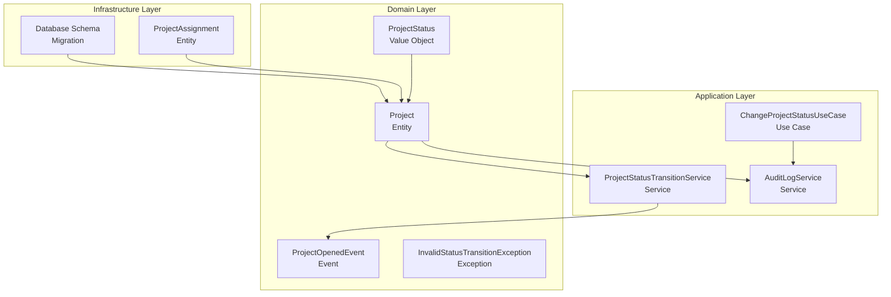
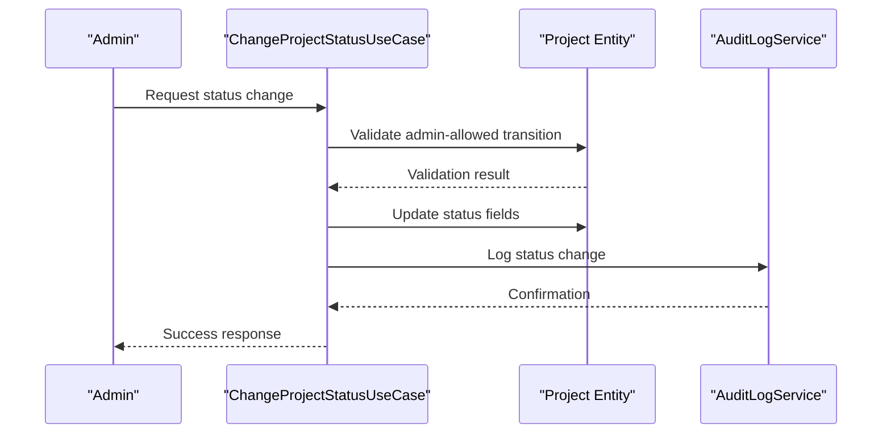
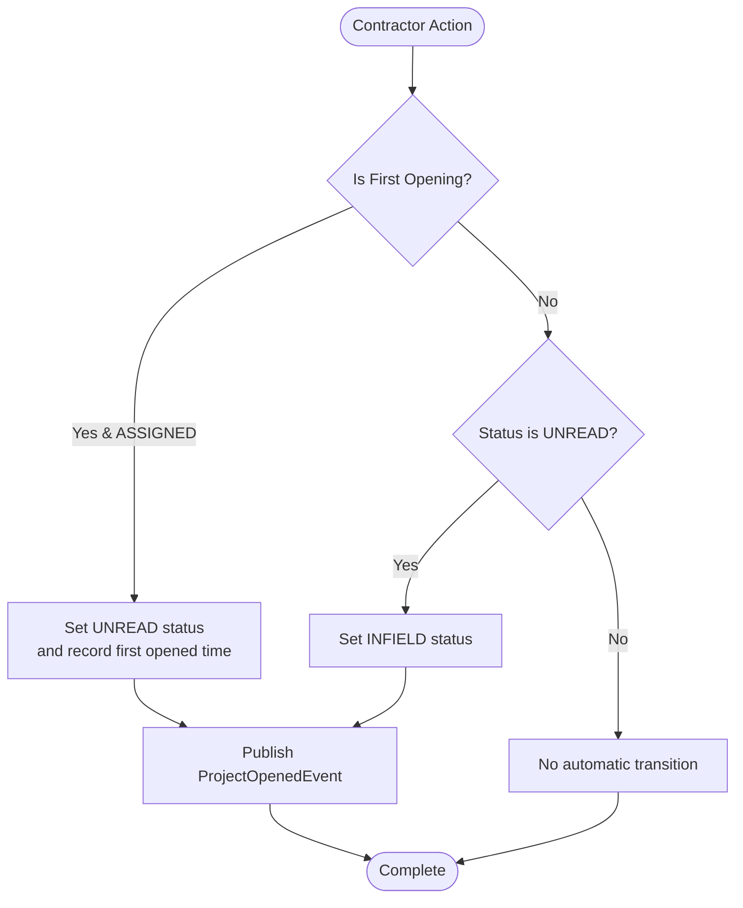
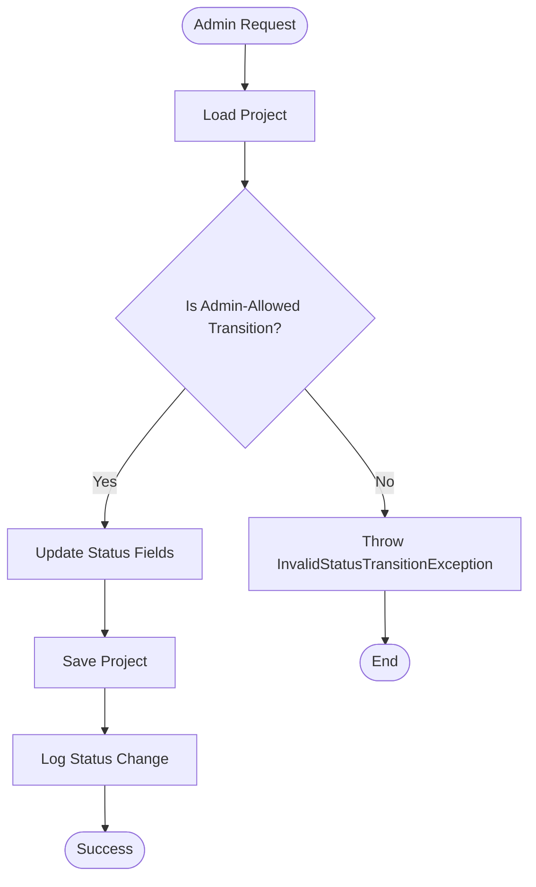
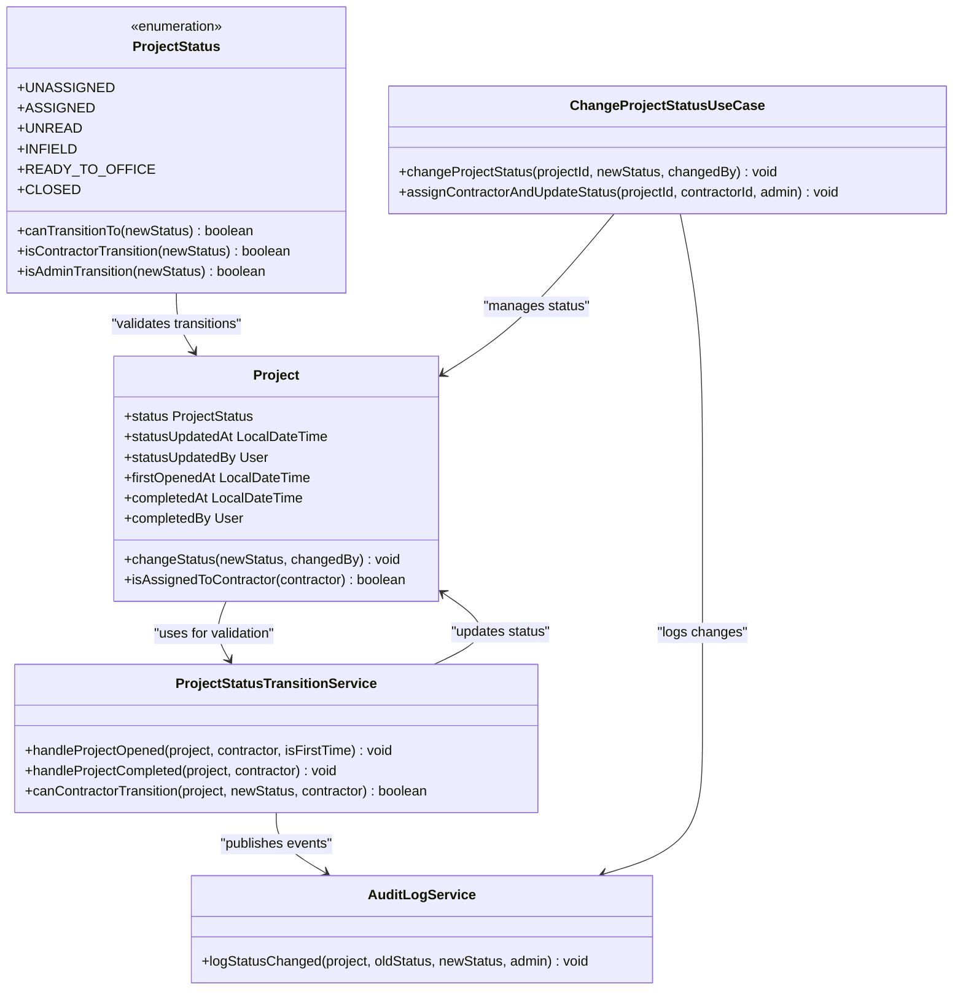

# Project Status Management

<cite>
**Referenced Files in This Document**
- [ProjectStatus.java](file://skylink-media-service-backend/src/main/java/root/cyb/mh/skylink_media_service/domain/valueobjects/ProjectStatus.java)
- [ProjectStatusTransitionService.java](file://skylink-media-service-backend/src/main/java/root/cyb/mh/skylink_media_service/domain/services/ProjectStatusTransitionService.java)
- [ChangeProjectStatusUseCase.java](file://skylink-media-service-backend/src/main/java/root/cyb/mh/skylink_media_service/application/usecases/ChangeProjectStatusUseCase.java)
- [Project.java](file://skylink-media-service-backend/src/main/java/root/cyb/mh/skylink_media_service/domain/entities/Project.java)
- [InvalidStatusTransitionException.java](file://skylink-media-service-backend/src/main/java/root/cyb/mh/skylink_media_service/domain/exceptions/InvalidStatusTransitionException.java)
- [PaymentStatus.java](file://skylink-media-service-backend/src/main/java/root/cyb/mh/skylink_media_service/domain/valueobjects/PaymentStatus.java)
- [ProjectAssignment.java](file://skylink-media-service-backend/src/main/java/root/cyb/mh/skylink_media_service/domain/entities/ProjectAssignment.java)
- [AuditLogService.java](file://skylink-media-service-backend/src/main/java/root/cyb/mh/skylink_media_service/application/services/AuditLogService.java)
- [ProjectOpenedEvent.java](file://skylink-media-service-backend/src/main/java/root/cyb/mh/skylink_media_service/domain/events/ProjectOpenedEvent.java)
- [status-management-migration.sql](file://skylink-media-service-backend/status-management-migration.sql)
</cite>

## Table of Contents
1. [Introduction](#introduction)
2. [Project Structure](#project-structure)
3. [Core Components](#core-components)
4. [Architecture Overview](#architecture-overview)
5. [Detailed Component Analysis](#detailed-component-analysis)
6. [Dependency Analysis](#dependency-analysis)
7. [Performance Considerations](#performance-considerations)
8. [Troubleshooting Guide](#troubleshooting-guide)
9. [Conclusion](#conclusion)
10. [Appendices](#appendices)

## Introduction
This document provides comprehensive documentation for project status management and transition rules within the Skylink Media Service backend. It covers the ProjectStatus enum values, the ProjectStatusTransitionService business logic, allowed status transitions, validation matrices, business rule enforcement, exception handling, automatic status updates during contractor assignment/unassignment operations, audit trail generation, and integration with project lifecycle operations. Edge cases and boundary conditions are addressed to ensure robust status management across the system.

## Project Structure
The project status management functionality is implemented across several key components:
- Value objects define the status enumeration and validation rules
- Domain entities encapsulate status fields and validation logic
- Services orchestrate status transitions and publish events
- Use cases enforce administrative controls and audit logging
- Events capture lifecycle changes for downstream processing
- Audit logging persists status change history
- Database migrations define persistent state and indexes

**Diagram sources**
- [ProjectStatus.java:1-54](file://skylink-media-service-backend/src/main/java/root/cyb/mh/skylink_media_service/domain/valueobjects/ProjectStatus.java#L1-L54)
- [Project.java:1-262](file://skylink-media-service-backend/src/main/java/root/cyb/mh/skylink_media_service/domain/entities/Project.java#L1-L262)
- [ProjectStatusTransitionService.java:1-54](file://skylink-media-service-backend/src/main/java/root/cyb/mh/skylink_media_service/domain/services/ProjectStatusTransitionService.java#L1-L54)
- [ChangeProjectStatusUseCase.java:1-97](file://skylink-media-service-backend/src/main/java/root/cyb/mh/skylink_media_service/application/usecases/ChangeProjectStatusUseCase.java#L1-L97)
- [AuditLogService.java:1-317](file://skylink-media-service-backend/src/main/java/root/cyb/mh/skylink_media_service/application/services/AuditLogService.java#L1-L317)
- [ProjectOpenedEvent.java:1-25](file://skylink-media-service-backend/src/main/java/root/cyb/mh/skylink_media_service/domain/events/ProjectOpenedEvent.java#L1-L25)
- [ProjectAssignment.java:1-50](file://skylink-media-service-backend/src/main/java/root/cyb/mh/skylink_media_service/domain/entities/ProjectAssignment.java#L1-L50)
- [status-management-migration.sql:1-31](file://skylink-media-service-backend/status-management-migration.sql#L1-L31)

**Section sources**
- [ProjectStatus.java:1-54](file://skylink-media-service-backend/src/main/java/root/cyb/mh/skylink_media_service/domain/valueobjects/ProjectStatus.java#L1-L54)
- [Project.java:1-262](file://skylink-media-service-backend/src/main/java/root/cyb/mh/skylink_media_service/domain/entities/Project.java#L1-L262)
- [ProjectStatusTransitionService.java:1-54](file://skylink-media-service-backend/src/main/java/root/cyb/mh/skylink_media_service/domain/services/ProjectStatusTransitionService.java#L1-L54)
- [ChangeProjectStatusUseCase.java:1-97](file://skylink-media-service-backend/src/main/java/root/cyb/mh/skylink_media_service/application/usecases/ChangeProjectStatusUseCase.java#L1-L97)
- [AuditLogService.java:1-317](file://skylink-media-service-backend/src/main/java/root/cyb/mh/skylink_media_service/application/services/AuditLogService.java#L1-L317)
- [ProjectOpenedEvent.java:1-25](file://skylink-media-service-backend/src/main/java/root/cyb/mh/skylink_media_service/domain/events/ProjectOpenedEvent.java#L1-L25)
- [ProjectAssignment.java:1-50](file://skylink-media-service-backend/src/main/java/root/cyb/mh/skylink_media_service/domain/entities/ProjectAssignment.java#L1-L50)
- [status-management-migration.sql:1-31](file://skylink-media-service-backend/status-management-migration.sql#L1-L31)

## Core Components
This section documents the fundamental building blocks of the status management system.

### ProjectStatus Enum
The ProjectStatus enum defines the complete lifecycle of a project with five distinct states:
- UNASSIGNED: Initial state for newly created projects
- ASSIGNED: Project assigned to a contractor
- UNREAD: Contractor has opened the project for the first time
- INFIELD: Contractor is actively working on the project
- READY_TO_OFFICE: Project completion preparation phase
- CLOSED: Final state indicating project completion

Each state includes metadata for UI presentation and validation logic for allowed transitions.

**Section sources**
- [ProjectStatus.java:3-9](file://skylink-media-service-backend/src/main/java/root/cyb/mh/skylink_media_service/domain/valueobjects/ProjectStatus.java#L3-L9)

### Transition Validation Logic
The transition validation system enforces strict business rules through two primary methods:
- `canTransitionTo(newStatus)`: Validates if a direct transition is permitted
- `isContractorTransition(newStatus)`: Identifies contractor-initiated transitions
- `isAdminTransition(newStatus)`: Identifies admin-managed transitions requiring explicit approval

These methods ensure that only authorized transitions occur based on the current state and actor type.

**Section sources**
- [ProjectStatus.java:25-52](file://skylink-media-service-backend/src/main/java/root/cyb/mh/skylink_media_service/domain/valueobjects/ProjectStatus.java#L25-L52)

### Project Entity Status Management
The Project entity encapsulates status-related fields and validation logic:
- Status tracking fields: current status, last update timestamp, and updater
- Assignment tracking: contractor assignments and first-opened timestamps
- Validation: centralized validation through `changeStatus()` method
- Helper methods: contractor assignment verification and retrieval

**Section sources**
- [Project.java:185-260](file://skylink-media-service-backend/src/main/java/root/cyb/mh/skylink_media_service/domain/entities/Project.java#L185-L260)

### Exception Handling
The system uses a dedicated exception type for invalid status transitions, providing clear error messages that include current and target states for debugging and user feedback.

**Section sources**
- [InvalidStatusTransitionException.java:1-12](file://skylink-media-service-backend/src/main/java/root/cyb/mh/skylink_media_service/domain/exceptions/InvalidStatusTransitionException.java#L1-L12)

## Architecture Overview
The status management architecture follows a layered approach with clear separation of concerns:

**Diagram sources**
- [ChangeProjectStatusUseCase.java:29-53](file://skylink-media-service-backend/src/main/java/root/cyb/mh/skylink_media_service/application/usecases/ChangeProjectStatusUseCase.java#L29-L53)
- [Project.java:229-236](file://skylink-media-service-backend/src/main/java/root/cyb/mh/skylink_media_service/domain/entities/Project.java#L229-L236)
- [AuditLogService.java:122-137](file://skylink-media-service-backend/src/main/java/root/cyb/mh/skylink_media_service/application/services/AuditLogService.java#L122-L137)

The architecture ensures that:
- Business rules are enforced at the domain level
- Administrative controls are implemented in use cases
- All changes are audited for compliance and traceability
- Events are published for downstream processing

## Detailed Component Analysis

### ProjectStatusTransitionService
This service orchestrates contractor-driven status transitions and handles automatic state changes based on contractor actions.

#### Key Responsibilities
- Automatic transition handling for contractor project opening
- Completion validation and state progression
- Contractor transition validation
- Event publishing for lifecycle tracking

#### Automatic Transition Workflows
The service implements intelligent automatic transitions:
1. First-time contractor opening: ASSIGNED → UNREAD → INFIELD
2. Subsequent openings: UNREAD → INFIELD
3. Completion handling: INFIELD → READY_TO_OFFICE with completion metadata

**Diagram sources**
- [ProjectStatusTransitionService.java:21-32](file://skylink-media-service-backend/src/main/java/root/cyb/mh/skylink_media_service/domain/services/ProjectStatusTransitionService.java#L21-L32)

**Section sources**
- [ProjectStatusTransitionService.java:12-54](file://skylink-media-service-backend/src/main/java/root/cyb/mh/skylink_media_service/domain/services/ProjectStatusTransitionService.java#L12-L54)

### ChangeProjectStatusUseCase
This use case enforces administrative controls over project status changes, allowing only specific transitions that require manual approval.

#### Administrative Transition Rules
Administrators can manually set:
- INFIELD: For contractor rework or corrections
- CLOSED: For final project closure

All other transitions are handled automatically by the system to prevent unauthorized status manipulation.

**Diagram sources**
- [ChangeProjectStatusUseCase.java:29-53](file://skylink-media-service-backend/src/main/java/root/cyb/mh/skylink_media_service/application/usecases/ChangeProjectStatusUseCase.java#L29-L53)

**Section sources**
- [ChangeProjectStatusUseCase.java:14-97](file://skylink-media-service-backend/src/main/java/root/cyb/mh/skylink_media_service/application/usecases/ChangeProjectStatusUseCase.java#L14-L97)

### Audit Trail Generation
The system maintains comprehensive audit trails for all status changes through the AuditLogService, which captures:
- Status change events with old/new status values
- Timestamps and actor information
- Detailed change descriptions for compliance reporting

**Section sources**
- [AuditLogService.java:122-137](file://skylink-media-service-backend/src/main/java/root/cyb/mh/skylink_media_service/application/services/AuditLogService.java#L122-L137)

### Database Schema and Indexes
The migration script establishes the foundation for status tracking:
- Status and payment status columns with default values
- Timestamp tracking for status updates
- Foreign key relationships for status update actors
- Performance indexes for status queries

**Section sources**
- [status-management-migration.sql:4-31](file://skylink-media-service-backend/status-management-migration.sql#L4-L31)

## Dependency Analysis
The status management system exhibits clean dependency relationships with minimal coupling between components.

**Diagram sources**
- [ProjectStatus.java:1-54](file://skylink-media-service-backend/src/main/java/root/cyb/mh/skylink_media_service/domain/valueobjects/ProjectStatus.java#L1-L54)
- [Project.java:1-262](file://skylink-media-service-backend/src/main/java/root/cyb/mh/skylink_media_service/domain/entities/Project.java#L1-L262)
- [ProjectStatusTransitionService.java:1-54](file://skylink-media-service-backend/src/main/java/root/cyb/mh/skylink_media_service/domain/services/ProjectStatusTransitionService.java#L1-L54)
- [ChangeProjectStatusUseCase.java:1-97](file://skylink-media-service-backend/src/main/java/root/cyb/mh/skylink_media_service/application/usecases/ChangeProjectStatusUseCase.java#L1-L97)
- [AuditLogService.java:1-317](file://skylink-media-service-backend/src/main/java/root/cyb/mh/skylink_media_service/application/services/AuditLogService.java#L1-L317)

**Section sources**
- [ProjectStatus.java:1-54](file://skylink-media-service-backend/src/main/java/root/cyb/mh/skylink_media_service/domain/valueobjects/ProjectStatus.java#L1-L54)
- [Project.java:1-262](file://skylink-media-service-backend/src/main/java/root/cyb/mh/skylink_media_service/domain/entities/Project.java#L1-L262)
- [ProjectStatusTransitionService.java:1-54](file://skylink-media-service-backend/src/main/java/root/cyb/mh/skylink_media_service/domain/services/ProjectStatusTransitionService.java#L1-L54)
- [ChangeProjectStatusUseCase.java:1-97](file://skylink-media-service-backend/src/main/java/root/cyb/mh/skylink_media_service/application/usecases/ChangeProjectStatusUseCase.java#L1-L97)
- [AuditLogService.java:1-317](file://skylink-media-service-backend/src/main/java/root/cyb/mh/skylink_media_service/application/services/AuditLogService.java#L1-L317)

## Performance Considerations
The status management system incorporates several performance optimizations:
- Database indexes on status and payment status columns for efficient filtering
- Minimal object graph traversal through centralized validation methods
- Event-driven architecture reducing synchronous processing overhead
- Transaction boundaries limiting database contention

## Troubleshooting Guide

### Common Transition Errors
The system throws specific exceptions for invalid status transitions:
- InvalidStatusTransitionException: Indicates forbidden state changes
- Business rule violations: Prevent unauthorized administrative actions
- Contracting assignment errors: Ensure contractor has proper permissions

### Debugging Status Issues
Key diagnostic steps:
1. Verify current project status in database
2. Check contractor assignment relationships
3. Review audit logs for recent status changes
4. Validate business rules compliance

**Section sources**
- [InvalidStatusTransitionException.java:3-11](file://skylink-media-service-backend/src/main/java/root/cyb/mh/skylink_media_service/domain/exceptions/InvalidStatusTransitionException.java#L3-L11)

## Conclusion
The project status management system provides a robust, auditable framework for tracking project lifecycle states. Through clear business rules, automated transitions, and comprehensive audit logging, it ensures compliance while maintaining operational efficiency. The modular design enables future enhancements while preserving backward compatibility.

## Appendices

### Allowed Status Transitions Matrix
| Current State | Allowed Next States | Transition Type |
|---------------|-------------------|-----------------|
| UNASSIGNED | ASSIGNED | Administrative |
| ASSIGNED | UNREAD | Automatic (Contractor) |
| UNREAD | INFIELD | Automatic (Contractor) |
| INFIELD | READY_TO_OFFICE | Automatic (Completion) |
| READY_TO_OFFICE | CLOSED, INFIELD | Administrative |
| CLOSED | None | Terminal |

### Administrative Controls
Administrators can manually set:
- INFIELD: For contractor rework
- CLOSED: For final project closure

All other transitions are handled automatically to prevent unauthorized status manipulation.

### Contractor Assignment/Unassignment
- Assignment: UNASSIGNED → ASSIGNED (automatic)
- Unassignment: No direct status change (handled through business logic)
- First-time opening: ASSIGNED → UNREAD → INFIELD (automatic)
- Subsequent openings: UNREAD → INFIELD (automatic)

### Audit Trail Fields
- Old status value
- New status value  
- Actor who made the change
- Timestamp of change
- Associated contractor (when applicable)