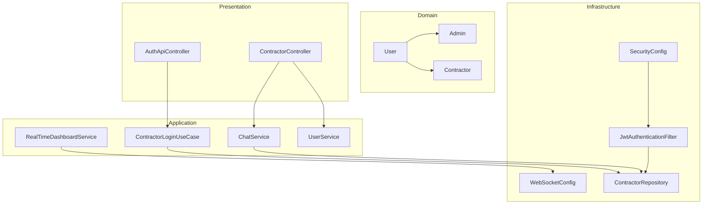
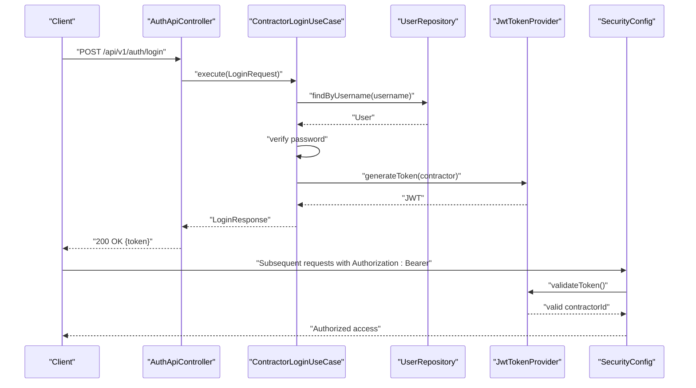
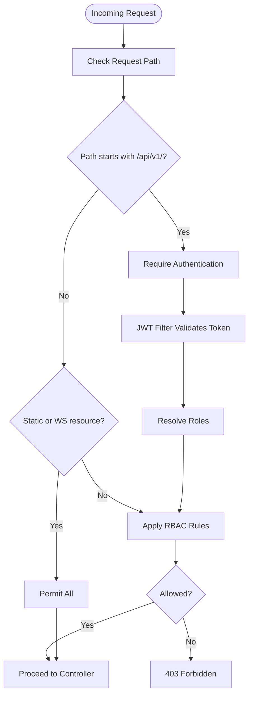
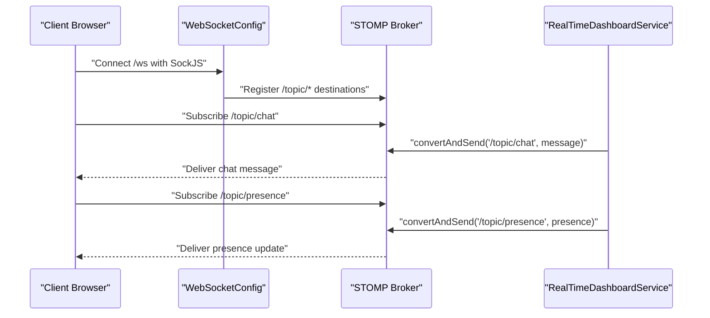
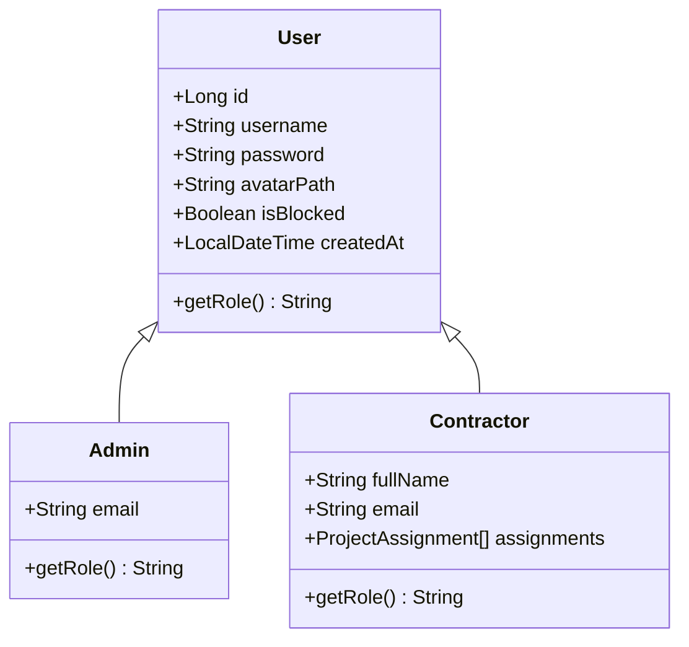
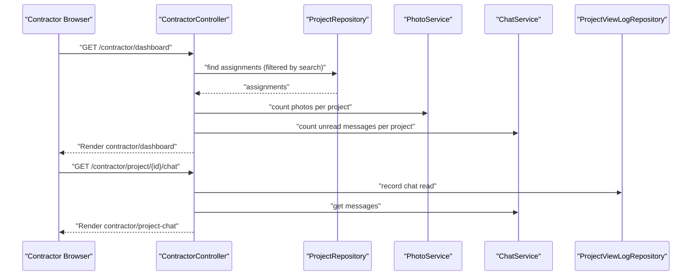
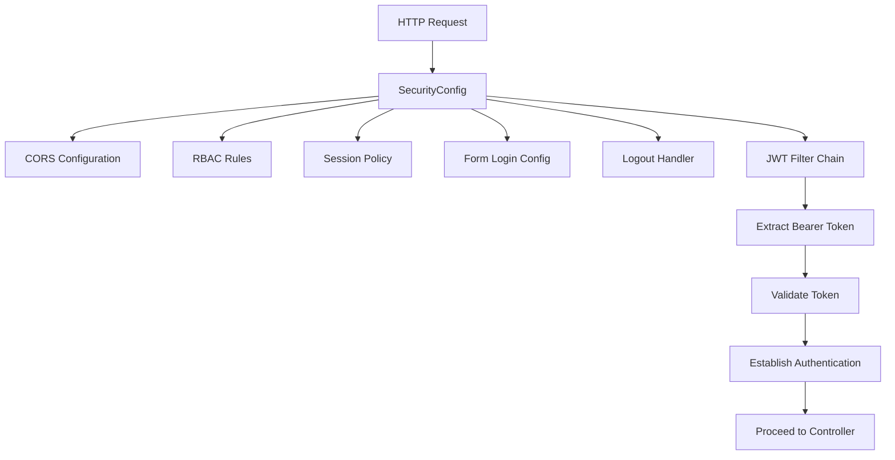
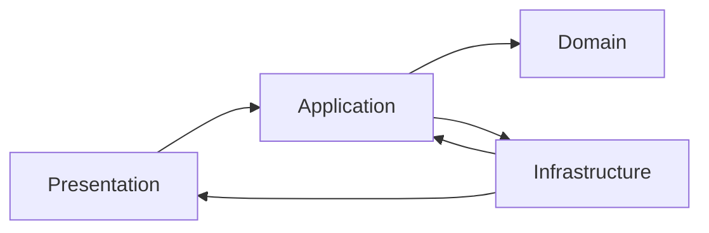

# Architecture Overview

<cite>
**Referenced Files in This Document**
- [SkylinkMediaServiceApplication.java](file://src/main/java/root/cyb/mh/skylink_media_service/SkylinkMediaServiceApplication.java)
- [application.properties](file://src/main/resources/application.properties)
- [SecurityConfig.java](file://src/main/java/root/cyb/mh/skylink_media_service/infrastructure/security/SecurityConfig.java)
- [JwtAuthenticationFilter.java](file://src/main/java/root/cyb/mh/skylink_media_service/infrastructure/security/jwt/JwtAuthenticationFilter.java)
- [AuthApiController.java](file://src/main/java/root/cyb/mh/skylink_media_service/infrastructure/web/api/AuthApiController.java)
- [ContractorLoginUseCase.java](file://src/main/java/root/cyb/mh/skylink_media_service/application/usecases/ContractorLoginUseCase.java)
- [ContractorController.java](file://src/main/java/root/cyb/mh/skylink_media_service/infrastructure/web/ContractorController.java)
- [RealTimeDashboardService.java](file://src/main/java/root/cyb/mh/skylink_media_service/application/services/RealTimeDashboardService.java)
- [WebSocketConfig.java](file://src/main/java/root/cyb/mh/skylink_media_service/infrastructure/config/WebSocketConfig.java)
- [ChatService.java](file://src/main/java/root/cyb/mh/skylink_media_service/application/services/ChatService.java)
- [User.java](file://src/main/java/root/cyb/mh/skylink_media_service/domain/entities/User.java)
- [Admin.java](file://src/main/java/root/cyb/mh/skylink_media_service/domain/entities/Admin.java)
- [Contractor.java](file://src/main/java/root/cyb/mh/skylink_media_service/domain/entities/Contractor.java)
- [ContractorRepository.java](file://src/main/java/root/cyb/mh/skylink_media_service/infrastructure/persistence/ContractorRepository.java)
- [UserService.java](file://src/main/java/root/cyb/mh/skylink_media_service/application/services/UserService.java)
</cite>

## Table of Contents
1. [Introduction](#introduction)
2. [Project Structure](#project-structure)
3. [Core Components](#core-components)
4. [Architecture Overview](#architecture-overview)
5. [Detailed Component Analysis](#detailed-component-analysis)
6. [Dependency Analysis](#dependency-analysis)
7. [Performance Considerations](#performance-considerations)
8. [Troubleshooting Guide](#troubleshooting-guide)
9. [Conclusion](#conclusion)

## Introduction
This document presents the architecture of the Skylink Media Service backend, focusing on Clean Architecture layer separation and practical implementation patterns. The system is organized into Presentation, Application, Domain, and Infrastructure layers, with clear boundaries and explicit responsibilities. It documents:
- Layered architecture with controllers, use cases, services, repositories, and domain entities
- Multi-tiered security using Spring Security, JWT, role-based access control, and custom filters
- Real-time communication via WebSocket for live dashboards and chat
- Cross-cutting concerns such as logging, auditing, and error handling
- System boundaries, data flows, and integration patterns

## Project Structure
The backend follows a layered structure:
- Presentation: Controllers and API controllers handle HTTP requests and render Thymeleaf views
- Application: Use cases and services encapsulate business logic and orchestrate operations
- Domain: Entities and value objects define the core business model
- Infrastructure: Persistence, security, configuration, and external integrations

**Diagram sources**
- [AuthApiController.java:1-34](file://src/main/java/root/cyb/mh/skylink_media_service/infrastructure/web/api/AuthApiController.java#L1-L34)
- [ContractorController.java:1-258](file://src/main/java/root/cyb/mh/skylink_media_service/infrastructure/web/ContractorController.java#L1-L258)
- [ContractorLoginUseCase.java:1-60](file://src/main/java/root/cyb/mh/skylink_media_service/application/usecases/ContractorLoginUseCase.java#L1-L60)
- [RealTimeDashboardService.java:1-143](file://src/main/java/root/cyb/mh/skylink_media_service/application/services/RealTimeDashboardService.java#L1-L143)
- [ChatService.java:1-45](file://src/main/java/root/cyb/mh/skylink_media_service/application/services/ChatService.java#L1-L45)
- [UserService.java:1-120](file://src/main/java/root/cyb/mh/skylink_media_service/application/services/UserService.java#L1-L120)
- [User.java:1-82](file://src/main/java/root/cyb/mh/skylink_media_service/domain/entities/User.java#L1-L82)
- [Admin.java:1-33](file://src/main/java/root/cyb/mh/skylink_media_service/domain/entities/Admin.java#L1-L33)
- [Contractor.java:1-48](file://src/main/java/root/cyb/mh/skylink_media_service/domain/entities/Contractor.java#L1-L48)
- [SecurityConfig.java:1-104](file://src/main/java/root/cyb/mh/skylink_media_service/infrastructure/security/SecurityConfig.java#L1-L104)
- [JwtAuthenticationFilter.java:1-70](file://src/main/java/root/cyb/mh/skylink_media_service/infrastructure/security/jwt/JwtAuthenticationFilter.java#L1-L70)
- [WebSocketConfig.java:1-29](file://src/main/java/root/cyb/mh/skylink_media_service/infrastructure/config/WebSocketConfig.java#L1-L29)
- [ContractorRepository.java:1-18](file://src/main/java/root/cyb/mh/skylink_media_service/infrastructure/persistence/ContractorRepository.java#L1-L18)

**Section sources**
- [SkylinkMediaServiceApplication.java:1-18](file://src/main/java/root/cyb/mh/skylink_media_service/SkylinkMediaServiceApplication.java#L1-L18)
- [application.properties:1-58](file://src/main/resources/application.properties#L1-L58)

## Core Components
- Presentation layer: Controllers and API controllers expose endpoints and render views
- Application layer: Use cases and services encapsulate business logic and coordinate operations
- Domain layer: Entities and value objects model the business domain
- Infrastructure layer: Security, persistence, configuration, and external integrations

Key responsibilities:
- Controllers: Handle HTTP requests, delegate to services, and manage view rendering
- Use cases: Orchestrate application-specific workflows
- Services: Encapsulate business logic and coordinate repositories
- Repositories: Abstract persistence operations
- Domain entities: Define business rules and relationships

**Section sources**
- [AuthApiController.java:1-34](file://src/main/java/root/cyb/mh/skylink_media_service/infrastructure/web/api/AuthApiController.java#L1-L34)
- [ContractorController.java:1-258](file://src/main/java/root/cyb/mh/skylink_media_service/infrastructure/web/ContractorController.java#L1-L258)
- [ContractorLoginUseCase.java:1-60](file://src/main/java/root/cyb/mh/skylink_media_service/application/usecases/ContractorLoginUseCase.java#L1-L60)
- [RealTimeDashboardService.java:1-143](file://src/main/java/root/cyb/mh/skylink_media_service/application/services/RealTimeDashboardService.java#L1-L143)
- [ChatService.java:1-45](file://src/main/java/root/cyb/mh/skylink_media_service/application/services/ChatService.java#L1-L45)
- [UserService.java:1-120](file://src/main/java/root/cyb/mh/skylink_media_service/application/services/UserService.java#L1-L120)
- [User.java:1-82](file://src/main/java/root/cyb/mh/skylink_media_service/domain/entities/User.java#L1-L82)
- [Admin.java:1-33](file://src/main/java/root/cyb/mh/skylink_media_service/domain/entities/Admin.java#L1-L33)
- [Contractor.java:1-48](file://src/main/java/root/cyb/mh/skylink_media_service/domain/entities/Contractor.java#L1-L48)
- [ContractorRepository.java:1-18](file://src/main/java/root/cyb/mh/skylink_media_service/infrastructure/persistence/ContractorRepository.java#L1-L18)

## Architecture Overview
The system implements Clean Architecture with explicit layer separation. The presentation layer depends on application services, which depend on domain abstractions. Infrastructure implements domain interfaces and provides cross-cutting capabilities such as security, persistence, and messaging.

**Diagram sources**
- [AuthApiController.java:1-34](file://src/main/java/root/cyb/mh/skylink_media_service/infrastructure/web/api/AuthApiController.java#L1-L34)
- [ContractorController.java:1-258](file://src/main/java/root/cyb/mh/skylink_media_service/infrastructure/web/ContractorController.java#L1-L258)
- [ContractorLoginUseCase.java:1-60](file://src/main/java/root/cyb/mh/skylink_media_service/application/usecases/ContractorLoginUseCase.java#L1-L60)
- [RealTimeDashboardService.java:1-143](file://src/main/java/root/cyb/mh/skylink_media_service/application/services/RealTimeDashboardService.java#L1-L143)
- [ChatService.java:1-45](file://src/main/java/root/cyb/mh/skylink_media_service/application/services/ChatService.java#L1-L45)
- [UserService.java:1-120](file://src/main/java/root/cyb/mh/skylink_media_service/application/services/UserService.java#L1-L120)
- [User.java:1-82](file://src/main/java/root/cyb/mh/skylink_media_service/domain/entities/User.java#L1-L82)
- [Admin.java:1-33](file://src/main/java/root/cyb/mh/skylink_media_service/domain/entities/Admin.java#L1-L33)
- [Contractor.java:1-48](file://src/main/java/root/cyb/mh/skylink_media_service/domain/entities/Contractor.java#L1-L48)
- [SecurityConfig.java:1-104](file://src/main/java/root/cyb/mh/skylink_media_service/infrastructure/security/SecurityConfig.java#L1-L104)
- [JwtAuthenticationFilter.java:1-70](file://src/main/java/root/cyb/mh/skylink_media_service/infrastructure/security/jwt/JwtAuthenticationFilter.java#L1-L70)
- [WebSocketConfig.java:1-29](file://src/main/java/root/cyb/mh/skylink_media_service/infrastructure/config/WebSocketConfig.java#L1-L29)
- [ContractorRepository.java:1-18](file://src/main/java/root/cyb/mh/skylink_media_service/infrastructure/persistence/ContractorRepository.java#L1-L18)

## Detailed Component Analysis

### Authentication and Authorization Flow
This sequence illustrates JWT-based authentication for contractor login and subsequent authorization checks.

**Diagram sources**
- [AuthApiController.java:23-32](file://src/main/java/root/cyb/mh/skylink_media_service/infrastructure/web/api/AuthApiController.java#L23-L32)
- [ContractorLoginUseCase.java:29-58](file://src/main/java/root/cyb/mh/skylink_media_service/application/usecases/ContractorLoginUseCase.java#L29-L58)
- [SecurityConfig.java:43-87](file://src/main/java/root/cyb/mh/skylink_media_service/infrastructure/security/SecurityConfig.java#L43-L87)
- [JwtAuthenticationFilter.java:31-54](file://src/main/java/root/cyb/mh/skylink_media_service/infrastructure/security/jwt/JwtAuthenticationFilter.java#L31-L54)

**Section sources**
- [AuthApiController.java:1-34](file://src/main/java/root/cyb/mh/skylink_media_service/infrastructure/web/api/AuthApiController.java#L1-L34)
- [ContractorLoginUseCase.java:1-60](file://src/main/java/root/cyb/mh/skylink_media_service/application/usecases/ContractorLoginUseCase.java#L1-L60)
- [SecurityConfig.java:1-104](file://src/main/java/root/cyb/mh/skylink_media_service/infrastructure/security/SecurityConfig.java#L1-L104)
- [JwtAuthenticationFilter.java:1-70](file://src/main/java/root/cyb/mh/skylink_media_service/infrastructure/security/jwt/JwtAuthenticationFilter.java#L1-L70)

### Role-Based Access Control and Security Filters
SecurityConfig defines role-based access control for endpoints and integrates a custom JWT filter. Requests under /api/v1/ are authenticated, while static resources and WebSocket endpoints are permitted. RBAC enforces routes such as /super-admin/** requiring SUPER_ADMIN and /admin/** requiring ADMIN or SUPER_ADMIN.

**Diagram sources**
- [SecurityConfig.java:49-74](file://src/main/java/root/cyb/mh/skylink_media_service/infrastructure/security/SecurityConfig.java#L49-L74)
- [JwtAuthenticationFilter.java:31-54](file://src/main/java/root/cyb/mh/skylink_media_service/infrastructure/security/jwt/JwtAuthenticationFilter.java#L31-L54)

**Section sources**
- [SecurityConfig.java:1-104](file://src/main/java/root/cyb/mh/skylink_media_service/infrastructure/security/SecurityConfig.java#L1-L104)
- [JwtAuthenticationFilter.java:1-70](file://src/main/java/root/cyb/mh/skylink_media_service/infrastructure/security/jwt/JwtAuthenticationFilter.java#L1-L70)

### Real-Time Communication with WebSocket
WebSocketConfig enables STOMP over SockJS for real-time updates. RealTimeDashboardService publishes user presence, chat messages, project updates, and system statistics to subscribed clients.

**Diagram sources**
- [WebSocketConfig.java:11-27](file://src/main/java/root/cyb/mh/skylink_media_service/infrastructure/config/WebSocketConfig.java#L11-L27)
- [RealTimeDashboardService.java:45-53](file://src/main/java/root/cyb/mh/skylink_media_service/application/services/RealTimeDashboardService.java#L45-L53)
- [RealTimeDashboardService.java:25-33](file://src/main/java/root/cyb/mh/skylink_media_service/application/services/RealTimeDashboardService.java#L25-L33)

**Section sources**
- [WebSocketConfig.java:1-29](file://src/main/java/root/cyb/mh/skylink_media_service/infrastructure/config/WebSocketConfig.java#L1-L29)
- [RealTimeDashboardService.java:1-143](file://src/main/java/root/cyb/mh/skylink_media_service/application/services/RealTimeDashboardService.java#L1-L143)

### Domain Model and Entity Relationships
The domain layer models users and roles with inheritance and discriminator-based polymorphism. Contractors and Admins extend the base User entity.

**Diagram sources**
- [User.java:10-81](file://src/main/java/root/cyb/mh/skylink_media_service/domain/entities/User.java#L10-L81)
- [Admin.java:6-32](file://src/main/java/root/cyb/mh/skylink_media_service/domain/entities/Admin.java#L6-L32)
- [Contractor.java:6-47](file://src/main/java/root/cyb/mh/skylink_media_service/domain/entities/Contractor.java#L6-L47)

**Section sources**
- [User.java:1-82](file://src/main/java/root/cyb/mh/skylink_media_service/domain/entities/User.java#L1-L82)
- [Admin.java:1-33](file://src/main/java/root/cyb/mh/skylink_media_service/domain/entities/Admin.java#L1-L33)
- [Contractor.java:1-48](file://src/main/java/root/cyb/mh/skylink_media_service/domain/entities/Contractor.java#L1-L48)

### Contractor Dashboard and Chat Workflow
ContractorController orchestrates contractor-specific operations, including dashboard rendering, photo upload, project actions, and chat interactions. It coordinates with services and repositories to enforce access control and business rules.

**Diagram sources**
- [ContractorController.java:71-107](file://src/main/java/root/cyb/mh/skylink_media_service/infrastructure/web/ContractorController.java#L71-L107)
- [ContractorController.java:190-215](file://src/main/java/root/cyb/mh/skylink_media_service/infrastructure/web/ContractorController.java#L190-L215)
- [ChatService.java:24-43](file://src/main/java/root/cyb/mh/skylink_media_service/application/services/ChatService.java#L24-L43)

**Section sources**
- [ContractorController.java:1-258](file://src/main/java/root/cyb/mh/skylink_media_service/infrastructure/web/ContractorController.java#L1-L258)
- [ChatService.java:1-45](file://src/main/java/root/cyb/mh/skylink_media_service/application/services/ChatService.java#L1-L45)

### Multi-Tiered Security Architecture
The security architecture comprises:
- Spring Security configuration with CSRF disabled for API endpoints and enabled for HTML forms
- JWT filter extracting tokens from Authorization header and establishing authentication
- Role-based access control enforcing route-level permissions
- Custom logout handler and entry point for consistent error handling

**Diagram sources**
- [SecurityConfig.java:43-87](file://src/main/java/root/cyb/mh/skylink_media_service/infrastructure/security/SecurityConfig.java#L43-L87)
- [JwtAuthenticationFilter.java:31-54](file://src/main/java/root/cyb/mh/skylink_media_service/infrastructure/security/jwt/JwtAuthenticationFilter.java#L31-L54)

**Section sources**
- [SecurityConfig.java:1-104](file://src/main/java/root/cyb/mh/skylink_media_service/infrastructure/security/SecurityConfig.java#L1-L104)
- [JwtAuthenticationFilter.java:1-70](file://src/main/java/root/cyb/mh/skylink_media_service/infrastructure/security/jwt/JwtAuthenticationFilter.java#L1-L70)

## Dependency Analysis
The system exhibits low coupling and high cohesion across layers:
- Presentation depends on Application services
- Application depends on Domain abstractions and Infrastructure repositories
- Infrastructure implements persistence and messaging interfaces
- Security is centralized in SecurityConfig and applied globally

**Diagram sources**
- [AuthApiController.java:1-34](file://src/main/java/root/cyb/mh/skylink_media_service/infrastructure/web/api/AuthApiController.java#L1-L34)
- [ContractorController.java:1-258](file://src/main/java/root/cyb/mh/skylink_media_service/infrastructure/web/ContractorController.java#L1-L258)
- [ContractorLoginUseCase.java:1-60](file://src/main/java/root/cyb/mh/skylink_media_service/application/usecases/ContractorLoginUseCase.java#L1-L60)
- [RealTimeDashboardService.java:1-143](file://src/main/java/root/cyb/mh/skylink_media_service/application/services/RealTimeDashboardService.java#L1-L143)
- [ChatService.java:1-45](file://src/main/java/root/cyb/mh/skylink_media_service/application/services/ChatService.java#L1-L45)
- [UserService.java:1-120](file://src/main/java/root/cyb/mh/skylink_media_service/application/services/UserService.java#L1-L120)
- [User.java:1-82](file://src/main/java/root/cyb/mh/skylink_media_service/domain/entities/User.java#L1-L82)
- [Admin.java:1-33](file://src/main/java/root/cyb/mh/skylink_media_service/domain/entities/Admin.java#L1-L33)
- [Contractor.java:1-48](file://src/main/java/root/cyb/mh/skylink_media_service/domain/entities/Contractor.java#L1-L48)
- [SecurityConfig.java:1-104](file://src/main/java/root/cyb/mh/skylink_media_service/infrastructure/security/SecurityConfig.java#L1-L104)
- [JwtAuthenticationFilter.java:1-70](file://src/main/java/root/cyb/mh/skylink_media_service/infrastructure/security/jwt/JwtAuthenticationFilter.java#L1-L70)
- [WebSocketConfig.java:1-29](file://src/main/java/root/cyb/mh/skylink_media_service/infrastructure/config/WebSocketConfig.java#L1-L29)
- [ContractorRepository.java:1-18](file://src/main/java/root/cyb/mh/skylink_media_service/infrastructure/persistence/ContractorRepository.java#L1-L18)

**Section sources**
- [application.properties:1-58](file://src/main/resources/application.properties#L1-L58)

## Performance Considerations
- Asynchronous and scheduled tasks are enabled at the application level, supporting background processing and periodic maintenance
- WebSocket messaging uses an in-memory broker suitable for single-instance deployments; consider clustering or external brokers for horizontal scaling
- JWT token validation occurs per request; caching validated principals can reduce overhead
- Repository queries should leverage indexes and pagination for large datasets
- File upload limits are configured; consider chunked uploads and virus scanning for production

[No sources needed since this section provides general guidance]

## Troubleshooting Guide
Common issues and remedies:
- Authentication failures: Verify JWT secret and expiration settings; ensure Authorization header format is "Bearer {token}"
- RBAC denials: Confirm role values match expected authorities and that routes align with SecurityConfig rules
- WebSocket connectivity: Validate STOMP endpoint registration and client-side SockJS configuration
- CORS errors: Check allowed origins and credentials settings in SecurityConfig and application properties
- Logging: Enable debug logs for controllers and services to trace request flows and exceptions

**Section sources**
- [application.properties:24-58](file://src/main/resources/application.properties#L24-L58)
- [SecurityConfig.java:90-102](file://src/main/java/root/cyb/mh/skylink_media_service/infrastructure/security/SecurityConfig.java#L90-L102)
- [WebSocketConfig.java:22-27](file://src/main/java/root/cyb/mh/skylink_media_service/infrastructure/config/WebSocketConfig.java#L22-L27)

## Conclusion
The Skylink Media Service employs Clean Architecture to separate concerns and improve maintainability. The multi-tiered security model ensures robust authentication and authorization, while WebSocket integration delivers real-time capabilities. By adhering to layer boundaries, leveraging repositories for persistence, and centralizing cross-cutting concerns, the system balances scalability and operational simplicity.