# Business Domains

<cite>
**Referenced Files in This Document**
- [SkylinkMediaServiceApplication.java](file://src/main/java/root/cyb/mh/skylink_media_service/SkylinkMediaServiceApplication.java)
- [Project.java](file://src/main/java/root/cyb/mh/skylink_media_service/domain/entities/Project.java)
- [User.java](file://src/main/java/root/cyb/mh/skylink_media_service/domain/entities/User.java)
- [Admin.java](file://src/main/java/root/cyb/mh/skylink_media_service/domain/entities/Admin.java)
- [Contractor.java](file://src/main/java/root/cyb/mh/skylink_media_service/domain/entities/Contractor.java)
- [SuperAdmin.java](file://src/main/java/root/cyb/mh/skylink_media_service/domain/entities/SuperAdmin.java)
- [Photo.java](file://src/main/java/root/cyb/mh/skylink_media_service/domain/entities/Photo.java)
- [ProjectStatus.java](file://src/main/java/root/cyb/mh/skylink_media_service/domain/valueobjects/ProjectStatus.java)
- [ImageCategory.java](file://src/main/java/root/cyb/mh/skylink_media_service/domain/valueobjects/ImageCategory.java)
- [ProjectDTO.java](file://src/main/java/root/cyb/mh/skylink_media_service/application/dto/ProjectDTO.java)
- [ProjectSearchCriteria.java](file://src/main/java/root/cyb/mh/skylink_media_service/application/dto/ProjectSearchCriteria.java)
- [ProjectService.java](file://src/main/java/root/cyb/mh/skylink_media_service/application/services/ProjectService.java)
- [UserManagementService.java](file://src/main/java/root/cyb/mh/skylink_media_service/application/services/UserManagementService.java)
- [PhotoService.java](file://src/main/java/root/cyb/mh/skylink_media_service/application/services/PhotoService.java)
- [ChatService.java](file://src/main/java/root/cyb/mh/skylink_media_service/application/services/ChatService.java)
</cite>

## Table of Contents
1. [Introduction](#introduction)
2. [Project Structure](#project-structure)
3. [Core Components](#core-components)
4. [Architecture Overview](#architecture-overview)
5. [Detailed Component Analysis](#detailed-component-analysis)
6. [Dependency Analysis](#dependency-analysis)
7. [Performance Considerations](#performance-considerations)
8. [Troubleshooting Guide](#troubleshooting-guide)
9. [Conclusion](#conclusion)

## Introduction
This document describes the Skylink Media Service business domains and how they collaborate to support media production workflows. The four primary domains are:
- Project Management: end-to-end project lifecycle, status tracking, contractor assignments, and advanced search.
- Photo Management: upload workflows, WebP optimization, thumbnail generation, and batch operations.
- User Management: multi-role authentication (ADMIN, SUPER_ADMIN, CONTRACTOR), user profiles, and permissions.
- Communication: real-time chat, notifications, and user presence tracking.

These domains integrate through shared entities, services, and repositories to enforce business rules, maintain auditability, and provide a cohesive operational experience for administrators, contractors, and super administrators.

## Project Structure
The backend is a Spring Boot application with layered architecture:
- Domain layer defines core entities, value objects, and business rules.
- Application layer implements use cases via services.
- Infrastructure layer handles persistence, security, storage, and web APIs.
- Controllers expose REST endpoints for clients.

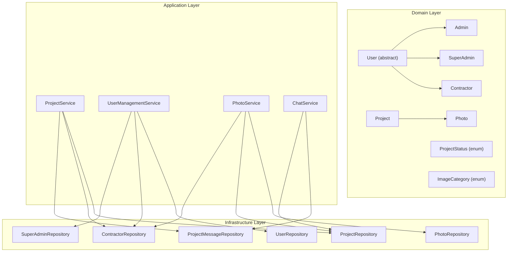

**Diagram sources**
- [User.java:1-82](file://src/main/java/root/cyb/mh/skylink_media_service/domain/entities/User.java#L1-L82)
- [Admin.java:1-33](file://src/main/java/root/cyb/mh/skylink_media_service/domain/entities/Admin.java#L1-L33)
- [Contractor.java:1-48](file://src/main/java/root/cyb/mh/skylink_media_service/domain/entities/Contractor.java#L1-L48)
- [SuperAdmin.java:1-33](file://src/main/java/root/cyb/mh/skylink_media_service/domain/entities/SuperAdmin.java#L1-L33)
- [Project.java:1-252](file://src/main/java/root/cyb/mh/skylink_media_service/domain/entities/Project.java#L1-L252)
- [Photo.java:1-128](file://src/main/java/root/cyb/mh/skylink_media_service/domain/entities/Photo.java#L1-L128)
- [ProjectStatus.java:1-54](file://src/main/java/root/cyb/mh/skylink_media_service/domain/valueobjects/ProjectStatus.java#L1-L54)
- [ImageCategory.java:1-23](file://src/main/java/root/cyb/mh/skylink_media_service/domain/valueobjects/ImageCategory.java#L1-L23)
- [ProjectService.java:1-419](file://src/main/java/root/cyb/mh/skylink_media_service/application/services/ProjectService.java#L1-L419)
- [UserManagementService.java:1-351](file://src/main/java/root/cyb/mh/skylink_media_service/application/services/UserManagementService.java#L1-L351)
- [PhotoService.java:1-116](file://src/main/java/root/cyb/mh/skylink_media_service/application/services/PhotoService.java#L1-L116)
- [ChatService.java:1-45](file://src/main/java/root/cyb/mh/skylink_media_service/application/services/ChatService.java#L1-L45)

**Section sources**
- [SkylinkMediaServiceApplication.java:1-18](file://src/main/java/root/cyb/mh/skylink_media_service/SkylinkMediaServiceApplication.java#L1-L18)

## Core Components
- Project entity encapsulates lifecycle fields, status, payment status, and relationships to photos and assignments.
- User hierarchy supports three roles: ADMIN, SUPER_ADMIN, and CONTRACTOR, each with distinct capabilities.
- Photo entity stores file paths, optimization state, metadata, and categorization.
- ProjectService orchestrates project creation, updates, contractor assignments, advanced search, and cleanup.
- UserManagementService manages user listing, blocking/unblocking, deletion, role-specific creation, profile updates, and password resets.
- PhotoService handles uploads, metadata extraction, optimization flags, and retrieval.
- ChatService enables messaging per project with unread counts.

**Section sources**
- [Project.java:1-252](file://src/main/java/root/cyb/mh/skylink_media_service/domain/entities/Project.java#L1-L252)
- [User.java:1-82](file://src/main/java/root/cyb/mh/skylink_media_service/domain/entities/User.java#L1-L82)
- [Admin.java:1-33](file://src/main/java/root/cyb/mh/skylink_media_service/domain/entities/Admin.java#L1-L33)
- [Contractor.java:1-48](file://src/main/java/root/cyb/mh/skylink_media_service/domain/entities/Contractor.java#L1-L48)
- [SuperAdmin.java:1-33](file://src/main/java/root/cyb/mh/skylink_media_service/domain/entities/SuperAdmin.java#L1-L33)
- [Photo.java:1-128](file://src/main/java/root/cyb/mh/skylink_media_service/domain/entities/Photo.java#L1-L128)
- [ProjectService.java:1-419](file://src/main/java/root/cyb/mh/skylink_media_service/application/services/ProjectService.java#L1-L419)
- [UserManagementService.java:1-351](file://src/main/java/root/cyb/mh/skylink_media_service/application/services/UserManagementService.java#L1-L351)
- [PhotoService.java:1-116](file://src/main/java/root/cyb/mh/skylink_media_service/application/services/PhotoService.java#L1-L116)
- [ChatService.java:1-45](file://src/main/java/root/cyb/mh/skylink_media_service/application/services/ChatService.java#L1-L45)

## Architecture Overview
The system follows clean architecture with bounded contexts:
- Domain enforces business rules and immutability of value objects.
- Application services coordinate use cases and apply cross-cutting concerns like auditing.
- Infrastructure provides persistence, security, and external integrations (storage, JWT).

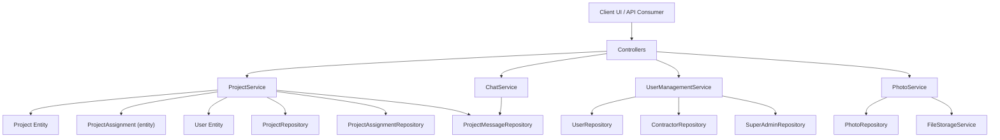

**Diagram sources**
- [ProjectService.java:1-419](file://src/main/java/root/cyb/mh/skylink_media_service/application/services/ProjectService.java#L1-L419)
- [UserManagementService.java:1-351](file://src/main/java/root/cyb/mh/skylink_media_service/application/services/UserManagementService.java#L1-L351)
- [PhotoService.java:1-116](file://src/main/java/root/cyb/mh/skylink_media_service/application/services/PhotoService.java#L1-L116)
- [ChatService.java:1-45](file://src/main/java/root/cyb/mh/skylink_media_service/application/services/ChatService.java#L1-L45)

## Detailed Component Analysis

### Project Management
Project Management governs the project lifecycle, status transitions, contractor assignments, and search capabilities.

- Lifecycle and status tracking:
  - Projects track status and payment status with immutable transitions enforced by a state machine.
  - Status changes capture who changed the status and when.
- Contractor assignments:
  - Enforces one active contractor per project (except CLOSED projects).
  - Limits a contractor to a maximum of four active projects.
  - Automatically advances project status when assigning a contractor from UNASSIGNED.
- Advanced search:
  - Supports text search and filtering by status, payment status, due date range, price range, and assigned contractor.

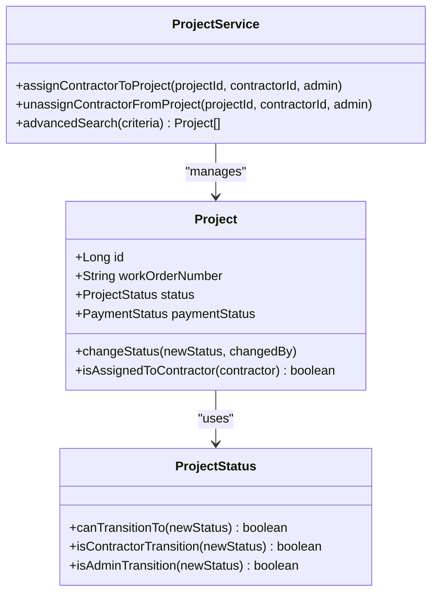

**Diagram sources**
- [Project.java:1-252](file://src/main/java/root/cyb/mh/skylink_media_service/domain/entities/Project.java#L1-L252)
- [ProjectStatus.java:1-54](file://src/main/java/root/cyb/mh/skylink_media_service/domain/valueobjects/ProjectStatus.java#L1-L54)
- [ProjectService.java:1-419](file://src/main/java/root/cyb/mh/skylink_media_service/application/services/ProjectService.java#L1-L419)

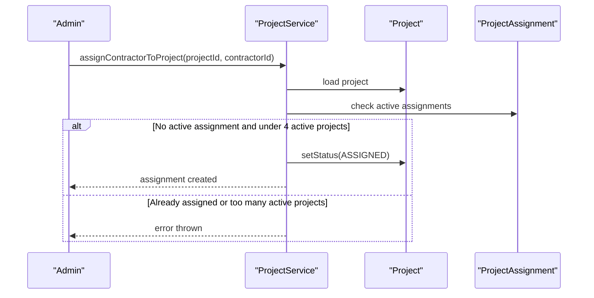

**Diagram sources**
- [ProjectService.java:109-161](file://src/main/java/root/cyb/mh/skylink_media_service/application/services/ProjectService.java#L109-L161)
- [Project.java:229-236](file://src/main/java/root/cyb/mh/skylink_media_service/domain/entities/Project.java#L229-L236)

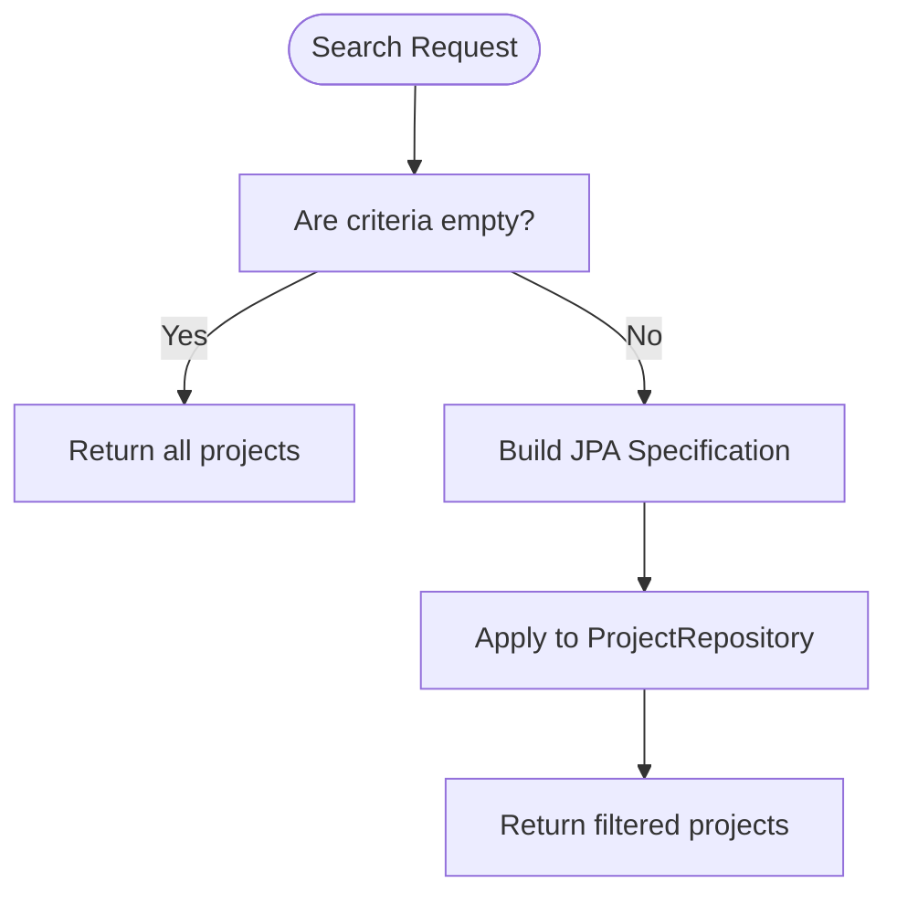

**Diagram sources**
- [ProjectService.java:328-335](file://src/main/java/root/cyb/mh/skylink_media_service/application/services/ProjectService.java#L328-L335)
- [ProjectSearchCriteria.java:1-50](file://src/main/java/root/cyb/mh/skylink_media_service/application/dto/ProjectSearchCriteria.java#L1-L50)

Practical example:
- An ADMIN assigns a CONTRACTOR to an UNASSIGNED project; the system sets status to ASSIGNED and logs the event.
- A SUPER_ADMIN queries projects due within a date range and filters by payment status.

**Section sources**
- [Project.java:185-250](file://src/main/java/root/cyb/mh/skylink_media_service/domain/entities/Project.java#L185-L250)
- [ProjectStatus.java:25-52](file://src/main/java/root/cyb/mh/skylink_media_service/domain/valueobjects/ProjectStatus.java#L25-L52)
- [ProjectService.java:109-161](file://src/main/java/root/cyb/mh/skylink_media_service/application/services/ProjectService.java#L109-L161)
- [ProjectSearchCriteria.java:1-50](file://src/main/java/root/cyb/mh/skylink_media_service/application/dto/ProjectSearchCriteria.java#L1-L50)

### Photo Management
Photo Management covers upload workflows, WebP optimization, thumbnail generation, and batch operations.

- Upload workflow:
  - Validates file and project/contractor context.
  - Stores files via storage service and extracts metadata.
  - Marks images as optimized, sets categories, and persists metadata JSON.
- Optimization and thumbnails:
  - Stores WebP path, original path, and thumbnail path.
  - Tracks optimization status and timestamp.
- Batch operations:
  - Retrieve project photos, contractor photos, and filtered sets by IDs.

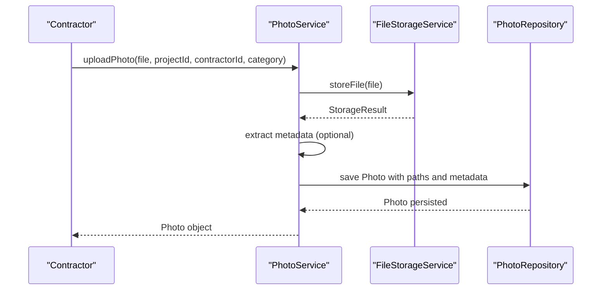

**Diagram sources**
- [PhotoService.java:46-98](file://src/main/java/root/cyb/mh/skylink_media_service/application/services/PhotoService.java#L46-L98)
- [Photo.java:1-128](file://src/main/java/root/cyb/mh/skylink_media_service/domain/entities/Photo.java#L1-L128)

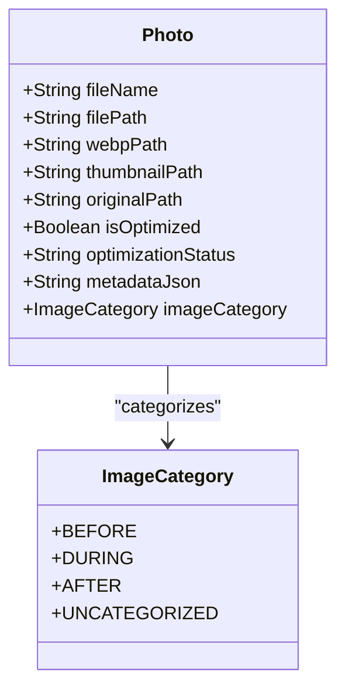

**Diagram sources**
- [Photo.java:1-128](file://src/main/java/root/cyb/mh/skylink_media_service/domain/entities/Photo.java#L1-L128)
- [ImageCategory.java:1-23](file://src/main/java/root/cyb/mh/skylink_media_service/domain/valueobjects/ImageCategory.java#L1-L23)

Practical example:
- A CONTRACTOR uploads a photo during a field visit; the system generates a thumbnail, stores a WebP copy, and records metadata for later search and review.

**Section sources**
- [PhotoService.java:46-98](file://src/main/java/root/cyb/mh/skylink_media_service/application/services/PhotoService.java#L46-L98)
- [Photo.java:20-49](file://src/main/java/root/cyb/mh/skylink_media_service/domain/entities/Photo.java#L20-L49)

### User Management
User Management supports multi-role authentication and profile administration.

- Roles and profiles:
  - ADMIN, SUPER_ADMIN, and CONTRACTOR inherit from a single User entity with discriminator-based polymorphism.
  - Profiles include username, password, email, avatar, and blocking controls.
- Permissions and actions:
  - Creation of ADMIN and SUPER_ADMIN is restricted to SUPER_ADMIN.
  - CONTRACTOR accounts are created by ADMIN or SUPER_ADMIN.
  - Blocking/unblocking and deletion are audited and restricted for SUPER_ADMIN.
- Password management:
  - Enforces minimum length and prevents resetting another SUPER_ADMIN’s password unless initiated by themselves.

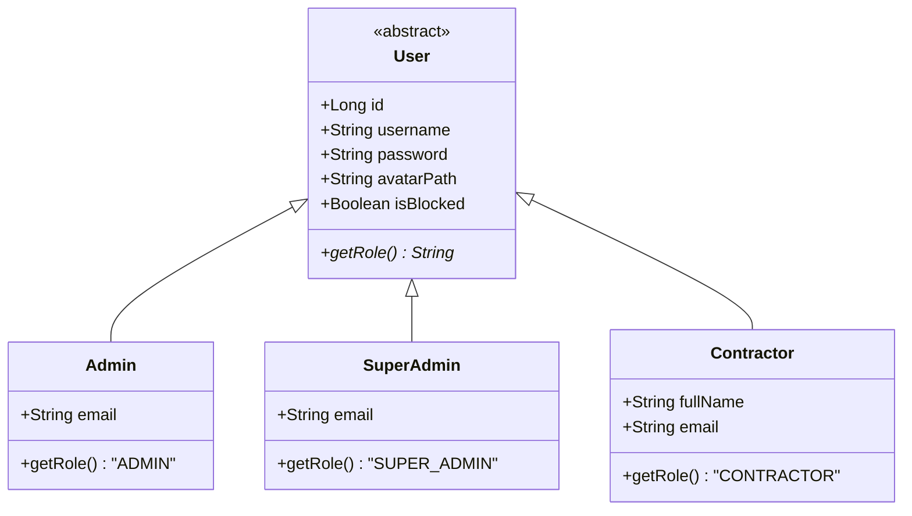

**Diagram sources**
- [User.java:1-82](file://src/main/java/root/cyb/mh/skylink_media_service/domain/entities/User.java#L1-L82)
- [Admin.java:1-33](file://src/main/java/root/cyb/mh/skylink_media_service/domain/entities/Admin.java#L1-L33)
- [SuperAdmin.java:1-33](file://src/main/java/root/cyb/mh/skylink_media_service/domain/entities/SuperAdmin.java#L1-L33)
- [Contractor.java:1-48](file://src/main/java/root/cyb/mh/skylink_media_service/domain/entities/Contractor.java#L1-L48)

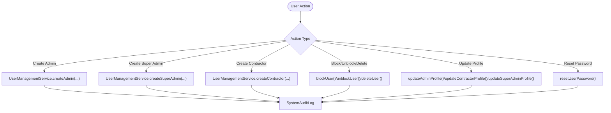

**Diagram sources**
- [UserManagementService.java:147-338](file://src/main/java/root/cyb/mh/skylink_media_service/application/services/UserManagementService.java#L147-L338)

Practical example:
- An ADMIN creates a new CONTRACTOR account and assigns a temporary avatar; later, the SUPER_ADMIN resets the password after verifying identity.

**Section sources**
- [UserManagementService.java:147-338](file://src/main/java/root/cyb/mh/skylink_media_service/application/services/UserManagementService.java#L147-L338)
- [User.java:68-81](file://src/main/java/root/cyb/mh/skylink_media_service/domain/entities/User.java#L68-L81)

### Communication
Communication provides real-time chat, notifications, and user presence tracking.

- Chat:
  - Messages are stored per project with timestamps and sender attribution.
  - Unread message counts can be computed since a given time for a specific viewer.
- Presence:
  - Presence tracking is supported by dedicated service and WebSocket configuration, enabling real-time indicators and live dashboards.

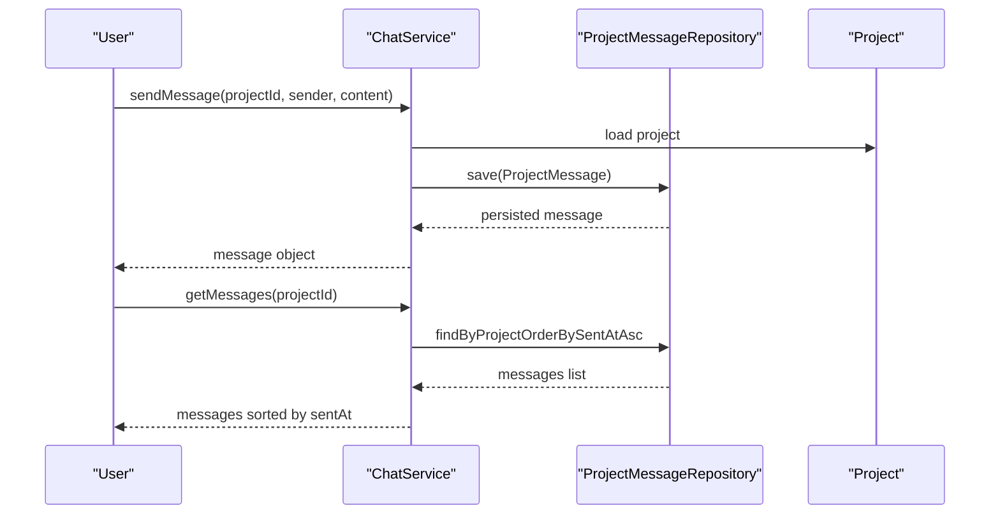

**Diagram sources**
- [ChatService.java:24-37](file://src/main/java/root/cyb/mh/skylink_media_service/application/services/ChatService.java#L24-L37)

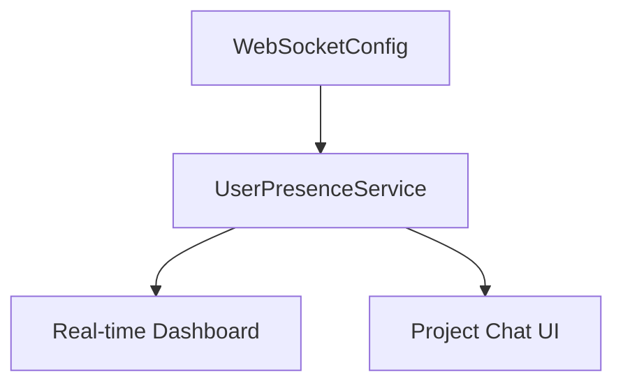

**Diagram sources**
- [SkylinkMediaServiceApplication.java:5-10](file://src/main/java/root/cyb/mh/skylink_media_service/SkylinkMediaServiceApplication.java#L5-L10)

Practical example:
- While reviewing project photos, a CONTRACTOR sends a message; ADMIN sees it immediately and marks it read; unread counters update accordingly.

**Section sources**
- [ChatService.java:24-43](file://src/main/java/root/cyb/mh/skylink_media_service/application/services/ChatService.java#L24-L43)
- [SkylinkMediaServiceApplication.java:5-10](file://src/main/java/root/cyb/mh/skylink_media_service/SkylinkMediaServiceApplication.java#L5-L10)

## Dependency Analysis
Key relationships:
- ProjectService depends on Project, Contractor, ProjectAssignment, Photo, and repositories for lifecycle and search.
- PhotoService depends on Photo, Project, Contractor, and FileStorageService for upload and metadata.
- UserManagementService depends on UserRepository, ContractorRepository, SuperAdminRepository, and audits system actions.
- ChatService depends on ProjectMessageRepository and Project for messaging.

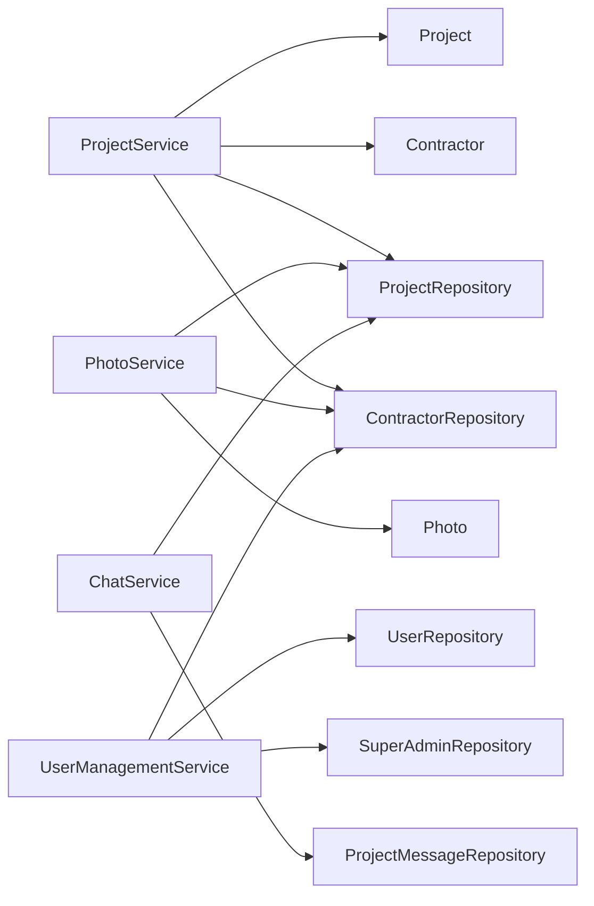

**Diagram sources**
- [ProjectService.java:36-58](file://src/main/java/root/cyb/mh/skylink_media_service/application/services/ProjectService.java#L36-L58)
- [PhotoService.java:34-44](file://src/main/java/root/cyb/mh/skylink_media_service/application/services/PhotoService.java#L34-L44)
- [UserManagementService.java:22-38](file://src/main/java/root/cyb/mh/skylink_media_service/application/services/UserManagementService.java#L22-L38)
- [ChatService.java:18-22](file://src/main/java/root/cyb/mh/skylink_media_service/application/services/ChatService.java#L18-L22)

**Section sources**
- [ProjectService.java:36-58](file://src/main/java/root/cyb/mh/skylink_media_service/application/services/ProjectService.java#L36-L58)
- [PhotoService.java:34-44](file://src/main/java/root/cyb/mh/skylink_media_service/application/services/PhotoService.java#L34-L44)
- [UserManagementService.java:22-38](file://src/main/java/root/cyb/mh/skylink_media_service/application/services/UserManagementService.java#L22-L38)
- [ChatService.java:18-22](file://src/main/java/root/cyb/mh/skylink_media_service/application/services/ChatService.java#L18-L22)

## Performance Considerations
- Indexing and search:
  - Use database indexes on frequently filtered columns (e.g., work order number, status, due date) to optimize advanced search performance.
- Asynchronous processing:
  - Offload heavy tasks like metadata extraction and thumbnail generation to background jobs to avoid blocking request threads.
- Pagination:
  - Apply pagination for listing users and retrieving large photo sets to reduce memory footprint.
- Caching:
  - Cache frequently accessed project summaries and user roles to minimize repeated database queries.

## Troubleshooting Guide
Common issues and resolutions:
- Project assignment errors:
  - “Already assigned” indicates an active assignment exists; close or reassign the project first.
  - “Too many active projects” means the contractor has reached the limit; complete some projects before assigning more.
- Photo upload failures:
  - Empty file or missing project/contractor context triggers validation errors; ensure correct parameters and file selection.
- User management restrictions:
  - Cannot block or delete SUPER_ADMIN; verify role and permissions.
  - Password reset requires minimum length and proper authorization.

**Section sources**
- [ProjectService.java:118-144](file://src/main/java/root/cyb/mh/skylink_media_service/application/services/ProjectService.java#L118-L144)
- [PhotoService.java:53-55](file://src/main/java/root/cyb/mh/skylink_media_service/application/services/PhotoService.java#L53-L55)
- [UserManagementService.java:69-71](file://src/main/java/root/cyb/mh/skylink_media_service/application/services/UserManagementService.java#L69-L71)

## Conclusion
The Skylink Media Service integrates Project Management, Photo Management, User Management, and Communication to streamline media production workflows. Clear domain boundaries, enforced business rules, and robust auditing enable scalable operations across ADMIN, SUPER_ADMIN, and CONTRACTOR roles. Advanced search, optimized photo handling, and real-time communication provide the foundation for efficient collaboration and visibility.