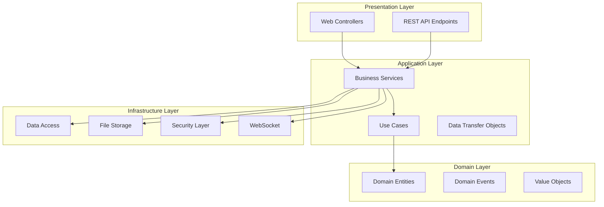
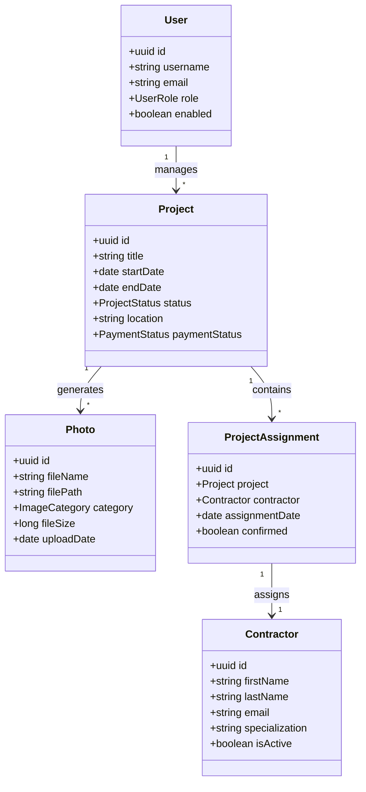
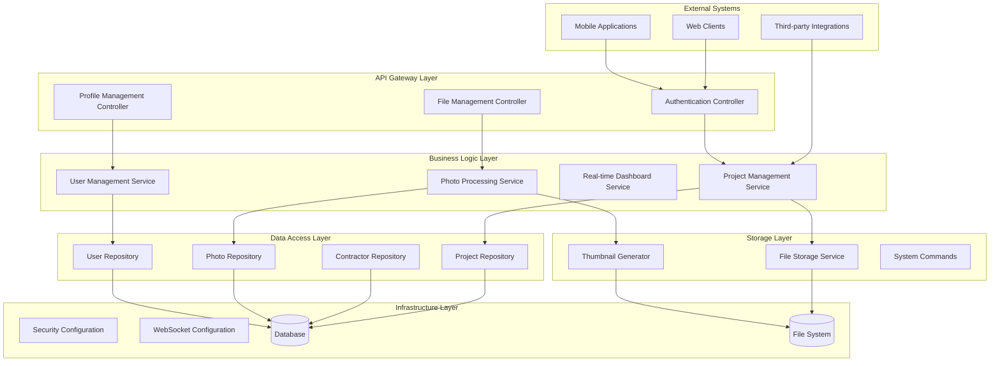
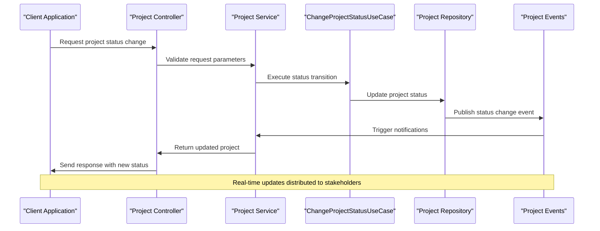
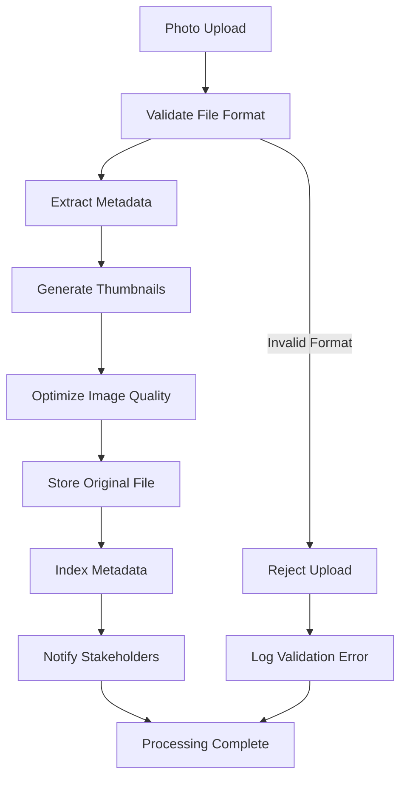
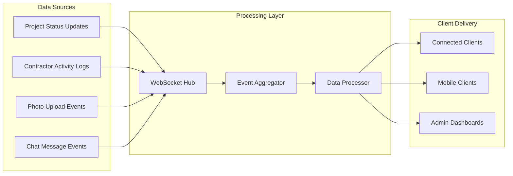
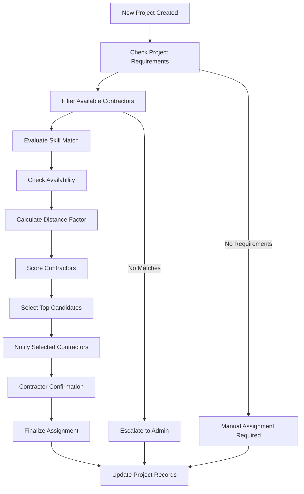
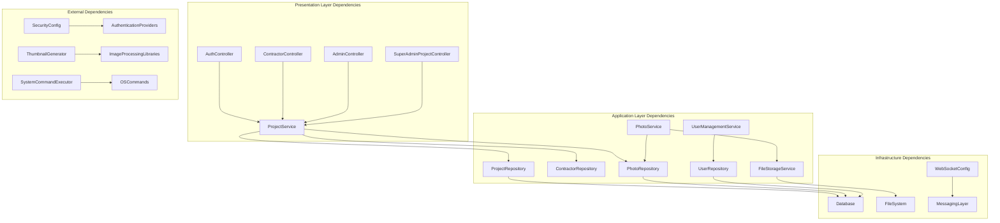

# Introduction

<cite>
**Referenced Files in This Document**
- [README.md](file://README.md)
- [SkylinkMediaServiceApplication.java](file://src/main/java/root/cyb/mh/skylink_media_service/SkylinkMediaServiceApplication.java)
- [Project.java](file://src/main/java/root/cyb/mh/skylink_media_service/domain/entities/Project.java)
- [Contractor.java](file://src/main/java/root/cyb/mh/skylink_media_service/domain/entities/Contractor.java)
- [User.java](file://src/main/java/root/cyb/mh/skylink_media_service/domain/entities/User.java)
- [ProjectService.java](file://src/main/java/root/cyb/mh/skylink_media_service/application/services/ProjectService.java)
- [PhotoService.java](file://src/main/java/root/cyb/mh/skylink_media_service/application/services/PhotoService.java)
- [RealTimeDashboardService.java](file://src/main/java/root/cyb/mh/skylink_media_service/application/services/RealTimeDashboardService.java)
- [UserManagementService.java](file://src/main/java/root/cyb/mh/skylink_media_service/application/services/UserManagementService.java)
- [ChangeProjectStatusUseCase.java](file://src/main/java/root/cyb/mh/skylink_media_service/application/usecases/ChangeProjectStatusUseCase.java)
- [OpenProjectUseCase.java](file://src/main/java/root/cyb/mh/skylink_media_service/application/usecases/OpenProjectUseCase.java)
- [GetContractorProjectsUseCase.java](file://src/main/java/root/cyb/mh/skylink_media_service/application/usecases/GetContractorProjectsUseCase.java)
- [FileStorageService.java](file://src/main/java/root/cyb/mh/skylink_media_service/infrastructure/storage/FileStorageService.java)
- [ThumbnailGenerator.java](file://src/main/java/root/cyb/mh/skylink_media_service/infrastructure/storage/ThumbnailGenerator.java)
- [WebSocketConfig.java](file://src/main/java/root/cyb/mh/skylink_media_service/infrastructure/config/WebSocketConfig.java)
- [AuthController.java](file://src/main/java/root/cyb/mh/skylink_media_service/infrastructure/web/AuthController.java)
- [ContractorController.java](file://src/main/java/root/cyb/mh/skylink_media_service/infrastructure/web/ContractorController.java)
- [AdminController.java](file://src/main/java/root/cyb/mh/skylink_media_service/infrastructure/web/AdminController.java)
- [SuperAdminProjectController.java](file://src/main/java/root/cyb/mh/skylink_media_service/infrastructure/web/SuperAdminProjectController.java)
- [application.properties](file://src/main/resources/application.properties)
</cite>

## Table of Contents
1. [Introduction](#introduction-1)
2. [Project Structure](#project-structure)
3. [Core Components](#core-components)
4. [Architecture Overview](#architecture-overview)
5. [Detailed Component Analysis](#detailed-component-analysis)
6. [Dependency Analysis](#dependency-analysis)
7. [Performance Considerations](#performance-considerations)
8. [Troubleshooting Guide](#troubleshooting-guide)
9. [Conclusion](#conclusion)
10. [Appendices](#appendices)

## Introduction

Skylink Media Service is a professional-grade media project management platform tailored for photography studios, media agencies, and production companies. Its primary mission is to streamline complex media workflows by centralizing contractor coordination, project tracking, and photo asset management into a unified system.

### Core Problem It Solves

The platform addresses three critical pain points in media production environments:
- **Contractor Coordination**: Managing multiple photographers, assistants, and freelancers across concurrent shoots
- **Project Tracking**: Real-time visibility into project status, deadlines, and deliverables
- **Photo Management**: Efficient ingestion, processing, and distribution of high-volume media assets

### Target Audience

Skylink serves professionals who manage media production workflows:
- Professional photographers and photography studios
- Media agencies handling multiple client projects
- Production companies coordinating complex shoot logistics
- Freelance contractors requiring centralized project access

### Key Benefits

- **Automated Contractor Assignment**: Intelligent matching of photographers to projects based on availability, expertise, and location
- **Real-Time Project Monitoring**: Live dashboards showing project progress, contractor locations, and timeline adherence
- **Efficient Photo Processing Pipelines**: Automated workflows for image optimization, thumbnail generation, and metadata extraction
- **Centralized Communication**: Integrated chat systems connecting clients, contractors, and administrators

### Business Value Propositions

- **Operational Efficiency**: Reduce administrative overhead by up to 40% through automation
- **Quality Assurance**: Standardized workflows ensure consistent project delivery
- **Scalability**: Support for growing teams and increasing project volumes
- **Transparency**: Clear visibility for all stakeholders into project status and timelines

## Project Structure

The Skylink Media Service follows a layered architecture pattern with clear separation of concerns across application, domain, infrastructure, and presentation layers.

**Diagram sources**
- [SkylinkMediaServiceApplication.java](file://src/main/java/root/cyb/mh/skylink_media_service/SkylinkMediaServiceApplication.java)
- [ProjectService.java](file://src/main/java/root/cyb/mh/skylink_media_service/application/services/ProjectService.java)
- [Project.java](file://src/main/java/root/cyb/mh/skylink_media_service/domain/entities/Project.java)

### High-Level System Capabilities

The platform encompasses comprehensive functionality for modern media production workflows:

**Project Lifecycle Management**
- Project creation and configuration
- Status tracking and transitions
- Timeline management and deadline monitoring
- Budget and payment tracking

**Contractor Management**
- Contractor onboarding and verification
- Skill-based assignment algorithms
- Availability scheduling
- Performance analytics

**Photo Asset Management**
- Multi-format image ingestion
- Automatic optimization and resizing
- Metadata extraction and categorization
- Version control and approval workflows

**Communication & Collaboration**
- Real-time messaging between stakeholders
- Project-specific chat channels
- Notification systems for status updates
- File sharing capabilities

**Administrative Oversight**
- Multi-tier user management
- Audit logging and compliance tracking
- Reporting and analytics dashboards
- System monitoring and alerts

**Section sources**
- [README.md](file://README.md)
- [SkylinkMediaServiceApplication.java](file://src/main/java/root/cyb/mh/skylink_media_service/SkylinkMediaServiceApplication.java)

## Core Components

### Domain Model Architecture

The system's domain layer defines the core business entities that represent the media production workflow:

**Diagram sources**
- [Project.java](file://src/main/java/root/cyb/mh/skylink_media_service/domain/entities/Project.java)
- [Contractor.java](file://src/main/java/root/cyb/mh/skylink_media_service/domain/entities/Contractor.java)
- [User.java](file://src/main/java/root/cyb/mh/skylink_media_service/domain/entities/User.java)
- [Photo.java](file://src/main/java/root/cyb/mh/skylink_media_service/domain/entities/Photo.java)

### Application Service Layer

The application layer orchestrates business operations through specialized services:

**Project Management Services**
- Project lifecycle orchestration
- Status transition validation
- Resource allocation coordination
- Performance reporting

**Photo Processing Services**
- Image format conversion
- Quality optimization
- Metadata extraction
- Thumbnail generation

**User Management Services**
- Identity and access management
- Role-based permissions
- Session management
- Audit logging

**Section sources**
- [ProjectService.java](file://src/main/java/root/cyb/mh/skylink_media_service/application/services/ProjectService.java)
- [PhotoService.java](file://src/main/java/root/cyb/mh/skylink_media_service/application/services/PhotoService.java)
- [UserManagementService.java](file://src/main/java/root/cyb/mh/skylink_media_service/application/services/UserManagementService.java)

## Architecture Overview

Skylink employs a modern microservice-inspired architecture within a single monolithic application, providing clear boundaries between layers while maintaining simplicity for deployment and maintenance.

**Diagram sources**
- [AuthController.java](file://src/main/java/root/cyb/mh/skylink_media_service/infrastructure/web/AuthController.java)
- [ContractorController.java](file://src/main/java/root/cyb/mh/skylink_media_service/infrastructure/web/ContractorController.java)
- [ProjectService.java](file://src/main/java/root/cyb/mh/skylink_media_service/application/services/ProjectService.java)
- [FileStorageService.java](file://src/main/java/root/cyb/mh/skylink_media_service/infrastructure/storage/FileStorageService.java)

### Technology Stack

The platform leverages industry-standard technologies for reliability and maintainability:

**Backend Framework**: Spring Boot for rapid development and enterprise features
**Database**: PostgreSQL for ACID-compliant data persistence
**Security**: JWT-based authentication with role-based access control
**Real-time Features**: WebSocket for live updates and notifications
**File Processing**: Optimized image handling with automatic format conversion
**Deployment**: Container-ready architecture supporting cloud-native deployment

**Section sources**
- [application.properties](file://src/main/resources/application.properties)
- [WebSocketConfig.java](file://src/main/java/root/cyb/mh/skylink_media_service/infrastructure/config/WebSocketConfig.java)

## Detailed Component Analysis

### Project Management Workflow

The project management system coordinates complex workflows through a series of orchestrated processes:

**Diagram sources**
- [ChangeProjectStatusUseCase.java](file://src/main/java/root/cyb/mh/skylink_media_service/application/usecases/ChangeProjectStatusUseCase.java)
- [ProjectService.java](file://src/main/java/root/cyb/mh/skylink_media_service/application/services/ProjectService.java)

### Photo Processing Pipeline

The photo management system implements an efficient pipeline for handling media assets:

**Diagram sources**
- [PhotoService.java](file://src/main/java/root/cyb/mh/skylink_media_service/application/services/PhotoService.java)
- [ThumbnailGenerator.java](file://src/main/java/root/cyb/mh/skylink_media_service/infrastructure/storage/ThumbnailGenerator.java)
- [FileStorageService.java](file://src/main/java/root/cyb/mh/skylink_media_service/infrastructure/storage/FileStorageService.java)

### Real-time Dashboard System

The dashboard service provides live visibility into project activities:

**Diagram sources**
- [RealTimeDashboardService.java](file://src/main/java/root/cyb/mh/skylink_media_service/application/services/RealTimeDashboardService.java)
- [WebSocketConfig.java](file://src/main/java/root/cyb/mh/skylink_media_service/infrastructure/config/WebSocketConfig.java)

### Contractor Assignment System

The contractor management system automates resource allocation:

**Diagram sources**
- [GetContractorProjectsUseCase.java](file://src/main/java/root/cyb/mh/skylink_media_service/application/usecases/GetContractorProjectsUseCase.java)
- [OpenProjectUseCase.java](file://src/main/java/root/cyb/mh/skylink_media_service/application/usecases/OpenProjectUseCase.java)

**Section sources**
- [ProjectService.java](file://src/main/java/root/cyb/mh/skylink_media_service/application/services/ProjectService.java)
- [PhotoService.java](file://src/main/java/root/cyb/mh/skylink_media_service/application/services/PhotoService.java)
- [RealTimeDashboardService.java](file://src/main/java/root/cyb/mh/skylink_media_service/application/services/RealTimeDashboardService.java)

## Dependency Analysis

The system maintains clean architectural boundaries with well-defined dependency relationships:

**Diagram sources**
- [AuthController.java](file://src/main/java/root/cyb/mh/skylink_media_service/infrastructure/web/AuthController.java)
- [ProjectService.java](file://src/main/java/root/cyb/mh/skylink_media_service/application/services/ProjectService.java)
- [FileStorageService.java](file://src/main/java/root/cyb/mh/skylink_media_service/infrastructure/storage/FileStorageService.java)

### Cohesion and Coupling Analysis

The architecture demonstrates strong internal cohesion with minimal inter-layer coupling:

- **High Cohesion**: Related functionality is grouped within focused services
- **Low Coupling**: Clear interfaces between layers reduce dependency complexity
- **Single Responsibility**: Each component has a well-defined primary responsibility
- **Extensibility**: Modular design supports easy addition of new features

**Section sources**
- [SkylinkMediaServiceApplication.java](file://src/main/java/root/cyb/mh/skylink_media_service/SkylinkMediaServiceApplication.java)
- [Project.java](file://src/main/java/root/cyb/mh/skylink_media_service/domain/entities/Project.java)

## Performance Considerations

### Scalability Factors

The platform is designed to handle growing demands through several architectural strategies:

**Horizontal Scaling**
- Stateless service design enables easy load balancing
- Database connection pooling for concurrent access
- Asynchronous processing for long-running operations

**Caching Strategy**
- Redis integration for session and frequently accessed data
- CDN support for optimized media delivery
- Database query result caching for common operations

**Resource Optimization**
- Lazy loading for large media assets
- Compression for network transmission
- Efficient database indexing for query performance

### Performance Metrics

Key performance indicators monitored for system health:
- Response time under various load conditions
- Database query optimization metrics
- File upload/download throughput
- WebSocket connection stability

## Troubleshooting Guide

### Common Issues and Solutions

**Authentication Problems**
- Verify JWT token configuration in application properties
- Check user credentials against database records
- Review security filter chain configuration

**File Upload Failures**
- Confirm file storage directory permissions
- Validate supported file formats and sizes
- Check disk space availability

**Real-time Communication Issues**
- Verify WebSocket endpoint accessibility
- Check server port configurations
- Review browser compatibility requirements

**Database Connectivity**
- Validate connection string format
- Check database server availability
- Review connection pool configuration

### Monitoring and Logging

The system implements comprehensive logging for operational visibility:
- Application-level logging with structured JSON output
- Database query performance monitoring
- File system operation tracking
- Security audit logging for compliance

**Section sources**
- [application.properties](file://src/main/resources/application.properties)
- [AuthController.java](file://src/main/java/root/cyb/mh/skylink_media_service/infrastructure/web/AuthController.java)

## Conclusion

Skylink Media Service represents a comprehensive solution for modern media production workflows. By addressing the core challenges of contractor coordination, project tracking, and photo management, it enables photography studios, media agencies, and production companies to operate more efficiently and effectively.

The platform's architecture balances scalability with maintainability, providing a solid foundation for growth while delivering immediate value through automation and real-time collaboration. Its focus on professional photography workflows ensures that the system meets the specific needs of creative industries.

For stakeholders considering implementation, Skylink offers measurable improvements in operational efficiency, quality assurance, and team collaboration, making it an essential tool for organizations committed to excellence in media production.

## Appendices

### Implementation Roadmap

**Phase 1**: Core project management and contractor coordination
**Phase 2**: Advanced photo processing and optimization
**Phase 3**: Enhanced analytics and reporting capabilities
**Phase 4**: Mobile application development
**Phase 5**: Integration with third-party photography equipment

### Support Resources

- Comprehensive API documentation with interactive examples
- Video tutorials for system administration
- Community forums for user support
- Dedicated customer success team for enterprise clients