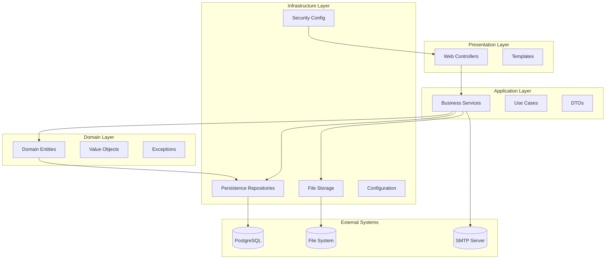
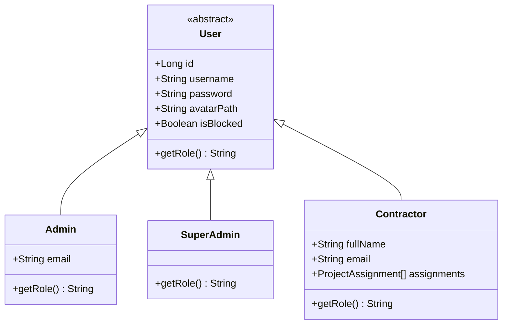
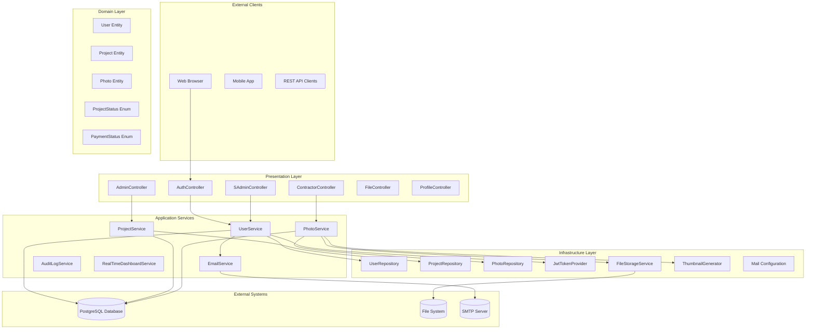
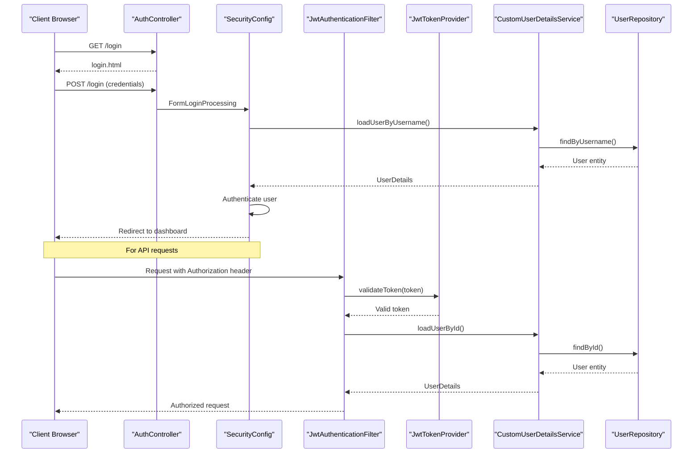
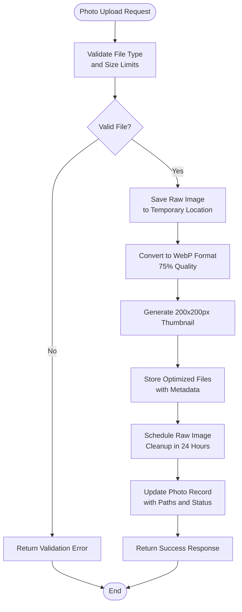
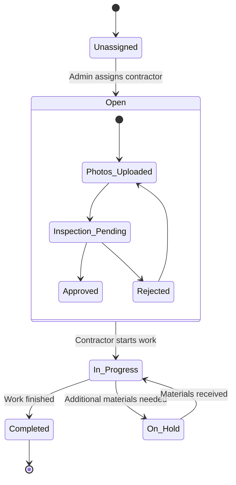
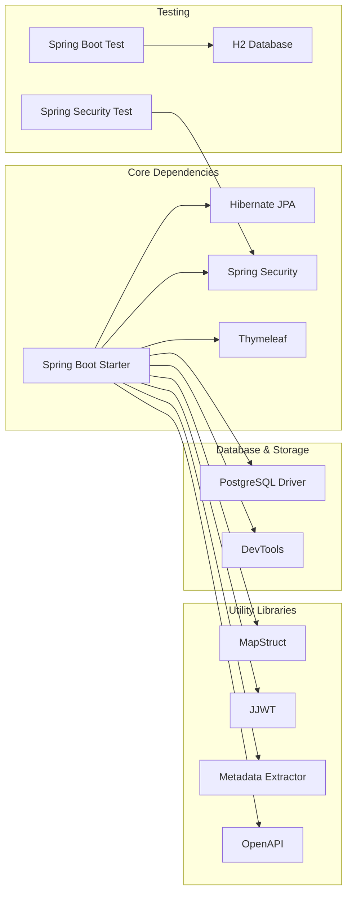

# Project Overview

<cite>
**Referenced Files in This Document**
- [SkylinkMediaServiceApplication.java](file://src/main/java/root/cyb/mh/skylink_media_service/SkylinkMediaServiceApplication.java)
- [README.md](file://README.md)
- [build.gradle](file://build.gradle)
- [application.properties](file://src/main/resources/application.properties)
- [requirements.md](file://requirements.md)
- [User.java](file://src/main/java/root/cyb/mh/skylink_media_service/domain/entities/User.java)
- [Admin.java](file://src/main/java/root/cyb/mh/skylink_media_service/domain/entities/Admin.java)
- [Contractor.java](file://src/main/java/root/cyb/mh/skylink_media_service/domain/entities/Contractor.java)
- [Project.java](file://src/main/java/root/cyb/mh/skylink_media_service/domain/entities/Project.java)
- [Photo.java](file://src/main/java/root/cyb/mh/skylink_media_service/domain/entities/Photo.java)
- [JwtTokenProvider.java](file://src/main/java/root/cyb/mh/skylink_media_service/infrastructure/security/jwt/JwtTokenProvider.java)
- [SecurityConfig.java](file://src/main/java/root/cyb/mh/skylink_media_service/infrastructure/security/SecurityConfig.java)
- [AuthController.java](file://src/main/java/root/cyb/mh/skylink_media_service/infrastructure/web/AuthController.java)
</cite>

## Table of Contents
1. [Introduction](#introduction)
2. [Project Structure](#project-structure)
3. [Core Components](#core-components)
4. [Architecture Overview](#architecture-overview)
5. [Detailed Component Analysis](#detailed-component-analysis)
6. [Dependency Analysis](#dependency-analysis)
7. [Performance Considerations](#performance-considerations)
8. [Troubleshooting Guide](#troubleshooting-guide)
9. [Conclusion](#conclusion)

## Introduction
Skylink Media Service is a Spring Boot 4.0.3 application built with Java 21 that provides a comprehensive media project management platform. The system supports contractor coordination and advanced photo handling capabilities, including automatic WebP conversion, thumbnail generation, and storage cleanup. It features a multi-role architecture with ADMIN, SUPER_ADMIN, and CONTRACTOR user roles, enabling streamlined project management workflows where administrators create and manage projects, contractors upload photos to assigned projects, and the system optimizes storage through automated image processing.

The platform emphasizes clean architecture principles with distinct layers for domain logic, application services, infrastructure concerns, and web presentation. Built-in real-time communication capabilities via WebSocket support enable live dashboards and chat functionality, while robust administration tools provide oversight of user activities, project progress, and system logs.

## Project Structure
The project follows a layered architecture pattern with clear separation of concerns:

**Diagram sources**
- [SkylinkMediaServiceApplication.java:1-18](file://src/main/java/root/cyb/mh/skylink_media_service/SkylinkMediaServiceApplication.java#L1-L18)
- [User.java:1-82](file://src/main/java/root/cyb/mh/skylink_media_service/domain/entities/User.java#L1-L82)
- [SecurityConfig.java:1-104](file://src/main/java/root/cyb/mh/skylink_media_service/infrastructure/security/SecurityConfig.java#L1-L104)

The codebase is organized into four primary packages:
- **domain**: Contains core business entities, value objects, and domain exceptions
- **application**: Houses business logic services, use cases, and data transfer objects
- **infrastructure**: Manages persistence, security, configuration, and external integrations
- **resources**: Includes templates, static assets, and application configuration

**Section sources**
- [README.md:102-116](file://README.md#L102-L116)
- [build.gradle:1-52](file://build.gradle#L1-L52)

## Core Components
The system comprises several interconnected components that work together to deliver the media project management functionality:

### Multi-Roles Architecture
The authentication and authorization system supports three distinct user roles with specific permissions and capabilities:

**Diagram sources**
- [User.java:1-82](file://src/main/java/root/cyb/mh/skylink_media_service/domain/entities/User.java#L1-L82)
- [Admin.java:1-33](file://src/main/java/root/cyb/mh/skylink_media_service/domain/entities/Admin.java#L1-L33)
- [Contractor.java:1-48](file://src/main/java/root/cyb/mh/skylink_media_service/domain/entities/Contractor.java#L1-L48)

### Business Domains
The system encompasses four core business domains:

1. **Project Management**: End-to-end project lifecycle management including creation, assignment, status tracking, and completion
2. **Photo Processing**: Advanced image handling with automatic optimization, conversion, and storage management
3. **Real-Time Communication**: Live dashboards, chat functionality, and presence indicators
4. **Administration**: User management, system monitoring, and operational oversight

### Technology Stack
The application leverages modern technologies and frameworks:
- **Backend**: Spring Boot 4.0.3, Java 21, PostgreSQL
- **Security**: Spring Security with role-based access control and JWT authentication
- **Frontend**: Thymeleaf templates with Tailwind CSS
- **Build Tool**: Gradle with dependency management
- **Additional Libraries**: MapStruct for object mapping, JWT libraries for token handling, OpenAPI for documentation

**Section sources**
- [README.md:26-32](file://README.md#L26-L32)
- [build.gradle:21-46](file://build.gradle#L21-L46)
- [application.properties:27-31](file://src/main/resources/application.properties#L27-L31)

## Architecture Overview
The system implements a clean architecture pattern with well-defined boundaries between layers:

**Diagram sources**
- [AuthController.java:1-28](file://src/main/java/root/cyb/mh/skylink_media_service/infrastructure/web/AuthController.java#L1-L28)
- [SecurityConfig.java:43-87](file://src/main/java/root/cyb/mh/skylink_media_service/infrastructure/security/SecurityConfig.java#L43-L87)
- [JwtTokenProvider.java:16-81](file://src/main/java/root/cyb/mh/skylink_media_service/infrastructure/security/jwt/JwtTokenProvider.java#L16-L81)

The architecture ensures loose coupling and high cohesion through:
- **Dependency Inversion**: Higher layers depend on abstractions, not concrete implementations
- **Single Responsibility**: Each layer has a specific focus and responsibility
- **Clear Boundaries**: Well-defined interfaces between layers prevent cross-contamination
- **Testability**: Abstractions enable easy mocking and unit testing

## Detailed Component Analysis

### Authentication and Authorization System
The security implementation combines traditional form-based authentication with modern JWT token handling:

**Diagram sources**
- [AuthController.java:11-26](file://src/main/java/root/cyb/mh/skylink_media_service/infrastructure/web/AuthController.java#L11-L26)
- [SecurityConfig.java:43-87](file://src/main/java/root/cyb/mh/skylink_media_service/infrastructure/security/SecurityConfig.java#L43-L87)
- [JwtTokenProvider.java:25-58](file://src/main/java/root/cyb/mh/skylink_media_service/infrastructure/security/jwt/JwtTokenProvider.java#L25-L58)

The system provides comprehensive security features:
- **Role-Based Access Control**: Fine-grained permissions for different user types
- **CSRF Protection**: Defense against cross-site request forgery attacks
- **Session Management**: Secure session handling with configurable policies
- **Password Encryption**: BCrypt hashing for secure credential storage
- **JWT Token Validation**: Stateless authentication for API endpoints

### Photo Processing Pipeline
The photo handling system implements an intelligent optimization pipeline:

**Diagram sources**
- [Photo.java:14-65](file://src/main/java/root/cyb/mh/skylink_media_service/domain/entities/Photo.java#L14-L65)

Key features include:
- **Automatic Format Conversion**: Seamless WebP conversion for optimal compression
- **Thumbnail Generation**: Efficient preview generation for list views
- **Metadata Extraction**: EXIF data preservation and processing
- **Storage Optimization**: Automated cleanup of raw files after optimization
- **Quality Control**: Configurable optimization parameters

### Project Management Workflow
The project lifecycle management encompasses comprehensive tracking and coordination:

**Diagram sources**
- [Project.java:185-236](file://src/main/java/root/cyb/mh/skylink_media_service/domain/entities/Project.java#L185-L236)

The system tracks multiple dimensions of project progress:
- **Status Management**: Controlled transitions between project states
- **Photo Evidence**: Visual documentation of work completion
- **Timeline Tracking**: Creation, opening, and completion timestamps
- **Assignment Management**: Contractor-project relationships
- **Audit Trail**: Comprehensive logging of all actions

**Section sources**
- [requirements.md:1-18](file://requirements.md#L1-L18)
- [README.md:5-25](file://README.md#L5-L25)

## Dependency Analysis
The project maintains clean dependency relationships through strategic abstraction and modular design:

**Diagram sources**
- [build.gradle:21-46](file://build.gradle#L21-L46)

The dependency structure supports:
- **Modular Development**: Clear separation between core functionality and utilities
- **Testing Isolation**: Dedicated test dependencies for reliable unit testing
- **Development Efficiency**: Developer tools and hot-reload capabilities
- **Production Readiness**: Lightweight runtime dependencies

**Section sources**
- [build.gradle:1-52](file://build.gradle#L1-L52)

## Performance Considerations
The system incorporates several performance optimization strategies:

### Storage Optimization
- **Image Compression**: Automatic WebP conversion reduces file sizes by up to 70%
- **Thumbnail Caching**: Pre-generated thumbnails eliminate on-demand processing
- **Temporary File Management**: Automated cleanup prevents storage bloat
- **Content Delivery**: Proper MIME type serving for efficient browser caching

### Database Performance
- **Connection Pooling**: Optimized connection management for concurrent requests
- **Index Strategy**: Strategic indexing on frequently queried fields
- **Batch Operations**: Efficient bulk processing for administrative tasks
- **Query Optimization**: JPQL queries designed for minimal database overhead

### Scalability Factors
- **Asynchronous Processing**: Background tasks for heavy operations like image optimization
- **Caching Strategy**: Application-level caching for frequently accessed data
- **Load Distribution**: Stateless design enabling horizontal scaling
- **Resource Management**: Efficient memory usage for large file processing

## Troubleshooting Guide
Common issues and their resolutions:

### Authentication Problems
- **Login Failures**: Verify credentials match database records and account is not blocked
- **Session Issues**: Check browser cookies and session timeout configuration
- **JWT Validation Errors**: Confirm token expiration and secret key consistency

### Photo Upload Issues
- **File Size Limits**: Review multipart configuration in application properties
- **Format Support**: Ensure uploaded files are supported image formats
- **Storage Permissions**: Verify write access to upload directory
- **WebP Conversion**: Check cwebp binary availability and execution permissions

### Database Connectivity
- **Connection Refused**: Verify PostgreSQL service status and network connectivity
- **Schema Mismatch**: Run database migration scripts to update schema
- **Credential Issues**: Confirm database username/password in application properties

### Performance Issues
- **Slow Image Processing**: Monitor CPU usage during optimization tasks
- **Memory Leaks**: Check for proper resource cleanup in file operations
- **Database Locking**: Review transaction isolation levels and query optimization

**Section sources**
- [application.properties:13-15](file://src/main/resources/application.properties#L13-L15)
- [application.properties:5-8](file://src/main/resources/application.properties#L5-L8)

## Conclusion
Skylink Media Service represents a comprehensive solution for media project management with contractor coordination. The system successfully integrates modern technologies with clean architecture principles to deliver a scalable, maintainable platform. Its multi-role authentication system, advanced photo processing capabilities, and real-time communication features position it as a robust foundation for media production workflows.

The project demonstrates excellent architectural decisions including clear layer separation, dependency inversion, and comprehensive security measures. The combination of Spring Boot's productivity features with PostgreSQL's reliability creates a solid foundation for enterprise-scale deployments. Future enhancements could include distributed caching, message queuing for asynchronous processing, and container orchestration for improved scalability.