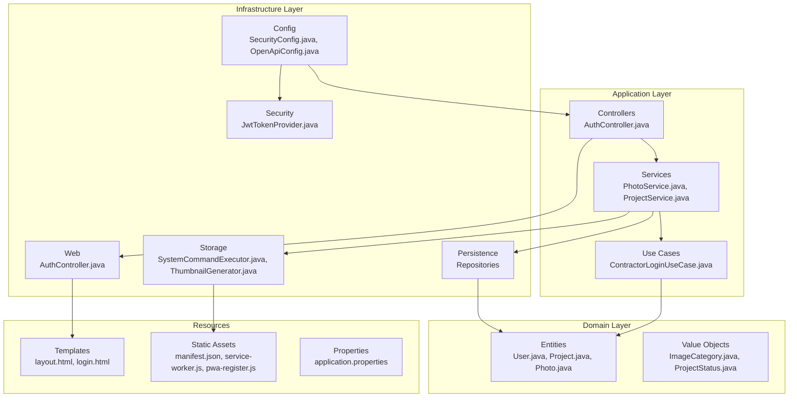
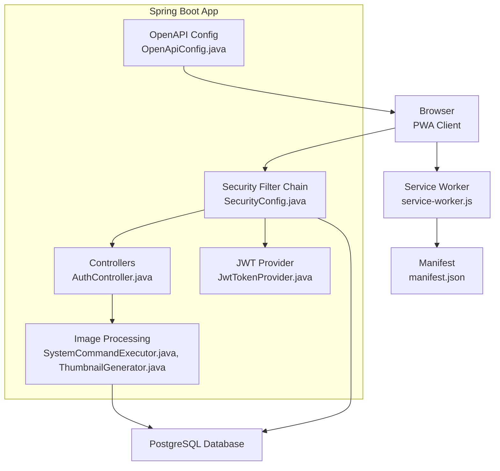
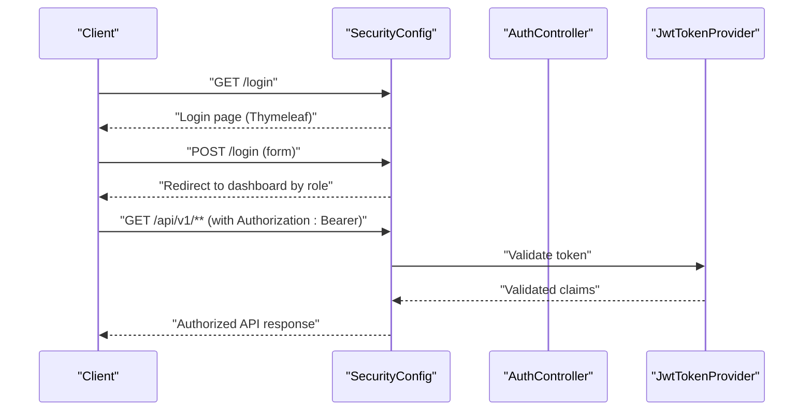
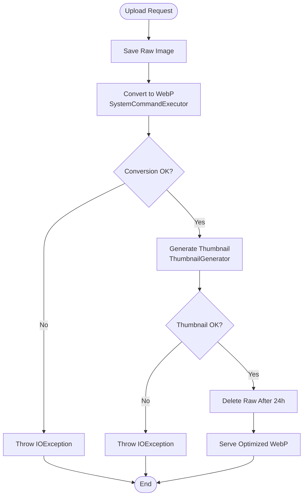
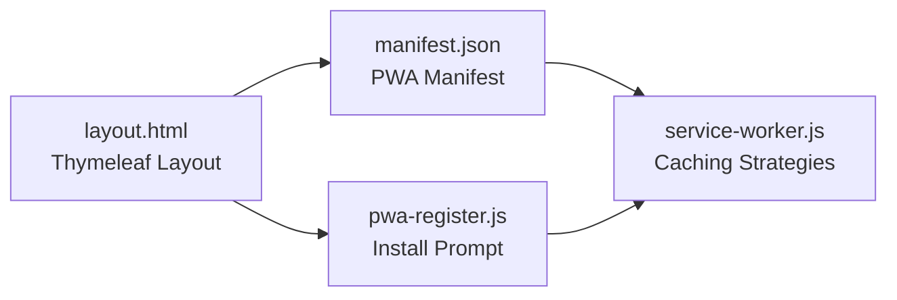
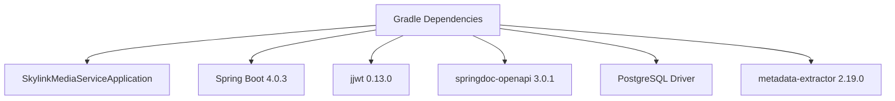

# Technology Stack

<cite>
**Referenced Files in This Document**
- [build.gradle](file://build.gradle)
- [settings.gradle](file://settings.gradle)
- [SkylinkMediaServiceApplication.java](file://SkylinkMediaServiceApplication.java)
- [application.properties](file://application.properties)
- [README.md](file://README.md)
- [OpenApiConfig.java](file://infrastructure/config/OpenApiConfig.java)
- [SecurityConfig.java](file://infrastructure/security/SecurityConfig.java)
- [JwtTokenProvider.java](file://infrastructure/security/jwt/JwtTokenProvider.java)
- [SystemCommandExecutor.java](file://infrastructure/storage/SystemCommandExecutor.java)
- [ThumbnailGenerator.java](file://infrastructure/storage/ThumbnailGenerator.java)
- [layout.html](file://src/main/resources/templates/layout.html)
- [manifest.json](file://src/main/resources/static/manifest.json)
- [service-worker.js](file://src/main/resources/static/service-worker.js)
- [pwa-register.js](file://src/main/resources/static/js/pwa-register.js)
- [AuthController.java](file://infrastructure/web/AuthController.java)
</cite>

## Table of Contents
1. [Introduction](#introduction)
2. [Project Structure](#project-structure)
3. [Core Technologies](#core-technologies)
4. [Architecture Overview](#architecture-overview)
5. [Detailed Component Analysis](#detailed-component-analysis)
6. [Dependency Analysis](#dependency-analysis)
7. [Performance Considerations](#performance-considerations)
8. [Troubleshooting Guide](#troubleshooting-guide)
9. [Conclusion](#conclusion)

## Introduction
This document describes the Skylink Media Service technology stack, focusing on the backend built with Spring Boot 4.0.3 and Java 21, PostgreSQL database, modern web frameworks, authentication with Spring Security and JWT, image processing pipeline using WebP conversion and thumbnails, and API documentation via SpringDoc OpenAPI. It also covers frontend capabilities including Thymeleaf templating, HTML/CSS/JavaScript, and Progressive Web App (PWA) features.

## Project Structure
The backend follows a layered architecture with clear separation of concerns:
- Domain layer: Entities, value objects, and domain services
- Application layer: Use cases and application services
- Infrastructure layer: Persistence, security, storage, web controllers, and configuration
- Resources: Templates (Thymeleaf), static assets (PWA), and configuration

**Diagram sources**
- [AuthController.java:1-28](file://infrastructure/web/AuthController.java#L1-L28)
- [SecurityConfig.java:1-104](file://infrastructure/security/SecurityConfig.java#L1-L104)
- [OpenApiConfig.java:1-30](file://infrastructure/config/OpenApiConfig.java#L1-L30)
- [JwtTokenProvider.java:1-81](file://infrastructure/security/jwt/JwtTokenProvider.java#L1-L81)
- [SystemCommandExecutor.java:1-32](file://infrastructure/storage/SystemCommandExecutor.java#L1-L32)
- [ThumbnailGenerator.java:1-42](file://infrastructure/storage/ThumbnailGenerator.java#L1-L42)
- [layout.html:1-90](file://src/main/resources/templates/layout.html#L1-L90)
- [manifest.json:1-29](file://src/main/resources/static/manifest.json#L1-L29)
- [service-worker.js:1-133](file://src/main/resources/static/service-worker.js#L1-L133)
- [pwa-register.js:1-177](file://src/main/resources/static/js/pwa-register.js#L1-L177)
- [application.properties:1-58](file://application.properties#L1-L58)

**Section sources**
- [README.md:102-116](file://README.md#L102-L116)
- [SkylinkMediaServiceApplication.java:1-18](file://SkylinkMediaServiceApplication.java#L1-L18)

## Core Technologies
- Backend framework: Spring Boot 4.0.3 with Java 21 toolchain
- Database: PostgreSQL with Hibernate dialect
- Security: Spring Security with role-based access control and JWT
- Templating: Thymeleaf with Spring Security extras
- API documentation: SpringDoc OpenAPI (Swagger UI)
- Build tool: Gradle with Spring Dependency Management
- Image processing: WebP conversion and thumbnail generation using cwebp
- Frontend: HTML/CSS/JavaScript with Tailwind CSS and PWA support

**Section sources**
- [build.gradle:1-52](file://build.gradle#L1-L52)
- [application.properties:1-58](file://application.properties#L1-L58)
- [README.md:26-32](file://README.md#L26-L32)

## Architecture Overview
The system integrates a Spring MVC web tier with Thymeleaf for server-rendered pages and a PWA client for offline-capable experiences. Security is enforced via Spring Security with form login for UI and JWT for API access. Image processing is handled by native WebP tools invoked through a system command executor, producing optimized WebP files and thumbnails.

**Diagram sources**
- [SecurityConfig.java:43-88](file://infrastructure/security/SecurityConfig.java#L43-L88)
- [OpenApiConfig.java:14-28](file://infrastructure/config/OpenApiConfig.java#L14-L28)
- [AuthController.java:1-28](file://infrastructure/web/AuthController.java#L1-L28)
- [JwtTokenProvider.java:25-37](file://infrastructure/security/jwt/JwtTokenProvider.java#L25-L37)
- [SystemCommandExecutor.java:11-30](file://infrastructure/storage/SystemCommandExecutor.java#L11-L30)
- [ThumbnailGenerator.java:17-40](file://infrastructure/storage/ThumbnailGenerator.java#L17-L40)
- [service-worker.js:1-133](file://src/main/resources/static/service-worker.js#L1-L133)
- [manifest.json:1-29](file://src/main/resources/static/manifest.json#L1-L29)

## Detailed Component Analysis

### Authentication and Security
- Form-based login routes and redirects are configured in the security filter chain, with role-specific dashboards.
- JWT is supported for API endpoints, with a dedicated provider that generates signed tokens containing contractor identity and roles.
- CORS is configured for development origins, and CSRF is selectively disabled for API paths.

**Diagram sources**
- [SecurityConfig.java:49-84](file://infrastructure/security/SecurityConfig.java#L49-L84)
- [AuthController.java:11-26](file://infrastructure/web/AuthController.java#L11-L26)
- [JwtTokenProvider.java:39-49](file://infrastructure/security/jwt/JwtTokenProvider.java#L39-L49)

**Section sources**
- [SecurityConfig.java:1-104](file://infrastructure/security/SecurityConfig.java#L1-L104)
- [JwtTokenProvider.java:1-81](file://infrastructure/security/jwt/JwtTokenProvider.java#L1-L81)
- [AuthController.java:1-28](file://infrastructure/web/AuthController.java#L1-L28)

### Image Processing Pipeline
- WebP conversion: Uses cwebp to convert uploaded images to WebP with metadata preservation and configurable quality.
- Thumbnail generation: Creates 200x200 thumbnails via cwebp resize and outputs to a thumbnails directory.
- Error handling: Captures non-zero exit codes and thread interruptions during process execution.

**Diagram sources**
- [SystemCommandExecutor.java:11-30](file://infrastructure/storage/SystemCommandExecutor.java#L11-L30)
- [ThumbnailGenerator.java:17-40](file://infrastructure/storage/ThumbnailGenerator.java#L17-L40)

**Section sources**
- [README.md:20-25](file://README.md#L20-L25)
- [SystemCommandExecutor.java:1-32](file://infrastructure/storage/SystemCommandExecutor.java#L1-L32)
- [ThumbnailGenerator.java:1-42](file://infrastructure/storage/ThumbnailGenerator.java#L1-L42)

### API Documentation with SpringDoc OpenAPI
- OpenAPI configuration defines a bearerAuth security scheme and documents the API with title, version, and description.
- Swagger UI endpoints are permitted without authentication for documentation browsing.

**Section sources**
- [OpenApiConfig.java:1-30](file://infrastructure/config/OpenApiConfig.java#L1-L30)
- [SecurityConfig.java:50](file://infrastructure/security/SecurityConfig.java#L50)

### Frontend Stack and PWA Capabilities
- Thymeleaf templates provide server-side rendering with layout fragments and Spring Security integration.
- PWA features include a manifest, service worker caching strategies, and install prompts for mobile devices.
- Tailwind CSS is loaded from CDN with responsive and accessibility enhancements.

**Diagram sources**
- [layout.html:1-90](file://src/main/resources/templates/layout.html#L1-L90)
- [manifest.json:1-29](file://src/main/resources/static/manifest.json#L1-L29)
- [service-worker.js:1-133](file://src/main/resources/static/service-worker.js#L1-L133)
- [pwa-register.js:1-177](file://src/main/resources/static/js/pwa-register.js#L1-L177)

**Section sources**
- [layout.html:1-90](file://src/main/resources/templates/layout.html#L1-L90)
- [manifest.json:1-29](file://src/main/resources/static/manifest.json#L1-L29)
- [service-worker.js:1-133](file://src/main/resources/static/service-worker.js#L1-L133)
- [pwa-register.js:1-177](file://src/main/resources/static/js/pwa-register.js#L1-L177)

## Dependency Analysis
External dependencies and their roles:
- Spring Boot starters: web, data-jpa, mail, security, websocket, thymeleaf
- JWT library: jjwt-api with runtime impl and jackson
- Metadata extraction: metadata-extractor for image metadata
- OpenAPI: springdoc-openapi-starter-webmvc-ui
- PostgreSQL driver: runtime-only
- Test: spring-boot-starter-test, spring-security-test, h2 database

**Diagram sources**
- [build.gradle:21-46](file://build.gradle#L21-L46)

**Section sources**
- [build.gradle:1-52](file://build.gradle#L1-L52)

## Performance Considerations
- Image optimization reduces bandwidth and storage costs by converting to WebP and generating thumbnails.
- Service worker caching improves offline readiness and reduces repeated network requests for static assets.
- Asynchronous and scheduled tasks are enabled at the application level, enabling potential background jobs for cleanup or maintenance.

[No sources needed since this section provides general guidance]

## Troubleshooting Guide
Common issues and resolutions:
- WebP tool availability: Ensure cwebp is installed and accessible in PATH as per setup instructions.
- Database connectivity: Verify JDBC URL, username, and password in application properties.
- CORS errors: Confirm allowed origins and methods match frontend origin.
- JWT token validation failures: Check secret key and expiration settings.
- PWA installation prompts: Confirm HTTPS deployment and service worker registration.

**Section sources**
- [README.md:42-52](file://README.md#L42-L52)
- [application.properties:3-58](file://application.properties#L3-L58)
- [SecurityConfig.java:91-102](file://infrastructure/security/SecurityConfig.java#L91-L102)
- [JwtTokenProvider.java:19-23](file://infrastructure/security/jwt/JwtTokenProvider.java#L19-L23)
- [service-worker.js:1-133](file://src/main/resources/static/service-worker.js#L1-L133)

## Conclusion
The Skylink Media Service leverages a modern, production-ready stack combining Spring Boot 4.0.3 with Java 21, PostgreSQL, Spring Security with JWT, Thymeleaf, and SpringDoc OpenAPI. The image processing pipeline ensures efficient media delivery, while PWA capabilities enhance usability across devices. These choices align with a robust media production workflow emphasizing performance, maintainability, and scalability.