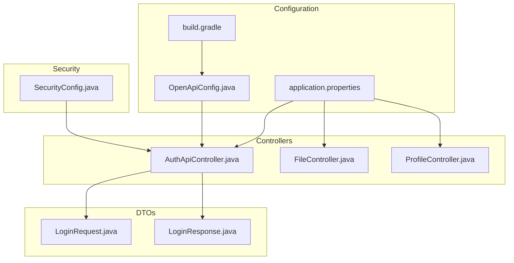
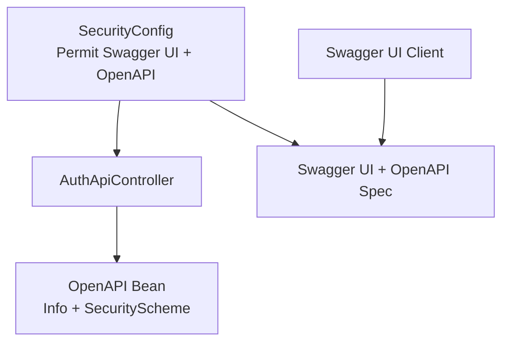
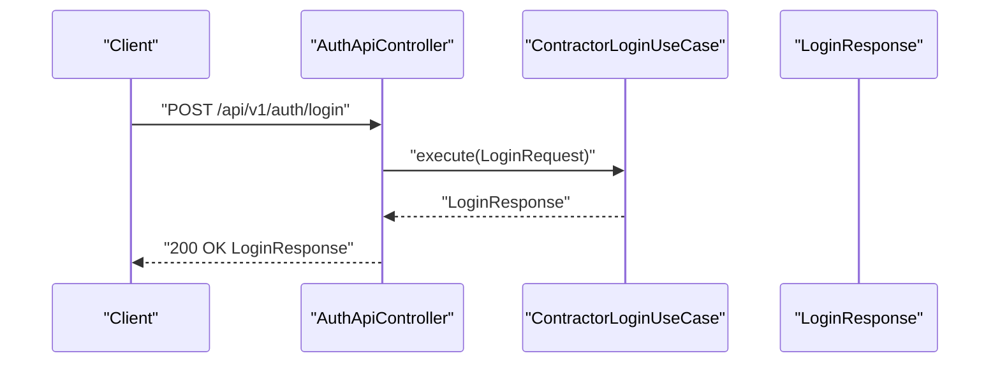
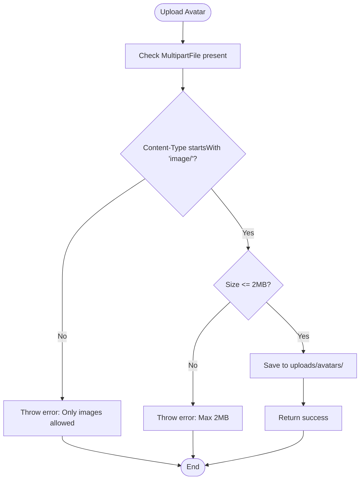
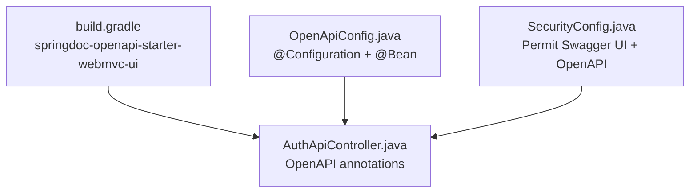

# API Documentation with OpenAPI

<cite>
**Referenced Files in This Document**
- [OpenApiConfig.java](file://src/main/java/root/cyb/mh/skylink_media_service/infrastructure/config/OpenApiConfig.java)
- [AuthApiController.java](file://src/main/java/root/cyb/mh/skylink_media_service/infrastructure/web/api/AuthApiController.java)
- [LoginRequest.java](file://src/main/java/root/cyb/mh/skylink_media_service/application/dto/api/LoginRequest.java)
- [LoginResponse.java](file://src/main/java/root/cyb/mh/skylink_media_service/application/dto/api/LoginResponse.java)
- [SecurityConfig.java](file://src/main/java/root/cyb/mh/skylink_media_service/infrastructure/security/SecurityConfig.java)
- [application.properties](file://src/main/resources/application.properties)
- [build.gradle](file://build.gradle)
- [README_API.md](file://README_API.md)
- [SWAGGER_QUICK_GUIDE.md](file://SWAGGER_QUICK_GUIDE.md)
- [FileController.java](file://src/main/java/root/cyb/mh/skylink_media_service/infrastructure/web/FileController.java)
- [ProfileController.java](file://src/main/java/root/cyb/mh/skylink_media_service/infrastructure/web/ProfileController.java)
</cite>

## Table of Contents
1. [Introduction](#introduction)
2. [Project Structure](#project-structure)
3. [Core Components](#core-components)
4. [Architecture Overview](#architecture-overview)
5. [Detailed Component Analysis](#detailed-component-analysis)
6. [Dependency Analysis](#dependency-analysis)
7. [Performance Considerations](#performance-considerations)
8. [Troubleshooting Guide](#troubleshooting-guide)
9. [Conclusion](#conclusion)
10. [Appendices](#appendices)

## Introduction
This document explains the OpenAPI/Swagger integration in the Skylink Media Service backend. It covers configuration setup, automatic documentation generation from controller annotations and models, Swagger UI configuration, endpoint documentation, parameter descriptions, authentication endpoints, file upload operations, complex query parameters, API versioning, documentation best practices, and integration with development workflows.

## Project Structure
The OpenAPI/Swagger integration spans configuration beans, Spring MVC controllers annotated with OpenAPI annotations, DTOs, and security configuration. The build file includes the OpenAPI UI starter dependency, while application properties centralize API base path and versioning.

**Diagram sources**
- [OpenApiConfig.java:11-28](file://src/main/java/root/cyb/mh/skylink_media_service/infrastructure/config/OpenApiConfig.java#L11-L28)
- [AuthApiController.java:14-33](file://src/main/java/root/cyb/mh/skylink_media_service/infrastructure/web/api/AuthApiController.java#L14-L33)
- [LoginRequest.java:6-28](file://src/main/java/root/cyb/mh/skylink_media_service/application/dto/api/LoginRequest.java#L6-L28)
- [LoginResponse.java:5-41](file://src/main/java/root/cyb/mh/skylink_media_service/application/dto/api/LoginResponse.java#L5-L41)
- [SecurityConfig.java:43-87](file://src/main/java/root/cyb/mh/skylink_media_service/infrastructure/security/SecurityConfig.java#L43-L87)
- [application.properties:33-35](file://src/main/resources/application.properties#L33-L35)
- [build.gradle:44-45](file://build.gradle#L44-L45)

**Section sources**
- [OpenApiConfig.java:11-28](file://src/main/java/root/cyb/mh/skylink_media_service/infrastructure/config/OpenApiConfig.java#L11-L28)
- [application.properties:33-35](file://src/main/resources/application.properties#L33-L35)
- [build.gradle:44-45](file://build.gradle#L44-L45)

## Core Components
- OpenAPI configuration bean defines API metadata, version, description, and bearer JWT security scheme.
- Auth API controller exposes the contractor login endpoint with OpenAPI tags and operation descriptions.
- DTOs define request/response shapes for the login endpoint.
- Security configuration integrates JWT authentication and permits Swagger UI and OpenAPI endpoints.
- Application properties centralize API versioning and base path.
- Build configuration includes the OpenAPI UI starter dependency.

Key responsibilities:
- OpenApiConfig: Provides OpenAPI info and security scheme.
- AuthApiController: Exposes authenticated endpoint with tag and operation metadata.
- SecurityConfig: Protects API routes and allows Swagger UI access.
- application.properties: Defines API versioning and base path.
- build.gradle: Declares OpenAPI UI dependency.

**Section sources**
- [OpenApiConfig.java:14-28](file://src/main/java/root/cyb/mh/skylink_media_service/infrastructure/config/OpenApiConfig.java#L14-L28)
- [AuthApiController.java:17-32](file://src/main/java/root/cyb/mh/skylink_media_service/infrastructure/web/api/AuthApiController.java#L17-L32)
- [LoginRequest.java:8-14](file://src/main/java/root/cyb/mh/skylink_media_service/application/dto/api/LoginRequest.java#L8-L14)
- [LoginResponse.java:7-12](file://src/main/java/root/cyb/mh/skylink_media_service/application/dto/api/LoginResponse.java#L7-L12)
- [SecurityConfig.java:49-57](file://src/main/java/root/cyb/mh/skylink_media_service/infrastructure/security/SecurityConfig.java#L49-L57)
- [application.properties:34-35](file://src/main/resources/application.properties#L34-L35)
- [build.gradle:44-45](file://build.gradle#L44-L45)

## Architecture Overview
The OpenAPI/Swagger integration relies on:
- OpenAPI bean providing global info and security scheme.
- SpringDoc OpenAPI UI starter enabling Swagger UI and OpenAPI spec endpoints.
- Controllers annotated with OpenAPI annotations to auto-generate documentation.
- Security configuration allowing unauthenticated access to Swagger UI and OpenAPI endpoints while protecting API routes.

**Diagram sources**
- [OpenApiConfig.java:14-28](file://src/main/java/root/cyb/mh/skylink_media_service/infrastructure/config/OpenApiConfig.java#L14-L28)
- [AuthApiController.java:17-32](file://src/main/java/root/cyb/mh/skylink_media_service/infrastructure/web/api/AuthApiController.java#L17-L32)
- [SecurityConfig.java:49-57](file://src/main/java/root/cyb/mh/skylink_media_service/infrastructure/security/SecurityConfig.java#L49-L57)

## Detailed Component Analysis

### OpenAPI Configuration Setup
- Defines API title, version, description, and a bearer JWT security scheme named "bearerAuth".
- Adds a global security requirement so protected endpoints require authorization.
- Provides a description for the JWT scheme indicating usage from the login endpoint.

Best practices:
- Keep version and description aligned with release notes.
- Use consistent naming for security schemes across annotations.

**Section sources**
- [OpenApiConfig.java:14-28](file://src/main/java/root/cyb/mh/skylink_media_service/infrastructure/config/OpenApiConfig.java#L14-L28)

### Swagger UI Configuration and Access
- Swagger UI and OpenAPI spec endpoints are permitted without authentication.
- Security configuration allows access to "/swagger-ui/**", "/v3/api-docs/**", and "/swagger-ui.html".

Operational URLs:
- Swagger UI: http://localhost:8085/swagger-ui/index.html
- OpenAPI Spec: http://localhost:8085/v3/api-docs

**Section sources**
- [SecurityConfig.java:49-51](file://src/main/java/root/cyb/mh/skylink_media_service/infrastructure/security/SecurityConfig.java#L49-L51)
- [SWAGGER_QUICK_GUIDE.md:111-115](file://SWAGGER_QUICK_GUIDE.md#L111-L115)

### Authentication Endpoint Documentation
- Controller: AuthApiController exposes POST /api/v1/auth/login.
- Tag: "Authentication" groups endpoints.
- Operation: Summary and description explain login purpose and token usage.
- DTOs: LoginRequest and LoginResponse define payload and response shape.
- Validation: Request DTO enforces non-blank username/password with size constraints.

**Diagram sources**
- [AuthApiController.java:23-32](file://src/main/java/root/cyb/mh/skylink_media_service/infrastructure/web/api/AuthApiController.java#L23-L32)
- [LoginRequest.java:8-14](file://src/main/java/root/cyb/mh/skylink_media_service/application/dto/api/LoginRequest.java#L8-L14)
- [LoginResponse.java:7-12](file://src/main/java/root/cyb/mh/skylink_media_service/application/dto/api/LoginResponse.java#L7-L12)

**Section sources**
- [AuthApiController.java:17-32](file://src/main/java/root/cyb/mh/skylink_media_service/infrastructure/web/api/AuthApiController.java#L17-L32)
- [LoginRequest.java:8-14](file://src/main/java/root/cyb/mh/skylink_media_service/application/dto/api/LoginRequest.java#L8-L14)
- [LoginResponse.java:7-12](file://src/main/java/root/cyb/mh/skylink_media_service/application/dto/api/LoginResponse.java#L7-L12)

### Parameter Descriptions and Validation
- Username: Required, length between 3 and 50 characters.
- Password: Required, length between 8 and 100 characters.
- Response fields: token, tokenType, contractorId, fullName, expiresAt, expiresIn.

Recommendations:
- Keep validation messages concise and user-friendly.
- Align DTO field descriptions with OpenAPI operation parameters.

**Section sources**
- [LoginRequest.java:8-14](file://src/main/java/root/cyb/mh/skylink_media_service/application/dto/api/LoginRequest.java#L8-L14)
- [LoginResponse.java:7-12](file://src/main/java/root/cyb/mh/skylink_media_service/application/dto/api/LoginResponse.java#L7-L12)

### File Upload Operations
- ProfileController supports multipart file uploads for avatar updates with validation:
  - Content type restricted to images.
  - Size limit enforced.
  - Safe filename generation with UUID suffix.
- FileController serves uploaded files and thumbnails with appropriate headers.

**Diagram sources**
- [ProfileController.java:133-156](file://src/main/java/root/cyb/mh/skylink_media_service/infrastructure/web/ProfileController.java#L133-L156)

**Section sources**
- [ProfileController.java:50-62](file://src/main/java/root/cyb/mh/skylink_media_service/infrastructure/web/ProfileController.java#L50-L62)
- [ProfileController.java:95-108](file://src/main/java/root/cyb/mh/skylink_media_service/infrastructure/web/ProfileController.java#L95-L108)
- [ProfileController.java:133-156](file://src/main/java/root/cyb/mh/skylink_media_service/infrastructure/web/ProfileController.java#L133-L156)
- [FileController.java:21-43](file://src/main/java/root/cyb/mh/skylink_media_service/infrastructure/web/FileController.java#L21-L43)
- [FileController.java:45-64](file://src/main/java/root/cyb/mh/skylink_media_service/infrastructure/web/FileController.java#L45-L64)
- [FileController.java:66-82](file://src/main/java/root/cyb/mh/skylink_media_service/infrastructure/web/FileController.java#L66-L82)

### Complex Query Parameters
- Current controllers primarily use path variables and request bodies.
- For complex query parameters, define dedicated DTOs with validation annotations and bind them via @RequestParam or @ModelAttribute.
- Document query parameters using OpenAPI annotations on controller methods and parameters.

[No sources needed since this section provides general guidance]

### API Versioning
- API versioning is centralized in application.properties with api.version and api.base-path.
- AuthApiController uses /api/v1 path prefix.
- Keep version consistent across configuration, controllers, and documentation.

**Section sources**
- [application.properties:34-35](file://src/main/resources/application.properties#L34-L35)
- [AuthApiController.java:15](file://src/main/java/root/cyb/mh/skylink_media_service/infrastructure/web/api/AuthApiController.java#L15)

### Automatic Documentation Generation
- OpenAPI UI starter dependency enables Swagger UI and OpenAPI spec generation.
- Annotations on controllers (Tag, Operation) and DTOs drive documentation.
- Global security scheme and requirement propagate to protected endpoints.

**Section sources**
- [build.gradle:44-45](file://build.gradle#L44-L45)
- [AuthApiController.java:17-32](file://src/main/java/root/cyb/mh/skylink_media_service/infrastructure/web/api/AuthApiController.java#L17-L32)
- [OpenApiConfig.java:21-27](file://src/main/java/root/cyb/mh/skylink_media_service/infrastructure/config/OpenApiConfig.java#L21-L27)

### Integration with Development Workflows
- Swagger UI quick start and verification steps streamline developer onboarding.
- Automated scripts support testing and verification of Swagger/JWT integration.
- README_API.md provides quick reference and verification commands.

**Section sources**
- [SWAGGER_QUICK_GUIDE.md:54-72](file://SWAGGER_QUICK_GUIDE.md#L54-L72)
- [README_API.md:83-91](file://README_API.md#L83-L91)
- [README_API.md:203-210](file://README_API.md#L203-L210)

## Dependency Analysis
SpringDoc OpenAPI UI starter is declared in the build file. The OpenAPI configuration bean is registered via a Spring configuration class. Security configuration permits Swagger UI and OpenAPI endpoints while enforcing JWT authentication for API routes.

**Diagram sources**
- [build.gradle:44-45](file://build.gradle#L44-L45)
- [OpenApiConfig.java:11-12](file://src/main/java/root/cyb/mh/skylink_media_service/infrastructure/config/OpenApiConfig.java#L11-L12)
- [SecurityConfig.java:49-51](file://src/main/java/root/cyb/mh/skylink_media_service/infrastructure/security/SecurityConfig.java#L49-L51)
- [AuthApiController.java:17-32](file://src/main/java/root/cyb/mh/skylink_media_service/infrastructure/web/api/AuthApiController.java#L17-L32)

**Section sources**
- [build.gradle:44-45](file://build.gradle#L44-L45)
- [OpenApiConfig.java:11-12](file://src/main/java/root/cyb/mh/skylink_media_service/infrastructure/config/OpenApiConfig.java#L11-L12)
- [SecurityConfig.java:49-51](file://src/main/java/root/cyb/mh/skylink_media_service/infrastructure/security/SecurityConfig.java#L49-L51)

## Performance Considerations
- Keep DTOs minimal and focused to reduce serialization overhead.
- Use pagination for list endpoints to avoid large payloads.
- Cache static assets served by FileController where appropriate.
- Monitor response times for endpoints serving large files.

[No sources needed since this section provides general guidance]

## Troubleshooting Guide
Common issues and resolutions:
- Swagger UI not loading: Verify permit-all for Swagger UI and OpenAPI endpoints.
- 401 Unauthorized on protected endpoints: Authorize using the token from the login response.
- Token not accepted: Confirm token validity and expiration; ensure Authorization header format.
- Login requiring auth: Ensure @SecurityRequirements annotation is present on endpoints that should require authorization.

**Section sources**
- [SecurityConfig.java:49-51](file://src/main/java/root/cyb/mh/skylink_media_service/infrastructure/security/SecurityConfig.java#L49-L51)
- [SWAGGER_QUICK_GUIDE.md:76-84](file://SWAGGER_QUICK_GUIDE.md#L76-L84)

## Conclusion
The Skylink Media Service integrates OpenAPI/Swagger through a dedicated configuration bean, controller annotations, DTOs, and security configuration. This setup enables automatic documentation generation, secure access to Swagger UI, and consistent API versioning. Following the documented best practices ensures maintainable and developer-friendly API documentation.

## Appendices
- Operational URLs:
  - Swagger UI: http://localhost:8085/swagger-ui/index.html
  - OpenAPI Spec: http://localhost:8085/v3/api-docs
- Quick verification:
  - Obtain token via login endpoint.
  - Use the Authorize button in Swagger UI to attach the token.
  - Execute protected endpoints to confirm authorization.

**Section sources**
- [SWAGGER_QUICK_GUIDE.md:111-115](file://SWAGGER_QUICK_GUIDE.md#L111-L115)
- [README_API.md:83-91](file://README_API.md#L83-L91)