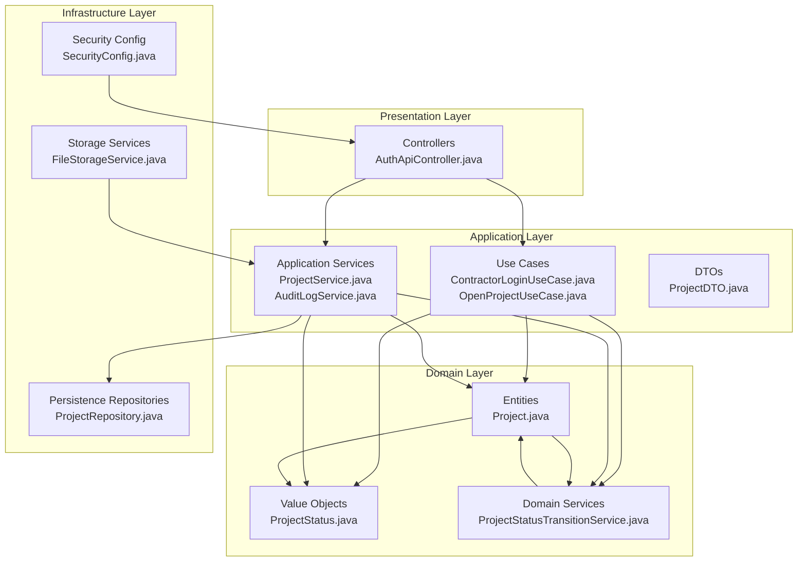
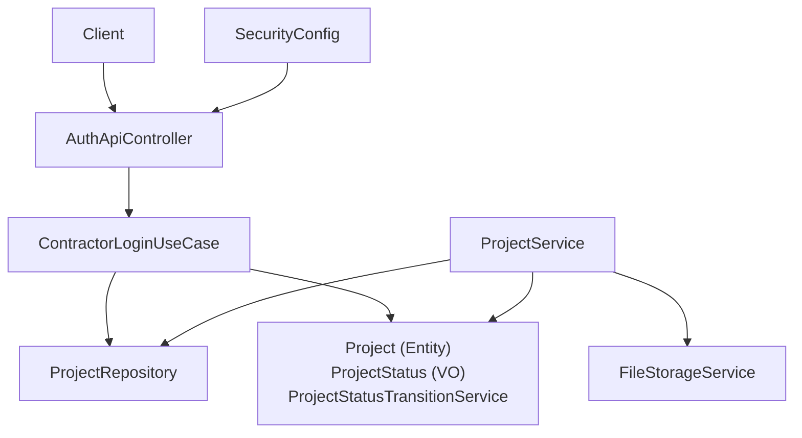
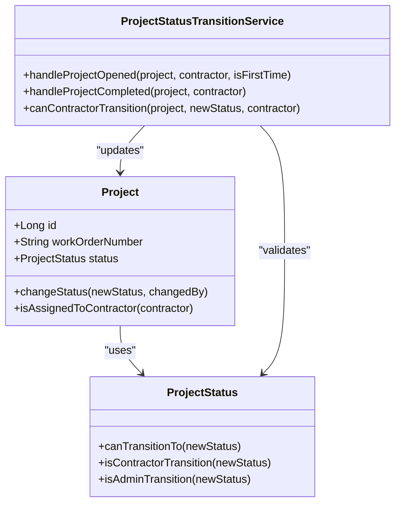
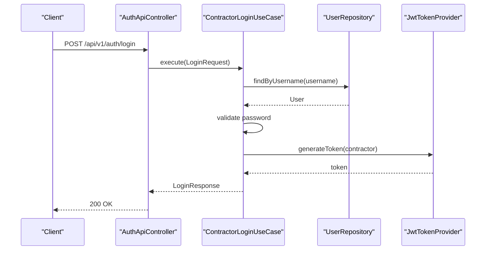
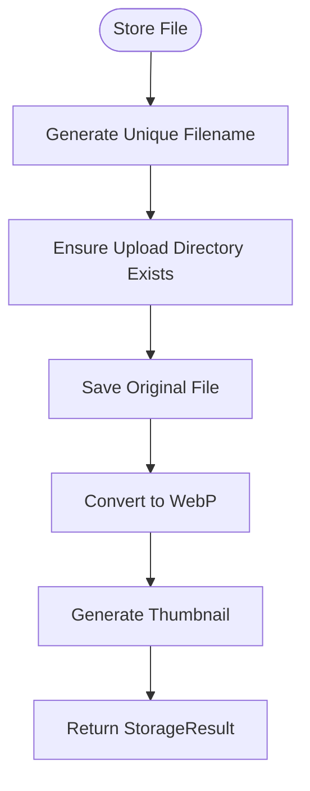
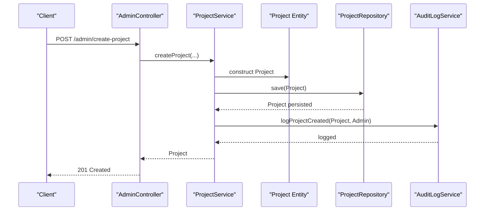
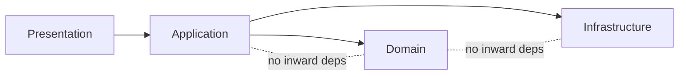

# Clean Architecture Layers

<cite>
**Referenced Files in This Document**
- [SkylinkMediaServiceApplication.java](file://src/main/java/root/cyb/mh/skylink_media_service/SkylinkMediaServiceApplication.java)
- [README.md](file://README.md)
- [application.properties](file://src/main/resources/application.properties)
- [Project.java](file://src/main/java/root/cyb/mh/skylink_media_service/domain/entities/Project.java)
- [ProjectStatus.java](file://src/main/java/root/cyb/mh/skylink_media_service/domain/valueobjects/ProjectStatus.java)
- [ProjectStatusTransitionService.java](file://src/main/java/root/cyb/mh/skylink_media_service/domain/services/ProjectStatusTransitionService.java)
- [ProjectRepository.java](file://src/main/java/root/cyb/mh/skylink_media_service/infrastructure/persistence/ProjectRepository.java)
- [FileStorageService.java](file://src/main/java/root/cyb/mh/skylink_media_service/infrastructure/storage/FileStorageService.java)
- [SecurityConfig.java](file://src/main/java/root/cyb/mh/skylink_media_service/infrastructure/security/SecurityConfig.java)
- [AuthApiController.java](file://src/main/java/root/cyb/mh/skylink_media_service/infrastructure/web/api/AuthApiController.java)
- [ContractorLoginUseCase.java](file://src/main/java/root/cyb/mh/skylink_media_service/application/usecases/ContractorLoginUseCase.java)
- [ProjectService.java](file://src/main/java/root/cyb/mh/skylink_media_service/application/services/ProjectService.java)
- [OpenProjectUseCase.java](file://src/main/java/root/cyb/mh/skylink_media_service/application/usecases/OpenProjectUseCase.java)
- [AuditLogService.java](file://src/main/java/root/cyb/mh/skylink_media_service/application/services/AuditLogService.java)
- [ProjectDTO.java](file://src/main/java/root/cyb/mh/skylink_media_service/application/dto/ProjectDTO.java)
</cite>

## Table of Contents
1. [Introduction](#introduction)
2. [Project Structure](#project-structure)
3. [Core Components](#core-components)
4. [Architecture Overview](#architecture-overview)
5. [Detailed Component Analysis](#detailed-component-analysis)
6. [Dependency Analysis](#dependency-analysis)
7. [Performance Considerations](#performance-considerations)
8. [Troubleshooting Guide](#troubleshooting-guide)
9. [Conclusion](#conclusion)

## Introduction
This document explains the clean architecture implementation in the Skylink Media Service backend. The system follows a strict four-layer structure:
- Presentation: HTTP controllers and API endpoints
- Application: Use cases and application services orchestrating workflows
- Domain: Entities, value objects, domain services, and business rules
- Infrastructure: Persistence, security, and external integrations

The dependency rule is enforced so that dependencies point inward toward the center (business logic), ensuring that higher layers do not depend on lower layers. Interfaces and abstractions isolate the domain from infrastructure concerns, enabling testability and flexibility.

## Project Structure
The backend is organized by layers under the package root.cyb.mh.skylink_media_service. The primary directories are:
- domain: Entities, value objects, domain services, and events
- application: Use cases, application services, DTOs, and specifications
- infrastructure: Persistence repositories, security configuration, web controllers, and storage services
- resources: Configuration and templates

**Diagram sources**
- [AuthApiController.java:1-34](file://src/main/java/root/cyb/mh/skylink_media_service/infrastructure/web/api/AuthApiController.java#L1-L34)
- [ContractorLoginUseCase.java:1-60](file://src/main/java/root/cyb/mh/skylink_media_service/application/usecases/ContractorLoginUseCase.java#L1-L60)
- [OpenProjectUseCase.java:1-52](file://src/main/java/root/cyb/mh/skylink_media_service/application/usecases/OpenProjectUseCase.java#L1-L52)
- [ProjectService.java:1-419](file://src/main/java/root/cyb/mh/skylink_media_service/application/services/ProjectService.java#L1-L419)
- [AuditLogService.java:1-317](file://src/main/java/root/cyb/mh/skylink_media_service/application/services/AuditLogService.java#L1-L317)
- [ProjectDTO.java:1-60](file://src/main/java/root/cyb/mh/skylink_media_service/application/dto/ProjectDTO.java#L1-L60)
- [Project.java:1-262](file://src/main/java/root/cyb/mh/skylink_media_service/domain/entities/Project.java#L1-L262)
- [ProjectStatus.java:1-54](file://src/main/java/root/cyb/mh/skylink_media_service/domain/valueobjects/ProjectStatus.java#L1-L54)
- [ProjectStatusTransitionService.java:1-54](file://src/main/java/root/cyb/mh/skylink_media_service/domain/services/ProjectStatusTransitionService.java#L1-L54)
- [ProjectRepository.java:1-24](file://src/main/java/root/cyb/mh/skylink_media_service/infrastructure/persistence/ProjectRepository.java#L1-L24)
- [SecurityConfig.java:1-104](file://src/main/java/root/cyb/mh/skylink_media_service/infrastructure/security/SecurityConfig.java#L1-L104)
- [FileStorageService.java:1-89](file://src/main/java/root/cyb/mh/skylink_media_service/infrastructure/storage/FileStorageService.java#L1-L89)

**Section sources**
- [README.md:102-116](file://README.md#L102-L116)

## Core Components
This section outlines the responsibilities of each layer and highlights key components that demonstrate separation of concerns.

- Presentation
  - Controllers handle HTTP requests and delegate to application use cases or services.
  - Example: AuthApiController exposes the contractor login endpoint and delegates to ContractorLoginUseCase.

- Application
  - Use cases encapsulate specific workflows and coordinate domain and infrastructure collaborators.
  - Application services implement broader business operations and coordinate repositories and domain services.
  - Examples:
    - ContractorLoginUseCase: authenticates a contractor and produces a JWT-based response.
    - OpenProjectUseCase: updates project status and logs views during contractor project access.
    - ProjectService: manages project lifecycle, enforces business rules, and coordinates persistence and audit logging.
    - AuditLogService: centralizes audit logging for domain and application actions.

- Domain
  - Entities model core business concepts and encapsulate business logic.
  - Value objects represent immutable attributes with validation and transition rules.
  - Domain services enforce complex business rules and publish domain events.
  - Examples:
    - Project: encapsulates status transitions, assignment checks, and business rule validations.
    - ProjectStatus: defines allowed state transitions and role-specific permissions.
    - ProjectStatusTransitionService: orchestrates status changes and publishes domain events.

- Infrastructure
  - Persistence repositories abstract data access.
  - Security configuration integrates authentication and authorization.
  - Storage services manage file handling and optimization.
  - Examples:
    - ProjectRepository: JPA repository for Project entities.
    - SecurityConfig: configures Spring Security, CORS, and filters.
    - FileStorageService: handles file conversion, thumbnails, and cleanup.

**Section sources**
- [AuthApiController.java:1-34](file://src/main/java/root/cyb/mh/skylink_media_service/infrastructure/web/api/AuthApiController.java#L1-L34)
- [ContractorLoginUseCase.java:1-60](file://src/main/java/root/cyb/mh/skylink_media_service/application/usecases/ContractorLoginUseCase.java#L1-L60)
- [OpenProjectUseCase.java:1-52](file://src/main/java/root/cyb/mh/skylink_media_service/application/usecases/OpenProjectUseCase.java#L1-L52)
- [ProjectService.java:1-419](file://src/main/java/root/cyb/mh/skylink_media_service/application/services/ProjectService.java#L1-L419)
- [AuditLogService.java:1-317](file://src/main/java/root/cyb/mh/skylink_media_service/application/services/AuditLogService.java#L1-L317)
- [Project.java:1-262](file://src/main/java/root/cyb/mh/skylink_media_service/domain/entities/Project.java#L1-L262)
- [ProjectStatus.java:1-54](file://src/main/java/root/cyb/mh/skylink_media_service/domain/valueobjects/ProjectStatus.java#L1-L54)
- [ProjectStatusTransitionService.java:1-54](file://src/main/java/root/cyb/mh/skylink_media_service/domain/services/ProjectStatusTransitionService.java#L1-L54)
- [ProjectRepository.java:1-24](file://src/main/java/root/cyb/mh/skylink_media_service/infrastructure/persistence/ProjectRepository.java#L1-L24)
- [SecurityConfig.java:1-104](file://src/main/java/root/cyb/mh/skylink_media_service/infrastructure/security/SecurityConfig.java#L1-L104)
- [FileStorageService.java:1-89](file://src/main/java/root/cyb/mh/skylink_media_service/infrastructure/storage/FileStorageService.java#L1-L89)

## Architecture Overview
The system adheres to clean architecture principles:
- Dependencies point inward toward the domain.
- Application layer orchestrates workflows without embedding infrastructure specifics.
- Domain encapsulates business rules and is isolated from frameworks and databases.
- Infrastructure provides implementations for persistence, security, and external integrations.

**Diagram sources**
- [AuthApiController.java:1-34](file://src/main/java/root/cyb/mh/skylink_media_service/infrastructure/web/api/AuthApiController.java#L1-L34)
- [ContractorLoginUseCase.java:1-60](file://src/main/java/root/cyb/mh/skylink_media_service/application/usecases/ContractorLoginUseCase.java#L1-L60)
- [ProjectService.java:1-419](file://src/main/java/root/cyb/mh/skylink_media_service/application/services/ProjectService.java#L1-L419)
- [Project.java:1-262](file://src/main/java/root/cyb/mh/skylink_media_service/domain/entities/Project.java#L1-L262)
- [ProjectStatus.java:1-54](file://src/main/java/root/cyb/mh/skylink_media_service/domain/valueobjects/ProjectStatus.java#L1-L54)
- [ProjectStatusTransitionService.java:1-54](file://src/main/java/root/cyb/mh/skylink_media_service/domain/services/ProjectStatusTransitionService.java#L1-L54)
- [ProjectRepository.java:1-24](file://src/main/java/root/cyb/mh/skylink_media_service/infrastructure/persistence/ProjectRepository.java#L1-L24)
- [SecurityConfig.java:1-104](file://src/main/java/root/cyb/mh/skylink_media_service/infrastructure/security/SecurityConfig.java#L1-L104)
- [FileStorageService.java:1-89](file://src/main/java/root/cyb/mh/skylink_media_service/infrastructure/storage/FileStorageService.java#L1-L89)

## Detailed Component Analysis

### Domain Layer: Entities, Value Objects, and Domain Services
The Domain layer encapsulates business logic and rules:
- Project entity enforces status transitions and assignment checks.
- ProjectStatus value object defines allowed transitions and role-specific permissions.
- ProjectStatusTransitionService encapsulates status change logic and publishes domain events.

**Diagram sources**
- [Project.java:1-262](file://src/main/java/root/cyb/mh/skylink_media_service/domain/entities/Project.java#L1-L262)
- [ProjectStatus.java:1-54](file://src/main/java/root/cyb/mh/skylink_media_service/domain/valueobjects/ProjectStatus.java#L1-L54)
- [ProjectStatusTransitionService.java:1-54](file://src/main/java/root/cyb/mh/skylink_media_service/domain/services/ProjectStatusTransitionService.java#L1-L54)

**Section sources**
- [Project.java:229-250](file://src/main/java/root/cyb/mh/skylink_media_service/domain/entities/Project.java#L229-L250)
- [ProjectStatus.java:25-52](file://src/main/java/root/cyb/mh/skylink_media_service/domain/valueobjects/ProjectStatus.java#L25-L52)
- [ProjectStatusTransitionService.java:21-47](file://src/main/java/root/cyb/mh/skylink_media_service/domain/services/ProjectStatusTransitionService.java#L21-L47)

### Application Layer: Use Cases and Services
The Application layer orchestrates workflows:
- ContractorLoginUseCase validates credentials, checks contractor role, and generates a JWT response.
- OpenProjectUseCase updates project status and logs contractor views.
- ProjectService implements business operations, enforces rules, and coordinates repositories and audit logging.
- AuditLogService centralizes audit logging across the system.

**Diagram sources**
- [AuthApiController.java:23-32](file://src/main/java/root/cyb/mh/skylink_media_service/infrastructure/web/api/AuthApiController.java#L23-L32)
- [ContractorLoginUseCase.java:29-58](file://src/main/java/root/cyb/mh/skylink_media_service/application/usecases/ContractorLoginUseCase.java#L29-L58)

**Section sources**
- [ContractorLoginUseCase.java:1-60](file://src/main/java/root/cyb/mh/skylink_media_service/application/usecases/ContractorLoginUseCase.java#L1-L60)
- [OpenProjectUseCase.java:1-52](file://src/main/java/root/cyb/mh/skylink_media_service/application/usecases/OpenProjectUseCase.java#L1-L52)
- [ProjectService.java:60-98](file://src/main/java/root/cyb/mh/skylink_media_service/application/services/ProjectService.java#L60-L98)
- [AuditLogService.java:35-55](file://src/main/java/root/cyb/mh/skylink_media_service/application/services/AuditLogService.java#L35-L55)

### Infrastructure Layer: Persistence, Security, and Storage
The Infrastructure layer provides implementations:
- ProjectRepository abstracts data access for Project entities.
- SecurityConfig configures authentication, authorization, CORS, and filters.
- FileStorageService manages file conversion, thumbnails, and cleanup.

**Diagram sources**
- [FileStorageService.java:33-55](file://src/main/java/root/cyb/mh/skylink_media_service/infrastructure/storage/FileStorageService.java#L33-L55)

**Section sources**
- [ProjectRepository.java:1-24](file://src/main/java/root/cyb/mh/skylink_media_service/infrastructure/persistence/ProjectRepository.java#L1-L24)
- [SecurityConfig.java:43-87](file://src/main/java/root/cyb/mh/skylink_media_service/infrastructure/security/SecurityConfig.java#L43-L87)
- [FileStorageService.java:1-89](file://src/main/java/root/cyb/mh/skylink_media_service/infrastructure/storage/FileStorageService.java#L1-L89)

### Practical Data Flow Example: Project Creation
This example demonstrates how data flows from Presentation to Application to Domain and back to Infrastructure.

**Diagram sources**
- [ProjectService.java:60-98](file://src/main/java/root/cyb/mh/skylink_media_service/application/services/ProjectService.java#L60-L98)
- [Project.java:85-115](file://src/main/java/root/cyb/mh/skylink_media_service/domain/entities/Project.java#L85-L115)
- [ProjectRepository.java:13-23](file://src/main/java/root/cyb/mh/skylink_media_service/infrastructure/persistence/ProjectRepository.java#L13-L23)
- [AuditLogService.java:35-55](file://src/main/java/root/cyb/mh/skylink_media_service/application/services/AuditLogService.java#L35-L55)

## Dependency Analysis
Clean architecture enforces dependency direction:
- Presentation depends on Application (use cases/services).
- Application depends on Domain (entities, value objects, domain services).
- Application depends on Infrastructure (repositories, storage, security).
- Domain does not depend on Application, Infrastructure, or Presentation.

**Diagram sources**
- [AuthApiController.java:1-34](file://src/main/java/root/cyb/mh/skylink_media_service/infrastructure/web/api/AuthApiController.java#L1-L34)
- [ContractorLoginUseCase.java:1-60](file://src/main/java/root/cyb/mh/skylink_media_service/application/usecases/ContractorLoginUseCase.java#L1-L60)
- [ProjectService.java:1-419](file://src/main/java/root/cyb/mh/skylink_media_service/application/services/ProjectService.java#L1-L419)
- [Project.java:1-262](file://src/main/java/root/cyb/mh/skylink_media_service/domain/entities/Project.java#L1-L262)
- [ProjectRepository.java:1-24](file://src/main/java/root/cyb/mh/skylink_media_service/infrastructure/persistence/ProjectRepository.java#L1-L24)

**Section sources**
- [Project.java:1-262](file://src/main/java/root/cyb/mh/skylink_media_service/domain/entities/Project.java#L1-L262)
- [ProjectStatusTransitionService.java:1-54](file://src/main/java/root/cyb/mh/skylink_media_service/domain/services/ProjectStatusTransitionService.java#L1-L54)
- [ProjectRepository.java:1-24](file://src/main/java/root/cyb/mh/skylink_media_service/infrastructure/persistence/ProjectRepository.java#L1-L24)

## Performance Considerations
- Use repository methods and JPA Specifications to minimize N+1 queries and optimize filtering.
- Batch operations for bulk updates and deletions to reduce round-trips.
- Asynchronous processing for heavy tasks (e.g., image conversion) using @Async where appropriate.
- Caching frequently accessed metadata (e.g., project counts) at the application layer to reduce database load.
- Keep domain entities lean; avoid loading unnecessary associations until needed.

## Troubleshooting Guide
Common issues and resolutions:
- Authentication failures
  - Verify credentials and contractor role checks in ContractorLoginUseCase.
  - Confirm SecurityConfig permits /api/v1/auth/** and applies JWT filter.
- Authorization errors
  - Review role-based matchers in SecurityConfig for endpoints (/admin, /contractor, /super-admin).
- Project assignment conflicts
  - ProjectService enforces limits (e.g., one active contractor per project, max 4 active projects per contractor).
- Status transition exceptions
  - ProjectStatusTransitionService validates transitions; ensure the current status allows the requested change.
- Audit logging failures
  - AuditLogService wraps logging in try-catch; check logs for JSON serialization errors.

**Section sources**
- [ContractorLoginUseCase.java:32-44](file://src/main/java/root/cyb/mh/skylink_media_service/application/usecases/ContractorLoginUseCase.java#L32-L44)
- [SecurityConfig.java:49-57](file://src/main/java/root/cyb/mh/skylink_media_service/infrastructure/security/SecurityConfig.java#L49-L57)
- [ProjectService.java:122-144](file://src/main/java/root/cyb/mh/skylink_media_service/application/services/ProjectService.java#L122-L144)
- [ProjectStatusTransitionService.java:34-47](file://src/main/java/root/cyb/mh/skylink_media_service/domain/services/ProjectStatusTransitionService.java#L34-L47)
- [AuditLogService.java:52-54](file://src/main/java/root/cyb/mh/skylink_media_service/application/services/AuditLogService.java#L52-L54)

## Conclusion
The Skylink Media Service backend implements clean architecture by enforcing strict layer separation and dependency inversion. The Domain encapsulates business logic, the Application orchestrates workflows via use cases and services, the Presentation handles HTTP requests, and the Infrastructure provides persistence, security, and storage. This structure improves maintainability, testability, and adaptability to change.