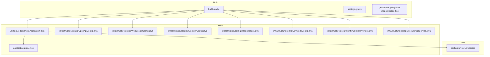
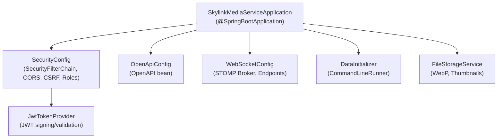
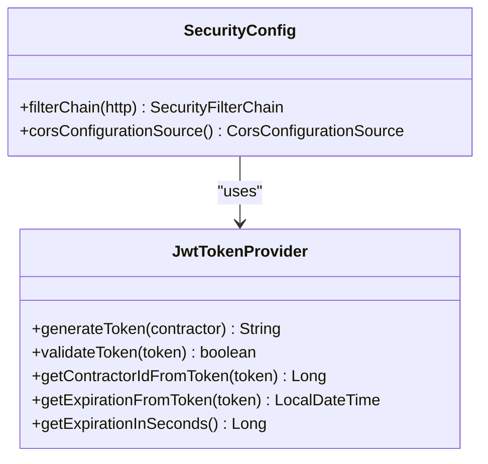
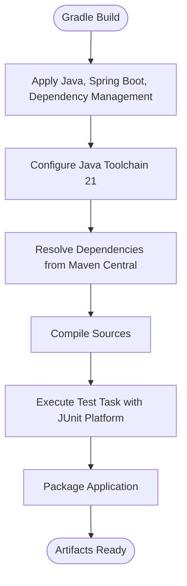
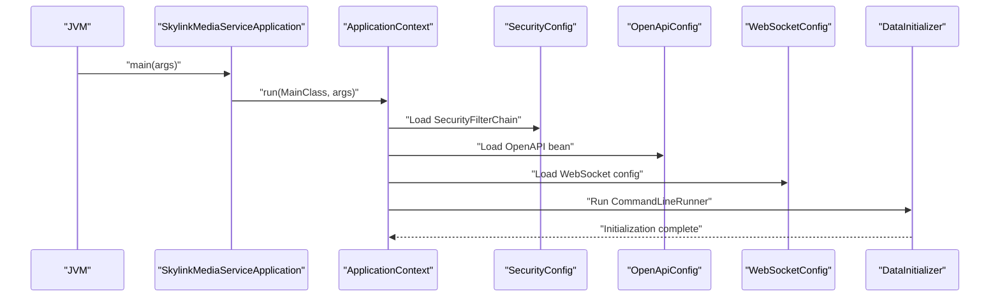
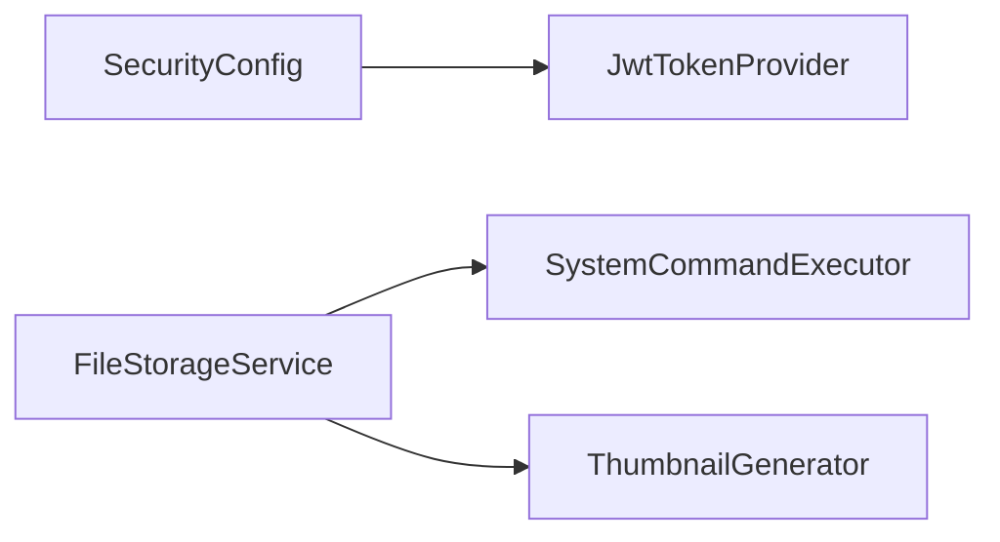

# Spring Boot Configuration

<cite>
**Referenced Files in This Document**
- [SkylinkMediaServiceApplication.java](file://src/main/java/root/cyb/mh/skylink_media_service/SkylinkMediaServiceApplication.java)
- [build.gradle](file://build.gradle)
- [settings.gradle](file://settings.gradle)
- [gradle-wrapper.properties](file://gradle/wrapper/gradle-wrapper.properties)
- [application.properties](file://src/main/resources/application.properties)
- [application-test.properties](file://src/test/resources/application-test.properties)
- [OpenApiConfig.java](file://src/main/java/root/cyb/mh/skylink_media_service/infrastructure/config/OpenApiConfig.java)
- [WebSocketConfig.java](file://src/main/java/root/cyb/mh/skylink_media_service/infrastructure/config/WebSocketConfig.java)
- [SecurityConfig.java](file://src/main/java/root/cyb/mh/skylink_media_service/infrastructure/security/SecurityConfig.java)
- [DataInitializer.java](file://src/main/java/root/cyb/mh/skylink_media_service/infrastructure/config/DataInitializer.java)
- [DevModeConfig.java](file://src/main/java/root/cyb/mh/skylink_media_service/infrastructure/config/DevModeConfig.java)
- [JwtTokenProvider.java](file://src/main/java/root/cyb/mh/skylink_media_service/infrastructure/security/jwt/JwtTokenProvider.java)
- [FileStorageService.java](file://src/main/java/root/cyb/mh/skylink_media_service/infrastructure/storage/FileStorageService.java)
- [README.md](file://README.md)
</cite>

## Table of Contents
1. [Introduction](#introduction)
2. [Project Structure](#project-structure)
3. [Core Components](#core-components)
4. [Architecture Overview](#architecture-overview)
5. [Detailed Component Analysis](#detailed-component-analysis)
6. [Dependency Analysis](#dependency-analysis)
7. [Performance Considerations](#performance-considerations)
8. [Troubleshooting Guide](#troubleshooting-guide)
9. [Conclusion](#conclusion)
10. [Appendices](#appendices)

## Introduction
This document explains the Spring Boot configuration for the Skylink Media Service backend. It covers the main application class setup, component scanning, auto-configuration, Gradle build configuration, and application properties. It also documents environment-specific configurations, property overrides, externalized configuration patterns, Spring profiles, conditional configuration, and the application startup sequence. Practical examples and troubleshooting guidance are included to help developers configure and operate the service reliably.

## Project Structure
The backend is a Spring Boot 4.0.3 application written in Java 21. The primary source tree is under src/main/java with resources under src/main/resources. The Gradle build integrates Spring Boot and dependency management plugins. Tests reside under src/test with their own application-test.properties.

**Diagram sources**
- [build.gradle:1-52](file://build.gradle#L1-L52)
- [settings.gradle:1-2](file://settings.gradle#L1-L2)
- [gradle-wrapper.properties:1-8](file://gradle/wrapper/gradle-wrapper.properties#L1-L8)
- [SkylinkMediaServiceApplication.java:1-18](file://src/main/java/root/cyb/mh/skylink_media_service/SkylinkMediaServiceApplication.java#L1-L18)
- [application.properties:1-58](file://src/main/resources/application.properties#L1-L58)
- [application-test.properties:1-9](file://src/test/resources/application-test.properties#L1-L9)
- [OpenApiConfig.java:1-30](file://src/main/java/root/cyb/mh/skylink_media_service/infrastructure/config/OpenApiConfig.java#L1-L30)
- [WebSocketConfig.java:1-29](file://src/main/java/root/cyb/mh/skylink_media_service/infrastructure/config/WebSocketConfig.java#L1-L29)
- [SecurityConfig.java:1-104](file://src/main/java/root/cyb/mh/skylink_media_service/infrastructure/security/SecurityConfig.java#L1-L104)
- [DataInitializer.java:1-47](file://src/main/java/root/cyb/mh/skylink_media_service/infrastructure/config/DataInitializer.java#L1-L47)
- [DevModeConfig.java:1-25](file://src/main/java/root/cyb/mh/skylink_media_service/infrastructure/config/DevModeConfig.java#L1-L25)
- [JwtTokenProvider.java:1-81](file://src/main/java/root/cyb/mh/skylink_media_service/infrastructure/security/jwt/JwtTokenProvider.java#L1-L81)
- [FileStorageService.java:1-89](file://src/main/java/root/cyb/mh/skylink_media_service/infrastructure/storage/FileStorageService.java#L1-L89)

**Section sources**
- [build.gradle:1-52](file://build.gradle#L1-L52)
- [settings.gradle:1-2](file://settings.gradle#L1-L2)
- [gradle-wrapper.properties:1-8](file://gradle/wrapper/gradle-wrapper.properties#L1-L8)
- [SkylinkMediaServiceApplication.java:1-18](file://src/main/java/root/cyb/mh/skylink_media_service/SkylinkMediaServiceApplication.java#L1-L18)
- [application.properties:1-58](file://src/main/resources/application.properties#L1-L58)
- [application-test.properties:1-9](file://src/test/resources/application-test.properties#L1-L9)

## Core Components
- Main application class: Declares Spring Boot auto-configuration, scheduling, and async capabilities. It runs the SpringApplication bootstrap.
- Auto-configuration: Enabled via the Spring Boot annotation on the main class. Additional configuration classes define beans for OpenAPI, WebSocket messaging, security, and data initialization.
- Component scanning: Occurs implicitly around the main class package and subpackages. No explicit basePackages was declared, so defaults apply.
- Build configuration: Gradle plugin stack includes Spring Boot and dependency management, with Java toolchain set to Java 21. Dependencies include Spring MVC, JPA, Security, WebSocket, Thymeleaf, MapStruct, JWT libraries, and OpenAPI.

**Section sources**
- [SkylinkMediaServiceApplication.java:8-15](file://src/main/java/root/cyb/mh/skylink_media_service/SkylinkMediaServiceApplication.java#L8-L15)
- [build.gradle:1-52](file://build.gradle#L1-L52)

## Architecture Overview
The application initializes Spring’s IoC container and registers configuration beans. Security is configured with Spring Security, including CORS, CSRF, form login/logout, and JWT filters. OpenAPI and WebSocket configurations are registered as beans. Data initialization runs at startup to seed default administrative users. File storage leverages injected services for WebP conversion and thumbnail generation.

**Diagram sources**
- [SkylinkMediaServiceApplication.java:8-15](file://src/main/java/root/cyb/mh/skylink_media_service/SkylinkMediaServiceApplication.java#L8-L15)
- [SecurityConfig.java:21-88](file://src/main/java/root/cyb/mh/skylink_media_service/infrastructure/security/SecurityConfig.java#L21-L88)
- [OpenApiConfig.java:11-29](file://src/main/java/root/cyb/mh/skylink_media_service/infrastructure/config/OpenApiConfig.java#L11-L29)
- [WebSocketConfig.java:9-28](file://src/main/java/root/cyb/mh/skylink_media_service/infrastructure/config/WebSocketConfig.java#L9-L28)
- [DataInitializer.java:14-46](file://src/main/java/root/cyb/mh/skylink_media_service/infrastructure/config/DataInitializer.java#L14-L46)
- [JwtTokenProvider.java:16-80](file://src/main/java/root/cyb/mh/skylink_media_service/infrastructure/security/jwt/JwtTokenProvider.java#L16-L80)
- [FileStorageService.java:17-31](file://src/main/java/root/cyb/mh/skylink_media_service/infrastructure/storage/FileStorageService.java#L17-L31)

## Detailed Component Analysis

### Main Application Class
- Purpose: Bootstraps the Spring application context and enables scheduling and async processing.
- Behavior: Uses the standard SpringApplication.run entry point.

**Section sources**
- [SkylinkMediaServiceApplication.java:11-15](file://src/main/java/root/cyb/mh/skylink_media_service/SkylinkMediaServiceApplication.java#L11-L15)

### Component Scanning and Auto-Configuration
- Scanning: Defaults to the main class package and subpackages. No explicit basePackages were declared.
- Auto-configuration: Enabled by the Spring Boot annotation on the main class. Additional @Configuration classes contribute beans for security, OpenAPI, WebSocket, and data initialization.

**Section sources**
- [SkylinkMediaServiceApplication.java:8-10](file://src/main/java/root/cyb/mh/skylink_media_service/SkylinkMediaServiceApplication.java#L8-L10)

### Security Configuration
- SecurityFilterChain: Configures CORS, CSRF, form login, logout, session policy, exception handling, and role-based access for endpoints.
- CORS: Defined centrally and applied to API paths.
- JWT: Integrated via a custom filter and entry point. Validation and token extraction are handled by a dedicated provider bean.

**Diagram sources**
- [SecurityConfig.java:43-88](file://src/main/java/root/cyb/mh/skylink_media_service/infrastructure/security/SecurityConfig.java#L43-L88)
- [JwtTokenProvider.java:25-79](file://src/main/java/root/cyb/mh/skylink_media_service/infrastructure/security/jwt/JwtTokenProvider.java#L25-L79)

**Section sources**
- [SecurityConfig.java:21-104](file://src/main/java/root/cyb/mh/skylink_media_service/infrastructure/security/SecurityConfig.java#L21-L104)
- [JwtTokenProvider.java:16-80](file://src/main/java/root/cyb/mh/skylink_media_service/infrastructure/security/jwt/JwtTokenProvider.java#L16-L80)

### OpenAPI Configuration
- Bean registration: Defines the OpenAPI info, version, and a bearerAuth security scheme for JWT.

**Section sources**
- [OpenApiConfig.java:11-29](file://src/main/java/root/cyb/mh/skylink_media_service/infrastructure/config/OpenApiConfig.java#L11-L29)

### WebSocket Configuration
- Broker: Memory-backed simple broker for topics.
- Endpoints: STOMP endpoint registered at /ws with SockJS fallback.
- Destination prefixes: Application destination prefixes configured.

**Section sources**
- [WebSocketConfig.java:9-28](file://src/main/java/root/cyb/mh/skylink_media_service/infrastructure/config/WebSocketConfig.java#L9-L28)

### Data Initialization
- Purpose: Seeds default SuperAdmin and Admin users during startup if missing.
- Order: Runs with a specific order to ensure repositories are ready.

**Section sources**
- [DataInitializer.java:14-46](file://src/main/java/root/cyb/mh/skylink_media_service/infrastructure/config/DataInitializer.java#L14-L46)

### Development Mode Configuration
- Prefix: app.dev controls development-only features.
- Example usage: Controls availability of features like project deletion in development.

**Section sources**
- [DevModeConfig.java:7-24](file://src/main/java/root/cyb/mh/skylink_media_service/infrastructure/config/DevModeConfig.java#L7-L24)

### File Storage Service
- Properties: Upload directory is configurable via app.upload.dir with a default.
- Processing: Saves original, converts to WebP, generates thumbnails, and logs results.

**Section sources**
- [FileStorageService.java:22-55](file://src/main/java/root/cyb/mh/skylink_media_service/infrastructure/storage/FileStorageService.java#L22-L55)

### Gradle Build Configuration
- Plugins: Java, Spring Boot, and dependency management.
- Java toolchain: Java 21.
- Repositories: Maven Central.
- Dependencies: Spring starters, JPA, mail, security, web, websocket, Thymeleaf, MapStruct, JWT, OpenAPI, and test dependencies.
- Tasks: Test task configured to use JUnit Platform.

**Diagram sources**
- [build.gradle:1-52](file://build.gradle#L1-L52)

**Section sources**
- [build.gradle:1-52](file://build.gradle#L1-L52)
- [settings.gradle:1-2](file://settings.gradle#L1-L2)
- [gradle-wrapper.properties:1-8](file://gradle/wrapper/gradle-wrapper.properties#L1-L8)

### Application Properties and Environment-Specific Configuration
- Database: PostgreSQL connection URL, username, password, Hibernate dialect, and DDL auto mode.
- File upload: Max file/request sizes and upload directory.
- Development mode: app.dev flag.
- Thymeleaf: Cache disabled for development.
- Logging: Root package debug level for a specific controller.
- JWT: Secret, expiration, header, and prefix.
- API: Version and base path.
- CORS: Allowed origins, methods, headers, and max age.
- Mail: SMTP host, port, credentials, SSL settings, timeouts, and sender identity.
- Test environment: H2 in-memory database with schema generation and console enabled.

**Section sources**
- [application.properties:1-58](file://src/main/resources/application.properties#L1-L58)
- [application-test.properties:1-9](file://src/test/resources/application-test.properties#L1-L9)

### Externalized Configuration Patterns
- Property precedence: application.properties provides defaults; environment variables and system properties override them at runtime.
- Profiles: Not explicitly defined in the provided files; Spring Boot defaults apply if no active profile is set.
- Conditional configuration: Beans can be conditionally enabled via @ConditionalOnProperty or similar mechanisms; no such annotations are present in the analyzed files.

**Section sources**
- [application.properties:1-58](file://src/main/resources/application.properties#L1-L58)

### Application Startup Sequence
- Bootstrap: Main class triggers SpringApplication.run.
- Context refresh: Loads @Configuration classes, registers beans, and applies auto-configuration.
- Lifecycle hooks: CommandLineRunner executes after context refresh completes.
- Security chain: Filter chain is established with CORS, CSRF, authentication entry point, and JWT filter.
- OpenAPI and WebSocket: Beans are initialized and endpoints become available.
- File storage: Services are ready for use.

**Diagram sources**
- [SkylinkMediaServiceApplication.java:13-15](file://src/main/java/root/cyb/mh/skylink_media_service/SkylinkMediaServiceApplication.java#L13-L15)
- [SecurityConfig.java:43-88](file://src/main/java/root/cyb/mh/skylink_media_service/infrastructure/security/SecurityConfig.java#L43-L88)
- [OpenApiConfig.java:14-28](file://src/main/java/root/cyb/mh/skylink_media_service/infrastructure/config/OpenApiConfig.java#L14-L28)
- [WebSocketConfig.java:13-27](file://src/main/java/root/cyb/mh/skylink_media_service/infrastructure/config/WebSocketConfig.java#L13-L27)
- [DataInitializer.java:30-45](file://src/main/java/root/cyb/mh/skylink_media_service/infrastructure/config/DataInitializer.java#L30-L45)

## Dependency Analysis
- Internal dependencies: SecurityConfig depends on JwtTokenProvider and related handlers; FileStorageService depends on SystemCommandExecutor and ThumbnailGenerator (injected).
- External dependencies: Spring Boot starters, PostgreSQL driver, JWT libraries, OpenAPI, MapStruct, Thymeleaf extras, and testing libraries.

**Diagram sources**
- [SecurityConfig.java:28-35](file://src/main/java/root/cyb/mh/skylink_media_service/infrastructure/security/SecurityConfig.java#L28-L35)
- [JwtTokenProvider.java:16-23](file://src/main/java/root/cyb/mh/skylink_media_service/infrastructure/security/jwt/JwtTokenProvider.java#L16-L23)
- [FileStorageService.java:25-31](file://src/main/java/root/cyb/mh/skylink_media_service/infrastructure/storage/FileStorageService.java#L25-L31)

**Section sources**
- [build.gradle:21-47](file://build.gradle#L21-L47)

## Performance Considerations
- Database: Use connection pooling and tune DDL auto mode for production. Consider schema migration tools instead of update.
- File processing: Offload heavy conversions to background tasks if throughput increases; monitor disk I/O and CPU usage.
- Logging: Keep debug logging scoped to specific packages to reduce overhead in production.
- CORS: Limit allowed origins and methods to minimize preflight overhead.

## Troubleshooting Guide
- Database connectivity: Verify JDBC URL, username, and password in application properties. Confirm PostgreSQL is reachable and the database exists.
- JWT validation failures: Ensure jwt.secret matches across nodes and expiration is reasonable. Check token issuance and parsing logic.
- File upload errors: Confirm app.upload.dir exists and is writable. Validate WebP tool availability and permissions.
- CORS issues: Align allowed origins/methods/headers with frontend origin and request types.
- Test failures: Tests use H2 in-memory database; confirm schema generation and console access for diagnostics.
- Startup hangs: Review DataInitializer logs and ensure no blocking operations during context refresh.

**Section sources**
- [application.properties:3-8](file://src/main/resources/application.properties#L3-L8)
- [JwtTokenProvider.java:39-48](file://src/main/java/root/cyb/mh/skylink_media_service/infrastructure/security/jwt/JwtTokenProvider.java#L39-L48)
- [FileStorageService.java:62-68](file://src/main/java/root/cyb/mh/skylink_media_service/infrastructure/storage/FileStorageService.java#L62-L68)
- [application-test.properties:2-8](file://src/test/resources/application-test.properties#L2-L8)

## Conclusion
The Skylink Media Service leverages Spring Boot auto-configuration and a clean separation of concerns across configuration classes. The Gradle build targets Java 21 and pulls in modern Spring ecosystem dependencies. Application properties centralize configuration for databases, security, file storage, logging, and mail. By following the patterns outlined here—externalized properties, environment-specific overrides, and modular configuration—teams can reliably deploy and operate the service across environments.

## Appendices
- Quick property reference:
  - Database: spring.datasource.* and spring.jpa.*
  - File upload: spring.servlet.multipart.* and app.upload.dir
  - Dev mode: app.dev
  - Thymeleaf: spring.thymeleaf.cache
  - Logging: logging.level.*
  - JWT: jwt.*
  - API: api.*
  - CORS: cors.*
  - Mail: spring.mail.* and app.mail.*

**Section sources**
- [application.properties:1-58](file://src/main/resources/application.properties#L1-L58)
- [README.md:34-88](file://README.md#L34-L88)